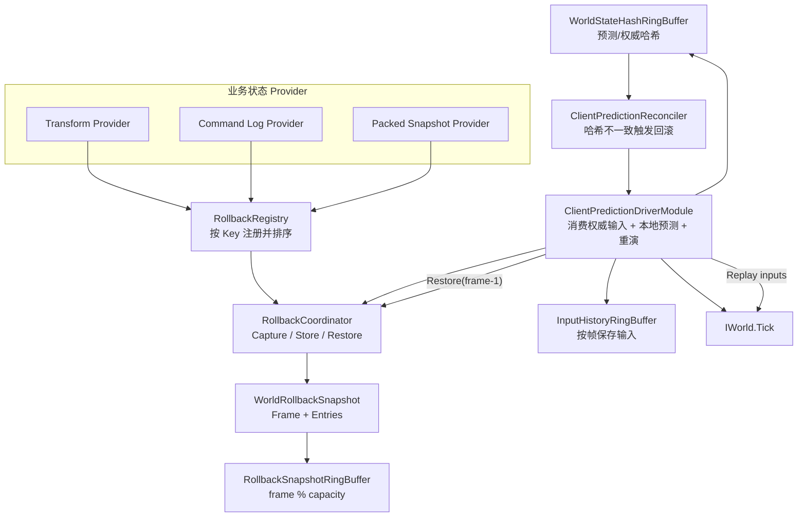
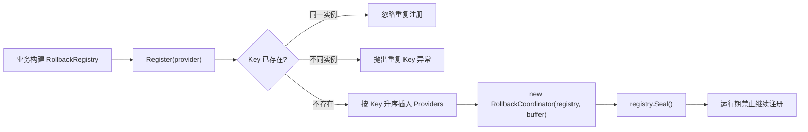
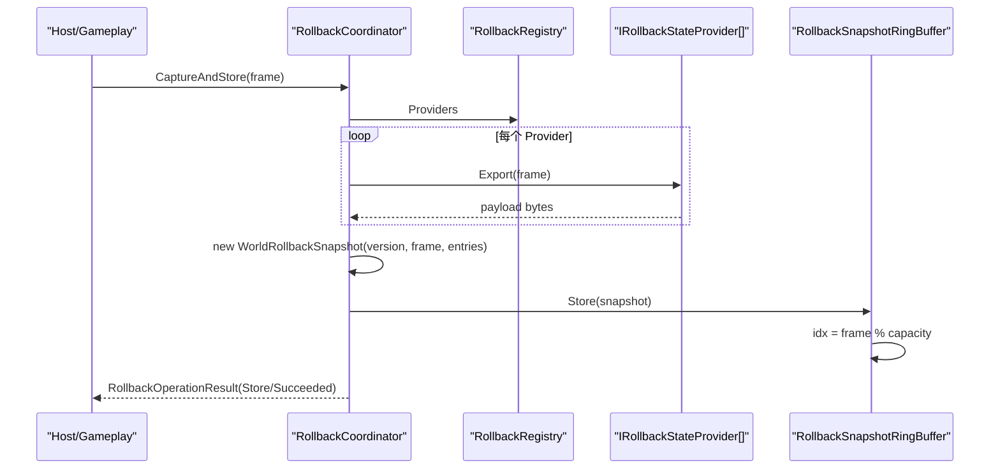
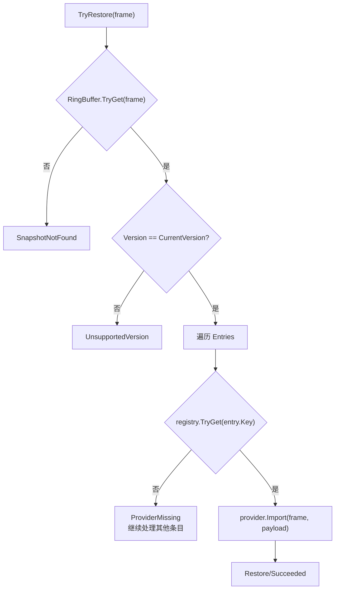
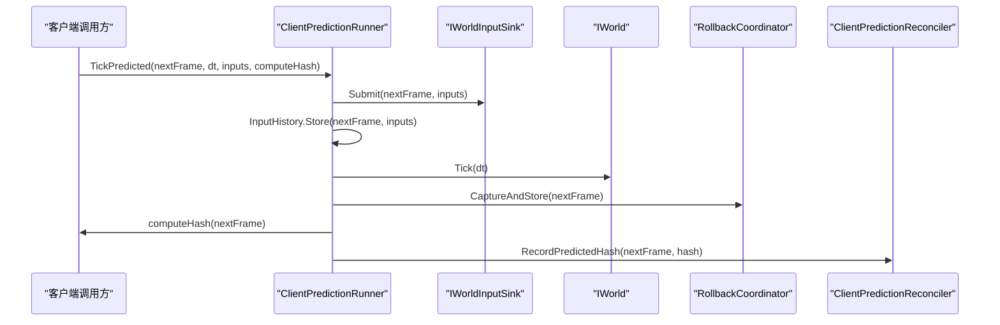
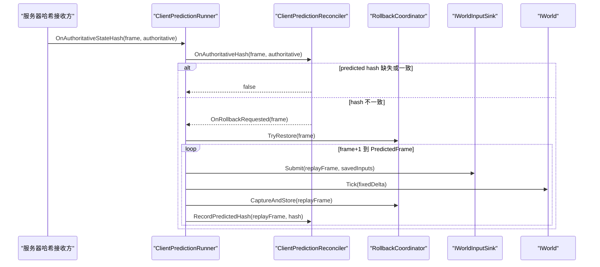
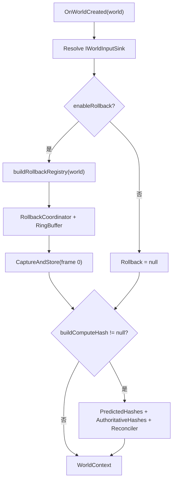
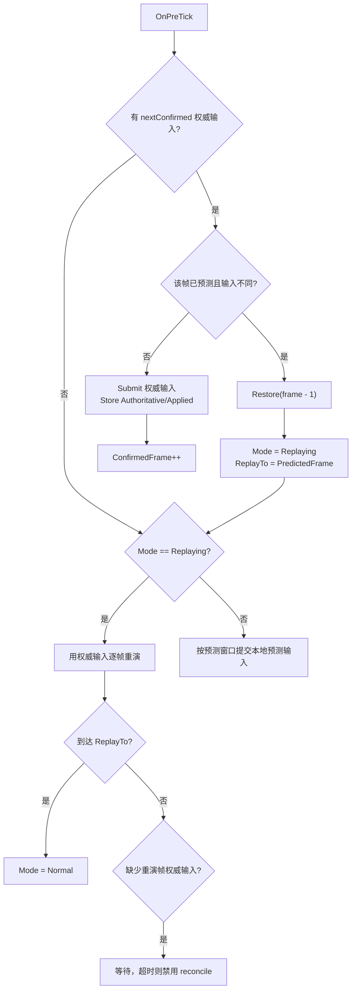
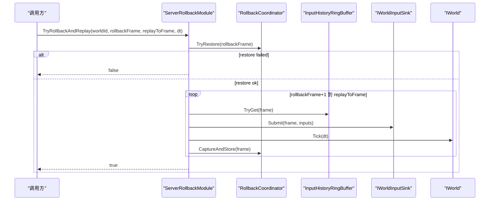

# 7.3 回滚预测

> 基于真实源码说明 AbilityKit 的回滚预测能力：`IRollbackStateProvider` 多 Provider 快照、`RollbackCoordinator` 捕获/恢复、环形历史缓存、输入历史、状态哈希冲突检测、客户端预测重演、服务端回滚重演，以及 MOBA/Shooter Demo 的接入方式。

---

## 目录

1. [能力定位](#1-能力定位)
2. [源码入口](#2-源码入口)
3. [总体结构](#3-总体结构)
4. [回滚快照模型](#4-回滚快照模型)
5. [Provider 注册与确定性顺序](#5-provider-注册与确定性顺序)
6. [捕获、缓存与恢复流程](#6-捕获缓存与恢复流程)
7. [客户端预测与重演](#7-客户端预测与重演)
8. [Host Extension 集成](#8-host-extension-集成)
9. [Demo 接入：MOBA 与 Shooter](#9-demo-接入moba-与-shooter)
10. [设计约束与查漏补缺](#10-设计约束与查漏补缺)

---

## 1. 能力定位

AbilityKit 的回滚预测不是单一算法，而是一组围绕“保存过去状态、发现分歧、恢复到旧帧、重新模拟到当前帧”的基础设施。

| 能力 | 作用 | 代表类型 |
|------|------|----------|
| 状态导出/导入 | 由业务模块定义如何把局部状态序列化为字节并恢复 | `IRollbackStateProvider` |
| Provider 注册 | 管理多个状态域，保证导出/导入顺序稳定 | `RollbackRegistry` |
| 世界回滚快照 | 将一个帧上的多个 Provider payload 聚合为快照 | `WorldRollbackSnapshot`、`WorldRollbackSnapshotEntry` |
| 快照缓存 | 用固定容量环形数组保存最近 N 帧快照 | `RollbackSnapshotRingBuffer` |
| 回滚协调 | 捕获、存储、恢复、清理和操作结果上报 | `RollbackCoordinator`、`RollbackOperationResult` |
| 输入历史 | 保存预测帧或权威帧输入，用于恢复后重演 | `InputHistoryRingBuffer` |
| 哈希校验 | 比较预测状态与权威状态，发现分歧 | `WorldStateHashRingBuffer`、`ClientPredictionReconciler` |
| Host 集成 | 在 Host Tick 生命周期中消费权威输入、预测本地输入、回滚重演 | `ClientPredictionDriverModule`、`ServerRollbackModule` |

回滚预测与状态同步、帧同步的关系：

- 帧同步提供“按帧提交输入并推进世界”的确定性基础。
- 状态同步提供权威快照或状态哈希，用于判断客户端是否偏离服务器。
- 回滚预测在偏离时恢复到某个历史帧，然后用保存的输入重新推进。
- 业务状态是否能回滚，取决于业务是否注册了足够完整的 `IRollbackStateProvider`。

---

## 2. 源码入口

| 源码 | 说明 |
|------|------|
| [IRollbackStateProvider.cs](../../../Unity/Packages/com.abilitykit.world.framesync/Runtime/FrameSync/Rollback/IRollbackStateProvider.cs) | 回滚状态 Provider 接口，定义 `Key`、`Export`、`Import` |
| [RollbackRegistry.cs](../../../Unity/Packages/com.abilitykit.world.framesync/Runtime/FrameSync/Rollback/RollbackRegistry.cs) | Provider 注册表，按 `Key` 排序并在 Coordinator 构造时封存 |
| [WorldRollbackSnapshot.cs](../../../Unity/Packages/com.abilitykit.world.framesync/Runtime/FrameSync/Rollback/WorldRollbackSnapshot.cs) | 回滚快照与条目结构，使用 `BinaryObjectCodec` 编解码 |
| [RollbackSnapshotRingBuffer.cs](../../../Unity/Packages/com.abilitykit.world.framesync/Runtime/FrameSync/Rollback/RollbackSnapshotRingBuffer.cs) | 固定容量回滚快照环形缓存 |
| [RollbackEntriesArrayPool.cs](../../../Unity/Packages/com.abilitykit.world.framesync/Runtime/FrameSync/Rollback/RollbackEntriesArrayPool.cs) | 快照条目数组池，降低捕获时分配 |
| [RollbackCoordinator.cs](../../../Unity/Packages/com.abilitykit.world.framesync/Runtime/FrameSync/Rollback/RollbackCoordinator.cs) | 回滚核心协调器，负责捕获、存储、恢复、清理 |
| [RollbackOperationResult.cs](../../../Unity/Packages/com.abilitykit.world.framesync/Runtime/FrameSync/Rollback/RollbackOperationResult.cs) | 回滚操作状态、错误类型和统计信息 |
| [InputHistoryRingBuffer.cs](../../../Unity/Packages/com.abilitykit.world.framesync/Runtime/FrameSync/Rollback/InputHistoryRingBuffer.cs) | 按帧保存输入数组的环形缓存 |
| [WorldStateHashRingBuffer.cs](../../../Unity/Packages/com.abilitykit.world.framesync/Runtime/FrameSync/Rollback/WorldStateHashRingBuffer.cs) | 按帧保存状态哈希的环形缓存 |
| [ClientPredictionReconciler.cs](../../../Unity/Packages/com.abilitykit.world.framesync/Runtime/FrameSync/Rollback/ClientPredictionReconciler.cs) | 比较预测哈希与权威哈希，触发回滚请求 |
| [ClientPredictionRunner.cs](../../../Unity/Packages/com.abilitykit.world.framesync/Runtime/FrameSync/Rollback/ClientPredictionRunner.cs) | 轻量客户端预测 Runner：提交输入、Tick、捕获、哈希记录、恢复重演 |
| [ClientPredictionDriverModule.cs](../../../Unity/Packages/com.abilitykit.host.extension/Runtime/FrameSync/ClientPredictionDriverModule.cs) | Host Extension 中完整的远端输入驱动、预测窗口、回滚和重演模块 |
| [ServerRollbackModule.cs](../../../Unity/Packages/com.abilitykit.host.extension/Runtime/Rollback/ServerRollbackModule.cs) | 服务端回滚重演模块，监听帧同步事件并保存输入/快照 |
| [ShooterPackedSnapshotRollbackProvider.cs](../../../Unity/Packages/com.abilitykit.demo.shooter.runtime/Runtime/Application/Rollback/ShooterPackedSnapshotRollbackProvider.cs) | Shooter 使用 packed snapshot 作为回滚状态 payload |
| [ShooterClientFrameSyncController.cs](../../../Unity/Packages/com.abilitykit.demo.shooter.view.runtime/Runtime/Client/Synchronization/ShooterClientFrameSyncController.cs) | Shooter 客户端侧创建 RollbackCoordinator 并支持恢复预测快照 |
| [RemoteDrivenRuntimeModuleFactory.cs](../../../Unity/Packages/com.abilitykit.demo.moba.view.runtime/Runtime/Game/Battle/Client/Session/Features/Sim/RemoteDrivenRuntimeModuleFactory.cs) | MOBA 远端驱动模式创建 `ClientPredictionDriverModule` |

---

## 3. 总体结构



核心思想是：框架不尝试理解业务对象结构，而是要求每个可回滚状态域提供自己的导出/导入实现。Coordinator 只处理“某一帧有哪些 payload、按什么顺序恢复、历史保存多久、失败如何上报”。

---

## 4. 回滚快照模型

### 4.1 Provider 条目

`WorldRollbackSnapshotEntry` 是单个状态域的序列化结果：

```csharp
public readonly struct WorldRollbackSnapshotEntry
{
    public readonly int Key;
    public readonly byte[] Payload;
}
```

其中：

- `Key` 来自 `IRollbackStateProvider.Key`，用于恢复时找到对应 Provider。
- `Payload` 是业务自定义字节数组，框架不解析。
- 空 payload 是合法的，典型例子是 `CommandRollbackStateProvider.Export` 返回 `Array.Empty<byte>()`，恢复时只让命令日志裁剪到指定帧之后。

### 4.2 世界快照

`WorldRollbackSnapshot` 聚合某一帧全部 Provider 条目：

```csharp
public readonly struct WorldRollbackSnapshot
{
    public readonly int Version;
    public readonly FrameIndex Frame;
    public readonly WorldRollbackSnapshotEntry[] Entries;
}
```

设计要点：

- `Version` 当前由 `WorldRollbackSnapshotCodec.CurrentVersion` 固定为 `1`。
- `Frame` 是快照对应的模拟帧。
- `Entries` 使用数组承载，捕获时通过 `RollbackEntriesArrayPool` 复用。
- `WorldRollbackSnapshotCodec` 用 `BinaryObjectCodec.Encode/Decode` 做二进制编解码，可用于跨模块传输或持久化。

---

## 5. Provider 注册与确定性顺序

`RollbackRegistry` 负责收集 Provider，并在 `RollbackCoordinator` 构造时被 `Seal()` 封存。



关键约束：

1. **Key 必须全局稳定**：同一业务状态域在客户端和服务器使用相同 Key。
2. **Key 不可冲突**：不同 Provider 使用同一 Key 会抛异常。
3. **顺序确定**：注册时按 Key 升序插入 `_providers`，捕获和恢复遍历顺序稳定。
4. **构造后封存**：`RollbackCoordinator` 构造函数会调用 `_registry.Seal()`，之后注册会抛异常，避免运行期 Provider 集合变化导致快照不兼容。

---

## 6. 捕获、缓存与恢复流程

### 6.1 捕获并存储

`RollbackCoordinator.Capture(frame)` 遍历所有 Provider：

1. 从 `RollbackRegistry.Providers` 取出按 Key 排序的 Provider。
2. 对每个 Provider 调用 `Export(frame)`。
3. 将返回 payload 包装成 `WorldRollbackSnapshotEntry`。
4. 通过 `RollbackEntriesArrayPool.Rent(count)` 租用条目数组。
5. 构造 `WorldRollbackSnapshot(CurrentVersion, frame, entries)`。
6. `CaptureAndStore(frame)` 再把快照写入 `RollbackSnapshotRingBuffer`。



### 6.2 环形缓存

`RollbackSnapshotRingBuffer` 使用固定容量数组保存快照：

```csharp
var idx = Mod(snapshot.Frame.Value, _capacity);
_frames[idx] = snapshot.Frame;
_snapshots[idx] = snapshot;
_has[idx] = true;
```

读取时必须精确匹配帧号：

```csharp
if (_has[idx] && _frames[idx].Value == frame.Value)
{
    snapshot = _snapshots[idx];
    return true;
}
```

因此它的语义是“最近 N 帧精确历史”，不是时间线数据库。超过容量的旧帧会被同余位置覆盖，覆盖时释放旧快照的 `Entries` 数组。

### 6.3 恢复

`RollbackCoordinator.TryRestore(frame)` 首先从 ring buffer 找快照；找不到会返回 `SnapshotNotFound`。找到后进入 `Restore(snapshot)`：



恢复异常处理分两层：

- Provider 缺失：记录 `ProviderMissing`，但继续处理其他条目。
- Provider 导入抛异常：记录 `ProviderFailed` 并继续向上抛，让调用方知道恢复不可继续。

`RollbackOperationResult` 中包含：操作类型、状态、帧、ProviderKey、ProviderCount、PayloadBytes、Message、Exception，可用于日志和观测。

---

## 7. 客户端预测与重演

AbilityKit 中有两个层级的客户端预测实现：

1. `ClientPredictionRunner`：轻量封装，适合测试或简单客户端。
2. `ClientPredictionDriverModule`：Host Extension 的正式运行时模块，包含远端输入源、本地输入源、预测窗口、权威输入对账、哈希对账和 replay 超时保护。

### 7.1 轻量 Runner

`ClientPredictionRunner.TickPredicted` 的流程：



收到权威哈希时：



需要注意一个源码事实：轻量 `ClientPredictionRunner.HandleRollbackRequested` 当前直接 `TryRestore(rollbackFrame)`，其中 `rollbackFrame` 是 `ClientPredictionReconciler` 触发的哈希不一致帧。Host Extension 的完整模块则会回滚到 `mismatchFrame - 1`，再从分歧帧开始重演。正式游戏接入更应该参考 `ClientPredictionDriverModule` 的逻辑。

### 7.2 哈希对账

`ClientPredictionReconciler` 本身很薄：

- `RecordPredictedHash(frame, hash)` 将预测哈希写入 `WorldStateHashRingBuffer`。
- `OnAuthoritativeHash(frame, authoritative)` 查找同帧预测哈希。
- 查不到预测哈希时返回 `false`，调用方可稍后重试。
- 找到且值不同，触发 `OnRollbackRequested(frame)`。

这意味着框架只规定“何时认为分歧发生”，不规定“状态哈希如何计算”。状态哈希由业务传入，例如 Shooter 的 `ShooterStateHasher` 或 MOBA 的 actor transform hash。

---

## 8. Host Extension 集成

### 8.1 ClientPredictionDriverModule

`ClientPredictionDriverModule` 是当前最完整的客户端预测/回滚模块。它挂到 `HostRuntimeOptions.PreTick` 和 `PostTick`：

- `OnPreTick`：消费权威输入、推进预测输入或执行 replay。
- `OnPostTick`：定期捕获快照、计算预测哈希、处理延迟到达的权威哈希。

#### 创建 WorldContext

World 创建时模块会：

1. 从 `world.Services` 解析 `IWorldInputSink`。
2. 如果启用回滚，构建 `RollbackRegistry`，创建 `RollbackCoordinator` 和 `RollbackSnapshotRingBuffer`。
3. 捕获第 0 帧初始状态。
4. 如果提供 `buildComputeHash`，创建预测/权威哈希 ring buffer 和 `ClientPredictionReconciler`。
5. 注册 `OnRollbackRequested` 回调到 `RequestReconcileRollback`。



#### 权威输入与预测输入

`OnPreTick` 的主循环可以理解为三个阶段：

1. **优先消费权威输入**：如果远端输入源已经有下一确认帧输入，则提交到 `IWorldInputSink`，保存到 `AuthoritativeInputs` 和 `AppliedInputs`，推进 `ConfirmedFrame`。
2. **如果发现预测输入和权威输入不同**：恢复到 `frame - 1`，进入 replay 模式。
3. **没有权威输入可消费时做本地预测**：根据预测窗口、本地输入队列和时间同步限制提交预测输入。



#### 哈希不一致触发回滚

权威状态哈希通过 `OnAuthoritativeStateHash(worldId, frame, hash)` 进入模块：

1. 写入 `AuthoritativeHashes`。
2. 如果同帧预测哈希还不存在，则跳过，等待 `OnPostTick` 记录预测哈希后再比较。
3. 如果预测哈希存在，调用 `ClientPredictionReconciler.OnAuthoritativeHash`。
4. 不一致时 `RequestReconcileRollback` 恢复到 `mismatchFrame - 1`，设置 replay 到当前 `PredictedFrame`。

`OnPostTick` 会捕获当前 `PredictedFrame` 的快照，并在存在 `ComputeHash` 时记录预测哈希。如果之前已经收到该帧权威哈希，会立刻做补偿比较。

### 8.2 ServerRollbackModule

`ServerRollbackModule` 面向服务端或权威模拟端。它依赖 `FrameSyncDriverModule` 暴露的 `IFrameSyncDriverEvents`：

- `AddInputsFlushed`：输入被提交到世界前后，保存该帧输入到 `InputHistoryRingBuffer`。
- `AddPostStep`：每 N 帧捕获一次回滚快照。

`TryRollbackAndReplay(worldId, rollbackFrame, replayToFrame, deltaTimePerFrame)` 的流程：



服务端回滚常用于延迟补偿、权威重演或调试确定性；客户端回滚则用于隐藏网络延迟并修正预测分歧。

---

## 9. Demo 接入：MOBA 与 Shooter

### 9.1 MOBA：RemoteDrivenRuntimeModuleFactory

MOBA 的远端驱动运行时通过 `RemoteDrivenRuntimeModuleFactory` 创建 `ClientPredictionDriverModule`：

- 开启客户端预测时：`enableRollback: true`、`rollbackHistoryFrames: 240`、`rollbackCaptureEveryNFrames: 1`。
- 回滚 Provider 由 `options.BuildRollbackRegistry` 注入。
- 状态哈希由 `options.BuildComputeHash` 注入。
- 远端输入来自 `options.ResolveRemoteInputs`。
- 本地输入来自 `options.ResolveLocalInputs`。
- 还可以通过 `ResolveIdealFrameLimit` 结合时间同步限制预测超前量。

实际 registry 构建会注册 MOBA actor transform 这类业务 Provider。测试用例中还会注册被动技能触发事件日志 Provider，说明回滚不只覆盖实体位置，也应覆盖会影响未来结果的事件/命令日志。

### 9.2 Shooter：packed snapshot 作为回滚状态

Shooter 侧使用 `ShooterPackedSnapshotRollbackProvider`：

```csharp
public byte[] Export(FrameIndex frame)
{
    return _runtime.ExportPackedSnapshotBytes(_worldId, isFullSnapshot: true, authorityOverride: false);
}

public void Import(FrameIndex frame, byte[] payload)
{
    _runtime.ImportPackedSnapshotBytes(payload);
}
```

这表示 Shooter 的回滚状态不是由多个细粒度 component Provider 组成，而是复用其状态同步 packed snapshot 编解码能力：

```mermaid
flowchart LR
    Runtime["ShooterBattleRuntimePort"] --> Export["ExportPackedSnapshotBytes"]
    Export --> Provider["ShooterPackedSnapshotRollbackProvider.Export"]
    Provider --> Coordinator["RollbackCoordinator.CaptureAndStore"]
    Coordinator --> Restore["RollbackCoordinator.TryRestore"]
    Restore --> Import["ShooterPackedSnapshotRollbackProvider.Import"]
    Import --> Runtime2["ImportPackedSnapshotBytes"]
```



`ShooterClientFrameSyncController` 构造时创建：

1. `RollbackRegistry`。
2. 注册 `ShooterPackedSnapshotRollbackProvider`。
3. 创建 `RollbackCoordinator(registry, new RollbackSnapshotRingBuffer(rollbackBufferFrames))`。

它还提供 `TryRestorePredictedSnapshot(frame)`，用于恢复客户端预测快照并刷新表现层。

这种设计复用了状态同步文档中描述的 packed/pure-state 快照能力：状态同步负责“接收权威状态”，回滚负责“保存本地历史状态并恢复”。

---

## 10. 设计约束与查漏补缺

### 10.1 已落地设计

- `IRollbackStateProvider` 让框架与业务状态结构解耦。
- `RollbackRegistry` 通过 Key 排序和 Seal 保证 Provider 集合稳定。
- `RollbackSnapshotRingBuffer` 用固定容量控制内存上限。
- `RollbackEntriesArrayPool` 降低每帧捕获数组分配。
- `RollbackOperationResult` 暴露捕获/恢复失败原因，便于日志和测试。
- `ClientPredictionDriverModule` 已包含输入不一致回滚、哈希不一致回滚、预测窗口、replay 等待超时和自动禁用 reconcile 的保护。
- `ServerRollbackModule` 提供服务端按历史输入重演的基础能力。
- Shooter 和 MOBA 分别展示了“packed snapshot provider”和“细粒度业务 provider”的两种落地方式。

### 10.2 使用约束

| 约束 | 原因 | 建议 |
|------|------|------|
| Provider 必须覆盖影响未来模拟的全部状态 | 恢复不完整会导致重演仍然分歧 | 不只保存位置/血量，也要保存随机数、冷却、事件日志、命令日志等 |
| `rollbackHistoryFrames` 必须大于最大网络抖动/预测窗口 | 旧帧被覆盖后无法恢复 | 结合 tick rate、RTT、重连窗口配置容量 |
| Key 必须稳定且不冲突 | 快照恢复依赖 Key 查找 Provider | 为每个模块分配固定 Key 段 |
| 捕获频率影响精度与性能 | 每帧捕获最准确但成本最高 | 客户端预测通常每帧捕获；服务端可按功能调整 `captureEveryNFrames` |
| 哈希必须确定且覆盖关键状态 | 哈希漏字段会掩盖分歧 | 业务应提供独立确定性测试 |
| 输入比较只比较 OpCode、Player、Payload | 当前 `InputsEqual` 不比较其他外部状态 | 输入命令 payload 应包含决定模拟结果的全部参数 |
| 恢复后表现层需要刷新 | 逻辑世界恢复不会自动重建所有 View 状态 | Shooter 在恢复后调用 `PublishRuntimeSnapshot()` |

### 10.3 当前文档后续补缺方向

- `01-FrameSync.md` 仍偏通用，后续应基于 `FramePacket`、`RemoteFrameAggregator`、`FrameSyncDriverModule`、Orleans battle host 重写。
- `04-ReplaySystem.md` 仍待补充，应阅读 `com.abilitykit.record`、MOBA view runtime 的 `BattleRecordReplayDesign.md` 和运行时代码。
- `05-SessionCoordination.md` 仍待补充，应阅读 `FramePacketNetAdapter`、Gateway、`RoomGrain`、`BattleLogicHostGrain`、Shooter smoke runner。
- 回滚相关测试入口应继续补充到示例文档，尤其是 MOBA `ClientPredictionTestHarness` 与 Shooter frame sync controller 测试。

---

*文档版本：v2.0 | 最后更新：2026-06-23*
