# 04-回放系统

> 回放系统负责把已经发生过的战斗或模拟过程按帧固化下来，并在后续以可控速度、可寻址方式重新播放。AbilityKit 源码里同时存在三层实现：通用 `RecordContainer`/`RecordSession` 体系、按帧 `FrameRecordFile` 体系、以及 Console Demo 的 `.akrec` 二进制文件体系。三者都服务于问题复现和同步验证，但适用边界不同。

---

## 目录

1. [能力定位](#1-能力定位)
2. [源码入口](#2-源码入口)
3. [三层回放体系](#3-三层回放体系)
4. [通用 Record 容器](#4-通用-record-容器)
5. [固定步长回放控制](#5-固定步长回放控制)
6. [按帧记录文件](#6-按帧记录文件)
7. [Console akrec 回放](#7-console-akrec-回放)
8. [录制与回放生命周期](#8-录制与回放生命周期)
9. [设计意图](#9-设计意图)
10. [风险与验收点](#10-风险与验收点)
11. [继续阅读路线](#11-继续阅读路线)

---

## 1. 能力定位

回放系统解决四类问题：

| 问题 | 说明 | 需要记录什么 |
|------|------|--------------|
| 战斗复盘 | 玩家或开发者回看已经发生的战斗 | 输入、快照、关键事件 |
| 同步排错 | 复现某一帧前后的不同步、漂移、拒绝输入 | 输入帧、状态 hash、服务器快照 |
| 回归验证 | 把一次 bug 场景固化成可重复执行的样本 | 可反序列化的命令和帧数据 |
| 调试工具 | 暂停、跳帧、倍速、定位某个状态 | 帧索引、轨道索引、快照索引 |

它与网络同步其它模块的关系：

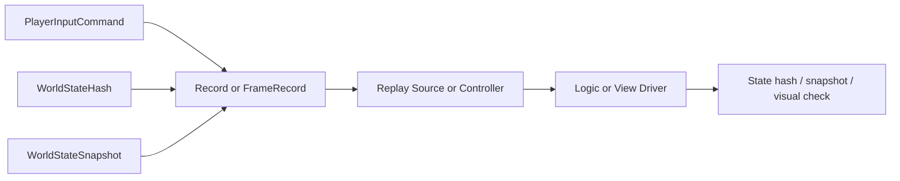

回放不应该直接复制运行时对象。源码里的共同做法是：把运行时过程降级为“帧号 + 类型 + 字节载荷/快照/哈希”，回放时再交给对应 codec、handler 或 Demo driver。

---

## 2. 源码入口

### 2.1 通用记录/回放

| 能力 | 源码 | 作用 |
|------|------|------|
| 容器 | `Unity/Packages/com.abilitykit.record/Runtime/Record/Core/Container/RecordContainer.cs` | 保存 meta 与 tracks |
| 轨道描述 | `Unity/Packages/com.abilitykit.record/Runtime/Record/Core/Container/RecordTrack.cs` | 描述 track id、name、version、schema |
| 轨道名 | `Unity/Packages/com.abilitykit.record/Runtime/Record/Core/Container/RecordTrackNames.cs` | 默认 `inputs`、`state_hash`、`snapshots` |
| 容器构建 | `Unity/Packages/com.abilitykit.record/Runtime/Record/Core/Container/RecordContainerBuilder.cs` | 按 `RecordProfile` 创建默认轨道 |
| 配置 | `Unity/Packages/com.abilitykit.record/Runtime/Record/Core/Profile/RecordProfile.cs` | 决定输入/hash/快照是否记录和索引粒度 |
| 会话 | `Unity/Packages/com.abilitykit.record/Runtime/Record/Core/Session/RecordSession.cs` | 管理容器、序列化器、读写工厂 |
| 会话工厂 | `Unity/Packages/com.abilitykit.record/Runtime/Record/Core/Session/RecordSessionFactory.cs` | 创建、加载、保存 session |
| JSON 序列化 | `Unity/Packages/com.abilitykit.record/Runtime/Record/Core/Serialization/JsonRecordContainerSerializer.cs` | 将 payload Base64 化并持久化 |
| 回放控制 | `Unity/Packages/com.abilitykit.record/Runtime/Record/Core/Replay/BasicReplayController.cs` | 用 clock 按帧消费事件 |
| 固定步长时钟 | `Unity/Packages/com.abilitykit.record/Runtime/Record/Core/Replay/FixedStepReplayClock.cs` | deltaTime -> frame |
| Typed handler | `Unity/Packages/com.abilitykit.record/Runtime/Record/Adapters/Replay/TypedReplayEventHandler.cs` | 解码输入/hash/快照/delta 事件 |

### 2.2 按帧记录

| 能力 | 源码 | 作用 |
|------|------|------|
| 文件模型 | `Unity/Packages/com.abilitykit.record/Runtime/Record/FrameRecord/FrameRecordFile.cs` | 定义 meta、inputs、state hashes、snapshots、index |
| 写入出口 | `Unity/Packages/com.abilitykit.record/Runtime/Record/FrameRecord/FrameRecordSink.cs` | 追加输入/hash/快照 |
| 回放源 | `Unity/Packages/com.abilitykit.record/Runtime/Record/FrameRecord/FrameRecordReplaySource.cs` | 构造按帧字典，支持查询 |
| JSON codec | `Unity/Packages/com.abilitykit.record/Runtime/Record/FrameRecord/FrameRecordJsonCodec.cs` | JSON 文件编解码 |
| Binary codec | `Unity/Packages/com.abilitykit.record/Runtime/Record/FrameRecord/FrameRecordBinaryCodec.cs` | 二进制文件编解码 |
| Optimized codec | `Unity/Packages/com.abilitykit.record/Runtime/Record/FrameRecord/FrameRecordOptimizedBinaryCodec.cs` | 优化二进制布局 |

### 2.3 Console Demo 回放

| 能力 | 源码 | 作用 |
|------|------|------|
| 控制器 | `src/AbilityKit.Demo.Moba.Console/Replay/ReplayController.cs` | 录制/回放状态切换 |
| 写入器 | `src/AbilityKit.Demo.Moba.Console/Replay/ConsoleRecordWriter.cs` | 收集命令/快照并写出 `.akrec` |
| 播放器 | `src/AbilityKit.Demo.Moba.Console/Replay/ConsoleReplayDriver.cs` | 读取 `.akrec`、索引命令、播放控制 |
| 文件类型 | `src/AbilityKit.Demo.Moba.Console/Replay/RecordTypes.cs` | `AKRC` header、MemoryPack 命令和快照 |

---

## 3. 三层回放体系

AbilityKit 当前不是只有一种回放文件格式，而是三套互补层次：

| 层次 | 核心类型 | 适合场景 | 特点 |
|------|----------|----------|------|
| 通用 Record | `RecordContainer`、`RecordSession`、`EventTrack` | 工具、调试、跨模块记录 | 多轨道、元数据、事件 payload、JSON 序列化 |
| FrameRecord | `FrameRecordFile`、`FrameRecordSink`、`FrameRecordReplaySource` | 同步验证、输入/hash/快照复现 | 文件模型固定，直接按 frame 查询 |
| Console `.akrec` | `RecordFileHeader`、`ConsoleRecordWriter`、`ConsoleReplayDriver` | MOBA Console 快速录制/播放 | 简单二进制格式，命令和快照 MemoryPack 序列化 |

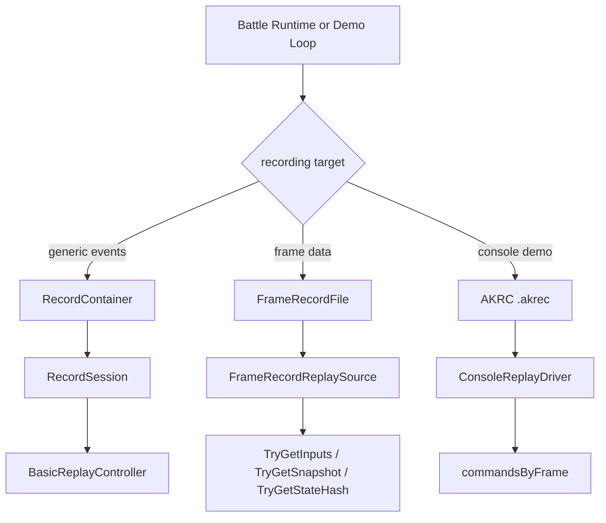

文档和工具中必须标清使用哪一层，否则容易误以为 Console `.akrec` 就是通用 `RecordSession` 的落盘格式。源码实际不是这样。

---

## 4. 通用 Record 容器

### 4.1 `RecordContainer` 的职责

通用容器只承担两个职责：

- `Meta`：字符串键到任意对象的元数据。
- `Tracks`：`RecordTrackId` 到 `RecordTrack` 的轨道字典。

它不强制“输入一定怎么存”“快照一定怎么存”，这些由 track、event 和 codec 组合完成。

### 4.2 `RecordProfile` 决定默认轨道

`RecordProfile` 定义默认记录能力：

| 字段 | 含义 |
|------|------|
| `EnableInputs` | 是否创建输入轨道 |
| `EnableStateHash` | 是否创建状态 hash 轨道 |
| `StateHashIntervalFrames` | hash 采样间隔 |
| `EnableSnapshots` | 是否创建快照轨道 |
| `IndexChunkFrames` | 索引分块粒度 |

`RecordContainerBuilder` 根据 profile 创建默认 tracks。默认轨道名来自 `RecordTrackNames`：

- `inputs`
- `state_hash`
- `snapshots`

### 4.3 `EventTrack` 是按帧事件列表

`EventTrack.Append` 以 frame 为键追加 `RecordEvent`。一个 frame 可以有多个事件，这对同一帧多个玩家输入、多个快照片段或多个诊断事件很重要。

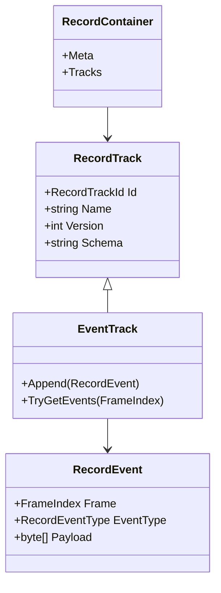

### 4.4 `RecordSession` 为什么替换容器而不是替换对象

`RecordSession` 持有：

- `Profile`
- `Container`
- `IRecordContainerSerializer`
- `IRecordTrackWriterFactory`
- `IRecordTrackReaderFactory`

它的 `TryLoad(byte[] data)` 语义是反序列化新容器后替换 session 内部容器，而不是让调用者换掉 `RecordSession` 引用。这样 UI、工具窗口或调试器可以长期持有同一个 session 对象，只刷新其中的数据。

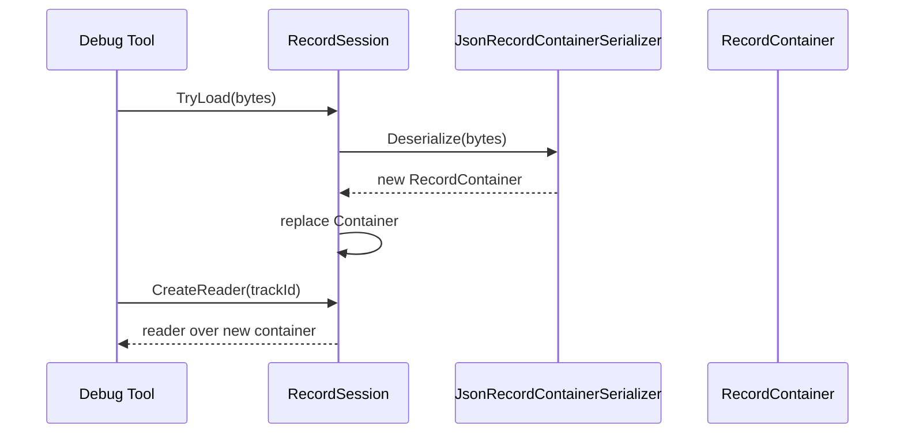

---

## 5. 固定步长回放控制

### 5.1 `FixedStepReplayClock`

`FixedStepReplayClock` 用 `_acc += deltaTime * Speed` 累积时间。当 `_acc >= _fixedDelta` 时：

1. `_acc -= _fixedDelta`。
2. `_frame = new FrameIndex(_frame.Value + 1)`。
3. 输出 `nextFrame`。

这意味着回放速度由 `Speed` 控制，帧推进由固定步长控制，外层可以是 Unity `Update`、Console loop 或测试驱动。

### 5.2 `BasicReplayController.Tick`

源码里的 `Tick` 顺序是：

1. 未播放则返回。
2. `while (_clock.TryConsume(deltaTime, out nextFrame))`。
3. 从 reader 读取该帧事件。
4. 逐个调用 handler。
5. 将 `deltaTime` 置 0，避免一次 Tick 里重复累计同一份 delta。

```mermaid
sequenceDiagram
    participant Loop as Runtime Loop
    participant Controller as BasicReplayController
    participant Clock as FixedStepReplayClock
    participant Reader as IEventTrackReader
    participant Handler as IReplayEventHandler

    Loop->>Controller: Tick(deltaTime)
    Controller->>Clock: TryConsume(deltaTime)
    alt next frame available
        Clock-->>Controller: nextFrame
        Controller->>Reader: TryGetEvents(nextFrame)
        Reader-->>Controller: events
        loop each event
            Controller->>Handler: Handle(event)
        end
        Controller->>Clock: TryConsume(0)
    else not enough time
        Clock-->>Controller: false
    end
```

### 5.3 Typed 事件回调

`TypedReplayEventHandler` 把通用 `RecordEvent` 解码成强类型回调。典型映射是：

| 事件 | 回调语义 |
|------|----------|
| 输入命令 | `OnInputCommand` |
| 状态 hash | `OnStateHash` |
| 世界快照 | `OnSnapshot` |
| 世界增量 | `OnDelta` |

这层适配的价值是：记录文件仍然只保存 event type 和 bytes，业务层可以用 codec 决定如何解释 payload。

---

## 6. 按帧记录文件

### 6.1 `FrameRecordFile` 的真实字段

`FrameRecordFile` 是固定结构：

| 字段 | 类型 | 含义 |
|------|------|------|
| `Meta` | `FrameRecordMeta` | world、tick rate、seed、player、开始时间 |
| `Inputs` | `List<FrameRecordInputFrame>` | 输入帧列表 |
| `StateHashes` | `List<FrameRecordStateHashFrame>` | 状态 hash 帧列表 |
| `Snapshots` | `List<FrameRecordSnapshotFrame>` | 快照帧列表 |
| `Index` | `List<FrameRecordChunkIndex>` | 分块索引 |

`FrameRecordMeta` 包含：

- `WorldId`
- `WorldType`
- `TickRate`
- `RandomSeed`
- `PlayerId`
- `StartedAtUnixMs`

### 6.2 输入/hash/快照帧

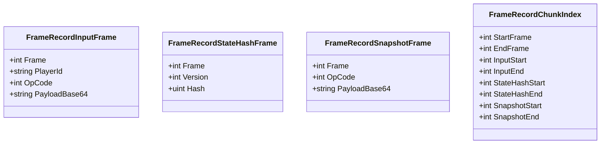

这种结构比通用 `RecordContainer` 更“硬”，但更适合同步排错，因为调试者经常需要直接问：

- 第 N 帧有哪些输入。
- 第 N 帧状态 hash 是多少。
- 第 N 帧有没有快照。
- 某个范围内的数据在文件中的索引位置是什么。

### 6.3 `FrameRecordReplaySource`

`FrameRecordReplaySource` 在构造时会把文件整理成按帧查询的数据源，读取时只做字典查询。常见接口包括：

- `TryGetInputs(FrameIndex frame, out IReadOnlyList<PlayerInputCommand> inputs)`
- `TryGetSnapshots(FrameIndex frame, out IReadOnlyList<WorldStateSnapshot> snapshots)`
- `TryGetSnapshot(FrameIndex frame, out WorldStateSnapshot snapshot)`
- `TryGetStateHash(FrameIndex frame, out WorldStateHash hash, out int version)`

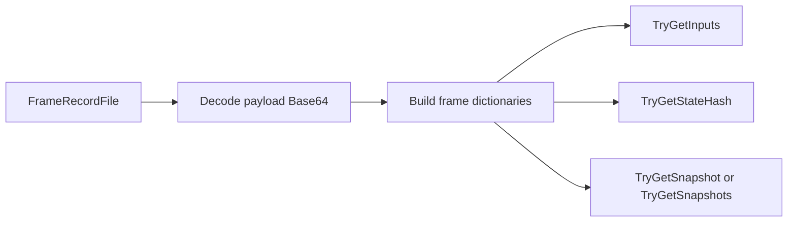

---

## 7. Console akrec 回放

Console Demo 的 `.akrec` 是独立格式，不等同于通用 `FrameRecordFile`。它定义在 `src/AbilityKit.Demo.Moba.Console/Replay/RecordTypes.cs`。

### 7.1 文件头

`RecordFileHeader` 的关键字段：

| 字段 | 含义 |
|------|------|
| `MAGIC` | `0x414B5243`，即 `AKRC` |
| `VERSION` | 当前版本 1 |
| `RecordTime` | 录制时间 |
| `StartFrame` / `EndFrame` | 起止帧 |
| `TotalCommands` | 命令数量 |
| `MapName` | 地图名 |
| `PlayerName` | 玩家名 |
| `GameMode` | Demo 模式 |
| `Metadata` | 扩展元数据字节 |

### 7.2 命令和快照

Console `.akrec` 使用 MemoryPack 序列化：

| 类型 | 字段 |
|------|------|
| `PlayerInputCommand` | `ActorId`、`Frame`、`InputCommandType`、`OpCode`、`Payload` |
| `FrameSnapshot` | `Frame`、`ActorCount`、`StateHash` |

文件写出顺序是：

1. Header。
2. 命令数量。
3. 每条命令的长度和 MemoryPack bytes。
4. 快照数量。
5. 每个快照的长度和 MemoryPack bytes。

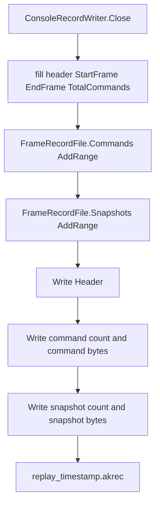

### 7.3 `ConsoleReplayDriver`

`ConsoleReplayDriver` 加载文件后会建立 `_commandsByFrame`：

1. `LoadRecordFile(filePath)` 调用 `FrameRecordFile.ReadFromStream`。
2. `IndexCommands()` 按 `cmd.Frame` 聚合命令。
3. `Play()` 只改变播放状态。
4. `Pause()` 切换暂停状态。
5. `Stop()` 重置到 header 的 `StartFrame`。
6. `SeekToFrame(frame)` 将目标帧夹在 `StartFrame` 和 `EndFrame` 范围内。
7. `GetCommandsAtFrame(frame)` 返回该帧所有命令。
8. `AdvanceFrame()` 在播放且未暂停时推进当前帧。

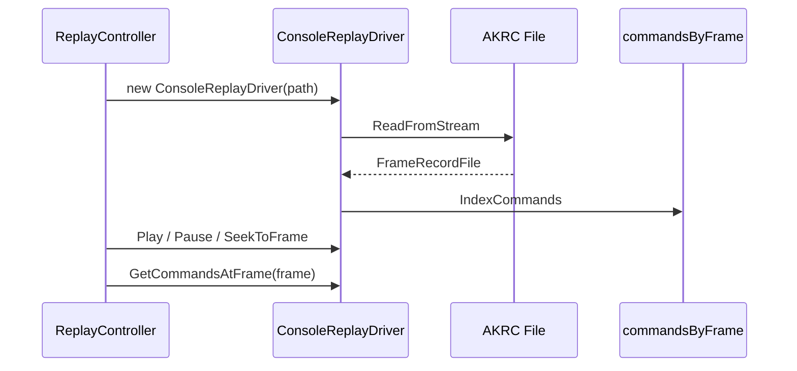

### 7.4 Console `ReplayController`

`ReplayController` 管状态切换：

| 方法 | 行为 |
|------|------|
| `StartRecording` | 创建目录，构造 `ConsoleRecordWriter`，进入 `Recording` |
| `StopRecording` | 关闭 writer，释放资源，回到 `None` |
| `StartReplay` | 校验文件存在，构造 `ConsoleReplayDriver`，进入 `Replaying` |
| `StopReplay` | 停止 driver，释放资源，回到 `None` |
| `RecordCommand` | 构造 Console 专用 `PlayerInputCommand` 并写入 writer |
| `AddSnapshot` | 让 writer 增加简单状态 hash 快照 |

---

## 8. 录制与回放生命周期

### 8.1 通用 Record 生命周期

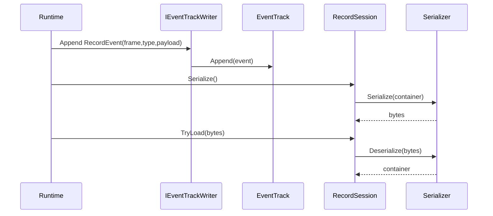

### 8.2 按帧记录生命周期

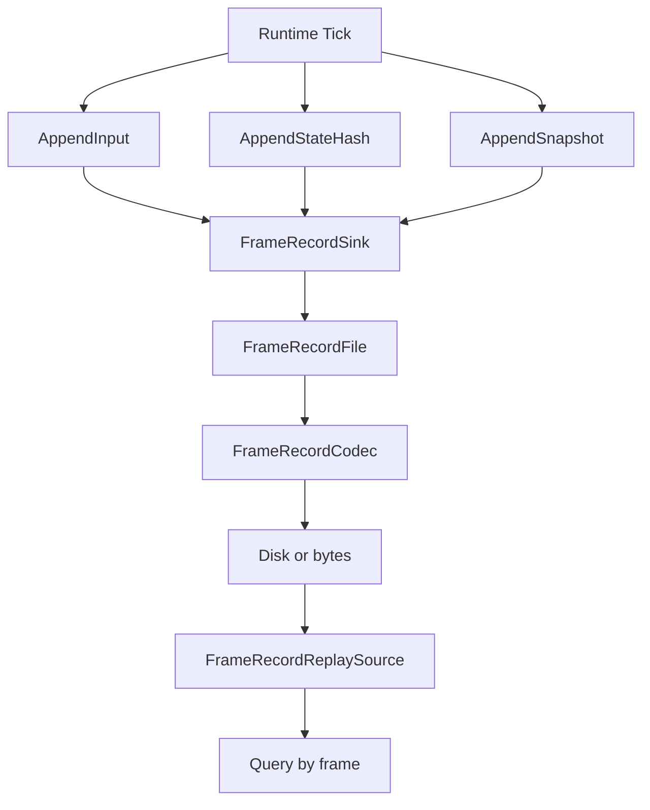

### 8.3 Console 生命周期

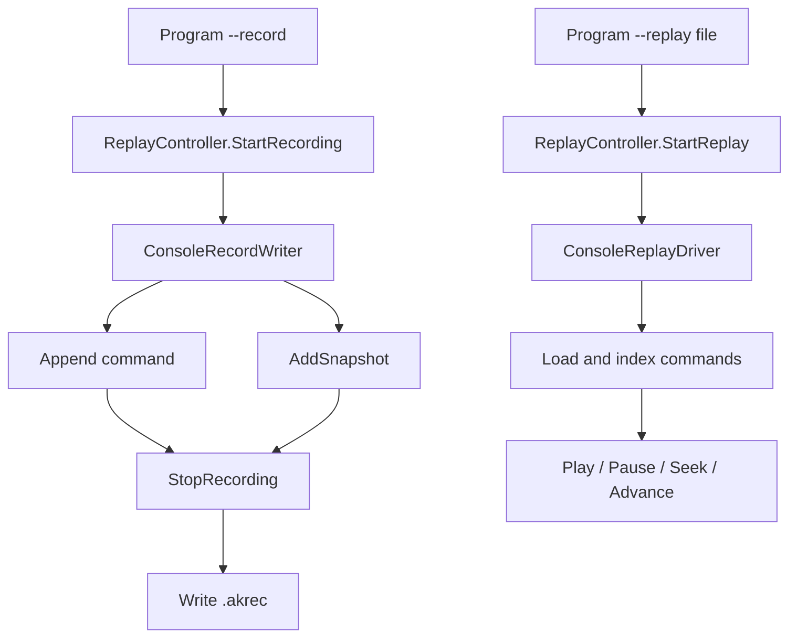

---

## 9. 设计意图

### 9.1 通用层保留扩展性

`RecordContainer` 不把“输入、快照、hash”写死为字段，而是通过 tracks 和 events 表达。这适合调试工具和后续扩展：新增事件类型时可以新增 codec 或 track，而不必改容器结构。

### 9.2 FrameRecord 为同步排错让路

同步问题经常需要按帧查输入、hash、快照。`FrameRecordFile` 直接提供固定字段和 chunk index，降低定位某一帧数据的成本。

### 9.3 Console 格式为 Demo 快速落地

Console `.akrec` 使用 `AKRC` header 和 MemoryPack 命令/快照，目标是快速把自动测试、录制、回放串起来。它不追求成为所有项目的统一回放格式。

### 9.4 回放控制器不驱动业务，只分发事件

`BasicReplayController` 只负责“到了哪一帧”和“该帧有哪些事件”，业务如何应用输入、快照或状态修正交给 handler。这降低了回放系统对玩法 runtime 的侵入。

---

## 10. 风险与验收点

| 风险 | 表现 | 验收点 |
|------|------|--------|
| 文件格式混淆 | `.akrec` 被当成通用 `RecordSession` 文件加载 | 文档和工具明确格式来源 |
| 帧号不稳定 | 回放时输入落到错误帧 | 录制输入、hash、快照都必须记录 frame |
| codec 版本漂移 | 老文件无法解析新 payload | track version、header version、event type registry 要同步维护 |
| JSON 体积膨胀 | Base64 payload 文件过大 | 大规模线上归档优先考虑 binary/optimized codec |
| 一帧多输入丢失 | 同一帧只取第一条命令 | Console 有 `GetCommandsAtFrame`，消费端应按列表处理 |
| 快照语义过弱 | Console `FrameSnapshot` 只存 actorCount/hash | 标明它是校验快照，不是完整世界快照 |
| 时钟倍速异常 | `Speed` 过高导致一帧消费过多 | 回放 UI/测试要限制速度范围或分帧消费 |

---

## 11. 继续阅读路线

建议顺序：

1. `Unity/Packages/com.abilitykit.record/Runtime/Record/Core/Container`：理解容器和轨道。
2. `Unity/Packages/com.abilitykit.record/Runtime/Record/Core/Tracks`：理解事件按帧存储。
3. `Unity/Packages/com.abilitykit.record/Runtime/Record/Core/Replay`：理解固定步长回放。
4. `Unity/Packages/com.abilitykit.record/Runtime/Record/FrameRecord`：理解同步排错文件模型。
5. `src/AbilityKit.Demo.Moba.Console/Replay`：理解 Console `.akrec` 的实际读写。
6. `Docs/design/07-NetworkSynchronization/05-SessionCoordination.md`：理解回放数据如何和远端输入、快照、会话恢复结合。

---

*文档版本：v2.0 | 最后更新：2026-07-04*
