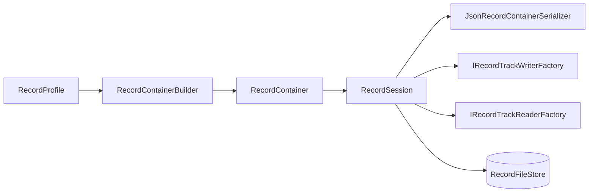
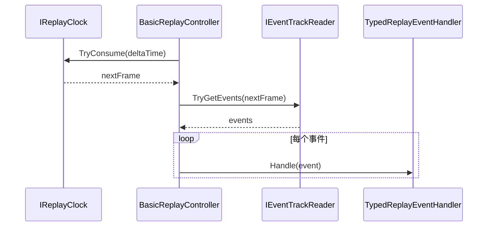
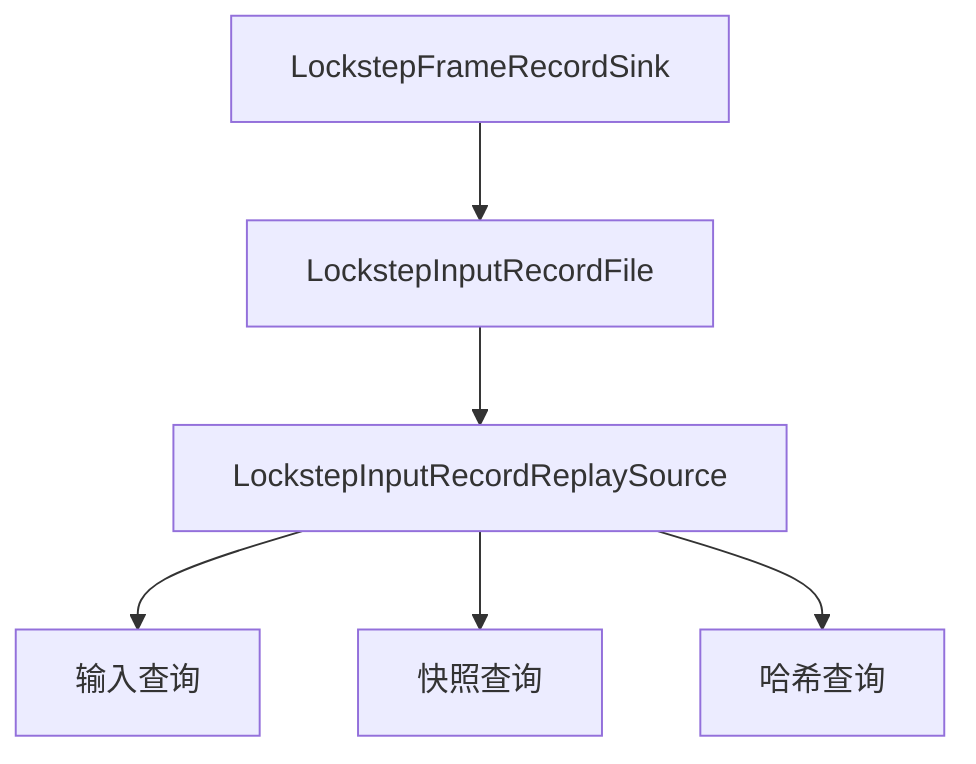
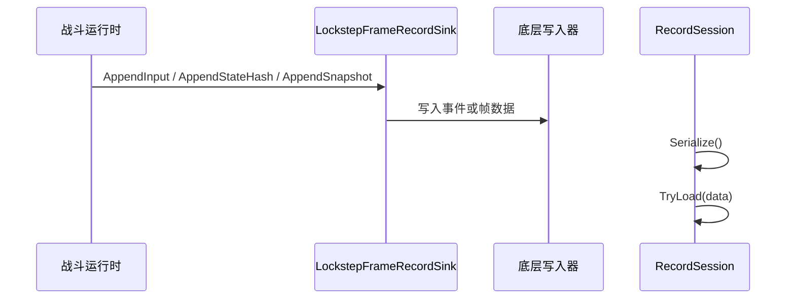

# 04-回放系统

> 回放系统负责把“已经发生过的战斗/模拟过程”稳定地记录下来，并在后续以可控速度、可寻址方式重新播放。AbilityKit 里它不是单一实现，而是由通用记录容器、事件轨道、回放控制器、锁步文件格式以及 Demo 侧的回放录制/播放器共同组成。

## 1. 能力定位

回放系统解决三类问题：

1. **录制**：把输入、状态哈希、快照等时序数据写入统一容器或专用文件。
2. **回放**：按帧消费事件或快照，支持播放、暂停、寻址、速度控制。
3. **复盘/调试**：把运行过程固化成可重放数据，用于战斗回放、问题定位和同步验证。

它与帧同步、状态同步、回滚预测的关系是：

- 帧同步提供“按帧推进”的时间轴与输入来源。
- 状态同步/回滚预测提供可记录的快照、哈希和恢复语义。
- 回放系统把这些历史数据组织成可加载、可播放、可回查的记录。

---

## 2. 能力清单

| 能力 | 作用 | 关键类型 |
|------|------|----------|
| 记录容器 | 用通用容器承载元数据与多轨道事件 | [`RecordContainer`](../../../Unity/Packages/com.abilitykit.record/Runtime/Record/Core/Container/RecordContainer.cs:6)、[`RecordTrack`](../../../Unity/Packages/com.abilitykit.record/Runtime/Record/Core/Container/RecordTrack.cs) |
| 默认轨道构建 | 按配置预置输入、状态哈希、快照轨道 | [`RecordContainerBuilder`](../../../Unity/Packages/com.abilitykit.record/Runtime/Record/Core/Container/RecordContainerBuilder.cs:6)、[`RecordProfile`](../../../Unity/Packages/com.abilitykit.record/Runtime/Record/Core/Profile/RecordProfile.cs:6) |
| 事件存取 | 以帧为索引追加和读取事件 | [`EventTrack`](../../../Unity/Packages/com.abilitykit.record/Runtime/Record/Core/Tracks/EventTrack.cs:7)、[`IEventTrackWriter`](../../../Unity/Packages/com.abilitykit.record/Runtime/Record/Core/Tracks/IEventTrackWriter.cs:5)、[`IEventTrackReader`](../../../Unity/Packages/com.abilitykit.record/Runtime/Record/Core/Tracks/IEventTrackReader.cs:6) |
| 会话封装 | 统一管理容器、序列化器与轨道工厂 | [`RecordSession`](../../../Unity/Packages/com.abilitykit.record/Runtime/Record/Core/Session/RecordSession.cs:5)、[`IRecordSession`](../../../Unity/Packages/com.abilitykit.record/Runtime/Record/Core/Session/IRecordSession.cs:5) |
| 回放控制 | 以固定步长推进事件消费 | [`BasicReplayController`](../../../Unity/Packages/com.abilitykit.record/Runtime/Record/Core/Replay/BasicReplayController.cs:6)、[`IReplayClock`](../../../Unity/Packages/com.abilitykit.record/Runtime/Record/Core/Replay/IReplayClock.cs:5) |
| 事件分发 | 将通用事件解码为 typed 回调 | [`TypedReplayEventHandler`](../../../Unity/Packages/com.abilitykit.record/Runtime/Record/Adapters/Replay/TypedReplayEventHandler.cs:9) |
| 锁步录制/回放 | 把输入、状态哈希、快照写入锁步文件并反向读取 | [`LockstepFrameRecordSink`](../../../Unity/Packages/com.abilitykit.record/Runtime/Record/Lockstep/LockstepFrameRecordSink.cs:7)、[`LockstepInputRecordReplaySource`](../../../Unity/Packages/com.abilitykit.record/Runtime/Record/Lockstep/LockstepInputRecordReplaySource.cs:10) |
| Demo 回放 | 为 MOBA 提供独立的二进制回放文件录制与播放 | [`ReplayRecorder`](../../../Unity/Packages/com.abilitykit.demo.moba.share/Runtime/Game/Flow/Battle/Replay/ReplayRecorder.cs:11)、[`ReplayPlayer`](../../../Unity/Packages/com.abilitykit.demo.moba.share/Runtime/Game/Flow/Battle/Replay/ReplayPlayer.cs:11) |

---

## 3. 通用数据模型

### 3.1 RecordContainer

[`RecordContainer`](../../../Unity/Packages/com.abilitykit.record/Runtime/Record/Core/Container/RecordContainer.cs:6) 是通用容器，只有两类核心字段：

- `Meta`：字符串键到任意对象的元数据。
- `Tracks`：`RecordTrackId` 到 `RecordTrack` 的轨道字典。

这意味着回放系统并不强迫一种固定文件结构，而是允许按能力域组织多个轨道。

### 3.2 RecordTrack 与 EventTrack

`RecordTrack` 负责描述一个逻辑轨道的身份、版本和 schema；真正的事件存储由 [`EventTrack`](../../../Unity/Packages/com.abilitykit.record/Runtime/Record/Core/Tracks/EventTrack.cs:7) 提供。

事件模型由 [`RecordEvent`](../../../Unity/Packages/com.abilitykit.record/Runtime/Record/Core/Tracks/RecordEvent.cs:6) 表示：

- `Frame`：帧号。
- `EventType`：事件类型。
- `Payload`：原始字节数据。

轨道名的默认约定来自 [`RecordTrackNames`](../../../Unity/Packages/com.abilitykit.record/Runtime/Record/Core/Container/RecordTrackNames.cs:1)：

- `inputs`
- `state_hash`
- `snapshots`

### 3.3 记录配置

[`RecordProfile`](../../../Unity/Packages/com.abilitykit.record/Runtime/Record/Core/Profile/RecordProfile.cs:6) 决定容器默认轨道与采样节奏：

- `EnableInputs`：是否记录输入轨道。
- `EnableStateHash`：是否记录状态哈希轨道。
- `StateHashIntervalFrames`：状态哈希采样间隔。
- `EnableSnapshots`：是否记录快照轨道。
- `IndexChunkFrames`：索引分块粒度。

---

## 4. 录制与序列化流程

### 4.1 容器构建

[`RecordContainerBuilder`](../../../Unity/Packages/com.abilitykit.record/Runtime/Record/Core/Container/RecordContainerBuilder.cs:6) 会根据 [`RecordProfile`](../../../Unity/Packages/com.abilitykit.record/Runtime/Record/Core/Profile/RecordProfile.cs:6) 创建轨道：

- 启用输入时创建 `inputs` 轨道。
- 启用状态哈希时创建 `state_hash` 轨道。
- 启用快照时创建 `snapshots` 轨道。

如果提供了 [`RecordIdRegistry`](../../../Unity/Packages/com.abilitykit.record/Runtime/Record/Core/Container/RecordIdRegistry.cs) ，构建器还会尝试注册轨道名，保证外部 ID 体系可追踪。

### 4.2 事件追加

[`EventTrack.Append`](../../../Unity/Packages/com.abilitykit.record/Runtime/Record/Core/Tracks/EventTrack.cs:17) 按帧追加 [`RecordEvent`](../../../Unity/Packages/com.abilitykit.record/Runtime/Record/Core/Tracks/RecordEvent.cs:6)。

其行为很直接：

- 没有对应帧列表时创建列表。
- 同一帧可以有多个事件。
- 读取时返回该帧的只读事件列表。

### 4.3 容器序列化

[`JsonRecordContainerSerializer`](../../../Unity/Packages/com.abilitykit.record/Runtime/Record/Core/Serialization/JsonRecordContainerSerializer.cs:9) 将容器转成 JSON，再编码为 UTF-8 字节数组。

它的特点：

- `Meta` 原样保存。
- 每个轨道的事件展开为 DTO。
- `Payload` 使用 Base64 存储。
- 反序列化时重新构造 `EventTrack` 并逐事件回填。

### 4.4 会话封装

[`RecordSession`](../../../Unity/Packages/com.abilitykit.record/Runtime/Record/Core/Session/RecordSession.cs:5) 统一持有：

- `Profile`
- `Container`
- `IRecordContainerSerializer`
- `IRecordTrackWriterFactory`
- `IRecordTrackReaderFactory`

它的关键设计点是 `TryLoad(byte[] data)` 不替换会话对象，而是**替换容器内容**，从而允许外部持续持有同一个 session 引用。

[`RecordSessionFactory`](../../../Unity/Packages/com.abilitykit.record/Runtime/Record/Core/Session/RecordSessionFactory.cs:3) 提供默认创建、从字节加载、从文件加载和保存文件四类入口。

---

## 5. 回放执行模型

### 5.1 固定步长时钟

[`IReplayClock`](../../../Unity/Packages/com.abilitykit.record/Runtime/Record/Core/Replay/IReplayClock.cs:5) 定义最小时钟契约：

- 当前帧。
- 播放速度。
- 重置起点。
- 基于 `deltaTime` 消费下一帧。

[`BasicReplayController`](../../../Unity/Packages/com.abilitykit.record/Runtime/Record/Core/Replay/BasicReplayController.cs:6) 依赖该时钟，把时间推进和事件消费解耦。

### 5.2 回放控制器

[`BasicReplayController.Tick`](../../../Unity/Packages/com.abilitykit.record/Runtime/Record/Core/Replay/BasicReplayController.cs:38) 的执行顺序是：

1. 如果暂停则直接返回。
2. 让时钟消费时间并产出下一帧。
3. 查询该帧是否有事件。
4. 逐个交给 [`IReplayEventHandler`](../../../Unity/Packages/com.abilitykit.record/Runtime/Record/Core/Replay/IReplayEventHandler.cs:3)。
5. 清空本轮 `deltaTime`，直到时钟不再产出帧。

这使回放既能“按固定帧走”，也能在外层由任意渲染/逻辑循环驱动。

### 5.3 Typed 事件处理

[`TypedReplayEventHandler`](../../../Unity/Packages/com.abilitykit.record/Runtime/Record/Adapters/Replay/TypedReplayEventHandler.cs:9) 是适配层：

- 输入事件 → `OnInputCommand`
- 状态哈希事件 → `OnStateHash`
- 世界快照事件 → `OnSnapshot`
- 世界增量事件 → `OnDelta`

它通过多个 codec 依次尝试解码，形成“先识别事件类型，再调用强类型回调”的模式。

---

## 6. 锁步录制与回放源

### 6.1 录制出口

[`LockstepFrameRecordSink`](../../../Unity/Packages/com.abilitykit.record/Runtime/Record/Lockstep/LockstepFrameRecordSink.cs:7) 负责把运行中的锁步数据写入底层 writer：

- `AppendInput`：记录输入。
- `AppendStateHash`：记录状态哈希。
- `AppendSnapshot`：记录快照。

它只是一个薄包装，目的是把回放数据写入职责与战斗推进职责分离。

### 6.2 文件/源结构

[`LockstepInputRecordFile`](../../../Unity/Packages/com.abilitykit.record/Runtime/Record/Lockstep/LockstepInputRecordFile.cs) 定义了锁步回放文件的元数据、输入帧、状态哈希帧、快照帧和索引块。

[`LockstepInputRecordReplaySource`](../../../Unity/Packages/com.abilitykit.record/Runtime/Record/Lockstep/LockstepInputRecordReplaySource.cs:10) 则把该文件反向整理为按帧查询的数据源：

- `TryGetInputs(FrameIndex frame, out IReadOnlyList<PlayerInputCommand> inputs)`
- `TryGetSnapshots(FrameIndex frame, out IReadOnlyList<WorldStateSnapshot> snapshots)`
- `TryGetSnapshot(FrameIndex frame, out WorldStateSnapshot snapshot)`
- `TryGetStateHash(FrameIndex frame, out WorldStateHash hash, out int version)`

它在构造时完成 Base64 解码与帧索引建表，因此读取阶段只做字典查询。

---

## 7. Demo 侧二进制回放实现

MOBA Demo 还实现了一套独立的二进制回放格式，用于战斗回放功能。

### 7.1 录制器

[`ReplayRecorder`](../../../Unity/Packages/com.abilitykit.demo.moba.share/Runtime/Game/Flow/Battle/Replay/ReplayRecorder.cs:11) 通过以下步骤生成回放文件：

1. `StartRecording(replayId)` 初始化头部与时间戳。
2. `RecordSnapshot(frameIndex, snapshotData)` 记录快照，并在首个快照时固定起始帧。
3. `RecordInput(frameIndex, playerId, inputData)` 记录输入。
4. `StopRecordingAndGetData()` 写出头部、快照和输入数据。

文件头由 [`ReplayHeader`](../../../Unity/Packages/com.abilitykit.demo.moba.share/Runtime/Game/Flow/Battle/Replay/ReplayRecorder.cs:167) 表示，魔数是 `REPL`，版本由 [`ReplayConstants`](../../../Unity/Packages/com.abilitykit.demo.moba.share/Runtime/Game/Flow/Battle/Replay/ReplayRecorder.cs:158) 管理。

### 7.2 播放器

[`ReplayPlayer`](../../../Unity/Packages/com.abilitykit.demo.moba.share/Runtime/Game/Flow/Battle/Replay/ReplayPlayer.cs:11) 支持：

- `LoadReplay`
- `Play`
- `Pause`
- `Stop`
- `SeekToFrame`
- `TryGetCurrentSnapshot`
- `TryGetSnapshotAt`
- `GetInputsUntilFrame`
- `AdvanceFrame`

它的核心思路是先把文件全部读入内存，再通过快照列表和输入列表提供寻址与播放能力。

### 7.3 适用边界

这套实现更偏向 Demo 业务：

- 文件格式更直接，便于战斗回放快速落地。
- 侧重快照和输入的检索。
- 不依赖通用 `RecordSession` / `EventTrack` 体系。

---

## 8. 典型生命周期

### 8.1 录制生命周期

### 8.2 回放生命周期

1. 从文件或字节流装载数据。
2. 创建 [`RecordSession`](../../../Unity/Packages/com.abilitykit.record/Runtime/Record/Core/Session/RecordSession.cs:5) 或 Demo 播放器。
3. 通过时钟或寻址接口定位起始帧。
4. 在每次 tick 中消费事件并回调业务层。
5. 必要时暂停、跳帧或重播。

---

## 9. 设计约束与风险

| 风险 | 说明 | 影响 |
|------|------|------|
| 轨道版本漂移 | `RecordTrack.Version` 与 schema 需与 codec 同步 | 旧回放文件可能无法正确解码 |
| Payload 体积 | Base64 与 JSON 会放大文件体积 | 适合调试，不一定适合超大规模线上归档 |
| 类型解码失败 | `TypedReplayEventHandler` 依赖 codec 顺序 | 新事件类型必须补充 codec |
| 文件格式分裂 | 通用记录容器与 Demo 二进制回放并存 | 需要明确各自适用边界 |
| 帧对齐要求 | 回放依赖帧索引 | 录制时必须保证帧号一致 |

---

## 10. 源码入口

### 通用记录/回放

- [`RecordContainer`](../../../Unity/Packages/com.abilitykit.record/Runtime/Record/Core/Container/RecordContainer.cs:6)
- [`RecordContainerBuilder`](../../../Unity/Packages/com.abilitykit.record/Runtime/Record/Core/Container/RecordContainerBuilder.cs:6)
- [`RecordSession`](../../../Unity/Packages/com.abilitykit.record/Runtime/Record/Core/Session/RecordSession.cs:5)
- [`BasicReplayController`](../../../Unity/Packages/com.abilitykit.record/Runtime/Record/Core/Replay/BasicReplayController.cs:6)
- [`TypedReplayEventHandler`](../../../Unity/Packages/com.abilitykit.record/Runtime/Record/Adapters/Replay/TypedReplayEventHandler.cs:9)

### 锁步与文件回放

- [`LockstepFrameRecordSink`](../../../Unity/Packages/com.abilitykit.record/Runtime/Record/Lockstep/LockstepFrameRecordSink.cs:7)
- [`LockstepInputRecordReplaySource`](../../../Unity/Packages/com.abilitykit.record/Runtime/Record/Lockstep/LockstepInputRecordReplaySource.cs:10)

### Demo 二进制回放

- [`ReplayRecorder`](../../../Unity/Packages/com.abilitykit.demo.moba.share/Runtime/Game/Flow/Battle/Replay/ReplayRecorder.cs:11)
- [`ReplayPlayer`](../../../Unity/Packages/com.abilitykit.demo.moba.share/Runtime/Game/Flow/Battle/Replay/ReplayPlayer.cs:11)

---

## 11. 小结

回放系统在 AbilityKit 里有两个层次：

- **通用层**：以 `RecordContainer`、`RecordSession`、`BasicReplayController` 为核心，适合抽象化记录与回放。
- **业务层**：以锁步文件与 Demo 二进制回放为核心，适合战斗调试、问题复现和产品功能落地。

两者共享“按帧组织历史数据”的思想，但在文件结构、序列化方式和调用者角色上各自独立。
