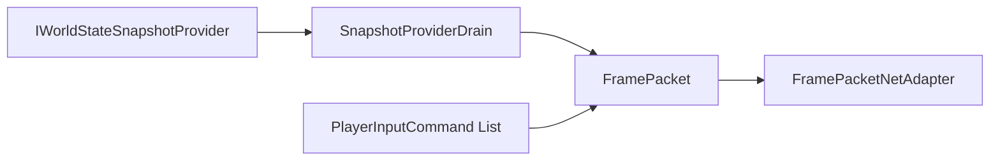
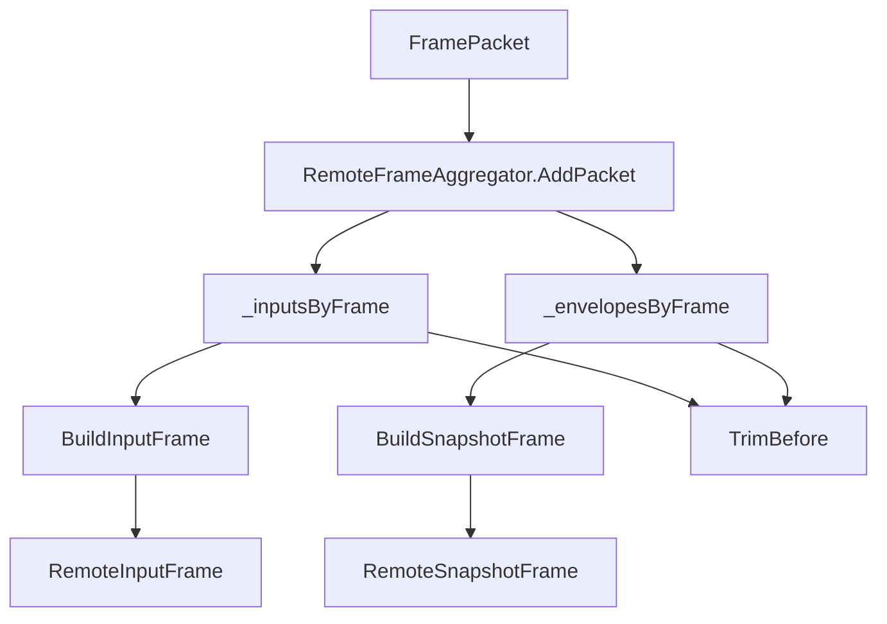
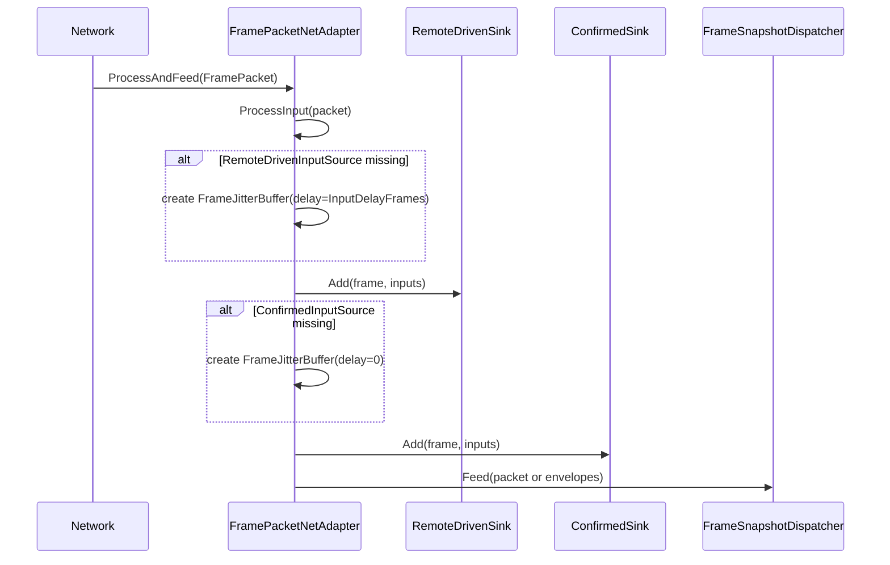
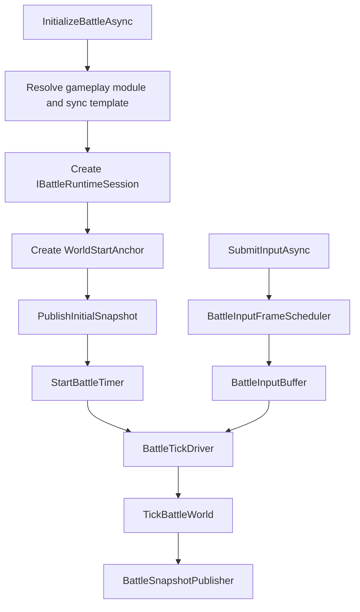
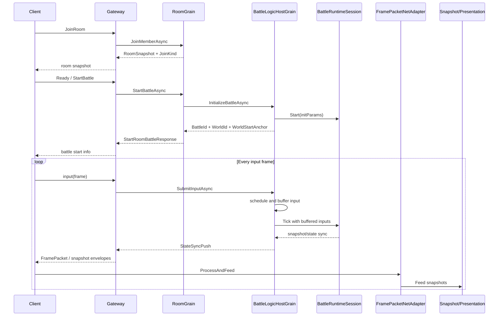

# 7.5 会话协调

> 本文从源码角度说明 AbilityKit 如何把网络包、远端输入、确认输入、快照路由、房间生命周期和 Orleans 战斗 Host 串成一次可恢复、可重连、可观测的联机会话。

---

## 目录

1. [能力定位](#1-能力定位)
2. [源码入口](#2-源码入口)
3. [端侧帧包与输入协调](#3-端侧帧包与输入协调)
4. [服务端 Room 与 Battle 协调](#4-服务端-room-与-battle-协调)
5. [完整会话时序](#5-完整会话时序)
6. [设计约束与扩展点](#6-设计约束与扩展点)

---

## 1. 能力定位

会话协调解决的是“联机战斗从房间进入到战斗推进再到快照回推”的跨层问题。它不是单纯的帧同步，也不是单纯的状态同步，而是连接以下能力：

| 层级 | 责任 | 关键类型 |
|------|------|----------|
| 网络帧片段 | 将输入和快照封装为帧级消息 | `FramePacket`、`RemoteFrameAggregator` |
| Host 扩展 | 把网络帧写入远端驱动输入源、确认输入源和快照分发器 | `FramePacketNetAdapter` |
| 房间域 | 维护成员、准备、重连、晚加入、开始战斗 | `RoomGrain`、`RoomMemberTracker` |
| 战斗域 | 维护 Tick、输入缓冲、运行时会话、状态推送 | `BattleLogicHostGrain` |
| 客户端表现 | 消费输入/快照，驱动预测、插值、表现事件 | `FrameSnapshotDispatcher`、客户端同步控制器 |

设计目标：

- 网络输入只进入统一的帧包边界，避免业务层直接耦合传输协议。
- 同一份输入可以同时进入“远端驱动”和“确认对账”两条链路。
- 快照以 Envelope 形式路由给表现/预测/校验管线。
- Room 只管理会话和成员，Battle Host 管理权威战斗推进。
- 支持 reconnect、late join、restore 等联机场景。

---

## 2. 源码入口

| 能力 | 源码 |
|------|------|
| 帧包封装 | `Unity/Packages/com.abilitykit.world.networkfragments/Runtime/Frames/FramePacket.cs` |
| 远端帧聚合 | `Unity/Packages/com.abilitykit.world.networkfragments/Runtime/Frames/RemoteFrameAggregator.cs` |
| 端侧网络适配 | `Unity/Packages/com.abilitykit.host.extension/Runtime/Session/FramePacketNetAdapter.cs` |
| 房间 Grain | `Server/Orleans/src/AbilityKit.Orleans.Grains/Rooms/RoomGrain.cs` |
| 战斗 Host Grain | `Server/Orleans/src/AbilityKit.Orleans.Grains/Battle/BattleLogicHostGrain.cs` |
| 帧同步 Grain 契约 | `Server/Orleans/src/AbilityKit.Orleans.Contracts/FrameSync/IBattleFrameSyncGrain.cs` |

---

## 3. 端侧帧包与输入协调

### 3.1 `FramePacket` 是输入与快照的共同载体

`FramePacket` 包含四个核心字段：

- `WorldId`：目标逻辑世界。
- `Frame`：输入/快照所属帧。
- `Inputs`：一帧内的玩家输入列表。
- `Snapshot`：可选的 `WorldStateSnapshot`。

这使一条网络消息既可以只携带输入，也可以只携带快照，或同时携带两者。`SnapshotProviderDrain` 还允许从 `IWorldStateSnapshotProvider` 按帧 drain 出快照并转成 `FramePacket`。

### 3.2 `RemoteFrameAggregator` 先按帧聚合再构造消费视图

`RemoteFrameAggregator` 内部维护两张表：

- `_inputsByFrame`：`frame -> List<PlayerInputCommand>`。
- `_envelopesByFrame`：`frame -> List<ISnapshotEnvelope>`。

它的核心行为是：

1. `AddPacket` 接收网络层到达的 `FramePacket`。
2. 按 `Frame.Value` 将输入追加到输入表。
3. 如果包内带快照，则把包本身作为 `ISnapshotEnvelope` 写入快照表。
4. `BuildInputFrame` 输出 `RemoteInputFrame`。
5. `BuildSnapshotFrame` 输出 `RemoteSnapshotFrame`。
6. `TrimBefore` 删除过旧帧，避免无界增长。

### 3.3 `FramePacketNetAdapter` 写入双输入源并路由快照

`FramePacketNetAdapter` 是端侧会话协调的关键桥。它面向 `IFramePacketNetAdapterContext`，上下文中有：

- `RemoteDrivenWorld` 与 `ConfirmedWorld`。
- `RemoteDrivenInputSource` / `RemoteDrivenConsumable` / `RemoteDrivenSink`。
- `ConfirmedInputSource` / `ConfirmedConsumable` / `ConfirmedSink`。
- `FrameSnapshotDispatcher Snapshots`。
- `InputDelayFrames`。

处理流程：

这种“双输入源”设计非常重要：

- `RemoteDriven` 使用 `InputDelayFrames`，用于网络驱动/插值/预测前的平滑消费。
- `Confirmed` 使用 0 延迟，表示服务器确认输入或对账输入。
- 二者消费同一份输入，但服务于不同的同步策略。

---

## 4. 服务端 Room 与 Battle 协调

### 4.1 `RoomGrain` 管理大厅态与战斗入口

`RoomGrain` 的核心状态包括：

- `RoomSummary`：房间静态摘要。
- `RoomMemberTracker`：成员、在线状态、机器人状态。
- `IRoomGameplayAdapter` 与玩法状态：房间内队伍/准备/玩法命令。
- `_battleId`、`_worldId`、`_worldStartAnchor`：战斗启动后的会话锚点。

关键行为：

| 行为 | 说明 |
|------|------|
| `JoinMemberAsync` | 加入房间；如果已在战斗中则区分 reconnect / late join |
| `RestoreAsync` | 根据成员身份恢复房间或战斗状态 |
| `SetReadyAsync` | 更新准备状态 |
| `SubmitGameplayCommandAsync` | 提交房间玩法命令 |
| `StartBattleAsync` | 创建 BattleId、WorldId、启动帧同步/战斗 Host |
| `GetSnapshotAsync` | 返回 RoomSnapshot，供大厅、重连、晚加入同步 |

房间层并不执行战斗帧，它只是确定“何时开始、谁在里面、如何恢复”。

### 4.2 `BattleLogicHostGrain` 管理权威战斗推进

`BattleLogicHostGrain` 的职责更接近权威逻辑主机：

- 解析玩法模块与同步模板。
- 创建 `IBattleRuntimeSession`。
- 初始化 `BattleHostState`。
- 建立 `WorldStartAnchor`。
- 使用 `BattleInputBuffer` 缓存输入。
- 使用 `BattleTickDriver` 驱动 Tick。
- 使用 `BattleSnapshotPublisher` 推送状态同步。

输入提交时，它会用 `BattleInputFrameScheduler.Schedule` 根据当前帧和 `InputDelayFrames` 计算输入落点，拒绝过旧/不合法输入。

---

## 5. 完整会话时序

---

## 6. 设计约束与扩展点

### 6.1 约束

- 帧号必须单调可比较，过旧输入应在服务端调度阶段拒绝。
- `RemoteFrameAggregator` 需要定期 `TrimBefore`，否则长连接会积累历史帧。
- `Confirmed` 与 `RemoteDriven` 输入源语义不同，不能随意混用。
- Room 的恢复/晚加入只提供会话锚点和快照入口，不应直接重放战斗逻辑。
- 快照 Envelope 应保持协议中立，具体解码交给 snapshot routing/pipeline。

### 6.2 扩展点

| 扩展点 | 用法 |
|--------|------|
| 自定义网络传输 | 只要最终产出 `FramePacket` 或 `RemoteInputFrame`/`RemoteSnapshotFrame` 即可 |
| 自定义输入延迟 | 调整 `InputDelayFrames` 和服务端输入调度策略 |
| 自定义房间玩法 | 实现/注册 `IRoomGameplayAdapter` |
| 自定义战斗运行时 | 提供新的 `BattleRuntimeAdapter` 与 `IBattleRuntimeSession` |
| 自定义快照处理 | 扩展 `FrameSnapshotDispatcher`、snapshot decoder、pipeline stage |

---

## 下一步

- [帧同步机制](./01-FrameSync.md) - 输入帧和确定性推进
- [状态同步](./02-StateSync.md) - 权威快照与状态应用
- [回滚预测](./03-RollbackPrediction.md) - 客户端预测和回滚重演

---

*文档版本：v1.0 | 最后更新：2026-06-23*
