# 7.5 会话协调

> 本文从源码角度说明 AbilityKit 如何把客户端会话、已有 world 接入、远端 transport、Gateway 入场流程、Room 生命周期、Battle Host 权威推进、帧包适配和状态订阅串成一次可恢复、可重连、可观测的联机会话。会话协调不是单一类的职责，而是 `SessionCoordinator`、`RemoteSyncAdapter`、`IRemoteBattleSyncTransport`、`RoomGatewaySessionFlow`、`RoomGrain`、`BattleLogicHostGrain` 和 `FramePacketNetAdapter` 的组合边界。

---

## 目录

1. [能力定位](#1-能力定位)
2. [源码入口](#2-源码入口)
3. [会话协调的分层边界](#3-会话协调的分层边界)
4. [客户端 SessionCoordinator](#4-客户端-sessioncoordinator)
5. [远端同步端口](#5-远端同步端口)
6. [Gateway 入场流程](#6-gateway-入场流程)
7. [Room 与 Battle 服务端协调](#7-room-与-battle-服务端协调)
8. [端侧帧包适配](#8-端侧帧包适配)
9. [完整会话时序](#9-完整会话时序)
10. [恢复、晚加入与已有 world 接入](#10-恢复晚加入与已有-world-接入)
11. [设计意图](#11-设计意图)
12. [风险与检查点](#12-风险与检查点)
13. [源码阅读路径](#13-源码阅读路径)

---

## 1. 能力定位

会话协调解决的是跨层问题：玩家从“我要加入一局游戏”到“本地 world 跟随服务器帧和快照稳定推进”之间，需要经过身份、房间、准备、开战、世界锚点、输入提交、快照订阅、重连恢复等步骤。

AbilityKit 把这些职责拆成几层：

| 层级 | 责任 | 关键类型 |
|------|------|----------|
| 客户端会话 | 创建或复用 world，选择 sync adapter，驱动 Tick，暴露 hooks | `SessionCoordinator`、`ISessionCoordinatorHost` |
| 远端同步 | 连接 endpoint，提交输入，接收服务器快照 | `RemoteSyncAdapter`、`IRemoteBattleSyncTransport` |
| Gateway Flow | 按 create/join/ready/start/subscribe/restore 编排入场流程 | `RoomGatewaySessionFlow`、`IRoomGatewaySessionClient` |
| 房间域 | 成员、准备、玩法房间状态、恢复、晚加入、开战入口 | `RoomGrain`、`RoomMemberTracker`、`IRoomGameplayAdapter` |
| 战斗域 | 权威 Tick、输入调度、运行时 session、快照推送 | `BattleLogicHostGrain`、`BattleInputBuffer`、`BattleTickDriver` |
| 帧同步广播 | 纯 frame push 场景下按帧广播输入 | `BattleFrameSyncGrain` |
| 端侧帧包 | 把网络帧包写入 remote-driven/confirmed 输入源并路由快照 | `FramePacketNetAdapter`、`RemoteFrameAggregator` |

设计目标：

- 业务层不直接依赖 Gateway handler、Orleans Grain 或 Socket 类型。
- Room 和 Battle 分层，避免大厅/成员生命周期污染权威 Tick。
- 客户端既能创建新 world，也能把已有 world 纳入 Coordinator。
- 输入、快照、确认、恢复都通过明确边界传递。
- 断线恢复和晚加入都能拿到 `WorldStartAnchor`、`BattleId`、`WorldId` 等会话锚点。

---

## 2. 源码入口

### 2.1 客户端/Unity Package

| 能力 | 源码 | 说明 |
|------|------|------|
| 会话协调器 | `Unity/Packages/com.abilitykit.coordinator/Runtime/Core/SessionCoordinator.cs` | 生命周期、world 创建、adapter attach、Tick |
| 已有 world host | `Unity/Packages/com.abilitykit.coordinator/Runtime/Core/ExistingWorldSessionCoordinatorHost.cs` | 把已有 `IWorld` 包装成 coordinator host |
| 远端同步 adapter | `Unity/Packages/com.abilitykit.coordinator/Runtime/Adapters/RemoteSyncAdapter.cs` | 连接 transport、提交输入、接收服务器快照 |
| 远端 transport 端口 | `Unity/Packages/com.abilitykit.coordinator/Runtime/Transport/IRemoteBattleSyncTransport.cs` | 环境提供 Gateway/Socket/测试替身 |
| Gateway flow | `Unity/Packages/com.abilitykit.host.extension/Runtime/Session/RoomGatewaySessionFlow.cs` | create/join/ready/start/subscribe/restore 编排 |
| 帧包适配 | `Unity/Packages/com.abilitykit.host.extension/Runtime/Session/FramePacketNetAdapter.cs` | 输入双写和快照路由 |
| MOBA view adapter | `Unity/Packages/com.abilitykit.demo.moba.view.runtime/Runtime/Game/Battle/Client/Session/BattleSessionNetAdapter.cs` | Demo View 包对通用帧包适配器的封装 |
| Shooter coordinator host | `Unity/Packages/com.abilitykit.demo.shooter.view.runtime/Runtime/Hosting/ShooterCoordinatorSessionHost.cs` | Shooter 使用已有 world + transport 注入 |

### 2.2 Server/Orleans

| 能力 | 源码 | 说明 |
|------|------|------|
| 房间 Grain | `Server/Orleans/src/AbilityKit.Orleans.Grains/Rooms/RoomGrain.cs` | 加入、准备、恢复、晚加入、开战 |
| 战斗 Host Grain | `Server/Orleans/src/AbilityKit.Orleans.Grains/Battle/BattleLogicHostGrain.cs` | 初始化 runtime、输入调度、Tick、状态推送 |
| 帧同步 Grain | `Server/Orleans/src/AbilityKit.Orleans.Grains/FrameSync/BattleFrameSyncGrain.cs` | 按帧广播输入事件 |
| 输入 Gateway handler | `Server/Orleans/src/AbilityKit.Orleans.Gateway/Gateway/Handlers/SubmitBattleInputHandler.cs` | 校验 request/session token 并转发输入 |
| Battle 契约 | `Server/Orleans/src/AbilityKit.Orleans.Contracts/Battle/IBattleLogicHostGrain.cs` | Battle Host Grain API |
| FrameSync 契约 | `Server/Orleans/src/AbilityKit.Orleans.Contracts/FrameSync/IBattleFrameSyncGrain.cs` | 帧同步 Grain API |

---

## 3. 会话协调的分层边界

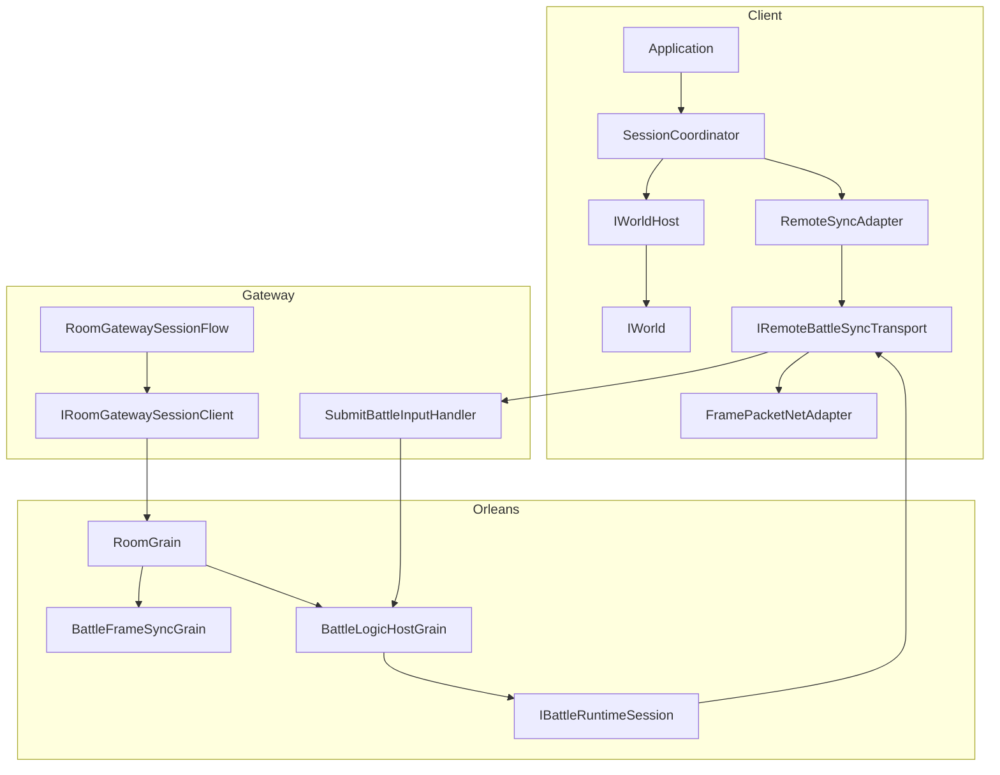

这张图强调两个边界：

1. `SessionCoordinator` 是客户端本地装配器，不应该直接知道 Orleans Grain。
2. `RoomGatewaySessionFlow` 是入场编排脚本，不是底层 transport；真正提交输入时仍应通过 `RemoteSyncAdapter` 和 `IRemoteBattleSyncTransport`。

---

## 4. 客户端 SessionCoordinator

### 4.1 初始化流程

`SessionCoordinator.Initialize(SessionConfig config, ISessionCoordinatorHost host)` 的源码顺序：

1. 状态必须是 `Idle`，否则抛异常。
2. 状态切到 `Initializing`。
3. 保存 config 和 host。
4. 如果 host 实现 `ISessionCoordinatorConfigPolicy`，调用 `ConfigureSession(ref config)`。
5. 解析 `SessionRuntimePolicy`。
6. `host.CreateWorldHost(config)`。
7. 创建 `WorldCreateOptions`，并调用 `host.ConfigureWorldCreateOptions`。
8. `worldHost.CreateWorld(options)`。
9. `world.Initialize()`。
10. 保存 `world.Services` 为 resolver。
11. `host.LoadConfig(world, config)`。
12. `host.RegisterServices(world, config)`。
13. 创建 `ViewTimeline`。
14. `SyncAdapterFactory.Create(world, config)`。
15. `syncAdapter.Attach(this)`。
16. 如果已经设置 driver，则 `syncAdapter.SetLogicWorldDriver(driver)`。
17. 触发 `SessionStarting` hook。
18. 状态回到 `Idle`，等待 `Start()`。

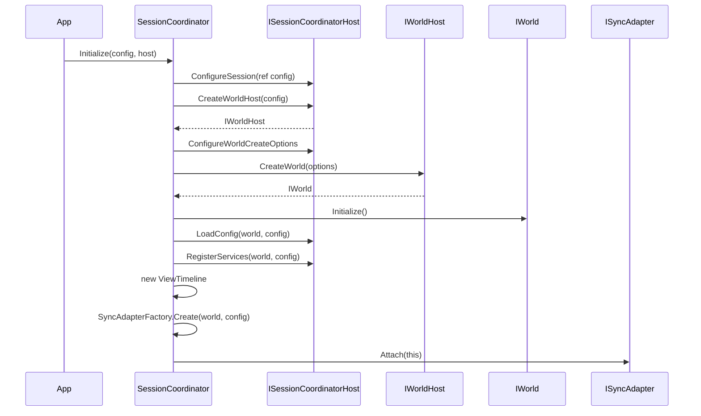

### 4.2 Start 和 Tick

`Start()` 的源码行为：

- 状态必须是 `Idle`。
- 状态切到 `Running`。
- 如果 `UseCoordinatorSpawnService` 为 true，调用 host 创建 spawn data 并尝试通过 `ISpawnService` 生成玩家。
- 重新 attach sync adapter。
- 触发 `SessionStarted` 和 `FirstFrameReceived` hooks。

`Tick(float deltaTime)` 的顺序：

1. 非 Running 状态直接返回。
2. `PreTick` hook。
3. 所有 `ISessionPreTickSubFeature.OnPreTick`。
4. `_syncAdapter.Tick(deltaTime)`。
5. 如果 `CanDriveLogicWorld(deltaTime)`，调用 `_worldHost.Tick(deltaTime)`。
6. 所有 `ISessionPostTickSubFeature.OnPostTick`。
7. `PostTick` hook。

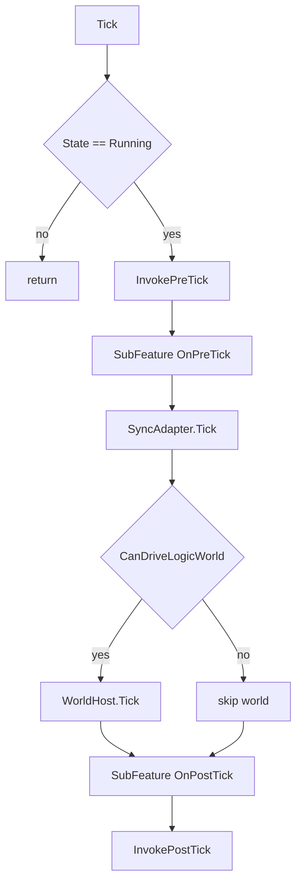

`CanDriveLogicWorld` 会优先查询 `ILogicWorldDriveGate`。如果 runtime policy 要求 gate，但 resolver 中没有 gate 或 gate 返回 false，本地 world 就不会被 Tick。该边界服务于远端权威和状态同步客户端的驱动隔离。

---

## 5. 远端同步端口

### 5.1 `IRemoteBattleSyncTransport`

这个接口是 Coordinator 和具体网络环境之间的端口：

| 成员 | 语义 |
|------|------|
| `IsConnected` | 当前是否连接 |
| `OnConnectionChanged` | 连接状态变化 |
| `OnServerSnapshot` | 收到服务器快照 |
| `OnServerConfirmation` | 收到服务器确认 |
| `Connect(endpoint, roomId, playerId, syncMode)` | 连接远端战斗同步服务 |
| `Disconnect()` | 断开 |
| `Tick(deltaTime)` | 推进网络 transport |
| `SubmitInput(PlayerInput input)` | 提交本地输入 |

源码注释明确说明：Coordinator 拥有同步编排，具体环境拥有 grain calls、gateway requests、sockets 或 test doubles。

### 5.2 `RemoteSyncAdapter`

`RemoteSyncAdapter` 构造时从 `world.Services` 解析 `IRemoteBattleSyncTransport`。如果没有解析到，使用 `NullRemoteBattleSyncTransport.Instance`，其 `IsConnected` 永远 false，`SubmitInput` 返回 false。

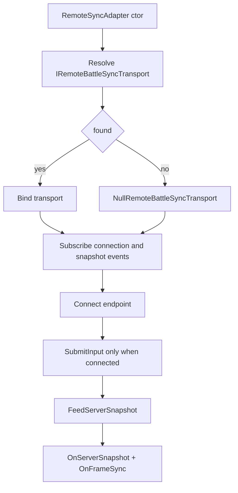

关键行为：

| 方法 | 源码行为 |
|------|----------|
| `Connect` | 保存 endpoint、roomId、playerId，调用 transport.Connect |
| `Tick` | 累加 render time，调用 transport.Tick |
| `SubmitInput` | transport 未连接时直接返回 |
| `FeedServerSnapshot` | 清空并更新 `_lastSnapshot`，触发快照和帧同步事件 |
| `GetAllEntityStates` | 有 driver 时读 driver，否则返回 `_lastSnapshot` |
| `Dispose` | Disconnect、解绑事件、清空状态 |

### 5.3 为什么不能让业务直接调 Gateway

业务直接调 Gateway 会带来三个问题：

1. 本地/远端/回放/测试模式无法复用同一入口。
2. 表现层会依赖传输协议，难以替换 TCP、HTTP、Orleans 或本地模拟器。
3. 输入确认、服务器快照、连接状态无法统一接入 `ISyncAdapter` 生命周期。

标准路径应该是：

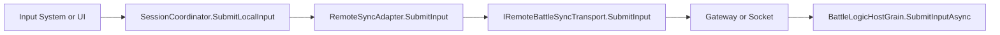

---

## 6. Gateway 入场流程

`RoomGatewaySessionFlow` 是一个高层流程编排器，依赖 `IRoomGatewaySessionClient`。它封装了 create/join/ready/start/subscribe/restore 的常见顺序，并返回 `RoomGatewaySessionFlowResult`。

### 6.1 创建房间并开战

`CreateReadyStartAndSubscribeAsync` 的源码步骤：

1. 校验 `sessionToken` 和 `playerId`。
2. `CreateRoomAsync`。
3. `JoinRoomAsync`。
4. `SetReadyAsync`。
5. `StartBattleAsync`。
6. 从 start/ready/join 结果选择 `battleId`。
7. `SubscribeStateSyncAsync`。
8. 返回 result，包含 room、battle、world、player、anchor、server ticks、entry kind、订阅状态。

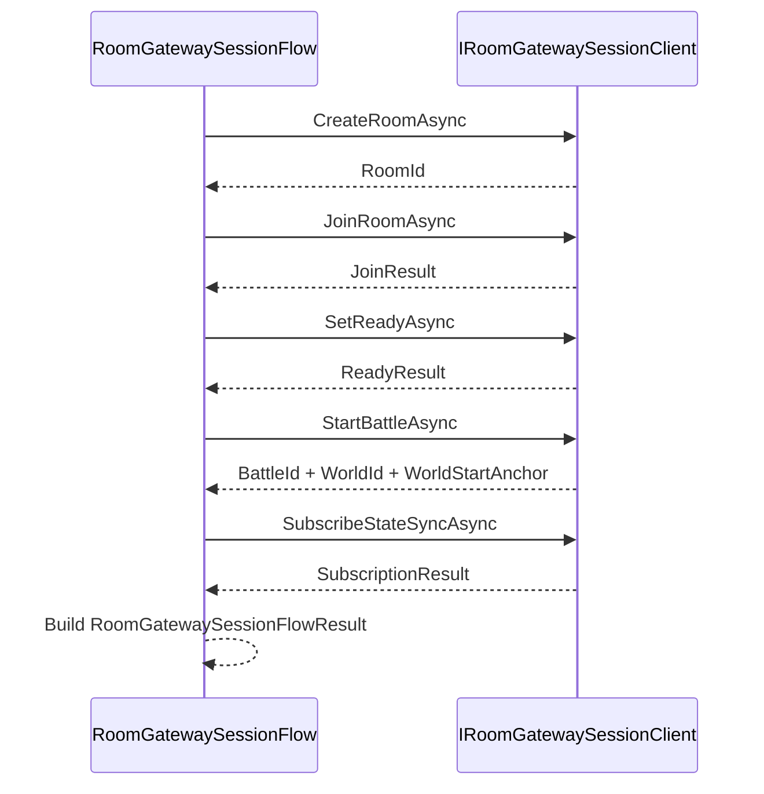

### 6.2 加入房间或运行中战斗

`JoinReadyStartAndSubscribeAsync` 先 join。如果 join 结果不是 `TeamLobby`，且带 `BattleId`，说明已经是 reconnect 或 late join 到运行中战斗：

- 直接 `SubscribeStateSyncAsync`。
- 返回 `started: true`。
- 使用 join 结果中的 `WorldStartAnchor`、`WorldId`、`JoinKind`。

否则才进入 ready/start/subscribe。

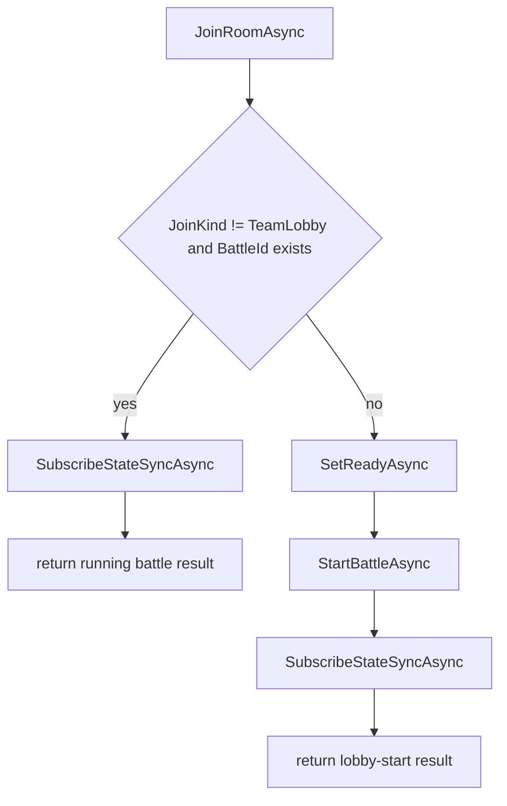

### 6.3 恢复运行中战斗

`RestoreRoomAsync` 的源码步骤：

1. 校验 session token、region、serverId、playerId。
2. `RestoreRoomAsync(sessionToken, region, serverId)`。
3. 如果没有 active room，抛异常。
4. 如果不是 in battle 或没有 battleId，抛异常。
5. `SubscribeStateSyncAsync`。
6. 返回包含 restore status/error code 的 result。

这条路径用于断线恢复。它要求恢复结果已经指向运行中 battle，不能恢复到一个没有 battle 的大厅态。

---

## 7. Room 与 Battle 服务端协调

### 7.1 `RoomGrain` 的职责

`RoomGrain` 持有：

- `RoomSummary`
- `IRoomGameplayAdapter`
- 玩法房间状态 `_gameplayState`
- `RoomMemberTracker`
- `_closed`
- `_battleId`
- `_worldId`
- `_worldStartAnchor`

关键 API：

| API | 行为 |
|-----|------|
| `JoinMemberAsync` | 加入房间；如果已在战斗中，区分 reconnect 和 late join |
| `RestoreAsync` | 根据账号恢复 active room/battle 状态 |
| `SetReadyAsync` | 设置准备状态 |
| `SubmitGameplayCommandAsync` | 提交房间玩法命令 |
| `StartBattleAsync` | 构造 battle init params，初始化 FrameSync/Battle Host |
| `GetSnapshotAsync` | 返回 RoomSnapshot |
| `CloseAsync` | 关闭房间并清理映射 |

### 7.2 开战时 Room 做什么

`RoomGrain.StartBattleAsync` 的源码顺序：

1. 校验 request。
2. 读取 summary、gameplay、gameplayState。
3. 确认操作者是房主。
4. 如果 `_battleId` 已存在，直接返回已有 battle 信息。
5. 确认房间 open。
6. `gameplay.CanStart(gameplayState)`。
7. `_battleId = summary.RoomId`。
8. `gameplay.BuildBattleInitParams`。
9. `RoomBattleSyncOptionsMapper.Resolve`。
10. 保存 `_worldId`。
11. `RoomFrameSyncRoute.ResolveStartRoute`。
12. 如果有 frame sync options，初始化 `IBattleFrameSyncGrain`。
13. 如果需要 battle runtime，初始化 `IBattleLogicHostGrain` 并读取 `WorldStartAnchor`。
14. 否则本地创建 `WorldStartAnchor`。
15. `_closed = true`。
16. 通知 room directory。
17. 返回 `StartRoomBattleResponse`。

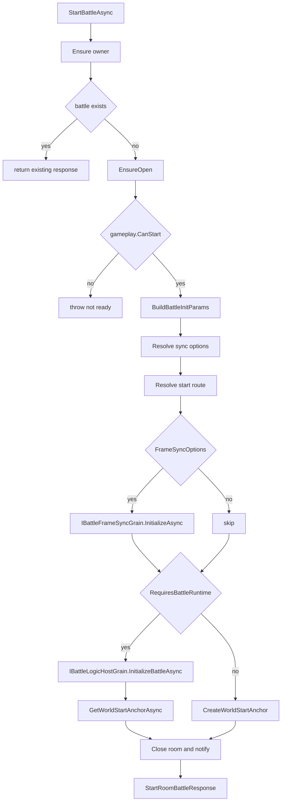

### 7.3 `BattleLogicHostGrain` 的职责

`BattleLogicHostGrain` 是权威战斗主机。它持有：

- `ServerGameplayModuleCatalog`
- `BattleRuntimeRegistry`
- `BattleHostState`
- `BattleInputBuffer<BattleInputItem>`
- `BattleTickDriver<BattleInputItem>`
- `BattleObserverRegistry<IStateSyncObserverGrain>`
- `BattleSnapshotPublisher`
- `IBattleRuntimeSession`
- `WorldStartAnchor`
- sync profile/template

`InitializeBattleAsync` 的源码顺序：

1. 校验 initParams。
2. 如果已初始化，忽略重复初始化。
3. 解析 room type 对应 gameplay module。
4. 解析 sync profile/template。
5. 归一化 `BattleSyncStartOptions`。
6. 保存 worldId、tickRate、inputDelayFrames。
7. 创建 `WorldStartAnchor`。
8. 初始化 `BattleHostState`。
9. 通过 runtime registry 创建 `IBattleRuntimeSession`。
10. 调用 runtime session `Start(initParams)`。
11. 成功后置 `_initialized = true`。
12. 发布初始快照。
13. 启动 Orleans timer。

### 7.4 服务端输入调度

`SubmitInputAsync` 不直接把输入塞给 runtime，而是经过调度：

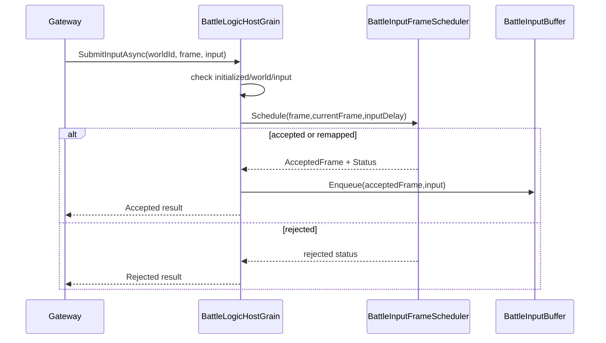

拒绝/重映射原因包括：

- battle 未初始化。
- world mismatch。
- null input。
- invalid frame。
- too far future。
- late input remapped。
- too early input remapped。
- input buffer 拒绝。

### 7.5 Battle Tick 和快照推送

`OnTickAsync` 的源码逻辑：

1. `_tickDriver.Tick(_battleHostState, _inputBuffer)`。
2. tick driver drain 输入、提交给 runtime、tick runtime。
3. 根据 `BattleSnapshotSyncPolicy.ShouldPublish` 判断是否推送。
4. 如果 runtime 支持 observer-aware，按 observer 构造状态推送。
5. 否则构造普通 `StateSyncPush`。
6. 通过 `IStateSyncObserverGrain.OnSnapshotPushedAsync` 推送。

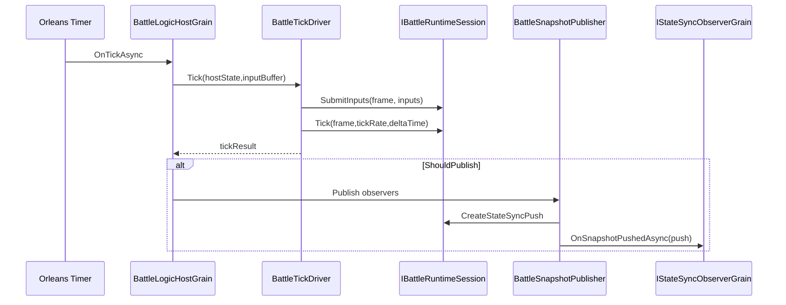

### 7.6 `BattleFrameSyncGrain`

`BattleFrameSyncGrain` 适合纯帧同步广播路线。它维护：

- `_inputsByFrame`：frame -> inputs。
- `_frame`：当前服务器帧。
- `_observers`：订阅者。
- `_tickInterval` 与 catch-up 控制。

每个 timer tick 会：

1. 计算当前是否到下一帧。
2. 最多 catch up `MaxCatchUpFramesPerTimer`。
3. 取出当前帧输入，没有则空列表。
4. 构造 `FramePushedEvent`。
5. 调用所有 observer 的 `OnFramePushed`。
6. `_frame++`。

---

## 8. 端侧帧包适配

### 8.1 `FramePacketNetAdapter`

端侧收到 `FramePacket` 或聚合后的 `RemoteInputFrame`/`RemoteSnapshotFrame` 后，通过 `FramePacketNetAdapter` 进入本地输入源和快照 dispatcher。

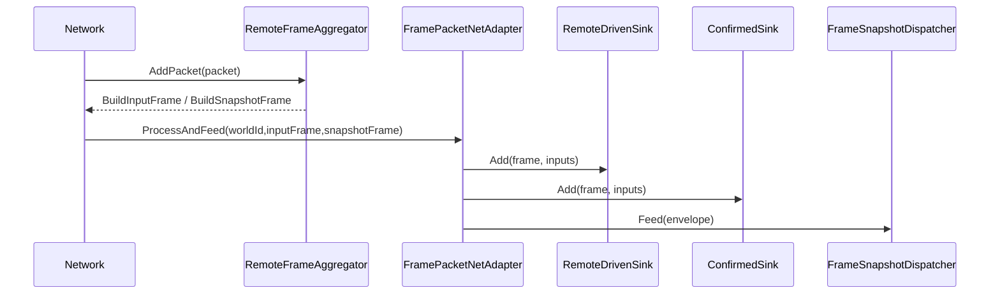

`ProcessInput` 内部会懒创建两个 `FrameJitterBuffer`：

| Buffer | delay | 用途 |
|--------|-------|------|
| `RemoteDriven` | `InputDelayFrames` | 网络驱动、插值、预测前平滑消费 |
| `Confirmed` | 0 | 服务器确认输入、对账、回滚修正 |

### 8.2 MOBA View 的封装

`BattleSessionNetAdapter` 在 MOBA View 包中包装通用 `FramePacketNetAdapter`。它的 `AdapterContext` 把 Demo 自己的 `IBattleSessionNetAdapterContext` 映射到通用 `IFramePacketNetAdapterContext`。

额外行为是更新 jitter buffer 调试统计：

- delay frames
- missing mode
- target frame
- max received frame
- last consumed frame
- buffered count
- duplicate/late/consumed/default-filled count

这说明通用 adapter 不负责 UI 诊断，Demo view 可以在外层读取 buffer 统计并展示。

---

## 9. 完整会话时序

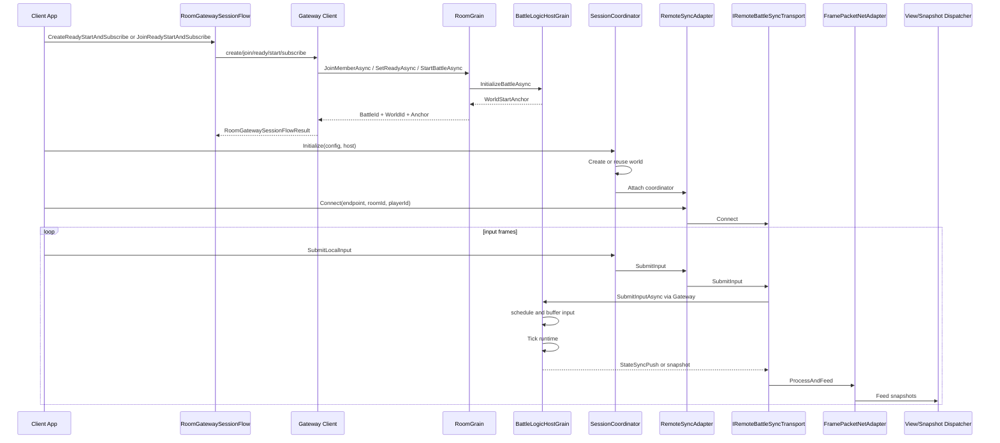

这个时序把“入场”和“持续同步”分开：

- 入场阶段需要 room/battle/world/anchor 信息。
- 持续同步阶段只应该围绕 coordinator、sync adapter、transport、frame packet 和 snapshot dispatcher。

---

## 10. 恢复、晚加入与已有 world 接入

### 10.1 Reconnect 和 LateJoin

`RoomGrain.JoinMemberAsync` 在房间已经处于 InBattle 时：

- 如果成员已存在，返回 `RoomJoinKind.Reconnect`。
- 如果不是成员但房间未满，会加入成员、调用 gameplay join、执行 `JoinRunningBattleAsync`，成功后返回 `RoomJoinKind.LateJoin`。
- `JoinRunningBattleAsync` 会通过 gameplay 构造 late join player，再调用 `BattleLogicHostGrain.JoinPlayerAsync`。
- 如果 battle 拒绝 late join，会回滚 Room 成员和玩法状态。

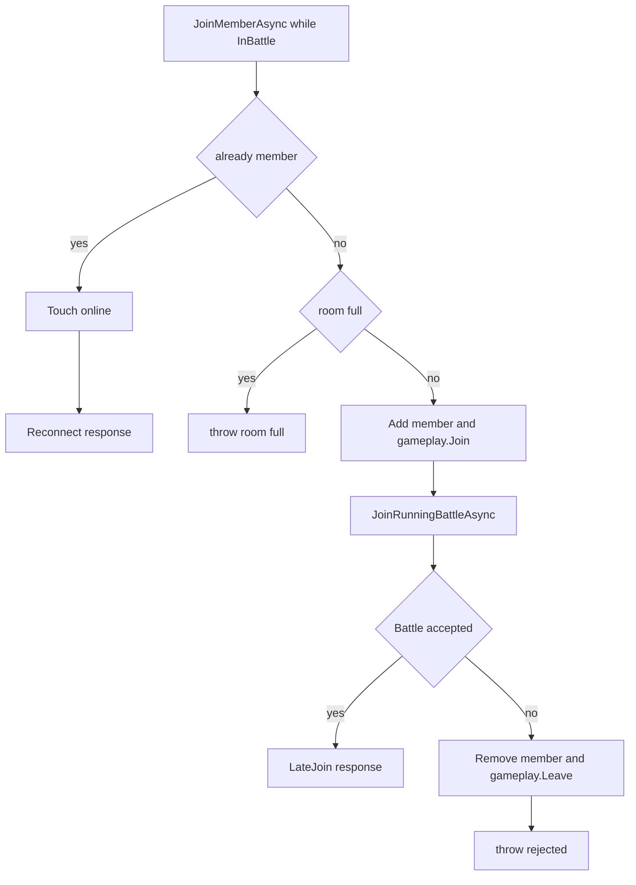

### 10.2 Restore

`RoomGrain.RestoreAsync` 先确认账号是成员，再 touch online，返回 `RestoreRoomResponse`：

- 如果没有 `_battleId`，join kind 是 `TeamLobby`。
- 如果已有 `_battleId`，join kind 是 `Reconnect`，`IsInBattle` 为 true。

`RoomGatewaySessionFlow.RestoreRoomAsync` 更严格：它要求恢复结果必须有 active room 且处于 battle，否则直接抛异常，因为这个方法的目标就是恢复到运行中的战斗并订阅状态同步。

### 10.3 已有 world 接入 Coordinator

有些示例或客户端运行时已经创建了 `IWorld`，不能让 `SessionCoordinator` 再创建第二套 world。源码提供 `ExistingWorldSessionCoordinatorHost`：

- 构造时传入已有 `IWorld`。
- 可传入 `serviceOverrides`，例如远端 transport。
- `CreateWorldHost` 返回包装后的 `ExistingWorldHost`。
- `CreateWorld` 总是返回已有 world。
- `DestroyWorld` 返回 false，不销毁外部 world。
- `DisposeAll` 不销毁外部 world。
- `ExistingWorldOverlayResolver` 会先查 service overrides，再查原 world services。

Shooter 的接入就是专门封装：

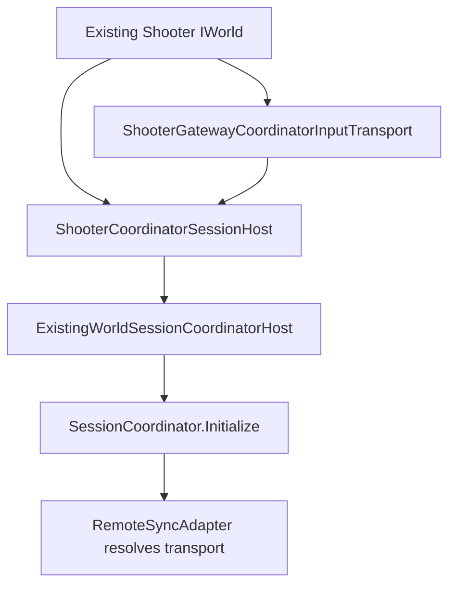

`ShooterCoordinatorSessionHost.ConfigureShooterSession` 会设置：

- `SyncMode = StateSync`
- `HostMode = Client`
- `WorldType = ShooterGameplay.WorldType`
- `UseCoordinatorSpawnService = false`
- `RequireLogicWorldDriveGate = true`
- `EnableClientPrediction = false`
- `MaxPredictionAheadFrames = 0`

这说明 Shooter 客户端把已有 runtime world 纳入通用会话层，但不让 Coordinator 再负责生成玩家或盲目驱动逻辑世界。

---

## 11. 设计意图

### 11.1 Coordinator 管本地装配，Transport 管外部通信

`SessionCoordinator` 只认识 `ISyncAdapter` 和 world 服务。远端通信藏在 `IRemoteBattleSyncTransport` 后面，这让同一套会话生命周期可以跑在 Unity、Console、Shooter View、测试替身或 Orleans Gateway 上。

### 11.2 Gateway Flow 管入场脚本，不管每帧输入

`RoomGatewaySessionFlow` 适合 create/join/ready/start/subscribe/restore 这种阶段性操作。每帧输入走 `RemoteSyncAdapter.SubmitInput`，这样输入、快照和连接状态仍在 sync adapter 生命周期中。

### 11.3 Room 管成员和恢复，Battle 管权威模拟

Room 如果直接 Tick 战斗，会混入成员清理、目录通知、玩法房间状态等非战斗职责。Battle 如果直接管理成员映射和大厅恢复，会污染权威 Tick。拆成两个 Grain 能让生命周期更清晰。

### 11.4 FramePacket 让端侧消费协议中立

客户端最终需要的是某一帧的输入和快照，而不是某个 Gateway DTO。`FramePacketNetAdapter` 消费 `FramePacket`/`RemoteInputFrame`/`RemoteSnapshotFrame`，保持输入源、快照 dispatcher 和传输协议分离。

### 11.5 ExistingWorldHost 解决示例/业务已有 world 的接入问题

真实项目经常先有自己的 world 或 runtime bootstrap。`ExistingWorldSessionCoordinatorHost` 允许接入 Coordinator 而不重建 world，是框架可渐进迁移的关键扩展点。

---

## 12. 风险与检查点

| 风险 | 表现 | 检查点 |
|------|------|--------|
| 业务绕过 Coordinator | 输入直接打 Gateway，回放/本地/测试路径不一致 | 所有本地输入先进入 `SubmitLocalInput` |
| transport 未注入 | Remote 模式启动但永远 disconnected | world services 是否能解析 `IRemoteBattleSyncTransport` |
| 已有 world 被重复创建 | 客户端出现两个逻辑世界或双 Tick | 使用 `ExistingWorldSessionCoordinatorHost` |
| Room/Battle 边界混乱 | 晚加入、恢复、权威 Tick 互相影响 | Room 只管成员/生命周期，Battle 只管 runtime/Tick |
| 输入帧落点不一致 | 客户端请求帧与服务端接受帧不同步 | 检查 `BattleInputSubmitResult.AcceptedFrame` 和 `Status` |
| 快照订阅缺失 | 战斗开始后客户端没有状态推送 | Gateway flow 是否调用 `SubscribeStateSyncAsync` |
| RemoteDriven/Confirmed 混用 | 预测和确认状态互相污染 | 消费者明确读取对应输入源 |
| 聚合器内存增长 | 长连接后 `_inputsByFrame` 和 `_envelopesByFrame` 变大 | 定期 `TrimBefore` |

---

## 13. 源码阅读路径

1. `Unity/Packages/com.abilitykit.coordinator/Runtime/Core/SessionCoordinator.cs`：客户端会话生命周期。
2. `Unity/Packages/com.abilitykit.coordinator/Runtime/Adapters/RemoteSyncAdapter.cs`：远端输入和快照端口。
3. `Unity/Packages/com.abilitykit.host.extension/Runtime/Session/RoomGatewaySessionFlow.cs`：create/join/ready/start/restore 编排。
4. `Server/Orleans/src/AbilityKit.Orleans.Grains/Rooms/RoomGrain.cs`：房间和恢复语义。
5. `Server/Orleans/src/AbilityKit.Orleans.Grains/Battle/BattleLogicHostGrain.cs`：权威 Tick 和输入调度。
6. `Unity/Packages/com.abilitykit.host.extension/Runtime/Session/FramePacketNetAdapter.cs`：端侧输入和快照如何落到 world。
7. `Docs/design/07-NetworkSynchronization/00-SynchronizationCapabilityMap.md`：全局同步架构中的模块关系。

---

*文档版本：v2.0 | 最后更新：2026-07-04*
