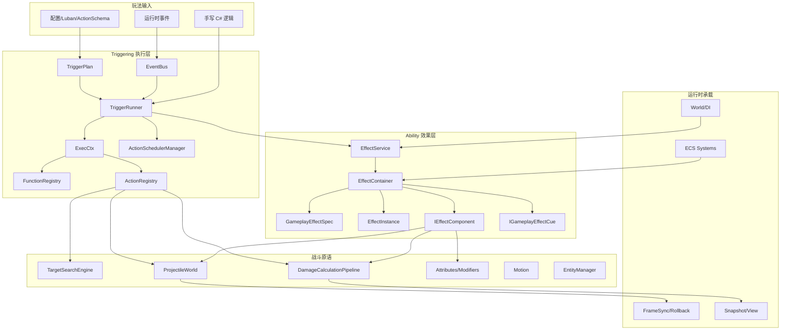
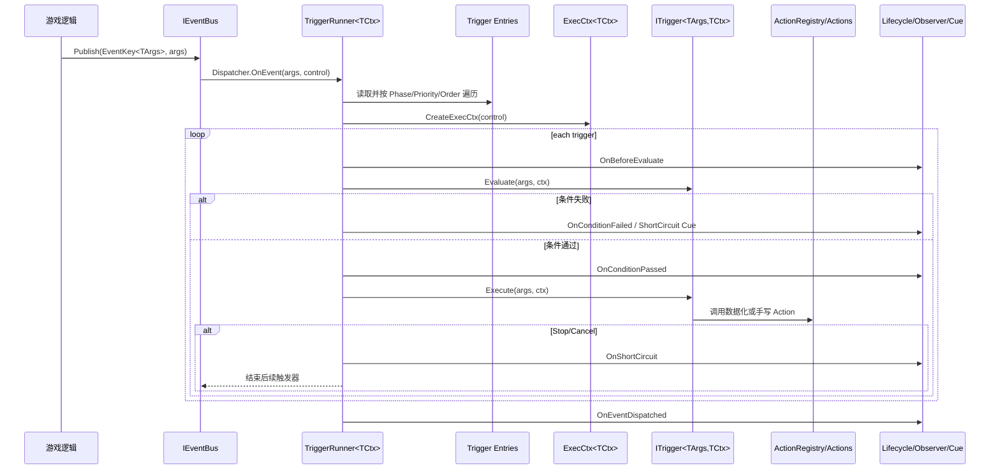
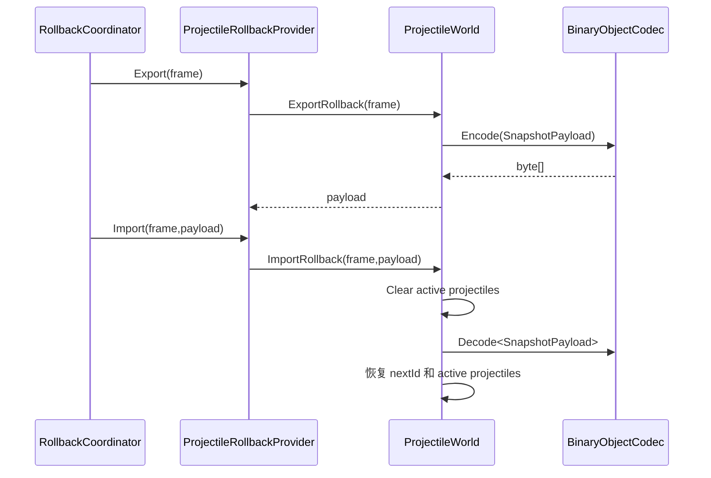
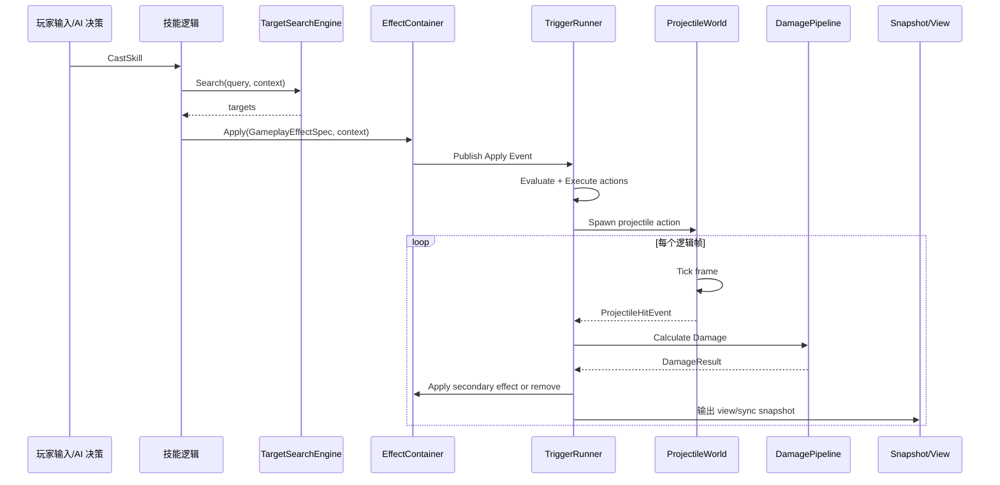

# 玩法能力地图

AbilityKit 的玩法层不是一个单体技能系统，而是一组可组合的战斗表达原语：Triggering 负责“事件-条件-动作”执行，Ability 负责 GameplayEffect 生命周期，Combat 包提供投射物、目标搜索、伤害、运动和实体管理等领域原语，Config/CodeGen 负责把配置转为可执行计划。

---

## 1. 玩法层总体结构



---

## 2. Triggering：通用事件条件动作执行器

### 2.1 设计定位

Triggering 解决的是“玩法逻辑如何被数据化、可排序、可观察、可中断地执行”。它不内置 Buff、投射物或伤害语义，而是提供通用执行主线：

1. 订阅事件。
2. 将多个触发器按 `Phase -> Priority -> Order` 排序。
3. 为每次事件创建 `ExecCtx`。
4. 评估条件。
5. 执行动作。
6. 处理中断、生命周期回调、观察者、Cue 和延迟 ActionScheduler。

关键源码：

| 类型 | 源码 | 职责 |
|------|------|------|
| TriggerRunner | `Unity/Packages/com.abilitykit.triggering/Runtime/Triggering/Runner/TriggerRunner.cs` | 运行时主线编排器 |
| TriggerRunnerRuntimeServices | `Unity/Packages/com.abilitykit.triggering/Runtime/Triggering/Runner/TriggerRunnerRuntimeServices.cs` | 创建 ExecCtx 所需的 registry 和 resolver |
| TriggerRunnerEntry | `Unity/Packages/com.abilitykit.triggering/Runtime/Triggering/Runner/TriggerRunnerEntry.cs` | 保存 phase/priority/order 和 trigger |
| TriggerPlan | `Unity/Packages/com.abilitykit.triggering/Runtime/Plans` | 数据化触发器计划 |
| ActionSchedulerManager | `Unity/Packages/com.abilitykit.triggering/Runtime/Runtime/ActionScheduler` | 延迟动作/计划内调度 |

### 2.2 执行流程



### 2.3 设计边界

- Triggering 管“何时执行、是否执行、按什么顺序执行”。
- Ability/Combat 管“执行的业务含义是什么”。
- `ExecCtx` 是扩展点聚合对象，承载上下文、函数注册表、动作注册表、黑板、数值域和执行控制。
- `ExecutionControl` 把 StopPropagation/Cancel 等控制语义从具体 Action 中抽出，避免 Action 直接操作 Runner 内部结构。

---

## 3. Ability：GameplayEffect 生命周期

### 3.1 设计定位

Ability 包把 Triggering 和战斗原语组合成“可施加、可持续、可周期触发、可移除”的 GameplayEffect 体系。

关键源码：

| 类型 | 源码 | 职责 |
|------|------|------|
| EffectService | `Unity/Packages/com.abilitykit.ability/Runtime/Ability/Effect/EffectService.cs` | 对外发布 Effect 事件、一次性评估/执行 Trigger |
| EffectContainer | `Unity/Packages/com.abilitykit.ability/Runtime/Ability/Effect/EffectContainer.cs` | 管理 active effects、Apply/Step/Remove 生命周期 |
| GameplayEffectSpec | `Unity/Packages/com.abilitykit.ability/Runtime/Ability/Effect/GameplayEffectSpec.cs` | 效果配置规格：时长、周期、Tag、组件、Cue |
| EffectInstance | `Unity/Packages/com.abilitykit.ability/Runtime/Ability/Effect/EffectInstance.cs` | 效果运行时实例状态 |
| IEffectComponent | `Unity/Packages/com.abilitykit.ability/Runtime/Ability/Effect/IEffectComponent.cs` | OnApply/OnTick/OnRemove 组件扩展点 |

### 3.2 Apply/Step/Remove 生命周期

```mermaid
flowchart TD
    A[EffectContainer.Apply(spec, context)] --> B{ApplicationRequirements 满足?}
    B -- 否 --> X[返回 null]
    B -- 是 --> C[创建 EffectInstance]
    C --> D[Publish Apply TriggerEvent]
    D --> E[向 TargetTags 添加 GrantedTags]
    E --> F[逐个组件 OnApply]
    F --> G[Cue.OnActive]
    G --> H[加入 _active]
    H --> I{Instant?}
    I -- 是 --> R[Remove(instanceId)]
    I -- 否 --> J{ExecutePeriodicOnApply?}
    J -- 是 --> K[TickInstance]
    J -- 否 --> L[设置 NextTickInSeconds]
    K --> L

    M[EffectContainer.Step(context)] --> N[ElapsedSeconds += dt]
    N --> O[Cue.WhileActive]
    O --> P{Duration?}
    P -- 是 --> Q[RemainingSeconds -= dt]
    P -- 否 --> S[保持]
    Q --> T{Period 到达?}
    S --> T
    T -- 是 --> U[TickInstance: Publish Tick + OnTick]
    T -- 否 --> V{Remaining <= 0?}
    U --> V
    V -- 是 --> R
    V -- 否 --> W[继续存活]

    R --> R1[从 _active 移除]
    R1 --> R2[Publish Remove TriggerEvent]
    R2 --> R3[Cue.OnRemove]
    R3 --> R4[组件 OnRemove]
    R4 --> R5[移除 GrantedTags]
```

### 3.3 设计要点

- Apply 前先检查 Tag 需求，避免无效效果进入 active 列表。
- Apply、Tick、Remove 都会发布默认 TriggerEvent，使效果生命周期可以继续驱动 Triggering。
- 组件模型把属性修改、触发事件、投射物联动等能力从 EffectContainer 中剥离。
- `IEffectTriggeringSwitch` 允许在特定上下文关闭默认触发事件，避免递归或测试噪音。

---

## 4. Projectile：确定性投射物世界

### 4.1 设计定位

Projectile 模块提供逻辑层投射物模拟：生成、飞行、碰撞、穿透/命中策略、返回施法者、退出事件、回滚导入导出。

关键源码：

| 类型 | 源码 | 职责 |
|------|------|------|
| ProjectileWorld | `Unity/Packages/com.abilitykit.combat.projectile/Runtime/Projectile/Runtime/ProjectileWorld.cs` | 投射物集合、Tick、碰撞、回滚 |
| ProjectileSpawnParams | `Unity/Packages/com.abilitykit.combat.projectile/Runtime/Projectile/Runtime/ProjectileSpawnParams.cs` | 生成参数 |
| IProjectileHitPolicy | `Unity/Packages/com.abilitykit.combat.projectile/Runtime/Projectile/Policies/IProjectileHitPolicy.cs` | 命中后是否退出、剩余命中次数等策略 |
| IProjectileHitFilter | `Unity/Packages/com.abilitykit.combat.projectile/Runtime/Projectile/Filters/IProjectileHitFilter.cs` | 命中过滤 |
| ProjectileRollbackProvider | `Unity/Packages/com.abilitykit.combat.projectile/Runtime/Projectile/Rollback/ProjectileRollbackProvider.cs` | 接入 RollbackCoordinator |

### 4.2 Tick 流程

```mermaid
flowchart TD
    A[ProjectileWorld.Tick(frame, fixedDelta)] --> B{active 是否为空?}
    B -- 是 --> Z[结束]
    B -- 否 --> C[遍历 active projectile]
    C --> D{LifetimeFramesLeft <= 0?}
    D -- 是 --> E[产生 Lifetime ExitEvent 并移除]
    D -- 否 --> F{ReturnAfterFrames 到达?}
    F -- 是 --> G[标记 IsReturning]
    F -- 否 --> H[计算速度与移动距离]
    G --> G1{能找到返回目标?}
    G1 -- 否 --> G2[ReturnTargetLost ExitEvent 并移除]
    G1 -- 是 --> H
    H --> I{move <= 0?}
    I -- 是 --> J[LifetimeFramesLeft--]
    I -- 否 --> K[沿方向 Raycast]
    K --> L{命中?}
    L -- 否 --> M[移动到终点]
    L -- 是 --> N[HitFilter/冷却/去重]
    N --> O{允许命中?}
    O -- 否 --> K
    O -- 是 --> P[产生 ProjectileHitEvent]
    P --> Q[HitPolicy 更新剩余命中/是否退出]
    Q --> R{退出?}
    R -- 是 --> S[ExitEvent 并移除]
    R -- 否 --> K
```

### 4.3 回滚设计

ProjectileWorld 自身支持 `ExportRollback(frame)` 与 `ImportRollback(frame,payload)`，导出内容包含 active projectile 列表和 `_nextId`。这使投射物可以参与帧同步回滚：



---

## 5. Targeting：候选-过滤-评分-选择流水线

Targeting 模块用于把“找目标”拆成可组合流水线：候选来源、规则过滤、评分器、选择器、结果映射。

关键源码：

| 类型 | 源码 | 职责 |
|------|------|------|
| TargetSearchEngine | `Unity/Packages/com.abilitykit.combat.targeting/Runtime/SearchTarget/TargetSearchEngine.cs` | 搜索主流程 |
| SearchQuery | `Unity/Packages/com.abilitykit.combat.targeting/Runtime/SearchTarget/SearchQuery.cs` | 查询描述 |
| SearchContext | `Unity/Packages/com.abilitykit.combat.targeting/Runtime/SearchTarget/SearchContext.cs` | 服务上下文 |
| ICandidateProvider | `Unity/Packages/com.abilitykit.combat.targeting/Runtime/SearchTarget/ICandidateProvider.cs` | 候选目标来源 |
| ITargetRule | `Unity/Packages/com.abilitykit.combat.targeting/Runtime/SearchTarget/ITargetRule.cs` | 过滤规则 |
| ITargetScorer | `Unity/Packages/com.abilitykit.combat.targeting/Runtime/SearchTarget/ITargetScorer.cs` | 评分规则 |
| ITargetSelector | `Unity/Packages/com.abilitykit.combat.targeting/Runtime/SearchTarget/ITargetSelector.cs` | 选择策略 |

```mermaid
flowchart TD
    A[SearchIds(query, context)] --> B[清空 results/hits/cache]
    B --> C{Provider 是否存在?}
    C -- 否 --> X[返回空]
    C -- 是 --> D{是否需要位置服务?}
    D -- 是 --> E{context 有 IPositionProvider?}
    E -- 否 --> X
    E -- 是 --> F[获取 stats/keyProvider]
    D -- 否 --> F
    F --> G{Selector 支持 Streaming?}
    G -- 是 --> H[Begin streaming selector]
    H --> I[Provider.ForEachCandidate]
    I --> J[候选过滤/评分/Offer]
    J --> K[End 输出结果]
    G -- 否 --> L[Provider.ForEachCandidate]
    L --> M[PassRules]
    M --> N[Score + Add SearchHit]
    N --> O{query.Selector 存在?}
    O -- 是 --> P[Selector.Select]
    O -- 否 --> Q[按 score desc/key asc 排序]
    Q --> R[写入 MaxCount 或全部结果]
```

设计要点：

- `RequiresPosition` 会提前检查上下文服务，避免搜索过程中才失败。
- Streaming selector 支持大规模候选时不保存完整 hit 列表。
- 默认排序使用 score 降序、key 升序，确保同分时稳定。

---

## 6. Damage：Dataflow 伤害计算管线

Damage 模块把伤害计算拆成 Dataflow processor 链。默认管线顺序是：验证、暴击、基础伤害、加成、护甲、魔抗、最终伤害、溢出。

关键源码：

| 类型 | 源码 | 职责 |
|------|------|------|
| DamageCalculationPipeline | `Unity/Packages/com.abilitykit.combat.damage/Runtime/Damage/Processor/DamageProcessors.cs` | 默认伤害 processor 链 |
| DamageSlots | `Unity/Packages/com.abilitykit.combat.damage/Runtime/Damage/Processor/DamageProcessors.cs` | 强类型 DataflowSlot，避免魔法字符串 |
| DamageCalculationContext | `Unity/Packages/com.abilitykit.combat.damage/Runtime/Damage/Data/DamageCalculationContext.cs` | 伤害上下文与中间结果 |
| DamageData/DamageRequest/DamageResult | `Unity/Packages/com.abilitykit.combat.damage/Runtime/Damage/Data/DamageData.cs` | 输入输出数据结构 |


设计要点：

- 暴击随机值通过 `DamageSlots.CritRoll` 从上层注入，便于确定性、回放和测试。
- Processor 之间通过 `DamageCalculationContext.Result` 传递中间结果。
- `context.Abort()` 能在请求无效时停止后续计算。

---

## 7. Record/Replay 与玩法验证

Record 模块不是玩法层的一部分，但它是玩法问题复现和确定性验证的重要支撑。

关键源码：

| 类型 | 源码 | 职责 |
|------|------|------|
| BasicReplayController | `Unity/Packages/com.abilitykit.record/Runtime/Record/Core/Replay/BasicReplayController.cs` | 按 ReplayClock 消费指定帧事件并交给 handler |
| RecordContainer | `Unity/Packages/com.abilitykit.record/Runtime/Record/Core/Container/RecordContainer.cs` | 记录容器 |
| EventTrack | `Unity/Packages/com.abilitykit.record/Runtime/Record/Core/Tracks/EventTrack.cs` | 事件轨道 |
| FrameRecordSink | `Unity/Packages/com.abilitykit.record/Runtime/Record/FrameRecord/FrameRecordSink.cs` | 按帧输入记录 |

回放 Tick 流程：

```mermaid
sequenceDiagram
    participant Loop as 外部 Tick
    participant Controller as BasicReplayController
    participant Clock as IReplayClock
    participant Reader as IEventTrackReader
    participant Handler as IReplayEventHandler

    Loop->>Controller: Tick(deltaTime)
    alt IsPlaying
        loop TryConsume(deltaTime)
            Controller->>Clock: TryConsume(deltaTime, out nextFrame)
            Clock-->>Controller: nextFrame
            Controller->>Reader: TryGetEvents(nextFrame)
            Reader-->>Controller: events
            loop each event
                Controller->>Handler: Handle(event)
            end
            Controller->>Controller: deltaTime = 0
        end
    else paused
        Controller-->>Loop: return
    end
```

---

## 8. 从一次技能释放看模块协作



这条链路说明：AbilityKit 的技能能力来自多个小模块协作，而不是由单个 Skill 类承担所有职责。这样设计的收益是：每个战斗原语都可以独立测试、独立替换，并接入帧同步、回滚和服务端运行。
