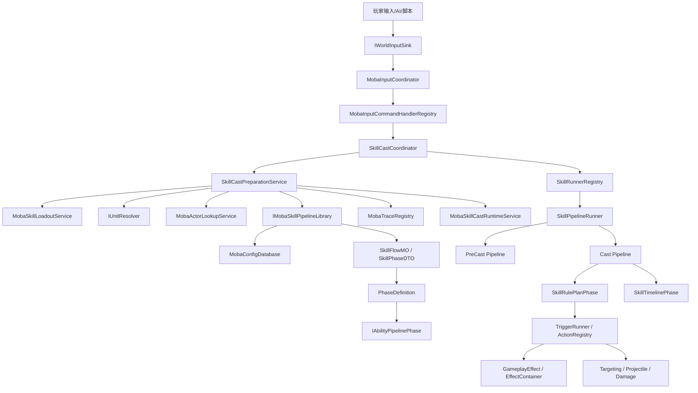
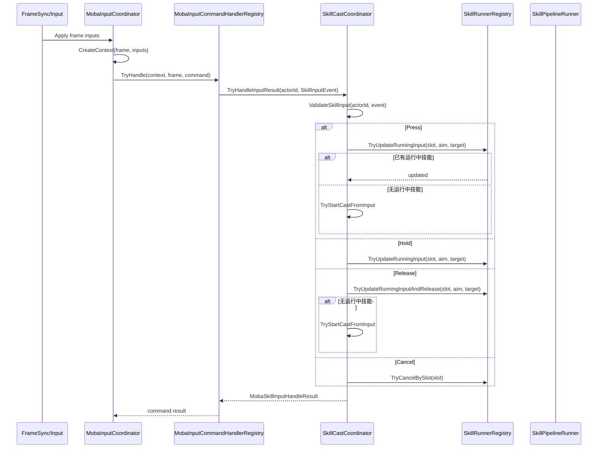
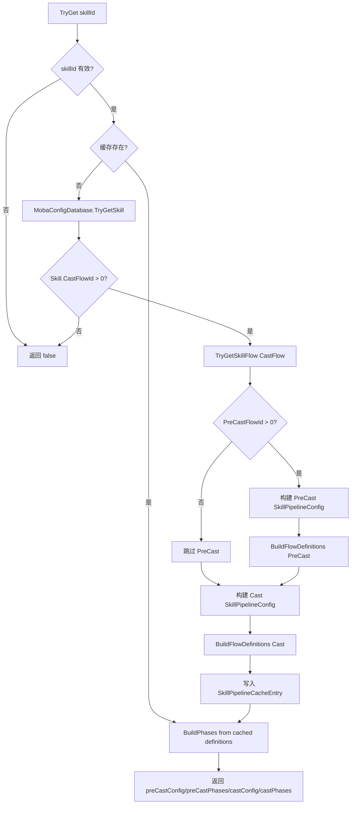
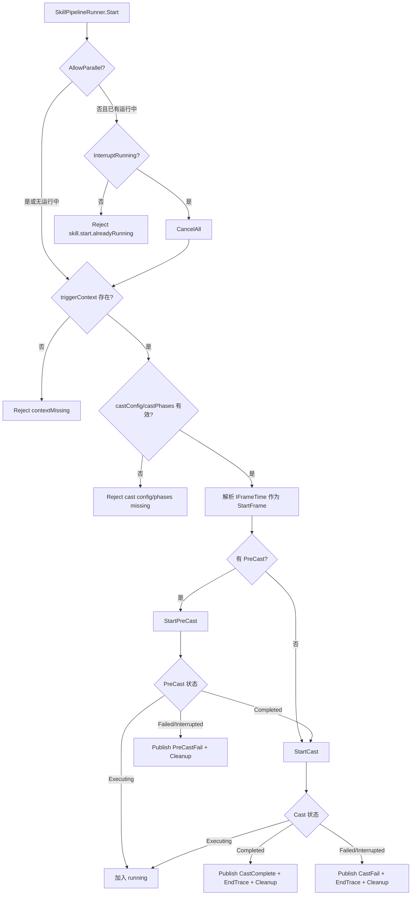
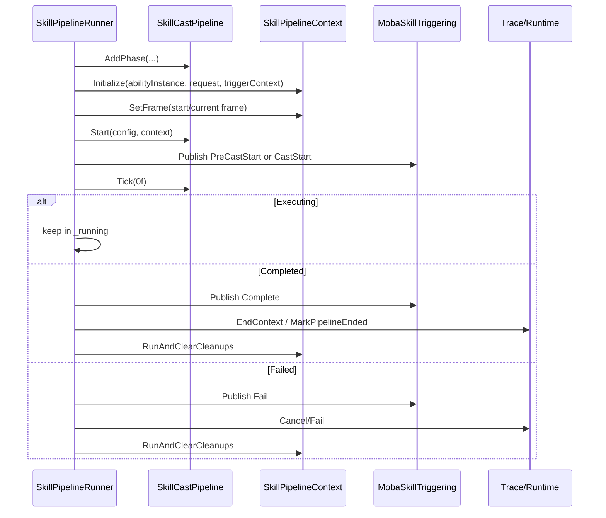
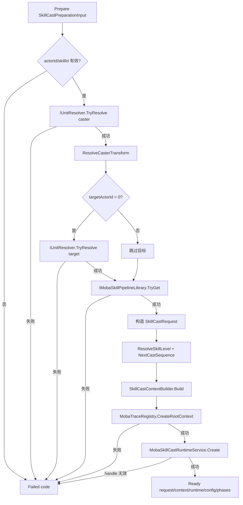
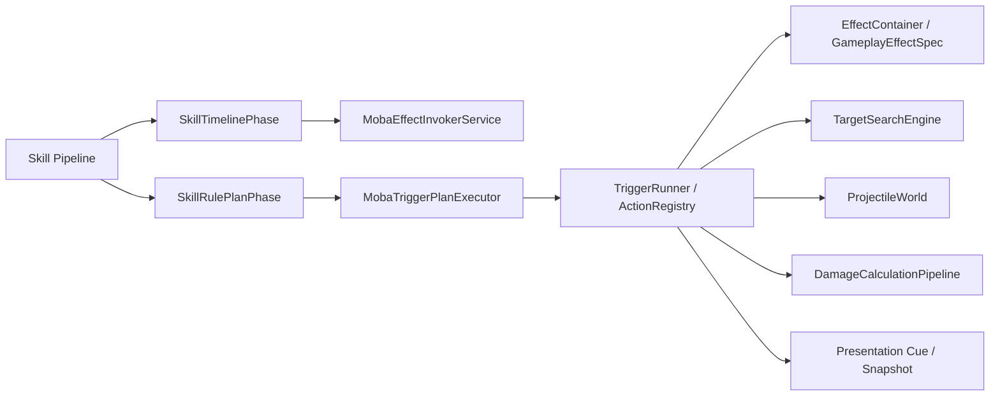

# 8.1 技能系统架构

> 本文从源码出发说明 AbilityKit 中“技能”能力的真实组成方式：框架核心并不把技能实现为一个巨型 `SkillExecutor`，而是通过输入、配置、Pipeline、Triggering、GameplayEffect、Combat 原语、Trace/Runtime 快照协作完成一次技能释放。

---

## 目录

- [8.1 技能系统架构](#81-技能系统架构)
  - [目录](#目录)
  - [1. 能力定位](#1-能力定位)
  - [2. 源码入口](#2-源码入口)
  - [3. 总体设计](#3-总体设计)
  - [4. 技能输入到释放的主流程](#4-技能输入到释放的主流程)
  - [5. 配置到 Pipeline 的构建流程](#5-配置到-pipeline-的构建流程)
  - [6. PreCast/Cast 双阶段执行模型](#6-precastcast-双阶段执行模型)
  - [7. 技能运行时上下文与生命周期追踪](#7-技能运行时上下文与生命周期追踪)
  - [8. 与 Triggering、Effect、Combat 的协作边界](#8-与-triggeringeffectcombat-的协作边界)
  - [9. 扩展点与约束](#9-扩展点与约束)
    - [9.1 扩展点](#91-扩展点)
    - [9.2 关键约束](#92-关键约束)
  - [下一步](#下一步)

---

## 1. 能力定位

AbilityKit 的技能系统不是单个包中的封闭系统，而是一个跨模块组合能力：

- `com.abilitykit.ability` 提供 GameplayEffect、Triggering 适配、Effect 生命周期等通用玩法基础。
- `com.abilitykit.pipeline` 提供可推进、可中断、可组合的执行 Pipeline 抽象。
- `com.abilitykit.triggering` 提供事件-条件-动作的正式化执行主线。
- `com.abilitykit.combat.*` 提供目标搜索、投射物、伤害、实体、运动等战斗原语。
- `com.abilitykit.demo.moba.runtime` 给出一套完整 MOBA 技能落地路径，包含输入、配置库、释放协调器、运行时追踪和 Entitas 实体同步。

因此，本文中的“技能系统架构”主要描述当前工程中最完整的 MOBA 技能闭环，而不是虚构一个框架内不存在的 `SkillConfig -> SkillExecutor` 固定结构。

---

## 2. 源码入口

| 能力 | 关键类型 | 源码 |
|------|----------|------|
| 输入协调 | `MobaInputCoordinator` | `Unity/Packages/com.abilitykit.demo.moba.runtime/Runtime/Application/Services/Input/MobaInputCoordinator.cs` |
| 释放协调 | `SkillCastCoordinator` | `Unity/Packages/com.abilitykit.demo.moba.runtime/Runtime/Application/Services/Skill/Cast/SkillCastCoordinator.cs` |
| 释放准备 | `SkillCastPreparationService` | `Unity/Packages/com.abilitykit.demo.moba.runtime/Runtime/Application/Services/Skill/Cast/SkillCastPreparationService.cs` |
| 释放上下文 | `SkillCastContext` | `Unity/Packages/com.abilitykit.demo.moba.runtime/Runtime/Application/Services/Skill/Cast/SkillCastContext.cs` |
| Pipeline 库 | `IMobaSkillPipelineLibrary` | `Unity/Packages/com.abilitykit.demo.moba.runtime/Runtime/Application/Services/Skill/Pipeline/IMobaSkillPipelineLibrary.cs` |
| 配置驱动 Pipeline | `TableDrivenMobaSkillPipelineLibrary` | `Unity/Packages/com.abilitykit.demo.moba.runtime/Runtime/Application/Services/Skill/Pipeline/TableDrivenMobaSkillPipelineLibrary.cs` |
| Pipeline 运行器 | `SkillPipelineRunner` | `Unity/Packages/com.abilitykit.demo.moba.runtime/Runtime/Application/Services/Skill/Pipeline/SkillPipelineRunner.cs` |
| 运行器注册表 | `SkillRunnerRegistry` | `Unity/Packages/com.abilitykit.demo.moba.runtime/Runtime/Application/Services/Skill/Cast/SkillRunnerRegistry.cs` |
| Pipeline 上下文 | `SkillPipelineContext` | `Unity/Packages/com.abilitykit.demo.moba.runtime/Runtime/Application/Services/Skill/Pipeline/SkillPipelineContext.cs` |
| 通用 Skill Pipeline Builder | `SkillPipelineBuilder` | `Unity/Packages/com.abilitykit.demo.moba.runtime/Runtime/Domain/Ability/Pipeline/Skill/SkillPipelineBuilder.cs` |
| Effect 生命周期 | `EffectContainer` | `Unity/Packages/com.abilitykit.ability/Runtime/Ability/Effect/EffectContainer.cs` |
| Trigger 主线 | `TriggerRunner<TCtx>` | `Unity/Packages/com.abilitykit.triggering/Runtime/Triggering/Runner/TriggerRunner.cs` |

---

## 3. 总体设计

技能能力由“输入入口 + 释放协调 + 配置构建 + Pipeline 执行 + 原语动作”分层组成。

设计拆分的主要原因：

1. **输入与技能释放解耦**：`MobaInputCoordinator` 只负责命令上下文与分发，实际释放由 `SkillCastCoordinator` 处理。
2. **准备与执行解耦**：`SkillCastPreparationService` 专注校验、解析实体、创建上下文和运行时记录；`SkillPipelineRunner` 专注推进 Pipeline。
3. **配置与运行时解耦**：`TableDrivenMobaSkillPipelineLibrary` 把表配置转为 `IAbilityPipelinePhase<SkillPipelineContext>`，运行器只消费已构建阶段。
4. **技能与效果/战斗原语解耦**：技能 Pipeline 不直接写死伤害、Buff、投射物，而是通过 RulePlan、Timeline、Triggering 动作调用 Effect 与 Combat 能力。

---

## 4. 技能输入到释放的主流程

`MobaInputCoordinator` 在世界服务准备好后绑定输入处理器，并解析 `SkillCastCoordinator`。输入到达时，它构建 `MobaInputCommandContext`，再交给命令处理器注册表分发。

关键规则：

- `Press`：优先更新运行中的同槽技能；不存在时尝试启动释放。
- `Hold`：只更新运行中技能输入，不会新建释放。
- `Release`：优先标记运行中技能释放；不存在时可启动释放，适配点击释放类技能。
- `Cancel`：按槽位取消运行中技能。

---

## 5. 配置到 Pipeline 的构建流程

`TableDrivenMobaSkillPipelineLibrary` 是当前 MOBA 示例中最完整的配置驱动 Pipeline 构建器。它从 `MobaConfigDatabase` 读取 `SkillMO` 与 `SkillFlowMO`，并将 `SkillPhaseDTO` 编译为运行时 PhaseDefinition。

`SkillPhaseDTO` 支持的主要阶段：

| 阶段 | 运行时定义 | 说明 |
|------|------------|------|
| Timeline | `TimelinePhaseDefinition` -> `SkillTimelinePhase` | 按时间轴触发技能事件或效果调用 |
| RulePlan | `RulePlanPhaseDefinition` -> `SkillRulePlanPhase` | 执行 Triggering RulePlan，连接条件和动作 |
| Sequence | `SequencePhaseDefinition` -> `AbilitySequencePhase<T>` | 子阶段顺序执行 |
| Parallel | `ParallelPhaseDefinition` -> `AbilityParallelPhase<T>` | 子阶段并行执行 |
| Repeat | `RepeatPhaseDefinition` -> `AbilityRepeatPhase<T>` | 重复执行子阶段，可设置间隔 |
| Delay | `DelayPhaseDefinition` -> `AbilityDelayPhase<T>` | 等待指定毫秒数 |

源码中特别标注：旧的 `Checks` 和 `Handlers` 阶段已经废弃，应迁移到 RulePlan 的 Trigger 条件与动作。这体现了设计方向：技能校验和效果执行尽量收敛到统一的触发器/动作体系中。

---

## 6. PreCast/Cast 双阶段执行模型

一次技能释放分为可选 `PreCast` 与必需 `Cast` 两段：

- `PreCast`：可用于前摇、吟唱、预检查、提前表现提示。
- `Cast`：正式执行技能效果、时间轴、RulePlan、投射物、伤害等。

`SkillPipelineRunner.Start` 会检查并发策略、上下文、Cast 配置和阶段列表，然后记录起始帧。如果没有 PreCast，会直接进入 Cast。

PreCast 与 Cast 都会创建新的 `SkillCastPipeline` 和 `SkillPipelineContext`：

---

## 7. 技能运行时上下文与生命周期追踪

`SkillCastPreparationService` 在执行前创建两类上下文：

1. `SkillCastContext`：释放级上下文，保存技能 ID、槽位、等级、序号、施法者、目标、瞄准、WorldServices、EventBus、运行时句柄和 Trace 根上下文。
2. `SkillPipelineContext`：Pipeline 推进上下文，保存当前阶段、状态、输入释放状态、帧号、时间、共享数据、清理回调，并实现多个 MOBA Combat/Trigger 接口。

准备流程如下：

`SkillPipelineContext` 在初始化时会把核心事实同步到通用 `IAbilityPipelineContext` 扩展字段：技能信息、参与者、瞄准、上下文类型、SourceContextId、SkillRuntimeHandle。这保证了 Pipeline Phase、Trigger Action、Effect 执行器可以通过统一上下文读取技能事实，而不是直接依赖 MOBA 专用类型。

---

## 8. 与 Triggering、Effect、Combat 的协作边界

技能 Pipeline 本身只负责“何时执行什么阶段”，不负责把所有玩法规则写死在技能类里。实际效果通常通过两条路径触发：

边界说明：

- **技能输入层**：处理按下、持续、释放、取消等操作语义。
- **技能释放层**：创建上下文、检查并发策略、启动/取消 Pipeline。
- **技能配置层**：把表配置转换为可执行 Phase，不直接修改战斗状态。
- **Triggering 层**：承载条件判断和动作执行，是数据化玩法逻辑主线。
- **Effect 层**：管理 Buff/GameplayEffect 生命周期，包括 Apply、Tick、Remove。
- **Combat 层**：提供 Targeting、Projectile、Damage 等可测试战斗原语。
- **表现/同步层**：通过快照、Trace、Cue、ViewEvent 把逻辑结果投递到客户端表现或网络同步。

---

## 9. 扩展点与约束

### 9.1 扩展点

| 扩展点 | 方式 | 适用场景 |
|--------|------|----------|
| 新技能阶段 | 扩展 `SkillPhaseDTO` 到 `PhaseDefinition` 的映射 | 新增特殊阶段类型 |
| 新技能动作 | 注册 Triggering `ActionRegistry` / PlanActionModule | 数据化技能效果、位移、召唤、投射物 |
| 新条件 | 注册 Triggering `FunctionRegistry` 或条件 Factory | 冷却、资源、距离、Tag、状态判断 |
| 新 Combat 原语 | 新增 `combat.*` 模块服务，再由 Action 调用 | 新目标搜索、新弹道、新伤害类型 |
| 新释放策略 | 扩展 `SkillCastPolicyResolver` | 并发、打断、蓄力、引导技能规则 |
| 新输入语义 | 扩展输入命令 Handler 或 `SkillInputPhase` 处理 | 长按、拖拽、二段释放、取消确认 |

### 9.2 关键约束

1. **不要把技能写成巨型 Executor**：复杂逻辑应拆到 Pipeline Phase、Trigger PlanAction、Effect Component、Combat Service。
2. **不要在配置构建阶段修改世界状态**：`TableDrivenMobaSkillPipelineLibrary` 只构建 Phase，状态修改应发生在运行时动作中。
3. **需要可回放/可同步的逻辑必须确定性**：随机值、时间、帧号应由上层注入或来自 `IFrameTime`。
4. **运行时必须可追踪**：正式技能释放应创建 `MobaTraceRegistry` 根上下文和 `MobaSkillCastRuntimeService` runtime handle。
5. **清理必须集中处理**：阶段订阅、临时对象、持续效果绑定应注册到 `SkillPipelineContext` cleanup 中。
6. **旧 Checks/Handlers 阶段不应继续扩散**：源码已明确要求迁移到 RulePlan 条件与动作。

---

## 下一步

- [玩法能力地图](00-GameplayCapabilityMap.md) - 玩法层整体能力与模块协作。
- [触发器系统](02-TriggeringSystem.md) - 事件、条件、动作、计划化执行。
- [Buff 系统](03-BuffSystem.md) - GameplayEffect 生命周期与 Buff 表达。

---

*文档版本：v2.0 | 最后更新：2026-06-23*
