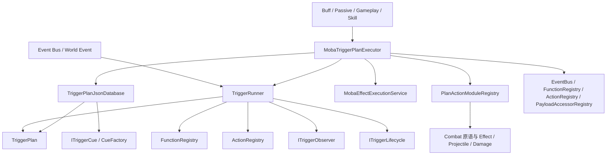
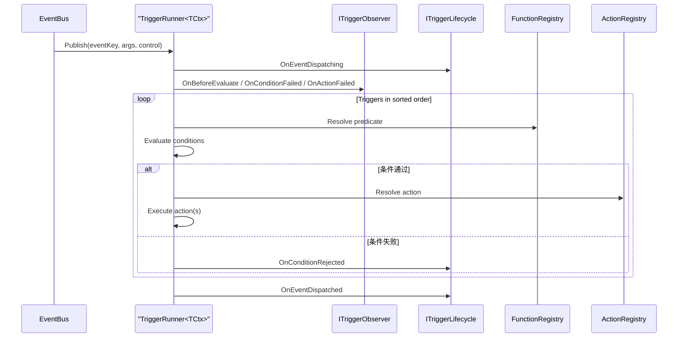
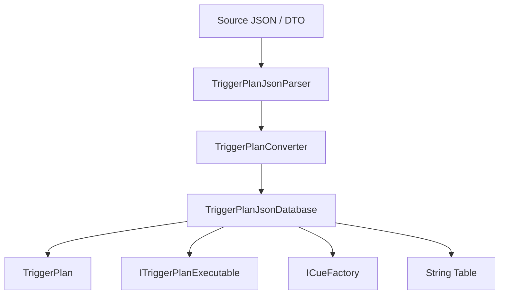
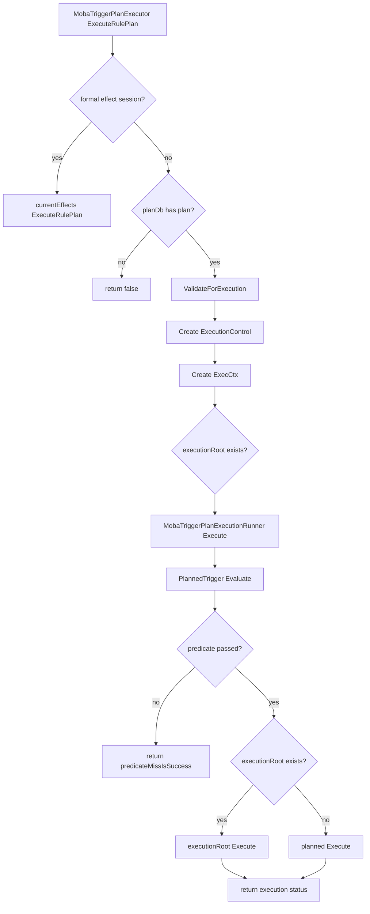
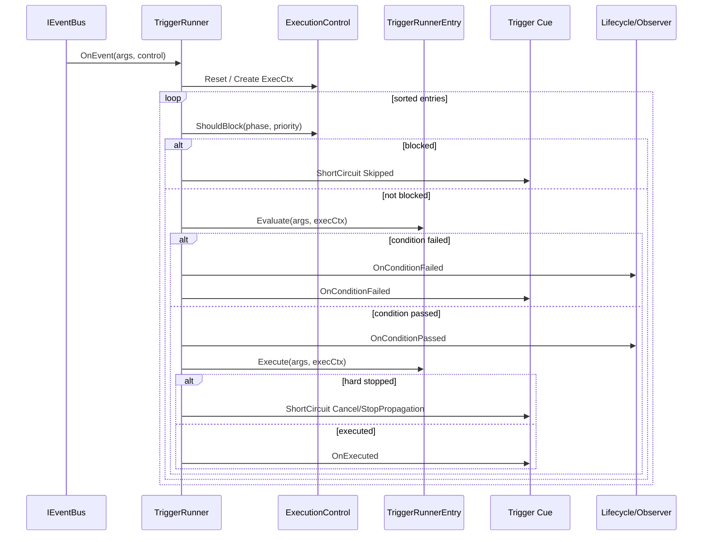

# 8.2 触发器系统

> 本文从源码出发说明 AbilityKit 中 Triggering 的真实职责：它不是单一的“条件-动作脚本”，而是由 `TriggerPlan<TArgs>`、`TriggerRunner<TCtx>`、计划数据库、函数/动作注册表、MOBA 规则计划执行器和持续触发计划调和系统共同组成的可扩展玩法执行层。

---

## 目录

- [8.2 触发器系统](#82-触发器系统)
  - [目录](#目录)
  - [1. 能力定位](#1-能力定位)
  - [2. 源码入口](#2-源码入口)
  - [3. 设计总览](#3-设计总览)
  - [4. 核心数据模型](#4-核心数据模型)
    - [4.1 `TriggerPlan<TArgs>`](#41-triggerplantargs)
    - [4.2 `ActionArgValue` 与 Schema](#42-actionargvalue-与-schema)
    - [4.3 `FunctionRegistry` 与 `ActionRegistry`](#43-functionregistry-与-actionregistry)
  - [5. 运行时执行主线](#5-运行时执行主线)
    - [5.1 执行顺序](#51-执行顺序)
    - [5.2 运行时行为](#52-运行时行为)
  - [6. JSON 计划加载与注册](#6-json-计划加载与注册)
    - [6.1 数据结构重点](#61-数据结构重点)
    - [6.2 装载与执行的关系](#62-装载与执行的关系)
    - [6.3 模块注册](#63-模块注册)
  - [7. MOBA 玩法中的规则计划协作](#7-moba-玩法中的规则计划协作)
    - [7.1 执行器职责](#71-执行器职责)
    - [7.2 运行时依赖](#72-运行时依赖)
    - [7.3 规则计划执行流程](#73-规则计划执行流程)
    - [7.4 与 TriggerRunner 事件主线的边界](#74-与-triggerrunner-事件主线的边界)
  - [8. 持续触发计划调和](#8-持续触发计划调和)
    - [8.1 数据承载](#81-数据承载)
    - [8.2 系统调和](#82-系统调和)
    - [8.3 相关系统链路](#83-相关系统链路)
  - [9. 扩展点与约束](#9-扩展点与约束)
    - [9.1 扩展点](#91-扩展点)
    - [9.2 关键约束](#92-关键约束)
  - [下一步](#下一步)

---

## 1. 能力定位

Triggering 是 AbilityKit 的“玩法规则执行层”，负责把事件、条件、动作、执行控制、Cue、调度模式组合成可运行的计划。

它解决的问题不是“写一个巨大的技能类”，而是：

- 如何将事件分发给多个触发器，并保持稳定排序。
- 如何将条件表达为函数、表达式、黑板/数值引用等可组合结构。
- 如何将动作抽象为可注册、可解析、可调试的模块。
- 如何支持持续行为、打断、优先级阻塞、调度与短路。
- 如何把规则计划接到 MOBA 的技能、Buff、投射物、表现和战斗原语上。

Triggering 的核心对象是 `TriggerPlan<TArgs>`，核心运行器是 [`TriggerRunner<TCtx>`](../../../Unity/Packages/com.abilitykit.triggering/Runtime/Triggering/Runner/TriggerRunner.cs:19)，核心计划数据库是 [`TriggerPlanJsonDatabase`](../../../Unity/Packages/com.abilitykit.triggering/Runtime/Plans/Serialization/Json/Database/TriggerPlanJsonDatabase.cs:20)。

---

## 2. 源码入口

| 能力 | 关键类型 | 源码 |
|------|----------|------|
| 触发计划模型 | `TriggerPlan<TArgs>` | [`TriggerPlan.cs`](../../../Unity/Packages/com.abilitykit.triggering/Runtime/Plans/Model/TriggerPlan.cs:12) |
| 动作参数与模块接口 | `IActionSchema`, `IPlanActionModule` | [`ActionArgs.cs`](../../../Unity/Packages/com.abilitykit.triggering/Runtime/Plans/Model/ActionArgs.cs:47) |
| 函数注册表 | `FunctionRegistry` | [`FunctionRegistry.cs`](../../../Unity/Packages/com.abilitykit.triggering/Runtime/Registries/FunctionRegistry.cs:6) |
| 动作注册表 | `ActionRegistry` | [`ActionRegistry.cs`](../../../Unity/Packages/com.abilitykit.triggering/Runtime/Registries/ActionRegistry.cs:6) |
| 主运行器 | `TriggerRunner<TCtx>` | [`TriggerRunner.cs`](../../../Unity/Packages/com.abilitykit.triggering/Runtime/Triggering/Runner/TriggerRunner.cs:19) |
| JSON 计划库 | `TriggerPlanJsonDatabase` | [`TriggerPlanJsonDatabase.cs`](../../../Unity/Packages/com.abilitykit.triggering/Runtime/Plans/Serialization/Json/Database/TriggerPlanJsonDatabase.cs:20) |
| MOBA 计划执行器 | `MobaTriggerPlanExecutor` | [`MobaTriggerPlanExecutor.cs`](../../../Unity/Packages/com.abilitykit.demo.moba.runtime/Runtime/Application/Services/Skill/Effects/MobaTriggerPlanExecutor.cs:13) |
| MOBA 动作模块注册 | `PlanActionModuleRegistry` | [`PlanActionModuleRegistry.cs`](../../../Unity/Packages/com.abilitykit.demo.moba.runtime/Runtime/Application/Services/Triggering/PlanActions/Core/PlanActionModuleRegistry.cs:12) |
| 持续触发计划调和 | `MobaOngoingTriggerPlansReconcileSystem` | [`MobaOngoingTriggerPlansReconcileSystem.cs`](../../../Unity/Packages/com.abilitykit.demo.moba.runtime/Runtime/Application/Systems/Triggering/MobaOngoingTriggerPlansReconcileSystem.cs:10) |
| 持续触发计划存储 | `OngoingTriggerPlansComponent` | [`OngoingTriggerPlansComponent.cs`](../../../Unity/Packages/com.abilitykit.demo.moba.runtime/Runtime/Domain/Components/OngoingTriggerPlansComponent.cs:8) |

---

## 3. 设计总览

Triggering 的设计可分为四层：

1. **计划模型层**：定义触发器、条件、动作、Cue、调度和执行控制。
2. **运行时层**：`TriggerRunner<TCtx>` 负责订阅事件、排序、评估、执行和生命周期通知。
3. **计划装载层**：`TriggerPlanJsonDatabase` 从 JSON / Source DTO 解析出可运行计划。
4. **领域协作层**：MOBA 项目通过 `MobaTriggerPlanExecutor`、`PlanActionModuleRegistry`、`MobaEffectExecutionService`、`MobaTriggerPlanSubscriptionService` 把触发器接到玩法系统。

这个设计的关键点是：

- 触发器计划是**数据结构**，不是硬编码类层级。
- 动作执行是**注册表驱动**，不是 switch 巨型分支。
- 持续计划是**显式调和**，不是隐式地“挂在对象上自动跑”。
- MOBA 玩法把 Triggering 当作规则执行背板，而不是替代技能系统。

---

## 4. 核心数据模型

### 4.1 `TriggerPlan<TArgs>`

[`TriggerPlan<TArgs>`](../../../Unity/Packages/com.abilitykit.triggering/Runtime/Plans/Model/TriggerPlan.cs:12) 是触发器的不可变主模型，包含：

- `Phase`：阶段。
- `Priority`：优先级。
- `TriggerId`：触发器 ID。
- `InterruptPriority`：打断阈值。
- `PredicateKind` / `HasPredicate` / `PredicateId` / `PredicateExpr`：条件定义。
- `Actions`：动作调用数组。
- `Cue`：表现 Cue。
- `Schedule`：调度模式。
- `ExecutionControl`：执行控制。

源码中提供了三类构造器：

- 无条件触发器。
- 函数条件触发器。
- 表达式条件触发器。

这说明 Triggering 在抽象上同时支持：

- 纯数据判定；
- 函数条件；
- 表达式树条件；
- 多动作串联；
- 生命周期控制。

### 4.2 `ActionArgValue` 与 Schema

[`ActionArgs.cs`](../../../Unity/Packages/com.abilitykit.triggering/Runtime/Plans/Model/ActionArgs.cs:11) 定义了动作参数系统：

- `ActionArgValue`：具名参数值引用。
- `IActionSchema<TActionArgs, TCtx>`：动作参数 Schema。
- `ITriggerActionParseContextAwareSchema<TActionArgs, TCtx>`：支持解析上下文。
- `ITriggerArgsAwareActionSchema<TActionArgs, TCtx>`：支持读取触发参数。
- `IPlanActionModule`：动作模块注册接口。

这表示 Triggering 的动作不是“只存一个字符串函数名”，而是具备：

- 强类型参数解析；
- 上下文感知；
- 运行时注册；
- 与 WorldResolver/DI 的集成。

### 4.3 `FunctionRegistry` 与 `ActionRegistry`

[`FunctionRegistry`](../../../Unity/Packages/com.abilitykit.triggering/Runtime/Registries/FunctionRegistry.cs:6) 和 [`ActionRegistry`](../../../Unity/Packages/com.abilitykit.triggering/Runtime/Registries/ActionRegistry.cs:6) 分别负责：

- 条件函数的注册与精确类型检索；
- 动作委托的注册与精确类型检索。

它们都带有 `IsDeterministic` 标记，这对帧同步、回放和可复现性很重要。

---

## 5. 运行时执行主线

[`TriggerRunner<TCtx>`](../../../Unity/Packages/com.abilitykit.triggering/Runtime/Triggering/Runner/TriggerRunner.cs:19) 是 Triggering 的主运行器。

它的职责包括：

- 监听 `EventBus`。
- 维护按事件键分组的触发器列表。
- 稳定排序并执行。
- 评估条件。
- 执行动作。
- 管理短路和优先级阻塞。
- 通知 observer / lifecycle。
- 推进 `ActionSchedulerManager`。

### 5.1 执行顺序

### 5.2 运行时行为

从源码可见，`TriggerRunner<TCtx>` 支持：

- `Register`：按事件键注册触发器。
- 触发器排序：按 phase / priority / registration order。
- 条件失败短路。
- 执行中的异常通知。
- 短路原因上报。
- 执行控制对象复位。

这套结构使得 Triggering 可以稳定承载：

- Buff 触发；
- 被动技能触发；
- 玩法规则触发；
- 表现 Cue 分发；
- 持续调度。

---

## 6. JSON 计划加载与注册

[`TriggerPlanJsonDatabase`](../../../Unity/Packages/com.abilitykit.triggering/Runtime/Plans/Serialization/Json/Database/TriggerPlanJsonDatabase.cs:20) 是计划装载入口。

它支持两种数据来源：

1. **运行时格式**：`Triggers + Strings`，直接加载。
2. **源格式**：`triggers + actions/conditions/nodes`，自动转换后加载。

### 6.1 数据结构重点

`TriggerPlanJsonDatabase` 里包含：

- `TriggerPlanDatabaseDto`
- `TriggerPlanDto`
- `TriggerPlanModuleTemplateDto`
- `TriggerPlanModuleInstanceDto`
- `PredicatePlanDto`
- `ActionCallPlanDto`
- `ExecutionControlPlanDto`
- `ExecutionNodeDto`

这说明触发器计划不止是“条件 + 动作”扁平结构，而是支持：

- 模板化；
- 模块实例化；
- 表达式/节点化执行；
- Cue 工厂；
- ID/字符串表分离。

### 6.2 装载与执行的关系

### 6.3 模块注册

[`PlanActionModuleRegistry`](../../../Unity/Packages/com.abilitykit.demo.moba.runtime/Runtime/Application/Services/Triggering/PlanActions/Core/PlanActionModuleRegistry.cs:12) 会扫描当前程序集中的 `IPlanActionModule` 实现，并通过 `[PlanActionModule]` 排序生成可用模块列表。

这意味着：

- 计划动作是“发现式”注册。
- 动作模块可以按 order 排序。
- 动作模块实例能被导入到 `ActionRegistry` 驱动的执行链中。

---

## 7. MOBA 玩法中的规则计划协作

MOBA 项目并不是直接把 `TriggerRunner<TCtx>` 暴露给技能逻辑，而是通过 [`MobaTriggerPlanExecutor`](../../../Unity/Packages/com.abilitykit.demo.moba.runtime/Runtime/Application/Services/Skill/Effects/MobaTriggerPlanExecutor.cs:13) 做适配。技能 Pipeline 中的 [`SkillRulePlanPhase`](../../../Unity/Packages/com.abilitykit.demo.moba.runtime/Runtime/Application/Services/Skill/Phases/SkillRulePlanPhase.cs:7) 会直接调用 `ExecuteRulePlan(triggerId, context)`，因此 RulePlan 阶段是技能释放主链路上的同步门禁点，不是被动订阅式触发器。

### 7.1 执行器职责

`MobaTriggerPlanExecutor` 的主要职责：

- 从 `TriggerPlanJsonDatabase` 获取计划。
- 组装 `ExecCtx<IWorldResolver>`。
- 在必要时切换到正式 Effect 会话。
- 交给 `MobaTriggerPlanExecutionRunner` 执行。
- 对异常进行统一战斗域上报。

它有两个公开执行入口，语义不同：

| 方法 | predicate 未命中语义 | 典型用途 |
|------|---------------------|----------|
| `Execute(triggerId, args)` | `predicateMissIsSuccess: true`，条件不满足可视为本次没有动作但不算失败 | 普通触发、效果联动、可选规则 |
| `ExecuteRulePlan(triggerId, args)` | `predicateMissIsSuccess: false`，条件不满足会让规则计划返回失败 | 技能 `SkillRulePlanPhase`，配合 `AbortOnFailure` 中止释放 |

这个差异解释了为什么技能校验迁移到 RulePlan 后仍然可以阻断释放：`SkillRulePlanPhase` 会在 `ExecuteRulePlan` 返回 false 且 `AbortOnFailure` 为 true 时写入 `context.FailReason` 并设置 `context.IsAborted`。

### 7.2 运行时依赖

[`MobaTriggerPlanExecutorRuntime.cs`](../../../Unity/Packages/com.abilitykit.demo.moba.runtime/Runtime/Application/Services/Skill/Effects/MobaTriggerPlanExecutorRuntime.cs:11) 定义了：

- `MobaTriggerPlanRuntimeDependencies`
- `MobaTriggerPlanEffectResolver`
- `MobaTriggerPlanExecutionContextFactory`
- `MobaTriggerPlanExecutionRunner`

这里最重要的设计点是：

- 规则计划可以在普通世界上下文中执行；
- 也可以在正式 Effect Trace 会话中执行；
- 执行上下文会自动注入 `MobaEffectExecutionService`。

### 7.3 规则计划执行流程

这条链路说明，MOBA 的规则计划实际上是 Triggering 的一种“高层执行入口”，用来把技能、Buff、投射物、表现、玩法变量等串联起来。它与 `TriggerRunner<TCtx>` 的事件订阅式执行不同：`TriggerRunner<TCtx>` 通过 `IEventBus.Subscribe` 接收事件，按 phase、priority 和 registration order 遍历；`MobaTriggerPlanExecutor` 则是按 triggerId 直接拉取计划并同步执行。

### 7.4 与 TriggerRunner 事件主线的边界

[`TriggerRunner<TCtx>`](../../../Unity/Packages/com.abilitykit.triggering/Runtime/Triggering/Runner/TriggerRunner.cs:19) 的真实主线包括：

1. `Register` 把触发器插入按 `phase -> priority -> order` 排序的列表，并确保对应 `EventKey<TArgs>` 已订阅到 `IEventBus`。
2. `Dispatch` 为每次事件创建新的 `ExecutionControl` 和 `ExecCtx<TCtx>`。
3. 每个 entry 先检查 `ExecutionControl.ShouldBlock`，再执行 `Evaluate`。
4. 条件失败会通知 lifecycle、observer 和 Cue；在 `EInterruptPolicy.Strict` 下会中断当前事件派发。
5. 动作执行后如果 `ExecutionControl.IsHardStopped`，会按 `Cancel` 或 `StopPropagation` 结束后续触发器。
6. `ActionSchedulerManager` 挂在 runner runtime services 上，用于延迟动作和计划内调度，而不是散落在各个动作里。

因此，事件响应、被动订阅、持续行为更适合走 `TriggerRunner<TCtx>`；技能 Pipeline 内部的强校验/强顺序规则更适合走 `SkillRulePlanPhase -> MobaTriggerPlanExecutor.ExecuteRulePlan`。

---

## 8. 持续触发计划调和

持续计划不是靠 TriggerRunner 内部“隐式持有状态”完成的，而是通过组件和系统显式调和。

### 8.1 数据承载

[`OngoingTriggerPlansComponent`](../../../Unity/Packages/com.abilitykit.demo.moba.runtime/Runtime/Domain/Components/OngoingTriggerPlansComponent.cs:8) 存储：

- 当前激活的持续触发计划列表；
- `Revision` 版本号。

### 8.2 系统调和

[`MobaOngoingTriggerPlansReconcileSystem`](../../../Unity/Packages/com.abilitykit.demo.moba.runtime/Runtime/Application/Systems/Triggering/MobaOngoingTriggerPlansReconcileSystem.cs:10) 在世界执行阶段收集所有实体上的持续计划，再交给 [`MobaTriggerPlanReconcileService`](../../../Unity/Packages/com.abilitykit.demo.moba.runtime/Runtime/Application/Services/Triggering/MobaTriggerPlanReconcileService.cs:16) 进行同步。

调和逻辑的价值是：

- 被动技能、Buff、持续光环、区域效果可以统一管理；
- 计划增删都能追踪 revision；
- 取消和失效可以集中清理。

### 8.3 相关系统链路

```mermaid
flowchart LR
    Passive[PassiveSkillLifecycle] --> Component[OngoingTriggerPlansComponent]
    Component --> ReconcileSys[MobaOngoingTriggerPlansReconcileSystem]
    ReconcileSys --> ReconcileSvc[MobaTriggerPlanReconcileService]
    ReconcileSvc --> Subscription[MobaTriggerPlanSubscriptionService]
    Subscription --> Runner["TriggerRunner<IWorldResolver>"]
```

---

## 9. 扩展点与约束

### 9.1 扩展点

| 扩展点 | 方式 | 适用场景 |
|--------|------|----------|
| 新条件函数 | 注册到 `FunctionRegistry` | 冷却、距离、标签、资源、状态判断 |
| 新动作函数 | 注册到 `ActionRegistry` | 伤害、治疗、位移、召唤、表现 |
| 新动作模块 | 实现 `IPlanActionModule` 并加 `[PlanActionModule]` | MOBA 专用计划动作 |
| 新计划来源 | 扩展 `TriggerPlanJsonDatabase` 转换器 | UGC、编辑器、在线热更 |
| 新触发执行入口 | 封装领域执行器 | 其他玩法模块接入 Triggering |
| 新持续计划调和逻辑 | 扩展 reconcile system / service | 光环、被动、区域、召唤体 |

### 9.2 关键约束

1. **TriggerPlan 是数据，不是逻辑容器**：逻辑应落在 function / action / executable / runner 中。
2. **动作必须可注册、可定位**：不能依赖隐藏反射魔法替代注册表。
3. **条件与动作要考虑确定性**：帧同步和回放场景下，随机和时间必须受控。
4. **持续计划必须显式调和**：不要把长期行为藏在单次触发执行中。
5. **MOBA 规则计划应尽量走正式 Effect/Trace 会话**：这样才能接入诊断、追踪与统一清理。
6. **PlanAction 模块应避免把战斗原语写死成一层巨类**：应拆成小动作模块并按职责组合。
7. **不要混淆事件触发与直接计划执行**：`TriggerRunner<TCtx>` 面向事件订阅和排序派发，`MobaTriggerPlanExecutor.ExecuteRulePlan` 面向同步规则门禁。
8. **技能 RulePlan 失败语义必须显式配置**：需要阻断释放时应使用 `AbortOnFailure`，并提供可诊断的 `FailReason`。

---

## 下一步

- [Buff 系统](03-BuffSystem.md) - Buff 生命周期。
- [投射物系统](04-ProjectileSystem.md) - 投射物实现。

---

*文档版本：v2.1 | 最后更新：2026-07-04*
