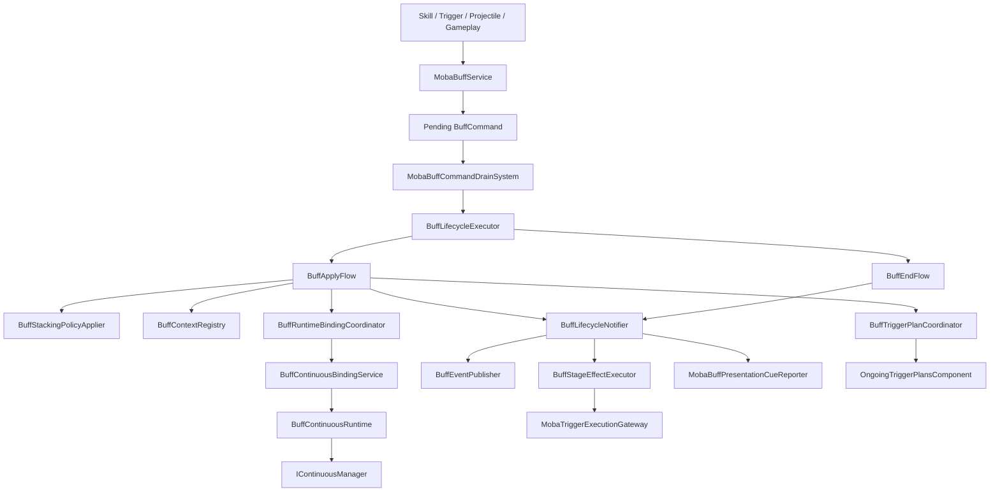
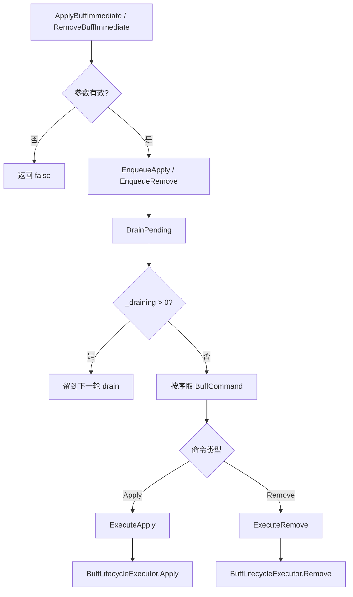
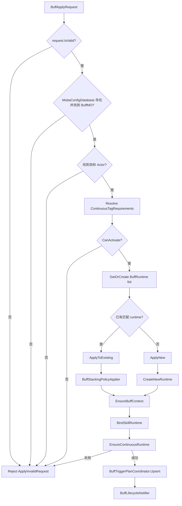
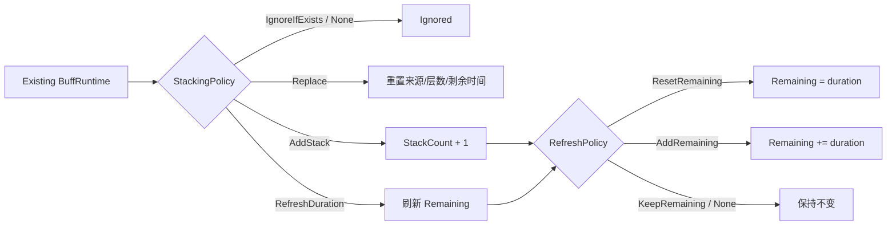
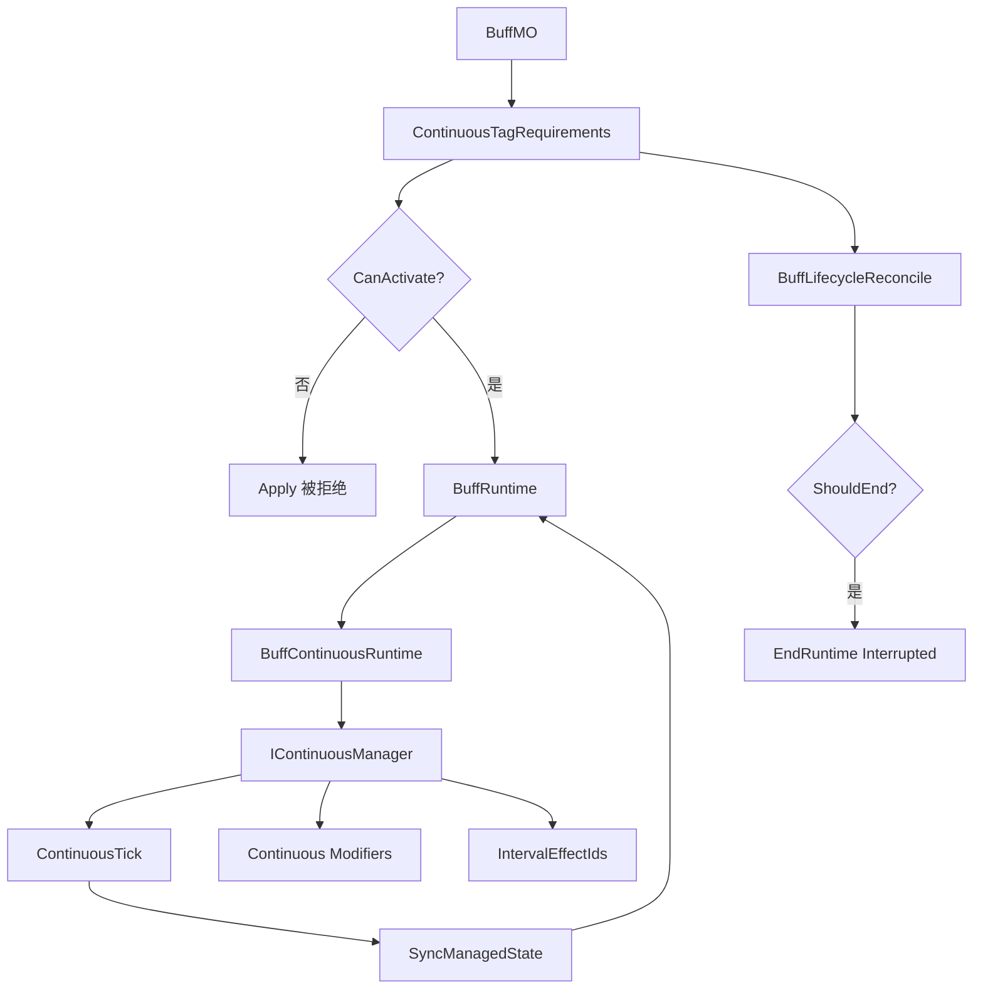
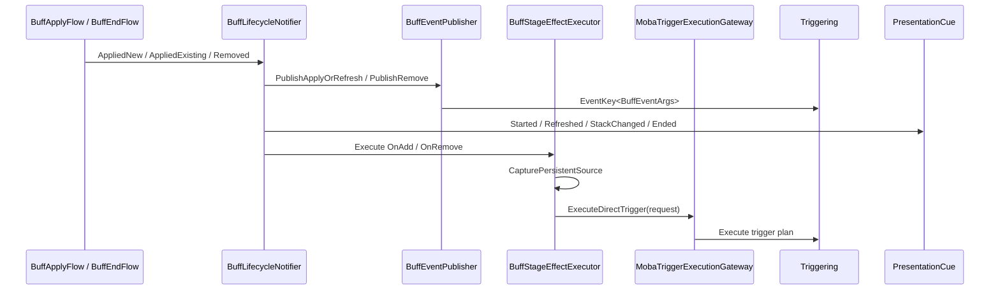
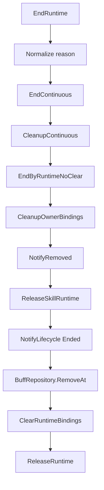
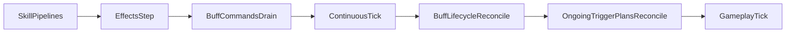

# 8.3 Buff 系统

> 本文从源码出发说明 AbilityKit MOBA 示例中的 Buff 设计：Buff 不是一个直接改属性的临时对象，而是由配置模型、命令队列、生命周期编排、持续行为、标签门禁、阶段 Trigger、表现 Cue、技能运行时绑定与持续触发计划共同组成的玩法状态系统。

---

## 目录

- [8.3 Buff 系统](#83-buff-系统)
  - [目录](#目录)
  - [1. 能力定位](#1-能力定位)
  - [2. 源码入口](#2-源码入口)
  - [3. 设计总览](#3-设计总览)
  - [4. 配置与运行时模型](#4-配置与运行时模型)
    - [4.1 `BuffMO`](#41-buffmo)
    - [4.2 `BuffRuntime`](#42-buffruntime)
    - [4.3 来源上下文](#43-来源上下文)
  - [5. 应用与移除入口](#5-应用与移除入口)
  - [6. Apply 生命周期主线](#6-apply-生命周期主线)
  - [7. 叠层与刷新策略](#7-叠层与刷新策略)
  - [8. 持续行为、标签与属性/技能参数修饰](#8-持续行为标签与属性技能参数修饰)
  - [9. 阶段事件与 Triggering 协作](#9-阶段事件与-triggering-协作)
  - [10. 结束与清理顺序](#10-结束与清理顺序)
  - [11. 系统顺序与一致性约束](#11-系统顺序与一致性约束)
  - [12. 扩展点与约束](#12-扩展点与约束)
    - [12.1 扩展点](#121-扩展点)
    - [12.2 关键约束](#122-关键约束)
  - [13. 关联文档](#13-关联文档)

---

## 1. 能力定位

Buff 系统承担的是“持续玩法状态”的统一承载能力。它覆盖的不是单一的“加攻击力”逻辑，而是：

- 将技能、触发器、投射物、召唤物等来源产生的状态统一收敛为 Buff 运行时。
- 通过命令队列统一处理 apply/remove，降低重入和生命周期交叉修改风险。
- 通过配置驱动 OnAdd、OnRemove、OnInterval、持续 TriggerPlan、标签门禁和连续修饰。
- 通过 `MobaContinuousManager` 接入持续 Tick、剩余时间、间隔效果和 Modifier 投影。
- 通过 `MobaTraceRegistry`、`MobaRuntimeLifecycleHookService`、`MobaSkillCastRuntimeService` 保持可追踪、可诊断、可归因。
- 通过 `OngoingTriggerPlansComponent` 把 Buff 持续触发计划交给 Triggering 的调和链路。

从设计上看，Buff 系统更像“持续上下文容器 + 生命周期编排器”，而不是属性系统或 Triggering 系统的替代品。

---

## 2. 源码入口

| 能力 | 关键类型 | 源码 |
|------|----------|------|
| 对外入口服务 | `MobaBuffService` | [`MobaBuffService.cs`](../../../Unity/Packages/com.abilitykit.demo.moba.runtime/Runtime/Application/Services/Buffs/MobaBuffService.cs:27) |
| Buff 配置模型 | `BuffMO`, `ContinuousModifierMO` | [`BuffMO.cs`](../../../Unity/Packages/com.abilitykit.demo.moba.runtime/Runtime/Infrastructure/Config/BattleDemo/MO/BuffMO.cs:69) |
| Actor 运行时组件 | `BuffsComponent`, `BuffRuntime` | [`BuffComponent.cs`](../../../Unity/Packages/com.abilitykit.demo.moba.runtime/Runtime/Domain/Components/BuffComponent.cs:10) |
| 生命周期编排 | `BuffLifecycleExecutor` | [`BuffLifecycleExecutor.cs`](../../../Unity/Packages/com.abilitykit.demo.moba.runtime/Runtime/Application/Services/Buffs/Lifecycle/BuffLifecycleExecutor.cs:57) |
| Apply 流程 | `BuffApplyFlow` | [`BuffApplyFlow.cs`](../../../Unity/Packages/com.abilitykit.demo.moba.runtime/Runtime/Application/Services/Buffs/Lifecycle/BuffApplyFlow.cs:16) |
| End 流程 | `BuffEndFlow` | [`BuffEndFlow.cs`](../../../Unity/Packages/com.abilitykit.demo.moba.runtime/Runtime/Application/Services/Buffs/Lifecycle/BuffEndFlow.cs:16) |
| 叠层策略 | `BuffStackingPolicyApplier` | [`BuffStackingPolicyApplier.cs`](../../../Unity/Packages/com.abilitykit.demo.moba.runtime/Runtime/Application/Services/Buffs/Core/BuffStackingPolicyApplier.cs:42) |
| 持续行为绑定 | `BuffContinuousBindingService` | [`BuffContinuousBindingService.cs`](../../../Unity/Packages/com.abilitykit.demo.moba.runtime/Runtime/Application/Services/Buffs/Runtime/BuffContinuousBindingService.cs:16) |
| 持续运行时 | `BuffContinuousRuntime` | [`BuffContinuousRuntime.cs`](../../../Unity/Packages/com.abilitykit.demo.moba.runtime/Runtime/Application/Services/Buffs/Runtime/BuffContinuousRuntime.cs:17) |
| 阶段 Trigger 执行 | `BuffStageEffectExecutor`, `BuffTriggerContext` | [`BuffStageEffectExecutor.cs`](../../../Unity/Packages/com.abilitykit.demo.moba.runtime/Runtime/Application/Services/Buffs/BuffStageEffectExecutor.cs:16) |
| 生命周期通知 | `BuffLifecycleNotifier` | [`BuffLifecycleNotifier.cs`](../../../Unity/Packages/com.abilitykit.demo.moba.runtime/Runtime/Application/Services/Buffs/Lifecycle/BuffLifecycleNotifier.cs:12) |
| Buff 事件发布 | `BuffEventPublisher` | [`BuffEventPublisher.cs`](../../../Unity/Packages/com.abilitykit.demo.moba.runtime/Runtime/Application/Services/Buffs/BuffEventPublisher.cs:20) |
| 持续 Trigger 绑定 | `BuffTriggerPlanCoordinator` | [`BuffTriggerPlanCoordinator.cs`](../../../Unity/Packages/com.abilitykit.demo.moba.runtime/Runtime/Application/Services/Buffs/Lifecycle/BuffTriggerPlanCoordinator.cs:11) |
| 命令队列系统 | `MobaBuffCommandDrainSystem` | [`MobaBuffCommandDrainSystem.cs`](../../../Unity/Packages/com.abilitykit.demo.moba.runtime/Runtime/Application/Systems/Buffs/MobaBuffCommandDrainSystem.cs:9) |
| 生命周期调和系统 | `MobaBuffLifecycleReconcileSystem` | [`MobaBuffLifecycleReconcileSystem.cs`](../../../Unity/Packages/com.abilitykit.demo.moba.runtime/Runtime/Application/Systems/Buffs/MobaBuffLifecycleReconcileSystem.cs:10) |
| 系统顺序约束 | `MobaSystemOrder` | [`MobaSystemOrder.cs`](../../../Unity/Packages/com.abilitykit.demo.moba.runtime/Runtime/Application/Systems/MobaSystemOrder.cs:62) |

---

## 3. 设计总览

Buff 系统分成五层：

1. **入口层**：`MobaBuffService` 接收 apply/remove 请求，并统一进入命令队列。
2. **生命周期层**：`BuffLifecycleExecutor` 调度 `BuffApplyFlow`、`BuffEndFlow`、叠层策略、上下文、通知、绑定与清理。
3. **持续行为层**：`BuffContinuousRuntime` 接入 `IContinuousManager`，处理持续时间、间隔、标签和 Modifier 投影。
4. **领域协作层**：通过 `BuffStageEffectExecutor`、`BuffEventPublisher`、`BuffTriggerPlanCoordinator` 连接 Triggering、Effect、Presentation、Skill Runtime。
5. **系统调和层**：`MobaBuffCommandDrainSystem` 与 `MobaBuffLifecycleReconcileSystem` 在固定 WorldSystem 顺序中推进命令和生命周期。

关键设计点：

- 外部调用可以是 immediate，但内部仍先入队再 drain，保证同一路径。
- 生命周期细节不放在入口服务中，而是由专门的 Flow 和 Coordinator 组合。
- Buff 的“时间”与“修饰”归入 Continuous 层，Buff 运行时只保存可查询状态和绑定关系。
- Add/Remove/Interval 阶段效果被转换成 Triggering 执行请求，不在 Buff 服务中硬编码战斗逻辑。

---

## 4. 配置与运行时模型

### 4.1 `BuffMO`

[`BuffMO`](../../../Unity/Packages/com.abilitykit.demo.moba.runtime/Runtime/Infrastructure/Config/BattleDemo/MO/BuffMO.cs:69) 是运行时配置模型，来自配置 DTO 转换，关键字段包括：

- `Id` / `Name`：配置标识。
- `DurationMs`：基础持续时间。
- `OnAddEffects`：添加或刷新时执行的 Trigger/Effect 列表。
- `OnRemoveEffects`：移除时执行的 Trigger/Effect 列表。
- `OnIntervalEffects`：间隔触发列表。
- `IntervalMs`：间隔触发周期。
- `PresentationTemplateId`：表现模板。
- `StackingPolicy`：已有实例的处理策略。
- `RefreshPolicy`：刷新剩余时间的策略。
- `MaxStacks`：最大层数。
- `TriggerIds`：持续触发计划列表。
- `ContinuousTagTemplateId`：持续标签模板，用于激活门禁和移除条件。
- `Tags`：Buff 相关标签。
- `Modifiers`：连续修饰列表。

[`ContinuousModifierMO`](../../../Unity/Packages/com.abilitykit.demo.moba.runtime/Runtime/Infrastructure/Config/BattleDemo/MO/BuffMO.cs:10) 将配置转换成 `IMobaContinuousModifierSpec`，支持固定值、等级曲线、属性引用、时间衰减等 Magnitude 来源。

### 4.2 `BuffRuntime`

[`BuffRuntime`](../../../Unity/Packages/com.abilitykit.demo.moba.runtime/Runtime/Domain/Components/BuffComponent.cs:16) 是 Actor 上的 Buff 实例，存放在 [`BuffsComponent`](../../../Unity/Packages/com.abilitykit.demo.moba.runtime/Runtime/Domain/Components/BuffComponent.cs:10) 的 `Active` 列表中。

核心字段包括：

- `BuffId`：配置 ID。
- `Remaining`：剩余时间快照。
- `IntervalRemainingSeconds`：间隔剩余时间快照。
- `SourceId`：来源 Actor。
- `StackCount`：当前层数。
- `SourceContextId`：Buff 实例的上下文 ID，也是 owner key。
- `Origin` / `ContextSource`：Trace 与上下文来源。
- `SkillRuntimeHandle` / `SkillRuntimeRetainHandle`：与技能释放运行时的父子绑定。
- `TagRequirements`：持续标签条件。
- `Continuous`：对应的 `BuffContinuousRuntime`。
- `ModifierBindings`：修饰器绑定信息。

### 4.3 来源上下文

[`BuffOriginContext`](../../../Unity/Packages/com.abilitykit.demo.moba.runtime/Runtime/Application/Services/Buffs/Core/BuffRuntimeContexts.cs:15) 用于把来源技能、触发器、投射物或效果的上下文带入 Buff。它保存：

- 父级/源级 ContextId。
- 来源 Actor 与目标 Actor。
- 来源 Trace kind 与配置 ID。
- 技能运行时句柄。
- `MobaGameplayOrigin`。

这个设计避免 Buff 的后续 Tick、Remove、Interval 只能看到“当前帧调用者”，而是可以回溯到真正的来源链路。

---

## 5. 应用与移除入口

[`MobaBuffService`](../../../Unity/Packages/com.abilitykit.demo.moba.runtime/Runtime/Application/Services/Buffs/MobaBuffService.cs:27) 是对外入口。它提供两类接口：

- `ApplyBuffImmediate` / `ApplyBuffInstanceImmediate`：添加 Buff。
- `RemoveBuffImmediate` / `RemoveBuffInstanceImmediate` / `RemoveBuffsImmediate`：移除 Buff。

这些方法虽然名字包含 Immediate，但源码中会先调用 `EnqueueApply` 或 `EnqueueRemove`，再调用 `DrainPending`。这样做有三个好处：

1. Immediate 调用与系统每帧 drain 使用同一条生命周期路径。
2. Buff 阶段效果可能再次触发 Buff 申请，`_draining` 可以防止递归重入。
3. 诊断、异常处理、最大命令数保护集中在 `DrainPending` 中。

[`MobaBuffCommandDrainSystem`](../../../Unity/Packages/com.abilitykit.demo.moba.runtime/Runtime/Application/Systems/Buffs/MobaBuffCommandDrainSystem.cs:9) 每帧调用 `DrainPending(maxCommands: 256)`，保证非 immediate 或重入推迟的命令也会被推进。

---

## 6. Apply 生命周期主线

[`BuffApplyFlow`](../../../Unity/Packages/com.abilitykit.demo.moba.runtime/Runtime/Application/Services/Buffs/Lifecycle/BuffApplyFlow.cs:16) 负责应用阶段的核心逻辑：配置校验、目标解析、标签门禁、查找已有运行时、执行叠层策略、创建上下文、绑定 continuous、注册持续 TriggerPlan、发送通知。

`ApplyToExisting` 中如果策略是 Replace，会先结束旧 continuous、清理 continuous、取消上下文、移除 owner bindings、释放技能运行时，再应用新的叠层状态。这样能避免旧运行时残留的 interval、modifier、trigger plan 继续生效。

---

## 7. 叠层与刷新策略

[`BuffStackingPolicyApplier`](../../../Unity/Packages/com.abilitykit.demo.moba.runtime/Runtime/Application/Services/Buffs/Core/BuffStackingPolicyApplier.cs:42) 只负责修改已有运行时的叠层、剩余时间和来源，不处理事件、上下文、持续行为和表现。

源码内置策略包括：

| 策略 | 源码行为 | 设计含义 |
|------|----------|----------|
| `IgnoreIfExists` / `None` | 返回 `Ignored` | 已有同类 Buff 时忽略新申请 |
| `Replace` | 重置来源、层数和剩余时间，再加一层 | 用新实例语义替换旧状态 |
| `AddStack` | 增加层数并按刷新策略更新剩余时间 | 叠层型 Buff |
| `RefreshDuration` | 不加层，只刷新剩余时间 | 刷新型 Buff |

刷新剩余时间由 `BuffRefreshPolicy` 控制：

- `ResetRemaining`：重置为配置持续时间。
- `AddRemaining`：追加剩余时间。
- `KeepRemaining` / `None`：保留当前剩余时间。

---

## 8. 持续行为、标签与属性/技能参数修饰

Buff 的持续时间和持续修饰由 [`BuffContinuousRuntime`](../../../Unity/Packages/com.abilitykit.demo.moba.runtime/Runtime/Application/Services/Buffs/Runtime/BuffContinuousRuntime.cs:17) 接入 Continuous 框架。

[`BuffContinuousBindingService`](../../../Unity/Packages/com.abilitykit.demo.moba.runtime/Runtime/Application/Services/Buffs/Runtime/BuffContinuousBindingService.cs:16) 的职责是：

- 如果 Buff 没有 active continuous，则创建 `BuffContinuousRuntime`。
- 将 `BuffRuntime` 和 `BuffContinuousRuntime` 互相绑定。
- 将 `SourceContextId` 绑定为 Modifier source。
- 刷新来源、剩余时间、层数、最大层数与标签条件。
- 通过 `IContinuousManager.TryActivate` 激活持续行为。
- 已激活时通过 `MobaContinuousManager.Reproject` 重新投影。
- 结束时调用 `TryEnd` 并清除双向引用。

[`BuffContinuousRuntime`](../../../Unity/Packages/com.abilitykit.demo.moba.runtime/Runtime/Application/Services/Buffs/Runtime/BuffContinuousRuntime.cs:17) 提供：

- `TickManaged`：推进 elapsed，持续时间到期后 `End(Completed)`。
- `SyncManagedState`：把剩余时间和 interval 回写到 `BuffRuntime`。
- `TryGetCombatExecutionContext`：为 interval 或持续效果提供战斗上下文。
- `TryGetContextSource`：优先使用 BuffRuntime 的来源快照，缺失时降级构造来源。
- 内部 `BuffContinuousConfig`：提供 `IntervalSeconds`、`IntervalEffectIds`、Modifier specs、OwnerId 和 ModifierSourceId。

标签生命周期由 [`BuffTagLifecycle`](../../../Unity/Packages/com.abilitykit.demo.moba.runtime/Runtime/Application/Services/Buffs/Tagging/BuffTagLifecycle.cs:10) 处理：

- Apply 前解析 `ContinuousTagTemplateId` 并执行 `CanActivate`。
- Reconcile 时执行 `ShouldEnd`，如果标签条件要求移除，则将 Buff 标记为结束。

---

## 9. 阶段事件与 Triggering 协作

Buff 与 Triggering 的协作有两条路径：

1. **生命周期阶段效果**：OnAdd / OnRemove / OnInterval 被转换成直接触发请求。
2. **持续触发计划**：`TriggerIds` 被绑定到 Actor 的 `OngoingTriggerPlansComponent`，由 Triggering 调和系统订阅或取消。

[`BuffLifecycleNotifier`](../../../Unity/Packages/com.abilitykit.demo.moba.runtime/Runtime/Application/Services/Buffs/Lifecycle/BuffLifecycleNotifier.cs:12) 统一维护通知顺序：

- 新 Buff：发布 apply/refresh 事件，发送 started 表现 Cue，执行 add effects。
- 已有 Buff：发布 apply/refresh 事件，根据层数变化发送 stack/refreshed 表现 Cue，必要时执行 add effects。
- 移除 Buff：发布 remove 事件，发送 ended 表现 Cue，执行 remove effects。

[`BuffStageEffectExecutor`](../../../Unity/Packages/com.abilitykit.demo.moba.runtime/Runtime/Application/Services/Buffs/BuffStageEffectExecutor.cs:16) 会把每个 triggerId 转换成 `MobaTriggerExecutionRequest<BuffTriggerContext>`，然后交给 `MobaTriggerExecutionGateway`。执行前会捕获 `MobaPersistentContextSourceSnapshot`，这是为了保证 remove 阶段 runtime 即将被清理时，触发器仍能拿到稳定来源。

[`BuffEventPublisher`](../../../Unity/Packages/com.abilitykit.demo.moba.runtime/Runtime/Application/Services/Buffs/BuffEventPublisher.cs:20) 会发布强类型 `EventKey<BuffEventArgs>`，并在存在订阅时兼容发布 `EventKey<object>`。

持续 TriggerPlan 由 [`BuffTriggerPlanCoordinator`](../../../Unity/Packages/com.abilitykit.demo.moba.runtime/Runtime/Application/Services/Buffs/Lifecycle/BuffTriggerPlanCoordinator.cs:11) 维护：

- Apply 成功后，如果 `BuffMO.TriggerIds` 非空，就按 `SourceContextId` upsert `OngoingTriggerPlanEntry`。
- 如果配置没有持续触发计划，则移除对应 owner key。
- Buff 结束时，`BuffEndFlow.CleanupOwnerBindings` 会调用 `BuffTriggerPlanCoordinator.Remove`。

---

## 10. 结束与清理顺序

[`BuffEndFlow`](../../../Unity/Packages/com.abilitykit.demo.moba.runtime/Runtime/Application/Services/Buffs/Lifecycle/BuffEndFlow.cs:16) 集中处理结束顺序。源码注释明确要求：先停持续行为、清 owner binding、发布事件，再从列表移除并回收到对象池。

这个顺序的原因是：

- Remove 阶段触发器和事件需要读取 runtime/source 快照，因此不能先回收对象。
- Continuous 需要先结束，避免下一帧继续投影 Modifier 或 interval。
- `OngoingTriggerPlansComponent` 需要按 owner key 移除，避免 Triggering 继续保留 Buff 来源的订阅。
- 技能 runtime retain 必须释放，否则技能释放实例会等待已结束的 Buff 子运行时。

---

## 11. 系统顺序与一致性约束

Buff 系统依赖 [`MobaSystemOrder`](../../../Unity/Packages/com.abilitykit.demo.moba.runtime/Runtime/Application/Systems/MobaSystemOrder.cs:62) 的顺序约束：

关键约束：

- `EffectsStep < BuffCommandsDrain`：效果阶段产生的 Buff 命令要在同帧尽早 drain。
- `BuffCommandsDrain < ContinuousTick`：新 Buff 的 continuous 需要在持续系统 Tick 前激活。
- `ContinuousTick < BuffLifecycleReconcile`：Continuous 先推进和同步，Buff 再判断是否到期或被标签移除。
- `BuffLifecycleReconcile < OngoingTriggerPlansReconcile`：Buff 清理或 upsert 的持续触发计划先落到组件，再由 Triggering 调和。
- `OngoingTriggerPlansReconcile < GameplayTick`：玩法规则 Tick 前持续触发计划订阅状态应已稳定。

[`MobaBuffLifecycleReconcileSystem`](../../../Unity/Packages/com.abilitykit.demo.moba.runtime/Runtime/Application/Systems/Buffs/MobaBuffLifecycleReconcileSystem.cs:10) 会遍历带 `ActorId` 和 `Buffs` 的 Actor，调用 `ReconcileActorBuffLifecycles`：

1. 清理空 runtime。
2. 检查标签是否要求结束。
3. 从 continuous 同步剩余时间与 interval。
4. 到期或标签结束时调用 `EndRuntime`。

---

## 12. 扩展点与约束

### 12.1 扩展点

- **新增 Buff 配置字段**：扩展 DTO 到 `BuffMO`，保持运行时只依赖 MO。
- **新增叠层策略**：扩展 `BuffStackingPolicyApplier` 的策略字典。
- **新增刷新策略**：扩展 `RefreshRemaining`。
- **新增阶段效果**：在配置中添加 OnAdd / OnRemove / OnInterval 的 triggerId，由 Triggering 计划承载实际动作。
- **新增持续 Modifier 类型**：扩展 `ContinuousModifierMO` 对 `MobaContinuousModifierTargetKind` 或 Magnitude 的解析。
- **新增表现**：扩展 `MobaBuffPresentationCueReporter`，不要把表现逻辑写入 lifecycle flow。
- **新增持续触发计划来源**：复用 `OngoingTriggerPlansComponent` 与 Triggering 调和系统。

### 12.2 关键约束

- 不要在外部直接修改 `BuffsComponent.Active`；应通过 `MobaBuffService` 进入命令队列。
- 不要在 `MobaBuffService` 中硬编码具体战斗效果；阶段效果应交给 Triggering / Effect。
- Remove 阶段不要先清理 runtime；需要先发布事件和执行阶段效果。
- `SourceContextId` 是 Buff 实例、Trace、Modifier source、持续 Trigger owner 的关键关联键，不能随意置零。
- Continuous 激活失败时必须取消上下文、释放技能 retain、通知 lifecycle failed 并回收 runtime。
- 标签门禁在 Apply 前判断，标签移除在 Reconcile 阶段判断。
- 系统顺序必须保持 `BuffCommandsDrain < ContinuousTick < BuffLifecycleReconcile < OngoingTriggerPlansReconcile`。

---

## 13. 关联文档

- [投射物系统](04-ProjectileSystem.md) - 投射物实现。
- [属性系统](05-AttributeSystem.md) - Attributes 与 Modifiers。

---

*文档版本：v2.0 | 最后更新：2026-06-23*
