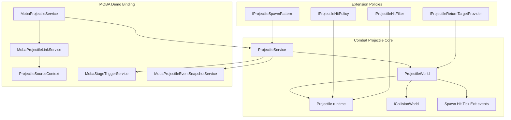
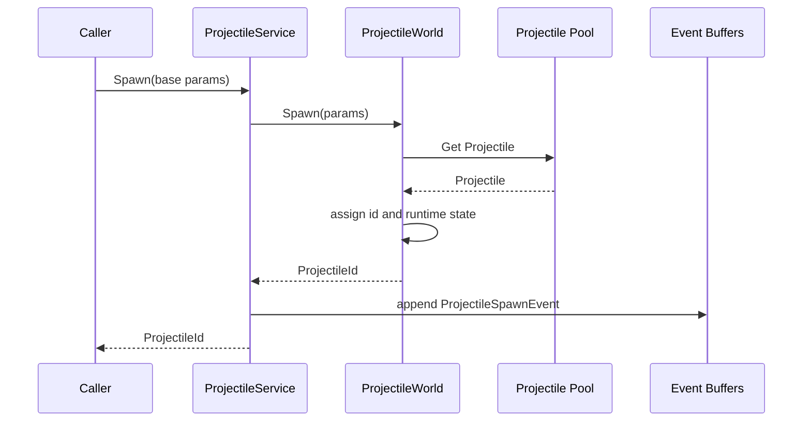
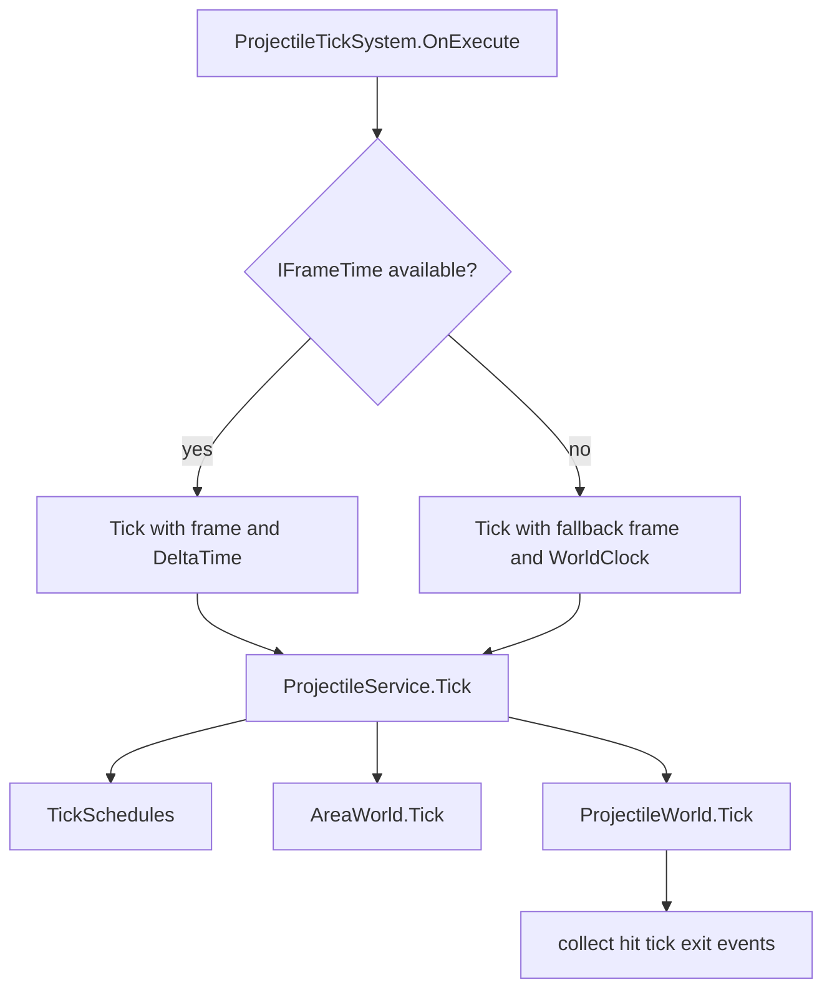
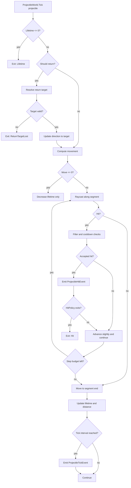
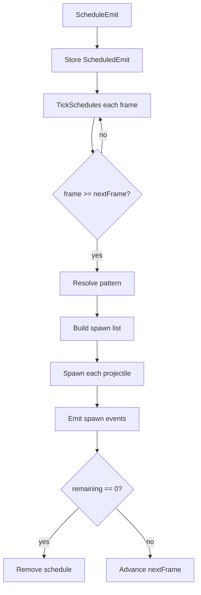
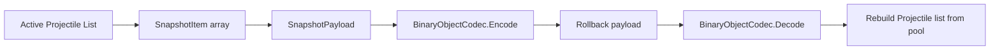
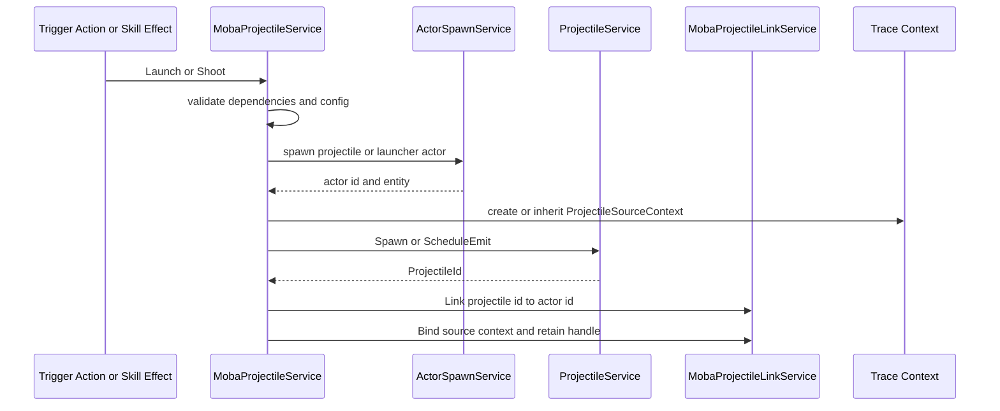
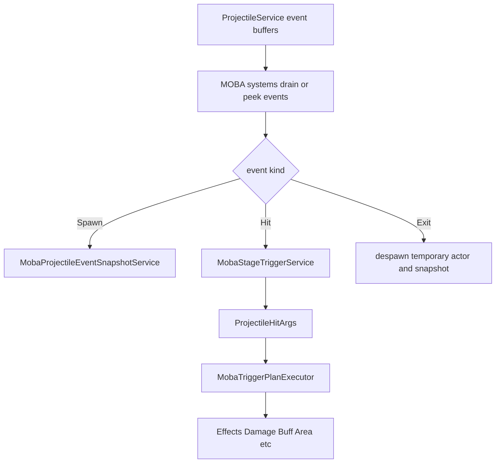

# 8.4 投射物系统

> 本文从源码出发说明 AbilityKit 中投射物能力的真实边界：它不是“发射一个飞行物”这么简单，而是由 [`ProjectileWorld`](../../../Unity/Packages/com.abilitykit.combat.projectile/Runtime/Projectile/Runtime/ProjectileWorld.cs:16) 负责的投射物运行时、[`ProjectileService`](../../../Unity/Packages/com.abilitykit.combat.projectile/Runtime/Projectile/Services/ProjectileService.cs:11) 负责的调度与事件编排、以及 Demo 层的 MOBA 绑定服务共同组成的一套可回滚、可追踪、可扩展的战斗子系统。

---

## 目录

- [8.4 投射物系统](#84-投射物系统)
  - [目录](#目录)
  - [1. 能力定位](#1-能力定位)
  - [2. 源码入口](#2-源码入口)
  - [3. 设计总览](#3-设计总览)
  - [4. 核心数据模型](#4-核心数据模型)
    - [4.1 `ProjectileSpawnParams`](#41-projectilespawnparams)
    - [4.2 `Projectile`](#42-projectile)
  - [5. 生命周期主线](#5-生命周期主线)
    - [5.1 创建与调度](#51-创建与调度)
    - [5.2 每帧推进](#52-每帧推进)
    - [5.3 单个投射物推进](#53-单个投射物推进)
  - [6. 命中、穿透与过滤](#6-命中穿透与过滤)
  - [7. 发射调度与散射模式](#7-发射调度与散射模式)
  - [8. 回滚与快照](#8-回滚与快照)
  - [9. MOBA 示例协作](#9-moba-示例协作)
    - [9.1 发射流程](#91-发射流程)
    - [9.2 事件转译](#92-事件转译)
  - [10. 扩展点与约束](#10-扩展点与约束)
  - [下一步](#下一步)

---

## 1. 能力定位

投射物系统解决的是“战斗中存在一类具有飞行、命中、持续、穿透、回收、结束原因和回滚要求的临时实体”这一问题。

它的职责不是把伤害公式塞进飞行物里，而是提供稳定的投射物执行底座：

- 统一创建、移动、命中、结束、销毁流程。
- 提供碰撞过滤、命中策略、冷却策略、回收策略。
- 提供每帧事件输出，供上层系统转译成表现、触发器或状态同步事件。
- 支持回滚快照，便于确定性模拟和重演。
- 允许 Demo 层在不改底层模块的前提下，挂接角色、来源上下文、技能运行时和触发器协作。

底层核心是 [`ProjectileWorld`](../../../Unity/Packages/com.abilitykit.combat.projectile/Runtime/Projectile/Runtime/ProjectileWorld.cs:16)，面向外部的统一入口是 [`ProjectileService`](../../../Unity/Packages/com.abilitykit.combat.projectile/Runtime/Projectile/Services/ProjectileService.cs:11)。

---

## 2. 源码入口

| 角色 | 类型 | 源码 |
|------|------|------|
| 投射物运行时 | `ProjectileWorld` | [`ProjectileWorld.cs`](../../../Unity/Packages/com.abilitykit.combat.projectile/Runtime/Projectile/Runtime/ProjectileWorld.cs:16) |
| 对外服务 | `ProjectileService` | [`ProjectileService.cs`](../../../Unity/Packages/com.abilitykit.combat.projectile/Runtime/Projectile/Services/ProjectileService.cs:11) |
| 投射物实体 | `Projectile` | [`Projectile.cs`](../../../Unity/Packages/com.abilitykit.combat.projectile/Runtime/Projectile/Runtime/Projectile.cs:6) |
| 生成参数 | `ProjectileSpawnParams` | [`ProjectileSpawnParams.cs`](../../../Unity/Packages/com.abilitykit.combat.projectile/Runtime/Projectile/Runtime/ProjectileSpawnParams.cs:11) |
| 生命周期事件 | `ProjectileSpawnEvent`、`ProjectileHitEvent`、`ProjectileExitEvent`、`ProjectileTickEvent` | [`ProjectileEvents.cs`](../../../Unity/Packages/com.abilitykit.combat.projectile/Runtime/Projectile/Runtime/ProjectileEvents.cs:5) |
| 命中策略 | `IProjectileHitPolicy` | [`IProjectileHitPolicy.cs`](../../../Unity/Packages/com.abilitykit.combat.projectile/Runtime/Projectile/Policies/IProjectileHitPolicy.cs:3) |
| 命中过滤 | `IProjectileHitFilter` | [`IProjectileHitFilter.cs`](../../../Unity/Packages/com.abilitykit.combat.projectile/Runtime/Projectile/Filters/IProjectileHitFilter.cs:5) |
| Tick 入口 | `ProjectileTickSystem` | [`ProjectileTickSystem.cs`](../../../Unity/Packages/com.abilitykit.combat.projectile/Runtime/Projectile/Systems/ProjectileTickSystem.cs:9) |
| MOBA 发射服务 | `MobaProjectileService` | [`MobaProjectileService.cs`](../../../Unity/Packages/com.abilitykit.demo.moba.runtime/Runtime/Application/Services/Projectile/MobaProjectileService.cs:22) |
| MOBA 来源上下文 | `ProjectileSourceContext` | [`ProjectileSourceContext.cs`](../../../Unity/Packages/com.abilitykit.demo.moba.runtime/Runtime/Application/Services/Projectile/ProjectileSourceContext.cs:6) |
| MOBA 链接服务 | `MobaProjectileLinkService` | [`MobaProjectileLinkService.cs`](../../../Unity/Packages/com.abilitykit.demo.moba.runtime/Runtime/Application/Services/Projectile/MobaProjectileLinkService.cs:10) |
| MOBA 事件快照 | `MobaProjectileEventSnapshotService` | [`MobaProjectileEventSnapshotService.cs`](../../../Unity/Packages/com.abilitykit.demo.moba.runtime/Runtime/Application/Services/Projectile/MobaProjectileEventSnapshotService.cs:13) |

---

## 3. 设计总览

投射物能力分成四层：

1. **运行时内核**：[`ProjectileWorld`](../../../Unity/Packages/com.abilitykit.combat.projectile/Runtime/Projectile/Runtime/ProjectileWorld.cs:16) 持有对象池、活动列表和碰撞世界引用，负责推进每个投射物。
2. **服务编排层**：[`ProjectileService`](../../../Unity/Packages/com.abilitykit.combat.projectile/Runtime/Projectile/Services/ProjectileService.cs:11) 负责对外 API、发射调度、事件收集、区域协同和回滚接口。
3. **系统驱动层**：[`ProjectileTickSystem`](../../../Unity/Packages/com.abilitykit.combat.projectile/Runtime/Projectile/Systems/ProjectileTickSystem.cs:9) 将投射物推进挂接到逻辑世界执行序列中。
4. **Demo 绑定层**：MOBA 场景通过 [`MobaProjectileService`](../../../Unity/Packages/com.abilitykit.demo.moba.runtime/Runtime/Application/Services/Projectile/MobaProjectileService.cs:22)、[`MobaProjectileLinkService`](../../../Unity/Packages/com.abilitykit.demo.moba.runtime/Runtime/Application/Services/Projectile/MobaProjectileLinkService.cs:10) 和 [`MobaProjectileEventSnapshotService`](../../../Unity/Packages/com.abilitykit.demo.moba.runtime/Runtime/Application/Services/Projectile/MobaProjectileEventSnapshotService.cs:13) 把投射物纳入技能、表现、溯源与同步体系。

---

## 4. 核心数据模型

### 4.1 `ProjectileSpawnParams`

[`ProjectileSpawnParams`](../../../Unity/Packages/com.abilitykit.combat.projectile/Runtime/Projectile/Runtime/ProjectileSpawnParams.cs:11) 是投射物创建时的完整输入，包含：

| 字段组 | 代表字段 | 说明 |
|--------|----------|------|
| 归属关系 | `OwnerId`、`TemplateId`、`LauncherActorId`、`RootActorId` | 用于区分投射物所有者、配置模板、发射器实体和根角色 |
| 时空状态 | `SpawnFrame`、`Position`、`Direction`、`Speed` | 决定初始帧、初始位置、方向和速度 |
| 回收逻辑 | `ReturnAfterFrames`、`ReturnSpeed`、`ReturnStopDistance` | 支持飞出后回到发射器或来源点 |
| 生命周期 | `LifetimeFrames`、`MaxDistance` | 限制最大存在帧数和最大飞行距离 |
| 碰撞 | `CollisionLayerMask`、`IgnoreCollider` | 限定碰撞层并跳过自身碰撞体 |
| 命中策略 | `HitPolicy`、`HitsRemaining`、`HitPolicyKind`、`HitPolicyParam` | 控制命中后退出或穿透 |
| 周期事件 | `TickIntervalFrames` | 让投射物在飞行中周期性产生 tick 事件 |
| 过滤与冷却 | `HitFilter`、`HitCooldownFrames` | 控制阵营过滤、重复命中冷却等规则 |

源码还提供 [`ProjectileSpawnParams.WithDirection()`](../../../Unity/Packages/com.abilitykit.combat.projectile/Runtime/Projectile/Runtime/ProjectileSpawnParams.cs:96) 与 [`ProjectileSpawnParams.WithSpawnFrame()`](../../../Unity/Packages/com.abilitykit.combat.projectile/Runtime/Projectile/Runtime/ProjectileSpawnParams.cs:123)，用于发射模式构造多个方向或调度帧。

### 4.2 `Projectile`

[`Projectile`](../../../Unity/Packages/com.abilitykit.combat.projectile/Runtime/Projectile/Runtime/Projectile.cs:6) 是内部运行时对象，不对外暴露。它实现对象池接口，保存当前帧需要推进的全部状态：位置、方向、速度、剩余帧、剩余距离、命中次数、命中冷却、回收状态、命中策略等。

这个设计把“配置输入”和“运行时可变状态”分开：外部只提交不可变生成参数，内部再把它转成可 tick 的投射物对象。

---

## 5. 生命周期主线

### 5.1 创建与调度

投射物可以通过两条路径创建：

1. 直接调用 [`ProjectileService.Spawn()`](../../../Unity/Packages/com.abilitykit.combat.projectile/Runtime/Projectile/Services/ProjectileService.cs:56)。
2. 通过 [`ProjectileService.ScheduleEmit()`](../../../Unity/Packages/com.abilitykit.combat.projectile/Runtime/Projectile/Services/ProjectileService.cs:97) 以模式和计划延迟或重复发射。

### 5.2 每帧推进

[`ProjectileTickSystem`](../../../Unity/Packages/com.abilitykit.combat.projectile/Runtime/Projectile/Systems/ProjectileTickSystem.cs:25) 每帧调用 [`ProjectileService.Tick()`](../../../Unity/Packages/com.abilitykit.combat.projectile/Runtime/Projectile/Services/ProjectileService.cs:67)。服务层先推进发射计划和区域，再推进投射物世界。

### 5.3 单个投射物推进

[`ProjectileWorld.Tick()`](../../../Unity/Packages/com.abilitykit.combat.projectile/Runtime/Projectile/Runtime/ProjectileWorld.cs:187) 的核心顺序是：

1. 检查生命周期是否耗尽，耗尽则产生 [`ProjectileExitEvent`](../../../Unity/Packages/com.abilitykit.combat.projectile/Runtime/Projectile/Runtime/ProjectileEvents.cs:82)。
2. 判断是否进入返回状态。
3. 如果返回状态开启，查询 [`IProjectileReturnTargetProvider`](../../../Unity/Packages/com.abilitykit.combat.projectile/Runtime/Projectile/Runtime/ProjectileWorld.cs:11) 获取返回目标。
4. 根据速度和固定帧间隔计算本帧移动距离。
5. 沿移动段做 raycast，跳过 `IgnoreCollider`。
6. 命中时执行过滤、冷却、重复命中保护和命中策略。
7. 产生 [`ProjectileHitEvent`](../../../Unity/Packages/com.abilitykit.combat.projectile/Runtime/Projectile/Runtime/ProjectileEvents.cs:51) 或 [`ProjectileExitEvent`](../../../Unity/Packages/com.abilitykit.combat.projectile/Runtime/Projectile/Runtime/ProjectileEvents.cs:82)。
8. 更新位置、剩余生命周期和剩余距离。
9. 根据 `TickIntervalFrames` 产生 [`ProjectileTickEvent`](../../../Unity/Packages/com.abilitykit.combat.projectile/Runtime/Projectile/Runtime/ProjectileEvents.cs:29)。

---

## 6. 命中、穿透与过滤

命中处理是投射物系统最关键的扩展点。源码中有三层保护：

| 层级 | 源码 | 作用 |
|------|------|------|
| 忽略碰撞体 | [`TryRaycastSkippingIgnored()`](../../../Unity/Packages/com.abilitykit.combat.projectile/Runtime/Projectile/Runtime/ProjectileWorld.cs:424) | 跳过发射者自身或指定碰撞体 |
| 命中过滤 | [`IProjectileHitFilter.ShouldHit()`](../../../Unity/Packages/com.abilitykit.combat.projectile/Runtime/Projectile/Filters/IProjectileHitFilter.cs:5) | 上层决定是否应命中，例如阵营、无敌、不可选中 |
| 命中策略 | [`IProjectileHitPolicy.ShouldExitOnHit()`](../../../Unity/Packages/com.abilitykit.combat.projectile/Runtime/Projectile/Policies/IProjectileHitPolicy.cs:3) | 决定命中后是否销毁，例如立即退出或穿透若干次 |

[`ProjectileHitPolicyKind`](../../../Unity/Packages/com.abilitykit.combat.projectile/Runtime/Projectile/Runtime/ProjectileSpawnParams.cs:5) 当前提供 `ExitOnHit` 与 `Pierce` 两种内置策略。`Pierce` 通过 `HitsRemaining` 递减来支持多目标命中。

源码还做了两个确定性保护：

- 单帧内最多处理 8 次命中，避免无限循环。
- 同一帧内记录已命中的碰撞体，避免同一投射物在一次 raycast 分段中重复触发同一目标。

---

## 7. 发射调度与散射模式

[`ProjectileService`](../../../Unity/Packages/com.abilitykit.combat.projectile/Runtime/Projectile/Services/ProjectileService.cs:11) 不只支持单发创建，还支持 schedule：

发射模式由 [`IProjectileSpawnPattern`](../../../Unity/Packages/com.abilitykit.combat.projectile/Runtime/Projectile/Patterns/IProjectileSpawnPattern.cs:5) 构建多个 [`ProjectileSpawnParams`](../../../Unity/Packages/com.abilitykit.combat.projectile/Runtime/Projectile/Runtime/ProjectileSpawnParams.cs:11)。内置模式包括单发、连发、扇形、散射等。MOBA 层还通过 [`MobaModifierProjectileSpawnPatternProvider`](../../../Unity/Packages/com.abilitykit.demo.moba.runtime/Runtime/Application/Services/Projectile/Launch/MobaModifierProjectileSpawnPatternProvider.cs:5) 在发射时读取技能参数修饰器，动态改变每次发射数量和扇形角度。

---

## 8. 回滚与快照

[`ProjectileWorld.ExportRollback()`](../../../Unity/Packages/com.abilitykit.combat.projectile/Runtime/Projectile/Runtime/ProjectileWorld.cs:77) 和 [`ProjectileWorld.ImportRollback()`](../../../Unity/Packages/com.abilitykit.combat.projectile/Runtime/Projectile/Runtime/ProjectileWorld.cs:118) 将运行时投射物转成二进制快照。快照内容包括：

- 投射物 id 与 `_nextId`
- 所属角色、模板、发射器、根角色
- 位置、方向、速度
- 剩余生命周期、剩余距离
- 命中策略和剩余命中次数
- 周期 tick 状态
- 返回状态和返回参数

需要注意：底层快照保存的是底层运行状态；Demo 层额外的演员链接、来源上下文、技能 retain handle 等，需要由 Demo 侧服务自行维护或在生命周期中重新绑定。

---

## 9. MOBA 示例协作

MOBA 示例没有直接把“技能命中”和“投射物命中”写死在核心投射物模块里，而是做了一层业务绑定。

### 9.1 发射流程

[`MobaProjectileService`](../../../Unity/Packages/com.abilitykit.demo.moba.runtime/Runtime/Application/Services/Projectile/MobaProjectileService.cs:22) 在发射时会：

1. 校验投射物服务、角色注册表、实体管理器、Actor 生成服务等依赖。
2. 创建投射物 Actor 或发射器 Actor。
3. 将配置转换为 [`ProjectileSpawnParams`](../../../Unity/Packages/com.abilitykit.combat.projectile/Runtime/Projectile/Runtime/ProjectileSpawnParams.cs:11)。
4. 选择发射模式并提交给 [`ProjectileService`](../../../Unity/Packages/com.abilitykit.combat.projectile/Runtime/Projectile/Services/ProjectileService.cs:11)。
5. 通过 [`MobaProjectileLinkService`](../../../Unity/Packages/com.abilitykit.demo.moba.runtime/Runtime/Application/Services/Projectile/MobaProjectileLinkService.cs:10) 绑定 `ProjectileId` 与 ActorId。
6. 绑定 [`ProjectileSourceContext`](../../../Unity/Packages/com.abilitykit.demo.moba.runtime/Runtime/Application/Services/Projectile/ProjectileSourceContext.cs:6)，保留来源、根上下文和技能运行时引用。

### 9.2 事件转译

底层产生的投射物事件会被 MOBA 层消费：

- [`ProjectileSpawnEvent`](../../../Unity/Packages/com.abilitykit.combat.projectile/Runtime/Projectile/Runtime/ProjectileEvents.cs:5)：用于表现和网络事件。
- [`ProjectileHitEvent`](../../../Unity/Packages/com.abilitykit.combat.projectile/Runtime/Projectile/Runtime/ProjectileEvents.cs:51)：转换为 `ProjectileHitArgs`，再进入 Triggering/Effect 执行链。
- [`ProjectileExitEvent`](../../../Unity/Packages/com.abilitykit.combat.projectile/Runtime/Projectile/Runtime/ProjectileEvents.cs:82)：驱动临时 Actor 清理、表现退出和快照输出。

[`MobaProjectileEventSnapshotService`](../../../Unity/Packages/com.abilitykit.demo.moba.runtime/Runtime/Application/Services/Projectile/MobaProjectileEventSnapshotService.cs:13) 会把底层 spawn/hit/exit 事件转换成 MOBA 协议快照，让客户端表现层以事件方式还原投射物生命周期。

---

## 10. 扩展点与约束

| 扩展点 | 用法 | 约束 |
|--------|------|------|
| `IProjectileSpawnPattern` | 自定义单次发射产生几个投射物、方向如何分布 | 需要保持确定性，避免依赖非确定随机 |
| `IProjectileSpawnPatternProvider` | 每次调度时动态生成 pattern | 可读取修饰器，但要保证同一帧输入一致 |
| `IProjectileHitFilter` | 阵营过滤、友军过滤、不可命中过滤 | 不应直接造成副作用，只返回是否命中 |
| `IProjectileHitPolicy` | 命中即消失、穿透、多段命中 | 通过 `hitsRemaining` 保持状态可序列化 |
| `IProjectileReturnTargetProvider` | 回旋镖、返回发射器、返回角色 | 返回目标丢失时会触发 `ReturnTargetLost` 退出 |
| 事件 drain/peek | 表现层、触发器、快照系统消费事件 | drain 会清空缓冲，需要明确消费顺序 |
| Rollback import/export | 帧同步、预测、回滚 | 业务层附加绑定不由底层自动恢复 |

投射物系统的核心约束是：底层只关心“运动 + 碰撞 + 生命周期事件”，业务层效果必须通过事件转译进入 Triggering、Damage、Buff 或表现系统。这样可以避免底层模块反向依赖 MOBA 规则，也让同一投射物内核可用于不同玩法。

---

## 下一步

- [属性系统](05-AttributeSystem.md) - Attributes 与 Modifiers
- [伤害计算](06-DamageCalculation.md) - 伤害公式

---

*文档版本：v2.0 | 最后更新：2026-06-23*
