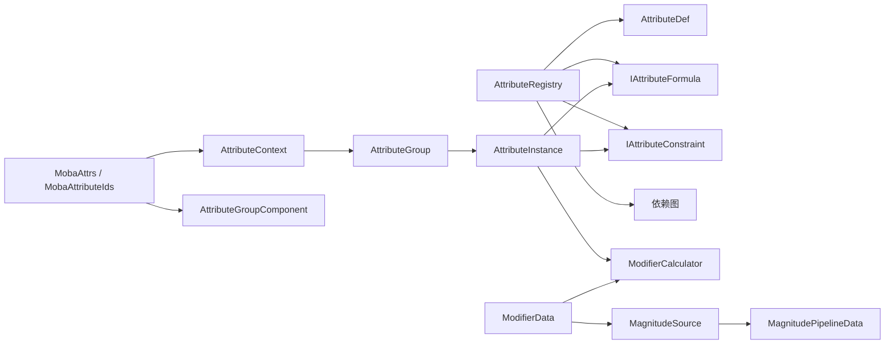
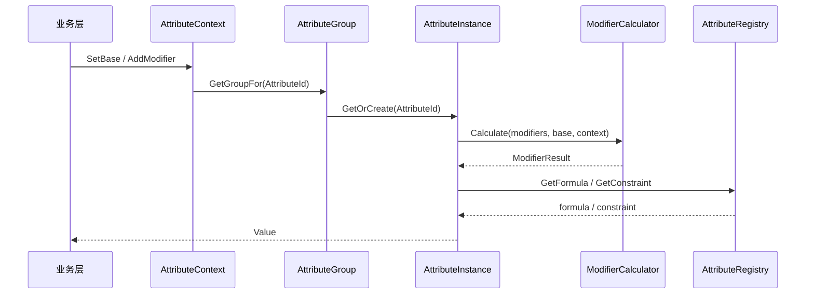

# 8.5 属性系统

> 基于 `AbilityKit.Attributes` + `AbilityKit.Modifiers` 的真实实现，说明属性、修改器、公式、约束与 MOBA 集成方式。

---

## 目录

- [8.5 属性系统](#85-属性系统)
  - [目录](#目录)
  - [1. 系统定位](#1-系统定位)
  - [2. 源码模型总览](#2-源码模型总览)
  - [3. 属性注册与定义](#3-属性注册与定义)
    - [3.1 `AttributeRegistry`：名称、定义、依赖图](#31-attributeregistry名称定义依赖图)
    - [3.2 `AttributeDef`：属性元信息](#32-attributedef属性元信息)
    - [3.3 冻结与循环依赖检测](#33-冻结与循环依赖检测)
  - [4. 属性运行时容器](#4-属性运行时容器)
    - [4.1 `AttributeContext`：世界级运行上下文](#41-attributecontext世界级运行上下文)
    - [4.2 `AttributeGroup`：按组组织属性实例](#42-attributegroup按组组织属性实例)
    - [4.3 `AttributeInstance`：单属性的最终计算单元](#43-attributeinstance单属性的最终计算单元)
  - [5. 修改器引擎](#5-修改器引擎)
    - [5.1 `ModifierData`：一个可生效的修改器实例](#51-modifierdata一个可生效的修改器实例)
    - [5.2 `MagnitudeSource`：统一数值来源](#52-magnitudesource统一数值来源)
    - [5.3 `ModifierCalculator`：缓存 + 计算核心](#53-modifiercalculator缓存--计算核心)
    - [5.4 计算核心与操作组合](#54-计算核心与操作组合)
  - [6. 公式与约束](#6-公式与约束)
    - [6.1 默认公式](#61-默认公式)
    - [6.2 表达式公式](#62-表达式公式)
    - [6.3 约束](#63-约束)
  - [7. MOBA 集成方式](#7-moba-集成方式)
    - [7.1 `AttributeGroupComponent`](#71-attributegroupcomponent)
    - [7.2 `MobaAttributeIds`](#72-mobaattributeids)
    - [7.3 `MobaAttrs`](#73-mobaattrs)
    - [7.4 配置与校验](#74-配置与校验)
  - [8. 典型运行流程](#8-典型运行流程)
    - [8.1 修改基础值](#81-修改基础值)
    - [8.2 添加修改器](#82-添加修改器)
    - [8.3 依赖属性传播](#83-依赖属性传播)
    - [8.4 时间衰减修改器](#84-时间衰减修改器)
  - [9. 扩展边界](#9-扩展边界)
    - [9.1 适合扩展的点](#91-适合扩展的点)
    - [9.2 需要谨慎的点](#92-需要谨慎的点)
  - [10. 关联文档](#10-关联文档)

---

## 1. 系统定位

属性系统不是“某个角色身上的几个数值字段”，而是一套可组合的数值计算框架：

- `Attributes` 负责属性定义、分组、实例化、依赖传播和最终值缓存。
- `Modifiers` 负责通用修改器建模、数值来源、组合计算、缓存和来源追踪。
- MOBA 业务层在此之上再包一层 `MobaAttrs`、`MobaAttributeIds`、`AttributeGroupComponent`，把战斗配置、组件数据与属性引擎连接起来。

系统的核心目标是：

1. 让属性定义可配置、可扩展。
2. 让修改器支持来源、优先级、时间衰减、属性引用和管道组合。
3. 让属性依赖关系在运行时自动失效和重算。
4. 让战斗层只处理业务语义，不直接操作底层计算细节。

---

## 2. 源码模型总览

从源码看，属性系统主要由以下文件组成：

| 角色 | 类型 | 源码 |
| --- | --- | --- |
| 注册表 | `AttributeRegistry` | [`AttributeRegistry.cs`](../../../Unity/Packages/com.abilitykit.attributes/Runtime/Attributes/Core/AttributeRegistry.cs:17) |
| 定义 | `AttributeDef` | [`AttributeDef.cs`](../../../Unity/Packages/com.abilitykit.attributes/Runtime/Attributes/Core/AttributeDef.cs:16) |
| 上下文 | `AttributeContext` | [`AttributeContext.cs`](../../../Unity/Packages/com.abilitykit.attributes/Runtime/Attributes/Core/AttributeContext.cs:16) |
| 分组 | `AttributeGroup` | [`AttributeGroup.cs`](../../../Unity/Packages/com.abilitykit.attributes/Runtime/Attributes/Core/AttributeGroup.cs:15) |
| 单属性实例 | `AttributeInstance` | [`AttributeInstance.cs`](../../../Unity/Packages/com.abilitykit.attributes/Runtime/Attributes/Core/AttributeInstance.cs:16) |
| 默认公式 | `DefaultAttributeFormula` | [`DefaultAttributeFormula.cs`](../../../Unity/Packages/com.abilitykit.attributes/Runtime/Attributes/Formula/DefaultAttributeFormula.cs:14) |
| 表达式公式 | `AttributeExpressionFormula` | [`AttributeExpressionFormula.cs`](../../../Unity/Packages/com.abilitykit.attributes/Runtime/Attributes/Formula/AttributeExpressionFormula.cs:30) |
| 区间约束 | `RangeAttributeConstraint` | [`RangeAttributeConstraint.cs`](../../../Unity/Packages/com.abilitykit.attributes/Runtime/Attributes/Constraint/RangeAttributeConstraint.cs:7) |
| 修改器数据 | `ModifierData` | [`ModifierData.cs`](../../../Unity/Packages/com.abilitykit.modifiers/Runtime/Core/Data/ModifierData.cs:32) |
| 修改器计算器 | `ModifierCalculator` | [`ModifierCalculator.cs`](../../../Unity/Packages/com.abilitykit.modifiers/Runtime/Core/Engine/ModifierCalculator.cs:25) |
| 数值来源 | `MagnitudeSource` | [`MagnitudeSource.cs`](../../../Unity/Packages/com.abilitykit.modifiers/Runtime/Core/Source/MagnitudeSource.cs:486) |
| MOBA 属性映射 | `MobaAttributeIds` | `Unity/Packages/com.abilitykit.demo.moba.runtime/Runtime/Domain/Attributes/MobaAttributeIds.cs` |
| MOBA 属性便捷访问 | `MobaAttrs` | `Unity/Packages/com.abilitykit.demo.moba.runtime/Runtime/Domain/Attributes/MobaAttrs.cs` |
| 运行时组件 | `AttributeGroupComponent` | `Unity/Packages/com.abilitykit.demo.moba.runtime/Runtime/Domain/Components/AttributeSystemComponents.cs` |

---

## 3. 属性注册与定义

### 3.1 `AttributeRegistry`：名称、定义、依赖图

`AttributeRegistry` 是属性系统的入口注册表，核心职责有三个：

1. 根据名称分配稳定的 `AttributeId`。
2. 保存 `AttributeDef`，提供公式、约束、默认值、分组信息。
3. 构建依赖图，在依赖属性变化时标记下游属性失效。

关键行为见 [`AttributeRegistry.cs`](../../../Unity/Packages/com.abilitykit.attributes/Runtime/Attributes/Core/AttributeRegistry.cs:17)：

- `Register(AttributeDef def)`：注册定义。
- `Request(string name)`：按名称获取或创建属性。
- `Freeze()`：冻结注册表并构建依赖图。
- `GetDependents(AttributeId id)`：查询哪些属性依赖当前属性。
- `GetFormula(AttributeId id)`：获取属性公式，默认回退到 [`DefaultAttributeFormula`](../../../Unity/Packages/com.abilitykit.attributes/Runtime/Attributes/Formula/DefaultAttributeFormula.cs:14)。
- `GetConstraint(AttributeId id)`：获取约束。
- `GetDefaultBaseValue(AttributeId id)`：获取默认基础值。
- `GetGroup(AttributeId id)`：获取属性组。

### 3.2 `AttributeDef`：属性元信息

`AttributeDef` 负责描述单个属性的元数据，见 [`AttributeDef.cs`](../../../Unity/Packages/com.abilitykit.attributes/Runtime/Attributes/Core/AttributeDef.cs:16)：

- `Name`：属性名称。
- `Group`：所属组。
- `DefaultBaseValue`：默认基础值。
- `Formula`：最终值公式。
- `Constraint`：约束。
- `DependsOn`：显式依赖。

`GetDependencies()` 会同时合并：

- `DependsOn` 数组中的直接依赖。
- 如果 `Formula` 实现了 `IAttributeDependencyProvider`，则将公式依赖也纳入依赖图。

这意味着依赖不是只靠配置表显式填写，也可以由表达式公式推导出来。

### 3.3 冻结与循环依赖检测

`Freeze()` 会调用 [`AttributeRegistry.cs`](../../../Unity/Packages/com.abilitykit.attributes/Runtime/Attributes/Core/AttributeRegistry.cs:77) 中的依赖图构建逻辑：

- 清空旧的 dependents 表。
- 收集每个属性的依赖。
- 检测自引用。
- 使用 DFS 检测循环依赖。
- 反向生成 dependents 表。

这一步把“属性间引用”从运行时猜测变成了显式的图结构。

---

## 4. 属性运行时容器

### 4.1 `AttributeContext`：世界级运行上下文

`AttributeContext` 是把属性、时间、外部数据和修改器上下文统一起来的运行时对象，见 [`AttributeContext.cs`](../../../Unity/Packages/com.abilitykit.attributes/Runtime/Attributes/Core/AttributeContext.cs:16)：

- 实现了 `IModifierContext`，可直接喂给 `Modifiers` 引擎。
- 内部维护多个 `AttributeGroup`。
- 保存 `Level`、`CurrentTime`、`DeltaTime`、`ElapsedTime`。
- 允许通过字符串数据槽塞入业务数据。

最重要的是：`AttributeContext` 不是单纯的值容器，而是依赖传播枢纽。

当某个属性值变化时：

1. 对应 `AttributeGroup` 触发 `AttributeChanged`。
2. `AttributeContext` 捕获这个变化。
3. 调用 `Registry.GetDependents(id)`。
4. 把所有下游属性 `MarkDirty()`。

这意味着依赖属性会在下一次读取时自动重算。

### 4.2 `AttributeGroup`：按组组织属性实例

`AttributeGroup` 是属性实例的分组容器，见 [`AttributeGroup.cs`](../../../Unity/Packages/com.abilitykit.attributes/Runtime/Attributes/Core/AttributeGroup.cs:15)：

- `_attrs`：按 `AttributeId` 索引的字典。
- `_byId`：数组缓存，加速按整数 ID 访问。
- `_slots`：存储基础值、缓存值、脏标记。

关键方法：

- `GetOrCreate(AttributeId id)`：按需创建实例。
- `GetValue(AttributeId id)`：读取最终值。
- `SetBase(AttributeId id, float baseValue)`：设置基础值。
- `AddModifier(...)` / `RemoveModifier(...)` / `ClearModifiers(...)`：管理修改器。
- `MarkDirty(AttributeId id)`：标记依赖脏。

### 4.3 `AttributeInstance`：单属性的最终计算单元

`AttributeInstance` 负责一个属性的完整生命周期，见 [`AttributeInstance.cs`](../../../Unity/Packages/com.abilitykit.attributes/Runtime/Attributes/Core/AttributeInstance.cs:16)：

- 保存基础值和缓存值的槽位引用。
- 保存修改器槽位。
- 持有一个 `ModifierCalculator`。
- 持有一个映射到修改器目标的 `ModifierKey`。

读取 `Value` 时，如果槽位脏，就会触发 `Recompute()`：

1. 收集活跃修改器。
2. 调用 `ModifierCalculator.Calculate(...)`。
3. 从 `AttributeRegistry` 取公式。
4. 执行公式求值。
5. 应用约束。
6. 写回缓存并触发 `Changed`。

---

## 5. 修改器引擎

### 5.1 `ModifierData`：一个可生效的修改器实例

`ModifierData` 是修改器系统的核心数据结构，见 [`ModifierData.cs`](../../../Unity/Packages/com.abilitykit.modifiers/Runtime/Core/Data/ModifierData.cs:32)：

- `Key`：目标键。
- `Op`：操作类型。
- `Priority`：优先级。
- `SourceId`：来源 ID。
- `SourceNameIndex`：来源名称索引。
- `Magnitude`：数值来源。
- `Metadata`：调试元数据。
- `CustomData`：自定义数据槽。

工厂方法覆盖了常见场景：

- `Add(...)`
- `Mul(...)`
- `Override(...)`
- `PercentAdd(...)`
- `AddWithTimeDecay(...)`
- `PercentAddWithTimeDecay(...)`
- `CreateWithPipeline(...)`

这说明修改器不是简单的“加减数值”，而是支持复杂来源组合的统一模型。

### 5.2 `MagnitudeSource`：统一数值来源

`MagnitudeSource` 定义了修改器数值如何被计算，见 [`MagnitudeSource.cs`](../../../Unity/Packages/com.abilitykit.modifiers/Runtime/Core/Source/MagnitudeSource.cs:486)：

支持类型：

- `Fixed`
- `Scalable`
- `Attribute`
- `TimeDecay`
- `Pipeline`

对应能力包括：

- 固定值。
- 等级曲线。
- 属性引用。
- 时间衰减。
- 修饰器管道。

因此一个修改器的“数值”本身也可以继续计算。

### 5.3 `ModifierCalculator`：缓存 + 计算核心

`ModifierCalculator` 是高层入口，见 [`ModifierCalculator.cs`](../../../Unity/Packages/com.abilitykit.modifiers/Runtime/Core/Engine/ModifierCalculator.cs:25)：

- 提供多种 `Calculate(...)` 重载。
- 支持可选缓存。
- 支持来源追踪。
- 支持完整上下文 `IModifierContext`。

内部流程是：

1. 先尝试缓存命中。
2. 命中则直接返回 `ModifierResult`。
3. 否则调用 `ModifierComputeCore.Compute(...)`。
4. 计算完成后回写缓存。

### 5.4 计算核心与操作组合

`ModifierCacheAndCore.cs` 中把缓存和计算核心拆开：

- `ModifierCache` 负责判断是否可复用结果。
- `ModifierComputeCore` 负责纯计算。

`ModifierComputeCore` 通过 `OperatorComposer.Compose(...)` 完成操作组合，并在需要时记录每个修改器的贡献。

从设计上看，这个层次是“属性系统复用修改器引擎”的关键原因：属性本身不需要知道怎么组合加法、乘法、覆盖、百分比和时变来源。

---

## 6. 公式与约束

### 6.1 默认公式

`DefaultAttributeFormula` 见 [`DefaultAttributeFormula.cs`](../../../Unity/Packages/com.abilitykit.attributes/Runtime/Attributes/Formula/DefaultAttributeFormula.cs:14)：

- 直接返回 `modifierResult.FinalValue`。
- 如果结果为 `NaN` 或 `Infinity`，回退到 `0`。

这是最轻量的属性模式，适合大多数战斗基础属性。

### 6.2 表达式公式

`AttributeExpressionFormula` 见 [`AttributeExpressionFormula.cs`](../../../Unity/Packages/com.abilitykit.attributes/Runtime/Attributes/Formula/AttributeExpressionFormula.cs:30)：

支持：

- 内置变量：`base`、`add`、`mul`、`override`、`hasOverride`
- 属性引用变量
- 基本运算：`+ - * /`
- 函数：`abs`、`min`、`max`、`clamp`

它会：

1. 解析表达式为逆波兰式指令序列。
2. 记录依赖属性。
3. 在求值时直接从 `AttributeContext` 读取依赖值。

这让公式层可以表达派生属性，例如：

- 攻击力基于力量和等级。
- 暴击伤害受多个属性共同影响。
- 速度、冷却、范围等参数可以形成公式链。

### 6.3 约束

`RangeAttributeConstraint` 见 [`RangeAttributeConstraint.cs`](../../../Unity/Packages/com.abilitykit.attributes/Runtime/Attributes/Constraint/RangeAttributeConstraint.cs:7)：

- 非法值直接回退为 `0`。
- 否则按 `[min, max]` 裁剪。

约束发生在公式之后，属于最后一道防线，适合：

- 血量下限。
- 移速上限。
- 比例型属性限幅。

---

## 7. MOBA 集成方式

MOBA 层不是重新实现属性系统，而是提供映射和便捷访问。

### 7.1 `AttributeGroupComponent`

`AttributeGroupComponent` 是实体上的属性挂载点，见 `Unity/Packages/com.abilitykit.demo.moba.runtime/Runtime/Domain/Components/AttributeSystemComponents.cs`：

- `Group`：具体 `AttributeGroup`。
- `Ctx`：对应 `AttributeContext`。

也就是说，MOBA 实体直接持有一套属性上下文，而不是只存几个裸字段。

### 7.2 `MobaAttributeIds`

`MobaAttributeIds` 把战斗枚举映射到 `AttributeId`，从而把业务语义与底层注册表解耦。

### 7.3 `MobaAttrs`

`MobaAttrs` 提供属性访问封装，例如：

- `MaxHp`
- `Attack`
- `MoveSpeed`
- `Get(...)`
- `SetBase(...)`
- `AddModifier(...)`
- `RemoveModifier(...)`

这层的意义是：战斗逻辑不直接碰注册表和修改器细节，而只操作语义化入口。

### 7.4 配置与校验

属性模板和相关配置由 MOBA 配置层驱动，例如：

- `BattleAttributeTemplateMO`
- `AttributeTemplateLubanMO`
- `MobaConfigDatabase`
- `MobaConfigPaths`
- `MobaBattleConfigReferenceValidator`

这说明属性系统既支持运行时修改，也支持从配置文件生成和校验。

---

## 8. 典型运行流程

### 8.1 修改基础值

当调用 `SetBase(...)` 时：

- `AttributeGroup` 更新槽位基础值。
- 槽位被标记为 dirty。
- 下次访问最终值时才真正重算。

### 8.2 添加修改器

当调用 `AddModifier(...)` 时：

- 修改器进入 `AttributeInstance` 的槽位池。
- 修改器句柄返回给调用方。
- 对应属性标记 dirty。

### 8.3 依赖属性传播

当某个属性最终值变化时：

- `AttributeContext` 收到变更事件。
- 读取依赖图。
- 对所有依赖属性执行 `MarkDirty()`。
- 下一次访问时这些属性重新计算。

这个模式避免了每次改动都全量重算。

### 8.4 时间衰减修改器

如果 `ModifierData.Magnitude` 是 `TimeDecay`：

- `ModifierCalculator` 会基于 `IModifierContext.CurrentTime` / `ElapsedTime` 计算当前值。
- 结果会参与属性最终值。
- 缓存逻辑会检测 `IsTimeVarying`，必要时失效。

---

## 9. 扩展边界

### 9.1 适合扩展的点

- 新属性：通过 `AttributeDef` 注册。
- 新公式：实现 `IAttributeFormula`。
- 新约束：实现 `IAttributeConstraint`。
- 新修改器操作：实现 `IModifierOperator` 并注册到 `ModifierOperatorRegistry`。
- 新数值来源：扩展 `MagnitudeSourceType` 与相关计算逻辑。
- 新业务封装：在 MOBA 层增加语义化门面，而不是绕开底层引擎。

### 9.2 需要谨慎的点

- 不要让属性层直接依赖具体战斗业务。
- 不要在公式里引入不可控循环依赖。
- 不要绕过 `AttributeRegistry` 直接伪造 `AttributeId`。
- 不要在高频路径里频繁创建临时对象。

---

## 10. 关联文档

- [伤害计算](06-DamageCalculation.md) - 基于属性结果的伤害公式与减伤链路
- [技能系统架构](01-SkillSystemArchitecture.md) - 技能如何读取属性并驱动战斗流程

---

*文档版本：v2.0 | 最后更新：2026-06-23*
