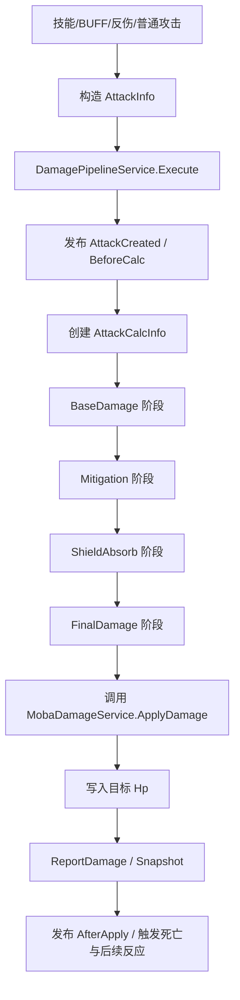
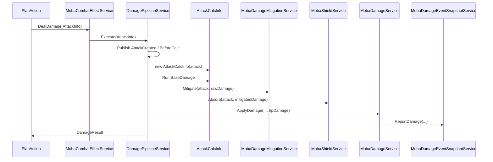
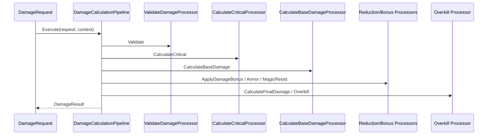

# 8.6 伤害计算

> 基于真实源码说明 AbilityKit 的伤害计算模型：既包括通用 `AbilityKit.Combat` 伤害数据流管线，也包括 `com.abilitykit.demo.moba.runtime` 中的 MOBA 伤害服务、减伤、护盾、触发事件与快照输出。

---

## 目录

- [8.6 伤害计算](#86-伤害计算)
  - [目录](#目录)
  - [1. 系统定位](#1-系统定位)
  - [2. 源码入口](#2-源码入口)
    - [2.1 通用伤害包](#21-通用伤害包)
    - [2.2 MOBA 示例实现](#22-moba-示例实现)
  - [3. 领域模型](#3-领域模型)
    - [3.1 通用伤害模型](#31-通用伤害模型)
    - [3.2 MOBA 伤害模型](#32-moba-伤害模型)
  - [4. 通用伤害管线 AbilityKit.Combat](#4-通用伤害管线-abilitykitcombat)
    - [4.1 默认管线顺序](#41-默认管线顺序)
    - [4.2 上下文数据槽](#42-上下文数据槽)
    - [4.3 处理器职责](#43-处理器职责)
      - [验证阶段](#验证阶段)
      - [暴击阶段](#暴击阶段)
      - [基础伤害阶段](#基础伤害阶段)
      - [加成阶段](#加成阶段)
      - [减伤阶段](#减伤阶段)
      - [最终阶段](#最终阶段)
      - [溢出阶段](#溢出阶段)
  - [5. MOBA 伤害管线 AbilityKit.Demo.Moba](#5-moba-伤害管线-abilitykitdemomoba)
    - [5.1 战斗入口](#51-战斗入口)
    - [5.2 伤害构造](#52-伤害构造)
    - [5.3 计算阶段服务](#53-计算阶段服务)
    - [5.4 标准公式阶段](#54-标准公式阶段)
      - [Base 阶段](#base-阶段)
      - [Mitigation 阶段](#mitigation-阶段)
      - [Shield 阶段](#shield-阶段)
      - [Final 阶段](#final-阶段)
    - [5.5 实际扣血与回血](#55-实际扣血与回血)
  - [6. 触发、快照与表现联动](#6-触发快照与表现联动)
    - [6.1 伤害事件总线](#61-伤害事件总线)
    - [6.2 负载访问](#62-负载访问)
    - [6.3 快照输出](#63-快照输出)
    - [6.4 死亡判定](#64-死亡判定)
  - [7. 典型执行流程](#7-典型执行流程)
    - [7.1 给伤害的时序](#71-给伤害的时序)
    - [7.2 通用管线时序](#72-通用管线时序)
  - [8. 扩展边界](#8-扩展边界)
    - [8.1 适合扩展的点](#81-适合扩展的点)
    - [8.2 不建议耦合的点](#82-不建议耦合的点)
    - [8.3 当前实现的约束](#83-当前实现的约束)

---

## 1. 系统定位

AbilityKit 里的“伤害计算”不是单一公式，而是分层职责：

1. **通用伤害计算层**：`AbilityKit.Combat` 提供一个可插拔的 `DataflowPipeline`，用于验证输入、计算暴击、攻击力加成、伤害加成、护甲/魔抗减免、最终值和溢出值。
2. **游戏业务编排层**：MOBA 示例在 `AbilityKit.Demo.Moba` 中把伤害拆成“构造攻击信息 → 运行计算阶段 → 应用到目标血量 → 产出快照与触发事件”。
3. **表现与回放层**：同一笔伤害会同步进入触发事件总线、快照 emitter、日志和死亡判定订阅者。

这意味着该模块的重点不是“某个固定公式”，而是：

- 统一伤害输入和结果结构；
- 把减伤、护盾、暴击、穿透等能力拆成独立阶段；
- 允许不同业务层只复用其中一部分；
- 支持触发器、快照、诊断和回放接入。

---

## 2. 源码入口

### 2.1 通用伤害包

- [`DamageData.cs`](../../../Unity/Packages/com.abilitykit.combat.damage/Runtime/Damage/Data/DamageData.cs)
- [`DamageCalculationContext.cs`](../../../Unity/Packages/com.abilitykit.combat.damage/Runtime/Damage/Data/DamageCalculationContext.cs)
- [`DamageProcessors.cs`](../../../Unity/Packages/com.abilitykit.combat.damage/Runtime/Damage/Processor/DamageProcessors.cs)

### 2.2 MOBA 示例实现

- [`DamageEnums.cs`](../../../Unity/Packages/com.abilitykit.demo.moba.runtime/Runtime/Common/Shared/Enum/DamageEnums.cs)
- [`DamagePipelineModels.cs`](../../../Unity/Packages/com.abilitykit.demo.moba.runtime/Runtime/Application/Services/Combat/Damage/DamagePipelineModels.cs)
- [`DamagePipelineStages.cs`](../../../Unity/Packages/com.abilitykit.demo.moba.runtime/Runtime/Application/Services/Combat/Damage/DamagePipelineStages.cs)
- [`DamagePipelineService.cs`](../../../Unity/Packages/com.abilitykit.demo.moba.runtime/Runtime/Application/Services/Combat/Damage/DamagePipelineService.cs)
- [`MobaDamageMitigationService.cs`](../../../Unity/Packages/com.abilitykit.demo.moba.runtime/Runtime/Application/Services/Combat/Damage/MobaDamageMitigationService.cs)
- [`MobaShieldService.cs`](../../../Unity/Packages/com.abilitykit.demo.moba.runtime/Runtime/Application/Services/Combat/Damage/MobaShieldService.cs)
- [`MobaDamageService.cs`](../../../Unity/Packages/com.abilitykit.demo.moba.runtime/Runtime/Application/Services/Combat/MobaDamageService.cs)
- [`MobaCombatEffectService.cs`](../../../Unity/Packages/com.abilitykit.demo.moba.runtime/Runtime/Application/Services/Combat/MobaCombatEffectService.cs)
- [`DamagePipelineEvents.cs`](../../../Unity/Packages/com.abilitykit.demo.moba.runtime/Runtime/Application/Services/Combat/Damage/DamagePipelineEvents.cs)
- [`GiveDamagePlanActionModule.cs`](../../../Unity/Packages/com.abilitykit.demo.moba.runtime/Runtime/Application/Services/Triggering/PlanActions/Skill/GiveDamagePlanActionModule.cs)
- [`TakeDamagePlanActionModule.cs`](../../../Unity/Packages/com.abilitykit.demo.moba.runtime/Runtime/Application/Services/Triggering/PlanActions/Skill/TakeDamagePlanActionModule.cs)
- [`GiveDamageArgs.cs`](../../../Unity/Packages/com.abilitykit.demo.moba.runtime/Runtime/Application/Services/Triggering/PlanActions/Skill/GiveDamageArgs.cs)
- [`MobaDamageEventSnapshotService.cs`](../../../Unity/Packages/com.abilitykit.demo.moba.runtime/Runtime/Application/Services/Snapshot/MobaDamageEventSnapshotService.cs)
- [`MobaBattlePayloadAccessor.cs`](../../../Unity/Packages/com.abilitykit.demo.moba.runtime/Runtime/Application/Gameplay/Triggering/MobaBattlePayloadAccessor.cs)

---

## 3. 领域模型

### 3.1 通用伤害模型

通用包里的核心对象是：

- `DamageRequest`：伤害输入。
- `DamageResult`：伤害计算输出。
- `DamageCalculationContext`：Dataflow 上下文，承载目标护甲、魔抗、生命值与攻击者攻击力等计算数据。
- `DamageCalculationPipeline`：默认管线。
- `IDamageProcessor` / `DamageProcessor`：伤害处理器抽象。

`DamageRequest` 的字段很少，但足够表达一次伤害请求：

- `Source`：来源对象，可能是技能、Buff、物件或任意业务对象；
- `Attacker`：攻击者；
- `Target`：目标；
- `BaseValue`：基础伤害；
- `DamageType`：物理 / 魔法 / 真实；
- `Flags`：是否暴击、持续伤害等；
- `SourceType`：来源类别。

`DamageResult` 则把一次计算拆成多个可观测阶段：

- `RawDamage`
- `PreArmorDamage`
- `ArmorReduction`
- `ResistReduction`
- `BonusDamage`
- `FinalDamage`
- `CriticalMultiplier`
- `Overkill`
- `ActualDamage`
- `ShieldDamage`

### 3.2 MOBA 伤害模型

MOBA 示例没有直接把通用 `DamageRequest` 作为对外接口，而是使用更完整的战斗上下文：

- `AttackInfo`：攻击创建阶段的输入对象；
- `AttackCalcInfo`：中间计算阶段上下文；
- `DamageResult`：最终应用结果；
- `DamageType` / `CritType` / `DamageReasonKind` / `DamageFormulaKind`：战斗语义枚举。

MOBA 侧还保留了一个“可逐阶段覆盖”的数值系统：

- `BaseDamage`
- `DamageRate`
- `FlatBonus`
- `FinalDamage`
- `RawDamage`
- `MitigatedDamage`
- `ShieldAbsorb`
- `HpDamage`

这些值都由 `NumberValue` 承载，便于在触发或阶段执行时动态叠加或覆盖。

---

## 4. 通用伤害管线 AbilityKit.Combat

### 4.1 默认管线顺序

`DamageCalculationPipeline.CreateDefault()` 的默认阶段顺序是：

1. `ValidateDamageProcessor`
2. `CalculateCriticalProcessor`
3. `CalculateBaseDamageProcessor`
4. `ApplyDamageBonusProcessor`
5. `ApplyArmorReductionProcessor`
6. `ApplyMagicResistReductionProcessor`
7. `CalculateFinalDamageProcessor`
8. `CalculateOverkillProcessor`

这条管线的设计特征是：

- 处理器之间通过 `DataflowContext` 共享状态；
- 计算过程可中断；
- 每一步都可独立替换；
- 结果对象在处理链中逐步累积。

### 4.2 上下文数据槽

`DamageSlots` 通过强类型 `DataflowSlot<T>` 统一存取辅助数据：

- `CritChance`
- `CritMultiplier`
- `CritRoll`
- `DamageBonusPercent`
- `DamageBonusFlat`
- `ArmorPenetration`
- `ArmorPenetrationPercent`
- `MagicResistPenetration`
- `MagicResistPenetrationPercent`
- `TargetShield`

这说明通用管线并不依赖固定实体模型，而是通过上下文槽注入外部战斗状态。

### 4.3 处理器职责

#### 验证阶段

`ValidateDamageProcessor` 只负责输入合法性：

- 攻击者不能为空；
- 目标不能为空；
- 伤害值必须大于 0，或满足持续伤害条件。

不合法时直接 `Abort()`。

#### 暴击阶段

`CalculateCriticalProcessor` 从上下文读取：

- 暴击率
- 暴击倍数
- 暴击随机值

如果 `critRoll < critChance`，则设置 `DamageFlags.Critical` 并记录暴击倍数。

#### 基础伤害阶段

`CalculateBaseDamageProcessor` 会：

- 先写入 `RawDamage` / `PreArmorDamage`；
- 按伤害类型叠加攻击力；
- 若为暴击则乘以暴击倍数。

#### 加成阶段

`ApplyDamageBonusProcessor` 处理：

- 百分比加成；
- 固定值加成。

#### 减伤阶段

`ApplyArmorReductionProcessor` 与 `ApplyMagicResistReductionProcessor` 使用同一类公式：

```text
reduction = defense / (100 + defense)
final = damage * (1 - reduction)
```

其中护甲和魔抗各自独立；真实伤害不参与减免。

#### 最终阶段

`CalculateFinalDamageProcessor` 把最终值向下取整，避免浮点误差扩散。

#### 溢出阶段

`CalculateOverkillProcessor` 负责：

- 计算是否超过目标当前生命值；
- 区分 `Overkill` 与 `ActualDamage`；
- 若存在护盾，优先计算护盾吸收。

---

## 5. MOBA 伤害管线 AbilityKit.Demo.Moba

### 5.1 战斗入口

MOBA 侧对外入口是 [`MobaCombatEffectService`](../../../Unity/Packages/com.abilitykit.demo.moba.runtime/Runtime/Application/Services/Combat/MobaCombatEffectService.cs)。

它只做两件事：

- `DealDamage(AttackInfo)`：交给 `DamagePipelineService`；
- `Heal(...)`：交给 `MobaDamageService`。

也就是说，**计算** 和 **实际扣血/加血** 是两个服务。

### 5.2 伤害构造

`AttackInfo` 负责承载一次攻击上下文：

- 攻击方/目标方 actor id；
- 伤害类型；
- 暴击类型；
- 原因类型与原因参数；
- 公式类型 / 公式 id；
- 原始来源与目标对象；
- 玩法起源 `Origin`。

`GiveDamagePlanActionModule` 会创建 `AttackInfo`，并把：

- `DamageType`
- `ReasonKind = Skill`
- `ReasonParam`
- `FormulaKind = Standard`
- `BaseDamage.BaseValue`

填入后提交给 `combat.DealDamage(attack)`。

`TakeDamagePlanActionModule` 则相反：

- 取一个已有伤害结果、计算上下文或攻击上下文；
- 构造反向伤害；
- 通常用于 Buff 反伤、受击联动等场景。

### 5.3 计算阶段服务

`DamagePipelineService` 是 MOBA 伤害计算主编排器。

它的执行过程是：

1. 校验攻击和目标；
2. 发布 `AttackCreated` / `BeforeCalc`；
3. 创建 `AttackCalcInfo`；
4. 发布 `CalcBegin`；
5. 运行公式阶段；
6. 发布 `BeforeApply`；
7. 调用 `MobaDamageService.ApplyDamage()`；
8. 构造最终 `DamageResult`；
9. 发布 `AfterApply`；
10. 记录诊断指标。

### 5.4 标准公式阶段

当前实现只注册了一个标准公式：`DamageFormulaKind.Standard`。

标准公式由 4 个阶段组成：

1. `MobaBaseDamagePipelineStage`
2. `MobaDamageMitigationPipelineStage`
3. `MobaShieldAbsorbPipelineStage`
4. `MobaFinalDamagePipelineStage`

#### Base 阶段

`baseDamage * damageRate + flatBonus`

#### Mitigation 阶段

由 `MobaDamageMitigationService` 完成：

- 若伤害类型是 `True`，直接透传；
- 读取目标防御或魔防；
- 读取攻击者穿透率；
- 计算有效防御：

```text
effectiveDefense = max(0, defense * (1 - penetrationRatio))
mitigated = rawDamage * 100 / (100 + effectiveDefense)
```

#### Shield 阶段

由 `MobaShieldService.Absorb()` 完成：

- 先尝试从目标护盾容器中吸收伤害；
- 按护盾层级、类型掩码和优先级消耗；
- 计算剩余 `HpDamage`。

#### Final 阶段

若 `FinalDamage` 被显式覆盖，则直接写入 `HpDamage`。

### 5.5 实际扣血与回血

`MobaDamageService` 只做状态修改：

- `ApplyDamage(...)`：减少目标 `Hp`；
- `ApplyHeal(...)`：增加目标 `Hp`；
- 同时通过 `MobaDamageEventSnapshotService` 报告快照事件。

因此 `DamagePipelineService` 只负责“算出多少”，`MobaDamageService` 负责“真正改血量”。

---

## 6. 触发、快照与表现联动

### 6.1 伤害事件总线

`DamagePipelineService` 在关键节点发布事件：

- `damage.attack.created`
- `damage.attack.before_calc`
- `damage.calc.begin`
- `damage.calc.after_base`
- `damage.calc.after_mitigate`
- `damage.calc.after_shield`
- `damage.calc.final`
- `damage.apply.before`
- `damage.apply.after`

这些事件被 `MobaTriggerEventAttribute` 注册到触发系统，因此脚本和计划动作可以在不同阶段插入逻辑。

### 6.2 负载访问

[`MobaBattlePayloadAccessor`](../../../Unity/Packages/com.abilitykit.demo.moba.runtime/Runtime/Application/Gameplay/Triggering/MobaBattlePayloadAccessor.cs) 把以下对象暴露给触发器/条件系统：

- `AttackInfo`
- `AttackCalcInfo`
- `DamageResult`
- `UnitDieEventPayload`

它支持读取：

- attacker/target actor id；
- damage value；
- target hp / max hp；
- damage type；
- crit type；
- reason kind / reason param。

### 6.3 快照输出

[`MobaDamageEventSnapshotService`](../../../Unity/Packages/com.abilitykit.demo.moba.runtime/Runtime/Application/Services/Snapshot/MobaDamageEventSnapshotService.cs) 会把每一帧的伤害/治疗事件批量打包成快照：

- `ReportDamage(...)`
- `ReportHeal(...)`
- `TryGetSnapshot(...)`

这使得伤害结果可以进入回放、观战或状态同步链路。

### 6.4 死亡判定

虽然本节不展开死亡系统，但伤害结果已直接供以下逻辑使用：

- 单位死亡订阅者；
- 召唤物死亡订阅者；
- 生命值条件判断；
- 受击/击杀触发器。

这说明伤害并不是终点，而是后续战斗逻辑的起点。

---

## 7. 典型执行流程



### 7.1 给伤害的时序



### 7.2 通用管线时序



---

## 8. 扩展边界

### 8.1 适合扩展的点

- 新增 `DamageFormulaKind`，为不同技能体系提供不同公式；
- 在 `DamagePipelineService` 中追加阶段；
- 在 `MobaDamageMitigationService` 中引入更多防御维度；
- 在 `MobaShieldService` 中扩展护盾规则；
- 通过触发事件插入受击、吸血、反弹、免疫、转化等效果；
- 通过 `DamageSlots` 或 `AttackCalcInfo` 增加更多计算参数。

### 8.2 不建议耦合的点

- 不要把“扣血”直接塞进公式阶段；
- 不要让触发器直接修改低层通用伤害结果结构；
- 不要在 `MobaDamageService` 里混入复杂公式；
- 不要让 snapshot emitter 参与战斗裁决。

### 8.3 当前实现的约束

- 通用包偏向通用管线，MOBA 包偏向业务编排；
- 真实伤害绕过防御，但仍可能经过护盾和应用阶段；
- `DamagePipelineService` 当前默认只使用 `Standard` 公式；
- 伤害结果的“计算值”和“应用值”是不同概念。

---

*文档版本：v2.0 | 最后更新：2026-06-23*
