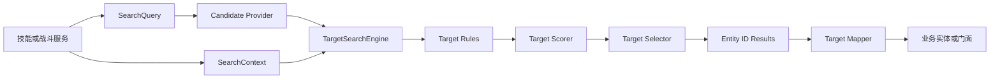
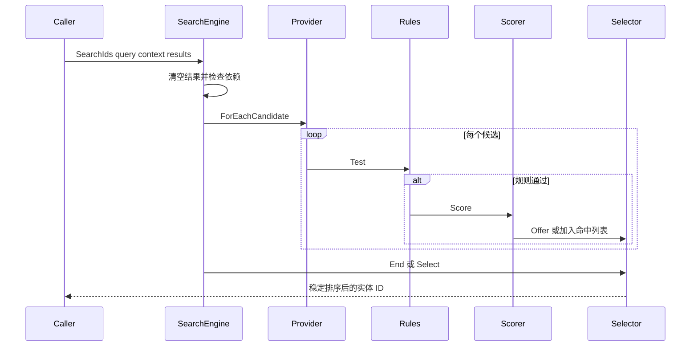
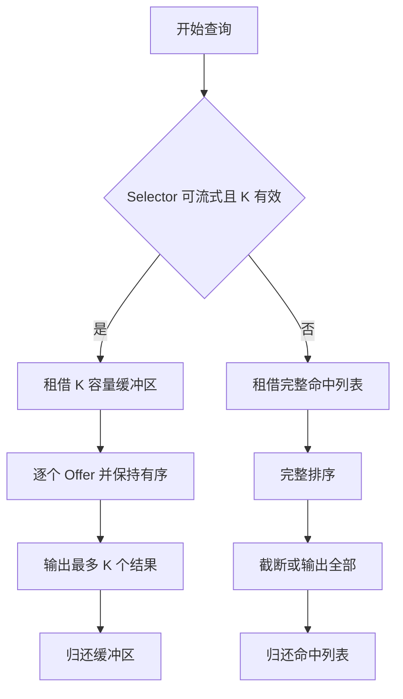
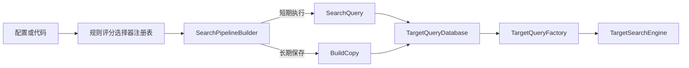

# 8.7 Targeting 目标搜索：查询管线、确定性与扩展边界

> 本文描述 `com.abilitykit.combat.targeting` 当前源码中的通用目标搜索能力。模块把候选枚举、规则过滤、评分、选择和结果映射拆成独立协议；它不负责空间索引、实体存储、阵营规则定义，也不替业务决定技能目标语义。

---

## 1. 能力定位

Targeting 解决的是“如何用一条可组合、可替换、可测量的查询管线，从业务实体中选出稳定目标”。核心流程为：

1. `ICandidateProvider` 提供候选实体 ID。
2. `ITargetRule` 逐个过滤候选。
3. `ITargetScorer` 为命中候选计算分数。
4. `ITargetSelector` 按策略写出结果。
5. `ITargetMapper<T>` 可把实体 ID 映射为业务对象。

模块刻意只依赖 `IEntityId`、`IVec2` 和上下文服务，不绑定 AbilityKit 自有 ECS、Entitas 或 Svelto。项目通过 provider、position provider、key provider 和 mapper 接入自己的实体模型。

### 1.1 负责与不负责

| 范围 | Targeting 负责 | 业务或其他模块负责 |
|------|----------------|--------------------|
| 候选 | 定义遍历协议和消费回调 | 空间索引、实体组、存活集合、AOI 数据 |
| 过滤 | 顺序执行规则并短路失败 | 敌我、无敌、隐身、技能合法性等具体规则 |
| 评分 | 调用评分协议 | 距离、血量、威胁、仇恨等业务公式 |
| 选择 | 全量排序或流式 Top-K | 技能目标数和特殊优先级策略 |
| 结果 | ID 列表、池化结果和映射入口 | 实体生命周期校验、命令执行和伤害结算 |
| 配置 | ID 注册表和查询目录 | 配置加载、版本迁移、热更事务和内容校验 |

---

## 2. 源码入口

| 类型 | 路径 | 作用 |
|------|------|------|
| 查询执行 | `Unity/Packages/com.abilitykit.combat.targeting/Runtime/SearchTarget/TargetSearchEngine.cs` | 串联候选、规则、评分、选择和结果统计 |
| 查询定义 | `Unity/Packages/com.abilitykit.combat.targeting/Runtime/SearchTarget/SearchQuery.cs` | 保存 provider、rules、scorer、selector、数量和 flags |
| 上下文 | `Unity/Packages/com.abilitykit.combat.targeting/Runtime/SearchTarget/SearchContext.cs` | 提供按类型服务与按整数键临时数据 |
| 构建器 | `Unity/Packages/com.abilitykit.combat.targeting/Runtime/SearchTarget/Pipeline/SearchPipelineBuilder.cs` | 以链式 API 组装查询并管理规则列表租约 |
| 选择器 | `Unity/Packages/com.abilitykit.combat.targeting/Runtime/SearchTarget/Selectors/TopKSelectors.cs` | 全量排序 Top-K 与流式 Top-K |
| 查询目录 | `Unity/Packages/com.abilitykit.combat.targeting/Runtime/SearchTarget/TargetQueryDatabase.cs` | 按整数 ID 注册静态或动态查询工厂 |
| 池化 | `Unity/Packages/com.abilitykit.combat.targeting/Runtime/SearchTarget/TargetingPool.cs` | 复用上下文、命中列表、ID 列表、规则列表和命中缓冲区 |
| 注册表 | `Unity/Packages/com.abilitykit.combat.targeting/Runtime/SearchTarget/Registry/TargetRegistries.cs` | 按稳定整数 ID 创建规则、评分器和选择器 |
| MOBA 接入 | `Unity/Packages/com.abilitykit.demo.moba.runtime/Runtime/Application/Services/Search` | 配置查询构建、实体索引 provider 与技能搜索服务 |
| 纯 C# 示例 | `src/AbilityKit.Samples.Logic/Samples/Targeting/TargetingBasics.cs` | 最小搜索示例 |

包内 `Document` 和 `Runtime/SearchTarget/README.md` 是历史设计与使用材料；本文以当前源码为准，接口或语义冲突时应更新历史材料，而不是反向修改本文结论。

---

## 3. 总体结构



`SearchQuery` 是只读结构，但它持有的规则集合和策略对象仍可能是可变引用。只读结构不等于线程安全或不可变快照；长期缓存查询时，调用方必须保证内部对象生命周期稳定。

---

## 4. 查询执行流程



执行前会合并检查 provider、scorer、selector 和 rules 的 `RequiresPosition`。任何环节需要位置而 `SearchContext` 中没有 `IPositionProvider` 时，搜索直接返回空结果，不抛异常。该行为适合战斗运行时降级，但会隐藏装配错误，因此业务启动校验应提前确认必需服务。

候选处理遵循以下顺序：

1. 统计候选。
2. 丢弃无效 `IEntityId`。
3. 按规则列表顺序测试，第一个失败即短路。
4. 统计命中。
5. 评分；没有 scorer 时分数为 `0`。
6. 从 `IEntityKeyProvider` 获取稳定键；没有服务时退化为 `ActorId`。
7. 交给流式 selector，或加入池化命中列表。

没有 selector 时，引擎仍会按“分数降序、稳定键升序”排序，再受 `MaxCount` 限制。`PipelineFlags` 当前由查询和构建器保存，但核心引擎尚未读取升序、首命中短路或缓存标志；这些 flags 不能被文档或配置宣称为已生效能力。

---

## 5. 全量 Top-K 与流式 Top-K



| 策略 | 空间特征 | 适用条件 | 约束 |
|------|----------|----------|------|
| `TopKByScoreSelector` | 保存全部命中并排序 | 结果量较小，或需要完整排序路径 | 候选多时排序和临时列表成本更高 |
| `StreamingTopKByScoreSelector` | 只保留 K 个命中 | `MaxCount > 0` 且候选规模较大 | selector 内部有单次执行状态，不能并发共享同一实例 |
| 无 selector | 保存全部命中并使用引擎默认排序 | 需要稳定全量结果 | flags 不会改变当前排序方向 |

两种 Top-K 都使用同一比较规则：分数高者优先，分数相同则稳定键小者优先。确定性依赖 scorer、规则、provider 和 key provider 本身也是确定的；如果评分读取本地时间、非确定随机数或非权威浮点状态，Targeting 无法替调用方恢复确定性。

---

## 6. 构建、注册与查询目录

`SearchPipelineBuilder` 是 `ref struct`，用于短生命周期的栈上构建流程。第一次添加规则时会从 `TargetingPool` 租借规则列表，调用方必须在作用域结束时执行 `Dispose`。`Build` 直接把当前规则列表引用写入查询；如果查询要越过 builder 生命周期保存，必须使用 `BuildCopy` 创建规则数组副本。

### 6.1 最小接入示例

下面的模式适合“在当前方法内构建并立即执行”。关键点是 builder、context 和结果容器的所有权都留在当前作用域，避免查询引用越过规则列表租约：

```csharp
var engine = new TargetSearchEngine();
using var context = new SearchContext();
context.SetService<IPositionProvider>(positionProvider);

var results = new List<IEntityId>();
using var builder = SearchPipelineBuilder.Create();
var query = builder
    .From(candidateProvider)
    .Filter(targetRule)
    .ScoreBy(targetScorer)
    .Select(new TopKByScoreSelector())
    .Take(3)
    .Build();

engine.SearchIds(in query, context, results);
```

如果查询需要注册到 `TargetQueryDatabase`、跨帧保存或在 builder 释放后执行，应把最后一行改为 `BuildCopy()`。如果改用返回 `SearchResult` 的重载，调用方还必须在消费完结果后释放该结果。生产接入还应在启动阶段验证 `IPositionProvider` 等必需服务，而不是依赖运行时空结果发现装配错误。

这段代码用于说明生命周期，不替代项目 provider、rule、scorer 的实现。仓库中的完整可运行参考位于 `src/AbilityKit.Samples.Logic/Samples/Targeting/TargetingBasics.cs`。



`TargetQueryDatabase` 只提供轻量字典，不负责配置热更事务、并发保护或所有权释放。注册相同 ID 会覆盖旧工厂，传入空 factory 会移除条目。动态工厂可以根据 `SearchContext` 构造查询，适合从施法者、技能等级或战斗模式生成规则；静态工厂适合策略对象生命周期稳定的固定查询。

---

## 7. 生命周期与所有权

| 对象 | 建议所有者 | 生命周期要求 |
|------|------------|--------------|
| `TargetSearchEngine` | 世界级或战斗服务 | 本身无运行态，可复用 |
| `SearchContext` | 单次搜索或串行搜索服务 | `Dispose` 后归还池；不得继续访问或跨线程共享 |
| `SearchResult` | 调用方 | 用完必须释放或 Dispose，具体以类型实现为准 |
| `SearchPipelineBuilder` | 当前方法作用域 | 添加规则后必须 Dispose；长期查询使用 `BuildCopy` |
| 普通 rule/scorer/selector | 查询定义或配置库 | 无状态实现可复用；有状态实现必须按运行隔离 |
| 流式 Top-K selector | 单次搜索或严格串行服务 | `Begin` 到 `End` 期间持有缓冲区，不支持并发重入 |
| `TargetQueryDatabase` | 世界级配置服务 | 清理、替换和热更原子性由上层负责 |

当前 `TargetSearchEngine` 没有 `try/finally` 包围流式 selector 的 `Begin/Offer/End` 整段流程。provider、rule、scorer 或 selector 抛异常时，流式缓冲区可能无法在 `End` 中归还。高可靠业务应保证这些热路径实现不抛异常，并通过测试覆盖异常清理；后续源码可考虑为流式 selector 增加显式 abort/release 契约。

---

## 8. 扩展点设计

### 8.1 Candidate Provider

Provider 应尽量利用现有实体索引或空间索引，通过 `ForEachCandidate` 推送 ID，避免先构造一个全量临时集合。它不应在遍历期间修改底层实体集合；若业务允许增删实体，应提供稳定快照或延迟结构变更。

### 8.2 Rule 与 Scorer

Rule 只做判定，Scorer 只做排序度量。昂贵且所有候选通用的计算应先写入 `SearchContext` 数据或服务，避免每条规则重复求值。规则顺序应从低成本、高淘汰率到高成本排列。

### 8.3 Selector

自定义 selector 必须明确：

- 是否要求位置服务。
- 是否保留状态以及能否并发复用。
- 排序相同时如何稳定决策。
- 是否严格遵守 `MaxCount`。
- 异常时如何释放内部租约。

### 8.4 Mapper

Mapper 是搜索 ID 与业务对象之间的最后适配层。映射失败只跳过该 ID，不会使整个搜索失败。命令执行前仍应再次校验实体存活版本，避免搜索后、执行前实体已被销毁或复用。

---

## 9. 性能与确定性约束

| 维度 | 当前机制 | 接入要求 |
|------|----------|----------|
| 临时分配 | 命中列表、ID 列表、规则列表和 Top-K 缓冲区池化 | 所有租借结果按契约释放 |
| 候选规模 | provider 回调式遍历 | 大规模战斗必须接空间或分组索引 |
| Top-K | 可选流式选择器 | K 远小于候选量时优先使用 |
| 稳定排序 | score 降序、key 升序 | 提供跨端稳定 key，避免只依赖易复用 ActorId |
| 统计 | `ISearchStats` 记录 candidate/hit/result | 诊断实现不得在热路径制造大量分配 |
| 线程 | 上下文、流式 selector、注册表均未声明线程安全 | 默认限定在逻辑线程或世界 Tick 内使用 |
| 回放同步 | 查询对象不自动序列化 | 配置 ID、输入状态和依赖数据必须可重建 |

---

## 10. 验证现状与建议用例

仓库目前提供纯 C# 示例和 MOBA 集成调用，但在包内未发现独立 Targeting 测试目录，`tools/test-gates.json` 也没有 Targeting 专用门禁。因此不能把“存在示例”表述为“通用包已有完整回归覆盖”。

最低应补的契约测试包括：

1. 规则顺序与短路行为。
2. 缺少位置服务时返回空结果。
3. 无 selector、普通 Top-K、流式 Top-K 的结果一致性。
4. 同分时稳定键排序。
5. 无 scorer 时的稳定结果。
6. `Build` 与 `BuildCopy` 生命周期差异。
7. 上下文和结果重复租借时数据已清空。
8. 动态查询工厂失败、缺失 provider 和未知 query ID。
9. 流式 selector 的串行复用与异常清理。
10. MOBA 实体销毁或 ID 复用后的二次存活校验。

这些用例在进入公司级公共资产门禁前，应落入可由 .NET 或 Unity EditMode 稳定执行的测试工程，并在 `tools/test-gates.json` 中按影响范围接入 P1 runtime contract 或 P2 regression。

---

## 11. 源码阅读路径

1. 从 `SearchQuery.cs` 理解查询的六个组成字段。
2. 阅读 `TargetSearchEngine.cs`，确认依赖预检、规则短路、评分和两条 selector 路径。
3. 阅读 `TopKSelectors.cs`，核对稳定比较规则和流式状态。
4. 阅读 `SearchPipelineBuilder.cs` 与 `TargetingPool.cs`，理解规则列表和临时容器所有权。
5. 阅读 `TargetQueryDatabase.cs` 与注册表，理解配置 ID 到运行对象的边界。
6. 阅读 MOBA `Application/Services/Search`，观察实体索引、配置和技能服务如何接入。
7. 运行或阅读 `TargetingBasics.cs`，验证最小纯 C# 用法。

---

## 12. 关联文档

- [玩法能力地图](00-GameplayCapabilityMap.md)
- [技能系统架构](01-SkillSystemArchitecture.md)
- [投射物系统](04-ProjectileSystem.md)
- [伤害计算](06-DamageCalculation.md)
- [MOBA 输入、技能、配置与实体索引](../09-ImplementationExamples/MOBA/02-InputSkillConfigEntity.md)
- [查询与遍历源码深潜](../06-ECSArchitecture/03-QueryAndIteration.md)
- [跨模块性能与热路径治理](../10-EngineeringQuality/05-CrossModulePerformanceAndHotPathGovernance.md)

---

## 13. 边界结论

Targeting 已具备可组合查询、稳定默认排序、流式 Top-K、池化容器、ID 注册和多实体模型适配的通用骨架。当前成熟度边界同样明确：部分 flags 尚未被执行引擎消费；流式 selector 不是并发安全对象；异常清理、包级测试和独立门禁仍需补强。业务可以在逻辑线程内以明确所有权接入，但不应把尚未生效的 flags、自动线程安全或完整性能门禁写入对外能力声明。
