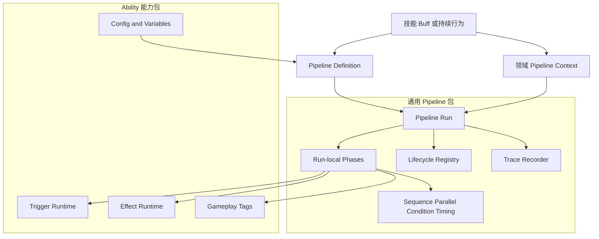
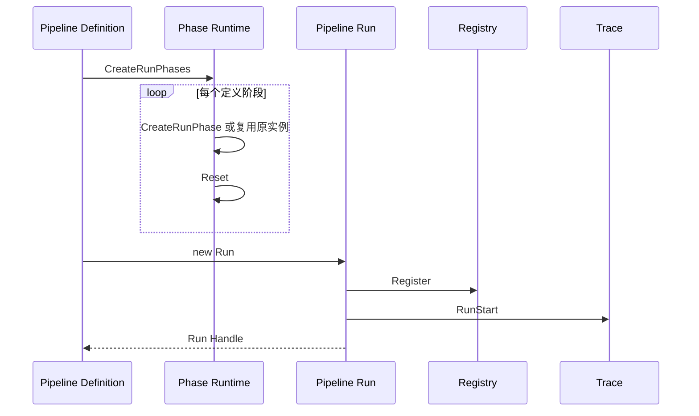
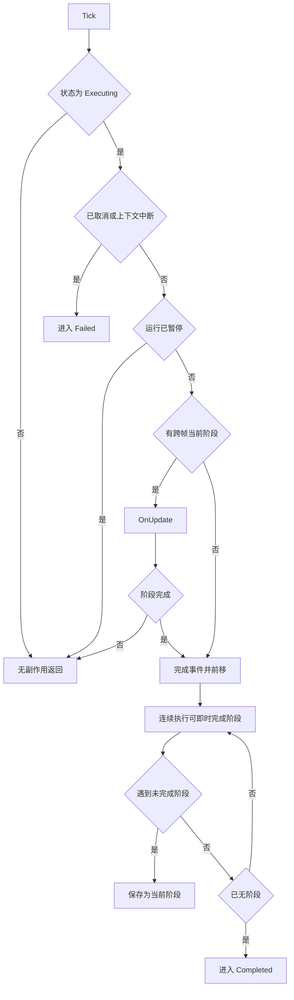
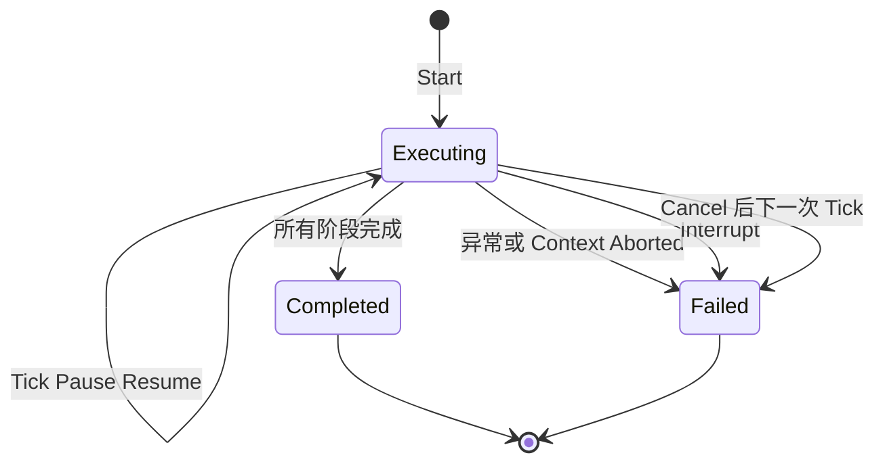
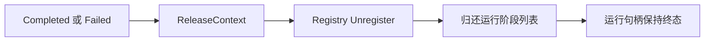
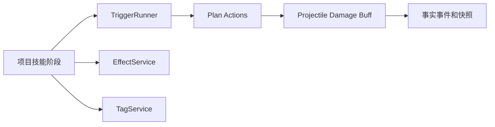

# 8.8 Pipeline 与 Ability Runtime：阶段运行、实例隔离与组合边界

> 本文以 `com.abilitykit.pipeline` 和 `com.abilitykit.ability` 当前源码为依据，解释通用阶段管线如何运行、Ability 能力面如何与其组合，以及 MOBA 技能 runner 属于何种项目特化。Pipeline 是执行骨架，不是技能、Buff 或 Trigger 的统一业务实现。

---

## 1. 能力定位

AbilityKit 将“按阶段推进一段有状态行为”和“表达战斗能力”拆成两个边界：

| 能力面 | 公共包 | 当前职责 |
|--------|--------|----------|
| 阶段执行 | `com.abilitykit.pipeline` | 管线定义、单次运行、阶段组合、Tick、暂停、中断、失败、生命周期注册和 trace |
| 能力表达 | `com.abilitykit.ability` | Trigger/Effect、变量、标签、配置、世界服务和 ECS 门面 |
| 项目技能编排 | `com.abilitykit.demo.moba.runtime` | 技能准备、PreCast/Cast、Timeline、RulePlan、冷却、持续标签和清理 |

Pipeline 不知道施法者、目标、冷却、消耗或伤害；这些语义由上下文、阶段实现和领域服务提供。Ability 包也没有一个自动把所有能力对象转换成 Pipeline 的统一执行器。两者通过项目层 context、phase 和 service 组合，而不是相互替代。

### 1.1 适用范围

Pipeline 适合表达：

- 需要跨帧推进的技能阶段。
- 条件、顺序、并行、重复、延迟和等待组合。
- 可暂停、可取消、可中断的持续行为。
- 需要 trace、活跃实例查询和统一终态的执行过程。

单步同步计算可使用 `InstantAbilityPipeline<TCtx>`。纯事件订阅、长期领域 runtime 或顶层游戏流程不应仅因“有顺序”就强行放入 Pipeline；它们分别更适合 Triggering、领域生命周期服务、Flow 或 HFSM。

### 1.2 选型与宿主责任速查

| 需求 | 推荐承载 | 调用方必须负责 |
|------|----------|----------------|
| 一次调用内完成的校验、计算或即时效果 | `InstantAbilityPipeline<TCtx>` | 创建 context；检查结果；自行处理 context 生命周期 |
| 需要等待、延迟、Timeline 或逐帧推进 | `AbilityPipeline<TCtx>` | 初始化 runtime；持有 run；稳定 Tick；终态后停止持有 |
| 可被多种玩法复用的 Trigger、Effect、Tag 或属性能力 | Ability/Triggering 领域服务 | 由项目 phase 调用服务，不让服务反向依赖具体 Pipeline |
| Buff、Projectile、Motion 等长期实例集合 | 对应领域 runtime | 实例注册、更新、回收与持久状态，不塞进单条技能管线 |
| 顶层大厅、战斗、结算等流程 | Flow 或 HFSM | 状态切换、场景资源和 feature 生命周期 |

跨帧 Pipeline 的最小宿主循环应遵守以下责任：启动时保存 `IAbilityPipelineRun<TCtx>`；仅在运行有效期内调用 `Tick(deltaTime)`；取消后至少继续 Tick 一次以完成失败和清理，或改用立即生效的 `Interrupt()`；宿主销毁前终止仍活跃的 run。自定义有状态 phase 还必须实现 `IAbilityPipelinePhaseInstanceFactory<TCtx>`，否则同一定义的并发运行可能共享状态。

仓库中的最小即时示例和 context/config 实现位于 `src/AbilityKit.Samples.Logic/Samples/Pipeline/PipelineBasics.cs`；MOBA 跨帧接入则应从 `SkillPipelineRunner.cs` 阅读，但其 PreCast/Cast 和配置字段不是通用契约。

---

## 2. 源码入口

| 类型 | 路径 | 作用 |
|------|------|------|
| 通用管线 | `Unity/Packages/com.abilitykit.pipeline/Runtime/Core/Pipeline/AbilityPipeline.cs` | 创建运行句柄并推进阶段、终态和清理 |
| 运行阶段创建 | `Unity/Packages/com.abilitykit.pipeline/Runtime/Core/Pipeline/AbilityPipelinePhaseRuntime.cs` | 为每次运行创建或兼容复用阶段 |
| 即时管线 | `Unity/Packages/com.abilitykit.pipeline/Runtime/Core/Pipeline/InstantAbilityPipeline.cs` | 同步执行仅即时阶段的管线 |
| 上下文协议 | `Unity/Packages/com.abilitykit.pipeline/Runtime/Interface/IAbilityPipelineContext.cs` | 共享数据、阶段 ID、状态和中断字段 |
| 运行句柄 | `Unity/Packages/com.abilitykit.pipeline/Runtime/Interface/IAbilityPipelineRun.cs` | Tick、Pause、Resume、Interrupt 和 Cancel |
| 阶段协议 | `Unity/Packages/com.abilitykit.pipeline/Runtime/Interface/IAbilityPipelinePhase.cs` | 执行、更新、完成、重置、错误和子阶段 |
| 运行实例工厂 | `Unity/Packages/com.abilitykit.pipeline/Runtime/Interface/IAbilityPipelinePhaseInstanceFactory.cs` | 从定义阶段创建运行态阶段 |
| 组合阶段 | `Unity/Packages/com.abilitykit.pipeline/Runtime/Phase` | Sequence、Parallel、Conditional、Repeat、Delay、Timeline、WaitUntil 等 |
| 运行时上下文 | `Unity/Packages/com.abilitykit.pipeline/Runtime/PipelineRuntime.cs` | 独立 registry、trace recorder 和池配置 |
| 生命周期注册表 | `Unity/Packages/com.abilitykit.pipeline/Runtime/Lifecycle/PipelineRegistry.cs` | 活跃运行注册、查询和全局中断 |
| 池化 | `Unity/Packages/com.abilitykit.pipeline/Runtime/Pooling/PipelinePools.cs` | 运行阶段列表和查询列表复用 |
| Ability 能力面 | `Unity/Packages/com.abilitykit.ability/Runtime/Ability` | Trigger、Effect、Config、Tag 和 World Service |
| MOBA runner | `Unity/Packages/com.abilitykit.demo.moba.runtime/Runtime/Application/Services/Skill/Pipeline/SkillPipelineRunner.cs` | MOBA PreCast/Cast 运行和领域清理 |
| MOBA 配置 | `Unity/Packages/com.abilitykit.demo.moba.runtime/Runtime/Application/Services/Skill/Pipeline` | Timeline、RulePlan、Sequence、WaitUntil 的配置映射 |
| 纯 C# 示例 | `src/AbilityKit.Samples.Logic/Samples/Pipeline/PipelineBasics.cs` | 即时和跨帧管线最小用法 |

`src/AbilityKit.Pipeline/AbilityKit.Pipeline.csproj` 直接编译 Unity package 的 Runtime 源码，因此通用逻辑可在非 Unity .NET 工程复用。Unity 生成工程不是源码所有权入口。

---

## 3. 分层结构

领域上下文是连接两层的关键。`IAbilityPipelineContext` 只规定通用控制字段和字符串键共享数据；强类型施法者、技能定义、运行时服务和失败信息应由项目 context 显式建模。共享字典适合跨阶段少量数据，不应替代清晰的强类型字段。

---

## 4. 定义、运行与阶段实例

一次 `AbilityPipeline<TCtx>.Start` 会：

1. 校验 config 和 context。
2. 从池中租借单次运行阶段列表。
3. 为定义中的每个阶段调用运行阶段创建逻辑。
4. 重置运行阶段。
5. 创建一次性 `IAbilityPipelineRun<TCtx>`。
6. 将状态写为 `Executing`，发出 start 事件并注册到 runtime。

### 4.1 隔离保证的真实边界

只有实现 `IAbilityPipelinePhaseInstanceFactory<TCtx>` 的阶段才会创建本次运行实例。不实现该接口的旧阶段会直接复用定义对象，然后执行 `Reset`。因此：

- 内置有状态阶段应实现实例工厂；组合阶段会递归创建子阶段运行实例。
- 自定义有状态阶段必须实现实例工厂，才能允许同一定义并发或重入运行。
- 兼容阶段只适合无状态实现，或由调用方保证绝不并发。
- “一个定义可安全启动任意多个并发运行”不是无条件成立的能力声明。

阶段列表本身按运行隔离并池化；列表隔离不能弥补列表元素仍被复用的问题。

---

## 5. Tick 与阶段推进

每个 Tick 只对当前跨帧阶段调用一次 `OnUpdate`，但会在同一 Tick 内连续执行后续可同步完成的阶段，直到遇到未完成阶段或管线结束。阶段的 `ShouldExecute` 为 false 时直接跳过，不产生 phase start/complete 事件。

异常由运行对象捕获：先尝试调用阶段 `HandleError`，再记录失败原因、发出 phase/pipeline failure 事件和 trace，最后清理。阶段错误处理自身抛出的异常会被吞掉，以确保原始终态清理继续执行。

---

## 6. 状态、暂停、中断与取消

| 操作 | 当前语义 | 关键边界 |
|------|----------|----------|
| `Pause` | 设置运行句柄 `IsPaused` 和 context `IsPaused` | `State` 仍保持 `Executing` |
| `Resume` | 清除两个暂停布尔值 | 非暂停或非执行状态幂等 |
| `Interrupt` | 通知当前可中断阶段和直接子阶段，设置 `IsAborted`，立即失败 | 不存在独立 Interrupted 终态 |
| `Cancel` | 只设置取消请求 | 下一次 `Tick` 才进入 `Failed` 并清理 |
| context abort | Tick 开头或阶段执行后检测 | 进入 `Failed` |
| 异常 | 记录异常和 fail reason | 进入 `Failed` |
| 完成 | 所有阶段处理结束 | 进入 `Completed` |

`EAbilityPipelineState` 虽然定义了 `Ready` 和 `Paused`，通用 `Run` 实现创建时直接进入 `Executing`，暂停时也不会把状态写成 `Paused`。调用方判断暂停必须使用 `IsPaused`，不能只检查状态枚举。

运行句柄进入 `Completed` 或 `Failed` 后，控制方法按接口约定保持幂等。Cancel 是延迟终止；如果外部取消后不再 Tick，运行仍会保留在 registry 中且 context 不会释放。持有者必须保证继续推进一次，或按业务使用立即 `Interrupt`。

---

## 7. 清理与所有权

终态统一执行以下清理：

1. 调用定义侧 `ReleaseContext`。
2. 从 `PipelineRuntime.Registry` 注销运行。
3. 清空并归还本次运行阶段列表。

`ReleaseContext` 异常会被吞掉，registry 注销和列表归还仍会执行。该设计保护基础设施，但也意味着 context 释放失败不会自动暴露为新的管线异常；项目应在自己的 context 池或 release 实现中提供诊断。

Pipeline 不会自动 Dispose config、定义阶段、领域服务或 AbilityInstance。定义的长期所有者负责定义与配置；项目 runner 负责 context 来源、Tick 调度和终止；具体阶段负责自己创建的子资源，但应在终态或中断路径显式释放。

---

## 8. 组合阶段

| 阶段族 | 当前语义 | 主要风险 |
|--------|----------|----------|
| Action | 执行一个动作 | 动作异常会使整条管线失败 |
| Sequence | 子阶段顺序执行 | 子阶段必须正确隔离运行态 |
| Parallel | 同时启动符合条件的子阶段，全部完成后结束 | 同一 context 上的写入顺序和冲突由业务负责 |
| Conditional/Gate | 根据条件选择或阻断 | 条件必须确定且低副作用 |
| Delay/Timeline | 按时间推进 | 时间源和 Tick 粒度影响重放一致性 |
| Repeat | 重复运行阶段 | 次数、终止条件和子阶段重置必须有上界 |
| WaitUntil | 等待谓词成立 | 必须设计超时或外部中断路径 |

Parallel 是逻辑并发，不代表多线程执行。其子阶段仍在调用方 Tick 线程内按列表顺序更新。多个子阶段修改同一 context 字段时，结果依赖定义顺序；若需要汇总，应写入独立槽位后由后续阶段归并。

---

## 9. 即时管线

`InstantAbilityPipeline<TCtx>` 只接受 `IAbilityInstantPhase<TCtx>`，并由 `RunToCompletion` 同步执行。任何阶段在 `Execute` 后仍未完成都会立即返回 `Failed`，错误信息明确指出阶段类型和 ID。

即时管线与通用运行对象有以下差异：

| 维度 | 即时管线 | 通用管线 |
|------|----------|----------|
| 推进 | 一次 `RunToCompletion` | 外部逐 Tick 推进 |
| 运行句柄 | 无 | `IAbilityPipelineRun<TCtx>` |
| 阶段实例 | 直接重置定义阶段 | 工厂创建或兼容复用 |
| Registry/trace | 不注册通用运行句柄，当前实现不走统一 trace | 注册并记录运行/阶段 trace |
| context 释放 | 不调用抽象 `ReleaseContext` | 终态调用定义的 `ReleaseContext` |
| 适用 | 同步校验、计算、即时效果 | 跨帧技能和持续阶段 |

调用方不能假设两种管线有完全相同的所有权、事件和观测语义。

---

## 10. Runtime、Registry 与 Trace

`PipelineRuntime` 将 registry 和 trace recorder 组合为可替换运行环境。默认构造仍引用全局 `PipelineRegistry.Instance`；只有显式注入独立 registry 才获得真正的世界级隔离。

`Initialize` 会注册 Pipeline 池默认配置，并只对具体 `PipelineRegistry` 调用初始化。未初始化的默认 registry 会忽略注册，因此 ActiveCount 和活跃查询不会反映运行，但管线本身仍可推进。业务 bootstrap 应在启动时初始化 runtime，在关闭时先终止活跃运行，再 Shutdown。

Registry 提供按阶段和状态查询。直接返回列表的 `GetOwnersByPhase`、`GetOwnersByState` 会分配新列表；热路径诊断应使用填充调用方列表或池化 lease。当前 `InterruptAll` 遍历活跃列表时，运行的中断可能同步注销自身并修改列表，批量中断语义需要专项测试，不能默认所有实例都会在一次正向遍历中被访问。

Trace recorder 默认是 no-op。启用记录器后可观察 run start/end、phase start/complete/error、pause、resume 和 interrupt。Trace 是诊断输出，不应作为权威玩法状态来源。

---

## 11. Ability 组合面

Ability 包当前提供以下可被 Pipeline 阶段调用的能力：

- `TriggerRunner`、条件与动作运行时。
- `EffectService`、`GameplayEffectSpec` 和 Effect 组件。
- Gameplay Tag、持久对象注册和效果路由。
- 配置数据库、Trigger 强类型配置和 JSON 数据库。
- World service、ECS unit facade 和 resolver。
- 变量域、blackboard 和数值表达式。

推荐依赖方向为“项目 phase 依赖领域 service”，而不是让 Trigger、Effect 反向依赖具体技能 Pipeline。这样同一 Trigger 或 Effect 可被技能、Buff、Projectile、AOE 和测试夹具复用。

`AbilityPipelineSharedKeys` 只提供共享数据键，不构成强类型技能模型。跨模块稳定契约优先使用明确 context 字段或值对象；字符串共享键需要集中登记并做冲突测试。

---

## 12. MOBA 特化边界

MOBA 的 `SkillPipelineRunner` 是通用 Pipeline 的参考接入，不是公共 API 语义。它负责：

- 创建和持有 `SkillPipelineContext`。
- 运行 PreCast，再切换到 Cast。
- 驱动 Timeline、RulePlan、Sequence 和 WaitUntil。
- 协调技能策略、冷却、持续标签和失败结构。
- 在完成、失败、取消和角色销毁路径释放领域资源。

`skills.json`、`skill_flows.json`、PreCast/Cast 名称、Timeline payload、RulePlan 和技能持续标签都属于 MOBA 配置协议。其他项目可以借鉴组合方式，但不应让公共 Pipeline 文档承诺这些字段普遍存在。

---

## 13. 性能、确定性与线程约束

| 维度 | 当前机制 | 使用要求 |
|------|----------|----------|
| 分配 | 运行阶段列表和 registry 查询 lease 池化 | context、阶段内部集合仍需业务治理 |
| 实例隔离 | 阶段工厂按运行创建实例 | 自定义有状态阶段必须实现工厂 |
| 时间 | 阶段接受 deltaTime，包提供 time provider 抽象 | 帧同步/回放应使用权威逻辑时间 |
| 顺序 | 定义列表顺序执行 | 配置生成必须保持稳定顺序和稳定阶段 ID |
| 并行 | 单线程逻辑并行 | 禁止依赖真实线程并发假设 |
| Trace | 可插拔 recorder | 关闭时应近似 no-op；开启后的分配需单独预算 |
| 线程 | registry、run、context 和阶段均未声明线程安全 | 默认由单一逻辑线程创建、Tick 和终止 |
| 失败 | Completed/Failed 两个实际终态 | 回放和协议需记录业务失败原因，不只记录枚举 |

---

## 14. 验证现状与最低契约

仓库存在 `src/AbilityKit.Samples.Logic/Ability/Tests/PipelineTests.cs` 的样例自检、纯 C# Pipeline 示例、MOBA 技能测试和场景 smoke；当前未发现独立 `AbilityKit.Pipeline.Tests` 工程，也没有 Pipeline 专用 `tools/test-gates.json` 步骤。因此现状是“有样例与项目级覆盖”，不是“公共包契约已完整门禁化”。

公共包至少应持续验证：

1. 同步阶段在一次 Tick 内连续完成。
2. durational 阶段逐 Tick 推进。
3. Pause/Resume 不改变实际 State，且暂停不推进阶段。
4. Interrupt 立即失败并通知可中断阶段。
5. Cancel 在下一 Tick 失败和清理。
6. 异常、context abort 和正常完成都只清理一次。
7. 工厂阶段并发运行互不污染。
8. 非工厂有状态阶段的兼容风险有显式测试或启动校验。
9. Sequence、Parallel、Condition、Repeat、Delay、WaitUntil 的重置与嵌套。
10. Instant 阶段未同步完成时返回失败。
11. runtime 初始化、registry 注册注销和 trace 顺序。
12. 池化列表重复租借不保留旧阶段。
13. 全局中断在注销列表变更时不遗漏运行。
14. MOBA PreCast/Cast 成功、失败、取消与角色销毁清理。

公司级采用前，应把纯公共契约放进独立 .NET 测试工程，并将项目专用场景继续保留在 MOBA smoke 与 Unity acceptance 中。

---

## 15. 源码阅读路径

1. 阅读 `IAbilityPipelineContext.cs`、`IAbilityPipelinePhase.cs` 和 `IAbilityPipelineRun.cs`。
2. 阅读 `AbilityPipeline.cs`，跟踪 Start、Tick、终态和 Cleanup。
3. 阅读 `AbilityPipelinePhaseRuntime.cs`，理解实例工厂与兼容复用边界。
4. 阅读 Sequence、Parallel、Conditional、Repeat 和 WaitUntil 阶段。
5. 阅读 `InstantAbilityPipeline.cs`，对比同步执行语义。
6. 阅读 `PipelineRuntime.cs`、`PipelineRegistry.cs`、events 和 trace。
7. 阅读 Ability 包的 Trigger、Effect、Tag 和 config 服务。
8. 最后阅读 MOBA `SkillPipelineRunner` 和技能 Flow 配置映射，区分通用契约与示例特化。

---

## 16. 关联文档

- [玩法能力地图](00-GameplayCapabilityMap.md)
- [技能系统架构](01-SkillSystemArchitecture.md)
- [触发器系统](02-TriggeringSystem.md)
- [Buff 系统](03-BuffSystem.md)
- [MOBA 技能执行深潜](../09-ImplementationExamples/MOBA/05-SkillExecutionDeepDive.md)
- [MOBA 技能 Flow 与 Pipeline 配置设计](../09-ImplementationExamples/MOBA/18-SkillFlowPipelineConfigDesign.md)
- [跨模块性能与热路径治理](../10-EngineeringQuality/05-CrossModulePerformanceAndHotPathGovernance.md)

---

## 17. 边界结论

通用 Pipeline 已具备跨帧推进、组合阶段、一次性运行句柄、失败清理、注册表、trace 和基础池化能力；Ability 包为阶段提供 Trigger、Effect、Tag、配置和世界服务。当前必须保留四条成熟度说明：运行隔离取决于阶段实例工厂；暂停不写入 `Paused` 枚举状态；Cancel 需要后续 Tick 才清理；公共包测试和门禁尚未独立成体系。MOBA runner 证明了可组合落地，但不能被等同为所有项目的默认 Ability Runtime。
