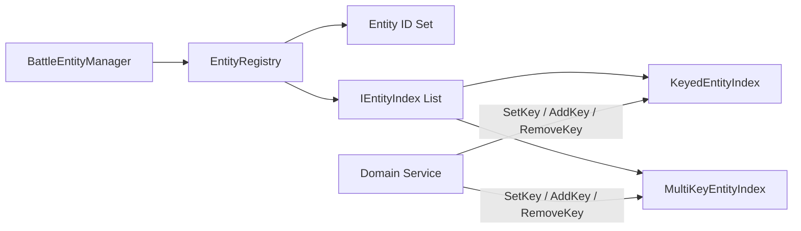
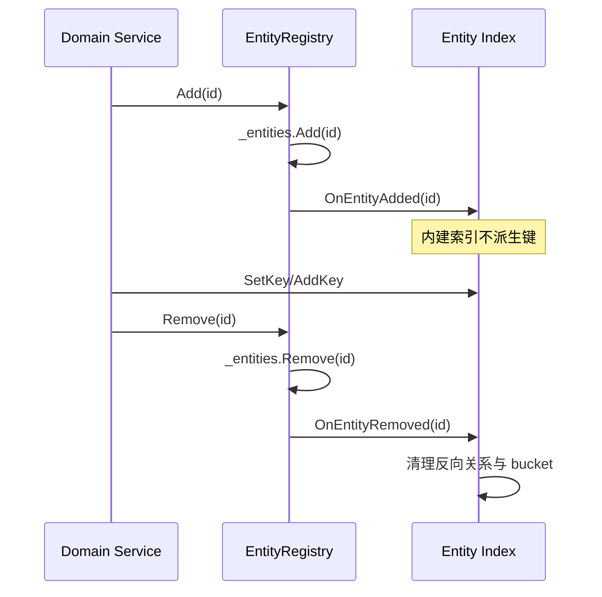
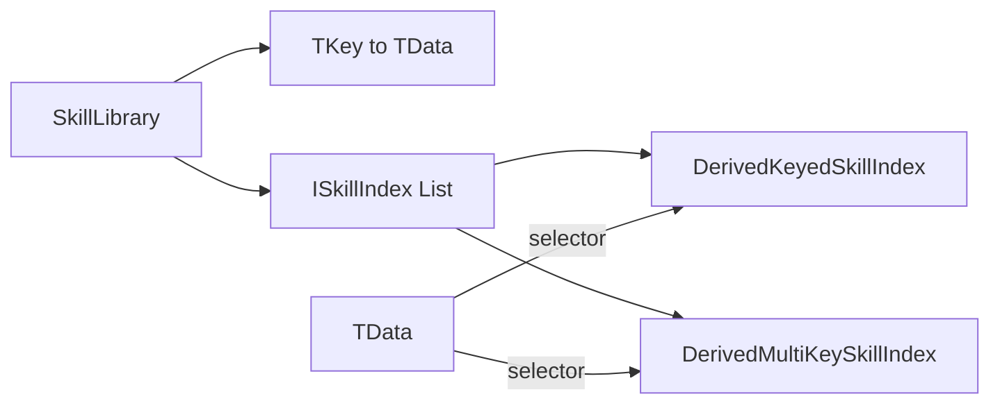
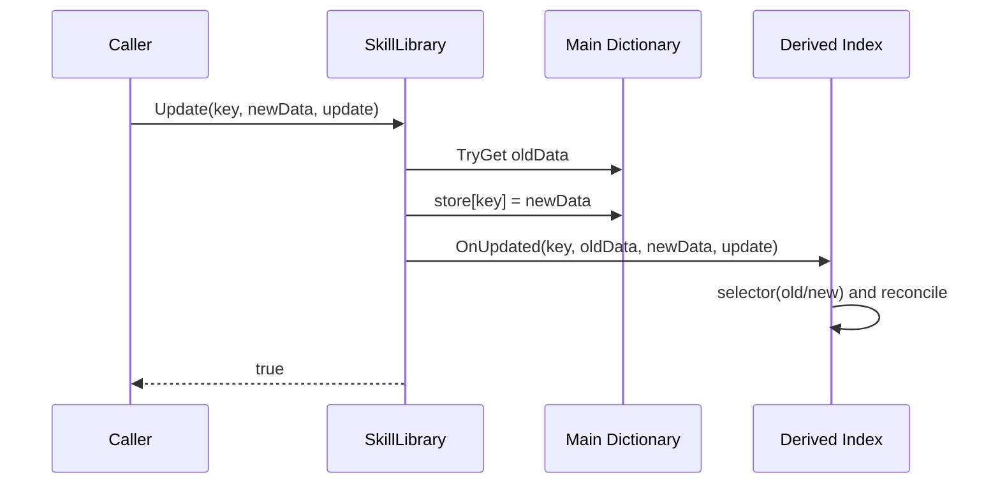
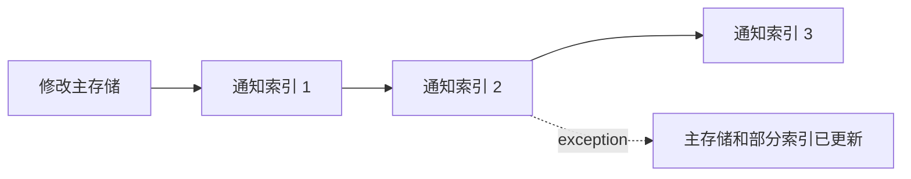

# EntityManager 与 SkillLibrary 索引基础设施

> 本文说明 `com.abilitykit.combat.entitymanager` 与 `com.abilitykit.combat.skilllibrary` 的公共索引模型、写入顺序、一致性边界和验证现状。两者都用“主存储 + 派生查询结构”降低按分类查找成本，但键的来源、更新责任和成熟度不同。

## 1. 能力定位

这两个包解决的是战斗逻辑中的轻量内存索引问题：

- EntityManager 保存实体 ID 集，并按阵营、类型、标签等维度建立 ID bucket。
- SkillLibrary 保存技能数据，并从数据中派生学派、标签等查询 bucket。
- 查询结果是索引当前持有的 ID 集合，不负责多条件查询规划、排序、分页或持久化。
- 两者都不是数据库、ECS 存储、事务管理器或线程安全容器。

关键区别如下：

| 维度 | EntityManager | SkillLibrary |
|------|---------------|--------------|
| 主存储 | 实体 ID 集 | `TKey -> TData` 字典 |
| 索引键来源 | 调用方显式设置 | selector 从 `TData` 派生 |
| 内建更新行为 | `OnEntityUpdated` 为空，不自动改键 | `Update` 用 old/new data 重算派生键 |
| 删除清理 | Registry 删除时通知索引清理 ID | Library 删除时通知索引清理技能键 |
| 生产调用证据 | MOBA `MobaEntityManager` | 当前仅包内示例 |
| 直接测试证据 | 未发现专门测试 | 未发现专门测试 |

## 2. 源码与构建入口

| 内容 | 路径 |
|------|------|
| EntityManager Unity 源码 | `Unity/Packages/com.abilitykit.combat.entitymanager/Runtime/EntityManager` |
| EntityManager .NET 镜像 | `src/AbilityKit.Combat.EntityManager/AbilityKit.Combat.EntityManager.csproj` |
| SkillLibrary Unity 源码 | `Unity/Packages/com.abilitykit.combat.skilllibrary/Runtime/SkillLibrary` |
| SkillLibrary .NET 镜像 | `src/AbilityKit.Combat.SkillLibrary/AbilityKit.Combat.SkillLibrary.csproj` |
| MOBA 实体索引接入 | `Unity/Packages/com.abilitykit.demo.moba.runtime/Runtime/Application/Services/EntityManager/MobaEntityManager.cs` |
| MOBA 生成与索引深潜 | `../09-ImplementationExamples/MOBA/06-ConfigEntitySpawnDeepDive.md` |

两个 `.NET` 工程通过 `Compile Include` 链接 Unity package 的 Runtime 源码。Unity asmdef 和 `.NET` 镜像是同一份实现的两个构建入口，不应维护源码副本。

## 3. EntityManager：注册表与显式索引

### 3.1 对象关系



`BattleEntityManager<TId>` 是 `EntityRegistry<TId>` 的薄门面，额外提供 keyed 和 multi-key 索引工厂。Registry 只知道实体 ID 和 `IEntityIndex<TId>` 观察者，不拥有实体组件或领域对象。

`KeyedEntityIndex<TKey,TId>` 保存每个实体最多一个键的双向关系：

- `TKey -> HashSet<TId>` 用于按键查询。
- `TId -> TKey` 用于换键和删除清理。

`MultiKeyEntityIndex<TKey,TId>` 保存每个实体零到多个键：

- `TKey -> HashSet<TId>` 用于按键查询。
- `TId -> HashSet<TKey>` 用于反向清理。

### 3.2 正确写入顺序

创建实体时应先注册 ID，再写入全部领域索引：

```csharp
manager.Add(entityId);
byTeam.SetKey(entityId, team);
byType.SetKey(entityId, type);
byTag.AddKey(entityId, tag);
```

修改分类属性时，调用方必须显式更新相应索引：

```csharp
byTeam.SetKey(entityId, newTeam);
byTag.RemoveKey(entityId, oldTag);
byTag.AddKey(entityId, newTag);
```

删除实体只需从 Registry 删除。Registry 会调用所有已注册索引的 `OnEntityRemoved`，内建索引据此清理反向关系和 bucket。



### 3.3 `NotifyUpdated` 的真实边界

`EntityUpdate` 只是一个 `int Type + object Payload` 信封。Registry 的 `NotifyUpdated` 会：

1. 忽略未注册 ID。
2. 对实现 `IUpdateTypeAwareIndex<TId>` 的自定义索引调用 `Accepts(update.Type)`。
3. 将通过过滤的更新转给 `OnEntityUpdated`。

内建 `KeyedEntityIndex` 和 `MultiKeyEntityIndex` 的 `OnEntityUpdated` 当前都是空实现，也没有实现 `IUpdateTypeAwareIndex<TId>`。因此：

- `NotifyUpdated` 不会自动调用 `SetKey`、`AddKey` 或 `RemoveKey`。
- `SetKeyUpdate`、`AddKeyUpdate`、`RemoveKeyUpdate` 只是数据结构，当前没有被内建索引消费。
- 如需事件驱动派生键，应实现自定义 `IEntityIndex<TId>`，并自行读取领域数据或 payload。

不能把“实体属性已修改”和“所有索引已同步”视为同一操作。

### 3.4 注册与索引的独立性

内建索引的直接写 API 不检查 ID 是否存在于 Registry。下面的调用可以建立悬空索引记录：

```csharp
byTeam.SetKey(unregisteredId, team);
```

后续对该 ID 调用 `Registry.Remove` 会因主集合中不存在该 ID 而直接返回，无法触发索引清理。因此领域服务应把“注册 ID + 设置索引”封装在同一个受控入口，并禁止业务代码绕过该入口。

新增索引时，Registry 会向它回放当前全部 ID；但内建索引的 `OnEntityAdded` 为空，所以后加的内建索引仍是空索引。调用方必须遍历领域数据完成 backfill。

## 4. SkillLibrary：主数据与派生索引

### 4.1 对象关系



`SkillLibrary<TKey,TData>` 同时拥有主数据和索引列表。内建派生索引通过 selector 读取 `TData`：

- `CreateDerivedKeyedIndex` 为每条技能派生一个索引键。
- `CreateDerivedMultiKeyIndex` 为每条技能派生零到多个索引键。

索引只保存技能主键，不复制 `TData`。查询到技能键后仍应通过 `TryGet` 或 `Get` 读取主数据。

### 4.2 增删改流程



行为要点：

- `Add` 在主字典插入成功后通知全部索引。
- `Remove` 先从主字典删除，再用旧数据通知全部索引。
- `Update` 先替换主数据，再把 old/new data 交给全部索引。
- `NotifyUpdated` 不替换主数据，只把当前数据同时作为 old/new data 发送。
- 新增索引时会回放当前全部技能，因此内建派生索引可以完成 backfill。
- `Get` 在键缺失时抛 `KeyNotFoundException`；普通探测应使用 `TryGet`。

`DerivedKeyedSkillIndex` 比较 old/new selector 结果并在键变化时移动技能键。`DerivedMultiKeySkillIndex` 构造 old/new key set，并按集合差添加或删除关系。两个内建索引当前都不根据 `SkillUpdate.Type` 过滤；更新信封只对自定义 `ISkillIndex` 有潜在价值。

## 5. 一致性与失败边界

### 5.1 通知不是事务

EntityRegistry 和 SkillLibrary 都采用“先修改主存储，再逐个通知索引”的顺序。索引回调没有 rollback、两阶段提交或统一异常隔离：



任一自定义 selector 或索引回调抛异常时，调用者可能观察到：

- 主存储已经变更。
- 排在异常前的索引已经变更。
- 排在异常后的索引尚未变更。

生产接入应保证 selector 和回调无副作用、可重复执行且不抛异常。若故障后无法证明一致性，应从领域权威数据重建索引，而不是继续增量写入。

### 5.2 比较器并非全链路传播

构造函数允许传入自定义 comparer，但当前实现并未在全部内部比较中统一使用它：

- `KeyedEntityIndex.SetKey` 用 `EqualityComparer<TKey>.Default` 判断旧键和新键是否相等。
- `DerivedKeyedSkillIndex.OnUpdated` 也用默认比较器判断派生键是否变化。
- 派生 multi-key 索引用于差分的临时 `HashSet` 使用默认比较器。
- bucket 字典本身使用调用方传入的 key comparer。

例如忽略大小写的字符串 comparer 可能让字典认为两个键相同，但更新差分逻辑仍认为它们不同。当前更稳妥的约束是使用默认等价语义，或在写入前规范化键。自定义 comparer 的端到端一致性需要源码修复和专门测试后才能作为正式能力承诺。

### 5.3 返回集合与线程模型

`Get` / `TryGet` 返回的是内部 `HashSet` 的只读接口视图，不是不可变快照。调用方不能通过接口修改集合，但后续索引写入会改变同一个集合实例。遍历期间并发修改可能使枚举失效。

两个包都没有锁或线程安全声明。推荐在单一逻辑线程中写入和查询；跨线程消费应由上层复制快照并明确同步边界。

### 5.4 查询复杂度的准确表述

按单个键定位 bucket 通常是字典查找，平均复杂度接近 O(1)，但完整成本还包括：

- bucket 内结果数量。
- 多条件查询时由上层执行的集合求交或过滤。
- 哈希质量、扩容和自定义 comparer 成本。
- 更新时对多键集合执行的差分和反向关系维护。

因此不能笼统承诺“所有查询 O(1)”。这两个包也没有查询规划器或跨索引原生求交 API。

## 6. 推荐接入模式

### 6.1 EntityManager 聚合写入口

领域服务应集中管理注册与索引：

```csharp
public void RegisterActor(int id, Team team, EntityMainType type)
{
    _entities.Add(id);
    _byTeam.SetKey(id, team);
    _byType.SetKey(id, type);
}

public void ChangeTeam(int id, Team team)
{
    _byTeam.SetKey(id, team);
}

public void UnregisterActor(int id)
{
    _entities.Remove(id);
}
```

如果中途写入可能失败，上层应先验证全部输入，再按固定顺序提交；异常后从权威实体数据重建相关索引。

### 6.2 SkillLibrary 使用不可变数据

派生索引依赖 old/new data。若 `TData` 是可变引用对象，并在调用 `Update` 前原地修改，old/new 可能指向同一对象，selector 无法看到旧值。推荐：

- 使用不可变记录或替换整个数据对象。
- selector 只读取稳定字段，不访问外部可变状态。
- 通过 `Update(key, newData, update)` 统一提交替换。
- 配置热重载场景优先构建新 Library 或新索引集合，验证后整体切换。

## 7. 验证现状与门禁

截至 2026-07-15：

- `AbilityKit.Combat.EntityManager.csproj` Release 构建成功，0 error。
- `AbilityKit.Combat.SkillLibrary.csproj` Release 构建成功，0 error。
- 两个工程存在仓库既有 nullable 和公共 API XML 注释警告。
- EntityManager 在 MOBA 中建立 Team、MainType、UnitSubType、OwnerPlayer 索引，属于真实运行接入。
- SkillLibrary 全仓仅发现 `SkillLibraryExample`，尚无生产 runtime 调用证据。
- 两个包均未发现直接 NUnit 或 xUnit 测试。

建议补充的最低测试集合：

1. Add、Remove、后加索引 backfill 和重复写入。
2. 单键换键、多键集合差和空 selector 结果。
3. `NotifyUpdated` 的自定义 update-aware 索引过滤。
4. selector 或回调抛异常后的部分提交状态。
5. 自定义 comparer 在字典、换键判断和 multi-key 差分中的一致性。
6. 可变 `TData` 原地修改造成的旧值丢失回归。

## 8. 采用结论

- EntityManager 可作为单线程战斗域内的轻量 ID 索引，但业务必须集中维护键，并接受当前非事务边界。
- SkillLibrary 的派生索引模型可用于原型和受控配置集；在生产采用前应补直接测试、真实 runtime 接入和热重载一致性验证。
- 两者都不应被描述为自动同步数据库。权威数据始终在领域实体或技能主数据中，索引是可重建的派生状态。
