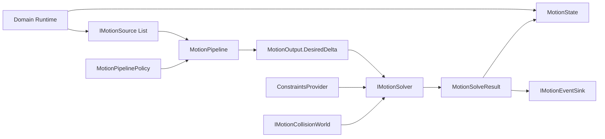
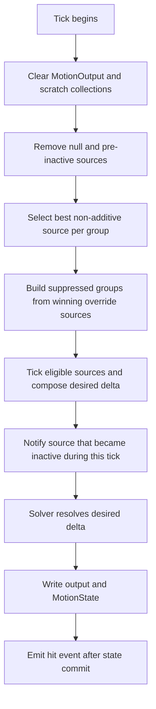
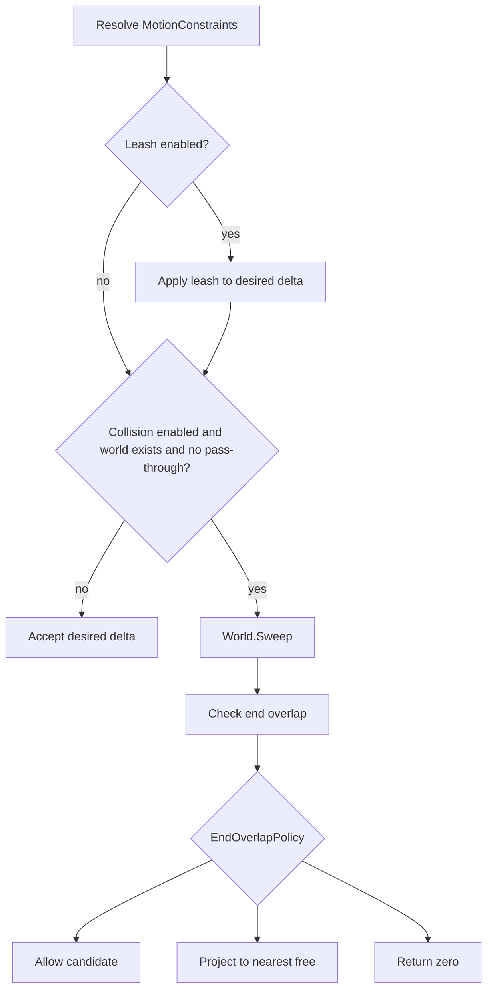

# Motion Pipeline 与约束求解

> 本文描述 `com.abilitykit.combat.motion` 的公共运行时契约。专题聚焦移动意图合成、分组抑制、碰撞与 leash 求解、source 生命周期、快照范围和对象池所有权；MOBA 如何把 Motion 接入 PlanAction、Trigger 和临时实体生命周期，见示例专题。

## 1. 能力定位

Motion 包把“谁想移动”与“最终允许移动多少”拆成两个阶段：

- `IMotionSource` 产生本 tick 的期望位移。
- `MotionPipeline` 选择、抑制并合成多个 source。
- `IMotionSolver` 把期望位移解析为可应用位移。
- `MotionState` 保存位置、速度、朝向和累计时间。
- `IMotionEventSink` 接收命中、到达和过期事件。

它不负责：

- 创建或销毁领域实体。
- 解释技能配置、Buff 或 TriggerPlan。
- 自动同步 Unity Transform、ECS 组件或网络快照。
- 提供确定性的物理世界实现。
- 保存完整 pipeline、solver、policy 和外部轨迹资源快照。

因此 Motion 是纯 C# 的移动组合内核，领域层仍需负责 source 创建、tick 调度、状态同步、事件转译和资源释放。

## 2. 源码与验证入口

| 内容 | 路径 |
|------|------|
| Unity Runtime | `Unity/Packages/com.abilitykit.combat.motion/Runtime/MotionSystem` |
| .NET 镜像工程 | `src/AbilityKit.Combat.Motion/AbilityKit.Combat.Motion.csproj` |
| Unity Editor 测试 | `Unity/Packages/com.abilitykit.combat.motion/Tests/Editor/MotionSystemTests.cs` |
| Package Samples | `Unity/Packages/com.abilitykit.combat.motion/Samples~/MotionExamples` |
| MOBA 初始化 | `Unity/Packages/com.abilitykit.demo.moba.runtime/Runtime/Application/Systems/Motion/MobaMotionInitSystem.cs` |
| MOBA 领域集成 | `../09-ImplementationExamples/MOBA/16-DomainContinuousRuntimeAndTemporaryEntityLifecycle.md` |

Unity asmdef 依赖 Core 和 Collision Abstractions。`.NET` 工程链接 Unity package Runtime 源码，以 `net10.0` 编译，适合无 Unity 引擎宿主的逻辑验证。

## 3. 核心对象与数据所有权



### 3.1 Source 契约

`IMotionSource` 暴露：

- `GroupId`：所属移动组。
- `Stacking`：叠加或竞争方式。
- `Priority`：组内竞争优先级。
- `IsActive`：是否仍参与 pipeline。
- `Tick`：向 `outDesiredDelta` 写入本 tick 位移。
- `Cancel`：由 source 自己定义取消后的状态。

包内主要实现：

| Source | 用途 | 默认完成事件 | 快照 |
|--------|------|--------------|------|
| `LocomotionMotionSource` | 世界或局部输入移动 | 不会自然完成 | 输入、速度、空间、优先级 |
| `TrajectoryMotionSource` | 按时间采样冲刺或跳跃 | Arrive | 时间、active、组与优先级 |
| `FixedDeltaMotionSource` | 持续推力、击退、拉拽 | Expired | 剩余时间、每秒位移、组与优先级 |
| `PathFollowerMotionSource` | 路点跟随 | Arrive | 当前索引、速度、阈值、active |
| `ScaledMotionSource` | 包装并缩放内部 source | 无独立完成事件 | 只保存包装层参数 |

Pipeline 不拥有 source。移除、清空、Reset 或 Dispose pipeline 都不会自动把 source 归还到各自对象池。

### 3.2 State、Output 与 SolveResult

每次 tick 的输入输出角色不同：

- `MotionState` 是跨 tick 状态，由领域组件持有。
- `MotionOutput` 是本 tick 合成和求解结果，tick 开始时会 `Clear()`。
- `MotionSolveResult` 是 solver 返回的 applied delta 和 hit。

Pipeline 在 solver 返回后：

1. 写入 `output.AppliedDelta`。
2. 用 `AppliedDelta / dt` 计算 `output.NewVelocity`，非正 dt 时为零。
3. 把当前 `state.Forward` 写入 `output.NewForward`。
4. 将 applied delta 累加到 `state.Position`。
5. 更新 `state.Velocity`。
6. 将 dt 直接累加到 `state.Time`。

Pipeline 不会自动校验负 dt。领域调度器应在调用前保证 dt 合法且固定步长策略一致。

## 4. Pipeline Tick 的真实顺序



### 4.1 清理

Tick 首先倒序移除 null 和已经 inactive 的 source。这个清理路径不会发 Arrive 或 Expired 事件。因此：

- 在进入 tick 前调用 `source.Cancel()`，随后由 pipeline 清理时不会产生完成事件。
- 业务主动移除 source 也不会产生完成事件。
- 完成事件只针对“本次 source.Tick 前 active，执行后变 inactive”的 source。

### 4.2 组内选择

`MotionStacking.Additive` source 不参与组内 winner 选择，只要未被 suppression 就会执行。

其余 stacking 值使用相同的组内选择机制：每组只保留最高 `Priority` 的 source。`ExclusiveHighestPriority` 与 `OverrideLowerPriority` 的组内差异不在选择阶段，而在后者还可以触发跨组 suppression。

Pipeline 在 `AddSource` 后按优先级降序排序，但没有定义同优先级的业务 tie-break。底层 `List.Sort` 的相等项顺序不应被当作确定性契约。帧同步或回放场景应保证同组竞争 source 的优先级唯一，或在上层建立稳定优先级编码。

### 4.3 跨组 suppression

只有赢得本组竞争且 stacking 为 `OverrideLowerPriority` 的 source 能依据 `MotionPipelinePolicy` 压制其他组。

默认 policy 定义：

- Ability 压制 Locomotion。
- Control 压制 Locomotion、Ability 和 Path。
- PassiveDisplacement 未被默认压制，可继续 additive 合成。

Policy 不是 pipeline 构造时自动安装的默认值。`Policy == null` 表示不做跨组 suppression。调用方若需要默认矩阵，必须显式设置 `MotionPipelinePolicy.CreateDefault()`。

suppression 按 group 生效，不比较 suppressor 与被压制 source 的优先级。一个低数值优先级但赢得本组的 override source，仍可压制 policy 指定的其他组。

### 4.4 Source 合成

Pipeline 倒序遍历排序后的 source：

- 跳过 inactive source。
- 跳过被 suppression 的 group。
- 非 additive source 只执行本组 winner。
- source 通过 `ref Vec3` 累加或改写 desired delta。

公共接口没有强制 source 只能做加法，也没有隔离 source 对 `MotionState` 的修改。包内 source 会更新朝向等状态；自定义 source 必须避免依赖未定义的同优先级执行顺序。

## 5. Solver 与约束

### 5.1 无 solver 路径

`Solver` 为 null 时回退 `NoMotionSolver.Instance`，直接把 desired delta 作为 applied delta。需要碰撞或活动范围约束时，调用方必须安装 `ConfigurableMotionSolver`。

### 5.2 ConfigurableMotionSolver 顺序



Leash 在碰撞之前应用，且只限制 XZ 平面；ClampToRadius 保留原始 Y delta。碰撞被禁用、world 为 null 或 AllowPassThrough 为 true 时，solver 直接接受 leash 处理后的位移。

Collision world 的职责包括：

- `Sweep`：计算沿途命中和候选 applied delta。
- `Overlap`：检查候选终点是否仍重叠。
- `TryProjectToFree`：为重叠终点寻找可用位置。

### 5.3 结束重叠策略

当前实现的准确语义：

| 策略 | 当前结果 |
|------|----------|
| `AllowInside` | 接受 candidate delta |
| `ProjectToNearestFree` | 投影成功则使用投影位置；失败则返回零位移且丢弃 hit |
| `ClampToLastValid` | 直接接受 candidate delta |
| `Reject` | 返回零位移且丢弃 hit |

`ClampToLastValid` 没有在 solver 内保存“上一次有效位置”或执行额外二分夹取。它只信任 `Sweep` 提供的 candidate delta；当没有 sweep hit 但终点 overlap 时，其结果与 `AllowInside` 接近。项目不能仅凭枚举名称假设 solver 具备历史位置状态。

`Skin` 字段当前没有被 `ConfigurableMotionSolver` 传给 collision world 或参与计算。若项目依赖 skin，需要在 collision world 的 radius 解释中自行约定，或先补实现与测试。

### 5.4 异常边界

ConstraintsProvider 是当前唯一有明确异常隔离的扩展点：

- provider 抛异常时调用 `IMotionSolverDiagnostics.OnConstraintsProviderException`。
- solver 回退到 `MotionConstraints.Disabled`。
- 本 tick 因而接受期望位移，属于 fail-open 行为。

以下调用没有统一 try/catch：

- `IMotionSource.Tick`。
- `IMotionCollisionWorld` 的 Sweep、Overlap、Project。
- 自定义 `IMotionSolver.Solve`。
- `IMotionEventSink` 回调。
- diagnostics 回调自身。

这些扩展点异常会向 pipeline 调用者传播，并可能发生在部分 source 已推进内部时间、但 MotionState 尚未提交或已提交之后。生产接入应保证扩展点不抛异常，或在领域边界提供故障隔离和状态恢复。

## 6. 完成与命中事件

`IMotionEventSink` 的当前签名只携带 mover ID 和 MotionState；完成事件不携带 source 实例：

```csharp
void OnHit(int id, in MotionState state, in MotionHit hit);
void OnArrive(int id, in MotionState state);
void OnExpired(int id, in MotionState state);
```

事件时序：

- Arrive/Expired 在 source tick 后、solver 前触发，此时 state 可能已被 source 修改朝向，但位置尚未应用本 tick delta。
- Hit 在 solver 结果写入 state 后触发，回调看到的是提交后的状态。
- 完成 source 不会在同一 tick 立即从列表删除；下一 tick 的清理阶段才移除。
- Pipeline 不会自动释放完成 source。

同一实体并发多个 source 完成时，完成事件没有 source identity，业务无法仅凭回调区分是哪一个 source。需要精确归因时，应在领域层跟踪 source/runtime token，或通过独立领域事件包装，而不是依赖公共 sink。

## 7. 快照与确定性边界

`IMotionSnapshotSource` 只定义单个 source 的导入导出。`MotionSourceSnapshot` 是固定字段容器，不带 source 类型标识、schema version 或外部资源内容。

恢复流程应为：

1. 从技能或回放配置确定 source 类型。
2. 使用相同轨迹、路径或 inner source 重建对象。
3. 导入 source snapshot。
4. 按确定顺序把 source 加入 pipeline。
5. 由上层恢复 MotionState、solver、policy 和领域运行时关联。

重要边界：

- Trajectory snapshot 不保存 `ITrajectory3D`。
- PathFollower snapshot 不保存路点数组。
- ScaledMotionSource snapshot 不保存或恢复 inner source 状态。
- Pipeline 没有导出 source 列表、排序、solver、policy 或 events 的快照 API。
- MotionState 也不由 source snapshot 保存。
- ImportSnapshot 基本不校验 GroupId、Stacking、枚举值或配置身份。

所以该能力是“source 进度快照”，不是完整回滚系统。跨版本存档或网络协议应在上层增加类型、配置 ID、版本和完整性校验。

同组同优先级排序、浮点数学、collision world 查询顺序和外部约束数据都会影响确定性。帧同步采用前需固定 dt、唯一优先级、轨迹配置和碰撞世界实现，并用 replay/hash 证明结果一致。

## 8. 对象池与生命周期

Motion 有两种 pipeline 所有权模式，不能混用。

### 8.1 直接拥有

```csharp
var pipeline = new MotionPipeline();
try
{
    pipeline.Tick(id, ref state, dt, ref output);
}
finally
{
    pipeline.Dispose();
}
```

构造函数会从内部池租用 source list、dictionary 和 int list。`Dispose` 归还这些集合，并使 pipeline 永久不可用；后续 Add、Remove、Clear、Reset 或 Tick 会抛 `ObjectDisposedException`。

### 8.2 对象池拥有

```csharp
var pipeline = MotionPipelinePool.Rent();
try
{
    pipeline.Policy = MotionPipelinePolicy.CreateDefault();
    pipeline.Tick(id, ref state, dt, ref output);
}
finally
{
    MotionPipelinePool.Release(pipeline);
}
```

`Release` 通过对象池调用 `Reset`，清空 source 引用、临时集合、solver、events 和 policy，然后保留内部集合供下次租用。不要在归还对象池前调用 `Dispose`，否则 Release 的 Reset 会因 disposed 状态抛异常。

无论哪种模式，都应先处理 source 所有权：

1. 从 pipeline 移除或清点全部 source。
2. 将池化 source 归还对应 source pool。
3. 再 Release 或 Dispose pipeline。

`MotionPipelinePool.Release(null)` 是空操作，但重复归还的保护取决于底层 pool；当前 pool 配置关闭 collection check，业务必须避免 double release。

## 9. 固定步长辅助器

`FixedStepRunner` 只累积 dt 并返回当前可执行的 step 数，不会自行调用 pipeline：

- 构造时非正 step 回退为 0.02 秒。
- `Accumulate(dt)` 对非正 dt 返回 0。
- 返回值受 `MaxStepsPerTick` 限制。
- `ConsumeOneStep()` 每次扣除一个固定 step。
- 超出本次上限的累计时间保留到后续调用，不会自动丢弃。

上层应按 `Accumulate` 的返回次数循环 Tick，并在每次执行后调用 `ConsumeOneStep`。还需自行定义输入采样、事件批次和过载时的追帧策略。

## 10. 生产接入建议

推荐的领域组件边界：

- 每个 mover 持有 `MotionPipeline`、`MotionState` 和 `MotionOutput`。
- 初始化时显式安装 solver、policy 和 event sink。
- 领域命令创建 source，并记录 source 到技能/Buff/runtime token 的关系。
- 固定系统阶段统一 tick，随后把 state 同步到 ECS 或快照输出。
- despawn 时先释放 source，再释放 pipeline。

避免以下模式：

- 每个技能直接写实体位置，绕过统一 solver。
- 把 `Policy == null` 误认为默认 suppression 已启用。
- 依赖同优先级 source 的插入顺序。
- 在事件回调中把完成事件误认成已从 pipeline 删除。
- 把 source snapshot 当成完整 rollback snapshot。
- 对 pooled pipeline 调用 Dispose 后再 Release。

## 11. 测试现状与缺口

截至 2026-07-15：

- `AbilityKit.Combat.Motion.csproj` Release 构建成功，0 error。
- 构建仍有仓库既有 nullable 和 XML 注释警告。
- Editor NUnit 程序集包含 8 个测试，覆盖 additive 合成、默认 Ability/Control suppression、PassiveDisplacement、trajectory snapshot、路径与 waypoint 防御性复制、ProjectToNearestFree。
- MOBA 已在实体 MotionComponent、初始化系统和 Dash/Jump/Pull PlanAction 中真实接入公共 pipeline 与 source。
- 当前批次未启动 Unity Editor Test Runner，因此没有生成新的 NUnit 执行结果；文档覆盖判断来自测试源码审计。

优先补充的测试：

1. pre-inactive、tick 内完成和下一 tick 清理的事件时序。
2. 同组 priority winner，以及同优先级行为不作为稳定契约。
3. Policy 为 null、默认 policy 和自定义 suppression 矩阵。
4. Reject、AllowInside、ClampToLastValid、投影失败和 Skin 未参与计算。
5. ConstraintsProvider 异常的 diagnostics 与 fail-open 结果。
6. source、world、solver 和 event sink 抛异常时的状态边界。
7. direct-owned Dispose、pooled Release、double release 和 source 归还顺序。
8. source 快照与 MotionState、pipeline 配置组合后的 replay/hash 验证。

## 12. 采用结论

公共 Motion 已具备可复用的 source 合成、组策略、约束求解、池化和部分 source 快照能力，也有基础单测与 MOBA 实际接入。生产采用仍需由项目补齐确定性 collision world、完整回滚状态、事件归因、异常策略和生命周期验收。能力声明应限定为“移动组合与求解内核”，不能直接等同于完整角色控制器、物理系统或回滚移动方案。
