# 9.1 Console Demo 解析：无 Unity 环境下的 MOBA 战斗闭环

> Console Demo 不是一个简化版玩具入口，而是 AbilityKit 在纯 .NET Console 环境里的战斗装配样例。它把配置、运行时世界、阶段流、Feature、输入、同步适配、表现事件、自动测试和回放串在一起，用来验证框架能力是否能脱离 Unity 独立运行。

---

## 1. 能力定位

Console Demo 主要解决三个问题：

| 问题 | Console Demo 的回答 |
|------|---------------------|
| 没有 Unity 时能不能跑战斗逻辑 | 可以。`ConsoleBattleBootstrapper` 会创建 runtime world、本地 ECS、阶段流和 Console 表现对象 |
| 输入、同步、表现是否必须绑死在 Unity | 不需要。键盘输入、`IWorldInputSink`、`IBattleSyncAdapter`、`IConsoleBattleView` 都是适配层 |
| Demo 如何用于验收 | `Program` 支持录制、回放、技能测试、自动测试和脚本化 tick |

它不负责替代真实客户端，也不直接承担 Orleans 房间协调。它更像一个“源码可读的战斗集成壳”，用于把 AbilityKit 的跨端边界跑通。

---

## 2. 源码入口

| 入口 | 作用 |
|------|------|
| `src/AbilityKit.Demo.Moba.Console/Program.cs` | CLI 入口，解析运行模式，创建 `ConsoleBattleBootstrapper`，驱动测试、录制、回放和技能测试 |
| `src/AbilityKit.Demo.Moba.Console/Bootstrap/ConsoleBattleBootstrapper.cs` | Console Demo 组合根，负责配置、平台组件、战斗视图、Feature、同步适配器、runtime world 和 Tick 编排 |
| `src/AbilityKit.Demo.Moba.Console/Battle/Config/BattleStartConfig.cs` | 把 Console 配置转换成 `BattleStartPlan` 和 `MobaBattleLaunchSpec` |
| `src/AbilityKit.Demo.Moba.Console/Battle/Flow/BattleFlow.cs` | 阶段流入口，注册 Idle、Prepare、Connect、CreateOrJoinWorld、LoadAssets、InMatch、End |
| `src/AbilityKit.Demo.Moba.Console/Battle/Flow/Phases/InMatchPhase.cs` | 战斗内阶段，挂载 Feature，生成角色实体，注册本地玩家，切换战斗状态 |
| `src/AbilityKit.Demo.Moba.Console/Battle/Features/Context/BattleEntityFeature.cs` | 创建本地 ECS 世界，注入 `BattleEntityFactory`、`BattleEntityQuery`、`BattleEntityLookup` |
| `src/AbilityKit.Demo.Moba.Console/Battle/Input/ConsoleInputHandler.cs` | 独立键盘线程，把按键翻译成 HUD 输入状态 |
| `src/AbilityKit.Demo.Moba.Console/Battle/Input/ConsoleInputFeature.cs` | 每帧读取 HUD 状态，编码成 `PlayerInputCommand` 并提交给 `IWorldInputSink` |
| `src/AbilityKit.Demo.Moba.Console/Bootstrap/DirectCallInputSink.cs` | 本地输入 sink；有 runtime input port 时走 `RuntimePortInputSink`，否则仅记录本地命令 |
| `src/AbilityKit.Demo.Moba.Console/Battle/Sync/IBattleSyncAdapter.cs` | Console 同步适配抽象，屏蔽 Lockstep、SnapshotAuthority、Hybrid 差异 |
| `src/AbilityKit.Demo.Moba.Console/Battle/Sync/FrameSyncAdapter.cs` | Lockstep 模式的本地帧同步适配器，镜像 `ConsoleBattleContext` 的帧和逻辑时间 |
| `src/AbilityKit.Demo.Moba.Console/View/ConsoleBattleView.cs` | Console 表现面，渲染实体、血条、投射物、区域和浮字 |
| `src/AbilityKit.Demo.Moba.Console/View/ConsoleBattleViewEventSink.cs` | 把 Share 层视图事件翻译成 Console view 调用 |
| `src/AbilityKit.Demo.Moba.Console/AutoTest/AutoTestRunner.cs` | 自动测试入口，用共享脚本 runner 驱动 Demo tick 并验证初始化/阶段状态 |

---

## 3. 总体结构

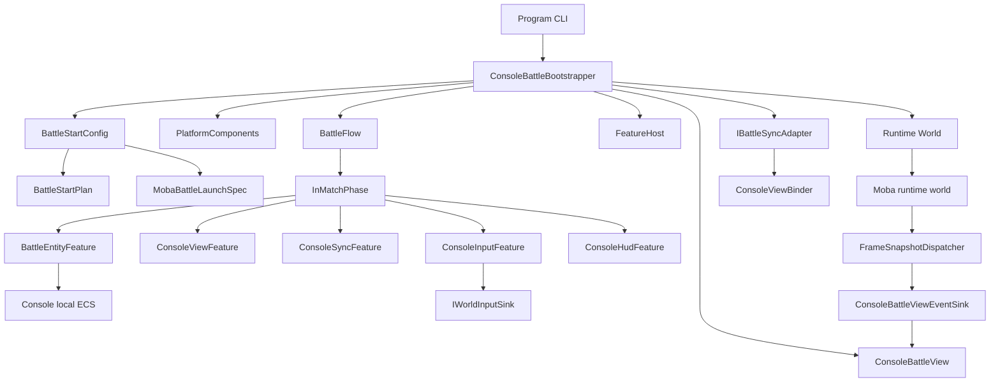

这张图里有两个容易混淆的“世界”：

| 世界 | 创建位置 | 用途 |
|------|----------|------|
| Console 本地 ECS | `BattleEntityFeature.OnAttachToContext` | 让 Console InMatch 阶段能生成和查询演示实体 |
| MOBA runtime world | `ConsoleBattleBootstrapper.CreateRuntimeWorld` | 通过 `WorldManager`、`MobaWorldBootstrapModule`、`MobaEntitasContextsFactory` 启动共享 MOBA 运行时 |

设计上这样拆，是为了让 Console 壳既能展示轻量本地实体，也能接入正式 MOBA runtime 的服务、快照和输入端口。

---

## 4. 启动流程

`Program.Main` 做的事情很少：设置输出编码、解析 CLI 参数、构造 `ConsoleBattleBootstrapper`，然后按模式进入测试、录制、回放或技能测试。

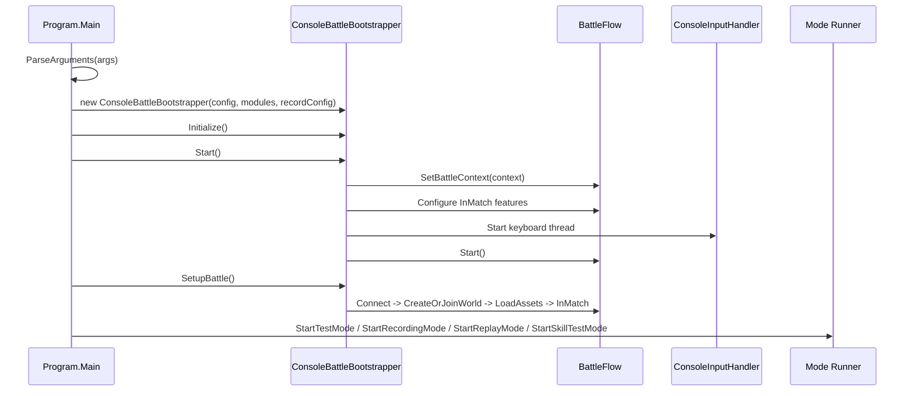

实际源码不是旧文档里的 `ConsoleBattleBootstrapper.Run()`，也没有在这里直接通过 `WorldHostBuilder.Create()` 启动 Host。当前 Demo 的组合根是 `ConsoleBattleBootstrapper`，runtime world 的创建被封装在 `CreateRuntimeWorld()` 内部。

---

## 5. Bootstrapper 做了什么

`ConsoleBattleBootstrapper` 的构造函数一次性准备 Demo 的平台对象、上下文、视图、Feature、输入线程、同步适配器和共享表现组件。

核心装配可以按下表理解：

| 装配对象 | 来源 | 设计意图 |
|----------|------|----------|
| `PlatformComponents` | Console 平台层 | 把输入、渲染、日志等平台能力集中起来 |
| `ConsoleBattleContext` | Bootstrapper 创建 | 承载帧号、逻辑时间、本地玩家、HUD 输入、ECS、Plan、Hooks |
| `BattleFlow` | Bootstrapper 创建 | 统一阶段切换，避免入口代码直接操作战斗内部状态 |
| `ConsoleBattleView` | Bootstrapper 创建 | 无 Unity 表现面，验证 View Sink 是否可跨端 |
| `ConsoleViewFeature` | FeatureHost 管理 | 进入 InMatch 后启动 view 生命周期 |
| `ConsoleSyncFeature` | FeatureHost 管理 | 输出同步诊断，实现 `IFrameSyncController` 的 Console 版本 |
| `ConsoleInputFeature` | FeatureHost 管理 | 把 HUD 输入转为 `PlayerInputCommand` |
| `ConsoleHudFeature` | FeatureHost 管理 | 维护 Console HUD 显示和输入辅助状态 |
| `ConsoleInputHandler` | 独立线程 | 从键盘事件写入 HUD 状态 |
| `IBattleSyncAdapter` | `SyncAdapterFactory` | 根据配置选择 Lockstep、SnapshotAuthority 或 Hybrid |
| `ConsoleViewBinder` | Bootstrapper 创建 | 用同步快照驱动 Console actor 表现插值/同步 |

---

## 6. 配置到运行时世界

Console 配置不是只给 UI 使用。`BattleStartConfig` 会生成两类运行时对象：

| 输出 | 用途 |
|------|------|
| `BattleStartPlan` | 给 Console 上下文和阶段流使用，例如 tick rate、sync mode、player count、record/replay 开关 |
| `MobaBattleLaunchSpec` | 给共享 MOBA runtime 使用，例如 battle id、world type、local player、map、玩法、随机种子、同步模式、玩家 loadout |

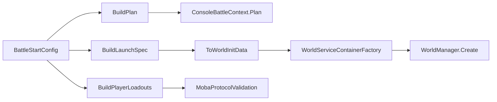

`BuildPlayerLoadouts()` 会校验每个玩家配置，并把 Console 默认玩家转换成 `MobaPlayerLoadout`。默认配置包含 3 个玩家和 3 个 AI，用固定出生点、英雄、属性模板和技能 ID 组成一个可重复的本地战斗场景。

`CreateRuntimeWorld()` 的关键路径是：

1. 调用 `MobaBootstrapFlowModule.EnsureInitialized()` 初始化 MOBA bootstrap。
2. 用 `BuildLaunchSpec()` 得到 world id、world type、玩家、同步模式等启动参数。
3. 注册 `WorldTypeRegistry` 和 `RegistryWorldFactory`。
4. 用 `WorldServiceContainerFactory.CreateWithAttributes()` 扫描 AbilityKit 相关程序集。
5. 注册 Console 配置模块、MOBA 配置库、`IFrameTime`、`ICollisionService`。
6. 添加 `MobaWorldBootstrapModule`，并设置 `MobaEntitasContextsFactory`。
7. 调用 `WorldManager.Create(options)` 创建 runtime world。

这说明 Console Demo 并不是绕开框架，而是在无 Unity 环境中复用正式世界创建管线。

---

## 7. 阶段流与 InMatch 初始化

`BattleFlow` 注册了完整阶段：

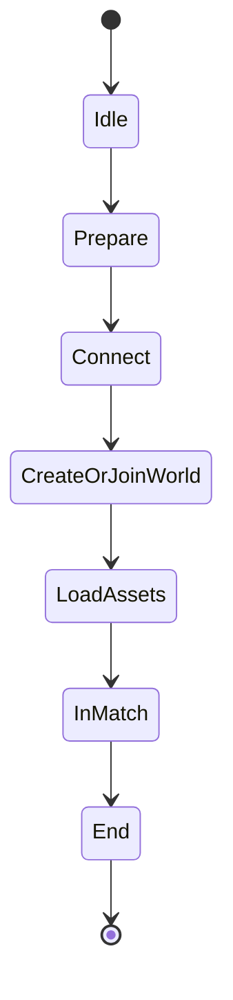

`SetupBattle()` 会直接按顺序切到 `InMatch`：

```text
Connect -> CreateOrJoinWorld -> LoadAssets -> InMatch
```

进入 `InMatchPhase` 后，初始化不是一次性完成，而是四个步骤逐 tick 推进：

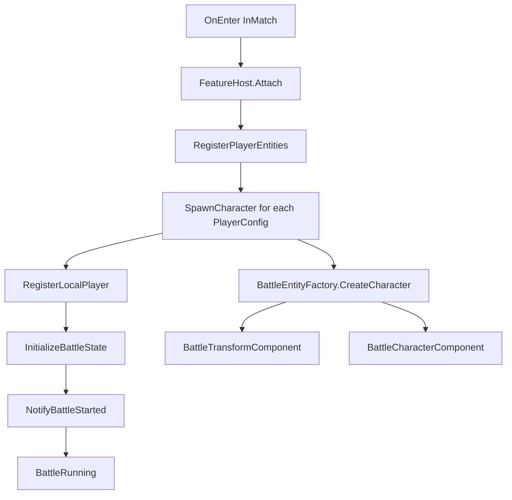

这几个步骤对应源码里的真实行为：

| 步骤 | 行为 |
|------|------|
| `RegisterPlayerEntities` | 遍历 `BattleStartConfig.Players`，为每个玩家生成角色实体 |
| `RegisterLocalPlayer` | 默认取第一个玩家，用 `DeterministicHash.StringToActorId` 写入 `LocalActorId` |
| `InitializeBattleState` | 将 `ConsoleBattleContext.State` 改成 `InMatch`，设置 `IsInitialized` |
| `NotifyBattleStarted` | 输出战斗开始日志并触发 `BattleStarted` 事件 |

新手阅读时要注意：`BattleEntityFeature` 必须最先加入 FeatureHost，因为后续 `SpawnCharacter()` 依赖它注入的 `EntityFactory` 和 `EntityQuery`。

---

## 8. FeatureHost 的角色

Console Demo 把战斗内能力拆成多个 Feature，由 `InMatchPhase` 管理 attach、tick、detach。

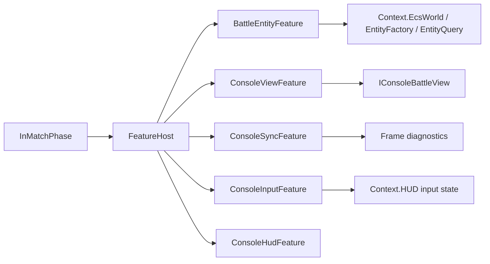

这个设计解决了一个常见问题：如果入口代码直接持有所有系统，阶段切换、重启、自动测试替换输入都会变得混乱。FeatureHost 让 InMatch 阶段只关心“挂哪些能力”，具体能力自己处理 attach/tick/detach。

---

## 9. 输入链路

Console 输入分成两段：

1. 键盘线程只负责把按键写成 HUD 状态。
2. `ConsoleInputFeature.Tick()` 在战斗帧里读取 HUD 状态，生成同步命令。

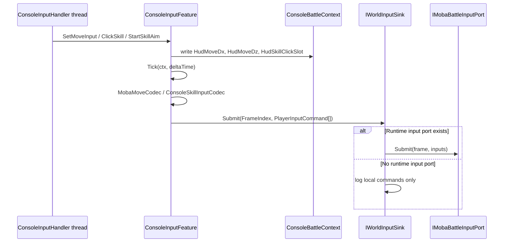

移动输入使用 JSON 文本 payload：

```csharp
public static byte[] Serialize(float dx, float dz)
{
    return System.Text.Encoding.UTF8.GetBytes($"{{\"dx\":{dx:F4},\"dz\":{dz:F4}}}");
}
```

技能输入使用共享二进制编码：

```csharp
var evt = new SkillInputEvent(slot, phase, aimPos: in aimPos);
return BinaryObjectCodec.Encode(evt);
```

这里的关键点是 `PlayerInputCommand` 只带 `FrameIndex`、玩家 ID、`OpCode` 和 payload。输入语义不在框架层硬编码，而由 MOBA 协议和 Demo 编码器解释。

---

## 10. 同步适配器

`SyncAdapterFactory` 根据 `BattleStartConfig.SyncMode` 创建不同适配器：

| SyncMode | 适配器 | 用途 |
|----------|--------|------|
| `Lockstep` | `FrameSyncAdapter` | 本地帧同步模式，镜像 context 的帧号和逻辑时间 |
| `SnapshotAuthority` | `StateSyncAdapter` | 快照权威模式，供状态同步路径使用 |
| `Hybrid` | `HybridSyncAdapter` | 混合预测/校正模式 |

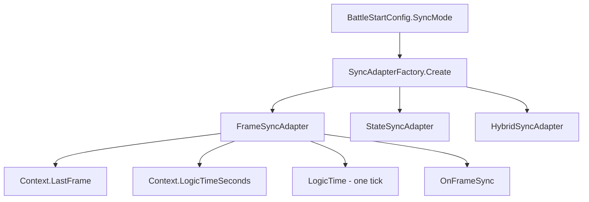

`FrameSyncAdapter.Tick()` 不会像旧文档描述的那样调用 `WaitForInputs()` 或 `ProcessLogicFrame()`。当前实现的职责更窄：

1. 如果未初始化或未连接，则跳过。
2. 从 `ConsoleBattleContext.LastFrame` 读取当前帧。
3. 从 `ConsoleBattleContext.LogicTimeSeconds` 读取逻辑时间。
4. 将 render time 设置为逻辑时间滞后一帧，用于表现插值。
5. 定期输出同步诊断。
6. 触发 `OnFrameSync` 事件。

真正推进帧号的是 `ConsoleBattleBootstrapper.Tick()`，不是同步适配器内部的私有循环。

---

## 11. 每帧 Tick 顺序

当前 Console Demo 的主循环在 `Program.GameLoop()` 中按约 33ms 调用一次 `ConsoleBattleBootstrapper.Tick(0.033f)`。Bootstrapper 内部顺序如下：

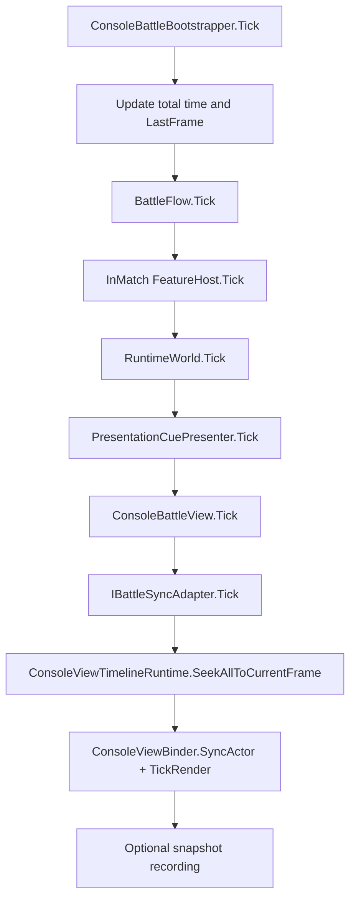

和旧占位文档相比，当前真实顺序有三个重要差异：

| 旧理解 | 当前源码 |
|--------|----------|
| 同步适配器等待输入后推进逻辑帧 | Bootstrapper 先推进 context 帧号和时间，再 tick 阶段、runtime world、view、sync |
| 快照由伪 `_snapshotDispatcher.Publish()` 发布 | 共享快照通过 `FrameSnapshotDispatcher` 订阅 OpCode 后进入 `ConsoleBattleViewEventSink` |
| Demo 只验证帧同步 | Demo 同时覆盖输入、同步适配、runtime world、表现事件、自动测试和回放 |

---

## 12. 表现链路

Console 表现有两条输入来源：

| 来源 | 目标 | 说明 |
|------|------|------|
| `ConsoleViewFeature.Tick()` | `ConsoleBattleView.Tick()` | 每帧更新浮字、投射物、区域效果等本地表现状态 |
| Share 快照/事件 | `ConsoleBattleViewEventSink` | 把 EnterGame、ActorSpawn、Transform、Projectile、Area、Damage、PresentationCue 等事件翻译成 Console view 调用 |

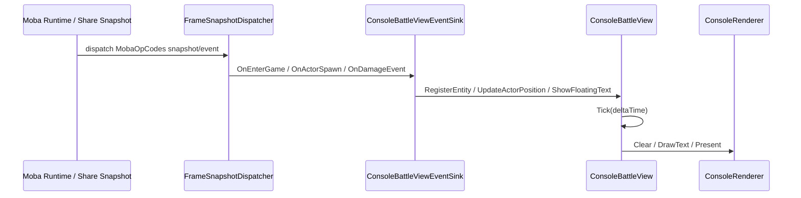

`ConsoleBattleView.Render()` 会把区域、投射物、实体名、实体符号、血条、浮字、VFX 都画到 Console renderer。这样可以在无 Unity 的环境里验证表现事件是否完整、顺序是否合理、字段是否足够。

---

## 13. 自动测试模式

默认测试模式不是手工打键盘，而是 `AutoTestRunner` 替换输入并运行共享脚本。

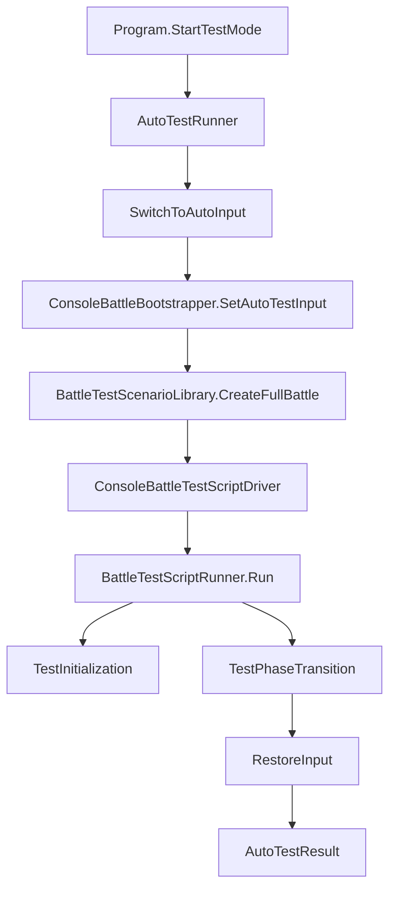

自动测试至少验证：

| 验收点 | 检查内容 |
|--------|----------|
| 初始化 | Bootstrapper、Flow、Context、EcsWorld、BattleView 是否存在 |
| 阶段切换 | `TransitionTo("InMatch")` 后当前阶段是否为 `InMatch` |
| 脚本执行 | 共享 `BattleTestScriptRunner` 是否完成脚本 tick |

设计意图是让 Console Demo 既能人工调试，也能作为 CI/本地回归的轻量入口。

---

## 14. 录制与回放

`Program` 支持四类 CLI 模式：

| 参数 | 行为 |
|------|------|
| `--record` / `-r` | 录制输入和周期性快照 |
| `--replay` / `--play` / `-p` | 加载回放文件并播放 |
| `--test` / `-t` | 运行自动测试 |
| `--skill` | 运行技能测试模式 |

录制模式在循环里读取 `ConsoleBattleContext`：

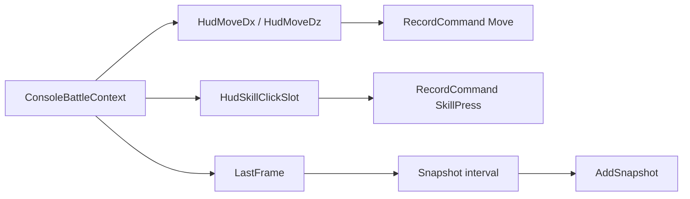

这说明 Console Demo 的回放不是抽象功能截图，而是围绕帧号、输入命令和 actor 快照建立的验收工具。

---

## 15. 设计意图

### 15.1 把 Unity 从战斗验证路径中拿掉

很多战斗框架的问题不在渲染，而在输入、配置、时序、生命周期和状态同步。Console Demo 把这些路径放到纯 .NET 环境，降低调试成本，也让测试不依赖 Unity Editor。

### 15.2 用适配器隔离平台差异

键盘输入、Console 渲染、ViewSink、SyncAdapter 都是适配器。共享 MOBA runtime 不需要知道它运行在 Unity、Console 还是 ET 外壳里。

### 15.3 让 Demo 也走正式启动管线

`CreateRuntimeWorld()` 仍然使用 `WorldManager`、服务容器、模块、Entitas factory 和 world init data。这避免 Demo 走一套“假启动”，导致文档和真实工程脱节。

### 15.4 把可替换点放在阶段和 Feature 层

自动测试可以替换输入，InMatch 可以挂载不同 Feature，同步模式可以替换 adapter。这些替换不需要改 `Program.Main`，也不需要破坏 runtime world。

---

## 16. 新手阅读路线

建议按下面顺序读源码：

1. 先读 `Program.Main`，理解 CLI 模式和 Demo 生命周期。
2. 再读 `ConsoleBattleBootstrapper` 构造函数、`Start()`、`SetupBattle()`、`Tick()`。
3. 读 `BattleStartConfig.BuildPlan()` 和 `BuildLaunchSpec()`，理解配置如何进入 runtime。
4. 读 `BattleFlow` 和 `InMatchPhase`，理解阶段流和四步初始化。
5. 读 `BattleEntityFeature` 和 `BattleEntityFactory`，理解 Console 本地 ECS 如何产生角色实体。
6. 读 `ConsoleInputHandler`、`ConsoleInputFeature`、`DirectCallInputSink`，理解输入从按键到 `PlayerInputCommand` 的路径。
7. 读 `SyncAdapterFactory` 和 `FrameSyncAdapter`，理解同步适配器在 Console 中的职责边界。
8. 读 `ConsoleBattleViewEventSink` 和 `ConsoleBattleView`，理解共享事件如何驱动 Console 表现。
9. 最后读 `AutoTestRunner`，理解 Demo 如何变成自动化验收入口。

---

## 17. 常见误区

| 误区 | 正确认知 |
|------|----------|
| Console Demo 只是打印日志 | 它会创建阶段流、本地 ECS、runtime world、输入链路、同步适配器和表现事件 sink |
| `ConsoleBattleBootstrapper.Run()` 是启动入口 | 当前源码没有这个方法，启动由 `Program.Main` 调用 `Initialize()`、`Start()`、`SetupBattle()` 完成 |
| 帧循环由同步适配器推进 | 当前帧号和逻辑时间在 `ConsoleBattleBootstrapper.Tick()` 中推进，`FrameSyncAdapter` 主要镜像和广播同步状态 |
| 输入线程直接提交命令到世界 | 键盘线程只写 HUD 状态，提交发生在 `ConsoleInputFeature.Tick()` |
| `DirectCallInputSink` 等于正式输入端口 | 它是 runtime input port 不存在时的本地 fallback；有 `IMobaBattleInputPort` 时会使用 `RuntimePortInputSink` |
| Console 本地 ECS 和 MOBA runtime world 是同一个对象 | 它们是两条路径：前者服务 Console 演示实体，后者服务共享 MOBA runtime |
| View 事件只能在 Unity 表现 | `ConsoleBattleViewEventSink` 证明 Share 层事件可以适配到 Console 表现面 |

---

## 18. 和其他文档的关系

| 文档 | 关系 |
|------|------|
| `../03-MOBA%20Demo%20Analysis.md` | 从 MOBA runtime/share/view 总览看 Demo 的共享逻辑来源 |
| `../MOBA/01-WorldAndBootstrap.md` | 深入理解 `MobaWorldBootstrapModule` 和 runtime world 创建 |
| `../MOBA/04-SnapshotPresentationPrediction.md` | 深入理解快照、表现层和预测/回滚链路 |
| `../../04-PresentationLayerDesign/03-CrossPlatform.md` | 横向比较 Unity、Console、ET 的表现接入方式 |
| `../../07-NetworkSynchronization/01-FrameSync.md` | 深入理解 `FrameIndex`、`PlayerInputCommand`、`IWorldInputSink` 和 Host/Orleans 帧同步 |
| `../../10-EngineeringQuality/01-TestingWorkflow.md` | 从工程质量角度理解 Console 自动测试入口 |

---

*文档版本：v2.0 | 最后更新：2026-07-03*
