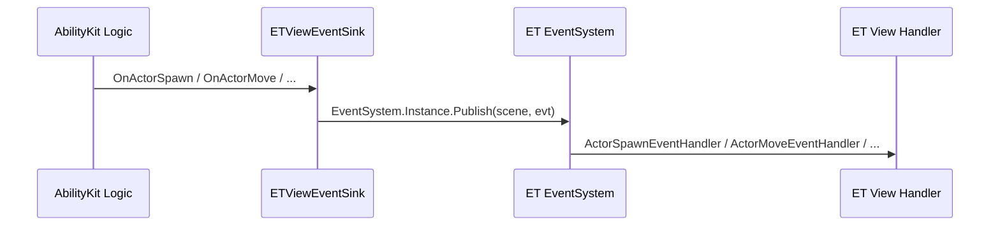
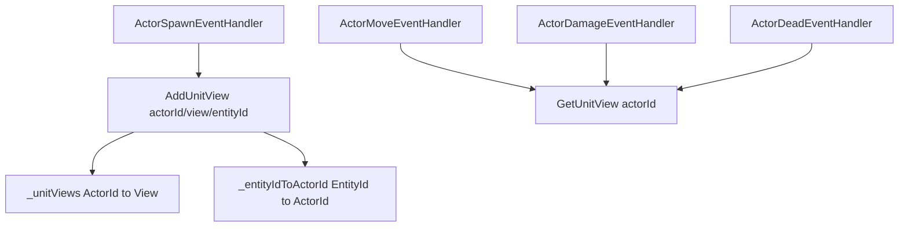
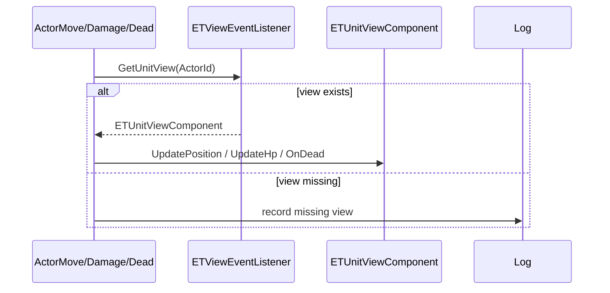

# 9.2 ET Demo 解析

> 本文说明 AbilityKit 的 ET 示例如何把逻辑层事件桥接到 ET 热更/视图层，以及 ActorId 与 ET EntityId 的双标识映射方式。

---

## 目录

- [9.2 ET Demo 解析](#92-et-demo-解析)
  - [目录](#目录)
  - [1. 示例定位](#1-示例定位)
  - [2. 源码入口](#2-源码入口)
  - [3. 逻辑层到视图层的事件桥](#3-逻辑层到视图层的事件桥)
  - [4. 双字典视图索引设计](#4-双字典视图索引设计)
  - [5. 典型事件处理流程](#5-典型事件处理流程)
    - [5.1 Spawn](#51-spawn)
    - [5.2 Move / Damage / Dead](#52-move--damage--dead)
  - [6. 设计约束与扩展点](#6-设计约束与扩展点)
    - [6.1 约束](#61-约束)
    - [6.2 扩展点](#62-扩展点)
  - [下一步](#下一步)

---

## 1. 示例定位

ET Demo 的意义不是“再造一个 ET 项目”，而是展示 AbilityKit 逻辑层能力如何接入 ET 的热更/视图体系：

| 目标 | 说明 |
|------|------|
| 逻辑层解耦 | AbilityKit 逻辑层只认识业务事件，不直接操作视图对象 |
| 视图桥接 | ET View 侧负责接收事件并更新实体表现 |
| 双标识映射 | 用 `ActorId` 作为业务主键，用 `ET Entity.Id` 作为 ET 内部标识 |
| 热更落地 | ET 的事件系统、组件和视图实体用于表现接入 |

---

## 2. 源码入口

| 类型 | 源码 | 说明 |
|------|------|------|
| 视图事件 Sink 接口 | `src/AbilityKit.Demo.ET.Share/Interface/IETViewEventSink.cs` | 逻辑层对视图层的事件接口 |
| 视图事件 Sink 实现 | `src/AbilityKit.Demo.ET.Logic/Model/Presentation/Sinks/ETViewEventSink.cs` | 发布 ET 事件 |
| 视图监听器 | `src/AbilityKit.Demo.ET.View/Model/Unit/ViewComponents/ETViewEventListener.cs` | ActorId/EntityId 映射表 |
| Spawn 处理器 | `src/AbilityKit.Demo.ET.View/Hotfix/Battle/ActorSpawnEventHandler.cs` | 创建视图实体 |
| Move 处理器 | `src/AbilityKit.Demo.ET.View/Hotfix/Battle/ActorMoveEventHandler.cs` | 更新位置与旋转 |
| Damage 处理器 | `src/AbilityKit.Demo.ET.View/Hotfix/Battle/ActorDamageEventHandler.cs` | 更新血量并展示伤害 |
| Dead 处理器 | `src/AbilityKit.Demo.ET.View/Hotfix/Battle/ActorDeadEventHandler.cs` | 处理死亡表现 |

---

## 3. 逻辑层到视图层的事件桥

`IETViewEventSink` 定义了一组视图相关事件：单位事件、技能事件、特效事件、战斗事件和帧同步事件。`ETViewEventSink` 的实现非常薄，只做一件事：把 AbilityKit 事件发布到 ET 的 `EventSystem` 中。

这种桥接原则是：逻辑层只发事件，视图层自己决定如何渲染。

---

## 4. 双字典视图索引设计

`ETViewEventListener` 维护两张表：

| 字典 | Key | Value | 作用 |
|------|-----|-------|------|
| `_unitViews` | `ActorId` | `ETUnitViewComponent` | 业务事件直接查找视图 |
| `_entityIdToActorId` | `ET EntityId` | `ActorId` | ET 内部用 EntityId 反查业务主键 |

这样做的好处：

- 逻辑层始终使用业务主键 `ActorId`。
- ET 内部生成的 `Entity.Id` 不会污染业务层模型。
- Spawn 时可以同时记录两个 ID 的映射。
- 移除时可按 ActorId 清理视图和映射。

---

## 5. 典型事件处理流程

### 5.1 Spawn

`ActorSpawnEventHandler` 会：

1. `scene.AddChild<ETUnitViewEntity>()` 创建 ET 视图实体。
2. 获取或创建 `ETViewEventListener`。
3. 构造 `ETUnitViewComponent`，把 `UnitId` 设为 ET `Entity.Id`，把 `MobaActorId` 设为业务 `ActorId`。
4. 调用 `listener.AddUnitView(args.ActorId, view, entity.Id)`。

### 5.2 Move / Damage / Dead

这些事件处理器都遵循相同模式：

1. 找到 `ETViewEventListener`。
2. 按 `ActorId` 取出 `ETUnitViewComponent`。
3. 调用对应视图方法更新表现。
4. 如果找不到视图，则输出日志而不是抛异常。

---

## 6. 设计约束与扩展点

### 6.1 约束

- 视图层不应反向修改逻辑层状态。
- `ActorId` 必须是逻辑层稳定主键。
- `ET Entity.Id` 只用于 ET 内部标识，不应泄漏到业务协议。
- 事件处理器应容忍视图缺失，避免因为加载时序导致硬崩。

### 6.2 扩展点

| 扩展点 | 说明 |
|--------|------|
| 更多事件 | 可扩展 Attribute / Skill / Vfx / Text 等处理器 |
| 更细粒度映射 | 可增加从 EntityId 到更多业务元信息的索引 |
| 视图同步策略 | 可把移动、伤害、死亡拆成更细的表现管线 |
| ET 热更能力 | 可继续把逻辑与表现拆为更多热更模块 |

---

## 下一步

- [Console Demo 解析](./01-ConsoleDemoAnalysis.md)
- [MOBA Demo 解析](./03-MOBA%20Demo%20Analysis.md)
- [Shooter Demo 与 Orleans Smoke](./04-Shooter%20Demo%20与%20Orleans%20Smoke.md)

---

*文档版本：v1.0 | 最后更新：2026-06-23*
