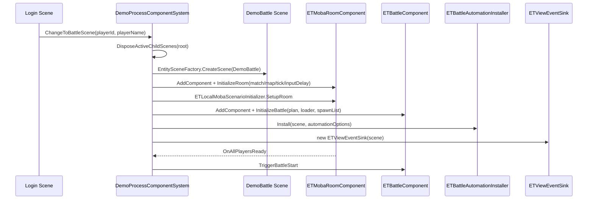
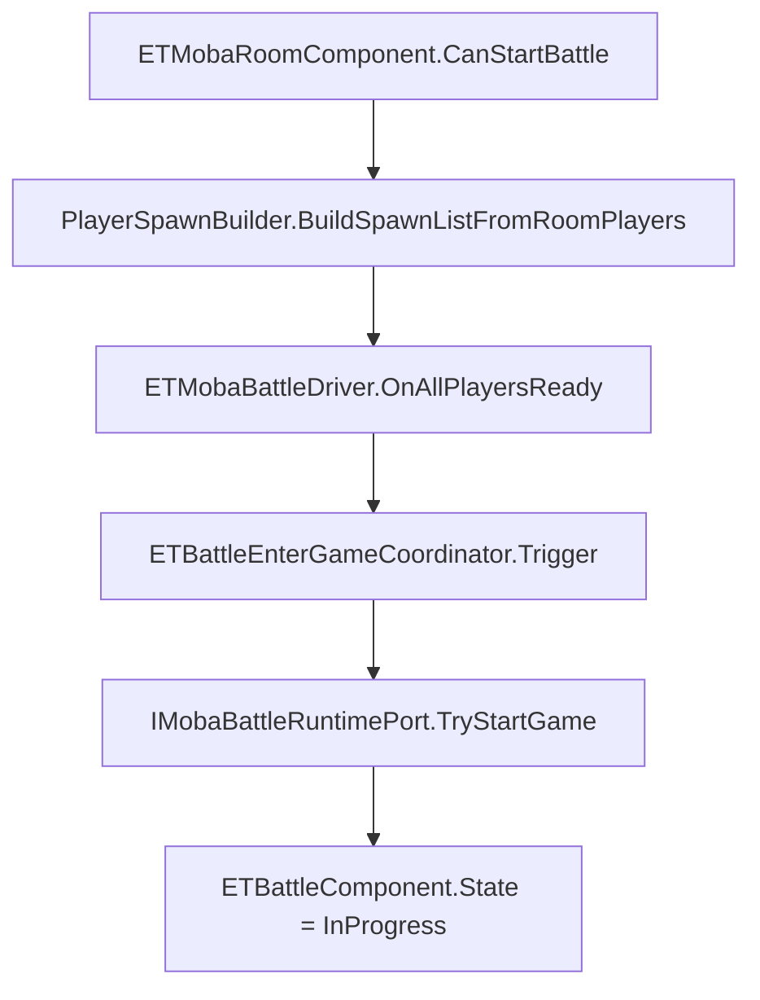
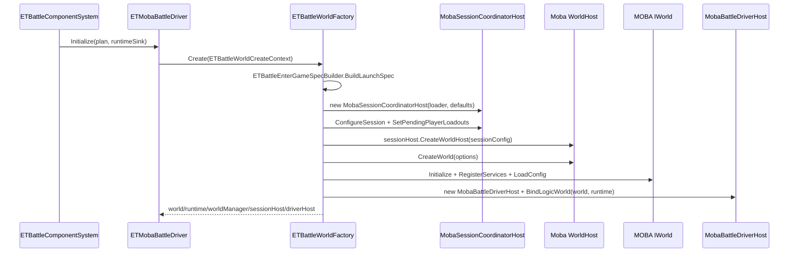
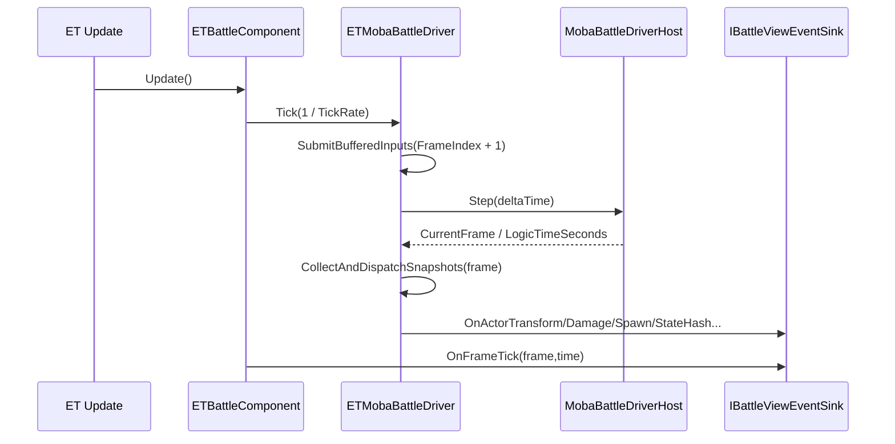
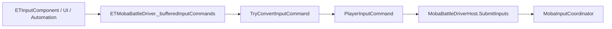
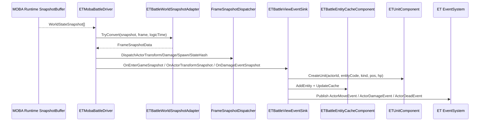
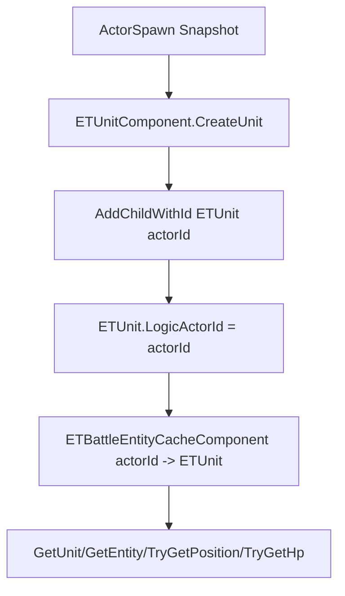
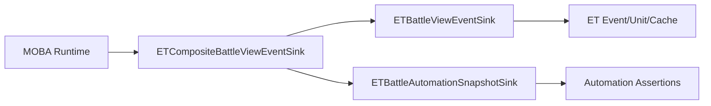
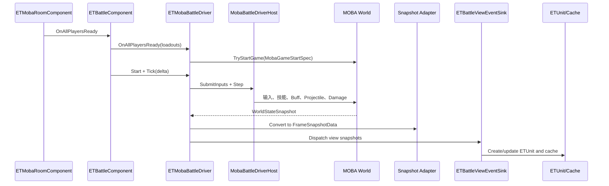

# 9.2 ET Demo 解析

> 本文从当前源码出发说明 ET Demo 如何把 AbilityKit MOBA Runtime 接入 ET 的 Scene、Component、System、Event 与热更侧表现模型。它不是一个独立 ET 框架复刻，而是一个“ET 宿主 + AbilityKit 战斗逻辑世界 + MOBA 快照表现”的接入样板。

---

## 1. 示例定位

ET Demo 解决的问题是：已有项目如果使用 ET 作为场景、实体、热更和事件体系，如何复用 AbilityKit 的战斗逻辑、配置、输入、快照与 MOBA 示例能力。

| 目标 | 源码落点 | 说明 |
|------|----------|------|
| ET 场景流转 | `DemoProcessComponentSystem` | 从登录流程切到 `DemoBattle` Scene，创建房间和战斗组件 |
| 本地房间准备 | `ETMobaRoomComponent` / `ETLocalMobaScenarioInitializer` | 构造 match、玩家、出生布局、ready/start 条件 |
| 战斗组件生命周期 | `ETBattleComponentSystem` | 安装 ET 侧组件、创建 battle host、驱动 Tick、结束销毁 |
| AbilityKit 世界创建 | `ETBattleWorldFactory` | 通过 `MobaSessionCoordinatorHost` 创建 MOBA battle world 和 `MobaBattleDriverHost` |
| 开局规格转换 | `ETBattleEnterGameSpecBuilder` | 把 ET 房间玩家出生数据转为 `MobaBattleLaunchSpec` / `MobaGameStartSpec` |
| 输入桥接 | `ETMobaBattleDriver` | 把 ET `MoveCommand` / `SkillCommand` / `StopCommand` 转为 `PlayerInputCommand` |
| 快照分发 | `ETMobaBattleDriver` / `FrameSnapshotDispatcher` | 从运行时收集 `WorldStateSnapshot`，转为 `FrameSnapshotData` 后派发 |
| ET 表现缓存 | `ETBattleViewEventSink` / `ETBattleEntityCacheComponent` / `ETUnitComponent` | 创建 ETUnit、缓存 Actor 状态、发布 Move/Damage/Dead 事件 |
| 自动化验收 | `ETBattleAutomationInstaller` / `ETBattleAutomationSnapshotSink` | 在 ET 场景内接入可选自动化与快照观测 |

ET 接入链路与 [MOBA Demo 解析](./03-MOBA%20Demo%20Analysis.md) 共享战斗域能力，本文重点放在 ET 宿主、场景组件、输入桥接和快照表现边界。

---

## 2. 源码入口

| 模块 | 源码 | 作用 |
|------|------|------|
| 流程切场景 | `src/AbilityKit.Demo.ET.Logic/Hotfix/Systems/Process/DemoProcessComponentSystem.cs` | 登录后创建 `DemoBattle` Scene、房间、战斗组件与自动化 |
| 战斗组件系统 | `src/AbilityKit.Demo.ET.Logic/Hotfix/Systems/Battle/ETBattleComponentSystem.cs` | `Awake/Update/Destroy`、初始化、Start/End、帧推进 |
| 战斗宿主 | `src/AbilityKit.Demo.ET.Logic/Model/Driver/ETMobaBattleDriver.cs` | ET 侧 facade，持有 AbilityKit world/runtime/driverHost |
| 世界工厂 | `src/AbilityKit.Demo.ET.Logic/Model/Driver/World/ETBattleWorldFactory.cs` | 装配 `MobaSessionCoordinatorHost`、world、HostRuntime、driverHost |
| 开局协调 | `src/AbilityKit.Demo.ET.Logic/Model/Driver/ETBattleEnterGameCoordinator.cs` | 调用 `IMobaBattleRuntimePort.TryStartGame` |
| 开局规格 Builder | `src/AbilityKit.Demo.ET.Logic/Model/Driver/EnterGame/ETBattleEnterGameSpecBuilder.cs` | 校验 `BattleStartPlan` 和玩家 loadout，生成 canonical launch spec |
| View Sink | `src/AbilityKit.Demo.ET.Logic/Model/Presentation/Sinks/ETBattleViewEventSink.cs` | 把快照转换为 ETUnit 创建、缓存更新和 ET EventSystem 事件 |
| 实体缓存 | `src/AbilityKit.Demo.ET.Logic/Model/Presentation/Cache/ETBattleEntityCacheComponent.cs` | `actorId -> ETUnit` 缓存，记录帧、位置、HP |
| 缓存系统 | `src/AbilityKit.Demo.ET.Logic/Hotfix/Systems/Presentation/Cache/ETBattleEntityCacheComponentSystem.cs` | 按 transform/damage snapshot 更新 ETUnit 数据 |
| 单位组件 | `src/AbilityKit.Demo.ET.Logic/Model/Presentation/Units/ETUnitComponent.cs` | ET Scene 下的单位管理组件 |
| 单位系统 | `src/AbilityKit.Demo.ET.Logic/Hotfix/Systems/Presentation/Units/ETUnitComponentSystem.cs` | 使用 `AddChildWithId<ETUnit>(actorId)` 创建和查询单位 |

---

## 3. 从登录到战斗场景

`DemoProcessComponentSystem.ChangeToBattleScene` 是 ET Demo 的真实入口。它不是直接 new 一个战斗世界，而是先按 ET 习惯创建一个 `DemoBattle` 子场景，再在场景上挂房间、战斗、输入、单位、缓存等组件。

这条链路的设计意图是把“ET 流程控制”和“AbilityKit 战斗运行”分开：ET 负责场景切换、组件挂载和事件发布；AbilityKit 负责战斗世界、输入、技能、快照和状态推进。

---

## 4. BattleStartPlan 与房间数据

切入战斗时会创建 `BattleStartPlan`。当前本地 ET 示例使用：

| 字段 | 当前用法 | 说明 |
|------|----------|------|
| `mapId` / `worldId` / `gameplayId` | 来自 `ETLocalMobaScenarioConfig` | 决定 MOBA 世界和玩法配置 |
| `playerId` / `clientId` | 当前登录玩家 | 用于本地玩家身份和输入归属 |
| `syncMode` | `SnapshotAuthority` | 业务计划层表达为快照权威，但世界工厂当前用本地 lockstep host 创建 |
| `hostMode` | `Local` | ET Demo 当前是本地宿主，不走 Gateway Transport |
| `tickRate` | scenario 配置 | `ETBattleComponentSystem.Update` 用固定 delta 驱动 |
| `inputDelayFrames` | scenario 配置 | 传入 MOBA session defaults / launch profile |
| `playerIds` | 当前玩家数组 | 本地示例最小玩家集合 |

房间准备完成后，`TriggerBattleStart` 会重新从房间玩家构造 `ETPlayerSpawnData`，调用 `battleHost.OnAllPlayersReady(playerSpawnList)`。只有 AbilityKit runtime 的 game start 成功后，`ETBattleComponent.StartBattle` 才会进入 `InProgress`。

---

## 5. AbilityKit 世界创建

`ETBattleComponentSystem.InitializeBattle` 会在 ET Scene 上创建 `ETMobaBattleDriver`，并通过 `ETMobaBattleRuntimeDriver` 暴露给组件系统。真正的 AbilityKit 世界创建发生在 `ETMobaBattleDriver.Initialize` 内部。

这里最重要的取舍是：ET Demo 复用 MOBA 示例的正式启动协议，而不是自己临时创建 Actor。`ETBattleEnterGameSpecBuilder` 会强制校验 world、map、gameplay、tick、inputDelay 和玩家 loadout，避免 ET 接入绕过 MOBA runtime 的配置与协议校验。

---

## 6. ET Tick 如何驱动 MOBA 世界

`ETBattleComponentSystem.Update` 只在 `BattleState.InProgress` 时执行。它用 `1f / TickRate` 作为固定 delta 调用 battle driver，然后执行 `AdvanceFrame` 发布帧事件并检查结束条件。

`ETMobaBattleDriver` 自己保存 `CurrentFrame`、`LogicTimeSeconds`、`IsRunning`、`RuntimeGameStarted` 和最近的 Actor/Hash 快照，因此 ET 侧可以用它做调试、UI 和自动化断言。

---

## 7. 输入转换

ET Demo 的输入不是直接写入 MOBA 服务，而是先进入 `ETMobaBattleDriver.SubmitInputCommand` 缓冲，再在下一帧 Tick 前转换成 AbilityKit 帧输入。

| ET 命令 | 转换结果 | Payload |
|---------|----------|---------|
| `MoveCommand` | `PlayerInputCommand(frame, player, MobaOpCodes.Input.Move, payload)` | `MobaMoveCodec.Serialize(dx, dz)` |
| `SkillCommand` | `PlayerInputCommand(frame, player, MobaOpCodes.Input.SkillInput, payload)` | `SkillInputCodec.Serialize(SkillInputEvent)` |
| `StopCommand` | `PlayerInputCommand(frame, player, MobaOpCodes.Input.Stop, null)` | 无 |

这条路径保证 ET 层只需要表达本地业务命令，最终仍然走 AbilityKit 的 `PlayerInputCommand`、OpCode、Codec 和 `IWorldInputSink` 链路。

---

## 8. 快照分发与 ET 表现

`ETMobaBattleDriver` 会从 MOBA runtime 收集 `WorldStateSnapshot`，经 `ETBattleWorldSnapshotAdapter.TryConvert` 转换成 `FrameSnapshotData`。随后它会做两类分发：

1. 分发给 `FrameSnapshotDispatcher`：用于 ET Demo 内部调试、订阅和自动化观测。
2. 分发给 `IBattleViewEventSink`：用于 ET 表现对象创建、缓存更新和事件发布。

当前源码里 `ETBattleViewEventSink` 会在 enter-game 或 actor spawn 快照中创建 ETUnit，在 transform 快照中发布 `ActorMoveEvent`，在 damage 快照中发布 `ActorDamageEvent`，并在 kill 时发布 `ActorDeadEvent`。

---

## 9. ActorId 与 ET Entity.Id

ET Demo 的当前标识策略是 ActorId 与 ET child id 对齐：`ETUnitComponentSystem.CreateUnit` 使用 `AddChildWithId<ETUnit>((long)actorId)`，让 ETUnit 的 ET child id 与 MOBA ActorId 一致，同时保留 `ETUnit.LogicActorId`。

| 标识 | 当前用途 | 设计约束 |
|------|----------|----------|
| `ActorId` | MOBA 逻辑、输入、快照、事件、缓存主键 | 必须稳定，跨逻辑与表现传递 |
| `ETUnit.Id` | ET 子实体 ID | 当前直接使用 `actorId`，便于 `GetChild<ETUnit>(actorId)` |
| `ETUnit.LogicActorId` | 显式保存业务 ActorId | 方便调试与未来恢复双 ID 策略 |
| `ETBattleEntityCacheComponent._entityCache` | `actorId -> ETUnit` | 用于快照更新、位置/HP 查询和表现插值 |

这种实现牺牲了一部分“ET 内部 ID 完全独立”的抽象，但换来了 Demo 里的低成本查找和更少映射错误。项目化接入时，如果 ET EntityId 必须由框架统一分配，可以把 `ETBattleEntityCacheComponent` 扩展为双索引，但不要让协议层依赖 ET EntityId。

---

## 10. 缓存、单位与插值

`ETBattleEntityCacheComponent` 是纯数据缓存，系统负责业务更新。它缓存：

- 当前缓存帧 `CachedFrame`；
- 缓存时间戳 `CacheTimestamp`；
- `actorId -> ETUnit`；
- 位置和 HP 查询能力。

`ETBattleEntityCacheComponentSystem.UpdateCache` 处理两类快照：

| 快照 | 更新内容 |
|------|----------|
| `ActorTransforms` | 调用 `ETUnit.UpdateFromSnapshot(x, y, rotation, frame)` |
| `DamageEvents` | 写入 `ETUnit.Hp = TargetHpAfter`，击杀时置 0 |

`UpdateRenderPositions(interpolationSpeed, deltaTime)` 则统一推进 ETUnit 的渲染位置插值。也就是说，ET Demo 保留了“逻辑坐标”和“渲染坐标”的分层，不要求快照一到就让表现瞬移。

---

## 11. 自动化与验收价值

`ETBattleComponentSystem.InitializeBattle` 会根据 `AutomationOptions` 选择普通 `ETBattleViewEventSink` 或组合 `ETCompositeBattleViewEventSink(viewSink, ETBattleAutomationSnapshotSink)`。这意味着 ET Demo 的表现管线同时可以服务于：

- 人工运行时的 ET 表现；
- 自动化测试中的快照记录；
- 对 enter-game、spawn、transform、damage、state-hash 的断言；
- 本地场景不依赖 Gateway 的快速验证。

---

## 12. 一帧端到端链路

---

## 13. 设计要点与约束

| 主题 | 要点 |
|------|------|
| ET 只做宿主 | Scene、Component、Event、热更表现归 ET；战斗推进仍归 AbilityKit MOBA Runtime |
| 启动协议要正式 | 不要绕过 `MobaBattleLaunchSpec` / `MobaGameStartSpec`，否则配置、玩家 loadout 和协议校验会失效 |
| 输入必须编码成帧命令 | ET 命令最终应转换为 `PlayerInputCommand`，避免表现层直接修改逻辑状态 |
| 快照是表现边界 | ETUnit 和缓存只消费快照，不反向写 runtime 状态 |
| ActorId 是主键 | 当前 ETUnit child id 直接使用 actorId；项目接入可扩展双索引，但协议仍以 ActorId 为准 |
| 自动化复用 View Sink | 通过 composite sink 让表现和验收共用同一份快照分发结果 |

---

## 14. 源码阅读路径

1. `DemoProcessComponentSystem.ChangeToBattleScene`：ET Scene、Room、BattleComponent 的创建入口。
2. `ETBattleComponentSystem.InitializeBattle/Update/StartBattle`：ET 生命周期如何驱动 battle driver。
3. `ETBattleWorldFactory` 与 `ETBattleEnterGameSpecBuilder`：MOBA world 和 game-start spec 如何从 ET 数据生成。
4. `ETMobaBattleDriver.Tick`、`TryConvertInputCommand`、`CollectAndDispatchSnapshots`：输入与快照的双向边界。
5. `ETBattleViewEventSink`、`ETUnitComponentSystem`、`ETBattleEntityCacheComponentSystem`：快照如何落到 ET 表现对象。

---

## 15. 源码索引

| 模块 | 源码 |
|------|------|
| 流程切场景 | `src/AbilityKit.Demo.ET.Logic/Hotfix/Systems/Process/DemoProcessComponentSystem.cs` |
| 战斗组件系统 | `src/AbilityKit.Demo.ET.Logic/Hotfix/Systems/Battle/ETBattleComponentSystem.cs` |
| 战斗宿主 | `src/AbilityKit.Demo.ET.Logic/Model/Driver/ETMobaBattleDriver.cs` |
| 世界工厂 | `src/AbilityKit.Demo.ET.Logic/Model/Driver/World/ETBattleWorldFactory.cs` |
| 开局协调 | `src/AbilityKit.Demo.ET.Logic/Model/Driver/ETBattleEnterGameCoordinator.cs` |
| 开局规格 Builder | `src/AbilityKit.Demo.ET.Logic/Model/Driver/EnterGame/ETBattleEnterGameSpecBuilder.cs` |
| View Sink | `src/AbilityKit.Demo.ET.Logic/Model/Presentation/Sinks/ETBattleViewEventSink.cs` |
| 实体缓存 | `src/AbilityKit.Demo.ET.Logic/Model/Presentation/Cache/ETBattleEntityCacheComponent.cs` |
| 缓存系统 | `src/AbilityKit.Demo.ET.Logic/Hotfix/Systems/Presentation/Cache/ETBattleEntityCacheComponentSystem.cs` |
| 单位组件 | `src/AbilityKit.Demo.ET.Logic/Model/Presentation/Units/ETUnitComponent.cs` |
| 单位系统 | `src/AbilityKit.Demo.ET.Logic/Hotfix/Systems/Presentation/Units/ETUnitComponentSystem.cs` |
| MOBA battle blueprint | `Unity/Packages/com.abilitykit.demo.moba.runtime/Runtime/Worlds/Blueprints/MobaBattleWorldBlueprint.cs` |

---

*文档版本：v2.0 | 最后更新：2026-07-04*
