# MOBA Demo 解析

> 本文从源码出发说明 MOBA 示例如何把 AbilityKit 的逻辑世界、Entitas、配置、技能、Triggering、Buff、Projectile、快照、客户端预测和表现层会话串成一个可运行的战斗样例。

---

## 1. 示例定位

MOBA Demo 不是单一技能演示，而是一个“完整战斗域集成样例”：

| 能力 | 示例落点 | 说明 |
|------|----------|------|
| 逻辑世界 | `MobaBattleWorldBlueprint` | 创建 battle 类型世界，启用 EntitasContexts 与 BattleRuntime |
| 输入接入 | `MobaInputCoordinator` | 把帧输入转换为 MOBA 输入上下文并分发到命令处理器 |
| 技能释放 | `SkillCastCoordinator` | 按技能槽、输入阶段、释放策略驱动技能运行时 |
| 配置门面 | `MobaConfigDatabase` | 对 Luban/DTO/Resources/Bytes 等配置源提供统一访问与热重载通知 |
| 实体索引 | `MobaEntityManager` | 维护 actorId 到 Entitas ActorEntity 的映射和队伍/类型/归属索引 |
| 生成管线 | `MobaActorSpawnService` | 通过 BuildSpec 构造 Actor，并注册到 ActorRegistry 与 EntityManager |
| Buff 生命周期 | `MobaBuffService` | 将 apply/remove 请求收敛成命令队列，统一交给 BuffLifecycleExecutor |
| 投射物 | `MobaProjectileService` | 把技能/配置发射请求转成 ProjectileService 的弹道对象和 MOBA Actor |
| 伤害与治疗 | `MobaDamageService` | 修改属性血量并输出伤害/治疗快照 |
| 状态快照 | `MobaActorTransformSnapshotService` | 从 ActorRegistry 采样位置并编码为 WorldStateSnapshot |
| View 远程驱动 | `RemoteDrivenWorldRuntimeFactory` | 在客户端创建 HostRuntime、本地世界和权威帧来源 |
| 预测/回滚 | `RemoteDrivenRuntimeModuleFactory` | 安装 ClientPredictionDriverModule、ServerFrameTimeModule、WorldAutoStartModule |
| 快照路由 | `FrameSnapshotDispatcher` / `BattleSnapshotPipeline` | 从帧包提取快照，按 OpCode 解码并分发给表现阶段 |

源码入口：

- Runtime：`Unity/Packages/com.abilitykit.demo.moba.runtime/Runtime`
- View Runtime：`Unity/Packages/com.abilitykit.demo.moba.view.runtime/Runtime`
- Battle Blueprint：`Unity/Packages/com.abilitykit.demo.moba.runtime/Runtime/Worlds/Blueprints/MobaBattleWorldBlueprint.cs`
- Bootstrap Module：`Unity/Packages/com.abilitykit.demo.moba.runtime/Runtime/Application/Systems/MobaWorldBootstrapModule.cs`
- 远程驱动工厂：`Unity/Packages/com.abilitykit.demo.moba.view.runtime/Runtime/Game/Battle/Client/Session/Features/Sim/RemoteDrivenWorldRuntimeFactory.cs`
- 测试入口：`src/AbilityKit.Demo.Moba.Tests`

---

## 2. 总体架构

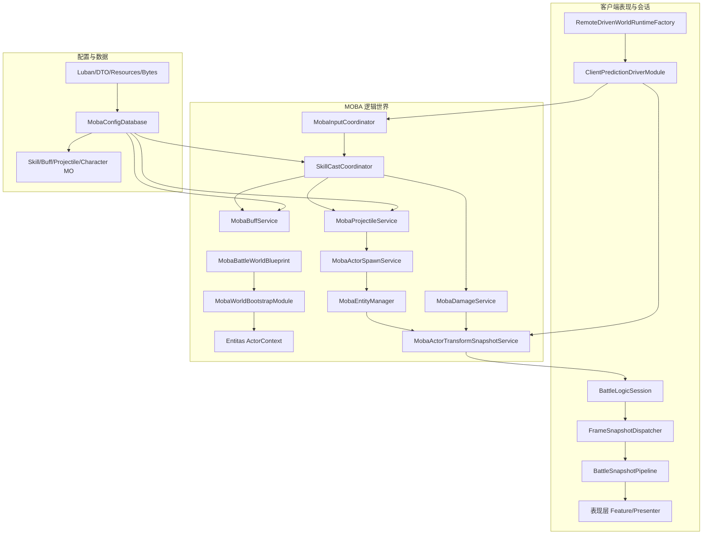

MOBA 示例的核心分层是：

1. **配置层**：`MobaConfigDatabase` 将项目表结构包装为运行时可查询门面。
2. **逻辑世界层**：`MobaBattleWorldBlueprint` 决定世界类型和启用的 Feature；Bootstrap 安装服务与系统。
3. **玩法服务层**：输入、技能、Buff、投射物、伤害、生成、索引都作为 WorldService 注入。
4. **快照层**：逻辑世界把需要给表现层/网络层消费的数据编码成 `WorldStateSnapshot`。
5. **View 会话层**：远程帧、本地输入、客户端预测和快照路由在 View Runtime 中组合。

---

## 3. 战斗世界创建

`MobaBattleWorldBlueprint` 是 MOBA battle 世界的类型声明：

```csharp
public sealed class MobaBattleWorldBlueprint : MobaLogicWorldBlueprintBase
{
    public const string Type = "battle";
    public override string WorldType => Type;
    protected override MobaLogicWorldProfile Profile => MobaLogicWorldProfile.Battle;
    protected override MobaLogicWorldFeatures Features => MobaLogicWorldFeatures.EntitasContexts | MobaLogicWorldFeatures.BattleRuntime;
    protected override void ConfigureModules(WorldCreateOptions options)
    {
        EnsureModule(options, () => new MobaWorldBootstrapModule());
    }
}
```

这个 Blueprint 的设计含义：

- `WorldType = "battle"`：让 Host/WorldManager 能按类型创建 MOBA 战斗世界。
- `MobaLogicWorldProfile.Battle`：选择战斗运行 Profile。
- `EntitasContexts | BattleRuntime`：声明需要 Entitas 上下文和战斗运行时服务。
- `MobaWorldBootstrapModule`：位于 `Runtime/Application/Systems`，负责把 MOBA 的服务、系统、配置接入世界。

`MobaLogicWorldBlueprintBase` 还提供了两个关键保护：

1. `options.ServiceBuilder ??= WorldServiceContainerFactory.CreateDefaultOnly()`，保证没有外部服务容器时也能创建默认 WorldService 容器。
2. 当 Feature 包含 `EntitasContexts` 时，通过 `options.SetEntitasContextsFactory(new MobaEntitasContextsFactory())` 注入 Entitas 上下文工厂。

这让 MOBA battle world 的创建具备“声明式蓝图 + 模块装配”的形态：Blueprint 只描述世界类型和能力集，具体服务、系统、配置加载由 Bootstrap Module 承接。

创建链路：

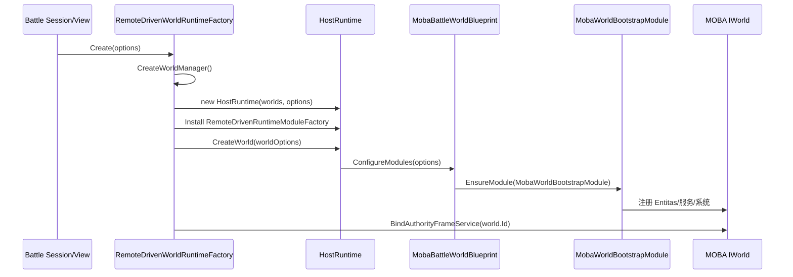

---

## 4. 输入到技能释放

`MobaInputCoordinator` 继承逻辑世界输入协调基类，并实现 `IWorldInputSink`。它的职责不是直接执行所有输入，而是：

1. 等世界服务准备好后绑定命令处理器。
2. 创建带运行阶段、玩家 Actor 映射、实体服务、技能服务的 `MobaInputCommandContext`。
3. 将每个 `PlayerInputCommand` 分发到输入处理器。
4. 对技能输入解析出 `SkillCastCoordinator` 并交给技能释放层。

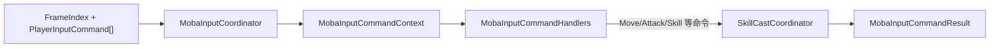

`SkillCastCoordinator` 是技能释放的核心编排器。它面向外部暴露三类入口：

```csharp
public bool CastBySlot(int actorId, int slot);
public MobaSkillCastResult TryCastBySlot(int actorId, int slot);
public bool HandleInput(int actorId, in SkillInputEvent evt);
public MobaSkillInputHandleResult TryHandleInputResult(int actorId, in SkillInputEvent evt);
```

它内部聚合：

- 世界解析器和世界时钟；
- `MobaSkillLoadoutService`：角色技能槽/技能装载；
- `MobaActorLookupService`：Actor 查询；
- `IMobaSkillPipelineLibrary`：技能 Pipeline 查找；
- `SkillCastPreparationService`：释放前校验与准备；
- `SkillRunnerRegistry`：正在运行的技能状态；
- 事件总线、诊断、Tracing。

技能释放的典型流程：

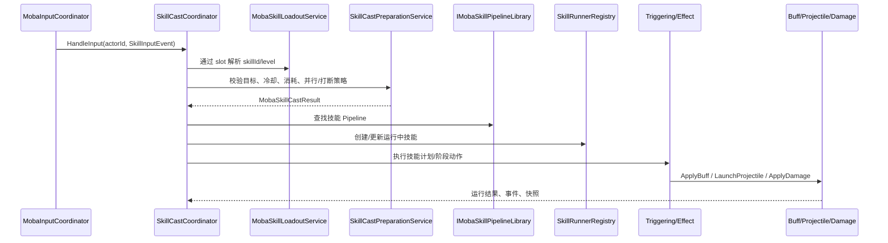

`SkillCastPolicy` 提供并行与打断策略：

```csharp
public readonly struct SkillCastPolicy
{
    public bool AllowParallel { get; }
    public bool InterruptRunning { get; }
}
```

因此 MOBA Demo 展示了 AbilityKit 推荐的技能接入模式：输入层只做命令路由，技能层做释放编排，Triggering/Combat 层执行实际效果。

---

## 5. 配置门面与热重载

`MobaConfigDatabase` 是 MOBA 运行时配置门面。它内部包装通用 `ConfigDatabase`，并注入 MOBA 专用表注册表与 DTO 反序列化器：

```csharp
public sealed class MobaConfigDatabase
{
    private readonly ConfigDatabase _innerDb;
    private readonly IMobaConfigTableRegistry _registry;
    private readonly IMobaConfigDtoDeserializer _deserializer;
    private readonly IMobaConfigDtoBytesDeserializer _bytesDeserializer;
    private readonly ITextAssetLoader _textAssetLoader;

    public long Version => _innerDb.Version;
}
```

它支持多种加载方式：

| 入口 | 用途 |
|------|------|
| `LoadFromTextSink` / `ReloadFromTextSink` | 从文本资源 Sink 加载 |
| `LoadFromResources` | Unity Resources 风格加载 |
| `LoadFromSource` / `ReloadFromSource` | 从通用 ConfigSource 加载 |
| `LoadFromDtoProvider` / `ReloadFromDtoProvider` | 从 DTO Provider 加载 |
| `LoadFromDtoArrays` / `ReloadFromDtoArrays` | 从 DTO 数组批量加载 |
| `LoadFromBytes` / `ReloadFromBytes` | 从二进制资源加载 |

重载成功或失败会通过 `ConfigReloadBus` 发布结果：

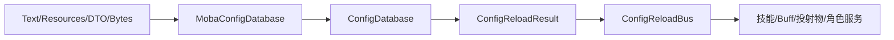

这种设计使 MOBA 示例可以把项目表结构隐藏在门面后面，玩法服务只依赖“拿 Character/Skill/Buff/Projectile/Aoe/Emitter/Summon 等 MO”的能力，而不需要关心配置来自 Luban JSON、Resources 还是二进制包。

---

## 6. Actor 生成与实体索引

### 6.1 `MobaActorSpawnService`

`MobaActorSpawnService` 是所有 Actor 生成的统一入口。请求结构包含 BuildSpec、是否自动分配 ActorId、是否注册 ActorRegistry/EntityManager、PostSetup 和初始化回调：

```csharp
public sealed class MobaActorSpawnRequest
{
    public MobaActorBuildSpec Spec;
    public bool AllocateActorIdIfMissing;
    public bool RegisterActor = true;
    public bool RegisterEntityManager = true;
    public bool RegisterEntityManagerFromEntity = true;
    public MobaActorSpawnPostSetup PostSetup;
    public Action<ActorEntity, MobaActorBuildSpec> Initializer;
    public Action<ActorEntity, MobaActorBuildSpec> OnActorBuilt;
}
```

生成流程：

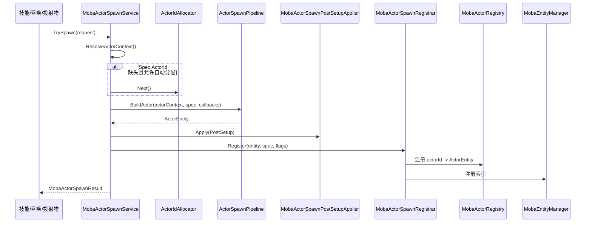

### 6.2 `MobaEntityManager`

`MobaEntityManager` 维护两类索引：

- `_byActorId`：`actorId -> ActorEntity` 的直接查找。
- `BattleEntityManager<int>` 上的多键索引：队伍、主类型、单位子类型、归属玩家。

```csharp
public readonly BattleEntityManager<int> Index;
public readonly KeyedEntityIndex<Team, int> ByTeam;
public readonly KeyedEntityIndex<EntityMainType, int> ByMainType;
public readonly KeyedEntityIndex<UnitSubType, int> ByUnitSubType;
public readonly KeyedEntityIndex<PlayerId, int> ByOwnerPlayer;
```

注册时会发布单位出生事件，反注册时会发布单位消失事件：

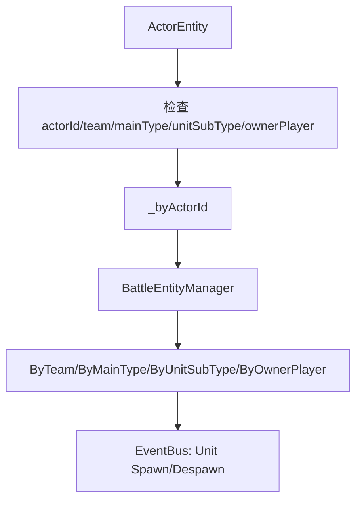

这使技能寻敌、Buff 查询、投射物碰撞过滤、表现层 Actor 映射都能通过统一 ActorId 工作。

---

## 7. Buff 生命周期

`MobaBuffService` 是 Buff 对外入口，但它刻意不直接修改所有运行时细节，而是把请求变成命令队列：

```csharp
private enum BuffCommandKind
{
    Apply = 0,
    Remove = 1,
}
```

对外入口包括：

- `ApplyBuffImmediate(...)`
- `ApplyBuffInstanceImmediate(...)`
- `RemoveBuffImmediate(...)`
- `RemoveBuffInstanceImmediate(...)`
- `RemoveBuffsImmediate(...)`
- `ReconcileActorBuffLifecycles(...)`
- `DrainPending(int maxCommands)`

命令队列的设计重点：

1. 所有立即接口也先入队，再主动 `DrainPending`，保证与延迟命令使用同一条生命周期路径。
2. `_draining` 防止 Buff 效果执行过程中再次申请 Buff 导致递归重入。
3. 实际 apply/remove 交给 `BuffLifecycleExecutor`。
4. 失败通过 diagnostics/exception policy 记录，不让单个 Buff 破坏整帧。

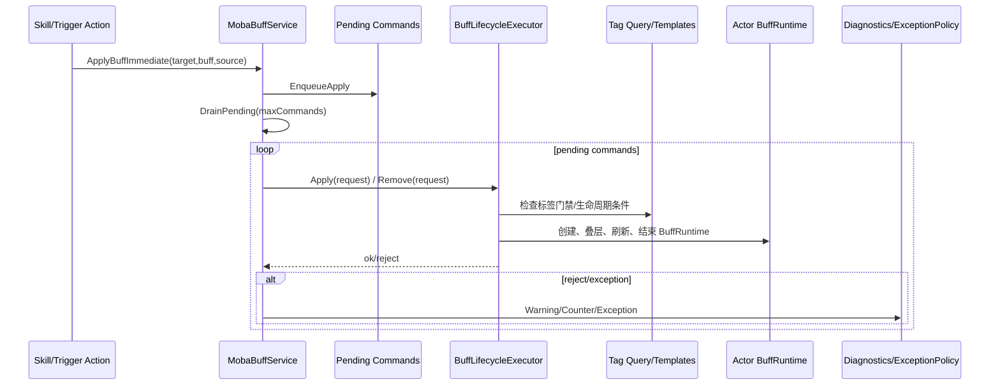

`ReconcileActorBuffLifecycles` 每帧或定期对 Actor 上的 Buff 做生命周期对账：

- 同步 Continuous 行为的剩余时间；
- 检查标签条件是否导致提前结束；
- 对过期或被打断的 Buff 调用生命周期结束逻辑。

---

## 8. 投射物与伤害

### 8.1 投射物服务

`MobaProjectileService` 同时实现 `IMobaProjectileLaunchExecutor` 与 `IMobaProjectileLaunchRuntime`。它负责把 MOBA 配置中的发射器/投射物转换为底层 `IProjectileService` 可理解的 `ProjectileSpawnParams`，同时为表现和同步创建 MOBA Actor。

单发 `Shoot` 的关键步骤：

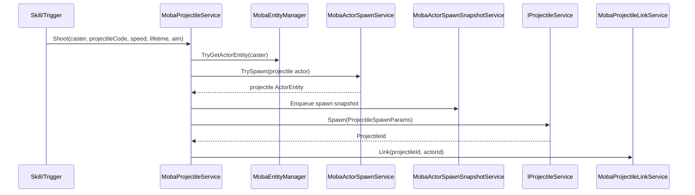

`MobaTeamProjectileHitFilter` 展示了 Demo 的命中策略：

- 不命中自身；
- 默认阻止同队友伤；
- 中立或未分队目标允许命中；
- 通过 `MobaActorRegistry` 从 ColliderId 反查 ActorEntity。

持续发射时，服务会构造 `MobaProjectileLaunchContinuous`，如果世界安装了 `IContinuousManager`，就交由持续行为管理器调度多发/扇形/持续发射。

### 8.2 伤害服务

`MobaDamageService` 是示例中的轻量伤害/治疗入口：

```csharp
public float ApplyDamage(int attackerActorId, int targetActorId, int damageType, float value, int reasonKind = 0, int reasonParam = 0)
public float ApplyHeal(int healerActorId, int targetActorId, int healType, float value, int reasonKind = 0, int reasonParam = 0)
```

它的职责边界很清晰：

1. 使用 `MobaCombatRulesService` 判断能否受伤/治疗。
2. 通过 `MobaActorLookupService` 找到目标 Actor。
3. 修改 `MobaAttrs` 中的 HP。
4. 通过 `MobaDamageEventSnapshotService` 输出伤害或治疗快照。

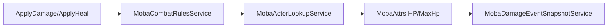

---

## 9. 快照采样与表现层路由

### 9.1 逻辑层快照

`MobaActorTransformSnapshotService` 继承 `LogicWorldSnapshotBufferEmitterBase`，并标记 `[MobaSnapshotEmitter(80)]`。它只在 `MobaLogicWorldRunGateService.InGame` 时发射快照。

采样逻辑：

```csharp
protected override bool TryBuildSnapshot(FrameIndex frame, out WorldStateSnapshot snapshot)
{
    BuildEntries();
    if (Count == 0)
    {
        snapshot = default;
        return false;
    }

    snapshot = CreateSnapshot(ToArrayClearAndTrim());
    return true;
}
```

`BuildEntries` 遍历 `MobaActorRegistry.Entries`，把带 Transform 的 Actor 位置编码成 `MobaActorTransformSnapshotEntry`，再通过 `MobaActorTransformSnapshotCodec.Serialize` 写入 `WorldStateSnapshot`。

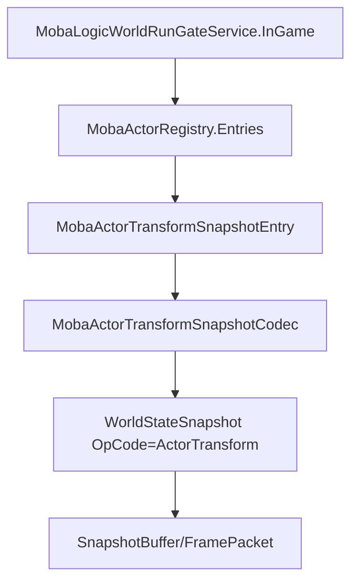

### 9.2 View 侧帧包分发

`FrameSnapshotDispatcher` 订阅 `BattleLogicSession.FrameReceived`，把每个 `FramePacket` 当作 `ISnapshotEnvelope` 处理：

1. 触发 `FrameReceived`。
2. 如果 envelope 中有 `WorldStateSnapshot`，触发 `SnapshotReceived`。
3. 按 `snap.OpCode` 查找 Route。
4. 用注册的 Decoder 解码 payload。
5. 调用订阅者 handler。

`BattleSnapshotPipeline` 在 `FrameSnapshotDispatcher` 之上再加一层“有序 Stage”：

- `Register<T>(opCode, decoder)` 注册 OpCode 到强类型 payload 的解码器。
- `AddStage<T>(opCode, order, handler)` 注册按 order 排序的处理阶段。
- 收到快照后，先解码，再按顺序执行表现阶段。

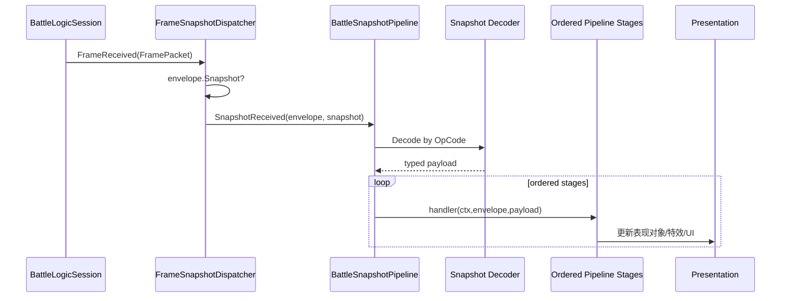

这种路由方式体现了 AbilityKit 的表现层解耦原则：逻辑世界只输出 OpCode + payload，View Runtime 决定如何解码、排序和驱动具体表现。

---

## 10. 远程驱动、本地预测与回滚

MOBA View Runtime 提供 `RemoteDrivenWorldRuntimeFactory`，用于远程对局或模拟权威帧驱动场景。ET Demo 的 `ETBattleWorldFactory` 也复用了同一套 Session/World/DriverHost 思路：先由 `MobaSessionCoordinatorHost` 创建本地 battle world，再把 world 与 `HostRuntime` 绑定到 `MobaBattleDriverHost`，最后由外层宿主按 tick 推进。

远程客户端创建时：

1. 创建 `IWorldManager`。
2. 创建 `HostRuntime`。
3. 安装 `RemoteDrivenRuntimeModuleFactory` 生成的模块。
4. 根据 `BattleStartPlan` 创建世界。
5. 绑定 `MobaAuthorityFrameService`。

```csharp
var worlds = SessionMobaWorldBootstrapFactory.CreateWorldManager();
var runtime = new HostRuntime(worlds, runtimeOptions);
RemoteDrivenRuntimeModuleFactory.Create(options).InstallAll(runtime, runtimeOptions);
var world = runtime.CreateWorld(worldOptions);
BindAuthorityFrameService(world);
```

`RemoteDrivenRuntimeModuleFactory` 安装三类模块：

```csharp
return new HostRuntimeModuleHost()
    .Add(CreatePredictionModule(options))
    .Add(new ServerFrameTimeModule(options.FixedDelta))
    .Add(new WorldAutoStartModule());
```

启用客户端预测时，`ClientPredictionDriverModule` 的关键参数是：

| 参数 | 值 | 说明 |
|------|----|------|
| `inputDelayFrames` | options.InputDelayFrames | 本地输入延迟帧 |
| `maxPredictionAheadFrames` | 30 | 最多领先权威帧数 |
| `minPredictionWindow` | 1 | 最小预测窗口 |
| `backlogEwmaAlpha` | 0.20 | 积压平滑系数 |
| `enableRollback` | true | 启用回滚 |
| `rollbackHistoryFrames` | 240 | 回滚历史帧数 |
| `rollbackCaptureEveryNFrames` | 1 | 每帧捕获回滚状态 |

关闭预测时，模块进入 remote-only 模式：

- 不解析本地输入；
- `maxPredictionAheadFrames = 0`；
- `enableRollback = false`；
- 空 `RollbackRegistry`；
- 不计算状态 Hash。

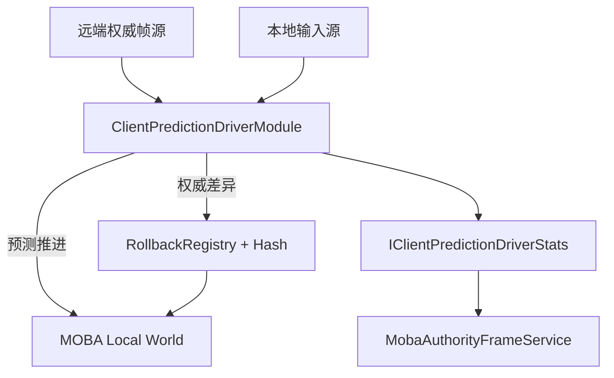

MOBA 示例因此覆盖了两种客户端运行模式：

- **remote-only**：客户端严格跟随权威帧，适合观战、回放、低复杂度客户端。
- **prediction + rollback**：客户端先行模拟本地输入，权威帧到达后通过回滚和 Hash 对账修正。

### 10.1 与 ET 接入的关系

ET Demo 没有复制一套 MOBA 逻辑，而是从 `ETBattleEnterGameSpecBuilder` 把 ET 房间玩家转换成 `MobaBattleLaunchSpec` / `MobaGameStartSpec`，再通过 `MobaSessionCoordinatorHost` 创建相同的 battle world。因此 MOBA Demo 里的输入、技能、Buff、Projectile、Damage、Snapshot 设计同样适用于 ET 宿主，只是表现层由 View Runtime 的 `BattleSnapshotPipeline` 换成了 ET 的 `ETBattleViewEventSink`、`ETUnitComponent` 和 `ETBattleEntityCacheComponent`。


这个关系用于界定示例边界：MOBA Demo 是战斗域样板，ET Demo 是宿主集成样板；两者不是两套玩法实现。

---

## 11. 一帧内的端到端数据流

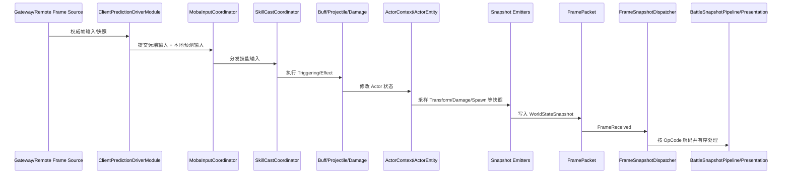

这条链路说明 MOBA Demo 并没有把逻辑和表现绑死：逻辑侧只保证确定性状态推进与快照输出；表现侧通过 Session/Dispatcher/Pipeline 消费快照并渲染。

---

## 12. 扩展指南

### 12.1 新增一个 Actor 类型

1. 在配置中增加 Character/Model/组件模板。
2. 构造 `MobaActorBuildSpec`。
3. 通过 `MobaActorSpawnService.TrySpawn` 创建 Actor。
4. 在 PostSetup 中补充 owner/lifetime/model/projectile/summon 等元数据。
5. 确认 `MobaEntityManager` 注册所需的 team/mainType/unitSubType/ownerPlayer。
6. 如需表现同步，添加对应 SnapshotEmitter 或复用已有 ActorTransform/Spawn 快照。

### 12.2 新增一个技能效果

1. 在配置中定义 Skill/SkillFlow/TriggerPlan。
2. 在 Triggering Action 中调用目标服务，例如 Buff、Projectile、Damage、Summon。
3. 若需要持续行为，接入 ContinuousManager。
4. 若需要表现，输出快照或 ViewEvent。
5. 在 View Runtime 的 SnapshotPipeline 注册解码器和 stage。

### 12.3 新增一个快照类型

1. 在逻辑层定义 entry 与 codec。
2. 继承 `LogicWorldSnapshotBufferEmitterBase` 创建 emitter。
3. 使用稳定 OpCode 创建 `WorldStateSnapshot`。
4. 在 `FrameSnapshotDispatcher` 或 `BattleSnapshotPipeline` 注册 decoder。
5. 在 pipeline stage 中更新表现对象。

---

## 13. 设计要点与约束

| 主题 | 要点 |
|------|------|
| 确定性 | 输入、技能、Buff、投射物都应走逻辑世界服务，避免表现层直接改逻辑状态 |
| ActorId | 跨技能、投射物、快照、表现的主键是 actorId/netId，需要稳定分配和注册 |
| 配置热重载 | 配置门面会发布 reload 结果，但运行中对象是否即时响应由具体服务决定 |
| Buff 重入 | Buff apply/remove 使用命令队列和 `_draining` 防重入，扩展时不要绕过生命周期执行器 |
| 投射物同步 | ProjectileService 管物理/命中，MOBA Actor 管表现映射和快照同步 |
| 快照解码 | OpCode 与 payload 类型必须一一匹配，否则 Dispatcher/Pipeline 会抛类型不匹配异常 |
| 预测回滚 | 开启预测时需要提供 RollbackRegistry 和状态 Hash；remote-only 模式不做本地预测 |

---

## 14. 源码索引

| 模块 | 源码 |
|------|------|
| 战斗世界 Blueprint | `Unity/Packages/com.abilitykit.demo.moba.runtime/Runtime/Worlds/Blueprints/MobaBattleWorldBlueprint.cs` |
| 逻辑世界 Blueprint 基类 | `Unity/Packages/com.abilitykit.demo.moba.runtime/Runtime/Worlds/Blueprints/MobaLogicWorldBlueprintBase.cs` |
| Bootstrap Module | `Unity/Packages/com.abilitykit.demo.moba.runtime/Runtime/Application/Systems/MobaWorldBootstrapModule.cs` |
| 输入协调 | `Unity/Packages/com.abilitykit.demo.moba.runtime/Runtime/Application/Services/Input/MobaInputCoordinator.cs` |
| 技能释放协调 | `Unity/Packages/com.abilitykit.demo.moba.runtime/Runtime/Application/Services/Skill/Cast/SkillCastCoordinator.cs` |
| 配置门面 | `Unity/Packages/com.abilitykit.demo.moba.runtime/Runtime/Infrastructure/Config/Core/MobaConfigDatabase.cs` |
| 实体索引 | `Unity/Packages/com.abilitykit.demo.moba.runtime/Runtime/Application/Services/EntityManager/MobaEntityManager.cs` |
| Actor 生成 | `Unity/Packages/com.abilitykit.demo.moba.runtime/Runtime/Application/Services/EntityConstruction/MobaActorSpawnService.cs` |
| Buff 服务 | `Unity/Packages/com.abilitykit.demo.moba.runtime/Runtime/Application/Services/Buffs/MobaBuffService.cs` |
| 投射物服务 | `Unity/Packages/com.abilitykit.demo.moba.runtime/Runtime/Application/Services/Projectile/MobaProjectileService.cs` |
| 伤害服务 | `Unity/Packages/com.abilitykit.demo.moba.runtime/Runtime/Application/Services/Combat/MobaDamageService.cs` |
| Transform 快照 | `Unity/Packages/com.abilitykit.demo.moba.runtime/Runtime/Application/Services/Actor/MobaActorTransformSnapshotService.cs` |
| 远程驱动世界 | `Unity/Packages/com.abilitykit.demo.moba.view.runtime/Runtime/Game/Battle/Client/Session/Features/Sim/RemoteDrivenWorldRuntimeFactory.cs` |
| 远程驱动模块 | `Unity/Packages/com.abilitykit.demo.moba.view.runtime/Runtime/Game/Battle/Client/Session/Features/Sim/RemoteDrivenRuntimeModuleFactory.cs` |
| 快照 Dispatcher | `Unity/Packages/com.abilitykit.demo.moba.view.runtime/Runtime/Game/Battle/Client/SnapshotRouting/FrameSnapshotDispatcher.cs` |
| 快照 Pipeline | `Unity/Packages/com.abilitykit.demo.moba.view.runtime/Runtime/Game/Battle/Client/SnapshotRouting/BattleSnapshotPipeline.cs` |
