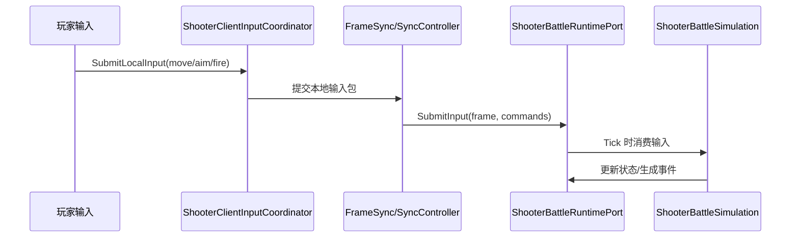
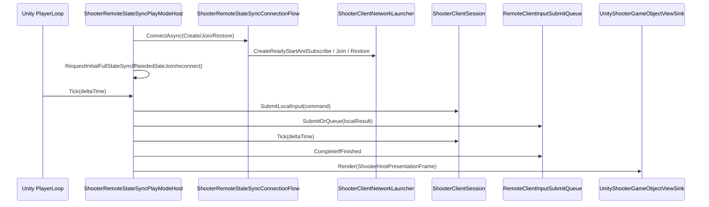
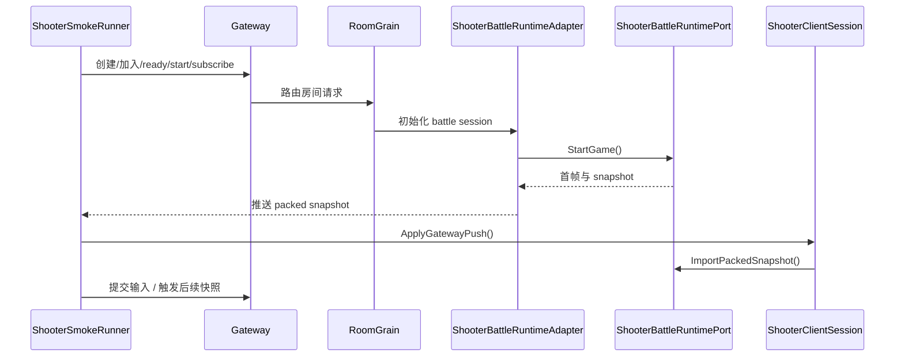
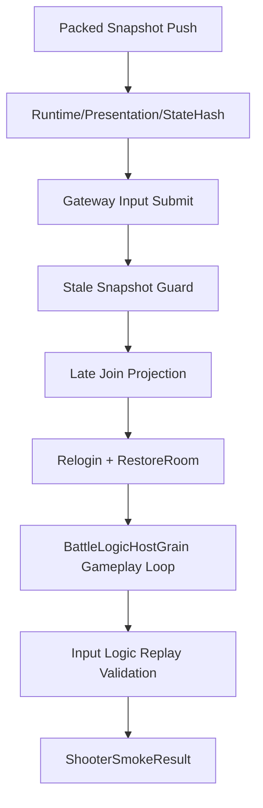

# Shooter Demo 与 Orleans Smoke

> 本文从源码出发说明 Shooter 示例如何把 `Svelto` 战斗模拟、权威快照、纯状态同步、客户端同步控制器、Gateway 房间流程、Orleans 房间/战斗 Grain，以及烟测校验串成一个完整闭环。

## 1. 示例定位

Shooter 示例与 MOBA 示例的关注点不同：

- MOBA 更强调 AbilityKit 的技能、Buff、Projectile、配置与表现层协作。
- Shooter 更强调**同步策略、快照编码、房间编排、服务端权威、客户端恢复与烟测验证**。

它展示了 AbilityKit 里一条更偏“网络闭环”的样板线：

1. 客户端通过 Gateway 创建/加入房间。
2. 房间完成 ready/start 后，Orleans 拉起战斗世界。
3. 服务端运行 `ShooterBattleRuntimePort` 与 `ShooterBattleSimulation`。
4. 服务端持续产出 packed snapshot / pure-state snapshot。
5. 客户端按同步模型选择预测回滚、权威插值或混合方案。
6. Unity PlayMode 通过 `ShooterRemoteStateSyncPlayModeHost` 复用同一套 Gateway/Session/SyncController。
7. `ShooterSmokeRunner` 做端到端烟测，验证推送、输入、过期帧保护、回放、重连、晚加入和完整玩法循环。

---

## 2. 总体架构

Shooter 示例可以拆成四层：

| 层级 | 主要职责 | 关键文件 |
|------|----------|----------|
| 玩法逻辑 | 玩家移动、开火、子弹生命周期、命中、事件输出 | [`ShooterBattleSimulation`](../../../Unity/Packages/com.abilitykit.demo.shooter.runtime/Runtime/Domain/Battle/ShooterBattleSimulation.cs) |
| 战斗运行时 | 启动战斗、输入提交、快照导出/导入、状态哈希 | [`ShooterBattleRuntimePort`](../../../Unity/Packages/com.abilitykit.demo.shooter.runtime/Runtime/Application/Runtime/ShooterBattleRuntimePort.cs) |
| 客户端同步 | 输入协调、同步控制器、快照应用、插值/预测/回滚 | [`ShooterClientSession`](../../../Unity/Packages/com.abilitykit.demo.shooter.view.runtime/Runtime/Client/ShooterClientSession.cs) |
| Unity 远程宿主 | PlayMode PlayerLoop、输入队列、断线恢复、全量同步、GameObject ViewSink | [`ShooterRemoteStateSyncPlayModeHost`](../../../Unity/Packages/com.abilitykit.demo.shooter.view.runtime/Runtime/Unity/PlayMode/ShooterRemoteStateSyncPlayModeHost.cs) |
| 远程连接流 | Create/Join/RestoreFirst/RestoreOnly，ready/start/subscribe 与 fallback create | [`ShooterRemoteStateSyncConnectionFlow`](../../../Unity/Packages/com.abilitykit.demo.shooter.view.runtime/Runtime/PlayMode/ShooterRemoteStateSyncConnectionFlow.cs) |
| 服务端编排 | 房间、战斗 Grain、FrameSync、Gateway 路由、烟测 | [`RoomGrain`](../../../Server/Orleans/src/AbilityKit.Orleans.Grains/Rooms/RoomGrain.cs) |

该示例的核心价值是把“战斗模拟”和“网络同步策略”拆开：模拟是可替换的，快照/同步协议是可验证的。

---

## 3. 世界创建与模块装配

### 3.1 战斗世界 Blueprint

Shooter 的战斗世界入口是 [`ShooterBattleWorldBlueprint`](../../../Unity/Packages/com.abilitykit.demo.shooter.runtime/Runtime/Worlds/ShooterBattleWorldBlueprint.cs)。它的职责非常轻：

- 固定 `WorldType` 为 Shooter 战斗类型；
- 设置默认服务容器；
- 注入 [`ShooterWorldModule`](../../../Unity/Packages/com.abilitykit.demo.shooter.runtime/Runtime/Worlds/ShooterWorldModule.cs)；
- 由模块继续装配输入、同步、规则、实体管理与模拟服务。

这和 MOBA 示例里更偏“逻辑世界蓝图 + Bootstrap 模块”的风格类似，但 Shooter 更集中在**战斗运行时接口**上。

### 3.2 Runtime Port 作为单一门面

[`ShooterBattleRuntimePort`](../../../Unity/Packages/com.abilitykit.demo.shooter.runtime/Runtime/Application/Runtime/ShooterBattleRuntimePort.cs) 同时暴露多个能力接口：

- 游戏开始：`IShooterGameStartPort`
- 输入提交：`IShooterInputPort`
- 计时：`IShooterSimulationClock`
- 快照读取：`IShooterSnapshotReadPort`
- 状态哈希：`IShooterStateHashProvider`
- packed snapshot：`IShooterPackedSnapshotPort`
- pure-state snapshot：`IShooterPureStateSnapshotPort`

这意味着外部代码不需要直接依赖模拟细节，只通过一个 runtime 门面即可完成：

- `StartGame()`
- `SubmitInput()`
- `Tick()`
- `GetSnapshot()`
- `ComputeStateHash()`
- `ExportPackedSnapshot()` / `ImportPackedSnapshot()`
- `ExportPureStateSnapshot()`

---

## 4. 玩法模拟：Svelto 驱动的战斗循环

### 4.1 Simulation 的职责边界

[`ShooterBattleSimulation`](../../../Unity/Packages/com.abilitykit.demo.shooter.runtime/Runtime/Domain/Battle/ShooterBattleSimulation.cs) 负责最核心的战斗 tick。

它把逻辑分成两段：

- `TickPlayers(deltaTime)`
  - 读取玩家输入
  - 更新移动
  - 更新瞄准
  - 处理开火并生成子弹
- `TickBullets(deltaTime)`
  - 让子弹飞行
  - 降低生命周期
  - 检测命中
  - 写入事件快照
  - 清理失效实体

这个结构使模拟层很容易和同步层解耦：同步层关心“世界状态如何编码”，模拟层只关心“状态如何推进”。

### 4.2 实体管理

[`ShooterEntityManager`](../../../Unity/Packages/com.abilitykit.demo.shooter.runtime/Runtime/Application/Services/EntityManager/ShooterEntityManager.cs) 负责把游戏实体与 Svelto 世界中的实体集合对应起来。

它主要维护：

- 玩家 ID 集合；
- 子弹 ID 集合；
- 结构化变更深度；
- 延迟提交的结构变更；
- `ISveltoWorldContext` 下的实体增删改。

在战斗模拟里，实体增删不能随便穿插到 tick 任意位置，因此 EntityManager 会把结构变化收敛后提交，避免迭代中修改集合。

---

## 5. 输入、状态与命中结果

### 5.1 输入提交路径

客户端侧输入先进入 [`ShooterClientInputCoordinator`](../../../Unity/Packages/com.abilitykit.demo.shooter.view.runtime/Runtime/Client/Session/ShooterClientInputCoordinator.cs)，再进入 runtime 的 `SubmitInput()`。

典型路径如下：

输入包会被编码为 `ShooterPlayerCommand`，并携带到目标帧。

### 5.2 命中与事件输出

模拟推进时，开火会触发子弹实体创建，命中后会产生事件快照与血量变化。

这与 MOBA 示例中的 Buff / Projectile / Damage 服务不同：Shooter 更倾向于把命中结果直接放入战斗模拟与快照管线，服务端仅负责稳定地导出状态。

---

## 6. 快照系统：packed snapshot 与 pure-state snapshot

Shooter 示例最值得关注的是**两套同步表达**。

### 6.1 packed snapshot

[`ShooterPackedSnapshotExporter`](../../../Unity/Packages/com.abilitykit.demo.shooter.runtime/Runtime/Application/Synchronization/ShooterPackedSnapshotExporter.cs) 会把当前世界导出为带组件块的 packed payload。

其输出包含：

- 生命周期块；
- 玩家/子弹/敌人 transform 块；
- 玩家血量块；
- 敌人血量块；
- 分数块；
- 子弹寿命块。

它还会：

- 按稳定顺序排序实体；
- 写入当前帧和状态哈希；
- 标记 full snapshot / keyframe；
- 支持 authority override。

packed snapshot 更适合：

- 权威同步；
- 快速恢复；
- 重连；
- 服务端主动推送。

### 6.2 pure-state snapshot

[`ShooterPureStateSnapshotExporter`](../../../Unity/Packages/com.abilitykit.demo.shooter.runtime/Runtime/Application/Synchronization/ShooterPureStateSnapshotExporter.cs) 面向更“状态分发”式的同步需求。

它支持：

- full baseline；
- delta / low frequency frame；
- 最大实体预算；
- 观察者兴趣范围；
- 高频/低频混合发送；
- 基线帧与 hash 校验。

它的核心思想是：

> 不是所有实体都要每帧发给所有客户端，而是按兴趣、预算和同步模式裁剪。

这也是 Shooter 示例和 MOBA 示例最大的风格差异之一。

### 6.3 状态哈希

[`ShooterStateHasher`](../../../Unity/Packages/com.abilitykit.demo.shooter.runtime/Runtime/Application/Synchronization/ShooterStateHasher.cs) 对战斗当前帧、玩家状态、子弹状态等做 deterministic hash。

烟测会把：

- runtime 当前 hash；
- packed snapshot 内 hash；
- 客户端应用后 hash；

进行交叉验证，确保同步闭环可被验证。

---

## 7. 客户端同步控制器

### 7.1 Session 门面

[`ShooterClientSession`](../../../Unity/Packages/com.abilitykit.demo.shooter.view.runtime/Runtime/Client/ShooterClientSession.cs) 是客户端视角的总门面。

它把以下对象组合起来：

- presentation session；
- presentation facade；
- sync controller。

它提供：

- `StartGame()`
- `SubmitLocalInput()`
- `SubmitLocalInputToGatewayAsync()`
- `Tick()`
- `CatchUpToFrame()`
- `TryEnterCatchUp()`
- `ApplyGatewayPush()`

### 7.2 SyncController 工厂

[`ShooterClientSyncControllerFactory`](../../../Unity/Packages/com.abilitykit.demo.shooter.view.runtime/Runtime/Client/Synchronization/ShooterClientSyncControllerFactory.cs) 负责按同步模式选择控制器。

默认映射关系包括：

- `PredictRollback` → 预测回滚控制器；
- `AuthoritativeInterpolation` → 权威插值控制器；
- `BatchStateSync` → 批量状态同步控制器；
- `MassBattleLodSync` → 大规模战斗 LOD 同步控制器；
- `HybridHeroPrediction` → 混合英雄预测控制器。

这说明 Shooter 示例不仅是一个 demo，也是 AbilityKit 的**同步策略验证场**。

### 7.3 packed snapshot 应用

[`ShooterPackedSnapshotSyncController`](../../../Unity/Packages/com.abilitykit.demo.shooter.view.runtime/Runtime/Client/Synchronization/ShooterPackedSnapshotSyncController.cs) 处理服务端推送的 packed 载荷。

其关键流程是：

1. 优先处理 pure-state baseline；
2. 忽略过期帧；
3. 若没有 packed snapshot，则走插值表现路径；
4. 若有 packed snapshot，调用 runtime 导入；
5. 成功后更新已应用帧、hash 与 flags；
6. 再把插值 snapshot 交给 presentation。

因此，**同步状态**与**表现状态**是两条并行路径：

- runtime 负责确定性战斗状态；
- presentation 负责最终可视化。

### 7.4 pure-state snapshot 应用

[`ShooterPureStateSnapshotSyncController`](../../../Unity/Packages/com.abilitykit.demo.shooter.view.runtime/Runtime/Client/Synchronization/ShooterPureStateSnapshotSyncController.cs) 负责 pure-state 基线/增量的应用。

它会判断：

- 是否收到 pure-state 载荷；
- 帧是否过期；
- 增量是否缺少基线；
- 是否需要 full baseline resync；
- 是否需要记录健康事件。

这让 Shooter 能够优雅地处理：

- 首次接入；
- 丢包；
- 断线恢复；
- 基线缺失。

---

## 8. Unity PlayMode 远程状态同步宿主

[`ShooterRemoteStateSyncPlayModeHost`](../../../Unity/Packages/com.abilitykit.demo.shooter.view.runtime/Runtime/Unity/PlayMode/ShooterRemoteStateSyncPlayModeHost.cs) 是 Shooter 远程状态同步在 Unity 里的可运行入口。它做的事情比普通 client session 更完整：

1. 安装 Unity `PlayerLoop` 节点，让 PlayMode 每帧调用 `Tick(Time.deltaTime)`。
2. 创建 `ShooterBattleWorldSession` 和 `ShooterClientNetworkLauncher`。
3. 通过 `ShooterRemoteStateSyncConnectionFlow` 执行 Create/Join/Restore。
4. 对 late join / reconnect 请求初始 full-state baseline。
5. 把本地输入先提交给 `ShooterClientSession.SubmitLocalInput`，再通过 `RemoteClientInputSubmitQueue` 排队发往 Gateway。
6. 每帧 tick client session、coordinator input bridge 和 gateway input queue。
7. 构造 `ShooterHostPresentationFrame`，交给 `UnityShooterGameObjectViewSink.Render`。
8. 检测 socket 断线后进入 RestoreOnly 自动重连。

`ShooterRemoteStateSyncConnectionFlow` 的模式选择很明确：

| LaunchMode | 行为 |
|------------|------|
| `JoinRoom` | 要求 roomId，执行 join/ready/start/subscribe |
| `CreateNew` | 创建房间并 ready/start/subscribe |
| `RestoreOnly` | 只恢复已有房间，失败即抛错 |
| `RestoreFirst` | 先恢复，恢复失败时 fallback 到 create |

断线恢复的关键点是 `TryBeginAutoReconnectAfterSocketLoss`：当底层连接不再处于 connected/connecting，Host 会构造 `RestoreOnly` launch options，清空输入队列，关闭 launcher，并异步调用 `StartAsync` 重新进入连接流。

---

## 9. Gateway 与 Orleans 编排

### 9.1 房间流程

客户端从 [`ShooterRoomGatewayFlow`](../../../Unity/Packages/com.abilitykit.demo.shooter.view.runtime/Runtime/Client/Gateway/ShooterRoomGatewayFlow.cs) 进入房间流程。

典型步骤是：

1. 创建房间；
2. 加入房间；
3. 设置 ready；
4. 启动战斗；
5. 订阅状态同步；
6. 确定世界启动锚点；
7. 返回可驱动客户端会话的上下文。

这个流程与普通“进房即开局”的 demo 不同，它显式分离了 lobby 和 battle。

### 9.2 RoomGrain

[`RoomGrain`](../../../Server/Orleans/src/AbilityKit.Orleans.Grains/Rooms/RoomGrain.cs) 是 Orleans 的房间状态机。

它维护：

- 房间摘要；
- 房间成员；
- gameplay adapter；
- battleId；
- worldId；
- world start anchor；
- 是否已关闭。

启动战斗时，它会：

- 构造 `BattleInitParams`；
- 初始化 frame sync grain；
- 视情况初始化 battle runtime grain；
- 创建或获取 world start anchor；
- 关闭房间进入战斗态。

### 9.3 Room gameplay adapter

[`ShooterRoomGameplayAdapter`](../../../Server/Orleans/src/AbilityKit.Orleans.Grains/Gameplays/Shooter/Rooms/ShooterRoomGameplayAdapter.cs) 把房间摘要映射成 Shooter 的战斗初始化参数。

它负责：

- 定义房间类型；
- 建立房间状态；
- 判断是否可开始；
- 构建晚加入玩家快照；
- 构建 battle init 参数；
- 根据 room id 生成确定性 world id。

### 9.4 Battle runtime adapter

[`ShooterBattleRuntimeAdapter`](../../../Server/Orleans/src/AbilityKit.Orleans.Grains/Gameplays/Shooter/Battle/ShooterBattleRuntimeAdapter.cs) 是 battle 逻辑宿主和 runtime port 的桥梁。

它创建的 session 会负责：

- `Start()`：启动 Shooter 世界；
- `JoinPlayer()`：加入玩家或 bot；
- `SubmitInputs()`：解码输入 opcode；
- `Tick()`：推进模拟；
- `GetSnapshot()`：读取状态；
- `CreateStateSyncPush()`：导出 packed / pure-state state sync。

### 9.5 FrameSync Grain

[`BattleFrameSyncGrain`](../../../Server/Orleans/src/AbilityKit.Orleans.Grains/FrameSync/BattleFrameSyncGrain.cs) 提供帧输入同步。

它的特点是：

- 用定时器驱动 frame push；
- 按 frame 收集输入；
- 每次最多 catch up 数帧；
- 通知观察者当前帧事件。

这让房间战斗在服务端可被统一调度。

### 9.6 Gateway 路由

[`GatewayRequestRouter`](../../../Server/Orleans/src/AbilityKit.Orleans.Gateway/Gateway/Core/GatewayRequestRouter.cs) 负责把请求 opcode 路由到具体 handler，并统一处理：

- 未知 opcode；
- 超时；
- 异常；
- 请求取消。

Shooter 的 room flow 正是通过这一层完成创建、加入、ready、开始和订阅。

---

## 10. 烟测流程：ShooterSmokeRunner

[`ShooterSmokeRunner`](../../../Server/Orleans/src/AbilityKit.Orleans.ShooterSmoke/Runner/ShooterSmokeRunner.cs) 是 Shooter 示例最终的验收入口。

它的验证项非常完整：

- 建立网关连接；
- 登录 guest；
- 创建 presentation/runtime；
- 组装 `ShooterStartGamePayload`；
- 等待 packed snapshot 推送；
- 验证 runtime / presentation frame；
- 验证 state hash；
- 通过 Gateway 提交多组输入并校验 accepted frame、current frame、server ticks 和状态文本；
- 注入过期 packed snapshot 并确认 `IgnoredStaleSnapshot`；
- 检查 presentation 玩家数量；
- 验证投影结果；
- 测试晚加入投影；
- 重新登录账号并测试 reconnect 投影；
- 通过 `IBattleLogicHostGrain` 跑完整 gameplay loop，记录 server input/server snapshot；
- 生成并验证输入逻辑 replay；
- 最后执行烟测结果校验与清理。

简化后的时序如下：

烟测的意义不是“跑通一次”，而是**证明战斗逻辑、网络同步、推送恢复、重连、晚加入、服务端玩法循环和 replay 记录是同一套协议下可互相验证的**。

---

## 11. 设计要点与约束

### 11.1 设计要点

- **运行时门面化**：外部依赖 runtime port，不直接操作战斗细节。
- **模拟与同步分离**：Simulation 负责推进，Exporter/Controller 负责编码与应用。
- **多同步模型共存**：同一战斗域支持多种客户端同步策略。
- **服务端权威**：Orleans 负责房间、战斗、frame sync、状态同步推送。
- **可验证闭环**：状态 hash、过期帧忽略、重连与晚加入都被烟测覆盖。

### 11.2 约束

- packed snapshot 要求实体顺序稳定；
- pure-state snapshot 必须考虑基线与预算；
- 客户端回滚/插值逻辑必须兼容服务端权威帧；
- 房间开始前后的状态迁移必须可重建；
- 烟测必须能精确检查 frame/hash/结果类型。

---

## 12. 源码索引

| 模块 | 源码 |
|------|------|
| 战斗世界 | [`ShooterBattleWorldBlueprint`](../../../Unity/Packages/com.abilitykit.demo.shooter.runtime/Runtime/Worlds/ShooterBattleWorldBlueprint.cs) |
| 战斗运行时门面 | [`ShooterBattleRuntimePort`](../../../Unity/Packages/com.abilitykit.demo.shooter.runtime/Runtime/Application/Runtime/ShooterBattleRuntimePort.cs) |
| 战斗模拟 | [`ShooterBattleSimulation`](../../../Unity/Packages/com.abilitykit.demo.shooter.runtime/Runtime/Domain/Battle/ShooterBattleSimulation.cs) |
| 实体管理 | [`ShooterEntityManager`](../../../Unity/Packages/com.abilitykit.demo.shooter.runtime/Runtime/Application/Services/EntityManager/ShooterEntityManager.cs) |
| packed 导出 | [`ShooterPackedSnapshotExporter`](../../../Unity/Packages/com.abilitykit.demo.shooter.runtime/Runtime/Application/Synchronization/ShooterPackedSnapshotExporter.cs) |
| pure-state 导出 | [`ShooterPureStateSnapshotExporter`](../../../Unity/Packages/com.abilitykit.demo.shooter.runtime/Runtime/Application/Synchronization/ShooterPureStateSnapshotExporter.cs) |
| 状态哈希 | [`ShooterStateHasher`](../../../Unity/Packages/com.abilitykit.demo.shooter.runtime/Runtime/Application/Synchronization/ShooterStateHasher.cs) |
| 客户端会话 | [`ShooterClientSession`](../../../Unity/Packages/com.abilitykit.demo.shooter.view.runtime/Runtime/Client/ShooterClientSession.cs) |
| 同步控制器工厂 | [`ShooterClientSyncControllerFactory`](../../../Unity/Packages/com.abilitykit.demo.shooter.view.runtime/Runtime/Client/Synchronization/ShooterClientSyncControllerFactory.cs) |
| packed 同步控制器 | [`ShooterPackedSnapshotSyncController`](../../../Unity/Packages/com.abilitykit.demo.shooter.view.runtime/Runtime/Client/Synchronization/ShooterPackedSnapshotSyncController.cs) |
| pure-state 同步控制器 | [`ShooterPureStateSnapshotSyncController`](../../../Unity/Packages/com.abilitykit.demo.shooter.view.runtime/Runtime/Client/Synchronization/ShooterPureStateSnapshotSyncController.cs) |
| 房间流程 | [`ShooterRoomGatewayFlow`](../../../Unity/Packages/com.abilitykit.demo.shooter.view.runtime/Runtime/Client/Gateway/ShooterRoomGatewayFlow.cs) |
| Unity 远程状态同步宿主 | [`ShooterRemoteStateSyncPlayModeHost`](../../../Unity/Packages/com.abilitykit.demo.shooter.view.runtime/Runtime/Unity/PlayMode/ShooterRemoteStateSyncPlayModeHost.cs) |
| PlayMode 连接流 | [`ShooterRemoteStateSyncConnectionFlow`](../../../Unity/Packages/com.abilitykit.demo.shooter.view.runtime/Runtime/PlayMode/ShooterRemoteStateSyncConnectionFlow.cs) |
| 房间 Grain | [`RoomGrain`](../../../Server/Orleans/src/AbilityKit.Orleans.Grains/Rooms/RoomGrain.cs) |
| Shooter 房间适配 | [`ShooterRoomGameplayAdapter`](../../../Server/Orleans/src/AbilityKit.Orleans.Grains/Gameplays/Shooter/Rooms/ShooterRoomGameplayAdapter.cs) |
| Shooter 战斗适配 | [`ShooterBattleRuntimeAdapter`](../../../Server/Orleans/src/AbilityKit.Orleans.Grains/Gameplays/Shooter/Battle/ShooterBattleRuntimeAdapter.cs) |
| 帧同步 Grain | [`BattleFrameSyncGrain`](../../../Server/Orleans/src/AbilityKit.Orleans.Grains/FrameSync/BattleFrameSyncGrain.cs) |
| 网关路由 | [`GatewayRequestRouter`](../../../Server/Orleans/src/AbilityKit.Orleans.Gateway/Gateway/Core/GatewayRequestRouter.cs) |
| 烟测入口 | [`ShooterSmokeRunner`](../../../Server/Orleans/src/AbilityKit.Orleans.ShooterSmoke/Runner/ShooterSmokeRunner.cs) |
