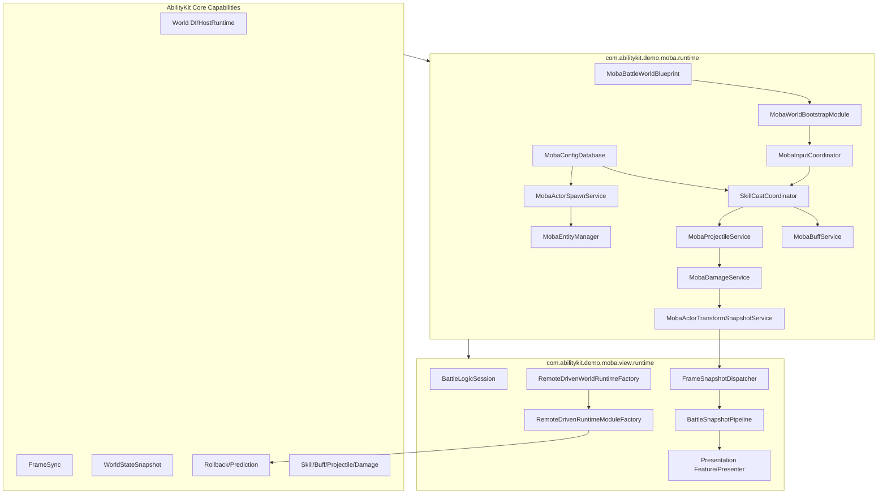
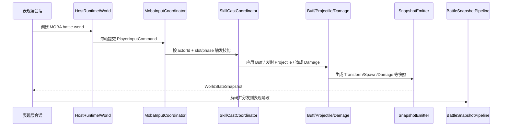

# MOBA Demo 专题总览

> 本目录把 MOBA 示例从单篇概览拆成多个专题。MOBA 示例的价值不只是“跑一个战斗 Demo”，而是展示 AbilityKit 如何把逻辑世界、Entitas、配置、输入、技能、Buff、Projectile、Damage、Snapshot、表现层与预测回滚组合成一条完整玩法生产线。

## 1. 拆分理由

MOBA 示例已经进一步拆成更细专题，便于单独阅读每个设计点：

| 专题 | 关注点 | 文档 |
|------|--------|------|
| 世界启动 | WorldBlueprint、WorldProfile、Module、服务注册、生命周期 | [01-世界启动与运行时装配](01-WorldAndBootstrap.md) |
| DI 与 System/Service 协作 | MobaServicesAutoModule、WorldService、WorldInject、System 调度、测试友好协作 | [12-DI 与 System/Service 协作深潜](12-DIAndSystemServiceCollaborationDeepDive.md) |
| 输入与技能 | PlayerInputCommand、MobaInputCoordinator、SkillCastCoordinator、技能槽与输入阶段 | [02-技能执行深潜](05-SkillExecutionDeepDive.md) |
| 配置与实体 | MobaConfigDatabase、DTO/Bytes/Resources、MobaEntityManager、SpawnService | [03-配置、实体索引与生成深潜](06-ConfigEntitySpawnDeepDive.md) |
| 战斗服务 | BuffLifecycle、ProjectileService、DamageService、快照事件 | [03-Buff、Projectile 与 Damage 管线](03-BuffProjectileDamage.md) |
| Trace/Context/Effect | TraceTreeRegistry、MobaTraceRegistry、LineageInput、CombatExecutionContext、EffectInvoker | [09-Trace、Context 与 Effect 执行深潜](09-TraceContextEffectDeepDive.md) |
| Trigger/Validation/Presentation Cue | TriggerExecutionGateway、Owner-bound Subscription、RuntimeValidation、StageTrigger、PresentationCue | [10-Trigger、Validation 与 Presentation Cue 深潜](10-TriggerValidationPresentationDeepDive.md) |
| PlanActions/Continuous Runtime | ActionSchema、PlanActionModule、ContinuousRuntimeView、LifecycleBinder、ContextSourceBoundary | [11-PlanActions DSL 与 Continuous Runtime 深潜](11-PlanActionsAndContinuousRuntimeDeepDive.md) |
| 快照与表现 | WorldStateSnapshot、SnapshotBuffer、FrameSnapshotDispatcher、BattleSnapshotPipeline | [04-快照、表现层与预测回滚](04-SnapshotPresentationPrediction.md) |
| 远程驱动 | RemoteDrivenWorldRuntimeFactory、ClientPredictionDriverModule、RollbackRegistry | [04-快照、表现层与预测回滚](04-SnapshotPresentationPrediction.md) |

## 2. 源码分层

## 3. 端到端主流程

## 4. 建议阅读顺序

1. 先读 [01-世界启动与运行时装配](01-WorldAndBootstrap.md)，理解 MOBA world 如何出现。
2. 再读 [12-DI 与 System/Service 协作深潜](12-DIAndSystemServiceCollaborationDeepDive.md)，理解服务注册、System 调度和业务服务分层。
3. 再读 [02-技能执行深潜](05-SkillExecutionDeepDive.md)，理解输入如何变成技能释放。
4. 再读 [03-配置、实体索引与生成深潜](06-ConfigEntitySpawnDeepDive.md)，理解配置、索引与生成如何支撑战斗。
5. 再读 [03-Buff、Projectile 与 Damage 管线](03-BuffProjectileDamage.md)，理解技能效果如何落到战斗状态。
6. 再读 [09-Trace、Context 与 Effect 执行深潜](09-TraceContextEffectDeepDive.md)，理解效果执行如何携带来源、父子 trace 与验收结构。
7. 再读 [10-Trigger、Validation 与 Presentation Cue 深潜](10-TriggerValidationPresentationDeepDive.md)，理解触发器订阅、运行时校验、阶段触发与表现 Cue。
8. 再读 [11-PlanActions DSL 与 Continuous Runtime 深潜](11-PlanActionsAndContinuousRuntimeDeepDive.md)，理解配置动作 DSL、强类型 action module、持续运行时查询与上下文边界。
9. 最后读 [04-快照、表现层与预测回滚](04-SnapshotPresentationPrediction.md)，理解逻辑结果如何同步到客户端表现。

## 5. 关键源码入口

| 主题 | 源码 |
|------|------|
| Battle Blueprint | `Unity/Packages/com.abilitykit.demo.moba.runtime/Runtime/Worlds/Blueprints/MobaBattleWorldBlueprint.cs` |
| World Bootstrap | `Unity/Packages/com.abilitykit.demo.moba.runtime/Runtime/Worlds/Modules/MobaWorldBootstrapModule.cs` |
| 服务自动注册 | `Unity/Packages/com.abilitykit.demo.moba.runtime/Runtime/Application/Systems/Bootstrap/MobaServicesAutoModule.cs` |
| System 顺序与协作 | `Unity/Packages/com.abilitykit.demo.moba.runtime/Runtime/Application/Systems/MobaSystemOrder.cs`、`Unity/Packages/com.abilitykit.demo.moba.runtime/Runtime/Application/Systems/MobaWorldSystemExecution.cs` |
| 服务基类 | `Unity/Packages/com.abilitykit.demo.moba.runtime/Runtime/Application/Services/Templates/GameServiceBase.cs` |
| 输入协调 | `Unity/Packages/com.abilitykit.demo.moba.runtime/Runtime/Application/Services/Input/MobaInputCoordinator.cs` |
| 技能释放 | `Unity/Packages/com.abilitykit.demo.moba.runtime/Runtime/Application/Services/Skill/Cast/SkillCastCoordinator.cs` |
| 配置门面 | `Unity/Packages/com.abilitykit.demo.moba.runtime/Runtime/Infrastructure/Config/Core/MobaConfigDatabase.cs` |
| 实体索引 | `Unity/Packages/com.abilitykit.demo.moba.runtime/Runtime/Application/Services/EntityManager/MobaEntityManager.cs` |
| Actor 生成 | `Unity/Packages/com.abilitykit.demo.moba.runtime/Runtime/Application/Services/EntityConstruction/MobaActorSpawnService.cs` |
| Buff 服务 | `Unity/Packages/com.abilitykit.demo.moba.runtime/Runtime/Application/Services/Buffs/MobaBuffService.cs` |
| Projectile 服务 | `Unity/Packages/com.abilitykit.demo.moba.runtime/Runtime/Application/Services/Projectile/MobaProjectileService.cs` |
| Damage 服务 | `Unity/Packages/com.abilitykit.demo.moba.runtime/Runtime/Application/Services/Combat/MobaDamageService.cs` |
| Trace Registry | `Unity/Packages/com.abilitykit.demo.moba.runtime/Runtime/Application/Services/Trace/MobaTraceRegistry.cs` |
| Effect Lineage | `Unity/Packages/com.abilitykit.demo.moba.runtime/Runtime/Application/Services/Context/Lineage/MobaEffectLineageInput.cs` |
| Combat Context | `Unity/Packages/com.abilitykit.demo.moba.runtime/Runtime/Application/Services/Context/Execution/MobaCombatExecutionContext.cs` |
| Effect Invoker | `Unity/Packages/com.abilitykit.demo.moba.runtime/Runtime/Application/Services/Effect/MobaEffectInvokerService.cs` |
| Transform Snapshot | `Unity/Packages/com.abilitykit.demo.moba.runtime/Runtime/Application/Services/Actor/MobaActorTransformSnapshotService.cs` |
| Trigger Execution Gateway | `Unity/Packages/com.abilitykit.demo.moba.runtime/Runtime/Application/Services/Triggering/MobaTriggerExecutionGateway.cs` |
| Trigger Subscription | `Unity/Packages/com.abilitykit.demo.moba.runtime/Runtime/Application/Services/Triggering/MobaTriggerPlanSubscriptionService.cs` |
| Runtime Validation | `Unity/Packages/com.abilitykit.demo.moba.runtime/Runtime/Application/Services/Validation/MobaRuntimeValidation.cs` |
| Presentation Cue | `Unity/Packages/com.abilitykit.demo.moba.runtime/Runtime/Application/Services/Triggering/Cue/MobaPresentationTriggerCue.cs` |
| PlanAction Schema | `Unity/Packages/com.abilitykit.demo.moba.runtime/Runtime/Application/Services/Triggering/PlanActions/Core/MobaPlanActionSchemaBase.cs` |
| PlanAction Module | `Unity/Packages/com.abilitykit.demo.moba.runtime/Runtime/Application/Services/Triggering/PlanActions/Core/MobaPlanActionModuleBase.cs` |
| Continuous Query | `Unity/Packages/com.abilitykit.demo.moba.runtime/Runtime/Application/Services/Continuous/MobaContinuousRuntimeQueryService.cs` |
| Continuous View | `Unity/Packages/com.abilitykit.demo.moba.runtime/Runtime/Application/Services/Continuous/MobaContinuousRuntimeViews.cs` |
| 远程驱动 | `Unity/Packages/com.abilitykit.demo.moba.view.runtime/Runtime/Game/Battle/Client/Session/Features/Sim/RemoteDrivenWorldRuntimeFactory.cs` |
| 快照路由 | `Unity/Packages/com.abilitykit.demo.moba.view.runtime/Runtime/Game/Battle/Client/SnapshotRouting/FrameSnapshotDispatcher.cs` |
