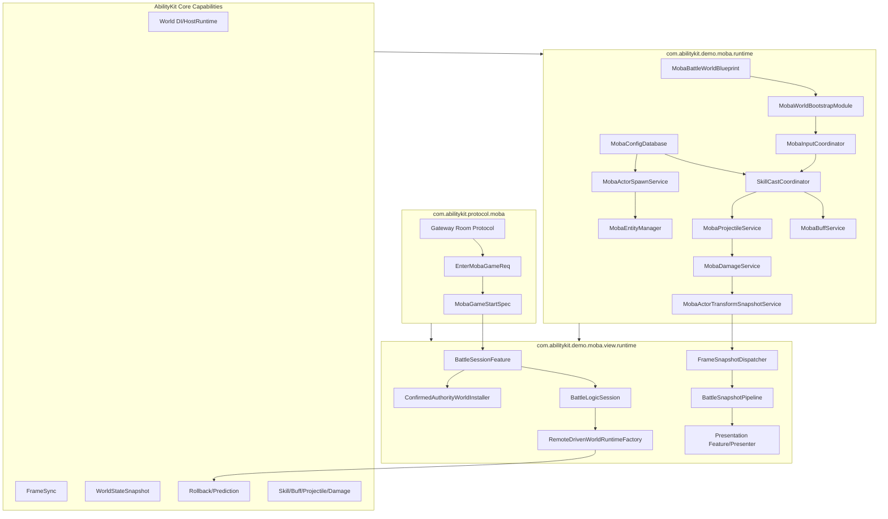
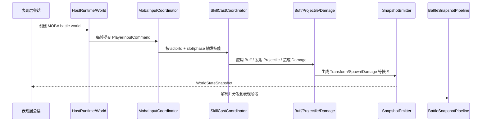

# MOBA Demo 专题总览

> 本目录把 MOBA 示例从单篇概览拆成多个专题。MOBA 示例的价值不只是“跑一个战斗 Demo”，而是展示 AbilityKit 如何把逻辑世界、Entitas、配置、输入、技能、Buff、Projectile、Damage、Snapshot、表现层与预测回滚组合成一条完整玩法生产线。

## 1. 拆分理由

MOBA 示例已经进一步拆成更细专题，便于单独阅读每个设计点：

| 专题 | 关注点 | 文档 |
|------|--------|------|
| 世界启动 | WorldBlueprint、WorldProfile、Module、服务注册、生命周期 | [01-世界启动与运行时装配](01-WorldAndBootstrap.md) |
| DI 与 System/Service 协作 | MobaServicesAutoModule、WorldService、WorldInject、System 调度、测试友好协作 | [12-DI 与 System/Service 协作深潜](12-DIAndSystemServiceCollaborationDeepDive.md) |
| 输入与技能 | PlayerInputCommand、MobaInputCoordinator、SkillCastCoordinator、技能槽与输入阶段 | [02-技能执行深潜](05-SkillExecutionDeepDive.md) |
| 配置与实体 | MobaConfigDatabase、DTO/Bytes/Resources、MobaEntityManager、SpawnService | [03-配置、实体索引与生成深潜](06-ConfigEntitySpawnDeepDive.md) |
| 战斗服务 | BuffLifecycle、ProjectileService、DamageService、快照事件 | [03-Buff、Projectile 与 Damage 管线](03-BuffProjectileDamage.md) |
| Trace/Context/Effect | TraceTreeRegistry、MobaTraceRegistry、LineageInput、CombatExecutionContext、EffectInvoker | [09-Trace、Context 与 Effect 执行深潜](09-TraceContextEffectDeepDive.md) |
| Trigger/Validation/Presentation Cue | TriggerExecutionGateway、Owner-bound Subscription、RuntimeValidation、StageTrigger、PresentationCue | [10-Trigger、Validation 与 Presentation Cue 深潜](10-TriggerValidationPresentationDeepDive.md) |
| PlanActions/Continuous Runtime | ActionSchema、PlanActionModule、ContinuousRuntimeView、LifecycleBinder、ContextSourceBoundary | [11-PlanActions DSL 与 Continuous Runtime 深潜](11-PlanActionsAndContinuousRuntimeDeepDive.md) |
| 工业化流程 | 单元测试、Console smoke、trace artifact、DSL/配置环境测试、CI 分层门禁 | [工程质量：MOBA 与 Shooter 示例工业化流程](../../10-EngineeringQuality/03-MobaShooterIndustrializationFlow.md) |
| Continuous 能力组合设计 | stack、periodic、cue、tag、modifier 与领域 runtime 的组合边界 | [13-持续行为能力组合设计](13-ContinuousCapabilityCompositionDesign.md) |
| 四英雄技能正式实现 | 廉颇、小乔、赵云、墨子的技能/被动需求映射、TriggerPlan、Buff、Projectile、Counter 与验证路径 | [14-四英雄技能正式实现设计](14-HeroSkillFormalDesign.md) |
| 技能 Flow 与 Pipeline 配置 | skills.json、skill_flows.json、Phase Type、Timeline、RulePlan、Sequence、WaitUntil 与 Pipeline 持续标签模板 | [18-技能 Flow 与 Pipeline 配置设计](18-SkillFlowPipelineConfigDesign.md) |
| 联机会话与协议契约 | Gateway room、EnterGame、BattleSessionFeature、RuntimePort、远程/确认辅助世界 | [15-联机会话与协议契约](15-OnlineSessionAndProtocolContract.md) |
| 领域连续运行时与临时实体生命周期 | Motion source、motion.hit、Summon owner/root-owner、容量策略、trace、despawn、gameplay trigger 绑定 | [16-领域连续运行时与临时实体生命周期](16-DomainContinuousRuntimeAndTemporaryEntityLifecycle.md) |
| 主动/被动/Buff/Projectile/AOE 触发效果 | 主动技能、被动 owner-bound、Buff 生命周期、Projectile stage、AOE stage 到 TriggerPlan 与领域服务的完整链路 | [17-主动、被动、Buff、Projectile 与 AOE 触发效果设计](17-ActivePassiveBuffProjectileAoeTriggerEffects.md) |
| 快照与表现 | WorldStateSnapshot、SnapshotBuffer、FrameSnapshotDispatcher、BattleSnapshotPipeline | [04-快照、表现层与预测回滚](04-SnapshotPresentationPrediction.md) |
| 远程驱动 | RemoteDrivenWorldRuntimeFactory、ClientPredictionDriverModule、RollbackRegistry | [04-快照、表现层与预测回滚](04-SnapshotPresentationPrediction.md) |

## 2. 源码分层

## 3. 端到端主流程

## 4. 源码阅读路径

1. [01-世界启动与运行时装配](01-WorldAndBootstrap.md)：MOBA world 的创建、模块装配和生命周期入口。
2. [12-DI 与 System/Service 协作深潜](12-DIAndSystemServiceCollaborationDeepDive.md)：服务注册、System 调度和业务服务分层。
3. [15-联机会话与协议契约](15-OnlineSessionAndProtocolContract.md)：Gateway room、EnterGame、BattleSessionFeature、RuntimePort 与辅助世界安装。
4. [02-技能执行深潜](05-SkillExecutionDeepDive.md)：输入如何转换为技能释放请求。
5. [03-配置、实体索引与生成深潜](06-ConfigEntitySpawnDeepDive.md)：配置、索引与生成如何支撑战斗实体。
6. [03-Buff、Projectile 与 Damage 管线](03-BuffProjectileDamage.md)：技能效果如何落到 Buff、Projectile 和 Damage 状态变化。
7. [09-Trace、Context 与 Effect 执行深潜](09-TraceContextEffectDeepDive.md)：效果执行的来源、父子 trace 与验收结构。
8. [10-Trigger、Validation 与 Presentation Cue 深潜](10-TriggerValidationPresentationDeepDive.md)：触发器订阅、运行时校验、阶段触发与表现 Cue。
9. [11-PlanActions DSL 与 Continuous Runtime 深潜](11-PlanActionsAndContinuousRuntimeDeepDive.md)：配置动作 DSL、强类型 action module、持续运行时查询与上下文边界。
10. [工程质量：MOBA 与 Shooter 示例工业化流程](../../10-EngineeringQuality/03-MobaShooterIndustrializationFlow.md)：单元测试、Console smoke、trace artifact、DSL/配置环境测试和 CI 分层门禁如何保护示例闭环。
11. [13-持续行为能力组合设计](13-ContinuousCapabilityCompositionDesign.md)：stack、periodic、cue、tag、modifier 与领域 runtime 的组合边界。
12. [14-四英雄技能正式实现设计](14-HeroSkillFormalDesign.md)：廉颇、小乔、赵云、墨子如何通过 TriggerPlan、Buff、Projectile、Counter 与通用 predicate 落地。
13. [18-技能 Flow 与 Pipeline 配置设计](18-SkillFlowPipelineConfigDesign.md)：skills.json、skill_flows.json、Phase Type、Timeline、RulePlan、Sequence、WaitUntil 与 Pipeline 持续标签模板如何按源码闭环。
14. [16-领域连续运行时与临时实体生命周期](16-DomainContinuousRuntimeAndTemporaryEntityLifecycle.md)：Motion source、motion.hit、Summon 生命周期与 gameplay trigger 绑定如何按源码闭环。
15. [17-主动、被动、Buff、Projectile 与 AOE 触发效果设计](17-ActivePassiveBuffProjectileAoeTriggerEffects.md)：主动技能、被动 owner-bound、Buff、Projectile stage 与 AOE stage 如何进入 TriggerPlan 并落到领域服务。
16. [04-快照、表现层与预测回滚](04-SnapshotPresentationPrediction.md)：逻辑结果如何同步到客户端表现。

## 5. 关键源码入口

| 主题 | 源码 |
|------|------|
| Battle Blueprint | `Unity/Packages/com.abilitykit.demo.moba.runtime/Runtime/Worlds/Blueprints/MobaBattleWorldBlueprint.cs` |
| World Bootstrap | `Unity/Packages/com.abilitykit.demo.moba.runtime/Runtime/Application/Systems/MobaWorldBootstrapModule.cs` |
| 服务自动注册 | `Unity/Packages/com.abilitykit.demo.moba.runtime/Runtime/Application/Systems/Bootstrap/MobaServicesAutoModule.cs` |
| System 顺序与协作 | `Unity/Packages/com.abilitykit.demo.moba.runtime/Runtime/Application/Systems/MobaSystemOrder.cs`、`Unity/Packages/com.abilitykit.demo.moba.runtime/Runtime/Application/Systems/MobaWorldSystemExecution.cs` |
| 服务基类 | `Unity/Packages/com.abilitykit.demo.moba.runtime/Runtime/Application/Services/Templates/GameServiceBase.cs` |
| 输入协调 | `Unity/Packages/com.abilitykit.demo.moba.runtime/Runtime/Application/Services/Input/MobaInputCoordinator.cs` |
| 技能释放 | `Unity/Packages/com.abilitykit.demo.moba.runtime/Runtime/Application/Services/Skill/Cast/SkillCastCoordinator.cs` |
| 技能 Flow Pipeline | `Unity/Packages/com.abilitykit.demo.moba.runtime/Runtime/Application/Services/Skill/Pipeline/TableDrivenMobaSkillPipelineLibrary.cs` |
| 技能 Flow DTO | `Unity/Packages/com.abilitykit.demo.moba.share/Runtime/Game/Config/Dto/SkillDtos.cs` |
| 配置门面 | `Unity/Packages/com.abilitykit.demo.moba.runtime/Runtime/Infrastructure/Config/Core/MobaConfigDatabase.cs` |
| 实体索引 | `Unity/Packages/com.abilitykit.demo.moba.runtime/Runtime/Application/Services/EntityManager/MobaEntityManager.cs` |
| Actor 生成 | `Unity/Packages/com.abilitykit.demo.moba.runtime/Runtime/Application/Services/EntityConstruction/MobaActorSpawnService.cs` |
| Buff 服务 | `Unity/Packages/com.abilitykit.demo.moba.runtime/Runtime/Application/Services/Buffs/MobaBuffService.cs` |
| Projectile 服务 | `Unity/Packages/com.abilitykit.demo.moba.runtime/Runtime/Application/Services/Projectile/MobaProjectileService.cs` |
| Damage 服务 | `Unity/Packages/com.abilitykit.demo.moba.runtime/Runtime/Application/Services/Combat/MobaDamageService.cs` |
| Trace Registry | `Unity/Packages/com.abilitykit.demo.moba.runtime/Runtime/Application/Services/Trace/MobaTraceRegistry.cs` |
| Effect Lineage | `Unity/Packages/com.abilitykit.demo.moba.runtime/Runtime/Application/Services/Context/Lineage/MobaEffectLineageInput.cs` |
| Combat Context | `Unity/Packages/com.abilitykit.demo.moba.runtime/Runtime/Application/Services/Context/Execution/MobaCombatExecutionContext.cs` |
| Effect Invoker | `Unity/Packages/com.abilitykit.demo.moba.runtime/Runtime/Application/Services/Effect/MobaEffectInvokerService.cs` |
| Transform Snapshot | `Unity/Packages/com.abilitykit.demo.moba.runtime/Runtime/Application/Services/Actor/MobaActorTransformSnapshotService.cs` |
| Trigger Execution Gateway | `Unity/Packages/com.abilitykit.demo.moba.runtime/Runtime/Application/Services/Triggering/MobaTriggerExecutionGateway.cs` |
| Stage Trigger Service | `Unity/Packages/com.abilitykit.demo.moba.runtime/Runtime/Application/Services/Triggering/MobaStageTriggerService.cs` |
| Trigger Subscription | `Unity/Packages/com.abilitykit.demo.moba.runtime/Runtime/Application/Services/Triggering/MobaTriggerPlanSubscriptionService.cs` |
| Runtime Validation | `Unity/Packages/com.abilitykit.demo.moba.runtime/Runtime/Application/Services/Validation/MobaRuntimeValidation.cs` |
| Presentation Cue | `Unity/Packages/com.abilitykit.demo.moba.runtime/Runtime/Application/Services/Triggering/Cue/MobaPresentationTriggerCue.cs` |
| PlanAction Schema | `Unity/Packages/com.abilitykit.demo.moba.runtime/Runtime/Application/Services/Triggering/PlanActions/Core/MobaPlanActionSchemaBase.cs` |
| PlanAction Module | `Unity/Packages/com.abilitykit.demo.moba.runtime/Runtime/Application/Services/Triggering/PlanActions/Core/MobaPlanActionModuleBase.cs` |
| Area Sync | `Unity/Packages/com.abilitykit.demo.moba.runtime/Runtime/Application/Systems/Area/MobaAreaSyncSystem.cs` |
| Continuous Query | `Unity/Packages/com.abilitykit.demo.moba.runtime/Runtime/Application/Services/Continuous/MobaContinuousRuntimeQueryService.cs` |
| Continuous View | `Unity/Packages/com.abilitykit.demo.moba.runtime/Runtime/Application/Services/Continuous/MobaContinuousRuntimeViews.cs` |
| Motion Continuous Runtime | `Unity/Packages/com.abilitykit.demo.moba.runtime/Runtime/Application/Services/Motion/MobaMotionContinuousRuntime.cs` |
| Motion Tick | `Unity/Packages/com.abilitykit.demo.moba.runtime/Runtime/Application/Systems/Motion/MobaMotionTickSystem.cs` |
| Motion Hit Trigger | `Unity/Packages/com.abilitykit.demo.moba.runtime/Runtime/Application/Services/Motion/MobaMotionHitTriggerService.cs` |
| Summon Service | `Unity/Packages/com.abilitykit.demo.moba.runtime/Runtime/Application/Services/Summon/MobaSummonService.cs` |
| Summon Lifecycle | `Unity/Packages/com.abilitykit.demo.moba.runtime/Runtime/Application/Systems/Summon/MobaSummonLifecycleSystem.cs` |
| Summon Source Context | `Unity/Packages/com.abilitykit.demo.moba.runtime/Runtime/Application/Services/Summon/SummonSourceContext.cs` |
| Gameplay Trigger Binding | `Unity/Packages/com.abilitykit.demo.moba.runtime/Runtime/Application/Gameplay/Triggering/MobaGameplayTriggerBindingService.cs` |
| MOBA Tests | `src/AbilityKit.Demo.Moba.Tests/AbilityKit.Demo.Moba.Tests.csproj`、`src/AbilityKit.Demo.Moba.Tests/Smoke/ConsoleMobaSmokeFlowTests.cs` |
| MOBA Smoke Artifact | `src/AbilityKit.Demo.Moba.Tests/Smoke/ConsoleSmokeTraceArtifactExporter.cs` |
| 会话门面 | `Unity/Packages/com.abilitykit.demo.moba.view.runtime/Runtime/Game/Battle/Client/Session/Features/Core/BattleSessionFeature.cs` |
| Gateway 房间协议 | `Unity/Packages/com.abilitykit.protocol.moba/Runtime/Room/WireRoomGatewayTypes.cs` |
| 进场协议 | `Unity/Packages/com.abilitykit.protocol.moba/Runtime/EnterGame/EnterMobaGameStructs.cs` |
| 运行时端口 | `Unity/Packages/com.abilitykit.demo.moba.runtime/Runtime/Application/Services/IO/IMobaBattleRuntimePort.cs` |
| 远程驱动 | `Unity/Packages/com.abilitykit.demo.moba.view.runtime/Runtime/Game/Battle/Client/Session/Features/Sim/RemoteDrivenWorldRuntimeFactory.cs` |
| 快照路由 | `Unity/Packages/com.abilitykit.demo.moba.view.runtime/Runtime/Game/Battle/Client/SnapshotRouting/FrameSnapshotDispatcher.cs` |
