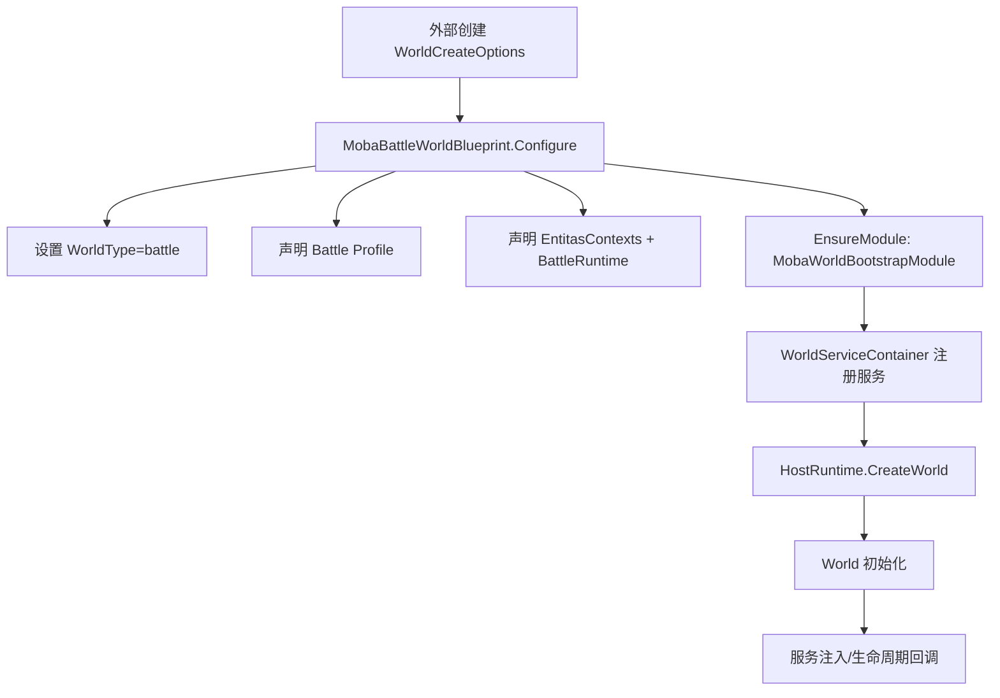
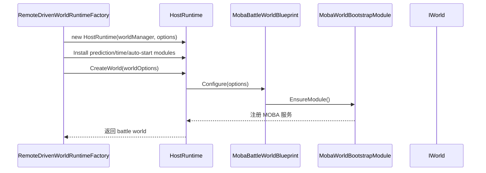

# MOBA 世界启动与运行时装配

> 本文拆解 MOBA 示例如何从 WorldBlueprint 进入 AbilityKit World/Host 体系，以及为什么示例把战斗世界、服务注册、Entitas 上下文和 BattleRuntime 模块放在独立启动链路中。

## 1. 设计目标

MOBA 示例的世界启动层解决三个问题：

1. **明确世界类型**：把 battle 世界和其他逻辑世界区分开。
2. **声明能力组合**：战斗世界需要 EntitasContexts 和 BattleRuntime。
3. **隔离模块装配**：WorldBlueprint 只负责声明，具体服务由 BootstrapModule 注册。

这种结构让 Demo 可以同时支持：

- 本地单机战斗；
- 客户端远程驱动战斗；
- 服务端权威世界；
- 测试环境下的 headless world。

## 2. Blueprint 职责

`MobaBattleWorldBlueprint` 是战斗世界入口，它继承 MOBA 逻辑世界 Blueprint 基类，核心声明包括：

| 声明 | 含义 |
|------|------|
| `WorldType = "battle"` | 让 HostRuntime 能按类型创建战斗世界 |
| `Profile = Battle` | 标记当前世界使用战斗 profile |
| `Features = EntitasContexts | BattleRuntime` | 声明需要 Entitas 与战斗运行时能力 |
| `MobaWorldBootstrapModule` | 注入 MOBA 战斗服务集合 |

## 3. 启动链路

## 4. 为什么 Blueprint 不直接注册所有服务

MOBA 示例把 `MobaBattleWorldBlueprint` 做得很薄，这是设计上的取舍：

- Blueprint 只描述“要创建什么世界”；
- Module 描述“这个世界需要哪些服务”；
- Service 自己通过 `WorldService`、`WorldInject` 或显式注册进入容器；
- 远程驱动/测试/服务端可以复用同一个 Blueprint，但替换输入源、时间源或 rollback registry。

## 5. 与 HostRuntime 的关系

客户端表现层的 `RemoteDrivenWorldRuntimeFactory` 会创建：

1. `WorldManager`；
2. `HostRuntime`；
3. runtime modules；
4. battle world options；
5. battle world。

它不会绕过 Blueprint，而是把远程帧源、输入源、rollback 构建器等以 options 形式注入。

## 6. 生命周期切入点

MOBA 服务通常会通过以下方式接入生命周期：

| 方式 | 作用 |
|------|------|
| `IService` | 普通世界服务，可被其他服务依赖 |
| `IWorldInitializable` | 世界初始化时准备内部状态或绑定依赖 |
| `WorldInject` | 从世界容器注入依赖 |
| `WorldService` | 声明服务类型与生命周期 |
| SnapshotEmitter | 在帧尾或同步阶段产出 `WorldStateSnapshot` |

## 7. 可扩展点

扩展示例时优先按以下层级接入：

1. 新能力需要跨系统复用：新增 world service。
2. 新能力只影响战斗初始化：扩展 BootstrapModule。
3. 新能力依赖外部输入或网络：通过 runtime factory options 注入。
4. 新能力需要同步到表现层：新增 snapshot emitter 与 view decoder。

## 8. 源码索引

| 模块 | 源码 |
|------|------|
| 战斗 Blueprint | `Unity/Packages/com.abilitykit.demo.moba.runtime/Runtime/Worlds/Blueprints/MobaBattleWorldBlueprint.cs` |
| MOBA 逻辑世界基类 | `Unity/Packages/com.abilitykit.demo.moba.runtime/Runtime/Worlds/Blueprints/MobaLogicWorldBlueprintBase.cs` |
| Bootstrap Module | `Unity/Packages/com.abilitykit.demo.moba.runtime/Runtime/Application/Systems/MobaWorldBootstrapModule.cs` |
| 远程世界创建 | `Unity/Packages/com.abilitykit.demo.moba.view.runtime/Runtime/Game/Battle/Client/Session/Features/Sim/RemoteDrivenWorldRuntimeFactory.cs` |
| 远程 Runtime 模块 | `Unity/Packages/com.abilitykit.demo.moba.view.runtime/Runtime/Game/Battle/Client/Session/Features/Sim/RemoteDrivenRuntimeModuleFactory.cs` |
