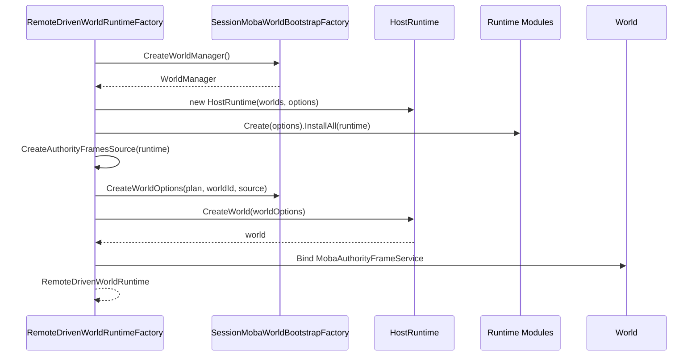

# MOBA 世界启动与运行时装配

> 本文以当前 MOBA runtime 与 view runtime 源码为准，说明 battle world 如何完成类型注册、Blueprint 配置、服务容器构建、Entitas 系统安装、远程帧驱动和会话释放。本文只描述已有实现，不把可替换能力当作已实现能力。

## 1. 责任边界

MOBA 世界启动不是单个 Bootstrap 类完成的，而是由五层协作：

| 层级 | 当前责任 | 不负责 |
|------|----------|--------|
| `WorldTypeRegistry` / `WorldBlueprintRegistry` | 注册 world type 与 Blueprint | 创建战斗服务实例 |
| `MobaBattleWorldBlueprint` | 声明 battle profile、feature 位集和 Bootstrap Module | 解析战斗计划、安装客户端预测 |
| `WorldContainerBuilder` | 注册按 Attribute 扫描出的服务、配置模块和会话实例 | 决定 Entitas system 执行顺序 |
| `MobaWorldBootstrapModule` | 配置 Bootstrap Flow，扫描并安装 MOBA/Projectile systems | 创建 HostRuntime |
| `RemoteDrivenWorldRuntimeFactory` | 组装 HostRuntime modules、world options、world 和 authority frame 绑定 | 管理整个 BattleSession 的所有表现资源 |

因此，“创建一个 battle world”至少包含两次装配：

1. 会话侧先构造世界工厂、服务容器和 HostRuntime modules；
2. Blueprint 再补充世界级扩展选项、碰撞服务、Entitas context factory 与 Bootstrap Module。

## 2. 世界类型与 Blueprint 注册

`SessionMobaWorldBootstrapFactory.CreateWorldManager()` 同时建立两类注册表：

```text
WorldTypeRegistry
  lobby  -> Entitas world
  battle -> Entitas world

WorldBlueprintRegistry
  lobby  -> MobaLobbyWorldBlueprint
  battle -> MobaBattleWorldBlueprint
```

之后用 `WorldBlueprintWorldFactory` 包装 `RegistryWorldFactory`，最终交给 `WorldManager`。外部创建 `WorldCreateOptions(worldId, worldType)` 时，world type 用于选择 Blueprint；Blueprint 本身并不再写一个通用 `WorldType` 字段。

`MobaBattleWorldBlueprint` 的声明为：

```text
WorldType = "battle"
Profile   = Battle
Features  = EntitasContexts | BattleRuntime
Module    = MobaWorldBootstrapModule
```

其中 `BattleRuntime` 是组合位集：

```text
BootstrapFlow
| InputPort
| SnapshotOutput
| StateSync
| Config
| Skills
| Projectiles
| Triggering
```

这些 feature 当前作为 `MobaLogicWorldBlueprintOptions` 写入 `WorldCreateOptions.Extensions`，供后续组件查询。feature 位本身不会自动注册服务；实际服务仍来自容器扫描、显式模块和 Bootstrap Flow。

## 3. Blueprint 配置顺序

`MobaLogicWorldBlueprintBase.Configure()` 固定执行三个步骤：


### 3.1 Common 配置

`ConfigureCommon()` 执行：

1. 如果调用方没有提供 `ServiceBuilder`，创建 default-only 容器；
2. 注册 singleton `ICollisionService -> CollisionService`；
3. feature 包含 `EntitasContexts` 时，写入 `MobaEntitasContextsFactory`。

调用方已经提供 `ServiceBuilder` 时，Blueprint 会继续在同一 builder 上注册碰撞服务。具体重复注册行为由 builder 的注册语义决定，调用方不应依赖 Blueprint 替换既有服务。

### 3.2 扩展选项

`ConfigureBlueprintOptions()` 创建 `MobaLogicWorldBlueprintOptions` 并按类型键写入 `WorldCreateOptions.Extensions`。消费者通过 `TryGetMobaLogicWorldBlueprintOptions()` 读取，不依赖字符串键。

### 3.3 Module 去重

`EnsureModule<TModule>()` 按运行时精确类型扫描 `options.Modules`：

- 已有同类型实例时不重复添加；
- 子类或其他实现类型不视为同一个 module；
- factory 和 options 为空时立即抛出参数异常。

battle Blueprint 只确保存在一个 `MobaWorldBootstrapModule`，不直接列举全部战斗服务。

## 4. 会话侧服务容器

远程会话通过 `SessionMobaWorldBootstrapFactory.CreateWorldOptions()` 创建 options。其 service builder 使用 Attribute 扫描，程序集包括：

- World service 基础程序集；
- `BattleLogicSession` 所在程序集；
- MOBA runtime / Bootstrap Module 程序集；
- view runtime 的 `BattleSessionFeature` 程序集。

扫描命名空间前缀为 `AbilityKit`。随后显式执行：

1. 添加 `MobaConfigWorldModule`；
2. 可选注册 `WorldInitData`，内容来自启动计划的 create-world opcode/payload；
3. 缺失时注册 singleton `IFrameTime -> FrameTime`；
4. 缺失时注册 singleton `ICollisionService -> CollisionService`；
5. authority frame source 非空时注册该实例。

`registerWorldInitData = false` 只跳过 `WorldInitData`，不会跳过配置、时间或碰撞服务。

## 5. Bootstrap Module 与系统安装

`MobaWorldBootstrapModule` 同时实现 `IWorldModule` 和 `IEntitasSystemsInstaller`。

### 5.1 静态初始化

首次触发类型初始化时：

1. 调用 `MobaBootstrapFlowModule.EnsureInitialized()`，确保 Flow stages 已完成静态注册；
2. 创建共享的 `MobaBootstrapFlow`。

该 Flow 保存在静态只读字段中，因此 module 实例本身不是 Flow 状态的所有者。

### 5.2 服务配置

`Configure(WorldContainerBuilder)` 只委托给 `_flowBootstrap.Configure(builder)`。服务并非在 Blueprint 里逐项手工注册。

### 5.3 Entitas system 安装

`Install(contexts, systems, services)` 先校验三个参数，再执行：

```text
AutoSystemInstaller.Install
  assemblies:
    MobaWorldBootstrapModule assembly
    ProjectileTickSystem assembly
  namespace prefixes:
    AbilityKit.Demo.Moba
    AbilityKit.Combat.Projectile
```

之后调用 `_flowBootstrap.Install(...)`。如果传入的 `IContexts` 不是生成的全局 `Contexts`，当前实现只记录 warning，仍继续自动安装；warning 不代表安装已经失败，也不保证所有依赖生成 Context 的系统可正常工作。

## 6. 远程驱动 HostRuntime

`RemoteDrivenWorldRuntimeFactory.Create()` 的实际顺序如下：



WorldId 直接来自 `options.Plan.World.WorldId`，world type 则来自启动计划。工厂没有把 world type 强制改为 `battle`，因此启动计划必须与已注册类型一致。

## 7. 预测模式与纯远程模式

两种模式都安装同一个 `ClientPredictionDriverModule` 类型，以及：

- `ServerFrameTimeModule(FixedDelta)`；
- `WorldAutoStartModule`。

差异来自参数：

| 参数 | 客户端预测 | 纯远程驱动 |
|------|------------|------------|
| local input source | 使用 options resolver | 固定返回 null |
| input delay | `max(0, InputDelayFrames)` | 0 |
| max prediction ahead | 30 | 0 |
| min prediction window | 1 | 0 |
| rollback | 开启 | 关闭 |
| rollback history | 240 | 0 |
| capture interval | 每帧 | 0 |
| rollback registry | 调用方 builder | 新建空 registry |
| state hash | 调用方 builder | null |

所以“关闭客户端预测”不是移除 prediction driver，而是以零预测窗口、无本地输入、无 rollback 的方式复用同一驱动模块。

## 8. Authority frame 绑定

创建 world 前，工厂尝试从 HostRuntime feature 中获取 `IClientPredictionDriverStats`，成功时包装成 `ClientPredictionDriverStatsFramesSource` 并注册到世界容器。

创建 world 后，再尝试解析 `MobaAuthorityFrameService` 并调用 `BindWorld(world.Id)`。

这两步都是 best-effort：

- feature 查询异常只记录日志并返回 null；
- authority service 缺失不会使创建失败；
- bind 异常也只记录日志。

因此 world 创建成功不等于 authority frame 诊断已经可用。需要通过 readiness/diagnostics 单独验证。

## 9. 生命周期与失败边界

### 9.1 正常释放

`RemoteDrivenWorldRuntime.DestroyWorld()` 委托给 `HostRuntime.DestroyWorld(WorldId)`。BattleSession 的释放链还会通过 `SessionSimRuntimeDisposer` 和 handles 执行 fallback destroy，避免只保存了 runtime、没有保存 wrapper 时无法销毁。

销毁 world 与释放快照路由、表现订阅、confirmed world 是不同动作，由上层 session orchestrator 分别管理。

### 9.2 创建失败

`RemoteDrivenWorldRuntimeFactory.Create()` 当前没有 `try/finally`：

- module 安装失败；
- world options 构造失败；
- `CreateWorld()` 抛出；

这些异常会直接向调用方传播，工厂内部不会自动销毁已经创建的 HostRuntime 或部分 world。调用方若在更外层添加资源，必须在自身失败路径中负责清理。

### 9.3 参数校验边界

`RemoteDrivenWorldRuntimeFactoryOptions` 只归一化负数 `InputDelayFrames`。它不主动校验：

- `Plan` 是否为空；
- remote/local input resolver 是否为空；
- rollback/hash builder 是否与预测开关匹配；
- `FixedDelta` 是否为正数。

最终失败点可能落在 module 构造、world options 构造或运行阶段，集成层应提前验证启动计划。

## 10. 扩展准则

| 需求 | 推荐接入点 |
|------|------------|
| 新增 world 类型 | type registry + Blueprint registry |
| 新增 battle feature 声明 | `MobaLogicWorldFeatures` 与 Blueprint options 消费方 |
| 新增可注入服务 | `WorldService` Attribute 或专用 world module |
| 新增 Entitas system | system Attribute、安装程序集和命名空间范围 |
| 修改启动 Flow | `MobaBootstrapFlow` stage/module |
| 注入网络帧、时间或预测策略 | HostRuntime module / factory options |
| 新增会话资源 | session handles 与 disposer，不放入 Blueprint |

不要只向 feature 位集中增加枚举值并假设能力自动生效；必须同时提供实际服务、系统或 Flow stage，并补充 readiness 验证。

## 11. 验证清单

1. `battle` 同时注册在 world type registry 与 Blueprint registry。
2. Blueprint options 的 profile 为 Battle，feature 包含完整 `BattleRuntime`。
3. `MobaWorldBootstrapModule` 在 options 中只出现一次。
4. world services 能解析配置、输入、快照、技能和 projectile 关键服务。
5. Entitas contexts 使用 `MobaEntitasContextsFactory`。
6. 自动系统安装范围包含 MOBA 与 Projectile assembly/namespace。
7. 预测开启时可解析 driver stats、rollback registry 与 hash calculator。
8. 预测关闭时没有本地输入和 rollback，但仍由远程 driver 推进。
9. authority frame source/binding 的缺失能够通过 diagnostics 暴露。
10. session teardown 分别释放远程 world、confirmed world、快照和表现订阅。
11. 故意制造 world 创建异常时，上层不会遗留自身创建的外部资源。

## 12. 源码索引

| 主题 | 源码 |
|------|------|
| Blueprint 基类与 feature 位集 | `Unity/Packages/com.abilitykit.demo.moba.runtime/Runtime/Worlds/Blueprints/MobaLogicWorldBlueprintBase.cs` |
| Battle Blueprint | `Unity/Packages/com.abilitykit.demo.moba.runtime/Runtime/Worlds/Blueprints/MobaBattleWorldBlueprint.cs` |
| Blueprint 注册 | `Unity/Packages/com.abilitykit.demo.moba.runtime/Runtime/Worlds/Blueprints/MobaWorldBlueprintsRegistration.cs` |
| Bootstrap Module | `Unity/Packages/com.abilitykit.demo.moba.runtime/Runtime/Application/Systems/MobaWorldBootstrapModule.cs` |
| 会话世界工厂与服务容器 | `Unity/Packages/com.abilitykit.demo.moba.view.runtime/Runtime/Game/Battle/Client/Session/Features/Controllers/SessionMobaWorldBootstrapFactory.cs` |
| 远程 world runtime 工厂 | `Unity/Packages/com.abilitykit.demo.moba.view.runtime/Runtime/Game/Battle/Client/Session/Features/Sim/RemoteDrivenWorldRuntimeFactory.cs` |
| 远程 HostRuntime modules | `Unity/Packages/com.abilitykit.demo.moba.view.runtime/Runtime/Game/Battle/Client/Session/Features/Sim/RemoteDrivenRuntimeModuleFactory.cs` |
| 远程 world 安装 | `Unity/Packages/com.abilitykit.demo.moba.view.runtime/Runtime/Game/Battle/Client/Session/Features/Sim/RemoteDrivenWorldInstaller.cs` |
| 会话模拟释放 | `Unity/Packages/com.abilitykit.demo.moba.view.runtime/Runtime/Game/Battle/Client/Session/Features/Sim/SessionSimRuntimeDisposer.cs` |
| 远程 handles | `Unity/Packages/com.abilitykit.demo.moba.view.runtime/Runtime/Game/Battle/Client/Session/Features/Core/BattleSessionHandles.RemoteDriven.cs` |
