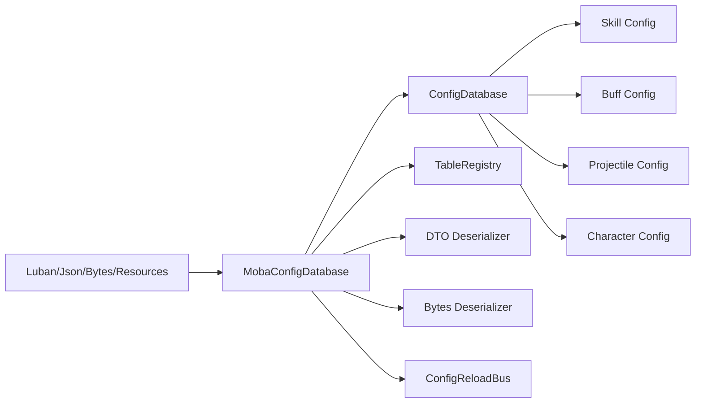
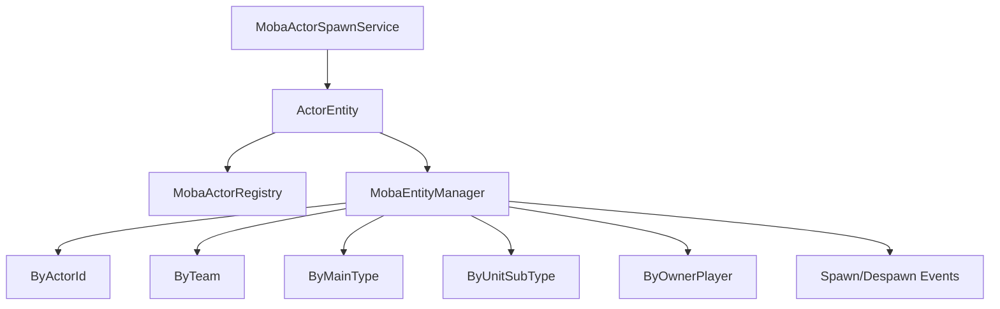
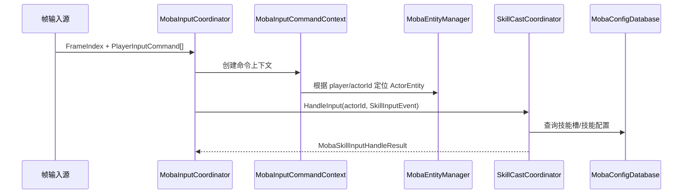

# MOBA 输入、技能、配置与实体索引

> 本文说明 MOBA 示例中“玩家输入如何定位 Actor、如何触发技能、技能如何读取配置、实体如何被索引和生成”。这是从用户操作到战斗能力执行的前半段主链路。

## 1. 设计目标

这一层负责把外部帧输入转换为确定性战斗行为：

- 输入必须带帧号，便于 frame sync、预测与回滚。
- 输入必须能定位玩家控制的 actor。
- 技能释放必须能按 slot、阶段和策略执行。
- 技能、Buff、Projectile、角色等配置必须统一读取。
- Actor 必须有稳定的 actorId 与实体索引。

## 2. 输入协调器

`MobaInputCoordinator` 继承通用逻辑世界输入协调基类，核心职责是：

1. 绑定输入 handler；
2. 准备技能执行器；
3. 为每帧输入创建 `MobaInputCommandContext`；
4. 按命令类型分发到 handler；
5. 返回 `MobaInputCommandResult`。

```mermaid
flowchart TD
    A[PlayerInputCommand[]] --> B[MobaInputCoordinator]
    B --> C[CreateContext]
    C --> D[MobaInputCommandContext]
    D --> E[玩家到 Actor 映射]
    D --> F[MobaEntityManager]
    D --> G[SkillCastCoordinator]
    B --> H[InputCommandHandlers]
    H --> I[移动/技能/交互命令]
    I --> J[MobaInputCommandResult]
```

## 3. 技能释放协调器

`SkillCastCoordinator` 把“输入”转成“技能运行时动作”。

它支持：

- 按技能槽释放；
- 输入事件驱动释放；
- 返回失败原因；
- 控制并行释放；
- 控制是否中断运行中技能。

关键设计点是 `SkillCastPolicy`：

| 字段 | 含义 |
|------|------|
| `AllowParallel` | 是否允许多个技能并行 |
| `InterruptRunning` | 是否中断正在运行的技能 |

这让同一套技能释放接口能适配普通攻击、主动技能、引导技能、蓄力技能等不同策略。

## 4. 配置门面

`MobaConfigDatabase` 是 MOBA 示例的配置门面。它包装底层 `ConfigDatabase`，并对外提供统一加载与重载能力。

它支持的输入源包括：

- TextSink；
- Resources；
- DTO Provider；
- DTO Arrays；
- Bytes；
- 热重载源。



配置门面让技能、Buff、Projectile、角色生成服务不必关心配置来源，只依赖统一查询接口。

## 5. Actor 生成服务

`MobaActorSpawnService` 把 `MobaActorBuildSpec` 转成 Entitas `ActorEntity`。

生成请求中有多个关键开关：

| 字段 | 作用 |
|------|------|
| `Spec` | Actor 构造规格 |
| `AllocateActorIdIfMissing` | 缺失 actorId 时是否自动分配 |
| `RegisterActor` | 是否注册到 ActorRegistry |
| `RegisterEntityManager` | 是否注册到 EntityManager |
| `RegisterEntityManagerFromEntity` | 是否从实体组件反推索引 |
| `PostSetup` | 构造后的后处理 |
| `Initializer` | 初始化回调 |
| `OnActorBuilt` | 构造完成回调 |

这套请求对象把“构造实体”和“注册到战斗索引”分开，使测试、投射物临时实体、召唤物、英雄单位可以共享生成管线。

## 6. 实体索引

`MobaEntityManager` 维护 actorId 到 Entitas entity 的映射，同时提供多个二级索引：

| 索引 | 用途 |
|------|------|
| actorId | 精确定位实体 |
| Team | 阵营查询 |
| EntityMainType | 主类型查询 |
| UnitSubType | 子类型查询 |
| OwnerPlayer | 玩家拥有关系查询 |



## 7. 输入到技能的完整路径



## 8. 源码索引

| 模块 | 源码 |
|------|------|
| 输入协调 | `Unity/Packages/com.abilitykit.demo.moba.runtime/Runtime/Application/Services/Input/MobaInputCoordinator.cs` |
| 输入上下文 | `Unity/Packages/com.abilitykit.demo.moba.runtime/Runtime/Application/Services/Input/MobaInputCommandContext.cs` |
| 技能释放协调 | `Unity/Packages/com.abilitykit.demo.moba.runtime/Runtime/Application/Services/Skill/Cast/SkillCastCoordinator.cs` |
| 配置门面 | `Unity/Packages/com.abilitykit.demo.moba.runtime/Runtime/Infrastructure/Config/Core/MobaConfigDatabase.cs` |
| 实体索引 | `Unity/Packages/com.abilitykit.demo.moba.runtime/Runtime/Application/Services/EntityManager/MobaEntityManager.cs` |
| Actor 生成 | `Unity/Packages/com.abilitykit.demo.moba.runtime/Runtime/Application/Services/EntityConstruction/MobaActorSpawnService.cs` |
