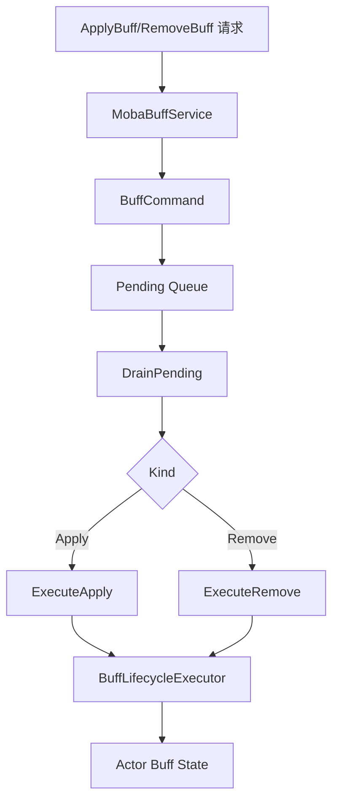
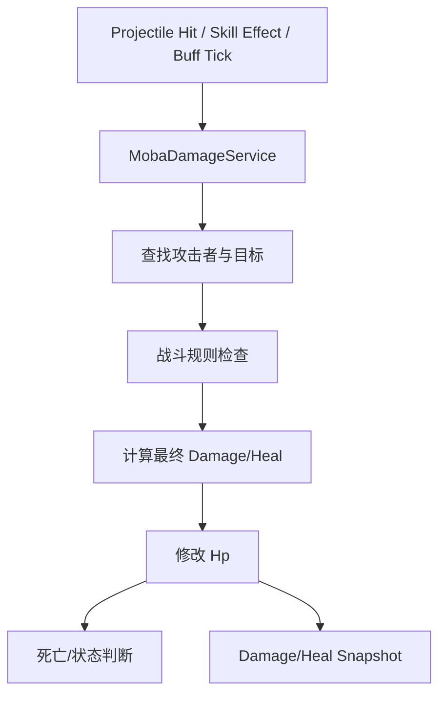
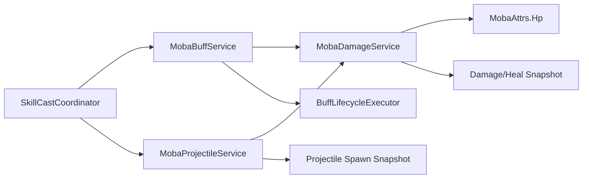

# MOBA Buff、Projectile 与 Damage 管线

> 本文拆解 MOBA 示例里技能效果如何落到战斗状态：Buff 如何排队与执行，Projectile 如何把配置发射转换成实体与弹道，Damage 如何修改属性并产出同步事件。

## 1. 管线定位

输入和技能释放只是前半段，真正影响战斗结果的是三类服务：

| 服务 | 负责内容 |
|------|----------|
| `MobaBuffService` | Buff 申请、移除、生命周期调和、命令队列 |
| `MobaProjectileService` | 投射物发射、Actor 绑定、命中过滤、弹道服务转译 |
| `MobaDamageService` | 伤害/治疗应用、规则检查、属性修改、结果快照 |

它们共同形成 MOBA 示例的战斗效果主链路。

## 2. Buff 命令队列

`MobaBuffService` 没有把所有 apply/remove 立即展开成复杂逻辑，而是先封装为命令：

- `Apply`
- `Remove`

命令携带序号、buffId、targetActorId 和请求体。服务在 `DrainPending()` 阶段统一消费。



这种设计解决了三个问题：

1. 避免 Buff 执行过程中递归修改集合。
2. 让同一帧内的 Buff 申请有稳定顺序。
3. 让生命周期调和可以统一处理过期、移除和叠层。

## 3. Projectile 发射与 Actor 绑定

`MobaProjectileService` 同时实现发射执行器和运行时接口。它的核心职责是把“技能配置里的发射意图”转成：

- 一个 MOBA Actor；
- 一个 ProjectileService 内部 projectile；
- 一个 projectileId 到 actorId 的链接；
- 一个 spawn snapshot；
- 一组命中过滤规则。

```mermaid
sequenceDiagram
    participant Skill as 技能运行时
    participant MobaProj as MobaProjectileService
    participant Spawn as MobaActorSpawnService
    participant CoreProj as IProjectileService
    participant Link as MobaProjectileLinkService
    participant Snapshot as SpawnSnapshotService

    Skill->>MobaProj: LaunchProjectile(request)
    MobaProj->>Spawn: 创建 projectile Actor
    Spawn-->>MobaProj: ActorEntity + actorId
    MobaProj->>CoreProj: Spawn(ProjectileSpawnParams)
    CoreProj-->>MobaProj: projectileId
    MobaProj->>Link: 绑定 projectileId -> actorId
    MobaProj->>Snapshot: 记录生成快照
```

## 4. 命中过滤

Projectile 服务需要避免不合法命中，例如：

- 自己命中自己；
- 同队命中；
- 不满足技能目标规则；
- projectile 已失效；
- 目标不存在或死亡。

MOBA 示例把这些逻辑集中在发射/命中过滤阶段，而不是散落到表现层。

## 5. Damage 与 Heal

`MobaDamageService` 提供两个核心入口：

- `ApplyDamage(attackerActorId, targetActorId, damageType, value, reasonKind, reasonParam)`
- `ApplyHeal(healerActorId, targetActorId, healType, value, reasonKind, reasonParam)`

它会处理：

1. 查找 attacker/healer 与 target；
2. 应用战斗规则；
3. 修改 `MobaAttrs.Hp`；
4. 生成伤害/治疗结果；
5. 输出快照或事件。



## 6. 三者协作关系



## 7. 设计约束

- Buff 申请不能在任意回调里直接递归展开。
- Projectile 必须同时存在逻辑弹道和 MOBA Actor 表达。
- Damage 不应该依赖表现层对象。
- 快照输出必须从权威逻辑状态产生。
- 伤害原因字段要保留，便于表现、回放和统计复用。

## 8. 源码索引

| 模块 | 源码 |
|------|------|
| Buff 服务 | `Unity/Packages/com.abilitykit.demo.moba.runtime/Runtime/Application/Services/Buffs/MobaBuffService.cs` |
| Buff 生命周期执行 | `Unity/Packages/com.abilitykit.demo.moba.runtime/Runtime/Application/Services/Buffs/BuffLifecycleExecutor.cs` |
| Projectile 服务 | `Unity/Packages/com.abilitykit.demo.moba.runtime/Runtime/Application/Services/Projectile/MobaProjectileService.cs` |
| Projectile 链接 | `Unity/Packages/com.abilitykit.demo.moba.runtime/Runtime/Application/Services/Projectile/MobaProjectileLinkService.cs` |
| Damage 服务 | `Unity/Packages/com.abilitykit.demo.moba.runtime/Runtime/Application/Services/Combat/MobaDamageService.cs` |
| Actor 生成 | `Unity/Packages/com.abilitykit.demo.moba.runtime/Runtime/Application/Services/EntityConstruction/MobaActorSpawnService.cs` |
