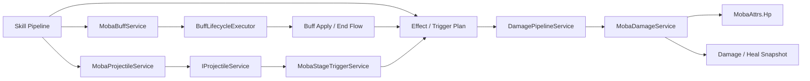
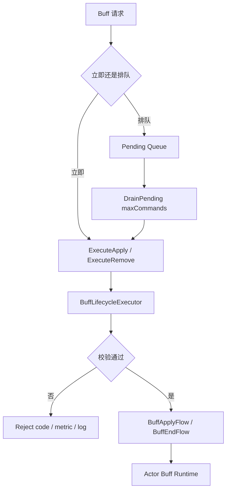
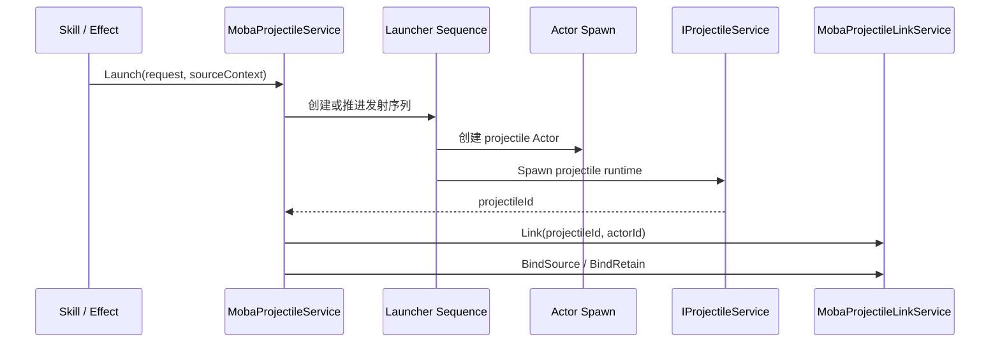
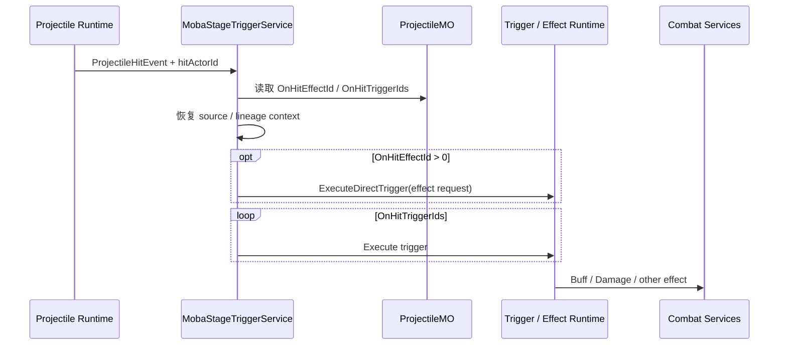

# MOBA Buff、Projectile 与 Damage 管线

> 本文给出 MOBA 战斗效果主链路的源码级总览，说明技能 Pipeline 如何通过 Buff、Projectile、Trigger/Effect 与 Damage 服务改变权威状态。Buff 与 Projectile 的完整生命周期分别见 [07-Buff 生命周期深潜](07-BuffLifecycleDeepDive.md) 和 [08-Projectile 与 Damage 深潜](08-ProjectileDamageDeepDive.md)。

## 1. 边界与结论

这三类能力不是一条固定的直连管线，而是可由技能、Trigger 和 Effect 组合的运行时能力：

| 能力 | 主要责任 | 不负责 |
|------|----------|--------|
| `MobaBuffService` | Buff 即时/排队申请、实例移除、命令排空、持续态调和 | 决定所有技能效果、计算最终伤害 |
| `BuffLifecycleExecutor` | 校验 apply/remove、调用生命周期 Flow、结束并回收 runtime | 调度每帧命令队列 |
| `MobaProjectileService` | 直接/配置化发射、launcher 与 projectile runtime、Actor/来源绑定 | 直接计算或落地伤害 |
| `MobaStageTriggerService` | 将 projectile spawn/tick/hit/exit 转成配置化 Trigger/Effect 调用 | 替代底层弹道模拟 |
| `DamagePipelineService` | 伤害公式、减伤、护盾、最终值、事件与 trace | 直接拥有实体 HP |
| `MobaDamageService` | 把已计算的正数写入 HP、clamp、报告 damage/heal 快照 | 暴击、减伤、护盾计算和死亡状态机 |

关键结论：

- Projectile 命中不会无条件调用 `MobaDamageService`，而是先执行 `OnHitEffectId` 和 `OnHitTriggerIds`；
- `DamagePipelineService` 产生最终伤害，`MobaDamageService` 只落地数值；
- Buff 既有立即执行入口，也有排队入口，不能把所有 apply/remove 都描述成延迟命令；
- 当前 projectile 命中过滤只明确拒绝无效 collider、自身和同队目标，不负责存活、可见、无敌或任意技能目标规则。

## 2. 组合关系



箭头表达允许的调用方向，不表示每个技能必须经过全部节点。例如纯控制技能可以只施加 Buff，治疗 Effect 可以直接进入 heal 落地，而无 `OnHitEffectId`/`OnHitTriggerIds` 的 projectile 命中不会自动产生伤害。

## 3. Buff：即时入口与命令队列

`MobaBuffService` 提供两类入口：

- `ApplyBuffImmediate()`、`ApplyBuffInstanceImmediate()`、`RemoveBuffImmediate()` 等立即执行入口；
- 内部排队的 apply/remove 命令，由 `DrainPending(maxCommands)` 按入队顺序消费。

排队用于隔离回调中的重入修改，立即入口则用于调用方已经处在安全边界、需要同步获得成功结果的场景。两者最终都会进入 `BuffLifecycleExecutor`，因此生命周期校验和结束语义不会分叉。



### 3.1 实例身份

仅使用 `buffId + sourceActorId` 不能区分同一来源的多次独立施加。实例化入口额外传递 `sourceContextId`，配合 `forceNewInstance` 与来源上下文实现精确 apply/remove。调用方需要移除某一次施加时，应优先保存并使用该实例身份，而不是按 buffId 批量清理。

### 3.2 每帧调和

`ReconcileActorBuffLifecycles()` 会同步 continuous runtime 状态，并检查持续过程结束、tag 条件和生命周期终止条件。结束路径由 executor 统一执行，避免“从列表删除了 Buff，但没有运行 End Flow 或释放资源”。

### 3.3 队列边界

`DrainPending(maxCommands)` 的上限是防止同帧回调持续生成新命令导致无界执行。达到上限意味着剩余命令留待后续调度，不应被解释为申请失败。需要观察拒绝码、队列积压和每帧 drain 数量来区分业务拒绝与调度背压。

## 4. Projectile：发射、身份与来源

`MobaProjectileService` 有两条主要创建路径：

| 路径 | 适用场景 | 主要行为 |
|------|----------|----------|
| `Shoot()` | 已知速度、寿命、距离等运行参数的直接发射 | 创建 projectile Actor 和底层 projectile runtime |
| `Launch()` / `TryStartLaunch()` | 由 `ProjectileLauncherMO`、`ProjectileMO` 驱动的配置化发射 | 支持多发、扇形、持续序列和 launcher 生命周期 |

配置化 Launch 可能先创建 launcher Actor，再按序列产生一个或多个 projectile。launcher Actor 与真正参与碰撞的 projectile Actor/runtime 不是同一个身份，诊断时必须区分 `launcherActorId`、`projectileId` 和 projectile Actor id。



`MobaProjectileLinkService` 维护双向 Actor/projectile 映射，以及 projectile/launcher 的 `ProjectileSourceContext` 和技能 runtime retain。命中或退出后，链路用于恢复施法者、目标、配置、trace 来源，并在生命周期结束时消费 retain，避免技能 runtime 被过早回收。

## 5. 命中过滤的真实范围

当前 `MobaTeamProjectileHitFilter.ShouldHit()` 明确处理：

1. collider 无效时拒绝；
2. collider 对应 owner 自身时拒绝；
3. owner 与目标 team 相同且 team 有效时拒绝；
4. 其他情况允许进入命中处理。

因此以下能力当前不属于该过滤器的保证：

- 目标是否存活；
- 目标是否可见、可选中或处于无敌状态；
- 技能配置的任意 faction/tag/类型条件；
- projectile 是否已被其他上层规则标记为不可命中。

这些规则若业务需要，应在 Targeting、Trigger condition、Effect 或专用 hit filter 中显式实现，不能仅靠本文档宣称存在。

## 6. 命中到 Trigger/Effect

底层 projectile 产生 `ProjectileHitEvent` 后，`MobaStageTriggerService.ExecuteProjectileHit()` 恢复 projectile 配置和来源上下文，构造 `ProjectileHitArgs`，然后：

1. `OnHitEffectId > 0` 时执行 direct trigger request；
2. 遍历 `OnHitTriggerIds` 执行命中 Trigger；
3. 按配置报告表现 cue；
4. 由后续 Effect/Trigger 决定施加 Buff、伤害或其他动作。



这层转译保留了配置化能力，也意味着排查“命中但不掉血”时应依次检查命中事件、projectile 配置、Trigger/Effect 计划和伤害执行，而不是直接怀疑 HP 写回。

## 7. Damage：计算与落地分离

### 7.1 计算阶段

标准伤害由 `DamagePipelineService.Execute(AttackInfo)` 驱动，依次运行：

1. `MobaBaseDamagePipelineStage`；
2. `MobaDamageMitigationPipelineStage`；
3. `MobaShieldAbsorbPipelineStage`；
4. `MobaFinalDamagePipelineStage`。

Pipeline 还负责公式应用、事件发布、战斗活跃记录和 trace。其输出 `DamageResult` 才是后续可落地的结果。

### 7.2 HP 落地

`MobaDamageService.ApplyDamage()` 接收已经计算出的正数：

```text
newHp = Clamp(oldHp - value, 0, maxHp)
actual = oldHp - newHp
```

只有 `actual > 0` 才写回 HP 并通过 `MobaDamageEventSnapshotService.ReportDamage()` 报告事件。Heal 对应地把 HP 增加并 clamp 到 maxHp，再报告实际治疗量。

`MobaDamageService` 不负责：

- 暴击、护甲、减伤和护盾公式；
- 根据 projectile 配置自动创建伤害；
- HP 到零后的死亡状态机；
- 表现层对象或 VFX。

## 8. 一致性、失败与清理

| 场景 | 当前行为 | 排查重点 |
|------|----------|----------|
| Buff apply/remove 被拒绝 | 返回失败并记录稳定 reject code、metric/log | target、配置、实例身份、生命周期条件 |
| Buff 队列未在本帧排空 | 剩余命令保留到后续 drain | maxCommands、回调重入、队列积压 |
| Projectile Launch 失败 | `MobaProjectileLaunchResult.Failed(error)` | launcher/projectile 配置、时间换算、序列创建 |
| Projectile 命中但无效果 | 命中本身不保证伤害 | OnHit 配置、Trigger plan、Effect condition |
| Damage value 非正或无实际变化 | 返回 0，不报告 damage snapshot | pipeline 输出、当前 HP、clamp |
| Projectile 生命周期结束 | 需要解除 Actor/projectile/source/retain 链接 | link service 与 despawn/exit 路径 |

确定性要求主要包括：同帧 Buff 命令按稳定顺序排空、技能和 projectile 来源上下文可追踪、Damage Pipeline 阶段顺序固定、HP 只由权威世界写回。表现层只消费快照/cue，不参与规则判定。

## 9. 验证清单

- 同一帧排入多个 Buff 命令，确认执行顺序稳定且达到 drain 上限后不会丢失；
- 对同 buffId 创建多个 `sourceContextId` 实例，验证精确移除只结束目标实例；
- 分别验证 direct `Shoot`、单发 Launch、扇形多发和持续 Launch 的 Actor/link 清理；
- 命中自身、同队和敌方，确认过滤结果与当前实现一致；
- 配置无 OnHit effect/trigger 的 projectile，确认命中不会自动扣血；
- 构造基础伤害、减伤、护盾和 HP 下限场景，区分 pipeline 输出与实际落地值；
- 验证 damage/heal snapshot 的 value 是实际 HP 变化量；
- 回放同一输入序列，比较 Buff 实例、projectile 来源、DamageResult 和最终 HP。

## 10. 源码索引

| 模块 | 源码 |
|------|------|
| Buff 服务 | `Unity/Packages/com.abilitykit.demo.moba.runtime/Runtime/Application/Services/Buffs/MobaBuffService.cs` |
| Buff 生命周期执行 | `Unity/Packages/com.abilitykit.demo.moba.runtime/Runtime/Application/Services/Buffs/Lifecycle/BuffLifecycleExecutor.cs` |
| Buff 命令调度 | `Unity/Packages/com.abilitykit.demo.moba.runtime/Runtime/Application/Systems/Buffs/MobaBuffCommandDrainSystem.cs` |
| Projectile 服务 | `Unity/Packages/com.abilitykit.demo.moba.runtime/Runtime/Application/Services/Projectile/MobaProjectileService.cs` |
| Projectile 链接 | `Unity/Packages/com.abilitykit.demo.moba.runtime/Runtime/Application/Services/Projectile/MobaProjectileLinkService.cs` |
| Projectile 阶段 Trigger | `Unity/Packages/com.abilitykit.demo.moba.runtime/Runtime/Application/Services/Triggering/MobaStageTriggerService.cs` |
| Projectile Launch 结果 | `Unity/Packages/com.abilitykit.demo.moba.runtime/Runtime/Application/Services/Projectile/Launch/MobaProjectileLaunchResult.cs` |
| Damage Pipeline | `Unity/Packages/com.abilitykit.demo.moba.runtime/Runtime/Application/Services/Combat/Damage/DamagePipelineService.cs` |
| HP 落地与 Heal | `Unity/Packages/com.abilitykit.demo.moba.runtime/Runtime/Application/Services/Combat/MobaDamageService.cs` |
| Damage/Heal 快照 | `Unity/Packages/com.abilitykit.demo.moba.runtime/Runtime/Application/Services/Snapshot/MobaDamageEventSnapshotService.cs` |
