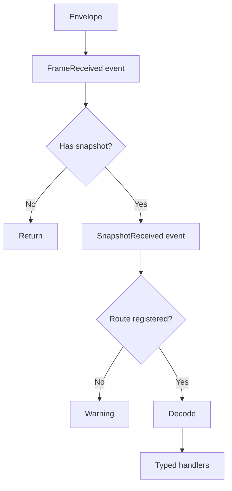

# MOBA 快照、表现层与预测回滚

> 本文以当前 MOBA runtime、通用 snapshot package 和 MOBA view runtime 为准，拆分逻辑快照输出、客户端分发/表现 Pipeline、远程输入驱动与预测回滚。仓库中存在多个同名 `FrameSnapshotDispatcher`，本文会明确每一处所指类型。

## 1. 四条链路不能混用

MOBA 客户端同步由四条相关但独立的链路组成：

| 链路 | 主要数据 | 目的 | 失败影响 |
|------|----------|------|----------|
| 逻辑推进 | remote/local input、frame time | 推进本地逻辑 world | 影响确定性状态 |
| 预测回滚 | rollback state、state hash、authority frame | 校正预测逻辑 | 影响重放与一致性 |
| 快照输出 | `WorldStateSnapshot` | 从逻辑 world 投影表现数据 | 可出现空输出或部分输出 |
| 表现分发 | envelope、opcode、decoded payload | 更新 cache、presenter、VFX/HUD | 不应反向修改权威逻辑 |

Snapshot 不是 rollback state。能够播放表现快照，不代表本地逻辑 hash 一致；发生 rollback，也不意味着所有表现事件都应再次播放。

## 2. 逻辑侧 Emitter 契约

MOBA emitter 实现 `IMobaSnapshotEmitter.TryGetSnapshot(frame, out snapshot)`。继承 `LogicWorldSnapshotEmitterBase<T>` 的 emitter 还获得同帧门禁：

```text
CanEmit(frame) == false -> no snapshot
frame == lastFrame      -> no snapshot
otherwise               -> update lastFrame, build snapshot
```

同一个 emitter 在同一 frame 最多成功尝试构建一次。注意 `_lastFrame` 在调用 `TryBuildSnapshot()` 前更新，即使本次因缓冲为空返回 false，同帧再次调用也不会重新构建。

Buffer emitter 使用 `MobaSnapshotBuffer<TEntry>`，成功编码后调用 `ToArrayClearAndTrim()` 清空缓冲；Dispose 时也会清空并按容量策略收缩。

## 3. Emitter 注册与排序

Emitter 类型通过 `MobaSnapshotEmitterAttribute(priority)` 标记。`MobaSnapshotEmitterRegistry.CreateDefault()` 扫描已加载程序集，按 priority 排序，再从 world services 解析实例。

当前常见优先级示例：

```text
10 EnterGame
20 ActorSpawn
30 ActorDespawn
40 ProjectileEvent
50 AreaEvent
60 DamageEvent
65 PresentationCue
70 StateHash
80 ActorTransform
85 SkillState
```

priority 决定 Router 遍历顺序，不是网络可靠性等级。标记出的类型如果没有注册到 world services，会在 resolve 阶段被跳过。

## 4. `MobaSnapshotRouter`

Router 同时注册为：

- `MobaSnapshotRouter`；
- `IWorldStateSnapshotProvider`；
- `IWorldStateSnapshotBatchProvider`；
- `IMobaSnapshotHealthProvider`。

初始化时它：

1. 可选解析 diagnostics；
2. 扫描 Attribute registry；
3. 按 priority 解析 emitter 实例；
4. 重建 emitter health entries；
5. 对照默认 output contract 记录缺失的必需 emitter；
6. 上报 emitter count，零 emitter 时发 warning。

### 4.1 单快照读取

`TryGetSnapshot()` 按顺序找到第一个成功 emitter 后立即返回。由于 emitter 有同帧门禁，多次调用可能依次取出不同 emitter 的快照，但调用方不能依赖无限轮询；更明确的批量出口是 `CollectSnapshots()`。

### 4.2 批量读取

`CollectSnapshots(frame, snapshots, maxSnapshots)`：

- destination 为 null 时抛异常；
- `maxSnapshots <= 0` 时抛异常；
- 按 emitter priority 遍历；
- 每个 emitter 最多追加一个 snapshot；
- 达到上限立即停止；
- 不清空调用方传入的 destination。

`maxSnapshots` 小于本帧可输出 emitter 数量时，后续 emitter 本轮不会被调用。若调用方随后在同帧再次收集，先前已经调用过的 emitter 会被 frame guard 跳过，未调用的 emitter仍有机会输出。

### 4.3 健康数据

Router 记录 single/batch request、hit/empty、last frame、last opcode、last batch size、emitter 列表和必需 emitter 缺失项。缺失必需 emitter 进入 health，不会在 `OnInit()` 直接抛异常阻止 world 运行；readiness validator 才负责把健康状态提升为启动判断。

## 5. Transform Snapshot 的真实采样范围

`MobaActorTransformSnapshotService` 的门禁与采样条件为：

```text
MobaLogicWorldRunGateService.InGame == true
registry entry entity != null
entity.hasTransform == true
```

输出字段为 actorId、position XYZ、forward XYZ，opcode 是 `Snapshot.ActorTransform`。

当前实现不检查：

- entity `isEnabled`；
- HP/存活状态；
- visibility/AOI；
- actorId 是否大于零；
- entity 自身 ActorId 是否与 registry key 一致。

它直接遍历 `MobaActorRegistry.Entries`，没有显式排序。因此该快照适合作为表现投影，不应单独用来推导确定性状态 hash 或承诺跨运行时稳定顺序。空 registry 或全部 entity 缺 Transform 时，本帧不输出 Transform snapshot。

## 6. 三个同名 Dispatcher

仓库当前至少存在三套 `FrameSnapshotDispatcher`：

| 命名空间/位置 | 特征 | 本文用途 |
|---------------|------|----------|
| `AbilityKit.Core.Snapshots.Routing` | 通用、无 session，外部调用 `Feed()` | 新的通用快照路由与 confirmed view |
| `AbilityKit.Game.Flow.Snapshot` | 持有 `BattleLogicSession`，可自动订阅 session frame | 本文的 MOBA 客户端 Battle Pipeline |
| MOBA share flow snapshot | 面向 share 层接口 | 旧/共享流程适配，不与前两者视为同一实例 |

阅读源码和日志时必须同时确认命名空间与构造函数。仅写“FrameSnapshotDispatcher”不足以说明实际管线。

## 7. MOBA View Dispatcher

`AbilityKit.Game.Flow.Snapshot.FrameSnapshotDispatcher` 可以在构造时订阅 `BattleLogicSession.FrameReceived`，也可以通过 `subscribeToSession=false` 禁用自动订阅，再由外部调用 `Feed()`。

处理 envelope 的顺序为：



### 7.1 注册约束

- 同 opcode、同 payload type 再注册会替换 decoder；
- 同 opcode、不同 payload type 会抛 type mismatch；
- route 尚未注册时订阅 handler 会抛异常；
- subscription Dispose 只移除对应 handler，可重复 Dispose。

### 7.2 异常隔离

Typed handler 逐个 `try/catch`，某个 handler 异常不会阻止后续 handler。

但以下顶层事件直接 Invoke，没有逐订阅者异常隔离：

```text
FrameReceived
SnapshotReceived
```

其中任一订阅者抛异常，会中断当前 envelope 后续处理，甚至阻止 opcode route dispatch。顶层订阅者必须自行保证不抛异常，或在 handler 内部隔离。

Decoder 返回 false 时静默停止当前 route，不调用 handler；当前 dispatcher 不记录 decode failure 指标。

## 8. `BattleSnapshotPipeline`

Pipeline 订阅 dispatcher 的 `SnapshotReceived`，维护自己的 opcode route、decoder 和有序 stages。

这意味着 dispatcher route 与 pipeline route 是两套独立注册：

```text
SnapshotReceived
  -> Pipeline decoder -> ordered stages

Dispatcher route
  -> Dispatcher decoder -> typed handlers
```

同一 snapshot 可能被解码两次。注册 dispatcher decoder 不会自动注册 pipeline decoder，反之亦然。

### 8.1 Stage 顺序

`AddStage(opCode, order, handler)` 按 order 升序插入；相同 order 的新 stage 插入在已有同 order stages 之后，因此同 order 保持注册先后顺序。

典型约定可以是：

```text
10 cache/state projection
20 actor presenter
30 HUD/VFX/audio event
```

这是调用方约定，不是 Pipeline 内置 stage 类型。

### 8.2 Pipeline 失败语义

- route 未注册时 AddStage 抛异常；
- payload type 不匹配时抛异常；
- decoder 为空或返回 false 时不执行 stage；
- stage handler 逐个异常隔离并继续后续 stage；
- 未注册 opcode 时 Pipeline 静默忽略，由 dispatcher 自身 route 缺失逻辑决定是否 warning。

Pipeline Dispose 只取消其 `SnapshotReceived` 订阅；各 stage subscription 仍应由所属 feature 按生命周期释放，避免持有无效 handler。

## 9. 通用 Dispatcher 的差异

`AbilityKit.Core.Snapshots.Routing.FrameSnapshotDispatcher` 不持有 `BattleLogicSession`，只接受显式 `Feed()`。它同样公开 `FrameReceived`、`SnapshotReceived`、decoder 和 typed subscriptions，但：

- 缺 route 时静默跳过，不写 MOBA dispatcher 的 warning；
- `Dispose()` 当前为空，因为没有外部 session 订阅；
- typed handler 仍有逐个异常隔离；
- 顶层事件仍没有隔离。

在 confirmed view 或框架级 snapshot pipeline 中，应以通用 dispatcher 的行为为准，不能套用 MOBA view dispatcher 的自动订阅与日志语义。

## 10. 远程驱动与预测模块

`RemoteDrivenWorldRuntimeFactory` 安装：

```text
ClientPredictionDriverModule
ServerFrameTimeModule
WorldAutoStartModule
```

无论是否开启客户端预测，都存在 `ClientPredictionDriverModule`。模式差异来自参数：

| 能力 | 预测开启 | 预测关闭 |
|------|----------|----------|
| remote input | 启用 | 启用 |
| local input | 启用 | null |
| input delay | 配置值，最小 0 | 0 |
| prediction ahead | 30 | 0 |
| rollback | true | false |
| history | 240 frames | 0 |
| capture interval | 1 | 0 |
| rollback registry | 调用方构造 | 空 registry |
| compute hash | 调用方构造 | null |

所以“remote only”仍通过 prediction driver 消费远程帧和推进目标，只是不进行本地超前预测与 rollback。

## 11. Rollback 与表现的边界

预测开启后，逻辑校正依赖：

- remote frame source；
- local input source；
- ideal frame limit；
- rollback registry；
- per-frame state hash；
- authority frame stats/source。

这些对象属于逻辑 world 和 HostRuntime。客户端 snapshot Pipeline 属于表现投影，不能作为 rollback provider。

发生 rollback/replay 时应区分：

| 数据 | 建议行为 |
|------|----------|
| Actor transform/state projection | 以最新确认或重放结果覆盖 |
| 一次性 damage/VFX/audio cue | 通过 context/cue key 去重，避免重播 |
| local predicted action | 在确认、拒绝或 rollback 后调和 |
| state hash | 只参与逻辑一致性，不驱动美术状态 |
| HUD aggregate | 从确认投影重建或幂等更新 |

具体 cue 去重由表现事件管线负责，不由 `BattleSnapshotPipeline` 自动完成。

## 12. Authority Frame 可用性

远程 world 创建前，工厂尝试从 `IClientPredictionDriverStats` 构造 `ClientPredictionDriverStatsFramesSource`；创建后尝试绑定 `MobaAuthorityFrameService`。

两步均为 best-effort，异常只记录日志。结果是：

- world 可以创建成功但 authority frame source 缺失；
- snapshot 可以正常显示但 prediction diagnostics 不完整；
- 不能以“收到 Transform snapshot”判断 rollback/authority 链已准备好。

应通过 `MobaBattleRuntimeReadinessValidator`、snapshot health 和 prediction stats 分别验证。

## 13. 清理顺序

典型客户端 teardown 至少包含：

1. 停止继续接收/Feed 新 envelope；
2. 释放 Pipeline stage 和 typed route subscriptions；
3. Dispose `BattleSnapshotPipeline`，取消 `SnapshotReceived`；
4. Dispose MOBA view dispatcher，取消 session `FrameReceived`；
5. 销毁 remote-driven world；
6. 释放 confirmed view/world 与其他 session resources。

只销毁 world 不会自动解除 view dispatcher 对 `BattleLogicSession` 的事件订阅；只 Dispose dispatcher 也不会销毁逻辑 world。

## 14. 失败诊断矩阵

| 现象 | 优先检查 |
|------|----------|
| 完全没有 snapshot | Router emitter count、InGame gate、world snapshot provider |
| 某 opcode 永远缺失 | emitter 是否被 Attribute 扫描并能从 services 解析、output contract missing list |
| 同帧第二次读取为空 | emitter frame guard 是否已在首次空构建时消费该 frame |
| Transform 缺 Actor | actor registry 是否注册、entity 是否有 Transform |
| 客户端 warning no route | MOBA view dispatcher 是否注册对应 opcode route |
| Pipeline stage 不执行 | Pipeline 自己的 decoder/route 是否注册，而非只注册 dispatcher |
| 一个顶层订阅异常后全部停止 | `FrameReceived` / `SnapshotReceived` handler 是否抛异常 |
| 画面正常但 hash 不一致 | rollback registry、compute hash、remote/local input 与 authority frame |
| rollback 后特效重复 | 表现 cue 是否有稳定 key/context 去重 |
| session 退出后仍收到回调 | dispatcher、pipeline 和 stage subscriptions 是否按序释放 |

## 15. 验证清单

### 逻辑输出

1. emitter priority 与协议 opcode 对应正确。
2. 必需 emitter 缺失能进入 Router health/readiness。
3. 单读取和批量读取在同帧 guard 下的行为有测试。
4. `maxSnapshots` 截断不会被误认为 emitter 永久缺失。
5. Transform snapshot 的 InGame、空集合、缺 Transform 条件有覆盖。
6. 不依赖 registry 枚举顺序生成确定性 hash。

### 客户端路由

1. 测试使用的 dispatcher 命名空间与生产链一致。
2. decoder 在正确的 dispatcher/Pipeline registry 分别注册。
3. opcode payload type mismatch 在初始化阶段暴露。
4. decoder false、handler exception、stage exception 的行为有覆盖。
5. 顶层事件 handler 不向外抛异常。
6. stage 相同 order 时注册顺序稳定。

### 预测与恢复

1. 预测模式解析到 rollback registry 和 hash calculator。
2. remote-only 模式不采集 local input、不建立 rollback history。
3. authority frame source 和 service binding 有 diagnostics。
4. rollback 后表现投影覆盖和 cue 去重可重复执行。
5. teardown 后 world、dispatcher、pipeline 均不再持有会话回调。

## 16. 源码索引

| 主题 | 源码 |
|------|------|
| Snapshot emitter 基类 | `Unity/Packages/com.abilitykit.demo.moba.runtime/Runtime/Application/Services/Snapshot/GameSnapshotTemplates.cs` |
| Emitter Attribute | `Unity/Packages/com.abilitykit.demo.moba.runtime/Runtime/Application/Services/Snapshot/MobaSnapshotEmitterAttribute.cs` |
| Emitter registry | `Unity/Packages/com.abilitykit.demo.moba.runtime/Runtime/Application/Services/Snapshot/MobaSnapshotEmitterRegistry.cs` |
| Snapshot Router 与 health | `Unity/Packages/com.abilitykit.demo.moba.runtime/Runtime/Application/Services/Snapshot/MobaSnapshotRouter.cs` |
| Snapshot 输出契约 | `Unity/Packages/com.abilitykit.demo.moba.runtime/Runtime/Application/Services/Snapshot/IMobaSnapshotEmitter.cs` |
| Transform emitter | `Unity/Packages/com.abilitykit.demo.moba.runtime/Runtime/Application/Services/Actor/MobaActorTransformSnapshotService.cs` |
| 通用 Dispatcher | `Unity/Packages/com.abilitykit.world.snapshot/Runtime/SnapshotRouting/FrameSnapshotDispatcher.cs` |
| MOBA view Dispatcher | `Unity/Packages/com.abilitykit.demo.moba.view.runtime/Runtime/Game/Battle/Client/SnapshotRouting/FrameSnapshotDispatcher.cs` |
| MOBA view Pipeline | `Unity/Packages/com.abilitykit.demo.moba.view.runtime/Runtime/Game/Battle/Client/SnapshotRouting/BattleSnapshotPipeline.cs` |
| Share 层 Dispatcher | `Unity/Packages/com.abilitykit.demo.moba.share/Runtime/Game/Flow/Battle/Snapshot/FrameSnapshotDispatcher.cs` |
| 远程 world 工厂 | `Unity/Packages/com.abilitykit.demo.moba.view.runtime/Runtime/Game/Battle/Client/Session/Features/Sim/RemoteDrivenWorldRuntimeFactory.cs` |
| 预测/远程 modules | `Unity/Packages/com.abilitykit.demo.moba.view.runtime/Runtime/Game/Battle/Client/Session/Features/Sim/RemoteDrivenRuntimeModuleFactory.cs` |
| Readiness validator | `Unity/Packages/com.abilitykit.demo.moba.runtime/Runtime/Application/Services/Validation/MobaBattleRuntimeReadinessValidator.cs` |
| Transform snapshot 验收示例 | `Unity/Packages/com.abilitykit.demo.moba.view.runtime/Runtime/Game/Test/UnitTest/Acceptance/Heroes/XiaoQiao/XiaoQiaoSkillAcceptanceTests.cs` |
| 回滚预测设计 | [Rollback 与预测](../../07-NetworkSynchronization/03-RollbackPrediction.md) |
| 状态同步设计 | [状态同步](../../07-NetworkSynchronization/02-StateSync.md) |
