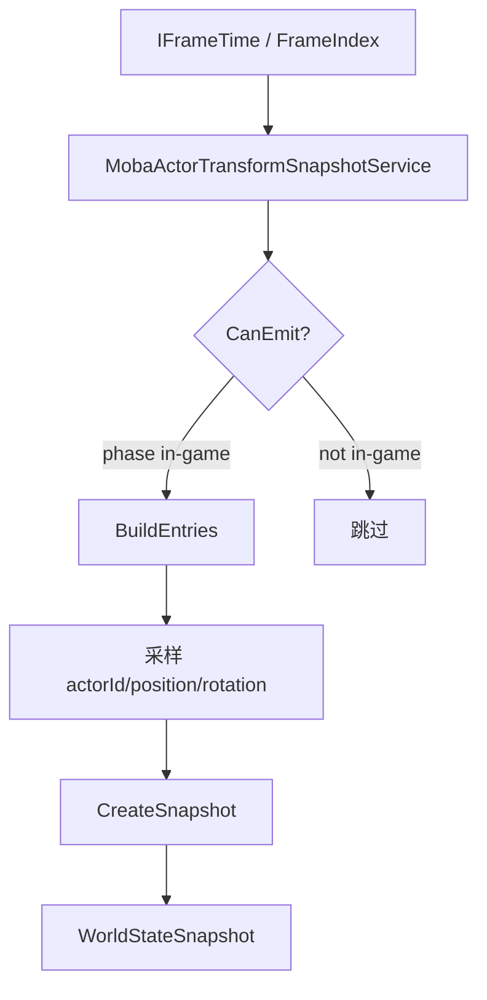
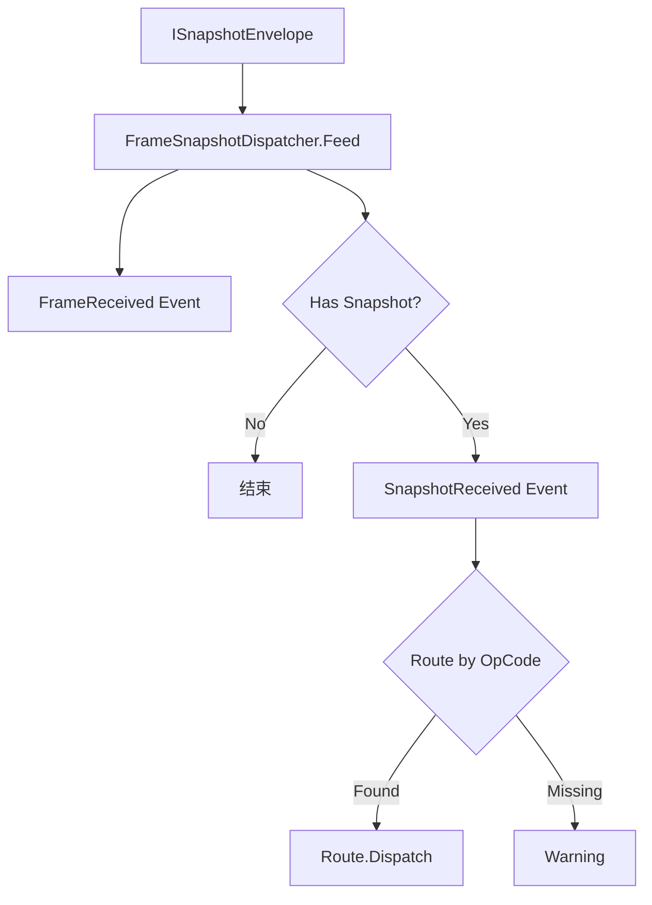
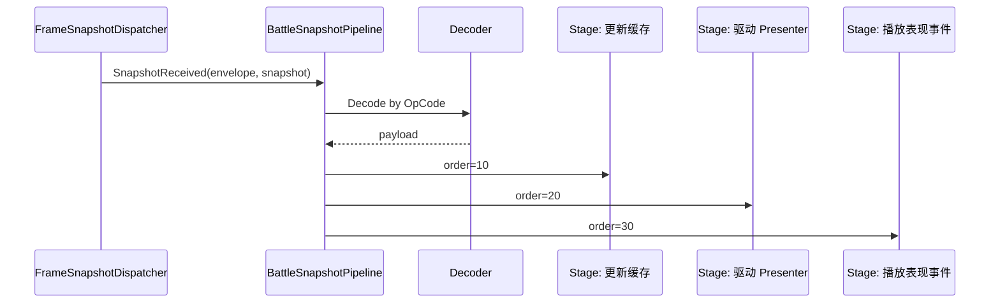
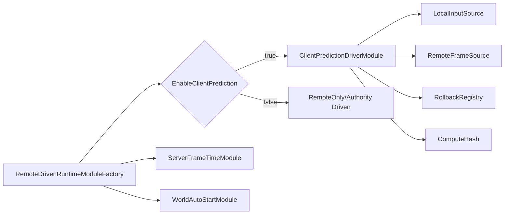

# MOBA 快照、表现层与预测回滚

> 本文说明 MOBA 示例如何把逻辑世界结果同步到客户端表现层，以及远程驱动模式下如何接入本地预测、权威帧、RollbackRegistry 与快照分发管线。

## 1. 设计目标

MOBA 示例的表现层不能直接读取逻辑世界内部对象。它通过快照和帧包获得权威信息。

这一层要解决：

- 逻辑状态如何编码为 `WorldStateSnapshot`；
- 客户端如何按 opcode 路由快照；
- 多个表现处理器如何有序消费同一类快照；
- 远程权威帧如何驱动本地世界；
- 本地预测和 rollback 如何接入。

## 2. Transform Snapshot

`MobaActorTransformSnapshotService` 是一个 snapshot emitter。它在游戏阶段采样 ActorRegistry 中的 actor transform，并输出 `WorldStateSnapshot`。

这个服务只是众多 snapshot emitter 的一个例子。MOBA 中还可以有 spawn、damage、buff、projectile 等快照。

## 3. FrameSnapshotDispatcher

表现层的 `FrameSnapshotDispatcher` 负责把帧包里的 snapshot 分发给 route。

它做三件事：

1. 触发 `FrameReceived`；
2. 如果帧包包含 snapshot，则触发 `SnapshotReceived`；
3. 根据 `OpCode` 查找 route 并 dispatch。

## 4. BattleSnapshotPipeline

`BattleSnapshotPipeline` 在 dispatcher 之后提供更细粒度的有序处理。

它支持：

- 注册 opcode 到 decoder；
- 注册同一 opcode 下多个 stage；
- stage 按 order 执行；
- 每个 stage 获取 `BattleContext`、envelope 和已解码 payload。

## 5. 远程驱动世界

`RemoteDrivenWorldRuntimeFactory` 在客户端创建一个由服务端权威帧驱动的本地逻辑世界。

它接收的 options 包含：

| 选项 | 用途 |
|------|------|
| `Plan` | 战斗启动计划 |
| `FixedDelta` | 固定帧间隔 |
| `InputDelayFrames` | 输入延迟帧 |
| `EnableClientPrediction` | 是否启用客户端预测 |
| `ResolveRemoteInputs` | 获取权威/远程输入源 |
| `ResolveLocalInputs` | 获取本地输入源 |
| `ResolveIdealFrameLimit` | 计算理想追帧目标 |
| `BuildRollbackRegistry` | 构建 rollback provider 注册表 |
| `BuildComputeHash` | 构建状态 hash 函数 |

## 6. Prediction Module

`RemoteDrivenRuntimeModuleFactory` 根据 options 创建 runtime modules。

当启用预测时，它会安装 `ClientPredictionDriverModule`，并设置：

- input delay frames；
- max prediction ahead frames；
- min prediction window；
- rollback enabled；
- rollback history frames；
- rollback capture interval；
- rollback registry 构造器；
- hash 计算器。

## 7. 快照与预测的边界

MOBA 示例中存在两类“同步”：

| 类型 | 作用 |
|------|------|
| 预测/回滚 | 驱动本地逻辑世界按输入推进，并在权威帧到达后校正 |
| Snapshot/Pipeline | 把逻辑结果转成表现层可消费数据 |

二者不能混淆：

- rollback 关心逻辑状态一致性；
- snapshot 关心表现层状态投影；
- frame hash 关心权威校验；
- pipeline stage 关心渲染顺序与表现事件。

## 8. 源码索引

| 模块 | 源码 |
|------|------|
| Transform 快照 | `Unity/Packages/com.abilitykit.demo.moba.runtime/Runtime/Application/Services/Actor/MobaActorTransformSnapshotService.cs` |
| 远程世界创建 | `Unity/Packages/com.abilitykit.demo.moba.view.runtime/Runtime/Game/Battle/Client/Session/Features/Sim/RemoteDrivenWorldRuntimeFactory.cs` |
| 远程模块工厂 | `Unity/Packages/com.abilitykit.demo.moba.view.runtime/Runtime/Game/Battle/Client/Session/Features/Sim/RemoteDrivenRuntimeModuleFactory.cs` |
| 快照 Dispatcher | `Unity/Packages/com.abilitykit.demo.moba.view.runtime/Runtime/Game/Battle/Client/SnapshotRouting/FrameSnapshotDispatcher.cs` |
| 快照 Pipeline | `Unity/Packages/com.abilitykit.demo.moba.view.runtime/Runtime/Game/Battle/Client/SnapshotRouting/BattleSnapshotPipeline.cs` |
| 回滚预测设计 | `Docs/design/07-NetworkSynchronization/03-RollbackPrediction.md` |
| 状态同步设计 | `Docs/design/07-NetworkSynchronization/02-StateSync.md` |
