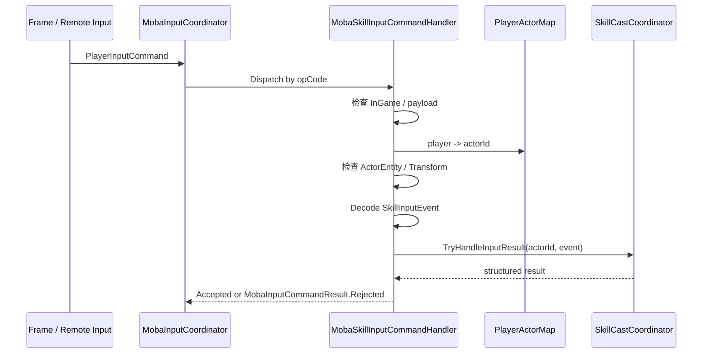
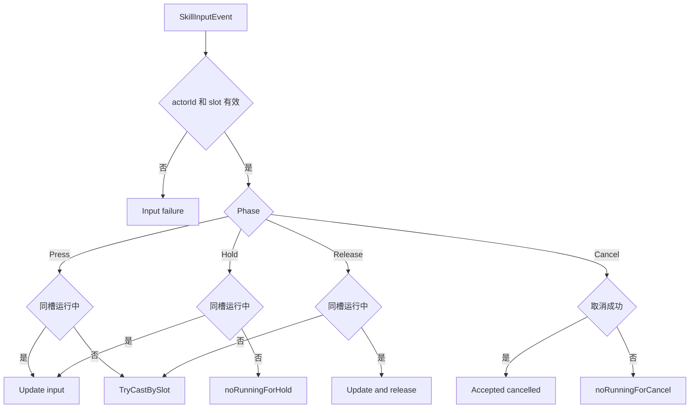

# MOBA 技能执行深潜

> 本文从权威输入开始，说明技能命令如何经过输入门禁、阶段分派、释放准备、策略解析和 Pipeline runner，最终形成可追踪、可推进、可取消的技能运行时。

## 1. 范围与责任

技能执行不是单个方法完成的。当前实现按以下边界分层：

| 组件 | 责任 | 不负责 |
|------|------|--------|
| `MobaInputCoordinator` | 创建帧输入上下文，按 opCode 分发给已注册 handler | 解析每种业务 payload、直接释放技能 |
| `MobaSkillInputCommandHandler` | 校验世界阶段、玩家 Actor、实体、Transform 和 payload，解码技能事件 | 创建技能 runtime、推进 Pipeline |
| `SkillCastCoordinator` | 分派输入阶段、按槽位解析技能、准备并启动 runner、管理取消/推进 | 网络反序列化、把全部资源/目标规则硬编码在协调器内 |
| `SkillCastPreparationService` | 解析施法者/目标、瞄准回退、Pipeline、等级、trace root 和 runtime handle | 决定并行/中断策略 |
| `SkillCastPolicyResolver` | 由全局 fallback 和技能类型得到本次并行策略 | 通用排队系统、任意技能分类策略 |
| `SkillRunnerRegistry` / `SkillPipelineRunner` | 保存 actor 运行实例、更新输入、释放、取消、逐帧 Step | 玩家到 Actor 映射 |
| `SkillCastContext` | 承载技能、来源、目标、瞄准、runtime、trace 和服务上下文 | 作为网络协议直接传输 |

当前没有独立的“Skill Executor”对象位于协调器之后。真正执行 pre-cast/cast 阶段的是 `SkillPipelineRunner`，协调器通过 registry 获取或创建 actor 对应 runner。

## 2. 输入协议与命令入口

`SkillInputEvent` 位于 MOBA 协议包，字段包括：

- `Slot` 与 `SkillInputPhase`；
- `PointerId`；
- `TargetActorId`；
- `AimPos` 与 `AimDir`；
- 扩展用 `OpCode` 与 `Payload`。

事件不携带 actorId。权威侧从 `PlayerInputCommand.Player` 通过 `MobaPlayerActorMapService` 得到 actorId，防止客户端自行指定施法者。



## 3. 输入层拒绝语义

技能事件进入协调器之前，handler 按顺序检查：

| 条件 | `MobaInputCommandFailureCode` |
|------|-------------------------------|
| 上下文为空 | `ContextMissing` |
| 逻辑世界不在 InGame | `NotInGame` |
| 玩家未映射 Actor | `ActorMapMissing` |
| Actor 实体不存在 | `ActorEntityMissing` |
| Actor 无 Transform | `TransformMissing` |
| payload 为空 | `PayloadMissing` |
| payload 解码失败 | `PayloadInvalid` |
| 技能协调器不可用 | `SkillExecutorMissing` |
| 技能层拒绝 | `SkillRejected` |

技能层拒绝会把稳定 code、slot 和 target 写入消息，例如 `SkillRejected(Code=...,Slot=...,Target=...)`。上层不应只保留布尔值，否则无法区分协议、世界装配和技能规则问题。

## 4. 输入阶段不是对称事件

协调器先校验 `actorId > 0` 和 `slot > 0`，再按 phase 分派：

| Phase | 已有同槽运行实例 | 没有同槽运行实例 |
|-------|------------------|------------------|
| `Press` | 更新 aim/target，返回 `skill.input.running.updated` | 尝试从槽位启动技能 |
| `Hold` | 更新 aim/target，返回 accepted | 拒绝：`skill.input.noRunningForHold` |
| `Release` | 更新 aim/target 并标记 release | 尝试从槽位启动技能 |
| `Cancel` | 取消同槽实例 | 拒绝：`skill.input.noRunningForCancel` |
| 未知值 | 不适用 | 拒绝：`skill.input.unsupportedPhase` |

Release 在没有运行实例时仍尝试启动，是当前实现的重要语义，适合“松手释放”输入模型。若产品要求 Release 只能结束已有蓄力，需要修改协调器策略，而不能仅在 UI 层假设。



## 5. 从槽位到技能 ID

`TryCastBySlot()` 先通过 `MobaSkillLoadoutService` 查询 slot 对应 skillId。槽位不存在时返回结构化失败 `skill.cast.slotNotFound`。

正式准备前还会对普通攻击调用 `MobaSkillParamModifierService.Skill.ResolveSkillId()`。这允许 Buff、装备或其他参数修改器替换普攻技能 ID；非普通攻击保持原 ID。实际 Pipeline、冷却和 trace 使用替换后的 skillId。

除槽位入口外，协调器也提供直接按 skillId 释放的入口。直接入口可用于 AI、测试或效果驱动场景，但调用方仍需提供合法 actor，并经过同一准备与 runner 启动流程。

## 6. 释放准备阶段

`SkillCastPreparationService.Prepare()` 负责把轻量请求扩展为正式运行上下文：

1. 校验 actorId 和 skillId；
2. 通过 `IUnitResolver` 解析 caster；
3. 从 Actor Transform 得到位置与朝向，作为缺省 aim；
4. targetActorId 大于零时解析 target unit；
5. 从 `IMobaSkillPipelineLibrary` 读取 pre-cast/cast 配置与阶段；
6. 从 loadout 读取技能等级，并为 actor 生成递增 cast sequence；
7. 创建 `SkillCastRequest` 和 `SkillCastContext`；
8. 在 `MobaTraceRegistry` 创建 SkillCast root context；
9. 通过 `MobaSkillCastRuntimeService` 创建 runtime 和有效 handle。


任一步失败都会返回 code，而不是留下半初始化 runner。主要 code 包括：

- `skill.cast.invalidCaster`、`skill.cast.invalidSkill`；
- `skill.cast.casterMissing`、`skill.cast.targetMissing`；
- `skill.cast.pipelineMissing`；
- `skill.cast.traceRegistryMissing`、`skill.cast.traceRootCreateFailed`；
- `skill.cast.runtimeServiceMissing`、`skill.cast.runtimeHandleInvalid`。

这里验证“显式目标存在”，但不等价于完整的阵营、距离、视野、资源和状态规则。此类规则可由 pre-cast/cast Pipeline 条件和 Effect 条件承担。

## 7. 上下文与溯源

`SkillCastContext` 保存：

- skillId、slot、level、sequence；
- casterActorId、targetActorId、aimPos、aimDir；
- runtime handle、runtimeId、sourceContextId；
- world services、event bus、caster/target unit。

它同时实现 combat、trigger lineage、execution snapshot、origin 和 context source provider。后续 Buff、Projectile、Trigger 和 Damage 可以从上下文派生统一来源，而不需要猜测“这次伤害属于哪次技能释放”。

`sourceContextId` 标识 trace 根，`runtimeId` 标识可推进的技能运行时，二者用途不同。持久 projectile 或 Buff 可以 retain runtime，使 Pipeline 结束后子效果仍能保留正确来源。

## 8. 策略与 runner 启动

默认 `SkillCastPolicy` 为：

```text
AllowParallel = false
InterruptRunning = false
```

`SkillCastPolicyResolver` 当前只对 `SkillType.ParallelActive` 把 `AllowParallel` 改为 true，其余技能使用 fallback。`InterruptRunning` 当前来自协调器级 fallback，没有通用配置映射；文档和配置工具不应宣称所有技能都能独立配置这两个字段。

准备成功后，协调器调用 runner 的 Start，传入 pre-cast/cast 配置、阶段、request、context 和 policy。结果分为：

- 启动成功：应用配置冷却；
- runner 启动拒绝：生成 start reject；
- Pipeline 启动失败：生成 pipeline failure；
- 无法分类：生成 unknown cast failure。

启动失败时，已创建的 runtime 会以 `RollbackCleanup` 强制终止，避免准备成功但未启动的 runtime 泄漏。

## 9. 冷却与资源边界

冷却只在 runner 成功启动后写入 active skill runtime。值优先取技能等级表中大于零的 `CooldownMs`，否则回退到技能基础配置；slot 小于等于零或冷却非正时不写入。

协调器没有在入口统一扣除 mana，也没有在自身代码中实现所有 cooldown/resource 拒绝。资源字段和条件可由 Pipeline context accessor、pre-cast 阶段及配置化条件读取。因而验证资源不足时，应确认目标技能的 Pipeline 是否实际配置对应门禁和消耗，而不是仅检查协调器。

## 10. 逐帧推进、取消与结束

`MobaSkillPipelineStepSystem` 每帧遍历 actor，并调用协调器的 Step。协调器把推进委托给 registry 中该 actor 的 runner。

外部可通过以下维度操作或观测运行实例：

- 按 actor + slot 查询最新运行快照；
- 按 actor + runtime instanceId 查询；
- 按 slot 取消；
- 按 skillId 取消；
- 取消 actor 的全部技能；
- 收集 running 和 ended snapshots。

协调器释放时会释放整个 runner registry。技能生命周期不能只依赖输入事件结束，系统调度和 world dispose 都是必要清理边界。

## 11. 确定性与回放

要保持帧同步可重放，至少需要满足：

- `PlayerInputCommand` 在确定帧进入相同 handler；
- player 到 actor 映射和 loadout 在该帧一致；
- phase 分派与 runner 查找顺序稳定；
- cast sequence 只由权威执行顺序推进；
- 时间读取通过 `IFrameTime`/world clock，而非 UI 或墙钟；
- Pipeline 配置、技能等级和参数修改结果一致；
- trace/runtime ID 的分配顺序一致。

UI 的按下状态、预览目标和本地动画不能成为权威释放条件。它们应被编码为协议事件中的 phase、aim 和 target，或仅作为表现反馈。

## 12. 诊断与验证

建议按分层结果定位：

1. 检查 `MobaInputCommandResult`，先排除世界阶段、Actor 映射和 payload；
2. 检查 `MobaSkillInputHandleResult.Code`，区分 phase 与 cast 拒绝；
3. 检查 `MobaSkillCastFailure.Source/Stage/Code/Message`；
4. 检查 Skill Logger、trace root、runtime handle 和 runner snapshot；
5. 检查 Pipeline 条件、阶段结果及后续 Effect/Trigger。

重点测试用例：

- 无映射玩家、无 Transform、空/损坏 payload；
- slot 为零、未知 phase、无运行实例的 Hold/Cancel；
- Press 后 Hold/Release 更新 aim 和 target；
- Release 无运行实例时启动技能；
- slot 缺失、caster/target 缺失、Pipeline 缺失；
- trace/runtime 服务缺失及无效 handle；
- 普攻技能 ID 被 modifier 替换；
- ParallelActive 与普通技能并发行为；
- runner 启动失败后的 runtime 清理；
- 基础冷却与等级冷却覆盖；
- 相同输入回放后的 runtime/trace/最终战斗状态一致。

## 13. 源码索引

| 模块 | 源码 |
|------|------|
| 输入协调器 | `Unity/Packages/com.abilitykit.demo.moba.runtime/Runtime/Application/Services/Input/MobaInputCoordinator.cs` |
| 输入上下文 | `Unity/Packages/com.abilitykit.demo.moba.runtime/Runtime/Application/Services/Input/MobaInputCommandContext.cs` |
| 技能命令 handler | `Unity/Packages/com.abilitykit.demo.moba.runtime/Runtime/Application/Services/Input/MobaSkillInputCommandHandler.cs` |
| 技能 payload codec | `Unity/Packages/com.abilitykit.demo.moba.runtime/Runtime/Application/Services/Skill/Input/SkillInputCodec.cs` |
| 技能输入协议 | `Unity/Packages/com.abilitykit.protocol.moba/Runtime/Skill/SkillInputStructs.cs` |
| 技能释放协调器 | `Unity/Packages/com.abilitykit.demo.moba.runtime/Runtime/Application/Services/Skill/Cast/SkillCastCoordinator.cs` |
| 释放准备 | `Unity/Packages/com.abilitykit.demo.moba.runtime/Runtime/Application/Services/Skill/Cast/SkillCastPreparationService.cs` |
| 策略解析 | `Unity/Packages/com.abilitykit.demo.moba.runtime/Runtime/Application/Services/Skill/Cast/SkillCastPolicyResolver.cs` |
| 上下文与结果 | `Unity/Packages/com.abilitykit.demo.moba.runtime/Runtime/Application/Services/Skill/Cast/SkillCastContext.cs` |
| 失败 code | `Unity/Packages/com.abilitykit.demo.moba.runtime/Runtime/Application/Services/Skill/Cast/SkillFailureCodes.cs` |
| Runner registry | `Unity/Packages/com.abilitykit.demo.moba.runtime/Runtime/Application/Services/Skill/Cast/SkillRunnerRegistry.cs` |
| Pipeline runner | `Unity/Packages/com.abilitykit.demo.moba.runtime/Runtime/Application/Services/Skill/Pipeline/SkillPipelineRunner.cs` |
| Runtime 服务 | `Unity/Packages/com.abilitykit.demo.moba.runtime/Runtime/Application/Services/Skill/Runtime/MobaSkillCastRuntimeService.cs` |
| 每帧推进系统 | `Unity/Packages/com.abilitykit.demo.moba.runtime/Runtime/Application/Systems/Skill/MobaSkillPipelineStepSystem.cs` |
