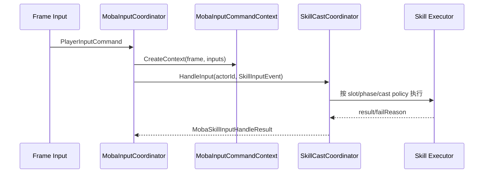
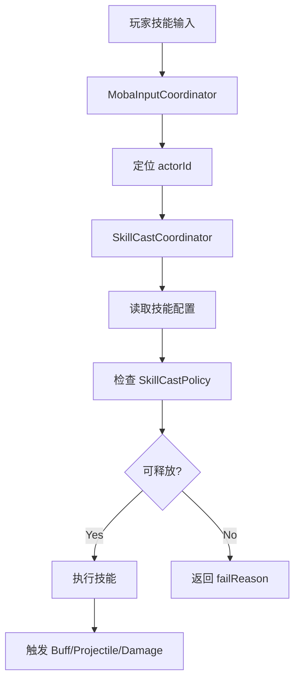

# MOBA 技能执行深潜

> 本文把 MOBA 示例中的“输入触发技能”单独拆开，重点说明 `MobaInputCoordinator`、`SkillCastCoordinator`、输入事件、技能槽、释放策略、失败原因和执行上下文如何协同。

## 1. 为什么要单独拆出来

MOBA 示例里，技能系统不是简单的“点按钮放技能”，而是一条完整的执行链：

- 输入来自帧同步或远程驱动；
- 输入必须先定位到 actor；
- 技能释放需要知道输入阶段和技能槽；
- 释放策略需要控制并行、中断和排队；
- 执行结果需要回传给后续 Buff / Projectile / Damage 管线。

因此这一段值得单独成文。

## 2. 输入与技能的责任边界

| 组件 | 责任 |
|------|------|
| `MobaInputCoordinator` | 把帧输入转换为命令上下文并分发处理 |
| `SkillCastCoordinator` | 把技能槽/技能事件转成实际释放动作 |
| `MobaInputCommandContext` | 贯穿一帧输入处理所需的运行时上下文 |
| `SkillInputEvent` | 技能按键/阶段/意图的结构化表达 |
| `MobaSkillCastResult` | 释放结果，包括成功、失败与失败原因 |

## 3. 输入处理链路

## 4. SkillCastPolicy 的设计意义

`SkillCastPolicy` 只有两个字段，但能表达很多战斗语义：

| 字段 | 含义 | 示例 |
|------|------|------|
| `AllowParallel` | 是否允许多个技能并行 | 机关炮、持续射击、分段释放 |
| `InterruptRunning` | 是否打断正在运行的技能 | 闪现、强制取消、反制技能 |

这比“直接执行技能”更适合战斗框架，因为：

1. 可以按技能分类配置不同策略；
2. 可以在输入层和运行时层之间统一控制；
3. 便于回滚后重新执行相同决策。

## 5. 输入上下文里包含什么

`MobaInputCommandContext` 的存在不是为了“传更多参数”，而是为了把这一帧技能执行需要的对象一次性收拢：

- 当前 phase；
- player 到 actor 的映射；
- 实体索引；
- 技能执行器；
- 服务容器；
- 可能的外部系统引用。

这样输入 handler 不需要到处查服务，也不需要重新拼装上下文。

## 6. 技能释放的典型路径

1. 输入 handler 识别到技能槽按键。
2. 根据 playerId 找到 actorId。
3. 调用 `SkillCastCoordinator.CastBySlot()`。
4. 协调器读取技能配置并建立执行上下文。
5. 检查释放策略、阶段限制、资源限制和目标条件。
6. 允许时进入真正的技能执行流程。
7. 技能执行过程中可进一步触发 Buff / Projectile / Damage。

## 7. 失败原因的重要性

MOBA 示例非常强调失败原因，因为它们会影响：

- 客户端提示；
- 回滚后的重复执行；
- 烟测结果定位；
- 配置错误排查；
- AI / Bot 行为修正。

释放结果不应该只有 `true/false`，而应保留稳定的失败原因字符串或枚举。

## 8. 与帧同步的关系

技能执行必须可重放，因此：

- 输入命令与帧号绑定；
- 技能决策要尽量纯函数化；
- 依赖的状态必须来自当前 world state；
- 不要依赖未经同步的临时 UI 状态。

## 9. 源码索引

| 模块 | 源码 |
|------|------|
| 输入协调器 | `Unity/Packages/com.abilitykit.demo.moba.runtime/Runtime/Application/Services/Input/MobaInputCoordinator.cs` |
| 输入上下文 | `Unity/Packages/com.abilitykit.demo.moba.runtime/Runtime/Application/Services/Input/MobaInputCommandContext.cs` |
| 技能释放协调器 | `Unity/Packages/com.abilitykit.demo.moba.runtime/Runtime/Application/Services/Skill/Cast/SkillCastCoordinator.cs` |
| 技能输入事件 | `Unity/Packages/com.abilitykit.demo.moba.runtime/Runtime/Application/Services/Skill/Cast/SkillInputEvent.cs` |
| 技能结果 | `Unity/Packages/com.abilitykit.demo.moba.runtime/Runtime/Application/Services/Skill/Cast/MobaSkillCastResult.cs` |
