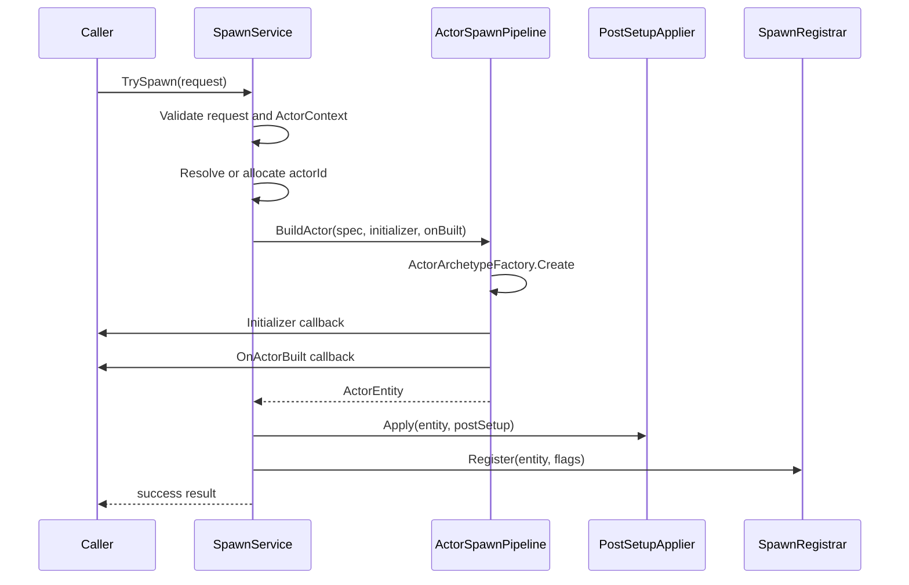
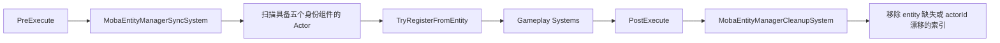

# MOBA 配置、实体索引与生成深潜

> 本文基于当前 MOBA runtime 源码，说明配置数据如何进入统一门面、Actor 如何构造和注册，以及 `MobaActorRegistry`、`MobaEntityManager` 与 Entitas entity 之间如何维持一致性。重点覆盖失败语义和非事务性边界。

## 1. 三条相互独立的链路

配置、生成和索引经常同时出现，但职责不同：

| 链路 | 输入 | 输出 | 核心责任 |
|------|------|------|----------|
| 配置加载 | text、DTO、bytes、group、resource | `ConfigDatabase` 中的 typed tables | 反序列化、版本、reload result 与通知 |
| Actor 生成 | `MobaActorSpawnRequest` | Entitas `ActorEntity` | 分配 ID、构造 archetype、回调和 post-setup |
| 索引注册 | entity + identity fields | registry 与多维 index | actorId 查找、分类查询和 spawn/despawn 事件 |

它们不是一个原子事务。配置加载失败不会创建 Actor；Actor 构造成功后注册失败，也不会由生成服务自动回收 entity。

## 2. 配置门面结构

`MobaConfigDatabase` 持有五个关键依赖：

```text
IMobaConfigTableRegistry
IMobaConfigDtoDeserializer
IMobaConfigDtoBytesDeserializer (optional)
ITextAssetLoader
ConfigDatabase (inner)
```

默认值为：

- table registry：`MobaConfigRegistry.Instance`；
- JSON/DTO deserializer：`JsonNetMobaConfigDtoDeserializer.Instance`；
- bytes deserializer：默认 null；
- text asset loader：`NullTextAssetLoader.Instance`。

门面通过内部 `MobaDeserializerAdapter` 把 MOBA DTO deserializer 适配到通用 `IConfigDeserializer`，实际 table storage、版本递增和 reload 由 `_innerDb` 管理。

## 3. 加载入口与失败语义

### 3.1 支持的入口

| 入口 | 非 Reload 方法 | Reload 方法 | 关键约束 |
|------|----------------|-------------|----------|
| Text sink | `LoadFromTextSink` | `ReloadFromTextSink` | sink 必须非空 |
| Resources | `LoadFromResources` | `ReloadFromResources` | resourcesDir 必须非空 |
| Generic source | `LoadFromSource` | `ReloadFromSource` | source 必须非空 |
| DTO provider | `LoadFromDtoProvider` | `ReloadFromDtoProvider` | strict 时每个注册 DTO type 都必须返回数组 |
| DTO arrays | `LoadFromDtoArrays` | `ReloadFromDtoArrays` | dictionary 必须非空引用 |
| Bytes | `LoadFromBytes` | `ReloadFromBytes` | 必须配置 bytes deserializer |
| Bytes + JSON | `LoadFromMixed` | `ReloadFromMixed` | 两个 dictionary 均必须非空，且必须配置 bytes deserializer |
| Ordered groups | `LoadFromGroups` | `ReloadFromGroups` | groups 至少一个 |
| JSON texts | `LoadFromJsonTexts` | `ReloadFromJsonTexts` | dictionary 必须非空引用 |

`Load*` 通常把失败结果转换为 `InvalidOperationException`；`Reload*` 返回 `ConfigReloadResult`。参数为空等编程错误仍直接抛 `ArgumentNullException` 或 `ArgumentException`。

### 3.2 Reload 通知

reload 成功或失败都会通过 `ConfigReloadBus` 发布，固定 config key 为：

```text
moba.config
```

成功结果包含当前 `_innerDb.Version`，并标记为 full reload；当前门面不提供 changed IDs。失败结果保留当前版本与错误字符串。

### 3.3 Strict 边界

DTO provider 路径明确使用 `strict`：

- strict 为 true，任一注册 DTO type 缺失立即失败；
- strict 为 false，缺失 type 被替换为空数组。

需要注意当前 `ReloadFromJsonTexts(..., strict)` 实现调用 `_innerDb.ReloadFromTexts(jsonByKey, resourcesDir)`，没有把 `strict` 参数继续传给底层。调用方不能仅凭该重载签名推断 strict 已生效，应以底层实际结果和测试为准。

### 3.4 Bytes 边界

默认构造不会提供 `IMobaConfigDtoBytesDeserializer`。因此 bytes/mixed 路径不是开箱即用：

```text
bytes deserializer == null
  -> Reload 返回失败并发布 reload failure
  -> Load 包装方法抛 InvalidOperationException
```

这与 JSON 默认 deserializer 的行为不同。

## 4. Typed table 访问

加载完成后，业务系统通过两类 API 访问：

1. 通用入口：`GetTable<TMO>()`、`GetDto<TDto>()`、`TryGetDto<TDto>()`；
2. MOBA convenience API：`GetSkill()`、`TryGetBuff()`、`GetProjectile()` 等。

`Get*` 适合配置必须存在的启动或执行链路；`TryGet*` 适合输入校验和可选配置。按名称查询 tag 的方法当前通过遍历全部 table entries 实现，不是独立名称索引，频繁热路径应缓存结果或使用 ID。

配置门面没有线程同步语义。reload 与运行时读取如何调度，必须由宿主保证不会观察到不期望的中间状态。

## 5. Actor 生成请求

`MobaActorSpawnRequest` 是 class，包含：

| 字段 | 默认值 | 作用 |
|------|--------|------|
| `Spec` | default | identity、transform、分类、来源和 owner |
| `AllocateActorIdIfMissing` | false | actorId 缺失时是否使用 allocator |
| `RegisterActor` | true | 是否写入 `MobaActorRegistry` |
| `RegisterEntityManager` | true | 是否写入 `MobaEntityManager` |
| `RegisterEntityManagerFromEntity` | true | 优先从 entity components 读取索引键 |
| `Initializer` | null | archetype 创建后立即回调 |
| `OnActorBuilt` | null | initializer 后、post-setup 前回调 |
| `PostSetup` | default | owner、lifetime、summon、model、brain、projectile 等附加组件 |

`FromSpec()` 只设置 `Spec`，其他字段沿用上述字段初始化值。

## 6. 单 Actor 生成顺序

`MobaActorSpawnService.TrySpawn()` 的顺序为：



具体门禁：

1. request 为 null，返回 `request is required`；
2. 无法从注入的 `IContexts` 解析全局 `Contexts.actor`，返回 `ActorContext is required`；
3. actorId 小于等于 0 时，只有显式开启自动分配且 allocator 非空才分配；
4. pipeline 返回 null entity 时返回失败；
5. 构造、回调、post-setup 或注册抛出的异常都会被捕获、记录并转换为失败结果。

## 7. 回调语义与非事务性

`ActorSpawnPipeline.BuildActor()` 的回调顺序固定为：

```text
Create archetype
-> Initializer
-> OnActorBuilt
-> return built result
```

生成服务随后才执行 post-setup 和注册。因此：

- `Initializer` 不是“生成前修改 spec”，它拿到的 entity 已经创建；
- `OnActorBuilt` 发生时 entity 尚未经过 post-setup，也未由 spawn service 注册；
- 回调可以修改 entity，`RegisterEntityManagerFromEntity=true` 时这些组件值会成为索引键；
- 回调抛异常时 `TrySpawn()` 返回 false，但已经创建的 Entitas entity 不会自动销毁；
- post-setup 或注册抛异常时，也没有统一撤销 registry/index/回调副作用。

因此 `TrySpawn()` 是异常转结果的边界，不是事务边界。回调应保持短小、可重复推理，避免执行不可撤销的外部操作。

## 8. 两类 Actor 索引

### 8.1 `MobaActorRegistry`

这是轻量 `actorId -> ActorEntity` 字典：

- `Register()` 覆盖相同 actorId；
- `TryGet()` 只返回非空且 `isEnabled` 的 entity；
- `Entries` 暴露底层枚举；
- `Unregister()` 和 `Clear()` 不发布事件。

Transform snapshot emitter 等服务直接遍历该 registry。

### 8.2 `MobaEntityManager`

它同时维护：

```text
_byActorId
BattleEntityManager<int> Index
ByTeam
ByMainType
ByUnitSubType
ByOwnerPlayer
```

`TryGetActorEntity()` 只做字典查找，不检查 `isEnabled`。这与 `MobaActorRegistry.TryGet()` 的可用性语义不同，调用方不能互换假设。

`Register()` 对已有 actorId 更新 entity 和所有 keyed index；只有首次加入 `Index.Registry` 时才发布 unit spawn event。`Unregister()` 在能够读取旧 entity 时先发布 despawn event，然后删除 `_byActorId` 和主 Index；keyed index 的清理由 `BattleEntityManager` 的 remove 语义负责。

## 9. Registrar 的 fallback 行为

`MobaActorSpawnRegistrar.Register()` 先可选写入 actor registry，再处理 entity manager：

```text
registerActor
  -> registry.Register(spec actorId, entity)

registerEntityManager
  -> registerFromEntity ? TryRegisterFromEntity(entity) : skip
  -> 如果失败或返回 false，使用 spec 中的 team/main/subtype/owner fallback Register
```

`TryRegisterFromEntity()` 要求 entity 同时具有：

- ActorId；
- Team；
- EntityMainType；
- UnitSubType；
- OwnerPlayerId；
- actorId 大于 0。

它抛异常时 registrar 记录日志，然后继续 fallback。需要注意，actor registry 已经可能写入；若 fallback `Register()` 再抛异常，生成服务只返回失败，不会撤销 actor registry。

## 10. 每帧索引调和

索引一致性不只依赖 spawn service，还有两个自动系统：



### 10.1 PreExecute 补注册

SyncSystem 获取同时包含五个身份组件的 group，每帧把全部 entity 交给 `TryRegisterFromEntity()`。已有 actorId 会刷新 keyed index，但不会重复发布 spawn event。

这意味着即使某条构造链没有显式注册 entity manager，只要组件完整，下一次 PreExecute 仍可能被纳入索引。

### 10.2 PostExecute 清理

CleanupSystem 复制当前注册 actorId，再移除：

- `_byActorId` 中找不到或 entity 为 null；
- entity 不再含 ActorId；
- entity 当前 ActorId 与索引键不同。

它不显式检查 entity enabled，也不检查 Team 等分类组件是否被移除。分类组件缺失后的旧 keyed index 可能持续到其他注册/销毁路径修正，业务不应把 cleanup system 理解为完整组件一致性验证器。

## 11. 批量玩家生成边界

`ActorSpawnPipeline` 还提供从 loadouts/specs 批量生成玩家 Actor 的旧式静态入口。它会：

1. 要求每个 loadout 有出生点；
2. 预先为所有 loadout 分配 actorId 和 spec；
3. 逐个 build and register；
4. 记录 player 与 actor 映射；
5. 确认 localPlayerId 出现在 loadouts 中。

该批量方法同样不是事务：中途某个 Actor 构造失败，之前已经注册的 Actor 不会自动回滚；在全部 Actor 创建后才发现 localPlayerId 缺失时，也会抛异常并保留此前副作用。高层启动 Flow 必须负责失败清理。

## 12. Spawn、Despawn 与事件边界

`MobaEntityManager` 只在主 Index 首次出现 actorId 时发布 spawn；重复注册用于刷新索引，不产生重复 spawn。

Despawn 事件只由显式 `Unregister()` 发布，且 payload 从当时 entity 组件读取，缺失时使用默认分类。`Clear()` / `Dispose()` 直接清空索引，不逐个发布 despawn。因此：

- world teardown 不能依赖收到每个单位的 despawn event；
- 临时实体正常结束应走明确的 despawn/unregister 生命周期；
- snapshot despawn、trigger despawn 和 index removal 需要由上层生命周期服务协调。

## 13. 与战斗能力的关系

| 能力 | 使用方式 |
|------|----------|
| Skill/Buff | 通过配置门面解析 skill、flow、buff 和 template |
| Projectile/Summon | 通过 spawn service 创建临时 Actor，并写入来源与生命周期组件 |
| Targeting | 通过 entity manager 的 team/type/owner index 缩小候选集 |
| Damage | 通过 actor/entity 服务定位攻击者和目标 |
| Snapshot | Transform emitter 遍历 actor registry；其他 emitter 可读取 entity manager 或事件缓冲 |
| Trigger | entity manager 首次注册/注销时发布 unit spawn/despawn event |

稳定 actorId 是这些链路的共同连接键，但 ActorEntity 引用是否仍有效需要按具体 registry 的语义再次判断。

## 14. 验证清单

### 配置

1. JSON 默认加载可用，bytes/mixed 在未注册 bytes deserializer 时明确失败。
2. reload 成功和失败都发布 `moba.config` 事件并保留正确版本。
3. DTO provider strict/non-strict 缺表行为有测试。
4. JSON text strict 参数当前行为通过测试固化，避免只信任签名。
5. 热重载与运行时读取在宿主层串行化。

### 生成

1. request、ActorContext 和 actorId 缺失均返回结构化失败结果。
2. 自动 actorId 只在显式开关开启时发生。
3. callback、post-setup、registry 和 entity manager 的顺序符合预期。
4. callback/post-setup/注册抛异常时测试并清理遗留 entity 与索引。
5. 批量生成中途失败由上层清理已经创建的 Actor。

### 索引

1. actor registry 与 entity manager 对 disabled entity 的查询差异有调用方约束。
2. 重复注册不会重复发 spawn event，但能刷新 team/type/owner index。
3. PreExecute 能补注册组件完整的 entity。
4. PostExecute 能移除 actorId 缺失或变化的条目。
5. `Clear()` 不发 despawn 的 teardown 语义已被接受。

## 15. 源码索引

| 主题 | 源码 |
|------|------|
| 配置门面 | `Unity/Packages/com.abilitykit.demo.moba.runtime/Runtime/Infrastructure/Config/Core/MobaConfigDatabase.cs` |
| 表注册契约 | `Unity/Packages/com.abilitykit.demo.moba.runtime/Runtime/Infrastructure/Config/Core/IMobaConfigTableRegistry.cs` |
| DTO 反序列化契约 | `Unity/Packages/com.abilitykit.demo.moba.runtime/Runtime/Infrastructure/Config/Core/IMobaConfigDtoDeserializer.cs` |
| Bytes 反序列化契约 | `Unity/Packages/com.abilitykit.demo.moba.runtime/Runtime/Infrastructure/Config/Core/IMobaConfigDtoBytesDeserializer.cs` |
| Actor 生成服务与请求 | `Unity/Packages/com.abilitykit.demo.moba.runtime/Runtime/Application/Services/EntityConstruction/MobaActorSpawnService.cs` |
| Actor 构造 Pipeline 与 BuildSpec | `Unity/Packages/com.abilitykit.demo.moba.runtime/Runtime/Application/Services/EntityConstruction/ActorSpawnPipeline.cs` |
| 生成注册器 | `Unity/Packages/com.abilitykit.demo.moba.runtime/Runtime/Application/Services/EntityConstruction/MobaActorSpawnRegistrar.cs` |
| Post-setup 应用 | `Unity/Packages/com.abilitykit.demo.moba.runtime/Runtime/Application/Services/EntityConstruction/MobaActorSpawnPostSetupApplier.cs` |
| Actor registry | `Unity/Packages/com.abilitykit.demo.moba.runtime/Runtime/Application/Services/Actor/MobaActorRegistry.cs` |
| 多维 entity manager | `Unity/Packages/com.abilitykit.demo.moba.runtime/Runtime/Application/Services/EntityManager/MobaEntityManager.cs` |
| PreExecute 索引同步 | `Unity/Packages/com.abilitykit.demo.moba.runtime/Runtime/Application/Systems/EntityManager/MobaEntityManagerSyncSystem.cs` |
| PostExecute 索引清理 | `Unity/Packages/com.abilitykit.demo.moba.runtime/Runtime/Application/Systems/EntityManager/MobaEntityManagerCleanupSystem.cs` |
| 场景生成验收入口 | `Unity/Packages/com.abilitykit.demo.moba.view.runtime/Runtime/Game/Test/UnitTest/MobaSkillConfigTestHarness.cs` |
