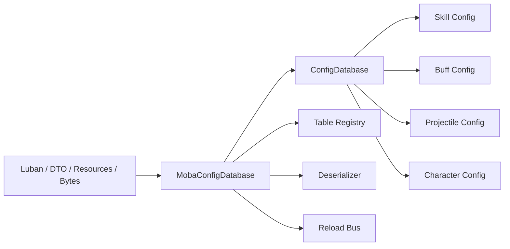
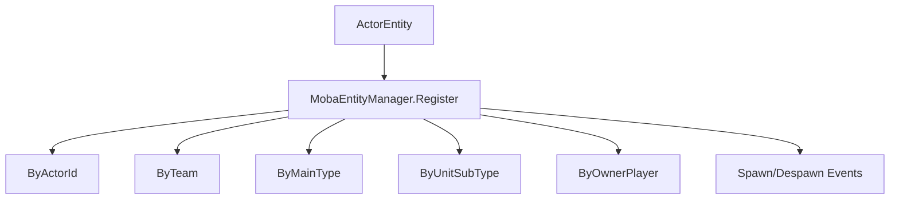
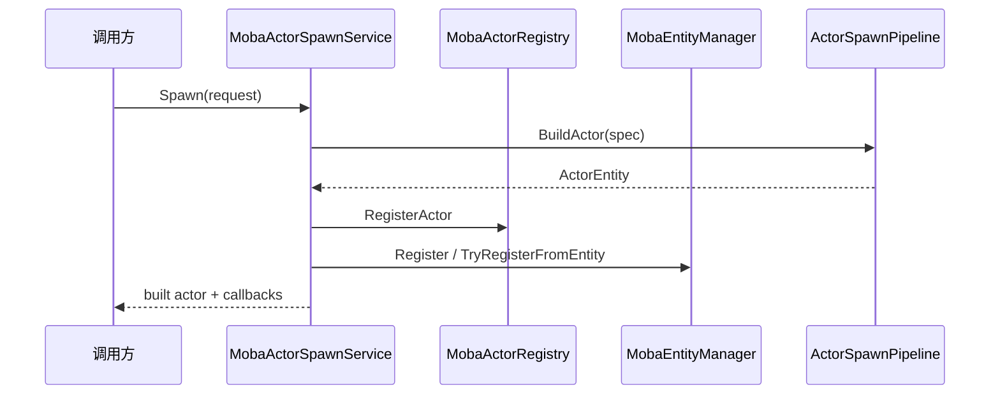

# MOBA 配置、实体索引与生成深潜

> 本文把 MOBA 示例中的配置门面、实体索引和 Actor 生成拆成独立专题，说明配置如何统一访问、实体如何被稳定索引、Actor 如何从 BuildSpec 生成并注册到运行时。

## 1. 为什么要单独拆出来

MOBA 的“战斗能力”最终都要落到三类基础设施上：

- 配置数据；
- 实体索引；
- 实体生成。

这三者是技能、Buff、Projectile、Damage 的共同底座，单独拆出来能让示例更容易迁移到真实项目。

## 2. 配置门面：MobaConfigDatabase

`MobaConfigDatabase` 是配置层的统一入口。它不是简单包装某个 loader，而是把多种来源统一为一个逻辑数据库。

支持的来源包括：

- Text sink；
- Resources；
- DTO provider；
- DTO arrays；
- Bytes；
- 热重载源。

## 3. 为什么要有“门面”而不是直接用 ConfigDatabase

MOBA 示例的配置层之所以值得单独封装，是因为它需要统一处理：

- 不同加载源；
- 版本号；
- 重载通知；
- DTO 与 Bytes 的转换；
- 表注册与反序列化策略。

这样技能系统、投射物系统、角色生成系统只要依赖 `MobaConfigDatabase`，就不需要关心底层是 Excel、资源还是 bytes。

## 4. 实体索引：MobaEntityManager

`MobaEntityManager` 不只是一个 `actorId -> entity` 字典，它还提供多维索引：

| 索引 | 用途 |
|------|------|
| `Index` | actorId 精确索引 |
| `ByTeam` | 阵营查询 |
| `ByMainType` | 主类型查询 |
| `ByUnitSubType` | 子类型查询 |
| `ByOwnerPlayer` | 玩家归属查询 |

### 4.1 索引的价值

多维索引让以下查询变得便宜而稳定：

- 找同队单位；
- 找某类怪物；
- 找玩家控制的 actor；
- 找当前场上的投射物；
- 做 buff 清理和死亡清理。

## 5. Actor 生成：MobaActorSpawnService

`MobaActorSpawnService` 负责把 `MobaActorBuildSpec` 变成真实 Actor。

请求对象里包含多个开关：

| 字段 | 作用 |
|------|------|
| `AllocateActorIdIfMissing` | 是否自动分配 actorId |
| `RegisterActor` | 是否注册到 ActorRegistry |
| `RegisterEntityManager` | 是否注册到 MobaEntityManager |
| `RegisterEntityManagerFromEntity` | 是否从实体反向注册索引 |
| `PostSetup` | 后置处理 |
| `Initializer` | 自定义初始化 |
| `OnActorBuilt` | 构造完成回调 |

## 6. 设计上的关键取舍

### 6.1 为什么把生成和索引分开

- 生成服务关注“如何构造”；
- EntityManager 关注“如何查找”；
- 这样召唤物、投射物、英雄和临时实体都能复用同一套机制。

### 6.2 为什么需要多回调

不同业务场景对生成时机有不同需求：

- 生成前要改 spec；
- 生成后要挂组件；
- 生成完成后要通知其他系统；
- 生成后还可能要重建快照缓存。

## 7. 与 Buff / Projectile / Damage 的关系

- Buff 需要通过 entity manager 找目标；
- Projectile 需要生成临时 actor；
- Damage 需要查找受击实体和攻击者；
- Snapshot 需要稳定的实体顺序。

因此配置、索引、生成是战斗能力链路的公共基础。

## 8. 源码索引

| 模块 | 源码 |
|------|------|
| 配置门面 | `Unity/Packages/com.abilitykit.demo.moba.runtime/Runtime/Infrastructure/Config/Core/MobaConfigDatabase.cs` |
| 表注册 | `Unity/Packages/com.abilitykit.demo.moba.runtime/Runtime/Infrastructure/Config/Core/IMobaConfigTableRegistry.cs` |
| DTO 反序列化 | `Unity/Packages/com.abilitykit.demo.moba.runtime/Runtime/Infrastructure/Config/Core/IMobaConfigDtoDeserializer.cs` |
| Bytes 反序列化 | `Unity/Packages/com.abilitykit.demo.moba.runtime/Runtime/Infrastructure/Config/Core/IMobaConfigDtoBytesDeserializer.cs` |
| 实体索引 | `Unity/Packages/com.abilitykit.demo.moba.runtime/Runtime/Application/Services/EntityManager/MobaEntityManager.cs` |
| Actor 生成 | `Unity/Packages/com.abilitykit.demo.moba.runtime/Runtime/Application/Services/EntityConstruction/MobaActorSpawnService.cs` |
