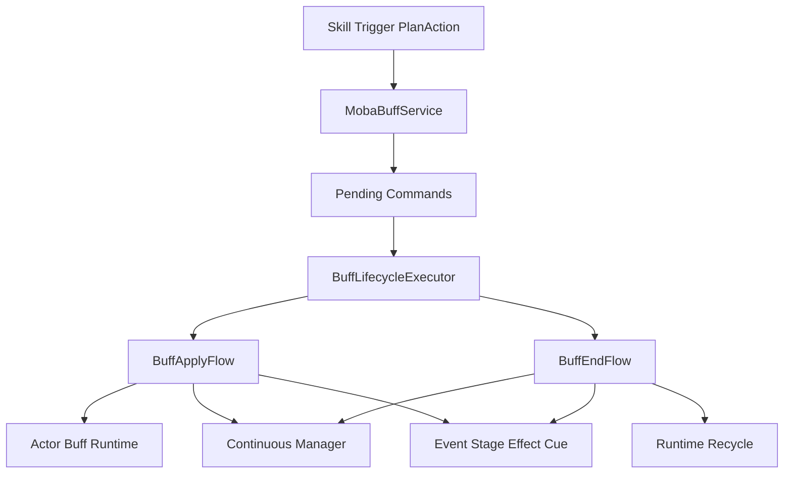
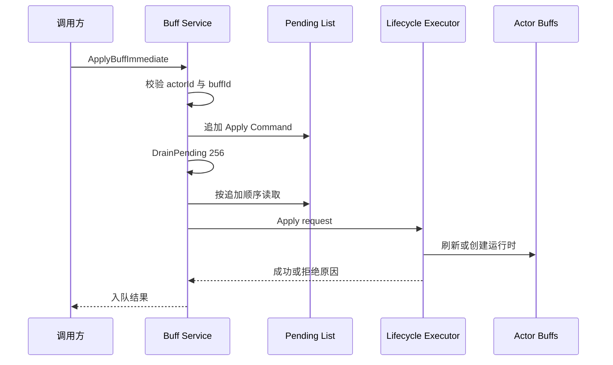
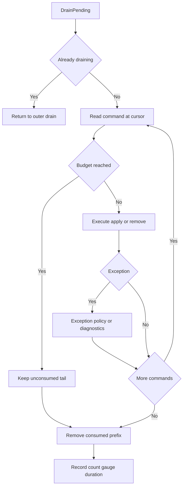
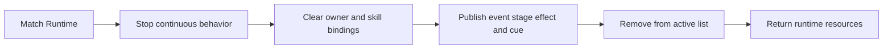
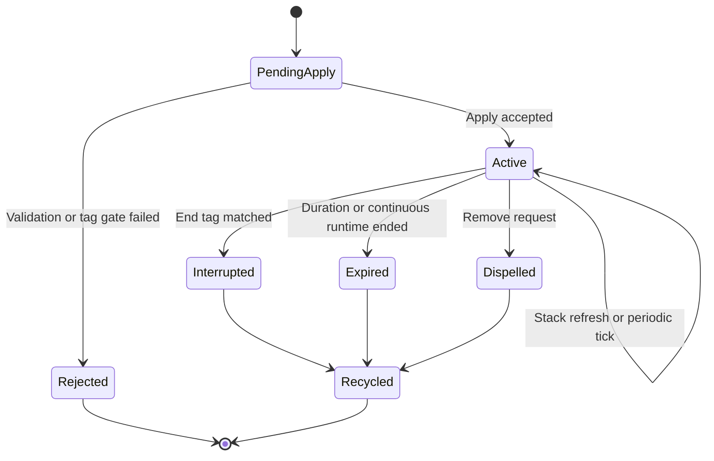

# MOBA Buff 生命周期深潜

> 本文拆解 MOBA 示例中 Buff 从请求入队、应用或刷新、持续运行、标签中断到最终回收的完整生命周期。重点不是罗列 Buff 效果，而是说明 `MobaBuffService`、`BuffLifecycleExecutor` 与持续行为运行时如何共同保证顺序、隔离重入并暴露可诊断的失败原因。

## 1. 能力定位与边界

Buff 是 MOBA 技能效果的长生命周期载体，可以承载属性修改、周期效果、标签门禁、表现 Cue 和触发器联动。入口服务不直接实现这些规则，而是把外部请求收敛到统一生命周期：

| 对象 | 负责 | 不负责 |
|------|------|--------|
| `MobaBuffService` | 参数初筛、命令排队、批量消费、调和入口、诊断 | 叠层策略、上下文创建、阶段效果细节 |
| `BuffLifecycleExecutor` | 编排 apply/remove，保存最近拒绝原因 | 直接持有世界 Tick |
| `BuffApplyFlow` | 配置和标签校验、刷新或新建运行时、绑定持续行为 | 对外排队和重入控制 |
| `BuffEndFlow` | 停止绑定、派发结束事件、移除并回收运行时 | 判断何时到期 |
| `IContinuousManager` | 推进持续行为和周期时间 | 决定 Buff 的业务叠层语义 |

因此，技能、触发器和 PlanAction 应调用 Buff 服务，而不应直接修改 Actor 的 `BuffsComponent.Active` 列表。

## 2. 源码入口与依赖

| 入口 | 路径 | 阅读重点 |
|------|------|----------|
| 对外入口 | `Unity/Packages/com.abilitykit.demo.moba.runtime/Runtime/Application/Services/Buffs/MobaBuffService.cs` | 即时 API、命令队列、调和与诊断 |
| 生命周期编排 | `Unity/Packages/com.abilitykit.demo.moba.runtime/Runtime/Application/Services/Buffs/Lifecycle/BuffLifecycleExecutor.cs` | apply/remove 分流、拒绝结果、结束顺序 |
| 请求模型 | `Unity/Packages/com.abilitykit.demo.moba.runtime/Runtime/Application/Services/Buffs/Core/BuffRuntimeContexts.cs` | `BuffApplyRequest`、`BuffRemoveRequest` |
| 应用流程 | `Unity/Packages/com.abilitykit.demo.moba.runtime/Runtime/Application/Services/Buffs/Lifecycle/BuffApplyFlow.cs` | 配置门禁、叠层、新实例创建 |
| 结束流程 | `Unity/Packages/com.abilitykit.demo.moba.runtime/Runtime/Application/Services/Buffs/Lifecycle/BuffEndFlow.cs` | 解绑、通知、移除和回收 |
| Tick 系统 | `Unity/Packages/com.abilitykit.demo.moba.runtime/Runtime/Application/Systems/Buffs/MobaBuffCommandDrainSystem.cs` | 每帧消费命令的系统边界 |

`MobaBuffService` 是 World Service。`OnInit` 通过当前 World 的 `IWorldResolver` 构建生命周期执行器，确保配置、Actor 查询、事件总线、Trace、持续行为和表现快照都来自同一战斗作用域；`Dispose` 清空尚未消费的命令。

## 3. 请求与命令模型

入口层内部使用 `BuffCommand` 保存单调递增的 `Seq`、`Apply` 或 `Remove` 类型及对应请求。当前列表按追加顺序消费，`Seq` 主要作为稳定顺序信息保留，并不在 drain 时再次排序。

应用请求的关键字段包括目标 Actor、Buff ID、来源 Actor、持续时间覆盖、来源上下文、是否强制新实例和 `BuffOriginContext`。实例级 API 要求 `sourceContextId` 非零，用它区分同一来源链上的独立运行实例。移除请求还携带 `TraceLifecycleReason`，未指定原因时由执行器规范化为 `Dispelled`。

入口只接受正数目标 ID 和 Buff ID。需要注意：`ApplyBuffImmediate` 返回 `true` 表示请求成功入队并触发了 drain，不代表底层生命周期一定应用成功；实际拒绝会通过 `LastReject`、日志和诊断指标暴露。这一语义要求调用方不要把返回值当作最终效果确认。

## 4. 即时调用仍走统一队列

所有 Immediate API 都遵循“先入队，再主动 drain”，没有绕过队列直接修改运行时：

这样即时调用、系统 Tick 中的延迟调用和效果执行期间派生出的新请求共享同一套顺序和错误处理。`RemoveBuffsImmediate` 会倒序扫描当前运行时，按 Buff ID 和来源筛选，可只移除一个或全部；它先为匹配项建命令，再以 `max(256, queued + 32)` 作为本轮预算。

## 5. Drain、重入与命令预算

`DrainPending(maxCommands)` 的行为具有明确约束：

1. `maxCommands <= 0` 时不执行；
2. `_draining > 0` 时直接返回，阻止效果回调递归进入第二层 drain；
3. 外层 drain 用游标遍历列表，执行期间追加到列表的新命令仍可由当前外层循环继续消费；
4. 达到预算后停止，将未消费尾部保留给下一次 Tick；
5. 单条命令异常被捕获并上报，后续命令继续执行；
6. 最后统一移除已读取前缀并记录诊断数据。

默认即时 API 使用 256 条预算，作用是阻断错误配置或循环触发造成的无限命令增长。超过预算会产生 `buff.drain.maxCommands` 警告和 `moba.buff.drain.maxCommandsExceeded` 计数，而不是静默丢弃剩余命令。

## 6. Apply 与叠层主线

`BuffLifecycleExecutor.Apply` 将请求交给 `BuffApplyFlow`。完整流程包括配置解析、目标查询、标签门禁、叠层策略、上下文创建、持续行为绑定和生命周期通知。应用可能有两种结果：

- 刷新或叠加已有运行时；
- 在 `forceNewInstance` 或策略要求下创建独立运行时。

运行时来源身份由 Buff ID、来源 Actor 和来源上下文共同约束。只用 Buff ID 查找会把不同技能实例产生的同名 Buff 错误合并，因此实例级申请和移除必须保留 `sourceContextId`。

失败不会抛给普通调用方，而是写入 `BuffLifecycleRejectResult`。该结果同时包含枚举类型、稳定字符串 code 和详细 message，入口服务据此生成 `buff.command.rejected`、按拒绝 code、Buff ID 和来源 Actor 拆分的指标。

## 7. Remove 与结束顺序

移除流程先确认请求、目标和 Buff 列表有效，再通过 `BuffRuntimeKey.MatchRemoveRequest` 倒序匹配运行时。倒序遍历避免移除列表项后破坏后续索引。`EndRuntime` 的顺序是生命周期正确性的关键：

先通知后回收，保证事件、阶段效果和表现 Cue 仍能读取完整上下文；先停止持续行为，避免被移除的 Buff 在同帧继续产生 tick。找不到匹配运行时也会形成明确拒绝码，而不是伪装成成功。

## 8. 生命周期调和

`ReconcileActorBuffLifecycles` 负责把持续行为状态和 Actor Buff 列表对账。它倒序遍历运行时并执行：

1. 删除空引用并标记仓储 dirty；
2. 延迟解析标签生命周期要求；
3. 标签要求触发结束时把剩余时间置零；
4. 有连续运行时则同步剩余时间和周期剩余时间；
5. 根据标签中断、连续运行时终止或普通倒计时归零决定结束；
6. 标签导致结束使用 `Interrupted`，自然结束使用 `Expired`。

原有提纲把“目标死亡、阵营变化”列为调和职责，但当前方法没有直接检查死亡或阵营字段；这类语义必须通过标签、显式 remove、持续运行时终止或其他生命周期系统转换后进入本流程。

## 9. 确定性、性能与诊断

| 维度 | 当前约束 |
|------|----------|
| 顺序 | 同一 World 内按命令追加顺序执行；不要从并发线程直接写入 `_pending` |
| 重入 | 派生请求由外层 drain 消费，不形成递归调用栈 |
| 预算 | 每轮有限命令数，剩余命令延后；预算变化会改变效果落帧，应纳入同步配置 |
| GC | pending list 复用；运行时最终由结束流程回收，诊断消息使用延迟工厂 |
| 异常 | 单命令异常按可恢复域错误上报，不中断整个队列 |
| Trace | source、parent、root、owner context 应跨 apply、tick、remove 保持 lineage |
| 回滚 | 命令队列和持续运行时都是逻辑状态；若用于预测回滚，必须纳入状态捕获或由确定输入重建 |

可观察指标包括 `moba.buff.drain.executed`、`moba.buff.pending`、`moba.buff.command.exceptions`、`moba.buff.command.rejected` 及按拒绝原因拆分的计数。排查“Buff 没生效”时，应先区分入口参数拒绝、生命周期拒绝、命令预算延后和执行异常四类原因。

## 10. 验证与源码阅读路径

推荐按以下顺序验证理解：

1. 从 `MobaBuffService.ApplyBuffImmediate` 确认即时 API 的真实返回语义；
2. 跟进 `DrainPending`，观察重入、预算和异常分支；
3. 进入 `BuffApplyFlow.Apply`，确认配置、标签和叠层决策；
4. 进入 `BuffEndFlow.EndRuntime`，核对解绑、通知和回收顺序；
5. 搜索 `ReconcileActorBuffLifecycles` 与 `MobaBuffCommandDrainSystem`，确认每帧调度位置；
6. 运行 MOBA runtime/acceptance 测试，并检查 Buff reject、pending 和 trace 指标。

文档层面的验收条件是：一次技能附加 Buff 后，能够从 source context 追到运行实例；周期效果可稳定推进；标签中断和自然过期具有不同原因；移除后持续行为、owner binding 与运行时资源均完成清理。

## 11. 设计结论

MOBA Buff 生命周期的核心不是“把效果挂到角色上”，而是让 apply、刷新、tick、触发、表现和结束在同一 World 内具备稳定顺序与可观察失败语义。命令队列解决入口重入和执行预算，生命周期执行器集中规则编排，调和过程负责把持续行为与 Actor 列表重新对齐；三者共同构成可回放、可测试、可诊断的 Buff 运行边界。
