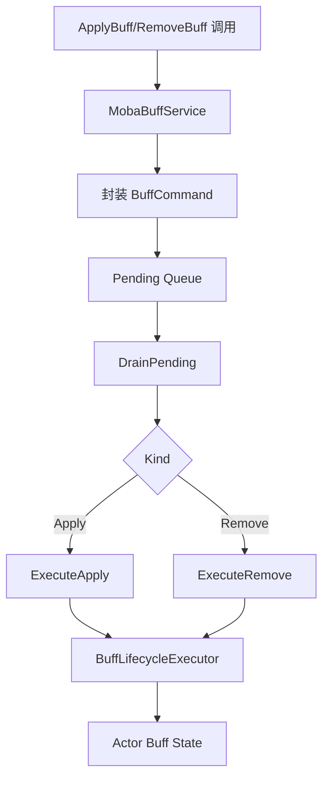

# MOBA Buff 生命周期深潜

> 本文单独拆解 MOBA 示例中的 Buff 生命周期，重点说明 `MobaBuffService` 如何把 apply/remove 请求收敛成命令队列，并通过生命周期执行器统一处理叠层、移除、调和与重入问题。

## 1. 为什么要单独拆出来

Buff 系统在 MOBA 里不是边缘功能，而是很多技能效果的主表达方式：

- 直接加属性；
- 持续伤害或治疗；
- 提供标签门禁；
- 触发技能联动；
- 参与死亡或复活逻辑。

Buff 生命周期如果不单独整理，很容易和技能执行、伤害计算、实体管理混在一起。

## 2. 服务边界

`MobaBuffService` 的职责不是“实现所有 Buff 规则”，而是：

1. 接收 apply/remove 请求；
2. 将请求包装为顺序命令；
3. 在统一时机 drain；
4. 委托 `BuffLifecycleExecutor` 执行；
5. 避免递归重入。

## 3. 命令队列

`BuffCommand` 记录了：

- 序号 `Seq`；
- 命令种类 `Apply` / `Remove`；
- `BuffApplyRequest`；
- `BuffRemoveRequest`。

这种“先排队再执行”的方式有三个好处：

- 同一帧操作顺序可控；
- 递归触发不会把状态改乱；
- 便于回放和烟测复现。

## 4. 生命周期调和

`ReconcileActorBuffLifecycles` 是 Buff 服务里最值得单独关注的环节之一。它说明 Buff 并不是简单的“加上就完”，而是要持续面对：

- 失效移除；
- 持续时长结束；
- 叠层更新；
- 目标死亡；
- 目标切换阵营或状态。

因此生命周期调和必须比单次 apply/remove 更“保守”和“统一”。

## 5. 重入保护

`MobaBuffService` 使用 `_draining` 来避免在 drain 过程中再次触发 drain。

这很重要，因为：

- 某个 Buff 的执行可能会产生新的 Buff 请求；
- 某些触发器会在 buff tick 时再次修改状态；
- 不加保护会导致栈式递归或顺序错乱。

## 6. 设计总结

Buff 生命周期的核心不是“多复杂的规则”，而是“怎么让复杂规则在稳定顺序里执行”。

这就是 MOBA 示例里把 Buff 服务单独抽成一个专门章节的原因。

## 7. 源码索引

| 模块 | 源码 |
|------|------|
| Buff 服务 | `Unity/Packages/com.abilitykit.demo.moba.runtime/Runtime/Application/Services/Buffs/MobaBuffService.cs` |
| Buff 生命周期执行器 | `Unity/Packages/com.abilitykit.demo.moba.runtime/Runtime/Application/Services/Buffs/BuffLifecycleExecutor.cs` |
| Buff 请求 | `Unity/Packages/com.abilitykit.demo.moba.runtime/Runtime/Application/Services/Buffs/BuffApplyRequest.cs` |
| Buff 请求 | `Unity/Packages/com.abilitykit.demo.moba.runtime/Runtime/Application/Services/Buffs/BuffRemoveRequest.cs` |
