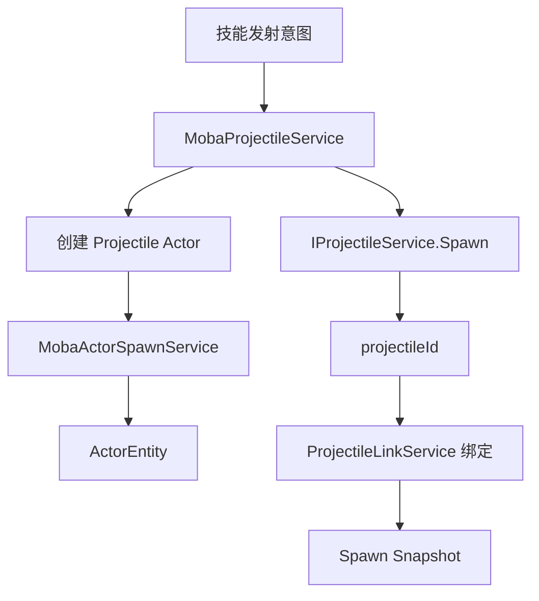
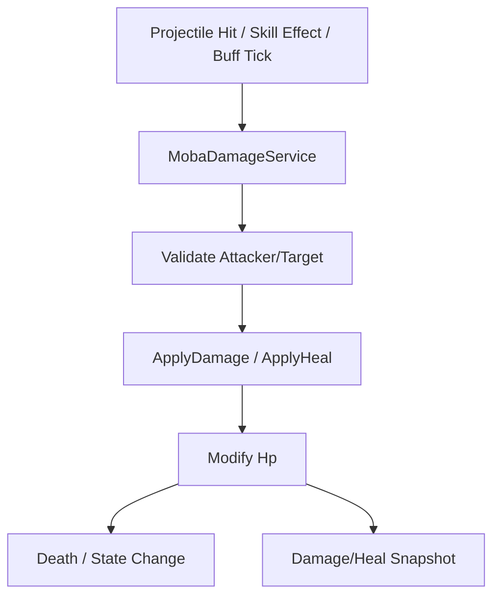

# MOBA Projectile 与 Damage 深潜

> 本文把 MOBA 示例中的投射物与伤害处理进一步拆分，说明 projectile 如何从技能意图变成可追踪实体，damage 如何把战斗结果落到属性和快照上。

## 1. 为什么要单独拆出来

Projectile 与 Damage 经常被写成一个“命中后扣血”的函数，但在 MOBA 示例里它们其实承担了不同职责：

- Projectile 负责飞行、命中和目标过滤；
- Damage 负责规则检查、血量修改和结果输出。

把它们分开，才能看清战斗系统的表达能力。

## 2. Projectile 生命周期

`MobaProjectileService` 连接了：

- 技能运行时；
- Actor 生成；
- 底层 `IProjectileService`；
- Projectile 与 Actor 的绑定；
- 生成快照。

## 3. 为什么要把 projectile 也做成 Actor

MOBA 示例里投射物不仅是一个逻辑对象，还要能：

- 被索引；
- 被快照采样；
- 被表现层显示；
- 被回放系统复现；
- 被链接到技能来源。

因此 projectile 走 Actor 生成管线是非常合理的设计。

## 4. 命中过滤的职责

Projectile 不能“撞到就算”，它需要处理：

- 自身命中排除；
- 阵营过滤；
- 目标可见性；
- 目标存活状态；
- 技能配置的命中规则。

这些规则应该在 projectile 层统一处理，而不是散落在 damage 里。

## 5. Damage / Heal 的职责边界

`MobaDamageService` 处理的不是“动画”，而是数值结果：

- 计算最终伤害或治疗；
- 校验攻击者和目标；
- 修改 `Hp`；
- 输出原因字段；
- 生成快照。

## 6. 为什么要保留 reason 参数

`reasonKind` 和 `reasonParam` 看起来只是附加字段，但它们对后续分析很重要：

- 表现层可以据此选择特效；
- 回放可以根据原因重建事件；
- 统计系统可以按原因归类；
- 调试时能快速定位伤害来源。

## 7. 与 Buff 的关系

Buff、Projectile 与 Damage 是一个连续链：

- Buff 可能触发额外发射；
- Projectile 命中可能触发 Buff；
- Damage 可能被 Buff 修改；
- 三者都可能产生快照。

因此它们不能看作孤立系统，而是一个战斗效果闭环。

## 8. 源码索引

| 模块 | 源码 |
|------|------|
| Projectile 服务 | `Unity/Packages/com.abilitykit.demo.moba.runtime/Runtime/Application/Services/Projectile/MobaProjectileService.cs` |
| Projectile 链接 | `Unity/Packages/com.abilitykit.demo.moba.runtime/Runtime/Application/Services/Projectile/MobaProjectileLinkService.cs` |
| Damage 服务 | `Unity/Packages/com.abilitykit.demo.moba.runtime/Runtime/Application/Services/Combat/MobaDamageService.cs` |
| Actor 生成 | `Unity/Packages/com.abilitykit.demo.moba.runtime/Runtime/Application/Services/EntityConstruction/MobaActorSpawnService.cs` |
