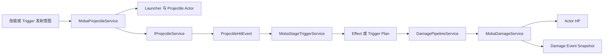
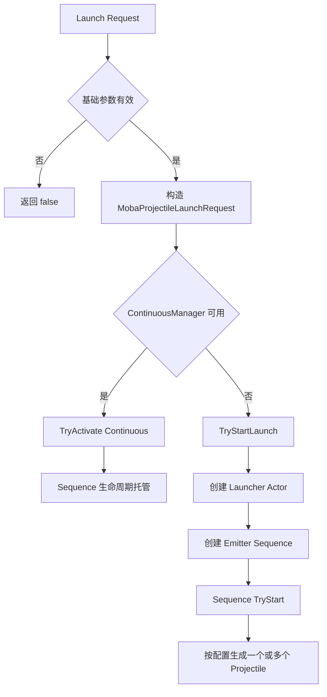
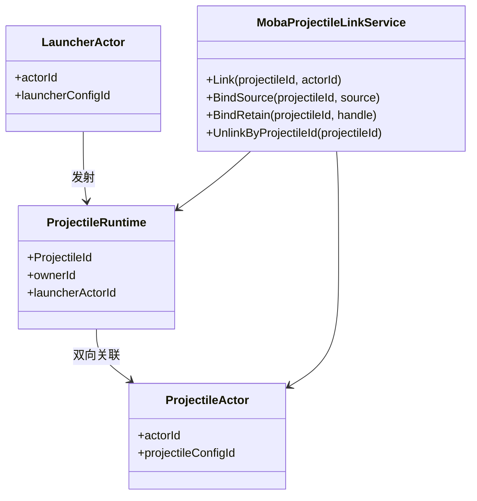
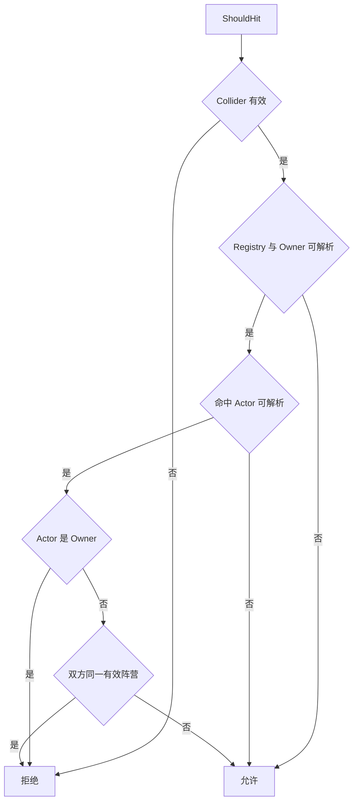
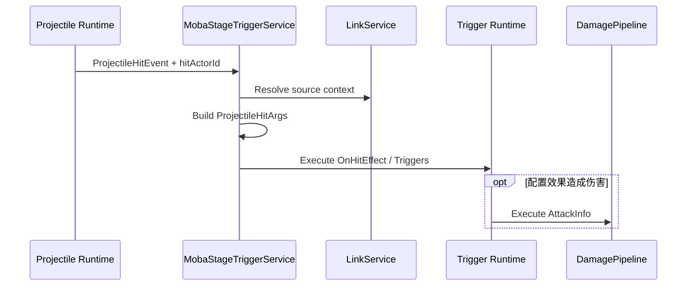

# MOBA Projectile 与 Damage 深潜

> 本文以当前运行时代码为准，拆解“发射意图 -> 投射物运动 -> 命中事件 -> 触发效果 -> 伤害计算 -> HP 与快照”的完整边界。Projectile 与 Damage 相邻但不直连，不能简化为一个命中扣血函数。

## 1. 职责分层

| 层次 | 核心组件 | 责任 |
|------|----------|------|
| 发射编排 | `MobaProjectileService` | 校验请求、换算帧参数、创建 launcher、选择发射序列 |
| 运动与碰撞 | `IProjectileService` | 生成逻辑 projectile、推进运动、碰撞、命中策略和退出 |
| Actor 身份 | `IMobaActorSpawnService` | 创建可索引、可快照、可表现的 launcher/projectile Actor |
| 关联与溯源 | `MobaProjectileLinkService` | 维护 projectile ID、Actor ID、来源上下文和 skill retain |
| 命中转译 | `MobaStageTriggerService` | 把底层命中事件转换为配置化 effect/trigger 调用 |
| 战斗计算 | `DamagePipelineService` | 公式阶段、减伤、护盾、最终伤害、事件与 trace |
| 数值落地 | `MobaDamageService` | 规则门禁、HP clamp、写回和 damage/heal 快照 |

关键边界：

- 投射物命中只表示空间碰撞被接受，不保证一定造成伤害；
- `OnHitEffectId` 或 `OnHitTriggerIds` 决定后续效果，配置可以施加 Buff、伤害或其他行为；
- `MobaDamageService` 不计算暴击、减伤和护盾，最终正数由 `DamagePipelineService` 生成；
- HP 变为零后，本服务不直接执行死亡状态机，死亡收敛由其他生命周期系统处理。



## 2. 两条发射入口

`MobaProjectileService` 暴露两类入口，服务于不同复杂度。

### 2.1 直接 `Shoot`

直接入口接收 projectile code、速度、寿命帧、最大距离和瞄准参数。它适合已获得运行时参数的简单直线投射物：

1. 校验 projectile service、caster、code、速度以及至少一个退出条件。
2. 读取 caster transform；空位置/方向回退到 caster 当前值，零方向回退到前向。
3. 分配 projectile Actor ID，通过统一 Actor spawn 管线创建 Actor，并标记 flying projectile。
4. 可选写入 Actor spawn snapshot。
5. 构造 `ProjectileSpawnParams` 并调用底层 `Spawn`。
6. 将 `ProjectileId` 与 Actor ID 双向关联，绑定来源上下文并保留技能运行时。

这条路径当前只处理 `Linear` emitter；未知枚举也落到默认直线分支。它不会创建 launcher Actor 或连续发射调度。

### 2.2 配置化 `Launch`

配置化入口接收 `ProjectileLauncherMO` 和 `ProjectileMO`，支持单发、散射、多轮、持续时间、返回运动、命中冷却和 prepare/hold 生命周期。

`Launch` 从 caster 推导缺失的出生点与方向，再委托 `LaunchFromSpawn`。若存在 `IContinuousManager`，发射先包装成 `MobaProjectileLaunchContinuous`；否则直接执行 `TryStartLaunch`。



## 3. 请求校验与确定性时间

`TryStartLaunch` 在创建实体前校验依赖和请求：

- projectile service、Actor ID allocator、registry、entity manager 和 spawn service 必须存在；
- caster ID、launcher/projectile 配置必须有效；
- 每轮数量必须大于零，扇形角和持续时间不能为负；
- caster 必须存在 transform；
- `IFrameTime.DeltaTime` 必须大于零。

毫秒配置通过当前固定帧时长转换成整数帧，包括 launcher interval、lifetime、return-after、hit cooldown、tick interval、prepare 和 hold。持续时间大于零时，重复次数为 `max(1, durationMs / intervalMs + 1)`；此时 interval 必须为正，否则抛出配置错误。

返回型 projectile 会把 tick interval 强制为一帧，以便持续推进返回行为。配置扩展时应继续在启动阶段完成时间离散化，避免运动循环中重复进行浮点到帧的换算。

## 4. Launcher Actor 与 Projectile Actor

配置化发射先创建 launcher Actor。launcher 表达“一次发射过程”，可承载多轮调度、来源和 retain；每个实际 projectile 则有底层 `ProjectileId`，并由发射序列创建或同步对应 Actor。

双身份解决了不同系统的键空间：

- `ProjectileId` 服务运动、碰撞、命中次数和退出；
- Actor ID 服务世界注册、属性/标签、快照、表现和通用生命周期；
- `MobaProjectileLinkService` 维护双向映射；
- unlink 时同时清除 source 和 retain，并上报临时实体 despawn 计数。



如果 launcher Actor 已创建但 emitter sequence 不存在或启动失败，服务会请求 launcher despawn，避免失败路径遗留临时 Actor。调用返回成功只表示序列已启动，不表示所有 projectile 已完成、命中或造成伤害。

## 5. 来源上下文与技能运行时保留

`ProjectileSourceContext` 携带 source/target actor、projectile config、source/root/owner context 以及 skill runtime handle。服务会补全缺失字段并为发射创建有效上下文，然后分别绑定到 launcher 与实际 projectile。

保留来源链有三个目的：

- 命中、tick 和 exit 触发可以回到原始技能与施法者；
- projectile 生命周期长于技能主流程时，skill runtime 不会提前释放；
- trace、表现 cue、统计和调试共享同一归因链。

`MobaProjectileLinkService.BindSource` 对不完整上下文直接抛出异常，而不是静默接受。新增发射入口必须复用 context builder 和 retain 机制，不能只生成底层 projectile。

## 6. 运动参数与命中策略

配置化发射构造的 `ProjectileSpawnParams` 包括：

| 参数组 | 内容 |
|--------|------|
| 身份 | owner、template、launcher、root actor、spawn frame |
| 运动 | position、direction、speed、return 参数 |
| 退出 | lifetime、max distance、lifecycle spec |
| 碰撞 | unit/world mask、caster collider ignore、hit filter |
| 命中策略 | single/pierce、剩余次数、tick interval、hit cooldown |

Pierce 配置使用 `HitsRemaining`；`-1` 表示无限，其余非正值回退到一次。底层 projectile 包负责实现运动和次数消费，MOBA 适配层负责把配置翻译成这些通用参数。

## 7. 命中过滤的真实能力

当前 `MobaTeamProjectileHitFilter` 只保证：

1. collider ID 为零时拒绝；
2. 能解析到 Actor 时拒绝命中 owner 自身；
3. owner 与 target 都有有效阵营且同队时拒绝；
4. 中立或未分队目标允许命中；
5. registry 缺失、owner 缺失或 collider 无法映射 Actor 时倾向允许，由底层碰撞继续处理。

它当前没有直接检查目标存活、可见性、无敌标签或技能特定目标规则。把这些能力写成 projectile 层已实现会造成错误预期。需要更严格规则时，可扩展组合 filter，或在命中 trigger/战斗规则层再次门禁；安全关键规则不能仅依赖这个宽松过滤器。



## 8. 命中到 Trigger，而非直接扣血

底层发出 `ProjectileHitEvent` 后，`MobaStageTriggerService`：

1. 按 template ID 查询 `ProjectileMO`；
2. 从 link service 恢复 `ProjectileSourceContext`；
3. 解析真实 source actor，输出命中表现 cue；
4. 构造 `ProjectileHitArgs`，包含 source、target、frame、point、normal、collider 和 projectile ID；
5. 执行 `OnHitEffectId`；
6. 顺序执行 `OnHitTriggerIds`。

若 target Actor ID 无效、配置不存在、trigger service 缺失或 source context 无效，后续效果不会执行。这个门禁确保可追踪命中才进入战斗效果链。



## 9. Damage Pipeline 的阶段

标准伤害不是在 `MobaDamageService` 内计算，而由 `DamagePipelineService` 依次执行：

1. 发布 `AttackCreated` 与 `BeforeCalc`；
2. 创建 `AttackCalcInfo` 并发布 `CalcBegin`；
3. 执行基础伤害、减伤、护盾吸收和最终伤害四个 stage；
4. 发布 `BeforeApply`；
5. 把 `calc.HpDamage.Value` 交给 `MobaDamageService.ApplyDamage`；
6. 构造 `DamageResult`，附带 origin 并记录 trace；
7. 记录战斗活跃度、诊断计数/耗时并发布 `AfterApply`。

stage 事件允许 Buff 或其他规则订阅计算节点，但必须保持确定顺序。新增公式应通过 pipeline stage 或明确的 formula kind 扩展，而不是绕过 pipeline 直接修改 HP。

## 10. HP 落地与 Heal 边界

`MobaDamageService.ApplyDamage` 只接受 `targetActorId > 0` 且 `value > 0` 的请求。若规则服务存在，先调用 `CanReceiveDamage`；随后查找 target，执行：

```text
newHp = clamp(oldHp - value, 0, maxHp)
actual = oldHp - newHp
```

只有 `actual > 0` 才写回 HP、报告 damage snapshot 并返回实际值。过量伤害因此只记录实际扣除值。

治疗不经过 Damage Pipeline，由 `MobaCombatEffectService.Heal` 直接委托 `ApplyHeal`。规则服务存在时，目标必须可查且存活；随后执行：

```text
newHp = clamp(oldHp + value, 0, maxHp)
actual = newHp - oldHp
```

满血治疗、无效目标和非正值都返回零且不产生快照。当前服务没有治疗公式、暴击治疗或护盾转治疗等阶段，需要时应单独设计 Heal Pipeline，而不是混入 damage stage。

## 11. Damage Event Snapshot

每次实际 damage/heal 会写入帧内缓冲，字段包括：

- 事件 kind；
- attacker/healer 与 target Actor ID；
- damage/heal type；
- 实际变化值；
- `reasonKind` 与 `reasonParam`；
- 变化后的 HP 与 MaxHP。

snapshot emitter 只在 `InGame` 阶段工作，同一帧最多导出一次；无事件时不发包。导出使用 `ToArrayClearAndTrim` 清空批次，因此消费端应把它理解为事件流，不是可重复读取的当前状态。

`reasonKind/reasonParam` 提供语义归因，但不替代完整 origin/trace。表现、统计可用 reason 分类；跨技能、Buff、projectile 的因果调查应优先使用来源上下文和 trace。

## 12. 失败、清理与可观测性

| 场景 | 当前行为 |
|------|----------|
| 请求或依赖无效 | 返回失败并记录 warning，创建前终止 |
| launcher spawn 失败 | 返回带 error 的结果 |
| sequence 创建/启动失败 | 请求 launcher despawn |
| projectile 退出 | 下游系统应 unlink Actor、source 和 retain |
| damage target 缺失 | pipeline 记录 `moba.damage.targetMissing` |
| damage 成功或被归零 | 均返回 `DamageResult`，Value 为实际应用值 |
| 快照缓冲为空 | emitter 不产生 snapshot |

监控至少应关注发射拒绝原因、活跃临时 projectile 数、命中到 effect 的转化率、damage value、pipeline/stage 耗时，以及 source context 缺失。只看“发射成功数”无法判断战斗链是否闭合。

## 13. 与 Buff 和其他效果的关系

三者通过 Trigger 与 Pipeline 组合，而不是互相硬编码：

- Buff trigger 可以发射 projectile；
- projectile hit effect 可以施加 Buff 或创建 `AttackInfo`；
- damage pipeline 的事件订阅者可以修改计算值；
- Buff tick 也可直接进入 damage pipeline；
- projectile、Buff 和 damage 共享 origin/trace，事件快照承担表现增量。

这种组合允许无伤害控制弹、命中加 Buff、穿透递减伤害等配置，但也要求任何新入口都完整传播 source context、reason 和 target。

## 14. 验证清单

当前目录检索未发现以 `MobaProjectile` 或 `DamagePipeline` 命名的直接专项测试，以下场景应作为补测优先级：

1. 直接 Shoot 的无效参数、方向回退、Actor spawn、link/source/retain 建立。
2. 配置化 Launch 的毫秒转帧、持续次数、散射顺序和随机源确定性。
3. sequence 创建或启动失败后 launcher 被请求回收。
4. self、same-team、neutral、registry/collider 无法解析时的过滤结果。
5. 命中只执行配置 effect/trigger，不隐式造成伤害。
6. source context 从技能经 launcher/projectile 传递到 `ProjectileHitArgs`。
7. standard damage stage 顺序、减伤、护盾和最终实际值。
8. 过量伤害与过量治疗 clamp，零实际变化不产生事件。
9. damage/heal snapshot 的 reason、HP、帧内批处理和 InGame 门禁。
10. projectile exit 后 link、source、retain 与临时实体计数全部释放。

## 15. 源码索引

| 模块 | 源码 |
|------|------|
| Projectile 服务与参数转换 | `Unity/Packages/com.abilitykit.demo.moba.runtime/Runtime/Application/Services/Projectile/MobaProjectileService.cs` |
| 发射请求/结果与序列 | `Unity/Packages/com.abilitykit.demo.moba.runtime/Runtime/Application/Services/Projectile/Launch/` |
| Projectile/Actor/Source 关联 | `Unity/Packages/com.abilitykit.demo.moba.runtime/Runtime/Application/Services/Projectile/MobaProjectileLinkService.cs` |
| 来源上下文 | `Unity/Packages/com.abilitykit.demo.moba.runtime/Runtime/Application/Services/Projectile/ProjectileSourceContext.cs` |
| 命中到 Trigger 的转译 | `Unity/Packages/com.abilitykit.demo.moba.runtime/Runtime/Application/Services/Triggering/MobaStageTriggerService.cs` |
| 通用 Projectile 运行时 | `Unity/Packages/com.abilitykit.combat.projectile/Runtime/Projectile/` |
| Damage Pipeline | `Unity/Packages/com.abilitykit.demo.moba.runtime/Runtime/Application/Services/Combat/Damage/DamagePipelineService.cs` |
| HP 落地与 Heal | `Unity/Packages/com.abilitykit.demo.moba.runtime/Runtime/Application/Services/Combat/MobaDamageService.cs` |
| 战斗效果门面 | `Unity/Packages/com.abilitykit.demo.moba.runtime/Runtime/Application/Services/Combat/MobaCombatEffectService.cs` |
| Damage/Heal 事件快照 | `Unity/Packages/com.abilitykit.demo.moba.runtime/Runtime/Application/Services/Snapshot/MobaDamageEventSnapshotService.cs` |
