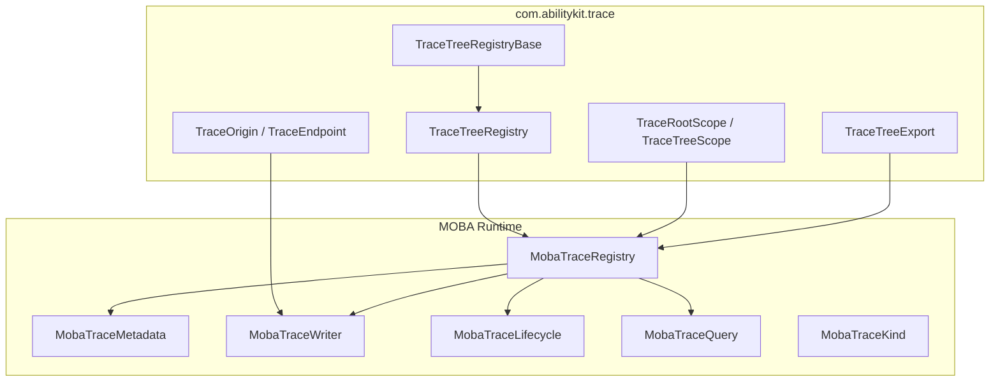
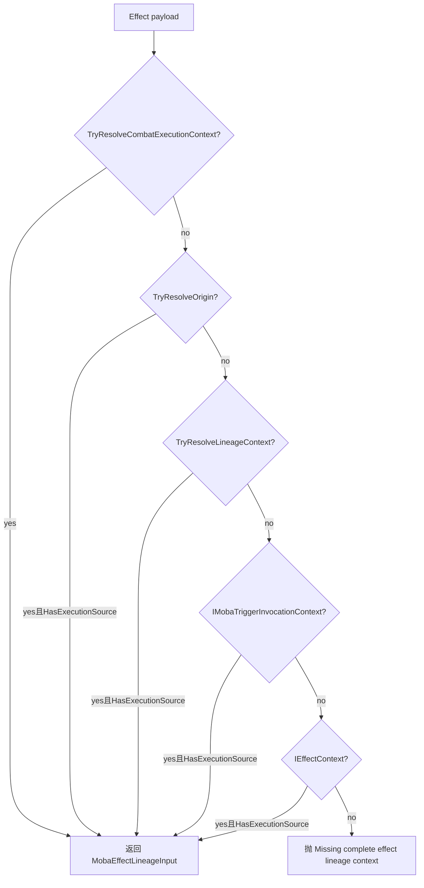
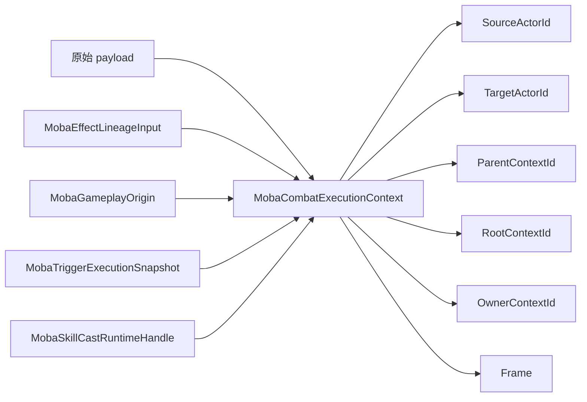
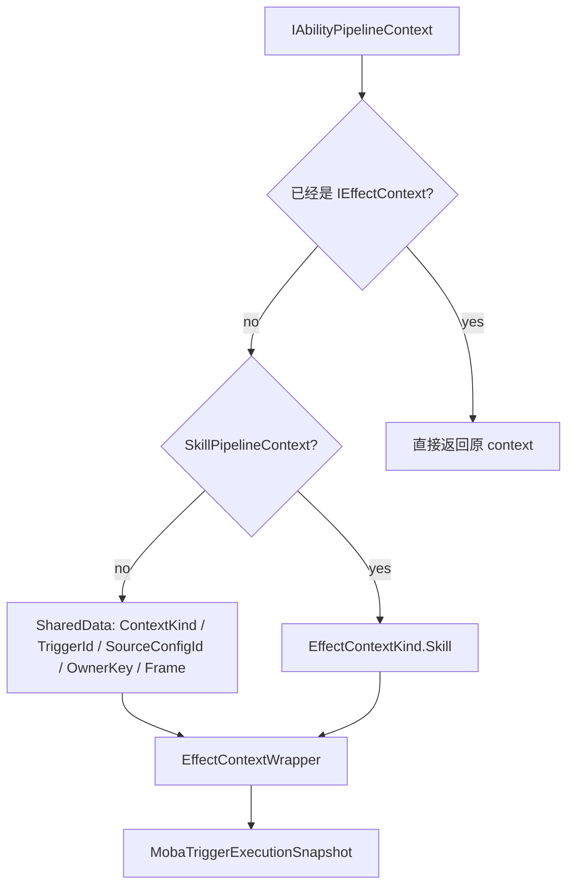
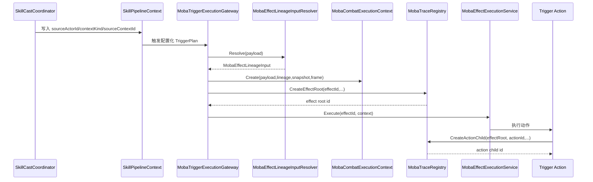

# MOBA Trace、Context 与 Effect 执行深潜

> 本文补充 MOBA 示例中 Trace、Context、Effect 三条链路的设计。它们解决的不是单个技能如何执行，而是“效果为什么被执行、由谁触发、挂在哪个父节点下、验收时如何证明动作确实发生”。

## 1. 设计目标

MOBA 示例把技能、Buff、Projectile、Damage 都纳入同一套可追踪上下文：

| 目标 | 说明 | 代表源码 |
|------|------|----------|
| 可解释 | 每次效果执行都能还原来源、目标、配置、父子关系 | `MobaTraceRegistry`、`MobaTraceMetadata` |
| 可传递 | Skill、Buff、Trigger、Effect 之间传递统一 lineage input | `MobaEffectLineageInput`、`MobaTriggerLineageContext` |
| 可校验 | 缺少 source/context 时直接失败，避免产生孤儿效果 | `MobaEffectLineageInputResolver`、`MobaCombatExecutionContextFactory` |
| 可验收 | 单测可以断言 EffectExecution 根节点与 EffectAction 子节点 | `MobaSkillConfigTestHarness`、`MobaAcceptanceExpectationAssert` |

## 2. Trace 注册表分层

`com.abilitykit.trace` 提供通用树结构，MOBA 只补充玩法语义。

核心关系：

1. `TraceTreeRegistryBase` 保存内部节点、根节点、父子表和叶子数据；
2. `TraceTreeRegistry<TMetadata>` 负责创建 root/child、快照查询、按 root 或 kind 枚举；
3. `MobaTraceRegistry` 继承泛型注册表，把 `int kind` 映射为 `MobaTraceKind`；
4. `MobaTraceMetadata` 保存 source actor、target actor、config id、origin display 等 MOBA 字段；
5. `TraceRootScope` / `TraceTreeScope` 用 `IDisposable` 模式保证 begin/end 成对。

## 3. MOBA Trace 节点模型

`MobaTraceRegistry` 的 `CreateMetadata` 会把通用 trace origin 转成 MOBA metadata：

| 字段 | 来源 | 用途 |
|------|------|------|
| `RootId` | 注册表创建 root 时生成 | 标识整条执行链 |
| `TraceKind` | `MobaTraceKind` | 区分 SkillCast、EffectExecution、EffectAction 等 |
| `ConfigId` | 技能、效果、动作、Buff 配置 id | 用于验收断言和回放定位 |
| `SourceActorId` | lineage/source context | 说明谁触发 |
| `TargetActorId` | lineage/target context | 说明作用于谁 |
| `OriginSource` | `TraceEndpoint` display | 人类可读来源 |
| `OriginTarget` | `TraceEndpoint` display | 人类可读目标 |

`MobaRuntimeKindNames` 则统一了 actor、skill、effect、action、buff、projectile、damage 等运行时分类字符串，便于诊断和上下文分类复用。

## 4. Effect Lineage 输入

`MobaEffectLineageInput` 是效果执行挂接到既有链路的正式输入：

| 属性 | 语义 |
|------|------|
| `ContextKind` | 当前执行来自 Skill、Buff、Projectile 等哪类上下文 |
| `OriginKind` | 创建 trace 时采用的来源 kind，效果通常是 `EffectExecution` |
| `SourceActorId` / `TargetActorId` | 执行源与执行目标 |
| `ParentContextId` | 新效果应挂接到哪个父 trace 节点 |
| `RootContextId` | 已知根节点；缺省时使用 parent 作为有效 root |
| `OwnerContextId` | 传递所有权上下文，用于持续效果、Buff、触发器链路 |
| `OriginConfigId` | 导致执行的配置 id |

关键约束：`HasExecutionSource` 要求 `SourceActorId > 0` 且 `ParentContextId != 0`。这意味着 MOBA 不允许 effect 在没有来源 actor 和父上下文的情况下悄悄执行，否则验收 trace 无法解释。

## 5. Lineage 解析顺序

`MobaEffectLineageInputResolver` 对任意 payload 做强制归一化。解析顺序体现了“越完整的上下文优先级越高”：

这条链路让多个系统可以用不同接口提供上下文：

- `IMobaCombatContextSource`：适合已经归一化的战斗上下文；
- `IMobaOriginContextProvider`：适合玩法事件来源；
- `IMobaTriggerLineageContextProvider`：适合触发器链路；
- `IMobaTriggerInvocationContext`：适合 trigger action 执行；
- `IEffectContext`：适合效果管线直接执行。

## 6. CombatExecutionContext：统一读模型

`MobaCombatExecutionContext` 是战斗执行期统一上下文。它不要求业务代码直接理解所有 payload 类型，而是统一读取 source、target、root、parent、owner、frame、skill runtime handle。

字段推导遵循稳定优先级：

| 字段 | 优先级 |
|------|--------|
| `SourceActorId` | Lineage → Origin → ExecutionSnapshot |
| `TargetActorId` | Lineage → Origin → ExecutionSnapshot |
| `ParentContextId` | Lineage → Origin.EffectiveParentContextId → Snapshot.SourceContextId |
| `RootContextId` | Lineage.EffectiveRootContextId → Origin.EffectiveRootContextId → Snapshot.EffectiveRootContextId |
| `ContextKind` | Lineage.ContextKind → Snapshot.Kind |

## 7. Effect 调用入口

`MobaEffectInvokerService` 提供两个入口：

| 入口 | 适用场景 | 行为 |
|------|----------|------|
| `Execute(effectId, sourceActorId, targetActorId, contextKind, sourceContextId, ...)` | 代码只知道基础执行参数 | 创建 `MobaEffectPipelineContext`，写入 source/target/context/sourceContextId |
| `Execute(effectId, IAbilityPipelineContext context)` | 已经处在技能或效果管线上 | 直接复用上下文执行 |

缺少 `MobaEffectExecutionService` 时不会静默失败，而是通过 `MobaRuntimeGuard.ThrowRequired` 抛出带 domain、operation、service、effectId 的错误。这种设计保证配置问题能在验收阶段暴露。

## 8. Pipeline Context 与 IEffectContext 兼容

`EffectContextWrapper` 解决通用 Ability Pipeline 与 MOBA Effect Context 之间的适配：

它会从 `AbilityContextKeys` 中读取 `ContextKind`、`TriggerId`、`SourceConfigId`、`OwnerKey`、`Frame`，并把 `SourceContextId` 映射到 `IAbilityPipelineContext` 的 shared data。这样 Skill Pipeline、Trigger Action 和 Effect Service 可以共享一套上下文字段。

## 9. 典型端到端链路

## 10. 验收视角

验收不是只看伤害数值，还要看 trace 结构：

| 验收点 | 说明 |
|--------|------|
| SkillCast trace | 技能是否进入释放链路 |
| EffectExecution trace | 指定 effectId 是否创建 root |
| EffectAction trace | 指定 actionId 是否挂在 effect root 下 |
| root/child 关系 | 动作不是孤儿节点，能回溯到效果根 |
| config id | 验收能精确定位技能、效果、动作配置 |

`MobaSkillConfigTestHarness` 中的 `AssertEffectExecutionTrace` 与 `AssertActionExecutedUnderEffect` 表明：MOBA 示例把 trace 当成配置化技能验收的一等结果，而不是辅助日志。

## 11. 设计边界

| 边界 | 说明 |
|------|------|
| Trace 不负责执行业务 | 只记录根、父子、kind、metadata、生命周期 |
| Context 不负责修改战斗状态 | 只提供稳定读模型与 source/root/parent 推导 |
| EffectInvoker 不负责解释配置 | 只把 effectId 与 context 交给执行服务 |
| Resolver 不做容错猜测 | 缺少完整 lineage 直接抛错 |
| 验收基于结构而不是日志文本 | 断言 trace node、root、configId、kind |

## 12. 源码入口

| 主题 | 源码 |
|------|------|
| 通用 trace registry | `Unity/Packages/com.abilitykit.trace/Runtime/TraceTreeRegistry.Core.cs` |
| trace scope | `Unity/Packages/com.abilitykit.trace/Runtime/TraceTreeScope.cs` |
| trace origin | `Unity/Packages/com.abilitykit.trace/Runtime/TraceOrigin.cs` |
| trace export | `Unity/Packages/com.abilitykit.trace/Runtime/TraceTreeExport.cs` |
| MOBA registry | `Unity/Packages/com.abilitykit.demo.moba.runtime/Runtime/Application/Services/Trace/MobaTraceRegistry.cs` |
| MOBA metadata | `Unity/Packages/com.abilitykit.demo.moba.runtime/Runtime/Application/Services/Trace/MobaTraceMetadata.cs` |
| lineage input | `Unity/Packages/com.abilitykit.demo.moba.runtime/Runtime/Application/Services/Context/Lineage/MobaEffectLineageInput.cs` |
| lineage resolver | `Unity/Packages/com.abilitykit.demo.moba.runtime/Runtime/Application/Services/Context/Lineage/MobaEffectLineageInputResolver.cs` |
| combat execution context | `Unity/Packages/com.abilitykit.demo.moba.runtime/Runtime/Application/Services/Context/Execution/MobaCombatExecutionContext.cs` |
| effect invoker | `Unity/Packages/com.abilitykit.demo.moba.runtime/Runtime/Application/Services/Effect/MobaEffectInvokerService.cs` |
| context wrapper | `Unity/Packages/com.abilitykit.demo.moba.runtime/Runtime/Application/Services/Effect/EffectContextWrapper.cs` |
| 验收 trace harness | `Unity/Packages/com.abilitykit.demo.moba.view.runtime/Runtime/Game/Test/UnitTest/MobaSkillConfigTestHarness.cs` |
