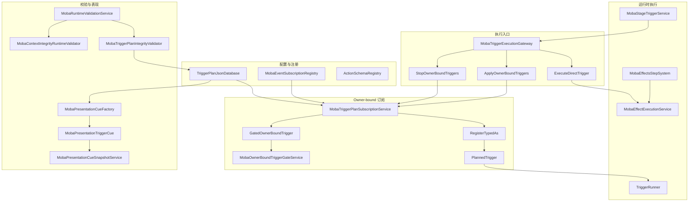
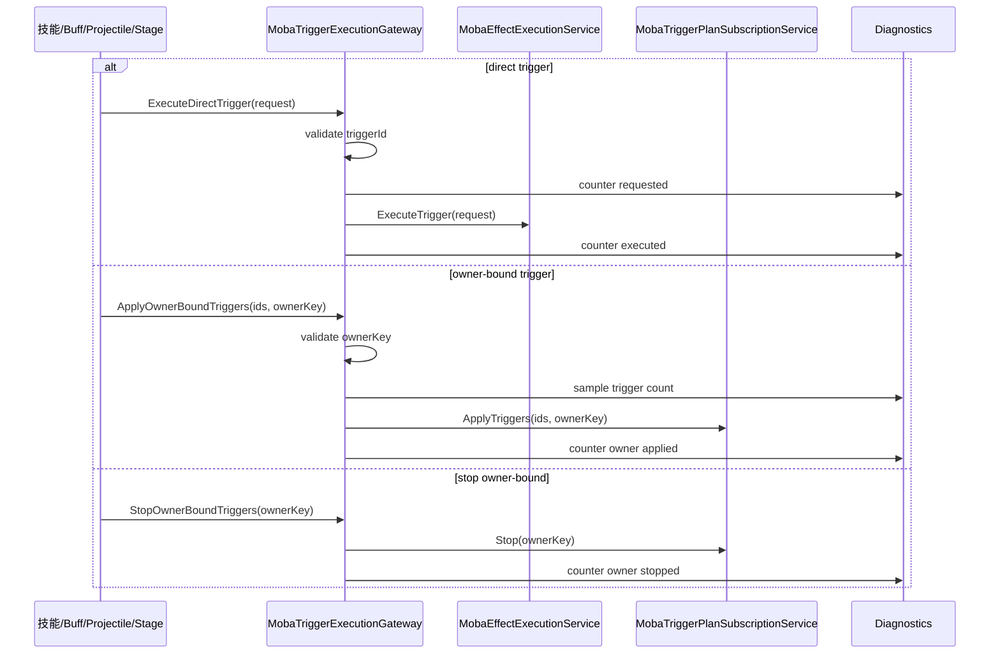
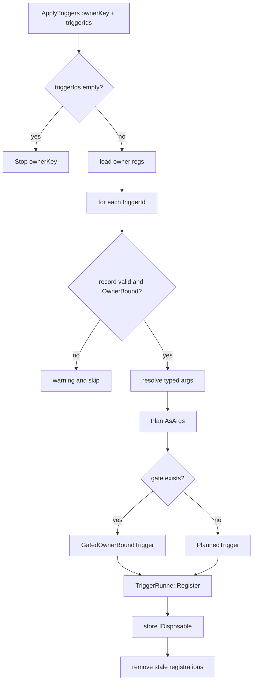
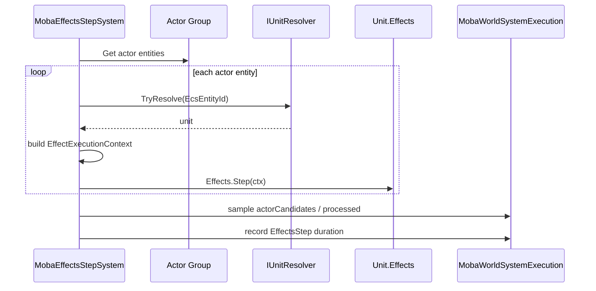
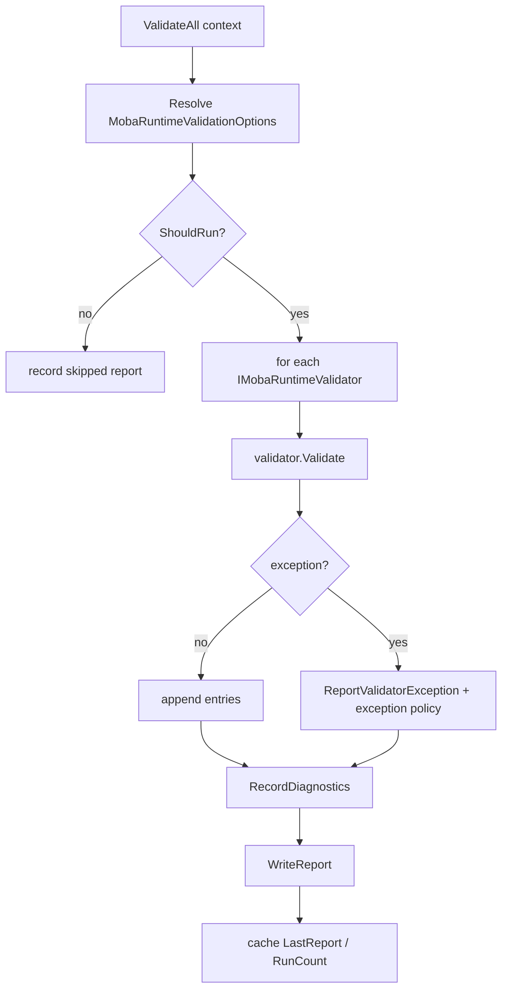
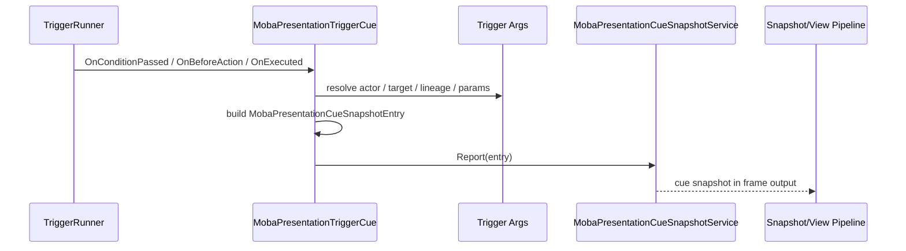

# MOBA Trigger、Validation 与 Presentation Cue 深潜

> 本文补充 MOBA 示例中尚未单独展开的触发器执行网关、owner-bound 订阅、运行时校验、阶段触发、效果 Step 与表现 Cue。它解释“触发器如何从配置变成运行时订阅、如何被门控、如何被校验、如何把逻辑事件转成表现快照”。

## 1. 设计目标

MOBA 触发器链路不是只负责执行计划，它还承担运行时安全边界：

| 目标 | 说明 | 代表源码 |
|------|------|----------|
| 入口收敛 | 直接触发与 owner-bound 触发统一从网关进入，便于统计、诊断和策略控制 | `MobaTriggerExecutionGateway` |
| 订阅调和 | 配置触发器按 ownerKey 注册、更新、清理，避免重复订阅和悬挂订阅 | `MobaTriggerPlanSubscriptionService` |
| 运行时门控 | 被动技能等 owner-bound 触发器在执行前检查状态，执行后提交状态 | `MobaOwnerBoundTriggerGateService`、`IMobaOwnerBoundTriggerGate` |
| 配置完整性 | 启动或采样阶段验证 TriggerPlan、ActionSchema、事件注册和上下文 | `MobaRuntimeValidationService`、`MobaTriggerPlanIntegrityValidator` |
| 逻辑转表现 | TriggerRunner 的 Cue 生命周期被转换成表现快照，而不是直接驱动 UI/VFX | `MobaPresentationCueFactory`、`MobaPresentationTriggerCue` |
| 持续效果推进 | 每帧扫描 actor 并推进 unit effects，统一记录诊断耗时 | `MobaEffectsStepSystem` |

## 2. 触发器运行时全景

## 3. `MobaTriggerExecutionGateway`：直接触发与订阅触发的统一入口

`MobaTriggerExecutionGateway` 的关键价值是让玩法模块不直接依赖 `MobaEffectExecutionService` 或 `MobaTriggerPlanSubscriptionService`。

| 入口 | 场景 | 关键行为 |
|------|------|----------|
| `ExecuteDirectTrigger<TPayload>` | 技能、阶段事件、投射物命中等一次性触发 | 校验 triggerId，记录 direct stats，调用 effect execution |
| `ApplyOwnerBoundTriggers` | Buff、被动、光环等绑定到 owner 的触发计划 | 校验 ownerKey，记录 owner apply stats，调用订阅服务调和 |
| `StopOwnerBoundTriggers` | owner 生命周期结束、Buff 移除、被动失效 | 停止 ownerKey 下全部订阅并统计 stop |
| `CopyActiveOwnerKeys` | 诊断或校验当前活跃 owner-bound 触发器 | 从订阅服务复制活跃 ownerKey |

执行网关还内建诊断计数：

- `moba.trigger.direct.requested` / `moba.trigger.direct.executed`；
- `moba.trigger.direct.invalidId`；
- `moba.trigger.owner.apply.requested` / `moba.trigger.owner.apply.executed`；
- `moba.trigger.owner.stop.requested` / `moba.trigger.owner.stop.executed`；
- missing service 时通过 `MobaRuntimeGuard.ThrowRequired` 转成运行时契约错误。

## 4. Owner-bound 订阅调和

`MobaTriggerPlanSubscriptionService` 在 `OnInit` 阶段读取 `TriggerPlanJsonDatabase.Records`，建立 `triggerId -> record` 和 `triggerId -> argsType` 两个索引。后者依赖 `MobaEventSubscriptionRegistry`，因为 owner-bound 触发器必须注册为强类型事件。

调和逻辑：

1. `ApplyTriggers(triggerIds, ownerKey)` 如果列表为空，等价于 `Stop(ownerKey)`；
2. 为 ownerKey 创建或复用 `Dictionary<int, IDisposable>` 保存订阅句柄；
3. 每个 triggerId 通过 `TryRegister` 校验 record 是否存在、eventId 是否非零、scope 是否为 `OwnerBound`；
4. `RegisterTyped` 通过反射调用 `RegisterTypedAs<TArgs>`，把 `TriggerPlan<object>` 转成 `TriggerPlan<TArgs>`；
5. 如存在 owner-bound gate，则包一层 `GatedOwnerBoundTrigger<TArgs>`；
6. 注册到 `TriggerRunner<IWorldResolver>`；
7. `RemoveStaleRegistrations` 释放本次 desired 列表中不再出现的旧订阅；
8. `OnDeinit` 停止全部 ownerKey，防止世界销毁后事件仍回调。

## 5. Owner-bound 门控

`MobaOwnerBoundTriggerGateService` 把门控聚合成一个服务，订阅链路不需要知道被动技能或其他玩法模块。

门控协议很小：

| 方法 | 含义 |
|------|------|
| `IsMatch(ownerKey, triggerId)` | 判断某个 gate 是否负责这个 owner/trigger |
| `CanExecute(ownerKey, triggerId)` | 执行前检查，例如冷却、次数、状态、一次性触发是否已消耗 |
| `Complete(ownerKey, triggerId)` | 执行后提交状态，例如扣次数或标记已触发 |

`GatedOwnerBoundTrigger<TArgs>` 会在 `Evaluate` 和 `Execute` 两处都调用 `CanExecute`：

- Evaluate 阶段提前过滤；
- Execute 阶段再次防御，避免 Evaluate 与 Execute 之间状态变化；
- Execute 成功后调用 `Complete`。

这使 owner-bound 触发器适合表达“被动技能触发一次后进入内部状态”的规则，而不是把这类状态散落到 Action 模块里。

## 6. Stage Trigger 与持续效果推进

`MobaStageTriggerService` 是 Area/Projectile 阶段事件进入触发器系统的适配层。接口覆盖：

- `ExecuteAreaStage`；
- `ExecuteProjectileSpawn`；
- `ExecuteProjectileTick`；
- `ExecuteProjectileExit`；
- `ExecuteProjectileHit`。

它的边界是“阶段事件转成触发请求”，而不是自己执行 Action。这样 Area、Projectile、Skill 都可以复用同一套 `MobaTriggerExecutionGateway` 统计、校验和执行策略。

`MobaEffectsStepSystem` 则处理每帧持续效果：

这个系统有三个关键约束：

1. 依赖缺失时通过 `MobaWorldSystemExecution.Require` 报告运行时契约；
2. 每个 actor 独立 try/catch，单个单位效果异常不会吞掉整帧系统诊断；
3. 统计 candidate、processed 和耗时，便于发现持续效果性能问题。

## 7. Runtime Validation：启动严格、运行采样、手动验证

MOBA runtime validation 由 `MobaRuntimeValidationService` 聚合。它不是简单的 assert，而是可配置的验证框架。

| 类型 | 作用 |
|------|------|
| `MobaRuntimeValidationOptions` | 控制 Enabled、Mode、RuntimeSampleInterval、日志条数 |
| `MobaRuntimeValidationMode` | `BootstrapStrict`、`EditorFull`、`RuntimeSampled`、`ManualOnly` 等运行模式 |
| `MobaRuntimeValidationReport` | 收集 Info/Warning/Error、是否阻塞启动、DTO 导出 |
| `MobaRuntimeValidatorContract` | 声明默认必需 validator 列表 |
| `IMobaRuntimeValidator` | 各模块独立实现验证逻辑 |

默认必需 validator 覆盖：

- 核心依赖、技能依赖、持续运行时依赖、战斗依赖；
- temporary entity 生命周期；
- output、diagnostics；
- battle main flow、runtime readiness、health summary；
- config reference；
- trigger plan integrity；
- gameplay trigger runtime；
- context integrity。

## 8. TriggerPlan 完整性校验

`MobaTriggerPlanIntegrityValidator` 直接针对 `TriggerPlanJsonDatabase` 执行配置层校验。

| 校验点 | 失败影响 |
|--------|----------|
| 数据库缺失 | 启动阻塞，触发器配置不可用 |
| records 为空 | warning，配置触发效果不会执行 |
| triggerId 非正或重复 | error，索引和业务 id 不可靠 |
| `TryGetRecordByTriggerId` / `TryGetPlanByTriggerId` 取不到 | error，数据库内部索引不一致 |
| `OwnerBound` / `Global` 缺 eventName 或 eventId | error，无法订阅事件 |
| eventName 未在 `MobaEventSubscriptionRegistry` 注册 | error，无法推断 TArgs |
| action id 为 0 | error，无法分发 ActionSchema |
| scheduleParam 为负 | error，调度参数非法 |
| maxExecutions 为 0 | warning，Action 永远不会执行 |
| ActionSchema 缺失或参数不合法 | error，Action 执行时会失败 |
| NumericValueRef 不完整 | error/warning，运行时取值可能失败 |

这个 validator 的意义是把“配置错误导致战斗中某个触发器悄悄不生效”提前变成启动期或编辑期可见问题。

## 9. Context Integrity：持续运行时的 lineage 检查

`MobaContextIntegrityRuntimeValidator` 聚焦 active continuous runtime 的上下文完整性。它通过 `IMobaContinuousRuntimeQueryService.GetAllContinuous(includeTerminated: false)` 取得未终止运行时，然后检查：

- `ContextSource.IsValid`；
- 是否同时具备 source actor 与 source context；
- runtime 或 context source 是否能解析 source actor；
- 是否能解析 root context 或 fallback source context；
- owner actor、owner id、owner context 是否至少存在一个；
- 标记为 `LiveRuntime` boundary 时是否真的链接到 live runtime source。

这些 warning 不一定阻塞启动，但会直接影响 trace、replay、diagnostics 和验收断言。

## 10. Presentation Cue：触发器生命周期到表现快照

`TriggerPlanJsonDatabase` 支持通过 `ICueFactory` 为触发器创建 Cue。MOBA 的实现是：

1. `MobaPresentationCueFactory.Create` 如果 cueKind、vfx、sfx 全空，则返回 `NullTriggerCue`；
2. 否则创建 `MobaPresentationTriggerCue`；
3. TriggerRunner 在 condition/action/executed/interrupted/skipped 等节点回调 Cue；
4. Cue 从 args 里解析 actor、targets、positions、lineage、presentation params；
5. Cue 构造 `MobaPresentationCueSnapshotEntry`；
6. 通过 `MobaPresentationCueSnapshotService.Report` 输出到快照层。

`MobaPresentationTriggerCue` 输出字段非常完整：

- trigger event id/name、trigger id、phase、priority、order；
- condition/action/executed/interrupted/skipped 阶段；
- actionIndex、interrupt reason/source/trigger id；
- source actor、target actor、targets、positions；
- context kind、origin kind、source/root/owner context、source config；
- requestKey、duration override、context event id；
- numeric/string 参数、scale、颜色。

这说明表现层不是“监听逻辑类并手写特效”，而是消费稳定快照协议。

## 11. 仍值得继续拆分的点

本轮源码阅读后，MOBA 仍有几个可继续单拆的主题：

| 候选专题 | 拆分理由 |
|----------|----------|
| PlanActions 全量模块 | AddBuff、GiveDamage、ShootProjectile、Dash、Blink、SetGameplayVar、PlayPresentation 等 Action schema 与执行上下文可以形成完整配置 DSL 文档 |
| Continuous Runtime | Buff/Area/Projectile/Passive 等持续运行时的生命周期、context source boundary 与 query service 值得独立文档化 |
| Runtime Validation 全量契约 | 当前文档只覆盖核心机制，所有默认 validator 可再按依赖、配置、主流程、健康度拆表 |
| Presentation Cue Snapshot 协议 | Cue entry 到 view runtime 的消费路径可以和 Moba snapshot/presentation 文档进一步合并 |

## 12. 源码锚点

| 主题 | 源码 |
|------|------|
| 执行网关 | `Unity/Packages/com.abilitykit.demo.moba.runtime/Runtime/Application/Services/Triggering/MobaTriggerExecutionGateway.cs` |
| owner-bound 订阅 | `Unity/Packages/com.abilitykit.demo.moba.runtime/Runtime/Application/Services/Triggering/MobaTriggerPlanSubscriptionService.cs` |
| owner-bound gate | `Unity/Packages/com.abilitykit.demo.moba.runtime/Runtime/Application/Services/Triggering/MobaOwnerBoundTriggerGateService.cs` |
| gate 接口 | `Unity/Packages/com.abilitykit.demo.moba.runtime/Runtime/Application/Services/Triggering/IMobaOwnerBoundTriggerGate.cs` |
| stage trigger | `Unity/Packages/com.abilitykit.demo.moba.runtime/Runtime/Application/Services/Triggering/MobaStageTriggerService.cs` |
| effects step system | `Unity/Packages/com.abilitykit.demo.moba.runtime/Runtime/Application/Systems/Effects/MobaEffectsStepSystem.cs` |
| runtime validation | `Unity/Packages/com.abilitykit.demo.moba.runtime/Runtime/Application/Services/Validation/MobaRuntimeValidation.cs` |
| trigger plan validator | `Unity/Packages/com.abilitykit.demo.moba.runtime/Runtime/Application/Services/Validation/MobaTriggerPlanIntegrityValidator.cs` |
| context integrity validator | `Unity/Packages/com.abilitykit.demo.moba.runtime/Runtime/Application/Services/Validation/MobaContextIntegrityRuntimeValidator.cs` |
| cue factory | `Unity/Packages/com.abilitykit.demo.moba.runtime/Runtime/Application/Services/Triggering/Cue/MobaPresentationCueFactory.cs` |
| presentation cue | `Unity/Packages/com.abilitykit.demo.moba.runtime/Runtime/Application/Services/Triggering/Cue/MobaPresentationTriggerCue.cs` |
