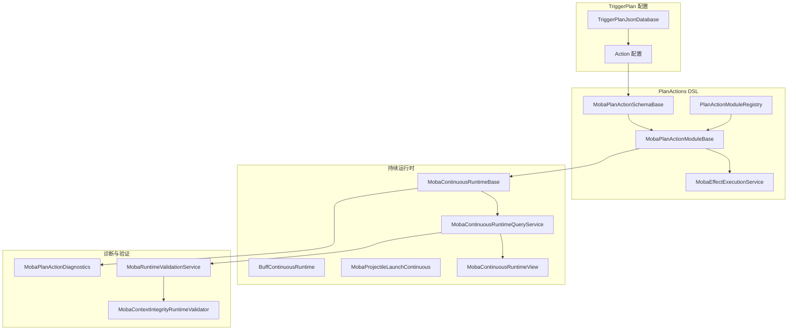
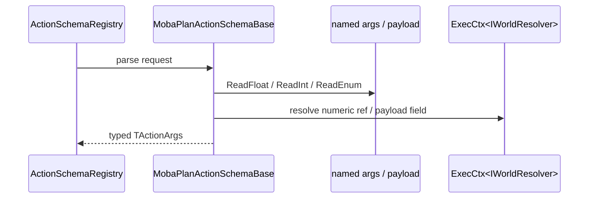
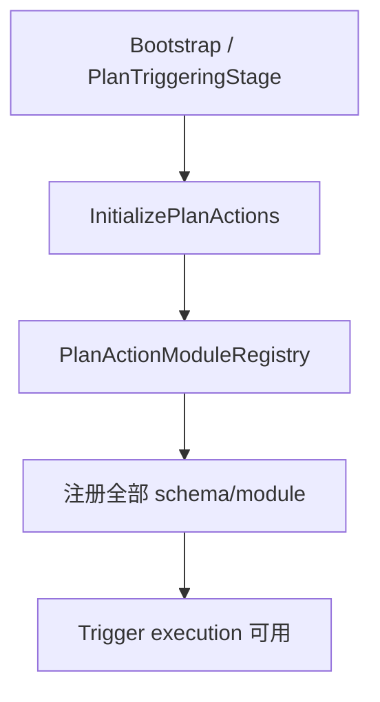
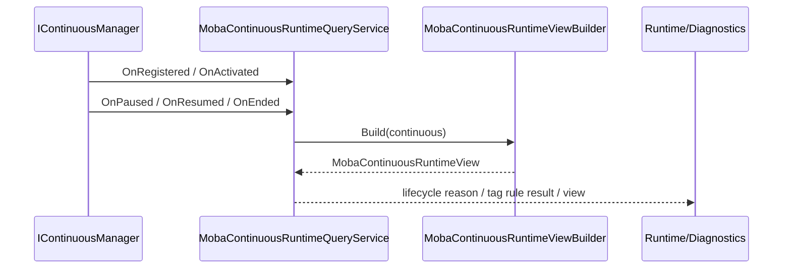

# MOBA PlanActions DSL 与 Continuous Runtime 深潜

> 本文补充 MOBA 示例中还未单独展开的两条关键设计线：一条是 Trigger Plan Action 的 DSL/Schema/Module 体系，另一条是 Buff/Projectile/Passive 等 continuous runtime 的生命周期、视图化查询与上下文边界。它们共同决定了“配置动作如何被解析成强类型执行单元”，以及“持续行为如何在运行时被观测、诊断和复用”。

## 1. 设计目标

| 目标 | 说明 | 代表源码 |
|------|------|----------|
| 强类型动作 DSL | 用 schema 统一定义 action 名称、参数解析、验证与执行，避免每个玩法模块手写字符串解析 | `MobaPlanActionSchemaBase<TActionArgs>` |
| 动作模块标准化 | 通过 module base 统一 ActionId、诊断输出、依赖解析与执行包装 | `MobaPlanActionModuleBase<TActionArgs, TModule>` |
| 配置驱动注册 | 启动时集中注册所有 plan action module，动作名与实现类一一对应 | `PlanActionModuleRegistry`、`PlanTriggeringStage` |
| 持续运行时可观测 | continuous runtime 不只是内部状态，还要能被查询成稳定 view 供诊断/回放/调试消费 | `MobaContinuousRuntimeQueryService`、`MobaContinuousRuntimeView` |
| 上下文边界可追踪 | source actor、target actor、root context、owner context、live runtime boundary 都要被保留下来 | `MobaContextSourceView`、`MobaContinuousRuntimeDebugInfo` |

## 2. PlanActions 与 Continuous Runtime 的关系

MOBA 的触发链路可以拆成两层：

1. **PlanActions DSL 层**：负责把 TriggerPlan 中的 action 配置解析成强类型 args，再由 module 执行到实际 gameplay service；
2. **Continuous Runtime 层**：负责表达“会持续存在并可被步进/查询/绑定”的实体，例如 Buff、Projectile、Passive、Area 等。

这两层不是割裂的：很多 plan action 会创建或刷新 continuous runtime，continuous runtime 也会回头暴露 context/debug 信息给 validation、trace 和 presentation。

## 3. `MobaPlanActionSchemaBase<TActionArgs>`：动作 DSL 的语义入口

`MobaPlanActionSchemaBase<TActionArgs>` 是所有 MOBA 计划动作结构描述的统一基类。它解决三个问题：

- **动作命名**：`ActionName` 是配置中的唯一语义名；
- **参数解析**：把 `Dictionary<string, ActionArgValue>` 解析为强类型 `TActionArgs`；
- **参数验证**：通过 `TryValidateArgs` 提前发现配置错误。

### 关键能力

| 能力 | 说明 |
|------|------|
| `ConfigActionName` | 配置侧动作名 |
| `ActionId` | 通过 `PlanActionRegisterUtil.GetActionId(ActionName)` 映射为稳定 id |
| `ArgsType` | 反射/注册时识别参数类型 |
| `ParseArgs(...)` | 读取命名参数并结合 `ExecCtx<IWorldResolver>` 解析运行时值 |
| `TryValidateArgs(...)` | 对 action 参数做配置期校验 |

### 解析辅助方法

基类提供了一组面向配置 DSL 的读取工具：

- `ReadFloat` / `ReadInt` / `ReadBool` / `ReadEnum`：按别名从 named args 取值；
- `ReadPositiveInts`：读取正整数数组；
- `RequireAny`：强制某组参数至少存在一个；
- `TryReadCurrentPayloadNumber` / `ReadCurrentPayloadInt`：从当前 trigger payload 读取字段值。

这些方法意味着动作配置并不是“直接写死一个字段名”，而是可以演化出兼容历史配置的别名集合。

## 4. `MobaPlanActionModuleBase<TActionArgs, TModule>`：动作执行模板

`MobaPlanActionModuleBase` 负责把 schema 输出的强类型 args 执行到 gameplay 代码。

### 关键职责

| 职责 | 说明 |
|------|------|
| ActionId 收敛 | `ActionId` 只从 `Schema.ActionId` 派生，避免重复声明 |
| ActionName 映射 | 通过 `IMobaPlanActionMetadata` 暴露配置名 |
| 依赖解析 | `TryResolveRequired<T>` 统一请求 world service |
| 诊断输出 | `LogRejected` / `LogApplied` / `LogInvestigation` 统一写日志 |

### 为什么要有 module base

如果没有这层基类，每个 action module 都要重复：

- 取 ActionId；
- 找 action 名；
- 处理依赖缺失；
- 输出一致的诊断文本。

基类让“动作模块”的差异只剩下真正业务逻辑。

## 5. 典型 PlanAction 模块族

当前 MOBA 的 action 族已经覆盖了多种玩法语义：

| 族 | 示例 |
|----|------|
| 技能 | `StartCooldown`、`ConsumeResource`、`CancelSkill`、`SpawnSummon`、`ShootProjectile` |
| 战斗 | `GiveDamage`、`TakeDamage`、`AddBuff`、`RemoveBuff`、`AddShield`、`RemoveShield` |
| 运动 | `Dash`、`Blink`、`Pull` |
| 调试/表现 | `DebugLog`、`PlayPresentation` |
| 游戏变量 | `SetGameplayVar`、`AddGameplayVar` |
| 结束控制 | `EndGame` |

这些模块的共同模式是：

1. schema 解析配置参数；
2. module 在 `Execute` 中请求运行时依赖；
3. 通过 `MobaPlanActionDiagnostics` 输出 rejected/applied/investigation；
4. 必要时创建/刷新 continuous runtime 或调用 combat/buff/projectile service。

## 6. 启动期安装：`PlanTriggeringStage`

`PlanTriggeringStage` 在 bootstrap 阶段调用 `MobaEffectExecutionService.InitializePlanActions()`，由服务统一注册所有 plan action 模块。

这意味着：

- 动作注册不散落在具体 buff 或 skill 里；
- 启动时可以一次性检查缺失 schema/module；
- 动作表与执行链路同步进入世界。

## 7. Continuous Runtime：持续行为对象化

`MobaContinuousRuntimeBase` 是持续运行时的最底层基类。`BuffContinuousRuntime`、`MobaProjectileLaunchContinuous` 等都以它为基础实现。

### 连续运行时的核心特征

- 不是一次性 action，而是可持续存在的 runtime 实体；
- 具有 owner/source/target/context 信息；
- 支持生命周期事件；
- 能被 query service 视图化；
- 可绑定 tag rule、modifier、state sync、debug source。

### 典型实现

| 类型 | 特点 |
|------|------|
| `BuffContinuousRuntime` | Buff 生命周期外壳，支持 duration、interval effect、state sync、debug source、execution context provider |
| `SkillPipelineContinuousRuntime` | 技能施法 pipeline 的生命周期标签外壳，pipeline 存活期间持有霸体等 continuous tag |
| `MobaTriggerIntervalContinuousRuntime` | 固定持续时间/固定间隔触发器型过程，用于光环、被动 tick、脱战转化等稳定周期逻辑 |
| `MobaPipelineContinuousRuntime<TCtx>` | pipeline-backed continuous 外壳，用于非固定时间、多阶段、条件等待、并行/重复阶段等复杂过程 |
| `MobaProjectileLaunchContinuous` | 投射物发射持续过程；复杂多阶段发射可在内部组合 pipeline-backed sequence |

### 固定间隔与 Pipeline-backed 的边界

`MobaTriggerIntervalContinuousRuntime` 和 `MobaPipelineContinuousRuntime<TCtx>` 是并列 runtime，不是继承替代关系。

| 场景 | 推荐 runtime | 判断标准 |
|------|--------------|----------|
| 每 N 秒执行一组 trigger，直到固定 duration 或外部门控中断 | `MobaTriggerIntervalContinuousRuntime` | 时间点固定，行为不需要内部阶段状态 |
| 引导直到松手、目标丢失、距离超限或条件满足 | `MobaPipelineContinuousRuntime<TCtx>` | 结束条件不是固定 duration，依赖 wait-until/condition |
| 多阶段弹幕、预警后发射、阶段间并行/重复 | 领域 continuous + pipeline-backed sequence，或 `MobaPipelineContinuousRuntime<TCtx>` | 内部阶段需要 sequence/parallel/repeat/delay |
| 位移、击退、牵引、冲刺 | motion domain runtime/manager；必要时外层接 continuous | 位移仲裁必须集中到 motion pipeline，不放进通用 continuous 执行器 |

`MobaPipelineContinuousRuntime<TCtx>` 的职责只到三件事：

- 把 `IAbilityPipelineRun<TCtx>` 纳入 `IContinuousManager` 的生命周期、暂停、恢复、中断和查询；
- 让 pipeline 存活期间能携带 continuous tag、modifier 和 context source；
- pipeline completed 时结束 continuous，continuous interrupted 时 interrupt pipeline。

它不负责解释具体 pipeline 配置，也不直接执行 gameplay action。阶段构建仍属于技能、投射物、被动或其他领域服务；通用 continuous 只提供外壳协议。

### 维护规则

- 不要把 `MobaTriggerIntervalContinuousRuntime` 扩成支持条件、阶段、并行和领域动作的万能 runtime；这类需求应新建 pipeline-backed 或领域 runtime。
- 不要让 motion/displacement 直接由通用 continuous 推 transform；位移源必须进入 motion pipeline 做优先级、叠加、覆盖和最终位移仲裁。
- pipeline-backed continuous 的 tag/modifier 生命周期以 outer continuous 为准，阶段内部不要再独立决定 tag 清理。
- 只有当流程需要被 query、debug、tag rule、modifier projection 或 interruption 统一治理时，才需要包一层 continuous。

## 8. `MobaContinuousRuntimeQueryService`：把持续运行时变成可查询视图

`MobaContinuousRuntimeQueryService` 是观察 continuous runtime 的标准入口。

### 它做了什么

| 方法 | 作用 |
|------|------|
| `GetOwnerContinuous(ownerActorId)` | 获取指定 owner 的连续运行时 |
| `GetAllContinuous()` | 获取全局 active continuous |
| `TryGetRuntimeView(continuous, out view)` | 单对象视图化 |
| `GetLifecycleReason(continuous)` | 返回最近生命周期事件与原因 |
| `GetTagRuleResult(continuous)` | 返回 tag rule 结果或解释 |

### 生命周期绑定

该 service 同时实现 `IContinuousLifecycleBinder`：

- `OnRegistered` / `OnActivated`：记录注册与激活；
- `OnPaused` / `OnResumed`：记录 tag rule/lifecycle 暂停恢复；
- `OnEnded` / `OnUnregistered`：记录结束原因。

这使 continuous runtime 不再只是“黑盒 IContinuous”，而是有可追踪原因的运行态对象。

## 9. `MobaContinuousRuntimeView`：持续运行时的稳定观测模型

`MobaContinuousRuntimeView` 把 continuous runtime 的结构和上下文压平为一个只读视图。

### 关键字段

- 身份：`Id`、`Kind`、`ConfigId`；
- 所有权：`OwnerId`、`OwnerActorId`、`SourceActorId`、`TargetActorId`；
- 上下文：`SourceContextId`、`ParentContextId`、`RootContextId`、`OwnerContextId`；
- 状态：`State`、`IsActive`、`IsPaused`、`IsTerminated`；
- 时间：`ElapsedSeconds`、`DurationSeconds`、`RemainingSeconds`、`IntervalSeconds`、`IntervalRemainingSeconds`；
- 结构：`Stack`、`MaxStack`、`IntervalEffectIds`、`Tags`、`Modifiers`；
- 诊断：`LastTagRuleResult`、`CurrentTagRuleResult`、`ContextSource`。

### 为什么要有 view

它解决的是“continuous runtime 的内部状态不能直接暴露给外部系统”的问题：

- 诊断系统需要稳定字段；
- replay/trace 需要可记录结构；
- 未来若 runtime 内部实现改变，view 可以保持兼容。

## 10. 运行时上下文边界

MOBA 的 continuous runtime 与 context 设计很强调边界来源：

- `MobaContextSourceView` 区分 origin / lineage / execution / runtime debug；
- `MobaContextSourceBoundary` 区分 snapshot / execution / live runtime；
- `HasLiveRuntime` 与 `HasRuntimeDiagnostics` 标记是否来自真实运行时。

`MobaContinuousRuntimeView` 和 `MobaContextIntegrityRuntimeValidator` 正是围绕这些边界工作：

- context 是否可解析；
- source actor / source context 是否同时存在；
- root context / owner context 是否完整；
- live runtime boundary 是否真的落在 live runtime source 上。

## 11. 这一层最值得关注的几个模块

| 模块 | 价值 |
|------|------|
| `GiveDamagePlanActionModule` | 展示 target resolve、combat pipeline、trace 输出、失败诊断 |
| `ShootProjectilePlanActionModule` | 展示 launch 参数、持续 runtime 创建、射击配置 DSL |
| `AddBuffPlanActionModule` | 展示 buff 绑定与 target request 解析 |
| `DashPlanActionModule` / `BlinkPlanActionModule` | 展示运动类 action 的方向解析与执行管线 |
| `PlayPresentationPlanActionModule` | 展示逻辑动作与表现模板的桥接 |

## 12. 仍值得继续拆分的点

| 候选专题 | 拆分理由 |
|----------|----------|
| PlanActions 全量 DSL | 当前文档覆盖了基类与注册/执行模式，仍可把每个动作族拆成独立配置文档（技能、战斗、运动、表现、调试） |
| Continuous Runtime 状态同步 | Buff/Projectile 等 runtime 的 state sync、tag rule、modifier explain 与 snapshot 还可继续深挖 |
| Continuous Runtime Debug Source | debug info 的结构化输出可以和 trace / validation 再合并成单文档 |

## 13. 源码锚点

| 主题 | 源码 |
|------|------|
| PlanAction 模块基类 | `Unity/Packages/com.abilitykit.demo.moba.runtime/Runtime/Application/Services/Triggering/PlanActions/Core/MobaPlanActionModuleBase.cs` |
| PlanAction schema 基类 | `Unity/Packages/com.abilitykit.demo.moba.runtime/Runtime/Application/Services/Triggering/PlanActions/Core/MobaPlanActionSchemaBase.cs` |
| PlanAction 注册 | `Unity/Packages/com.abilitykit.demo.moba.runtime/Runtime/Application/Services/Triggering/PlanActions/Core/PlanActionModuleRegistry.cs` |
| PlanAction 注册工具 | `Unity/Packages/com.abilitykit.demo.moba.runtime/Runtime/Application/Services/Triggering/PlanActions/Core/PlanActionRegisterUtil.cs` |
| Plan action 安装阶段 | `Unity/Packages/com.abilitykit.demo.moba.runtime/Runtime/Application/Systems/Bootstrap/Flow/Stages/PlanTriggeringStage.cs` |
| 运行时校验 | `Unity/Packages/com.abilitykit.demo.moba.runtime/Runtime/Application/Services/Validation/MobaRuntimeValidation.cs` |
| Continuous 查询服务 | `Unity/Packages/com.abilitykit.demo.moba.runtime/Runtime/Application/Services/Continuous/MobaContinuousRuntimeQueryService.cs` |
| Continuous 视图定义 | `Unity/Packages/com.abilitykit.demo.moba.runtime/Runtime/Application/Services/Continuous/MobaContinuousRuntimeViews.cs` |
| Trigger interval continuous runtime | `Unity/Packages/com.abilitykit.demo.moba.runtime/Runtime/Application/Services/Continuous/MobaTriggerIntervalContinuousRuntime.cs` |
| Pipeline-backed continuous runtime | `Unity/Packages/com.abilitykit.demo.moba.runtime/Runtime/Application/Services/Continuous/MobaPipelineContinuousRuntime.cs` |
| Buff continuous runtime | `Unity/Packages/com.abilitykit.demo.moba.runtime/Runtime/Application/Services/Buffs/Runtime/BuffContinuousRuntime.cs` |
| Skill pipeline continuous runtime | `Unity/Packages/com.abilitykit.demo.moba.runtime/Runtime/Application/Services/Skill/Pipeline/SkillPipelineContinuousRuntime.cs` |
| Projectile continuous runtime | `Unity/Packages/com.abilitykit.demo.moba.runtime/Runtime/Application/Services/Projectile/Launch/MobaProjectileLaunchContinuous.cs` |
| Context source 视图 | `Unity/Packages/com.abilitykit.demo.moba.runtime/Runtime/Application/Services/Context/Providers/MobaTriggerContextProviders.cs` |
| Context integrity validator | `Unity/Packages/com.abilitykit.demo.moba.runtime/Runtime/Application/Services/Validation/MobaContextIntegrityRuntimeValidator.cs` |
