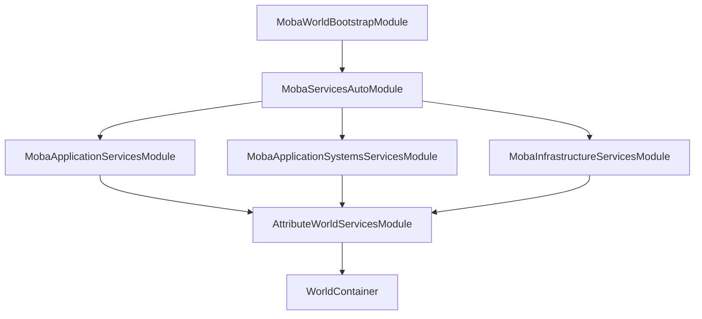
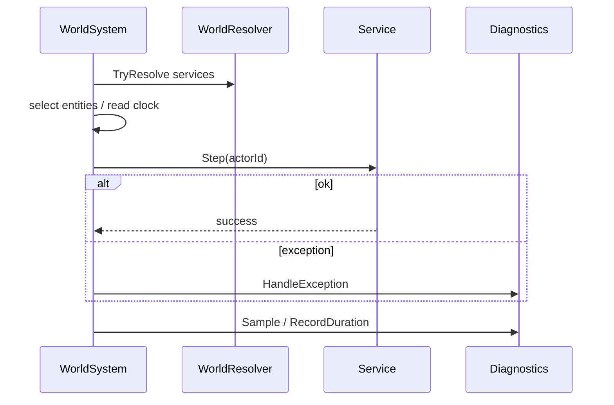
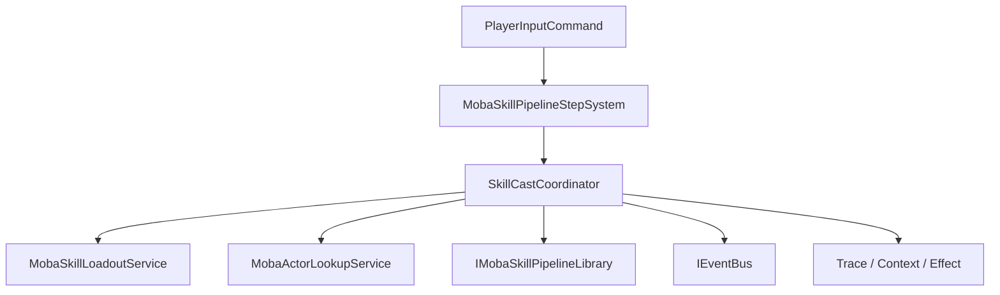
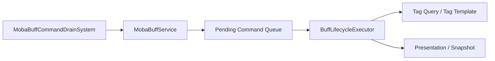
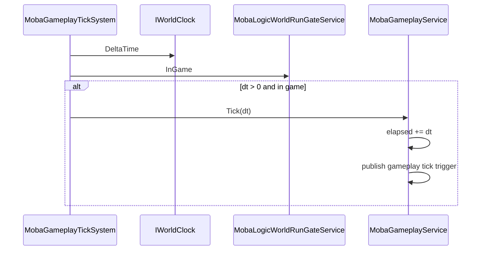

# MOBA 依赖注入与 System/Service 协作深潜

> 本文说明 MOBA 示例为什么把主要业务逻辑放在 Service 层，把 System 层收敛成调度、遍历、ECS 写回和异常边界，并通过世界级依赖注入把配置、诊断、时间、事件、实体索引和能力执行解耦出来。结论是：当前 DI 模块和 Entitas System 适配层已经明确支持“Service + ECS System”的组合开发模式，MOBA 示例也大量采用了这条路径。

---

## 1. 设计目标

MOBA 的依赖注入与协作模式，核心不是“把对象都注入进去”，而是让不同职责落在不同层：

| 层级 | 职责 | 典型类型 |
|------|------|----------|
| 世界装配层 | 声明服务、系统、模块与生命周期 | `MobaWorldBootstrapModule`、`MobaServicesAutoModule` |
| 服务层 | 承载业务规则、状态机、配置读取、事件发布、校验逻辑 | `SkillCastCoordinator`、`MobaBuffService`、`MobaGameplayService`、`MobaEnterGameFlowService` |
| System 层 | 负责按顺序调度、遍历 ECS、驱动服务执行，必要时做贴近组件的写回 | `MobaSkillPipelineStepSystem`、`MobaBuffCommandDrainSystem`、`MobaGameplayTickSystem`、`MobaMotionTickSystem`、`MobaProjectileSyncSystem` |
| 基础设施层 | 提供日志、诊断、异常策略、时间、实体索引、事件总线 | `MobaWorldSystemExecution`、`GameServiceBase`、`LogicWorldServiceBase` |

设计收益：

- System 主要表达“何时执行、按什么顺序执行、遍历哪些实体”。
- Service 主要表达“业务规则、状态机、配置、事件、诊断和生命周期”。
- 世界装配保持声明式，便于替换、裁剪和分层复用。
- 依赖注入让诊断、异常策略、时间源、配置源都能在测试里替换。
- 对紧贴 ECS component 的局部写回，仍允许留在 System 内，避免把实体遍历细节硬塞进 Service。

---

## 2. 源码入口

| 类型 | 源码 | 说明 |
|------|------|------|
| 服务自动注册模块 | `Unity/Packages/com.abilitykit.demo.moba.runtime/Runtime/Application/Systems/Bootstrap/MobaServicesAutoModule.cs` | 按命名空间批量注册服务 |
| 世界引导模块 | `Unity/Packages/com.abilitykit.demo.moba.runtime/Runtime/Application/Systems/MobaWorldBootstrapModule.cs` | 进入 Flow Bootstrap 并安装系统 |
| 系统顺序定义 | `Unity/Packages/com.abilitykit.demo.moba.runtime/Runtime/Application/Systems/MobaSystemOrder.cs` | 规定 System 执行顺序并校验关键依赖 |
| 系统协作辅助 | `Unity/Packages/com.abilitykit.demo.moba.runtime/Runtime/Application/Systems/MobaWorldSystemExecution.cs` | 统一 Resolve / Warn / Require / HandleException / Sample |
| 服务基类 | `Unity/Packages/com.abilitykit.demo.moba.runtime/Runtime/Application/Services/Templates/GameServiceBase.cs` | 统一日志、生命周期、resolver 持有和事件发布 |
| 技能调度 System | `Unity/Packages/com.abilitykit.demo.moba.runtime/Runtime/Application/Systems/Skill/MobaSkillPipelineStepSystem.cs` | 遍历实体并调用 `SkillCastCoordinator.Step(actorId)` |
| 技能协调 Service | `Unity/Packages/com.abilitykit.demo.moba.runtime/Runtime/Application/Services/Skill/Cast/SkillCastCoordinator.cs` | 处理技能输入、释放准备、策略、runner 生命周期 |
| Buff 调度 System | `Unity/Packages/com.abilitykit.demo.moba.runtime/Runtime/Application/Systems/Buffs/MobaBuffCommandDrainSystem.cs` | 触发 `MobaBuffService.DrainPending()` |
| Buff Service | `Unity/Packages/com.abilitykit.demo.moba.runtime/Runtime/Application/Services/Buffs/MobaBuffService.cs` | 维护命令队列、生命周期执行器、重入保护、诊断和异常 |
| 玩法 Tick System | `Unity/Packages/com.abilitykit.demo.moba.runtime/Runtime/Application/Gameplay/Systems/MobaGameplayTickSystem.cs` | 读取时钟和运行门禁，驱动玩法服务 Tick |
| 玩法 Service | `Unity/Packages/com.abilitykit.demo.moba.runtime/Runtime/Application/Gameplay/Core/MobaGameplayService.cs` | 维护玩法阶段、配置解析、触发绑定和生命周期事件 |
| 进场流程 Service | `Unity/Packages/com.abilitykit.demo.moba.runtime/Runtime/Application/Services/Lifecycle/MobaEnterGameFlowService.cs` | 处理开局校验、Actor 生成、索引注册和 gameplay 启动 |
| 投射物同步 System | `Unity/Packages/com.abilitykit.demo.moba.runtime/Runtime/Application/Systems/Projectile/MobaProjectileSyncSystem.cs` | 调度投射物事件处理和快照输出 |
| 移动 Tick System | `Unity/Packages/com.abilitykit.demo.moba.runtime/Runtime/Application/Systems/Motion/MobaMotionTickSystem.cs` | 示例中的例外边界：系统内保留 component 局部推进和写回 |

---

## 3. 世界装配：DI 是协作边界，不是业务入口

### 3.1 `MobaServicesAutoModule` 负责批量注册

`MobaServicesAutoModule` 把服务注册拆成三个命名空间组：

- `AbilityKit.Demo.Moba.Services`
- `AbilityKit.Demo.Moba.Gameplay`
- `AbilityKit.Demo.Moba.Systems`
- `AbilityKit.Demo.Moba.Util`

它并不直接关心每个服务怎么做业务，只负责把对应程序集里满足 `WorldService` 规则的类型装进容器。

这种设计的好处是：

- 新增 Service 不需要手写一堆注册样板。
- 按命名空间分层后，逻辑服务、系统辅助服务、基础设施服务边界清晰。
- 可以单独替换某一层的服务集合，不影响其它层。

### 3.2 `WorldService`、构造函数注入和 `WorldInject` 让依赖关系显式化

MOBA 中很多服务都通过 `[WorldService]` 声明生命周期，再通过构造函数或 `[WorldInject]` 获取依赖。当前 World DI 的 `RegisterType` 会走 `WorldActivator.Create`，它会选择所有参数都能解析的 public 构造函数，然后再注入标记了 `[WorldInject]` 的字段和属性。

`SkillCastCoordinator` 是构造函数注入的例子：它把 `IWorldResolver`、`IWorldClock`、`IFrameTime`、`IEventBus`、`IUnitResolver`、`MobaSkillLoadoutService`、`MobaActorLookupService` 和 `IMobaSkillPipelineLibrary` 放在构造函数里，说明这些依赖是技能释放协调的核心前置条件。

`MobaBuffService` 是成员注入的例子：

- 自身是入口服务，负责把请求收敛成命令队列。
- 通过 `[WorldInject]` 拿到 `MobaActorLookupService`、`MobaConfigDatabase`、`IMobaEffectiveTagQueryService`、诊断和异常策略等依赖。
- 在 `OnInit(IWorldResolver services)` 中创建 `BuffLifecycleExecutor`。

这种写法的关键收益是：

- 必要依赖和可选协作对象都能从源码上看出来。
- 测试时可以替换注入对象，验证单个服务的行为。
- 生命周期对象和外部协作对象解耦。

---

## 4. System/Service 的协作方式

### 4.1 System 主要做调度，不承载主要业务规则

MOBA 的 System 典型模式是：

1. 在 `OnInit` 里解析少量服务。
2. 在 `OnExecute` 里遍历 ECS 实体或读取时钟。
3. 调用某个 Service 的一个高层方法。
4. 记录诊断、处理异常、继续执行。

例如 `MobaSkillPipelineStepSystem`：

- 只负责拿到 `SkillCastCoordinator`、`IWorldClock` 和 actor group。
- 遍历所有 actor。
- 对每个 actor 调 `SkillCastCoordinator.Step(actorId)`。
- 用 `MobaWorldSystemExecution` 记录统计和错误。

该分工关系体现为：

- System 是“什么时候执行、遍历哪些实体、如何处理异常边界”的问题。
- Service 是“执行什么业务、维护什么状态、读取什么配置、输出什么事件”的问题。
- 两者分工后，System 不会膨胀成大段业务逻辑，Service 也不需要知道自己被哪个 phase 调用。

### 4.2 Service 才是测试友好的逻辑单元

以 `SkillCastCoordinator` 为例，它通过构造函数接收：

- `IWorldResolver`
- `IWorldClock`
- `IFrameTime`
- `IEventBus`
- `IUnitResolver`
- `MobaSkillLoadoutService`
- `MobaActorLookupService`
- `IMobaSkillPipelineLibrary`
- 可选的诊断和异常策略

这种依赖形式形成了稳定的单元测试边界：

- 可以 mock `IWorldClock` 来控制时间。
- 可以 mock `IUnitResolver` 来控制实体解析。
- 可以替换 `IMobaSkillPipelineLibrary` 来验证不同技能管线。
- 可以注入假的诊断和异常策略来检查日志与错误边界。

MOBA 的主业务边界集中在可组合、可替换、可测试的 Service 中，而不是分散到 System 内部。`MobaGameplayService` 维护 gameplay phase、elapsed time、配置解析和生命周期事件；`MobaEnterGameFlowService` 维护开局校验、Actor 生成、玩家映射、索引注册和 gameplay 启动；`MobaRuntimeValidationService` 维护验证器注册、执行、历史和报告。相较于直接写入某个 System，这些服务边界更利于测试、替换和独立演进。

### 4.3 `GameServiceBase` 统一了服务基类能力

`GameServiceBase.cs` 里提供了几层基类：

- `LogicWorldServiceBase<TService>`：统一日志、释放、`ObjectDisposedException`。
- `LogicWorldInitializableServiceBase<TService>`：统一 `IWorldResolver` 注入。
- `LogicWorldLifecycleServiceBase<TService>`：统一初始化/反初始化。
- `LogicWorldEventServiceBase<TService>`：统一事件总线发布。

它的意义是把重复的“服务基础设施”抽出来，让业务服务专注于：

- 规则。
- 状态。
- 协作。
- 输出。

### 4.4 System 不是越薄越好，边界要看 ECS 局部性

“Service + ECS System”不是要求所有 System 都只能调用一个服务方法。MOBA 里至少有两类合理例外：

- `MobaMotionTickSystem` 会在系统内读取 `motion` 和 `transform` 组件，执行 motion pipeline tick，并写回 `ReplaceTransform` / `ReplaceMotion`。这些逻辑高度贴近 Entitas group 和组件局部性，留在 System 里更直接。
- `MobaProjectileSyncSystem` 会从 `IProjectileService` drain spawn/tick/exit/hit 事件，然后分发给内部 handler，并联动 `MobaEntityManager`、`MobaActorRegistry`、`MobaTriggerExecutionGateway`、`MobaTraceRegistry` 等服务。它不是纯一行 wrapper，而是 PostExecute 阶段的事件路由器。

判断边界可以用一个简单规则：跨系统复用、需要配置/诊断/生命周期、需要单元测试的业务规则放进 Service；只服务于当前 phase/group/component 写回的局部流程可以留在 System。

---

## 5. `MobaWorldSystemExecution` 的作用

`MobaWorldSystemExecution` 是 System 层和 Service 层之间的轻量胶水：

- `Resolve(...)`：一次性解析诊断和异常策略。
- `Warn(...)`：优先走诊断服务，没有诊断时回退到全局日志。
- `Require(...)`：做前置条件校验。
- `HandleException(...)`：统一异常包装、分域和降级处理。
- `Sample(...)` / `RecordDuration(...)`：统一采样。

该抽象的收益是：

- System 代码里不会重复写一套日志和异常模板。
- 诊断体系可以统一升级，不用逐个 System 改。
- 业务代码只关心“是否执行成功”，不关心“日志基础设施怎么落地”。

---

## 6. 典型协作链路

### 6.1 技能执行链路

这里 System 只负责把 actor 批量送进 Coordinator，真正的技能判定、输入阶段处理、释放准备、运行态切换、失败原因解释都在 Service 里。`SkillCastCoordinator.Step(actorId)` 最终推进的是服务内部的 runner registry，而不是让 System 自己持有技能运行态。

### 6.2 Buff 命令链路

`MobaBuffCommandDrainSystem` 只负责调用 `DrainPending`，避免系统自己去理解 Buff 生命周期、重入保护、标签终止、连续效果同步。

### 6.3 投射物同步链路

`MobaProjectileSyncSystem` 更像一个事件路由器：

- 从 `IProjectileService` 取出待处理事件。
- 调用不同 handler。
- 依赖 `MobaEntityManager`、`MobaActorRegistry`、`MobaTriggerExecutionGateway`、`MobaTraceRegistry` 等服务完成实际业务。

这种方式的意义是：

- 投射物事件分发是 System 的职责。
- 命中、退出、生成、销毁、快照、追踪才是服务/处理器的职责。

### 6.4 玩法 Tick 链路

`MobaGameplayTickSystem` 不维护玩法阶段，只检查时钟和运行门禁；`MobaGameplayService` 才维护 `NotStarted / Running / Finished`、当前 gameplay 配置、elapsed time 和生命周期事件。

---

## 7. 测试与演进收益

### 7.1 单元测试边界更清晰

Service 层可以直接构造并注入 mock：

- 输入源可控。
- 时间可控。
- 事件总线可控。
- 配置可控。
- 实体索引可控。

因此，测试可以绕开完整 World，直接验证：

- 某个输入是否触发正确技能。
- 某个 Buff 是否进入正确生命周期。
- 某个异常是否被正确归类。
- 某个诊断指标是否被采样。

### 7.2 实现替换成本更低

因为 System 只依赖接口和少量门面，MOBA 可以：

- 替换 `IEventBus`。
- 替换 `IWorldClock`。
- 替换 `IMobaSkillPipelineLibrary`。
- 替换 `IMobaBattleExceptionPolicy`。
- 替换诊断实现。

这让同一套逻辑可以在：

- 本地单机。
- 客户端远程驱动。
- 服务端权威世界。
- 测试环境。

之间复用。

### 7.3 System 顺序更稳定

`MobaSystemOrder` 把执行顺序显式化，避免 System 之间靠“碰巧注册顺序”工作。

这对于复杂战斗特别重要，因为：

- 实体管理、移动、技能、效果、Buff、持续运行时、投射物清理都存在前后依赖。
- 顺序一旦不稳定，就会出现难以复现的问题。

---

## 8. 设计约束与扩展点

### 8.1 约束

- System 不应堆叠过多跨领域业务规则，否则会破坏分层。
- System 可以保留贴近 ECS group、component 写回、phase 边界的局部逻辑。
- Service 不应直接假设所有 optional 依赖都存在，必要依赖要做显式校验。
- DI 注册要与生命周期匹配，避免把短生命周期对象注册成单例。
- System 的执行顺序要和实体生命周期、快照时序保持一致。
- 测试替身必须尽量保持接口语义一致，否则会掩盖时序问题。

### 8.2 扩展点

| 扩展点 | 用法 |
|--------|------|
| 新服务类型 | 新增 `IService` / `IWorldInitializable` / `IWorldDeinitializable` 实现，并用 `[WorldService]` 声明注册入口 |
| 新 System | 用 `[WorldSystem]` 声明 phase/order，在 `OnInit` 解析服务，在 `OnExecute` 处理时序、遍历和调用 |
| 新诊断策略 | 扩展 `MobaWorldSystemExecution` 或注入新的诊断接口 |
| 新注册分组 | 给 `MobaServicesAutoModule` 增加新的命名空间模块 |
| 新测试场景 | 用 mock resolver、clock、event bus、config database 构造服务 |

---

## 9. 小结

MOBA 的设计重点是把“运行时调度”和“业务规则执行”拆开：

- `System` 负责顺序、遍历、帧节拍、ECS 局部写回和异常兜底。
- `Service` 负责技能、Buff、玩法阶段、开局流程、验证、诊断等主要逻辑。
- `DI` 负责把这些能力组合成可替换、可测试、可分层复用的世界。

MOBA 战斗逻辑没有全部堆进 System，而是集中在可组合的服务单元里；对于移动和投射物同步这类紧贴组件局部性的场景，System 保留必要的实体写回和事件路由职责。

---

## 10. 关联文档

- [MOBA Demo 专题总览](./00-Overview.md)
- [世界启动与运行时装配](./01-WorldAndBootstrap.md)
- [技能执行深潜](./05-SkillExecutionDeepDive.md)

---

*文档版本：v1.1 | 最后更新：2026-07-04*
