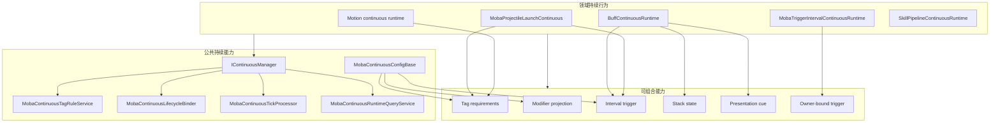
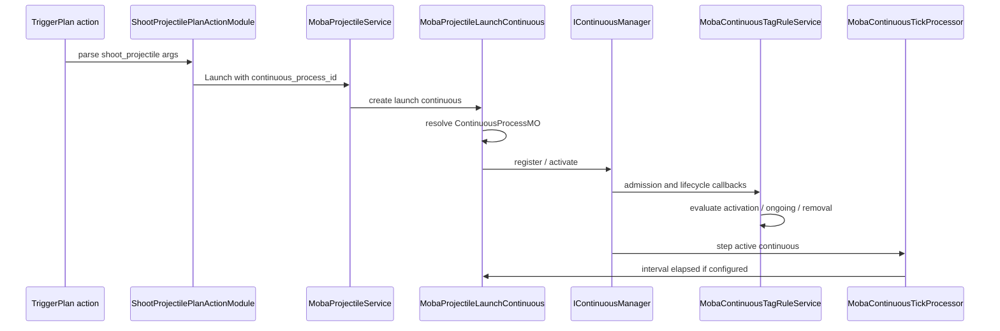
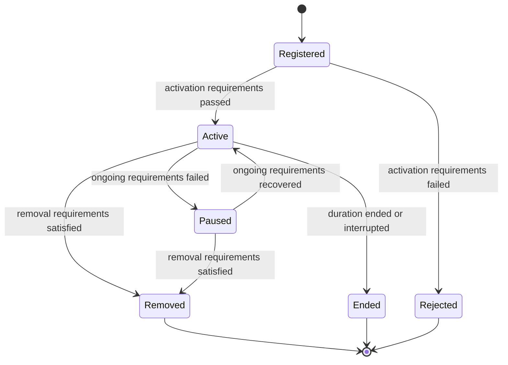

# MOBA 持续行为能力组合设计

> 本文说明 MOBA 示例为什么把 stack、periodic、cue、tag、modifier、trigger 等能力拆成可组合能力，而不是照搬 GAS 把它们强制收进一个单体 GameplayEffect 资产。它补充持续行为在强定制项目中的配置边界、生命周期治理、领域行为接入和长期演进规则。

## 1. 能力定位

MOBA 示例中的持续行为不是单独的 Buff 系统，也不是单独的 Projectile 或 Motion 系统，而是一组被 `IContinuous` 生命周期统一治理的运行时对象。

它要解决的问题是：

| 问题 | 设计回答 |
|------|----------|
| 位移、发射子弹、召唤物、光环、被动 tick 是否都需要生命周期 | 需要，但不要求都变成 Buff |
| stack、periodic、cue、tag、modifier 是否都应放进同一个配置资产 | 不强制；它们是可组合能力 |
| 公共生命周期是否统一 | 统一由 `IContinuousManager`、tag rule、lifecycle binder、tick processor 管理 |
| 领域语义是否保留 | 保留；Buff 仍是 Buff，Projectile launch 仍是 Projectile launch，Motion 仍进入 motion pipeline 仲裁 |
| 项目定制如何落地 | 通过领域 runtime 组合公共能力，而不是扩展一个万能效果类型 |

这套模型可以概括为：公共持续生命周期集中治理，领域行为按需组合能力。

## 2. 解决的问题

### 2.1 避免万能效果资产膨胀

GAS 的 GameplayEffect 很强，因为它把 duration、stack、modifier、periodic、cue、tag requirements 等能力收敛到同一个标准资产。这个模型适合需要强标准化工具链的 Unreal 项目，但在 AbilityKit 的 MOBA 示例里，所有持续行为并不共享同一种业务语义。

例如：

| 持续行为 | 核心语义 | 不适合被强行 Buff 化的原因 |
|----------|----------|----------------------------|
| Buff | 对单位施加状态、叠层、周期效果、表现提示 | 本来就是状态型持续效果 |
| 位移/击退/牵引 | 移动源、优先级、互斥、位置碰撞监听 | 必须进入 motion pipeline 做位移仲裁 |
| 发射子弹 | 发射序列、弹体配置、发射源上下文 | Projectile 物理和命中仍属于 projectile 领域 |
| 召唤物 | 生成实体、绑定生命周期、死亡清理 | 生成物是 actor/entity 生命周期问题 |
| 光环/被动 tick | owner-bound 触发、周期执行、门控 | 更接近 trigger interval 或 owner-bound runtime |

如果把这些全部强制变成一个“大 Buff/大 GameplayEffect”，配置表会失去领域可读性，业务规则也会被迫塞进通用字段。

### 2.2 保持数据和行为分离

当前设计把配置拆成两类：

| 配置类型 | 内容 | 示例 |
|----------|------|------|
| 公共持续过程配置 | duration、interval、tag requirements、modifiers、trigger ids、owner-bound triggers | `ContinuousProcessMO` |
| 领域配置 | projectile 物理、launcher 发射模式、motion 参数、buff 叠层策略、summon actor 配置 | `ProjectileMO`、`ProjectileLauncherMO`、Buff 配置、Motion 配置 |

这样做的结果是：

1. 生命周期策略可以统一复用；
2. 领域参数不会被通用持续表污染；
3. 同一个领域行为可以选择是否接入 tag、modifier、periodic、cue；
4. 后续项目可以扩展领域配置，而不需要修改通用 continuous 核心。

## 3. 源码入口

| 主题 | 源码 |
|------|------|
| Continuous manager | `Unity/Packages/com.abilitykit.core/Runtime/Continuous/DefaultContinuousManager.cs` |
| MOBA continuous config base | `Unity/Packages/com.abilitykit.demo.moba.runtime/Runtime/Application/Services/Continuous/MobaContinuousConfigBase.cs` |
| Tag rule service | `Unity/Packages/com.abilitykit.demo.moba.runtime/Runtime/Application/Services/Continuous/MobaContinuousTagRuleService.cs` |
| Effective tag query | `Unity/Packages/com.abilitykit.demo.moba.runtime/Runtime/Application/Services/Continuous/MobaEffectiveTagQueryService.cs` |
| Tag rule evaluator | `Unity/Packages/com.abilitykit.demo.moba.runtime/Runtime/Application/Services/Continuous/MobaContinuousTagRuleEvaluator.cs` |
| Lifecycle binder | `Unity/Packages/com.abilitykit.demo.moba.runtime/Runtime/Application/Services/Continuous/MobaContinuousLifecycleBinder.cs` |
| Tick processor | `Unity/Packages/com.abilitykit.demo.moba.runtime/Runtime/Application/Services/Continuous/MobaContinuousTickProcessor.cs` |
| Trigger interval handler | `Unity/Packages/com.abilitykit.demo.moba.runtime/Runtime/Application/Services/Continuous/MobaTriggerIntervalContinuousHandler.cs` |
| Runtime query/view | `Unity/Packages/com.abilitykit.demo.moba.runtime/Runtime/Application/Services/Continuous/MobaContinuousRuntimeQueryService.cs` |
| Buff continuous runtime | `Unity/Packages/com.abilitykit.demo.moba.runtime/Runtime/Application/Services/Buffs/Runtime/BuffContinuousRuntime.cs` |
| Buff stack policy | `Unity/Packages/com.abilitykit.demo.moba.runtime/Runtime/Application/Services/Buffs/Core/BuffStackingPolicyApplier.cs` |
| Buff interval handler | `Unity/Packages/com.abilitykit.demo.moba.runtime/Runtime/Application/Services/Buffs/Runtime/BuffContinuousIntervalHandler.cs` |
| Buff cue reporter | `Unity/Packages/com.abilitykit.demo.moba.runtime/Runtime/Application/Services/Buffs/Presentation/MobaBuffPresentationCueReporter.cs` |
| Presentation cue snapshot | `Unity/Packages/com.abilitykit.demo.moba.runtime/Runtime/Application/Services/Snapshot/MobaPresentationCueSnapshotService.cs` |
| Projectile launch continuous | `Unity/Packages/com.abilitykit.demo.moba.runtime/Runtime/Application/Services/Projectile/Launch/MobaProjectileLaunchContinuous.cs` |
| Projectile service | `Unity/Packages/com.abilitykit.demo.moba.runtime/Runtime/Application/Services/Projectile/MobaProjectileService.cs` |
| ShootProjectile action | `Unity/Packages/com.abilitykit.demo.moba.runtime/Runtime/Application/Services/Triggering/PlanActions/Skill/ShootProjectilePlanActionModule.cs` |
| Continuous process config | `Unity/Packages/com.abilitykit.demo.moba.view.runtime/Resources/moba/continuous_processes.json` |

## 4. 总体结构图

这张图的重点是：公共能力不是某一个领域的私有逻辑，领域 runtime 也不是公共能力的简单数据载体。两者通过 small interface 和生命周期 binder 组合。

## 5. 关键运行流程

以一次带 `continuous_process_id` 的 projectile launch 为例，运行流程如下：

这个流程说明 projectile launch 并没有变成 Buff，也没有绕过持续生命周期。它保留 projectile 领域的发射行为，同时接入 continuous 的 tag、duration、interval、modifier、debug 和 query 能力。

## 6. 生命周期与标签状态机

持续行为的生命周期由 `DefaultContinuousManager` 和 MOBA tag rule 服务共同推进。

关键规则：

| 阶段 | 责任 |
|------|------|
| 注册/激活 | 校验 activation requirements，记录 lifecycle reason |
| Active | application tags 进入 effective tag query，modifier projection 生效 |
| Pause | 从 active 集合移除，modifier 清理，application tags 不再贡献 |
| Resume | 重新进入 active，modifier 重新投射，tag rule 重新解释 |
| Remove/End | 清理 modifier、context、owner-bound trigger 和诊断状态 |

当一个持续行为新增、激活、恢复、结束或移除时，同 owner 下的其他持续行为会被重新解释。这样霸体、免控、沉默、禁用位移、脱战等标签规则不是写死在某个 motion 或 buff 代码里，而是通过持续行为携带的 application tags 和 tag requirements 统一触发生命周期变化。

## 7. stack、periodic、cue 的组合方式

当前框架已经具备 GAS 类似能力，但组合方式不同。

| 能力 | 当前落点 | 组合方式 |
|------|----------|----------|
| Duration | `IDurationConfig`、`MobaContinuousConfigBase.DurationSeconds` | 公共 continuous 生命周期能力 |
| Stack | `IStackConfig`、`BuffStackingPolicyApplier`、`BuffContinuousRuntime.Refresh` | Buff 领域强使用，其他 runtime 可按需暴露 stack view |
| Periodic | `IMobaContinuousPeriodicConfig`、`MobaContinuousTickProcessor`、interval handler | 公共 tick 能力，handler 可按领域分派 |
| Tags | `IMobaContinuousTagConfig`、`MobaContinuousTagRuleService` | 公共生命周期门控能力 |
| Modifiers | `IMobaContinuousModifierConfig`、`MobaContinuousLifecycleBinder` | 公共投射能力，按 projector 类型落到 attribute 或 skill param |
| Cue | `MobaPresentationCueSnapshotService`、`MobaBuffPresentationCueReporter`、trigger cue | 表现快照能力，按领域报告不同阶段 |
| Owner-bound trigger | `MobaTriggerExecutionGateway`、`MobaTriggerPlanSubscriptionService` | 可绑定到 Buff、被动、持续过程或 owner 生命周期 |

这意味着 stack、periodic、cue 并不是缺失能力，而是没有被强制打包成一张固定表。项目可以决定某类持续行为需要哪些能力：

| 领域行为 | 推荐组合 |
|----------|----------|
| 普通 Buff | duration + stack + tags + modifiers + periodic + buff cue |
| 光环 | duration 或 infinite + owner-bound trigger + tags + periodic |
| 位移 | motion config + continuous tags + interruption rules + context/debug |
| 发射子弹 | projectile launcher config + continuous process + interval trigger + context/debug |
| 引导技能 | skill pipeline runtime + tags + modifiers + owner-bound trigger + cue |
| 脱战效果 | trigger interval continuous + tag requirements + interval trigger |

## 8. 和 GAS GameplayEffect 的差异

| 维度 | GAS GameplayEffect | MOBA continuous capability composition |
|------|--------------------|----------------------------------------|
| 标准化 | 高，所有能力集中在 GE 资产 | 中高，生命周期统一，领域配置分散 |
| 配置入口 | 单体效果资产为核心 | continuous process + domain config + trigger plan |
| 上手路径 | 学会 GE 后路径统一 | 需要理解领域 runtime 与公共能力边界 |
| 领域清晰度 | 容易把不同语义压成 GE 字段 | Buff、Projectile、Motion、Skill Pipeline 语义保留 |
| 扩展方式 | 扩 GE、Execution、MMC、Cue、ASC 等标准点 | 扩领域 runtime、handler、projector、validator、cue reporter |
| 强定制能力 | 强，但会受 GAS 模型影响 | 更贴近项目战斗模型，但治理成本更高 |
| 工具一致性 | 天然集中 | 需要项目建立模板、校验和 debug view |

因此这不是 GAS 的简化复制，而是 AbilityKit/MOBA 的项目化能力组合模型。

## 9. 设计意图与取舍

### 9.1 为什么不强制组合在一起

不强制组合的原因不是为了减少功能，而是为了避免公共抽象吞掉领域边界。

持续行为的共同点是生命周期，而不是业务含义。Buff 的 stack、Projectile 的发射模式、Motion 的位移仲裁、Skill Pipeline 的阶段控制，都是不同层面的领域问题。公共 continuous 只应该负责：

1. 生命周期注册、激活、暂停、恢复、终止；
2. duration 和 interval 推进；
3. tag requirements 判定；
4. modifier 投射和清理；
5. owner-bound trigger 绑定和释放；
6. query/debug/context source 输出。

领域 runtime 负责解释自己的业务：

| 领域 | 自己负责 |
|------|----------|
| Buff | stack policy、refresh、buff stage effect、buff cue |
| Projectile | launch sequence、spawn position、projectile config、hit source context |
| Motion | movement source、priority、互斥、碰撞监听窗口 |
| Skill Pipeline | cast phase、channel、wait condition、pipeline interruption |
| Summon | actor spawn、owner link、death cleanup、snapshot |

### 9.2 什么时候应该接入 continuous

判断标准不是“这个行为持续超过一帧”，而是它是否需要被统一治理。

| 需要接入 | 可以不接入 |
|----------|------------|
| 需要 tag rule 影响生命周期 | 单帧纯数值结算 |
| 需要 modifier 随生命周期应用/清理 | 一次性 projectile hit damage |
| 需要 interval trigger | 单次触发动作 |
| 需要 runtime query/debug/validation | 只在局部函数内完成的临时计算 |
| 需要被 pause/resume/interruption 管理 | 不存在运行时持有状态 |
| 需要绑定 owner-bound trigger 或 context source | 不参与 trace/replay/debug 的纯工具函数 |

## 10. 治理规则

组合式设计的风险是灵活性过高，因此必须用治理规则兜住。

| 规则 | 原因 |
|------|------|
| 公共生命周期只放在 continuous 层 | 避免 Buff、Projectile、Motion 各自实现 pause/resume/remove |
| 领域配置保留在领域表 | 避免 `ContinuousProcessMO` 变成万能业务配置 |
| tag requirements 不写死在领域代码中 | 霸体、沉默、免控、禁位移等应由配置表达 |
| periodic 必须经过统一 tick processor 或明确 handler | 避免多个系统重复 tick 同一个 runtime |
| cue 只输出表现快照 | 逻辑层不直接驱动 UI 或 VFX |
| modifier 必须通过 lifecycle binder 投射和清理 | 避免暂停/移除后残留属性或技能参数修改 |
| 新 runtime 必须提供 query/debug 信息 | 便于 validation、trace、回放和线上诊断 |
| 新配置字段必须进入 validator | 避免配置错误拖到战斗中才暴露 |

## 11. 新手阅读路线

建议按下面顺序理解这套设计：

1. 先读 `Docs/design/09-ImplementationExamples/MOBA/11-PlanActionsAndContinuousRuntimeDeepDive.md`，理解 PlanAction 如何创建 continuous runtime。
2. 再读 `Unity/Packages/com.abilitykit.core/Runtime/Continuous/DefaultContinuousManager.cs`，理解注册、激活、暂停、恢复、结束的基础语义。
3. 再读 `Unity/Packages/com.abilitykit.demo.moba.runtime/Runtime/Application/Services/Continuous/MobaContinuousTagRuleService.cs`，理解 tag 如何影响生命周期。
4. 再读 `Unity/Packages/com.abilitykit.demo.moba.runtime/Runtime/Application/Services/Continuous/MobaContinuousTickProcessor.cs`，理解 periodic 如何统一推进。
5. 再读 `Unity/Packages/com.abilitykit.demo.moba.runtime/Runtime/Application/Services/Buffs/Runtime/BuffContinuousRuntime.cs` 和 `Unity/Packages/com.abilitykit.demo.moba.runtime/Runtime/Application/Services/Buffs/Core/BuffStackingPolicyApplier.cs`，理解 stack 与 buff 生命周期。
6. 再读 `Unity/Packages/com.abilitykit.demo.moba.runtime/Runtime/Application/Services/Projectile/Launch/MobaProjectileLaunchContinuous.cs`，理解非 Buff 领域如何组合 continuous 能力。
7. 最后读 `Unity/Packages/com.abilitykit.demo.moba.runtime/Runtime/Application/Services/Snapshot/MobaPresentationCueSnapshotService.cs`，理解 cue 如何从逻辑转成表现快照。

## 12. 常见误区

| 误区 | 正确理解 |
|------|----------|
| continuous 就等于 Buff | Buff 只是 continuous 的一种领域 runtime |
| 所有持续行为都应该放进 Buff 表 | 只有状态型效果适合 Buff 表，位移/投射物/召唤物应保留领域配置 |
| 不像 GAS 集中就是能力不完整 | stack、periodic、cue、tag、modifier 都存在，只是按能力组合 |
| tag 打断应该写在 motion 代码里 | motion 行为携带 tag requirements，由 continuous tag rule 统一判定 |
| periodic 只属于 Buff | periodic 是公共 continuous 能力，Buff 只是有自己的 interval handler |
| cue 应该由逻辑系统直接播放特效 | cue 应输出 snapshot，由表现层消费 |
| 灵活组合可以不做校验 | 强定制项目更需要 validator、模板、debug view 和源码锚点 |

## 13. 和其他模块的关系

| 模块 | 关系 |
|------|------|
| Triggering | PlanAction 创建或刷新领域 runtime，interval/owner-bound trigger 回到 trigger gateway 执行 |
| Buff | 使用 continuous 生命周期承载 duration、stack、periodic、cue、tag、modifier |
| Projectile | 发射过程接入 continuous，但弹体飞行、命中和物理仍归 projectile 领域 |
| Motion | 位移过程可接入 continuous tag/lifecycle，但位移合成和优先级仍归 motion pipeline |
| Attribute/Skill Param | modifier 通过 projector 投射到属性或技能参数，生命周期由 binder 管理 |
| Presentation | cue 和 snapshot 把逻辑事件转成表现层可消费数据 |
| Validation | 检查 trigger plan、context integrity、continuous runtime 和配置引用 |
| Snapshot/Replay | runtime view、context source、cue snapshot 提供稳定观测面 |

## 14. 后续演进建议

为了让组合式设计长期可维护，建议继续补齐以下工程能力：

| 方向 | 建议 |
|------|------|
| 配置模板 | 为 Buff、ProjectileLaunch、Motion、TriggerInterval 分别提供 continuous process 模板 |
| Validator | 校验 continuous process 引用、interval trigger、tag template、modifier projector 是否存在 |
| Debug view | 在 continuous runtime view 中清晰展示 stack、interval、tag rule、modifier source、context source |
| 文档约束 | 新增领域 runtime 时必须说明是否接入 tags、modifiers、periodic、cue、owner-bound trigger |
| 工具链 | 配置导出时标记领域配置与 common continuous config 的引用关系 |
| 测试 | 增加 tag rule pause/resume/remove、periodic trigger、modifier cleanup、cue snapshot 的验收用例 |

最终目标不是把 AbilityKit 变成 GAS 的形状，而是保留 AbilityKit 的组合式能力边界：框架提供统一生命周期和通用玩法能力，MOBA 项目按自己的战斗模型决定如何组合。
