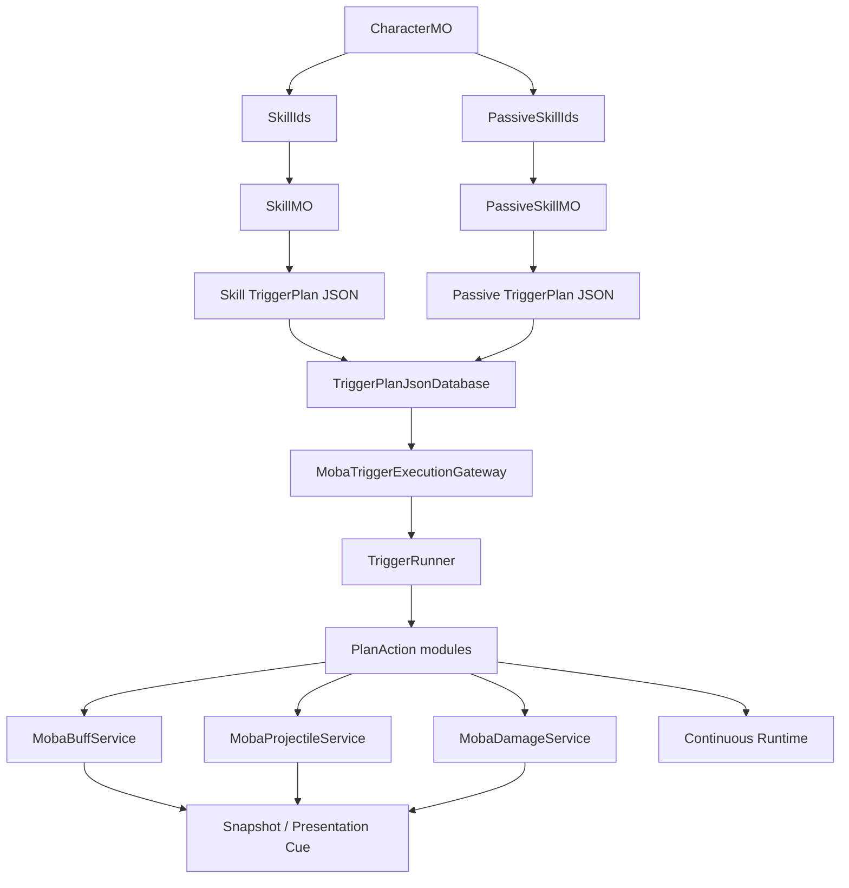
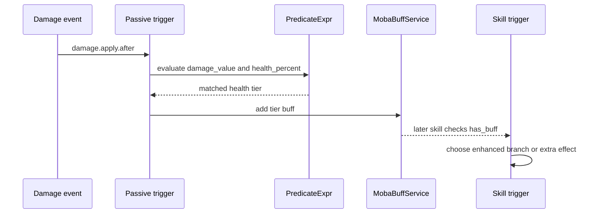
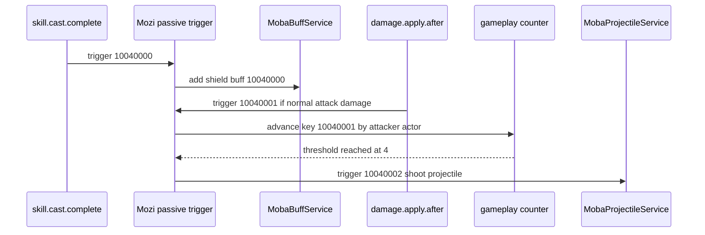
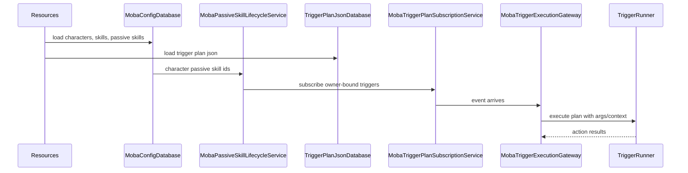

# MOBA 四英雄技能正式实现设计

> 本文说明 MOBA Demo 中廉颇、小乔、赵云、墨子四个英雄技能与被动如何按 AbilityKit 正式框架落地。重点不是复述技能表，而是说明技能需求如何映射到 Skill、TriggerPlan、Buff、Projectile、Damage、Continuous、PlanAction 与验证体系，并明确哪些行为应由通用能力承载，哪些行为应留在领域配置中表达。

## 1. 能力定位

四英雄技能实现承担两类职责：

| 职责 | 设计回答 |
|------|----------|
| 展示 AbilityKit 如何表达 MOBA 英雄技能 | 用配置驱动 Skill、TriggerPlan、Buff、Projectile、Damage 和 Continuous，而不是在英雄类中硬编码 |
| 验证正式框架是否能覆盖复杂被动 | 赵云使用血量分档触发与 Buff modifier，墨子使用通用 gameplay counter 和触发计划串联 |
| 保持资源可复制、可验证 | Assets 与 package runtime 两份 Resources 必须一致，测试直接覆盖关键触发资源 |
| 避免英雄专用运行时代码膨胀 | 仅补充通用 predicate/action 能力，英雄差异留在 JSON 配置与通用模块参数中 |

这套设计的目标是：英雄配置可以变化，框架能力保持稳定。廉颇、小乔、赵云、墨子不是四套专用代码，而是四组技能资源对同一套运行时能力的组合证明。

## 2. 角色与技能资源映射

四个英雄从 `moba/characters.json` 进入配置数据库，每个角色绑定普通技能与被动技能：

| 英雄 | 角色 ID | 普通技能 | 被动技能 | 主要验证点 |
|------|---------|----------|----------|------------|
| 廉颇 | 1001 | 10010101、10010201、10010301 | 10010000 | 霸体/控制/伤害/持续行为组合 |
| 小乔 | 1002 | 10020101、10020201、10020301 | 10020000 | 技能命中、被动 Buff、Projectile/Damage 链路 |
| 赵云 | 1003 | 10030101、10030201、10030301 | 10030000 | 血量分档被动、技能增强 Buff、护盾 |
| 墨子 | 1004 | 10040101、10040201、10040301 | 10040000 | 技能后护盾、普攻计数、第四击炮弹 |

源码入口：

| 主题 | 资源或源码 |
|------|------------|
| 角色绑定 | `Unity/Assets/Resources/moba/characters.json`、`Unity/Packages/com.abilitykit.demo.moba.view.runtime/Resources/moba/characters.json` |
| 被动技能表 | `Unity/Assets/Resources/moba/passive_skills.json` |
| 技能触发资源 | `Unity/Assets/Resources/ability/triggers/skills` |
| 被动触发资源 | `Unity/Assets/Resources/ability/triggers/passives` |
| Trigger plan 加载 | `Unity/Packages/com.abilitykit.triggering/Runtime/Plans/Serialization/Json/Database/TriggerPlanJsonDatabase.cs` |
| MOBA 触发执行入口 | `Unity/Packages/com.abilitykit.demo.moba.runtime/Runtime/Application/Services/Triggering/MobaTriggerExecutionGateway.cs` |
| 被动生命周期绑定 | `Unity/Packages/com.abilitykit.demo.moba.runtime/Runtime/Application/Services/Skill/Passive/MobaPassiveSkillLifecycleService.cs` |
| PlanAction 模块 | `Unity/Packages/com.abilitykit.demo.moba.runtime/Runtime/Application/Services/Triggering/PlanActions` |
| MOBA predicate 函数 | `Unity/Packages/com.abilitykit.demo.moba.runtime/Runtime/Domain/Predicates/MobaPlanPredicateFunctions.cs` |
| 配置/资源测试 | `Unity/Packages/com.abilitykit.demo.moba.view.runtime/Runtime/Game/Test/UnitTest/BattleTestScriptRunnerEditModeTests.cs` |

## 3. 总体结构

这张图的关键点是：角色只绑定技能与被动 ID；技能行为不从角色类分支出去，而是进入统一的 TriggerPlan 数据库和 PlanAction 执行链。英雄差异由触发事件、条件、动作参数、Buff/Projectile/Continuous 配置表达。

## 4. 设计边界

| 问题 | 采用方案 | 原因 |
|------|----------|------|
| 英雄被动是否写专用 class | 不写英雄专用 class | 英雄差异应先由 TriggerPlan 与通用 action/predicate 表达 |
| 墨子第四次普攻计数放哪里 | 使用通用 gameplay counter action | 计数是触发器领域状态，不应伪装为 Buff 层数 |
| 赵云血量分档如何表达 | 使用 `health_percent` 条件转换为 PredicateExpr | 血量是战斗状态查询，不需要新增被动专用系统 |
| 技能增强如何影响后续技能 | 使用 Buff/Modifier 与 `predicate:has_buff` | 保持技能条件和数值增强可配置、可验证 |
| 两份 Resources 如何治理 | 双资源根保持一致并进入测试 | Unity Assets 和 package runtime 都可能作为加载根 |

### 4.1 不把墨子计数放入 Buff 层数

墨子被动的“连续普攻第四发”是 owner 维度的玩法计数，触发条件来自伤害事件和攻击者字段。它不是一个持续状态，也不天然需要 duration、stack refresh、tag admission 或 cue 生命周期。

因此它落在通用 action `advance_gameplay_counter`：

1. 从事件 payload 中读取攻击者 actor id 作为 scope；
2. 按 counter key 累加；
3. 达到阈值 4 后重置；
4. 触发后续 trigger `10040002` 发射机关炮弹。

这样可以复用到“第三次命中触发”“累计受击触发”“连续施法触发”等需求，而不把 Buff 系统变成计数器容器。

### 4.2 赵云血量分档使用 Buff 作为效果载体

赵云被动“龙鸣”根据血量分档切换强化状态：

| 分档 | 条件 | 触发 ID | 效果载体 |
|------|------|---------|----------|
| 一档 惊雷 | HP > 66% | 10030000 | Buff 10030000 |
| 二档 破云 | 33% < HP <= 66% | 10030001 | Buff 10030001 |
| 三档 天翔 | HP <= 33% | 10030002 | Buff 10030002 + shield |
| 初始化 | 出生/脱战或外部初始化 | 10030003 | Buff 10030000 |

分档判断属于 predicate，强化效果属于 Buff/Modifier，护盾属于 combat action。这个拆分避免把“血量查询”“效果持续”“护盾发放”混在一个英雄被动类中。

## 5. 四英雄实现拆解

### 5.1 廉颇

廉颇用于验证高韧性战士类技能组合。设计重点是把霸体、控制、位移、伤害和持续能力放在已有管线中表达：

| 能力 | 框架落点 |
|------|----------|
| 被动勇士之魂 | `PassiveSkillMO` 绑定 trigger 与 continuous process |
| 霸体/免控 | Buff tag 与 continuous lifecycle rule |
| 技能伤害 | TriggerPlan action 进入 Damage 管线 |
| 位移/控制 | Motion/Control PlanAction 与 Buff/Tag 协作 |
| 表现反馈 | Snapshot 与 Presentation Cue 输出 |

廉颇不需要英雄专用 runtime。只要 Buff、Motion、Damage 和 Continuous 的组合边界清晰，技能资源就能表达坦克型英雄的核心玩法。

### 5.2 小乔

小乔用于验证法师类 projectile 和命中后收益。设计重点是技能释放、投射物命中、伤害与被动增益之间的链路：

| 能力 | 框架落点 |
|------|----------|
| 被动治愈微笑 | owner-bound passive trigger |
| 技能发射 | `shoot_projectile` action |
| 命中伤害 | Projectile hit event 转 Damage |
| 命中后增益 | Buff action 或 trigger 后续动作 |
| 测试关注 | Projectile/Damage/Passive trigger 是否能串起来 |

小乔的技能需求证明 projectile 不只是视觉对象，而是逻辑世界中的命中来源。Projectile 命中后进入 Damage 和 Triggering，后续 Buff 或被动收益仍由同一套事件链处理。

### 5.3 赵云

赵云用于验证复杂被动和技能强化。被动 `10030000` 绑定多个 trigger，其中 `10030000` 到 `10030003` 管理血量分档，后续 `10030102`、`10030103`、`10030202`、`10030203`、`10030312` 用于技能增强相关触发。

运行链路：

关键设计点：

| 需求 | 实现方式 |
|------|----------|
| 受伤后按血量进入分档 | `damage.apply.after` + `health_percent` 条件 |
| 低血量获得护盾 | `add_shield` action |
| 技能因分档增强 | Buff 作为状态载体，触发条件通过 `predicate:has_buff` 查询 |
| 出生默认分档 | allowExternal trigger 初始化一档 Buff |
| 资源绑定 | `CharacterMO.PassiveSkillIds` 必须包含 `10030000` |

这里新增的通用 `predicate:has_buff` 只负责查询目标 actor 是否拥有某个 Buff。它不是赵云专用逻辑，因此放在 MOBA predicate function 注册中，而不是放进赵云技能类。

### 5.4 墨子

墨子用于验证两类被动：释放技能获得护盾，以及连续普攻第四发炮击。

运行链路：

关键设计点：

| 需求 | 实现方式 |
|------|----------|
| 释放技能获得护盾 | `skill.cast.complete` + `add_buff` |
| 普攻命中计数 | `damage.apply.after` + `advance_gameplay_counter` |
| 按攻击者隔离计数 | `scope_payload_field_id = payload:attacker_actor_id` 的稳定 ID |
| 第四击炮弹 | 达阈值后触发 `10040002`，执行 `shoot_projectile` |
| 不使用 Buff stack | 计数没有持续效果语义，放入 counter 更直接 |

墨子被动的设计重点是把“计数”和“状态”分开。护盾是 Buff；第四击计数是 trigger state；炮弹是 Projectile。三者通过 TriggerPlan 串联，而不是压入一个被动类。

## 6. TriggerPlan 与 Predicate 扩展

赵云技能增强需要在触发条件中判断 actor 是否拥有某个 Buff。为了保持 plan 化，框架扩展了表达式函数节点：

| 能力 | 落点 |
|------|------|
| 表达式函数节点 | `PredicateExprPlan.BoolExprNode.Function` |
| JSON DTO 字段 | `FunctionId`、`FunctionArity` |
| Source condition 转换 | `has_buff` 转为 expression function |
| 运行时求值 | `PlannedTriggerPredicateEvaluator` 调用 `FunctionRegistry` |
| MOBA 函数注册 | `MobaPlanPredicateFunctions.Register` |
| 引用校验 | `ReferenceValidator` 校验 function id 是否注册 |

这条链路的原则是：source JSON 可以写领域语义条件，加载时转换为通用 TriggerPlan，运行时只依赖函数注册表执行。

## 7. 配置加载与执行流程

角色技能的正式落地必须同时满足三件事：

1. `CharacterMO` 绑定技能或被动 ID；
2. `SkillMO` 或 `PassiveSkillMO` 能找到 trigger IDs；
3. trigger JSON 能被 `TriggerPlanJsonDatabase` 编译并由 runtime action/predicate 执行。

任一环节断开，配置表看起来存在，实战中也不会生效。

## 8. 验证路径

当前验证分三层：

| 层级 | 验证内容 | 入口 |
|------|----------|------|
| 构建验证 | Runtime 和 UnitTests 工程可编译 | `Unity/AbilityKit.Demo.Moba.Runtime.csproj`、`Unity/AbilityKit.Game.UnitTests.csproj` |
| 资源一致性 | Assets 与 package runtime 关键 JSON 一致 | `ZhaoYunAndMoziTriggerResources_AreSyncedBetweenAssetsAndPackageRuntime` |
| 行为装配 | 被动绑定、trigger plan 加载、action 存在 | `BattleTestScriptRunnerEditModeTests` |

重点测试包括：

| 测试 | 覆盖点 |
|------|--------|
| `ZhaoYunPassive_IsBoundToCharacterAndCompilesTriggerPlans` | 赵云角色绑定被动，所有被动 trigger 可加载并包含动作 |
| `MoziPassive_UsesGenericCounterTriggerPlanAndFourthHitProjectile` | 墨子第四击使用通用 counter，达阈值后发射 projectile |
| `ZhaoYunAndMoziTriggerResources_AreSyncedBetweenAssetsAndPackageRuntime` | 角色绑定与关键触发资源双根一致 |

Unity EditMode 批处理验证需要确保没有另一个 Unity 实例打开同一项目，否则 Unity batchmode 会因为项目锁直接退出。

## 9. 约束与风险

| 风险 | 说明 | 治理方式 |
|------|------|----------|
| 资源双根漂移 | Assets 与 package runtime 任一份漏改都会造成加载差异 | 对关键 JSON 做一致性测试 |
| 生成 csproj 覆盖 | Unity 生成的 `.csproj` 可能覆盖手工 Include | 以 Unity asmdef 为准，命令行构建需关注项目生成流程 |
| predicate 函数未注册 | JSON 可加载但运行时无法求值 | `ReferenceValidator` 使用注册函数集合校验 |
| 过早新增英雄专用类 | 会把配置差异固化为代码分支 | 优先扩展通用 action/predicate/schema |
| 计数语义误用 Buff stack | 会污染 Buff 生命周期和表现语义 | 计数放 gameplay counter，状态放 Buff |

## 10. 后续扩展规则

新增英雄技能时按以下顺序判断落点：

1. 能否只用现有 action、predicate、Buff、Projectile、Damage、Continuous 配置表达；
2. 如果不能，缺的是通用领域能力还是某个英雄特例；
3. 通用能力应补 action module、predicate function、schema 或 validator；
4. 英雄差异继续保留在 trigger JSON、Buff、Projectile、Continuous 和技能表中；
5. 每个新能力都要补资源双根一致性、plan 加载和最小行为装配测试。

这套规则保证 MOBA Demo 可以继续扩展更多英雄，同时不让示例运行时退化成英雄脚本集合。
