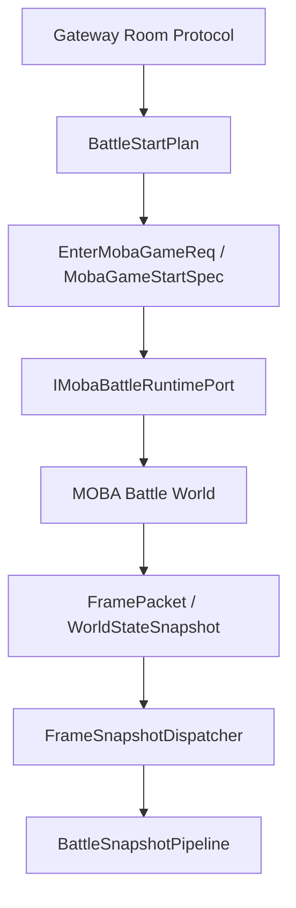
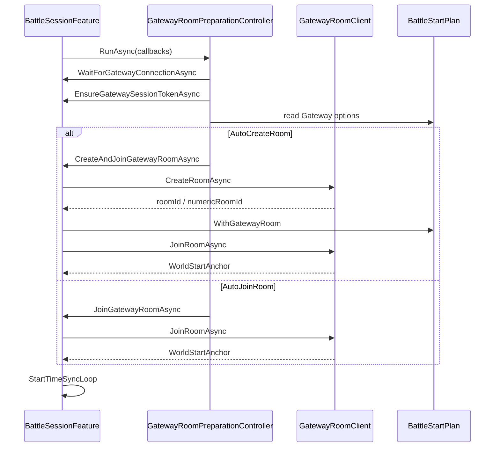
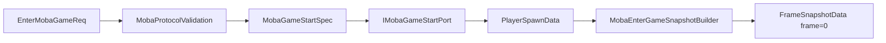
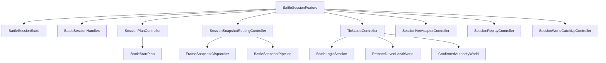
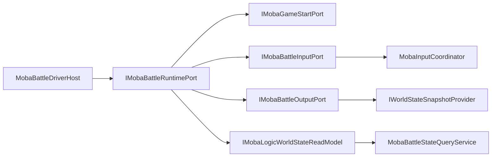
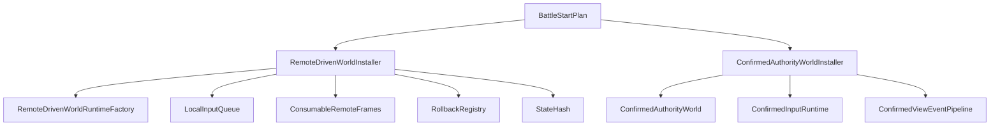
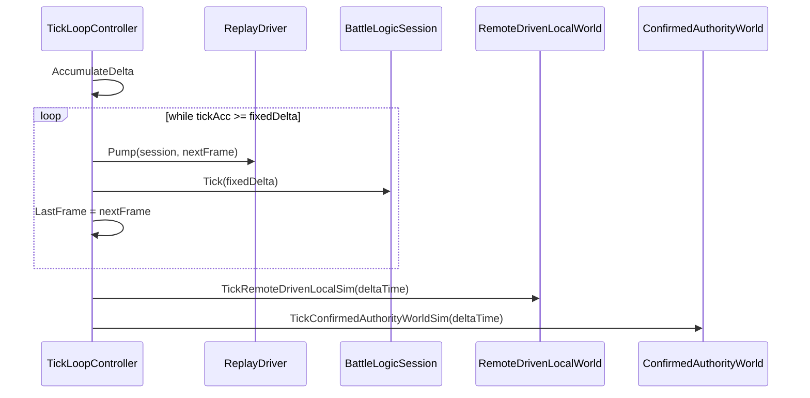
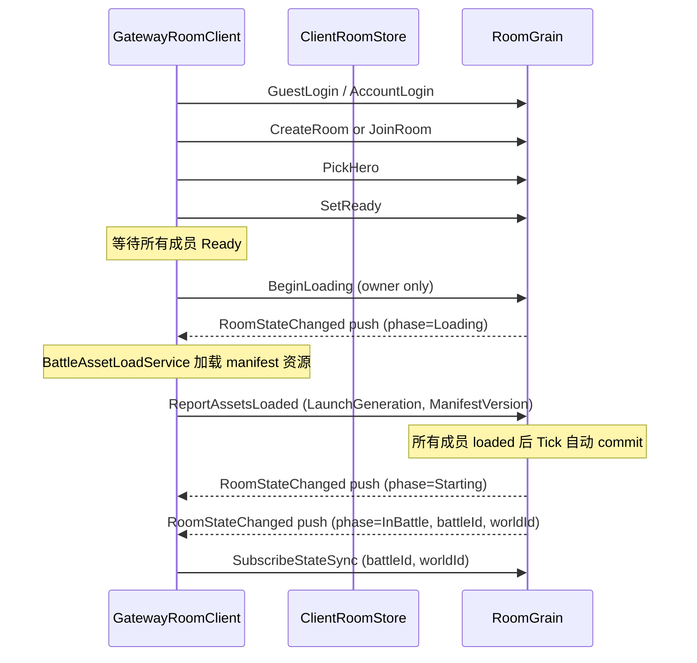

# MOBA 联机会话与协议契约

> 本文补齐 MOBA 示例在表现会话、网关房间、进场协议、运行时端口和辅助世界安装之间的契约。它不重复技能、Buff、Projectile、Damage 或 Snapshot Pipeline 的内部细节，而是说明一场联机 battle 如何从房间协议进入本地/远程逻辑世界，并通过稳定端口向战斗运行时提交输入、启动游戏和读取快照。

## 1. 能力定位

MOBA 示例的联机会话层承担“把外部房间与内部 battle world 接起来”的职责。它不是战斗规则层，也不是纯表现层，而是一个协议和运行时边界层。

| 职责 | 设计回答 |
|------|----------|
| 房间准备 | 通过 Gateway room 协议完成 guest login、create/join room、ready/pick/start battle 等动作 |
| 进场契约 | 使用 `EnterMobaGameReq`、`MobaPlayerLoadout`、`MobaGameStartSpec` 描述地图、玩家、tick rate、输入延迟和初始 payload |
| 会话编排 | `BattleSessionFeature` 只保留门面与状态，计划、网关、快照、Tick、辅助世界由控制器拆分 |
| 运行时边界 | 表现/宿主侧只通过 `IMobaBattleRuntimePort` 或 `ILogicWorldDriverHost` 访问 battle world |
| 辅助世界 | 远程驱动本地世界与确认权威世界分别安装，避免把预测、确认视图和主会话耦合在一起 |

这个专题的边界是：解释联机 session 如何建立和驱动 battle world；不解释具体英雄技能如何执行，具体技能行为仍由 [14-四英雄技能正式实现设计](14-HeroSkillFormalDesign.md) 覆盖；不展开快照 decoder/stage 的细节，快照表现仍由 [04-快照、表现层与预测回滚](04-SnapshotPresentationPrediction.md) 覆盖。

## 2. 契约分层

MOBA 联机链路分成三层协议，不应混成一个“大 start game”对象：

| 层级 | 代表类型 | 关注点 |
|------|----------|--------|
| Gateway room | `WireGuestLoginReq`、`WireCreateRoomReq`、`WireJoinRoomReq`、`WireReadyRoomReq`、`WirePickHeroReq`、`WireBeginLoadingReq`、`WireReportAssetsLoadedReq`、`WireCancelLoadingReq`、`WireGetSnapshotReq` | 用户会话、房间、匹配区域、英雄选择、加载屏障、资源上报、取消加载、快照拉取 |
| Enter game | `EnterMobaGameReq`、`MobaPlayerLoadout`、`MobaGameStartSpec` | battle world 初始玩家、地图、随机种子、tick rate、输入延迟、初始 payload |
| Frame/snapshot | `FramePacket`、`WorldStateSnapshot`、`WireRoomBattleSnapshot`、`WireRoomStateChangedPush` | 战斗帧输入、权威快照、表现层投影、房间状态变更推送 |

这样的拆分让房间生命周期可以先于 battle world 存在，也让 battle world 的启动参数保持纯逻辑语义。Gateway room 负责"谁在房间里、是否准备好、选择什么英雄、是否进入加载屏障、是否上报资源加载完成"；Enter game 负责"逻辑世界如何初始化"；Frame/snapshot 负责"开战后每帧如何推进和投影，以及房间状态如何推送给客户端"。

> **正式多人模式启动流程**：旧的直接 `StartBattle`（opCode 106）已废弃。客户端必须使用分阶段流程 `BeginLoading` → `ReportAssetsLoaded` → 等待服务端自动 commit → 订阅 `RoomStateChanged` 推送。详见 [第 11 节 正式多人模式启动协议](#11-正式多人模式启动协议)。

## 3. Gateway 房间准备流程

`BattleSessionFeature` 的网关准备逻辑被收敛到 `GatewayRoomPreparationController.RunAsync`。控制器本身只表达状态机顺序，具体连接、token 和房间操作由 host 回调提供。

这个流程有三个设计点：

1. `GatewayRoomPreparationController` 不依赖 Unity、网络实现或具体 room client，只定义“连接 -> token -> create/join”的顺序。
2. `BattleSessionFeature.GatewayPreparation` 在 create 成功后用 `WithGatewayRoom` 回写 `BattleStartPlan`，后续世界安装读取的是更新后的 world id 与 numeric room id。
3. `WireWorldStartAnchor` 记录 `StartServerTicks`、`ServerTickFrequency`、`StartFrame` 和 `FixedDeltaSeconds`，用于把房间服务端时间锚点映射到 battle tick。

## 4. 进场协议与初始化快照

`EnterMobaGameReq` 把逻辑世界初始化所需的字段集中在一个请求中：

| 字段组 | 代表字段 | 设计含义 |
|--------|----------|----------|
| 玩家身份 | `PlayerId`、`Players` | 当前请求玩家与全量参战玩家 loadout |
| 战斗配置 | `MatchId`、`MapId`、`GameplayId` | 匹配、地图和玩法规则入口 |
| 确定性参数 | `RandomSeed`、`TickRate`、`InputDelayFrames` | 确定性随机、固定帧率、输入延迟 |
| 初始载荷 | `OpCode`、`Payload` | 允许携带首帧或自定义初始化数据 |

`MobaProtocolValidation.ValidateGameStartSpec` 对 tick rate 和 input delay 做边界约束，避免运行时才发现协议值不可用。`MobaEnterGameSnapshotBuilder` 则根据 `PlayerSpawnData`、`MobaConfigDatabase` 和 `MobaSessionDefaults` 生成 frame 0 full snapshot，让表现层能在正式帧推进前拿到玩家实体的初始位置、血量和队伍。

## 5. BattleSessionFeature 的控制器拆分

`BattleSessionFeature` 是一个 partial 门面，核心字段只保存依赖、状态、句柄和控制器。源码里可以看到计划、事件、网络、回放、Tick、快照路由、世界 catch-up 都由独立 controller 接管。

| 控制器 | 主要职责 |
|--------|----------|
| `SessionPlanController` | 构建 `BattleStartPlan`，触发 session start hook，绑定 session context |
| `SessionSnapshotRoutingController` | 创建 `FrameSnapshotDispatcher`、`BattleSnapshotPipeline` 和 registry catalog |
| `TickLoopController` | 固定步长推进主 session，并驱动远程本地模拟与确认权威模拟 |
| `SessionNetAdapterController` | 连接 session 与 net adapter context |
| `SessionReplayController` | 回放驱动与帧泵入 |
| `SessionWorldCatchUpController` | 处理世界追帧与辅助世界状态对齐 |

这种拆分的收益是，新增网关准备、确认权威视图、回放或预测策略时，可以先扩展 controller/handles/context，而不是让主 feature 变成一个巨型生命周期类。

## 6. 运行时端口边界

MOBA 逻辑世界对外暴露的运行时边界是 `MobaBattleRuntimePort`，它聚合四类能力：

| 能力 | 内部依赖 | 对外方法 |
|------|----------|----------|
| 开局 | `IMobaGameStartPort` | `TryStartGame` |
| 输入 | `IMobaBattleInputPort` | `Submit` |
| 快照输出 | `IMobaBattleOutputPort` | `TryGetSnapshot`、`CollectSnapshots` |
| 状态读取 | `IMobaLogicWorldStateReadModel` | `GetLogicWorldEntityStates` |

`MobaBattleDriverHost` 是 coordinator 与 MOBA runtime 的桥。它的设计原则是只通过 `IMobaBattleRuntimePort` 访问 moba.runtime，禁止外部模块直接读取 `MobaEntityManager` 或内部 Entitas entity。这样做让本地单机、远程驱动、服务端权威、测试 headless world 都可以共享同一个逻辑世界端口。

`MobaBattleIOPort` 进一步把输入和输出拆开：输入侧调用 `IMobaInputCoordinator.TrySubmit`，并把 `LogicWorldInputSubmitResult` 映射成稳定的 `MobaInputSubmitFailureCode`；输出侧通过 `IWorldStateSnapshotProvider` 提供 snapshot。调用方拿到的是业务化失败原因，而不是 coordinator 内部状态。

## 7. 辅助世界安装

MOBA view runtime 中有两类辅助世界，不能和主 session world 混为一谈：

| 世界 | 安装入口 | 用途 |
|------|----------|------|
| 远程驱动本地世界 | `RemoteDrivenWorldInstaller.EnsureStarted` | 接收权威/远程帧，合并本地输入队列，支持客户端预测和 rollback |
| 确认权威世界 | `ConfirmedAuthorityWorldInstaller.EnsureStarted` | 创建确认口径的 authority world，驱动 confirmed view pipeline |

`RemoteDrivenWorldInstaller` 会解析 `BattleStartPlan` 中的 input delay，创建 `RemoteDrivenWorldRuntimeFactoryOptions`，注入远程帧源、本地输入源、rollback registry、ideal frame limit 和 state hash 计算器。安装完成后，它绑定 `RemoteDrivenPredictionContext` 并运行 `SessionWorldBootstrapValidator.ValidateServices`，确保 world service 依赖完整。

`ConfirmedAuthorityWorldInstaller` 则更偏向确认视图：创建 confirmed authority runtime、建立输入 runtime、安装 view event pipeline，并通过 `ConfirmedViewSideInstaller` 把确认视图侧能力挂到 `BattleContext`。

## 8. Tick 与快照路由

`TickLoopController.MainTick` 以固定步长推进主 `BattleLogicSession`。每个 fixed tick 前，回放 driver 可以先 pump 指定帧；主 session tick 后更新 `LastFrame` 和 accumulator；最后再驱动远程本地模拟与确认权威模拟。

快照路由由 `SessionSnapshotRoutingController` 在 session attach 时创建。它用 `SnapshotRegistryCatalog` 注册 battle/shared registry，根据 plan 中启用的 registry set 构建 `SnapshotRoutingBuilder`，并把 dispatcher、pipeline、command handler 和 net adapter context 绑定到 `BattleContext`。

这意味着快照消费链路的入口是 session controller，而不是任意 presenter 自行订阅网络包。表现模块只应通过 dispatcher/pipeline 注册 stage 或 route，避免绕开统一 opCode 和 payload 类型检查。

## 9. 设计边界与扩展规则

| 扩展点 | 推荐接入位置 | 不建议做法 |
|--------|--------------|------------|
| 新房间动作 | Gateway room 协议与 gateway client method | 把房间状态塞进 `EnterMobaGameReq` |
| 新开局参数 | `EnterMobaGameReq` / `MobaGameStartSpec` 并补 validation | 由表现层临时写入 world service |
| 新输入类型 | `MobaInputCommandContractRegistry` 与 handler | 让 `MobaBattleDriverHost` 判断具体技能或行为 |
| 新快照类型 | Snapshot registry + `BattleSnapshotPipeline` stage | presenter 直接解析 raw payload |
| 新预测策略 | `RemoteDrivenRuntimeModuleFactory` / installer options | 修改 battle world 内部系统顺序来适配客户端 |
| 新确认视图 | `ConfirmedAuthorityWorldInstaller` 与 view-side installer | 和远程驱动本地世界共用同一套 mutable handle |

核心原则是：房间协议、进场协议、运行时端口、辅助世界和表现快照各自有边界。新增能力时应先判断它属于哪一层，再接入对应的 contract 或 controller。

## 10. 源码索引

| 模块 | 源码 |
|------|------|
| 会话门面 | `Unity/Packages/com.abilitykit.demo.moba.view.runtime/Runtime/Game/Battle/Client/Session/Features/Core/BattleSessionFeature.cs` |
| 会话运行时接口聚合 | `Unity/Packages/com.abilitykit.demo.moba.view.runtime/Runtime/Game/Battle/Client/Session/Features/Core/BattleSessionFeature.Runtime.cs` |
| 生命周期 Tick | `Unity/Packages/com.abilitykit.demo.moba.view.runtime/Runtime/Game/Battle/Client/Session/Features/Core/BattleSessionFeature.Lifecycle.cs` |
| 计划控制器 | `Unity/Packages/com.abilitykit.demo.moba.view.runtime/Runtime/Game/Battle/Client/Session/Features/Controllers/SessionPlanController.cs` |
| 快照路由控制器 | `Unity/Packages/com.abilitykit.demo.moba.view.runtime/Runtime/Game/Battle/Client/Session/Features/Controllers/SessionSnapshotRoutingController.cs` |
| Tick 控制器 | `Unity/Packages/com.abilitykit.demo.moba.view.runtime/Runtime/Game/Battle/Client/Session/Features/Controllers/TickLoopController.cs` |
| Gateway 准备 | `Unity/Packages/com.abilitykit.demo.moba.view.runtime/Runtime/Game/Battle/Client/Session/Features/Gateway/BattleSessionFeature.GatewayPreparation.cs` |
| Gateway 准备控制器 | `Unity/Packages/com.abilitykit.demo.moba.view.runtime/Runtime/Game/Battle/Client/Session/Features/Gateway/GatewayRoomPreparationController.cs` |
| Gateway 房间协议 | `Unity/Packages/com.abilitykit.protocol.moba/Runtime/Room/WireRoomGatewayTypes.cs` |
| 进场协议 | `Unity/Packages/com.abilitykit.protocol.moba/Runtime/EnterGame/EnterMobaGameStructs.cs` |
| 逻辑世界驱动桥 | `Unity/Packages/com.abilitykit.demo.moba.runtime/Runtime/Application/Session/MobaBattleDriverHost.cs` |
| 运行时端口 | `Unity/Packages/com.abilitykit.demo.moba.runtime/Runtime/Application/Services/IO/IMobaBattleRuntimePort.cs` |
| 输入/输出端口 | `Unity/Packages/com.abilitykit.demo.moba.runtime/Runtime/Application/Services/IO/MobaBattleIOPort.cs` |
| 初始化快照 | `Unity/Packages/com.abilitykit.demo.moba.runtime/Runtime/Application/Session/MobaEnterGameSnapshotBuilder.cs` |
| 远程驱动世界安装 | `Unity/Packages/com.abilitykit.demo.moba.view.runtime/Runtime/Game/Battle/Client/Session/Features/Sim/RemoteDrivenWorldInstaller.cs` |
| 远程驱动世界创建 | `Unity/Packages/com.abilitykit.demo.moba.view.runtime/Runtime/Game/Battle/Client/Session/Features/Sim/RemoteDrivenWorldRuntimeFactory.cs` |
| 确认权威世界安装 | `Unity/Packages/com.abilitykit.demo.moba.view.runtime/Runtime/Game/Battle/Client/Session/Features/Sim/ConfirmedAuthorityWorldInstaller.cs` |
| Gateway 房间客户端 | `Unity/Packages/com.abilitykit.demo.moba.view.runtime/Runtime/Game/Battle/Client/Gateway/GatewayRoomClient.cs` |
| 客户端 Room 仓库 | `Unity/Packages/com.abilitykit.demo.moba.view.runtime/Runtime/Game/Battle/Client/Gateway/Room/ClientRoomStore.cs` |
| 战斗资源清单 | `Unity/Packages/com.abilitykit.demo.moba.view.runtime/Runtime/Game/Battle/Shared/Assets/BattleAssetManifest.cs` |
| 战斗资源加载服务 | `Unity/Packages/com.abilitykit.demo.moba.view.runtime/Runtime/Game/Battle/Shared/Assets/BattleAssetLoadService.cs` |
| 多人房间流程控制器 | `Unity/Packages/com.abilitykit.demo.moba.view.runtime/Runtime/Game/App/Flow/Core/Multiplayer/MultiplayerRoomFlowController.cs` |
| 正式大厅 Feature | `Unity/Packages/com.abilitykit.demo.moba.view.runtime/Runtime/Game/App/Flow/Boot/FormalLobbyFeature.cs` |

## 11. 正式多人模式启动协议

正式多人模式采用分阶段启动协议，取代旧的直接 `StartBattle`。客户端不再一次性请求开战，而是通过加载屏障确保所有成员就绪后由服务端自动 commit。

### 11.1 Gateway opcode 表

`RoomGatewayOpCodes` 集中定义所有房间相关 opcode（append-only，不回收已分配值）：

| opcode | 常量 | 方向 | 说明 |
|--------|------|------|------|
| 100 | `GuestLogin` | 请求 | 游客登录 |
| 101 | `CreateRoom` | 请求 | 创建房间 |
| 102 | `JoinRoom` | 请求 | 加入房间 |
| 103 | `SubscribeStateSync` | 请求 | 订阅状态同步 |
| 104 | `SetReady` | 请求 | 设置准备状态 |
| 105 | `PickHero` | 请求 | 选择英雄 |
| 106 | `StartBattle` | 请求 | **已废弃**，返回 Conflict |
| 107 | `SubmitBattleInput` | 请求 | 提交战斗输入 |
| 108 | `RequestFullStateSync` | 请求 | 请求全量快照 |
| 109 | `RestoreRoom` | 请求 | 恢复房间 |
| 110 | `ListRooms` | 请求 | 列出房间 |
| 111 | `AccountLogin` | 请求 | 账号登录 |
| 112 | `BeginLoading` | 请求 | owner 发起加载屏障 |
| 113 | `ReportAssetsLoaded` | 请求 | 成员上报资源加载完成 |
| 114 | `CancelLoading` | 请求 | owner 取消加载 |
| 115 | `GetSnapshot` | 请求 | 拉取房间全量快照 |
| 9002 | `SnapshotPushed` | 推送 | 全量战斗快照推送 |
| 9003 | `DeltaSnapshotPushed` | 推送 | 增量战斗快照推送 |
| 9004 | `RoomStateChanged` | 推送 | 房间状态变更推送（phase、revision、battle identity） |

opcode 稳定性由 `RoomProtocolCompatibilityTests.RoomGatewayOpCodesRemainStable` 守护。

### 11.2 客户端分阶段流程

`GatewayRoomClient` 提供分阶段 API：`BeginLoadingAsync`、`ReportAssetsLoadedAsync`、`CancelLoadingAsync`、`GetSnapshotAsync`，每个方法封装对应的 wire DTO 和 opcode。`MultiplayerRoomFlowController` 编排上述阶段，`FormalLobbyFeature` 提供大厅 UI 入口。

### 11.3 ClientRoomStore 一致性保证

`ClientRoomStore` 是客户端单一权威 Room 状态仓库，保证 revision 单调性和 EventSequence gap 检测：

| 机制 | 行为 |
|------|------|
| 单调 revision | `ApplySnapshot` 拒绝 `RoomRevision < current` 的旧快照（`StaleIgnored`） |
| 幂等重复 | 相同 revision 的重复 push 被忽略（`DuplicateIgnored`），不触发事件 |
| EventSequence gap 检测 | 若收到的 `LastEventSequence > current + 1`，标记 `IsStale=true`，提示需要补拉 |
| 补拉恢复 | `GetSnapshot`（opCode 115）拉取全量快照后调用 `MarkRefreshed()` 清除 stale |
| 线程安全 | 所有读写通过 `lock(_gate)` 保护；事件回调在锁外触发避免死锁 |

### 11.4 RoomStateChanged push 处理

`RoomStateChanged`（opCode 9004）是服务端主动推送的房间状态变更通知。客户端处理流程：

1. 反序列化 `WireRoomStateChangedPush`，提取 `RoomRevision`、`LastEventSequence`、`Phase`、`LaunchGeneration`、`BattleId`、`WorldId`。
2. 调用 `ClientRoomStore.ApplySnapshot`，由 store 判定接受/忽略。
3. 若 `IsStale=true`，触发 `GetSnapshot` 补拉全量快照。
4. 若 `Phase=InBattle` 且 `BattleId` 非空，驱动 `MultiplayerRoomFlowController` 进入战斗准备（SubscribeStateSync）。

push 构建由 `RoomStatePushBuilder.BuildRoomStateChangedPayload` 完成（Grains 项目内联映射，不依赖 Gateway mapper）。推送语义为 fire-and-forget：push 失败被静默吞掉，不影响 Room 主流程。

### 11.5 BattleAssetManifest barrier 语义

正式流程中，资源加载完成不再由"首帧收到"驱动，而是由显式的 `BattleAssetManifest` barrier 驱动：

| 概念 | 说明 |
|------|------|
| BattleAssetManifest | 房间当前玩法对应的资源清单（英雄、地图、技能等），由 `BattleAssetManifestResolver` 解析 |
| BattleAssetLoadService | 按清单加载所有资源，全部完成后才允许客户端发送 `ReportAssetsLoaded` |
| barrier 语义 | 首帧（`FirstFrameReceived`）不再代表资源加载完成；只有 manifest barrier 完成才代表客户端就绪 |
| AssetsLoadCompleted 信号 | Flow/HFSM 层通过 `AssetsLoadCompleted` 信号与资源加载解耦，避免表现层直接耦合网络层 |

这确保所有客户端在相同资源就绪前提下进入战斗，避免因资源未加载导致的战斗初始化不一致。
