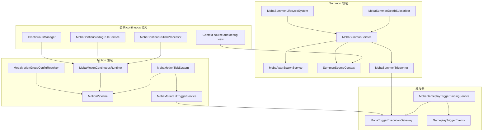
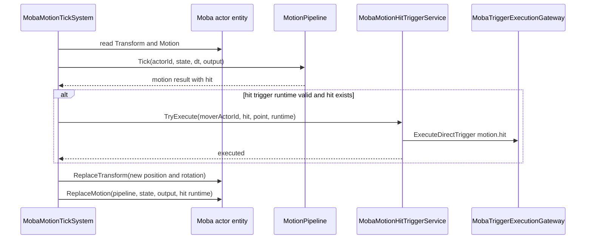
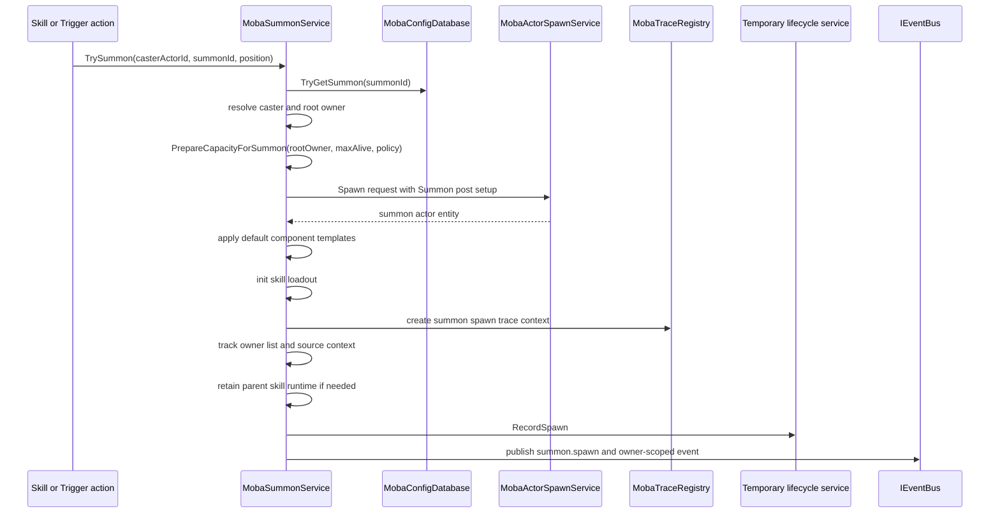

# MOBA 领域连续运行时与临时实体生命周期

> 本文补充 MOBA 示例中已经落地但此前文档覆盖较薄的两个稳定子域：Motion 领域连续运行时，以及 Summon 临时实体生命周期。它不是重复说明通用 continuous 生命周期，而是把源码中的位移源接入、motion tick、命中触发、召唤生成、容量策略、trace 快照、技能运行时保留、死亡清理和 gameplay trigger 绑定串成一条可维护的设计链路。

## 1. 能力定位

`13-ContinuousCapabilityCompositionDesign.md` 解释了 stack、periodic、cue、tag、modifier 与领域 runtime 的组合原则；本文关注这些原则在具体领域源码中的落点。

| 子域 | 设计问题 | 当前源码回答 |
|------|----------|--------------|
| Motion continuous | 位移不是 Buff，如何受 continuous 生命周期治理 | `MobaMotionContinuousRuntime` 把 motion source 加入 actor 的 motion pipeline，结束时移除 source |
| Motion tick | 位移计算为什么仍由 System 写回组件 | `MobaMotionTickSystem` 每帧推进 pipeline，写回 Transform/Motion，并把命中桥接到 trigger |
| Motion group | 多个位移源如何仲裁 | `MobaMotionGroupConfigResolver` 从配置生成 group、priority、stacking、suppression policy |
| Summon spawn | 召唤物是否只是普通 spawn | `MobaSummonService` 在 actor spawn 外叠加 owner/root-owner、容量策略、trace、技能 runtime retain 与事件发布 |
| Summon cleanup | 临时实体何时销毁 | `MobaSummonLifecycleSystem`、`MobaSummonDeathSubscriber` 与 `MobaSummonService.ExecuteRequestedDespawn` 共同清理 |
| Gameplay trigger | 全局 gameplay 生命周期如何进入 TriggerPlan | `MobaGameplayTriggerBindingService` 将 `GameplayMO.TriggerIds` 绑定到 global trigger 事件 |

边界判断：Motion 与 Summon 都可以组合 continuous、trace、trigger、snapshot 等公共能力，但它们的核心语义分别属于位移管线和实体生命周期，不能被压成一个通用 Buff 资产。

## 2. 源码入口

| 主题 | 源码 |
|------|------|
| Motion continuous runtime | `Unity/Packages/com.abilitykit.demo.moba.runtime/Runtime/Application/Services/Motion/MobaMotionContinuousRuntime.cs` |
| Motion tick system | `Unity/Packages/com.abilitykit.demo.moba.runtime/Runtime/Application/Systems/Motion/MobaMotionTickSystem.cs` |
| Motion hit trigger bridge | `Unity/Packages/com.abilitykit.demo.moba.runtime/Runtime/Application/Services/Motion/MobaMotionHitTriggerService.cs` |
| Motion group config resolver | `Unity/Packages/com.abilitykit.demo.moba.runtime/Runtime/Application/Services/Motion/MobaMotionGroupConfigResolver.cs` |
| Motion continuous settings | `Unity/Packages/com.abilitykit.demo.moba.runtime/Runtime/Application/Services/Motion/MobaMotionContinuousSettings.cs` |
| Summon service | `Unity/Packages/com.abilitykit.demo.moba.runtime/Runtime/Application/Services/Summon/MobaSummonService.cs` |
| Summon source context | `Unity/Packages/com.abilitykit.demo.moba.runtime/Runtime/Application/Services/Summon/SummonSourceContext.cs` |
| Summon lifecycle system | `Unity/Packages/com.abilitykit.demo.moba.runtime/Runtime/Application/Systems/Summon/MobaSummonLifecycleSystem.cs` |
| Summon death subscriber | `Unity/Packages/com.abilitykit.demo.moba.runtime/Runtime/Application/Services/Summon/MobaSummonDeathSubscriber.cs` |
| Summon trigger event contract | `Unity/Packages/com.abilitykit.demo.moba.runtime/Runtime/Application/Services/Summon/MobaSummonTriggering.cs` |
| Gameplay lifecycle events | `Unity/Packages/com.abilitykit.demo.moba.runtime/Runtime/Application/Gameplay/Triggering/GameplayTriggerEvents.cs` |
| Gameplay trigger binding | `Unity/Packages/com.abilitykit.demo.moba.runtime/Runtime/Application/Gameplay/Triggering/MobaGameplayTriggerBindingService.cs` |

## 3. 总体结构

这张图体现三个分层原则：

1. continuous 只治理 runtime 生命周期，不吞掉 Motion 和 Summon 的领域语义；
2. Motion 每帧位置变化仍由 motion pipeline 和 System 写回，continuous 只负责 source 的生灭与通用门控；
3. Summon 是临时 actor 的完整生命周期问题，spawn、owner、trace、capacity、skill runtime retain、despawn 和 event 都必须闭环。

## 4. Motion 领域连续运行时

### 4.1 激活时把 source 接入 pipeline

`MobaMotionContinuousRuntime` 继承 `MobaContinuousRuntimeBase`，同时实现 tick、interval state、state sync、debug source 与 execution context provider。这说明 Motion runtime 不是一个普通一次性 action，而是可以被 continuous manager 观测、暂停、恢复、同步和调试的领域 runtime。

激活阶段做三类校验：

| 校验 | 目的 |
|------|------|
| `_actors`、`_motionSource`、`OwnerActorId` 有效 | 确保 runtime 有明确作用对象与位移源 |
| owner actor 存在且具备 motion component | 确保接入点是可位移实体 |
| motion pipeline 已初始化 | 确保 source 可以进入统一仲裁管线 |

通过校验后，runtime 调用 `motion.Pipeline.AddSource(_motionSource)`。如果 runtime 携带 `MobaMotionHitTriggerRuntime`，还会替换 actor 的 motion component，把 hit trigger runtime 写入组件。这样命中监听窗口与位移源生命周期绑定，而不是分散到技能或触发器代码里。

### 4.2 结束时取消 source 并从 pipeline 移除

Motion runtime 的暂停语义直接转成 interrupted end。结束路径调用 `StopMotionSource`，并执行两步清理：

1. 调用 `_motionSource.Cancel()`，让 source 自身进入取消状态；
2. 如果 source 已经加入 pipeline，重新找到 owner actor 的 motion component 并调用 `motion.Pipeline.RemoveSource(_motionSource)`。

这个清理顺序能处理两类边界：runtime 已创建但从未成功接入 pipeline，以及 actor 已经被移除或失去 motion component。前者不应产生 remove 误操作，后者不应因为 cleanup 抛错破坏世界 tick。

### 4.3 配置由 continuous 与 motion 两侧共同决定

`MobaMotionContinuousSettings` 保存 motion 侧对 continuous 的引用：`ContinuousProcessId`、`ContinuousTagTemplateId`、`TriggerIds`、`IntervalMs`、`IntervalTriggerIds`。这些字段说明 Motion 不是重新实现 duration/tag/interval，而是引用 continuous 配置模板。

`MobaMotionGroupConfigResolver` 则负责 motion 专属仲裁：

| 字段 | 责任 |
|------|------|
| group id | 区分击退、牵引、冲刺、强制位移等来源组 |
| priority | 同组或互斥组冲突时决定保留方向 |
| stacking | 决定同类位移是否可叠加 |
| suppressed group ids | 表达某组位移会压制哪些组 |

因此配置边界是清晰的：生命周期和 tag 归 continuous，位移仲裁归 motion group。

## 5. Motion tick 与命中触发

`MobaMotionTickSystem` 在 Execute 阶段遍历具备 motion 与 transform 的 actor，每帧推进 pipeline。它不是 service 内部私自改位置，而是通过 ECS System 做组件读写，原因有三点：

| 原因 | 说明 |
|------|------|
| 顺序确定 | System order 明确位于战斗 tick 流程中，便于与输入、技能、伤害、快照协调 |
| 组件一致 | Transform 与 Motion component 在同一帧写回，避免 service 局部状态和 ECS 状态分叉 |
| 快照友好 | 后续 snapshot/表现层读取的是 actor 组件状态，而不是 motion service 私有缓存 |

核心流程如下：

`MobaMotionHitTriggerService` 把 motion collision 转成 trigger 请求。它会过滤无效 runtime、无命中、无 target、自命中和无法解析 actor 的 collider。有效命中会构造 `MobaMotionHitArgs`，携带 source actor、target actor、source context、source config、frame、collider、point、normal 与 runtime，然后通过 `motion.hit` 执行 direct trigger。

命中执行成功后，`MobaMotionTickSystem` 会把组件上的 hit trigger runtime 清空，避免同一个命中监听窗口重复触发。

## 6. Summon 不是普通 actor spawn

`MobaSummonService` 使用 `MobaActorSpawnService` 完成实体生成，但它自身承担召唤物的领域生命周期。召唤物不是“多传几个参数的 actor”，因为它需要追踪以下额外语义：

| 语义 | 源码落点 |
|------|----------|
| owner 与 root owner | `OwnerLinkUtil.ResolveRootOwner` 与 spawn post setup |
| 每 owner 最大存活数 | `_summonsByRootOwner` 与 `PrepareCapacityForSummon` |
| 替换/拒绝/允许溢出策略 | `SummonOverflowPolicy` |
| 召唤来源上下文 | `_sourceBySummonActorId` 与 `SummonSourceContext` |
| 技能运行时保留 | `_skillRuntimeRetainsBySummonActorId` |
| 临时实体统计 | `IMobaTemporaryEntityLifecycleService` |
| 召唤事件 | `MobaSummonTriggering.Events` |
| 退出清理 | `ExecuteRequestedDespawn` |

### 6.1 生成链路

召唤入口最终进入 `TrySummonInternal`。该方法不是简单透传 spawn，而是按固定顺序推进：

spawn post setup 至少写入 owner link、root owner、summon meta、是否 owner 死亡时销毁、生命周期结束时间和 model id。也就是说，召唤物从生成帧开始就具备清理所需的全部组件信息。

### 6.2 容量与溢出策略

`PrepareCapacityForSummon` 以 root owner 为维度统计同 summon id 的活跃数量。当达到 `MaxAlivePerOwner` 后，根据配置策略处理：

| 策略 | 行为 |
|------|------|
| `ReplaceOldest` | 找到最早追踪的同类召唤物并以 `ReplacedByLimit` despawn |
| `RejectNew` | 拒绝本次召唤，并记录 rejected 统计 |
| `ReplaceNewest` | 找到最新追踪的同类召唤物并替换 |
| `AllowOverflow` | 允许超过上限 |

这个策略必须属于 Summon service，而不是通用 spawn service。普通 actor spawn 不知道“同 root owner 下某类召唤物最多存活几个”的玩法语义。

### 6.3 trace 与 source context 快照

`SummonSourceContext` 同时实现 origin context、trigger lineage context、context source 和 persistent context source provider。它保存 source actor、summon actor、summon config、source/root/owner context、skill runtime handle 与 gameplay origin。

builder 的关键行为是：

| 方法 | 行为 |
|------|------|
| `WithSpawnContext` | 设置 source context，并在 root/owner context 缺省时补齐 |
| `WithOrigin` | 继承已有 origin，并补齐 skill runtime handle |
| `Build` | 如果没有 origin，则用 summon spawn 信息构造 `MobaGameplayOrigin` |

`MobaSummonService` 要求 spawn context id 不能为 0；如果没有 trace context，会抛出异常。这是一个明确的工程约束：召唤物会跨帧存在，必须留下可追溯来源，否则后续 damage、trigger、死亡事件和回放诊断无法可靠解释。

## 7. Summon despawn 与清理闭环

召唤物销毁由 service 统一执行，外部系统只发起请求。`ExecuteRequestedDespawn` 承担完整清理：

1. 从 registry 和 entity manager 注销 actor；
2. 从 root owner 追踪表移除 summon actor；
3. 消费并移除 source context；
4. 释放 skill runtime retain handle；
5. 结束 spawn trace；
6. 记录 temporary entity despawn/replaced 统计；
7. 发布 `summon.despawn` 和 owner-scoped despawn 事件；
8. 最后 destroy entity。

这个顺序的重点是先断开查询入口，再清理领域追踪和 trace，最后销毁实体。这样事件消费者拿到 despawn 事件时，能读到稳定的 reason、owner、summon id 与 source context，而不会留下活跃索引残留。

### 7.1 生命周期 System 负责时间与 owner 死亡

`MobaSummonLifecycleSystem` 运行在 PostExecute 阶段，处理两个自然结束条件：

| 条件 | 行为 |
|------|------|
| `Lifetime.EndTimeMs` 到期 | 请求 `SummonDespawnReason.Timeout` |
| `DespawnOnOwnerDie` 且 owner 不存在 | 请求 `SummonDespawnReason.OwnerDead` |

把这部分放在 System 中，能让召唤物生命周期跟随世界帧推进，而不是依赖 service 内部计时器。

### 7.2 Damage 后置事件负责击杀清理

`MobaSummonDeathSubscriber` 订阅 `DamagePipelineEvents.AfterApply`。当 damage result 显示目标血量小于等于 0，并且目标 actor 具备 summon meta 时，请求 `SummonDespawnReason.Killed`。

这条链路说明伤害系统不直接销毁召唤物；它只发布 damage after-apply 结果。召唤物死亡语义由 Summon 领域订阅并转成 despawn，避免 Damage service 认识所有临时实体类型。

## 8. Summon 事件契约

`MobaSummonTriggering` 定义的事件名是召唤物生命周期对 trigger 系统的公共契约：

| 事件 | 语义 |
|------|------|
| `summon.spawn` | 任意召唤物生成 |
| `summon.despawn` | 任意召唤物离场 |
| `summon.die` | 召唤物死亡语义事件 |
| `summon.spawn.owner.{rootOwnerActorId}` | 指定 root owner 的召唤物生成 |
| `summon.despawn.owner.{rootOwnerActorId}` | 指定 root owner 的召唤物离场 |
| `summon.die.owner.{rootOwnerActorId}` | 指定 root owner 的召唤物死亡 |

事件参数字段使用稳定字符串：`summon.actorId`、`summon.id`、`summon.ownerActorId`、`summon.rootOwnerActorId`、`summon.reason`。这让 TriggerPlan 可以订阅召唤生命周期，而不需要直接依赖 `MobaSummonService` 的内部字典。

## 9. Gameplay lifecycle trigger 绑定

Gameplay 生命周期事件和召唤/位移事件不同，它是全局战斗级事件。`GameplayTriggerEvents` 定义了 `gameplay.started`、`gameplay.tick`、`gameplay.ended` 以及 frame、elapsed、delta、win team 等字段。

`MobaGameplayTriggerBindingService` 在绑定 `GameplayMO` 时做两层校验：

| 校验 | 目的 |
|------|------|
| trigger record 必须存在、带 event id、scope 为 global | 防止把 gameplay 生命周期错误绑定到 owner 或局部 scope |
| event name 必须在 event registry 中可解析 args type | 防止配置中的事件名无法产生强类型参数 |

绑定成功后，service 保留 registration 句柄，并在 `Unbind` 或 `Dispose` 时释放。这个设计把 gameplay 配置表中的 trigger ids 和运行时 trigger gateway 解耦：配置只声明触发器，绑定服务负责检查并注册到全局事件。

## 10. 与既有专题的关系

| 文档 | 关系 |
|------|------|
| `10-TriggerValidationPresentationDeepDive.md` | 说明 trigger gateway、owner-bound subscription、validation、presentation cue；本文补充 motion.hit、summon.* 与 gameplay.* 的领域事件来源 |
| `11-PlanActionsAndContinuousRuntimeDeepDive.md` | 说明 PlanAction 与 continuous runtime 深潜；本文补充 Motion runtime 如何把 source 接入 motion pipeline |
| `13-ContinuousCapabilityCompositionDesign.md` | 说明组合原则；本文给出 Motion 与 Summon 的源码级落地 |
| `14-HeroSkillFormalDesign.md` | 说明英雄技能如何使用 TriggerPlan、Buff、Projectile、Counter；本文补充技能召唤物、位移命中和全局事件的生命周期基础 |
| `15-OnlineSessionAndProtocolContract.md` | 说明会话/协议边界；本文的 runtime 状态最终仍通过快照和事件进入联机表现链路 |

## 11. 扩展规则

新增 Motion 或 Summon 类能力时，建议按以下规则治理：

| 扩展点 | 规则 |
|--------|------|
| 新 motion source | 必须明确 group、priority、stacking、suppression 以及是否携带 continuous process |
| 新 motion hit 逻辑 | 优先通过 `motion.hit` trigger 扩展，不在 motion tick 中硬编码技能效果 |
| 新 summon 类型 | 必须配置 owner/root owner 语义、max alive、overflow policy、lifetime 与 owner-dead 策略 |
| 新临时实体类型 | 不要复用 Summon 字典；抽出或实现自己的 temporary lifecycle 追踪和事件契约 |
| 新召唤事件 | 必须补齐稳定事件名、参数字段、owner-scoped 版本和 trigger registry 注册 |
| 新 gameplay 事件 | 必须在 event registry 中注册 args type，并确保 binding service 可校验 |
| 新 trace 来源 | source/root/owner context 不允许为 0，跨帧实体必须能解释来源链路 |

## 12. 边界判断

| 容易混淆的判断 | 设计边界 |
|----------------|----------|
| Motion continuous 等于 Buff duration | Motion 使用 continuous 生命周期，但位移合成属于 motion pipeline |
| Motion 命中应该直接造成伤害 | Motion 命中只发布 `motion.hit` trigger，伤害由 TriggerPlan 或 effect 执行 |
| Summon 等于 actor spawn | Summon 是带 owner、capacity、trace、runtime retain、lifecycle event 的临时实体生命周期 |
| Damage service 应该销毁召唤物 | Damage 只产出 after-apply 结果，Summon death subscriber 转换成 despawn |
| 没有 trace context 也能召唤 | 当前实现要求 summon spawn 必须有 trace context，避免跨帧来源丢失 |
| Gameplay trigger 可以绑定任意 scope | Gameplay binding 要求 TriggerPlanScope.Global |

这篇专题的核心结论是：MOBA 示例已经把持续行为拆成通用生命周期与领域运行时两层。Motion 证明了“持续运行时可以只管理 source 生灭，而不接管物理/位移合成”；Summon 证明了“临时实体生命周期必须比普通 spawn 更严格地治理 owner、容量、trace、事件和清理”。
