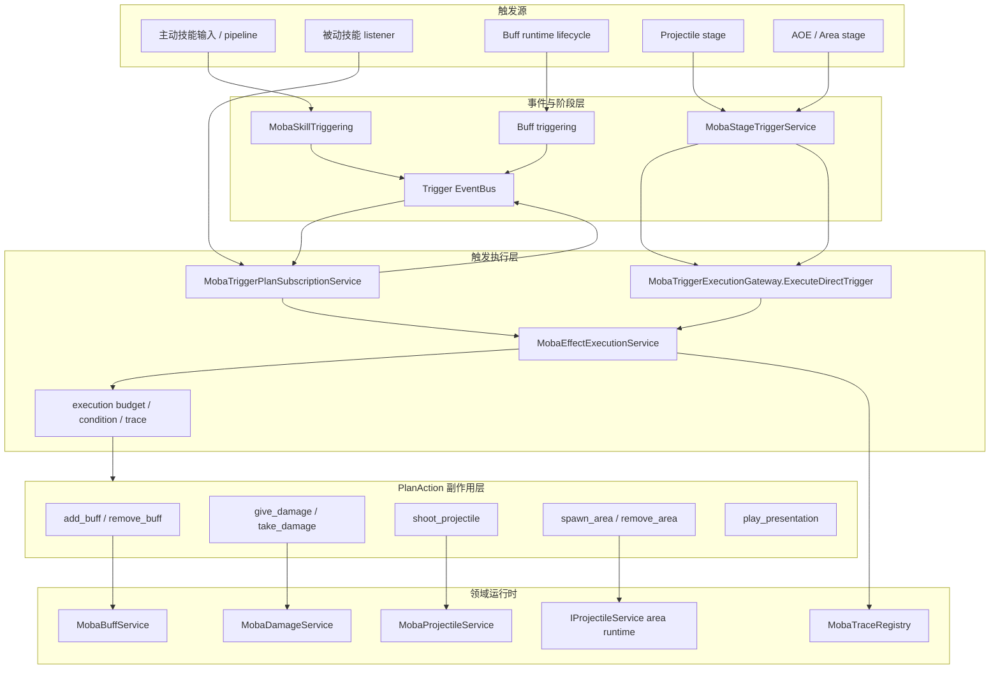
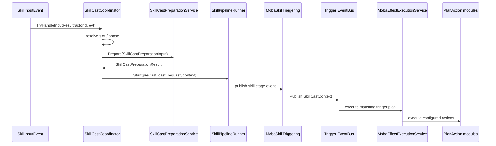
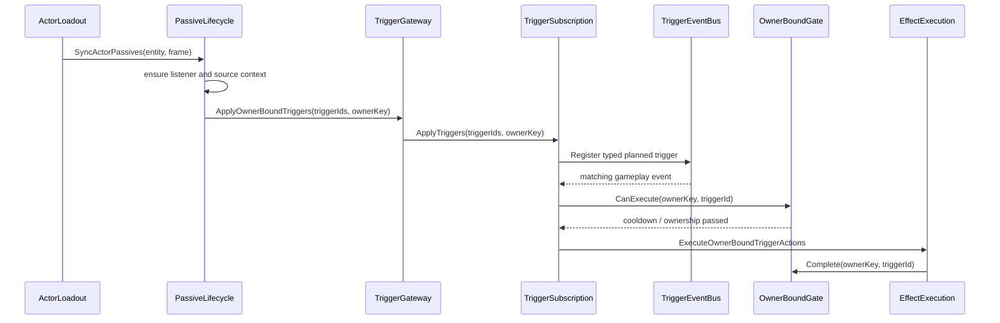
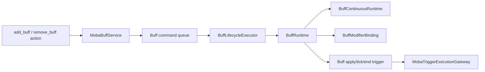
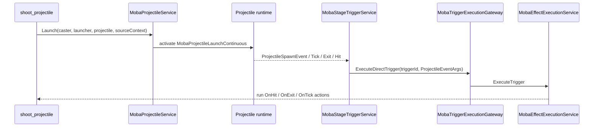
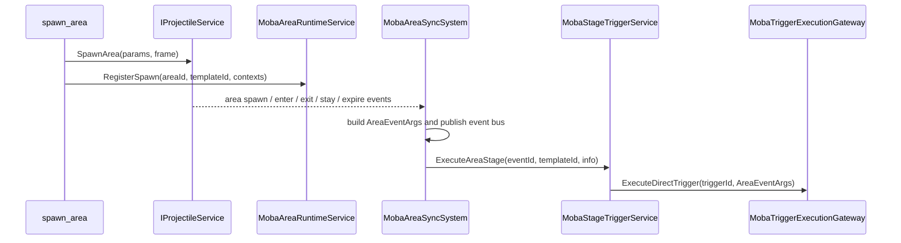

# MOBA 主动、被动、Buff、Projectile 与 AOE 触发效果设计

> 本文补齐 MOBA 示例中“触发效果如何从技能、被动、Buff、Projectile、AOE 进入 TriggerPlan，并最终落到领域服务”的专题说明。既有文档已经分别覆盖 Skill 执行、Buff 生命周期、Projectile/Damage、Trace/Context、PlanActions DSL 和英雄技能配置；本文只聚焦触发效果链路本身，说明哪些对象负责产生触发点，哪些对象负责执行 TriggerPlan，哪些对象负责承接副作用。

## 1. 能力定位

MOBA 示例里的触发效果不是一个单独系统，而是五类运行时对象共享同一套 TriggerPlan 执行能力：

| 类型 | 触发来源 | 典型事件 | 执行入口 | 副作用落点 |
|------|----------|----------|----------|------------|
| 主动技能 | 输入、技能槽、技能 pipeline 阶段 | `skill.precast.start`、`skill.cast.complete` | `MobaSkillTriggering.Publish`、`MobaEffectExecutionService.Execute` | cooldown、resource、damage、buff、projectile、area |
| 被动技能 | actor loadout、owner-bound event subscription | `damage.apply.after`、`skill.cast.complete`、自定义事件 | `MobaTriggerPlanSubscriptionService`、`ExecuteOwnerBoundTriggerActions` | buff、counter、shield、projectile、continuous |
| Buff | apply/refresh/tick/remove/end 生命周期 | `buff.apply`、`buff.tick`、`buff.end` | Buff lifecycle / buff triggering | modifier、tag、periodic trigger、presentation cue |
| Projectile | spawn/tick/hit/exit 阶段 | `projectile.spawn`、`projectile.hit` | `MobaStageTriggerService.ExecuteProjectile*` | hit effect、damage、buff、area、cue |
| AOE / Area | spawn/enter/exit/stay/tick 阶段 | `area.spawn`、`area.enter`、`area.exit`、`area.tick` | `MobaAreaSyncSystem` -> `MobaStageTriggerService.ExecuteAreaStage` | damage、buff、control、summon、cue |

设计目标是：主动、被动、Buff、Projectile、AOE 不各自实现一套效果解释器，而是统一进入 TriggerPlan、PlanAction 和领域服务。差异只保留在“谁产生事件、payload 是什么、source context 如何继承、触发计划属于 direct 还是 owner-bound”。

## 2. 总体链路

这条链路里有两个执行模式：

| 模式 | 用途 | 特点 |
|------|------|------|
| direct trigger | Projectile hit、Area enter、Buff tick、显式 effect id 等运行时阶段点 | 调用方已经知道 triggerId，构造强类型 payload 后直接执行 |
| owner-bound trigger | 被动技能、光环、持续监听等依附某个 owner 的事件订阅 | 先注册 trigger 到 EventBus，事件发生时再通过 gate、cooldown、source context 执行 |

`MobaTriggerExecutionGateway` 是这两类入口的统一门面。direct 分支调用 `MobaEffectExecutionService.ExecuteTrigger`；owner-bound 分支交给 `MobaTriggerPlanSubscriptionService.ApplyTriggers` 和 `Stop` 维护订阅。

## 3. 主动技能触发

主动技能从输入侧进入：`SkillInputEvent` 带有 actor、slot、phase、aim 和 target 信息，`SkillCastCoordinator` 负责把 Press/Hold/Release/Cancel 分派到技能释放流程。准备阶段通过 `SkillCastPreparationService` 生成 `SkillCastContext`、runtime handle、pipeline request 和阶段配置；随后 `SkillPipelineRunner.Start` 执行 pre-cast / cast pipeline。

主动技能的设计重点：

| 关注点 | 设计约束 |
|--------|----------|
| 技能槽只负责找到 skillId | 技能行为不写在 slot 或 input handler 中，而是在配置和 TriggerPlan 中表达 |
| pipeline 只负责释放时序 | pre-cast、cast、fail、interrupt、complete 是阶段，不直接承载复杂副作用 |
| `SkillCastContext` 是 payload | caster、skillId、skillLevel、slot、aim、target、source context 都从 context 进入后续 TriggerPlan |
| action 决定副作用 | cooldown/resource/damage/buff/projectile/area 都由 PlanAction 调用领域服务 |

主动技能和 Projectile/AOE 的关系也在这里建立：`shoot_projectile` 和 `spawn_area` 不是技能系统内部硬编码逻辑，而是 TriggerPlan action。这样同一个 action 可以被主动技能、被动、Buff tick 或 projectile hit 复用。

## 4. 被动技能触发

被动技能保存在 `SkillLoadoutComponent.PassiveSkills`，运行时状态是 `PassiveSkillRuntime`，监听状态由 `PassiveSkillTriggerListenersComponent` 保存。`MobaPassiveSkillLifecycleService.SyncActorPassives` 每帧同步 actor 当前被动：

1. 对 loadout 中的 passive skill 创建 listener；
2. 为 passive 创建 root/source trace context；
3. 按 `PassiveSkillMO.TriggerIds` 写入 `OngoingTriggerPlansComponent`；
4. 通过 `MobaTriggerExecutionGateway.ApplyOwnerBoundTriggers` 注册 owner-bound trigger；
5. 如果存在 continuous process，则同步被动持续触发 runtime。

被动技能与主动技能最大的差别是 ownership：被动不是直接在一次 cast 内执行，而是把 trigger 绑定到 ownerKey。事件发生时，owner-bound gate 会检查：

| 检查 | 来源 |
|------|------|
| ownerKey 是否仍然有效 | passive listener 与 subscription registry |
| triggerId 是否属于该 passive | passive binding cache |
| cooldown 是否结束 | `PassiveSkillRuntime.CooldownEndTimeMs` |
| 执行来源是否可追踪 | `MobaOwnerBoundTriggerExecutionSource` |

这使得被动技能可以监听全局战斗事件，但执行时仍能回到“某个 actor 的某个 passive skill”这一来源上。

## 5. Buff 触发与生命周期

Buff 的外部入口是 `MobaBuffService`，它不让 action 直接改 `BuffRuntime`，而是把 apply/remove 收敛成命令队列，再交给 lifecycle executor 处理。这样 Buff 可以统一处理叠层、刷新、时长、tag 中断、interval tick、modifier binding 和 trace end。

`AddBuffPlanActionModule` 的执行模式非常直接：解析 caster 和 targets，构造 `BuffOriginContext`，对每个目标调用 `MobaBuffService.ApplyBuffImmediate`。真正的生命周期细节保留在 Buff 层，PlanAction 不负责堆叠策略或 tag admission。

Buff 触发效果的边界：

| 行为 | 归属 |
|------|------|
| 是否允许叠层/刷新 | Buff lifecycle / config |
| interval 到点触发什么 | Buff triggering / TriggerPlan |
| Buff 结束原因 | lifecycle reconcile / trace reason |
| 修改属性 | modifier binding / attribute system |
| 应用额外效果 | Buff event -> TriggerPlan -> PlanAction |

因此 Buff 既是效果结果，也可以成为新的触发源。例如技能命中后加 Buff，Buff tick 再造成伤害或刷新状态，Buff end 再播放表现或移除附属对象。

## 6. Projectile 触发

Projectile 触发链从 `shoot_projectile` action 开始。`ShootProjectilePlanActionModule` 解析 launcher、projectile、count、fanAngle、duration 和 aim，创建 `ProjectileSourceContext` 后调用 `MobaProjectileService.Launch`。

`MobaProjectileService` 负责：

| 职责 | 说明 |
|------|------|
| 创建发射过程 | 用 `MobaProjectileLaunchContinuous` 表达持续发射或多发序列 |
| 创建 launcher actor | `ProjectileLauncherComponent` 保存 launcherId、projectileId、rootActorId、结束时间和发射计数 |
| 创建 projectile source | 从父 context 派生 projectile launch context |
| 保留技能 runtime | projectile 生命周期内可保留技能 runtime 句柄 |
| 输出 projectile events | spawn/tick/hit/exit 由 projectile sync 和 stage trigger 消费 |

Projectile stage trigger 的配置分发集中在 `MobaStageTriggerService`：

| Projectile 阶段 | 触发数组或字段 | payload |
|-----------------|----------------|---------|
| spawn | `ProjectileMO.OnSpawnTriggerIds` | `ProjectileEventArgs` |
| tick | `ProjectileMO.OnTickTriggerIds` | `ProjectileEventArgs` |
| exit | `ProjectileMO.OnExitTriggerIds` | `ProjectileEventArgs` |
| hit | `ProjectileMO.OnHitEffectId`、`ProjectileMO.OnHitTriggerIds` | `ProjectileHitArgs` |

命中阶段有一个兼容性细节：`OnHitEffectId` 会先作为直接 effect 执行，`OnHitTriggerIds` 再逐个执行。这让旧式“单 effect id”配置和新式“多 trigger id”配置可以共存。

## 7. AOE / Area 触发

AOE 配置由 `AoeMO` 表达，核心不是一个视觉范围，而是一组阶段触发点：

| AOE 配置字段 | 阶段语义 |
|--------------|----------|
| `OnDelayTriggerIds` | spawn / delay 完成时触发 |
| `OnEnterTriggerIds` | 目标进入区域时触发 |
| `OnExitTriggerIds` | 目标离开区域时触发 |
| `OnIntervalTriggerIds` | stay / tick 周期触发 |
| `IntervalMs` | stay/tick 间隔 |
| `DurationMs` | 区域持续时间 |

`SpawnAreaPlanActionModule` 负责解析位置、半径、持续时间、碰撞层和 tick 间隔，然后调用 `IProjectileService.SpawnArea`。Area runtime 信息由 `MobaAreaRuntimeService.RegisterSpawn` 保存，包括 templateId、owner、center、radius、source/root/owner context。

`MobaAreaSyncSystem` 同时做两件事：

1. 发布 typed/object EventBus 事件，给 owner-bound trigger 或其他监听者使用；
2. 调用 `MobaStageTriggerService.ExecuteAreaStage`，按 AOE 配置数组直接执行阶段 trigger。

Area 阶段映射规则：

| eventId | AOE trigger array |
|---------|-------------------|
| `area.spawn` | `OnDelayTriggerIds` |
| `area.enter` | `OnEnterTriggerIds` |
| `area.exit` | `OnExitTriggerIds` |
| `area.tick` / `area.stay` | `OnIntervalTriggerIds` |

这意味着 AOE 可以既是技能效果结果，也可以继续作为事件源，触发伤害、Buff、控制、召唤或表现 Cue。

## 8. Source Context 与 Trace 继承

触发效果链路的关键约束是：每个副作用都必须能回答“谁产生的、从哪个技能/被动/Buff/projectile/area 派生、根来源是谁”。MOBA 示例通过 `MobaTraceRegistry`、`MobaGameplayOrigin`、`MobaContextSourceView` 和各类 source context 传递这些信息。

| 场景 | context 处理 |
|------|--------------|
| 主动技能 | cast preparation 创建 source context，`SkillCastContext` 携带给 TriggerPlan |
| 被动技能 | passive lifecycle 为 listener 创建 root context，owner-bound source 在执行时转成 lineage input |
| Buff | `BuffOriginContext` 从 action input 构造，BuffRuntime 保存 source/runtime context |
| Projectile | launch 从 parent context 派生 projectile launch context，hit payload 带 `ProjectileSourceContext` |
| AOE | spawn action 创建 area spawn child context，area runtime 保存 source/root/owner context，enter 可再派生 child context |

`MobaEffectExecutionService` 会在每次正式执行 TriggerPlan 时创建 effect trace scope，并为 plan actions 创建 action child nodes。这样 trace artifact 可以还原出：技能触发 projectile，projectile hit 触发 damage，damage event 激活 passive，被动再添加 Buff 的完整父子链。

## 9. PlanAction 副作用边界

触发计划最终通过 PlanAction 调用领域服务。常见 action 的边界如下：

| Action | 运行时依赖 | 边界 |
|--------|------------|------|
| `add_buff` | `MobaBuffService` | 只发起 apply，不实现 Buff lifecycle |
| `remove_buff` | `MobaBuffService` | 只发起 remove，不直接删 runtime list |
| `give_damage` / `take_damage` | `MobaDamageService` | 只提交伤害/治疗请求，不绕过 Damage pipeline |
| `shoot_projectile` | `MobaProjectileService` | 只请求发射，不手写命中检测 |
| `spawn_area` | `IProjectileService`、`MobaAreaRuntimeService` | 只创建 area 和 runtime info，不直接执行 enter/tick |
| `play_presentation` | Presentation cue service | 只产生命令或 cue，不直接操作 Unity 对象 |
| `start_cooldown` / `consume_resource` | skill/resource service | 只修改对应领域状态，不混入其他效果 |

这个边界保证了 TriggerPlan 是“效果编排层”，不是领域状态的第二套实现。新增玩法动作时，应优先问：已有领域服务是否已经拥有生命周期和校验逻辑；如果有，PlanAction 只做参数解析和服务调用。

## 10. 运行时约束与检查清单

| 检查项 | 要求 |
|--------|------|
| triggerId 有效性 | direct trigger 必须大于 0；owner-bound trigger 必须存在于 `TriggerPlanJsonDatabase` |
| payload 类型 | owner-bound trigger 必须能从事件注册表解析 typed args；direct trigger 必须提供可解析 lineage 的 payload |
| context 完整性 | projectile launch、area spawn、Buff apply 等需要保留 parent/root/owner context |
| 预算保护 | `MobaEffectExecutionService` 通过 execution budget 防止递归或同帧爆量触发 |
| 条件评估 | trigger conditions 在 plan action 执行前统一评估，失败时不进入副作用层 |
| 生命周期归属 | Buff、Projectile、Area、Passive continuous 的结束、清理、trace end 必须由各自领域服务负责 |
| 表现隔离 | 表现只消费 snapshot/cue/view event，不参与权威逻辑判定 |

## 11. 源码阅读路径

| 主题 | 源码 |
|------|------|
| 技能输入与释放入口 | `Unity/Packages/com.abilitykit.demo.moba.runtime/Runtime/Application/Services/Skill/Cast/SkillCastCoordinator.cs` |
| 技能事件发布 | `Unity/Packages/com.abilitykit.demo.moba.runtime/Runtime/Application/Services/Skill/Events/MobaSkillTriggering.cs` |
| 技能触发参数 | `Unity/Packages/com.abilitykit.demo.moba.runtime/Runtime/Application/Services/Skill/Events/MobaSkillTriggerArgs.cs` |
| 被动生命周期 | `Unity/Packages/com.abilitykit.demo.moba.runtime/Runtime/Application/Services/Passive/MobaPassiveSkillLifecycleService.cs` |
| 触发执行网关 | `Unity/Packages/com.abilitykit.demo.moba.runtime/Runtime/Application/Services/Triggering/MobaTriggerExecutionGateway.cs` |
| owner-bound 订阅 | `Unity/Packages/com.abilitykit.demo.moba.runtime/Runtime/Application/Services/Triggering/MobaTriggerPlanSubscriptionService.cs` |
| 效果执行服务 | `Unity/Packages/com.abilitykit.demo.moba.runtime/Runtime/Application/Services/Skill/Effects/MobaEffectExecutionService.cs` |
| 阶段触发服务 | `Unity/Packages/com.abilitykit.demo.moba.runtime/Runtime/Application/Services/Triggering/MobaStageTriggerService.cs` |
| Buff 服务 | `Unity/Packages/com.abilitykit.demo.moba.runtime/Runtime/Application/Services/Buffs/MobaBuffService.cs` |
| Projectile 服务 | `Unity/Packages/com.abilitykit.demo.moba.runtime/Runtime/Application/Services/Projectile/MobaProjectileService.cs` |
| Area 同步系统 | `Unity/Packages/com.abilitykit.demo.moba.runtime/Runtime/Application/Systems/Area/MobaAreaSyncSystem.cs` |
| Projectile action | `Unity/Packages/com.abilitykit.demo.moba.runtime/Runtime/Application/Services/Triggering/PlanActions/Skill/ShootProjectilePlanActionModule.cs` |
| Buff action | `Unity/Packages/com.abilitykit.demo.moba.runtime/Runtime/Application/Services/Triggering/PlanActions/Skill/AddBuffPlanActionModule.cs` |
| Area action | `Unity/Packages/com.abilitykit.demo.moba.runtime/Runtime/Application/Services/Triggering/PlanActions/Skill/SpawnAreaPlanActionModule.cs` |
| 事件常量 | `Unity/Packages/com.abilitykit.demo.moba.runtime/Runtime/Domain/Events/GameEvents.cs` |
| 技能 loadout/runtime | `Unity/Packages/com.abilitykit.demo.moba.runtime/Runtime/Domain/Components/SkillLoadoutComponent.cs`、`Unity/Packages/com.abilitykit.demo.moba.runtime/Runtime/Domain/Components/SkillRuntime.cs` |
| Buff runtime | `Unity/Packages/com.abilitykit.demo.moba.runtime/Runtime/Domain/Components/BuffComponent.cs` |
| Projectile launcher runtime | `Unity/Packages/com.abilitykit.demo.moba.runtime/Runtime/Domain/Components/ProjectileLauncherComponent.cs` |
| AOE 配置 | `Unity/Packages/com.abilitykit.demo.moba.runtime/Runtime/Infrastructure/Config/BattleDemo/MO/AoeMO.cs` |

## 12. 与既有专题的关系

| 已有文档 | 本文补充点 |
|----------|------------|
| [05-技能执行深潜](05-SkillExecutionDeepDive.md) | 该文讲技能 cast/pipeline，本文补充技能阶段如何成为 TriggerPlan 输入 |
| [07-Buff 生命周期深潜](07-BuffLifecycleDeepDive.md) | 该文讲 Buff 内部生命周期，本文补充 Buff 作为触发源和 action 结果的双重身份 |
| [08-Projectile 与 Damage 深潜](08-ProjectileDamageDeepDive.md) | 该文讲 projectile/damage 管线，本文补充 projectile stage trigger 与 hit effect 映射 |
| [09-Trace、Context 与 Effect 执行深潜](09-TraceContextEffectDeepDive.md) | 该文讲 trace/context 机制，本文补充不同触发源如何继承 context |
| [10-Trigger、Validation 与 Presentation Cue 深潜](10-TriggerValidationPresentationDeepDive.md) | 该文讲 trigger validation/cue，本文补充主动/被动/Buff/Projectile/AOE 的入口分类 |
| [11-PlanActions DSL 与 Continuous Runtime 深潜](11-PlanActionsAndContinuousRuntimeDeepDive.md) | 该文讲 DSL 和 continuous runtime，本文补充这些 action 在触发效果链路中的位置 |
| [14-四英雄技能正式实现设计](14-HeroSkillFormalDesign.md) | 该文讲英雄资源映射，本文提供这些资源背后的通用运行时链路 |
