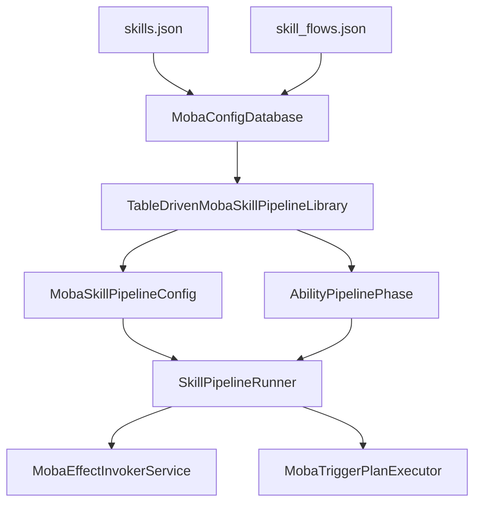
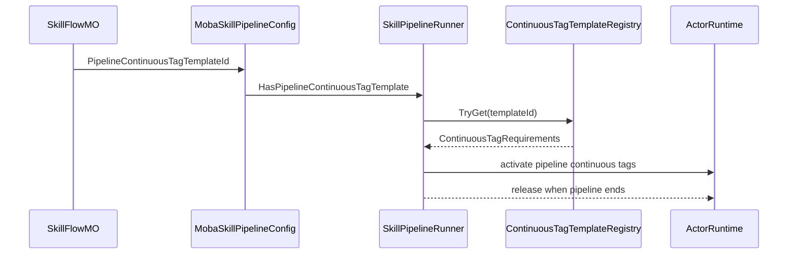

# 18. MOBA 技能 Flow 与 Pipeline 配置设计

> 现有 MOBA 文档已经说明技能输入、技能释放和 TriggerPlan 执行，但还缺少一篇专门解释 `skills.json`、`skill_flows.json` 如何被表驱动 Pipeline 消费的文档。本文按源码补齐配置字段、Phase 类型、运行时构建、校验规则和当前配置治理点。

## 1. 能力定位

MOBA 技能释放不是在代码里为每个英雄手写 Pipeline，而是由技能表指向技能 Flow 表：

| 配置 | 关键字段 | 运行时含义 | 源码入口 |
|------|----------|------------|----------|
| `skills.json` | `PreCastFlowId`、`CastFlowId` | 技能是否有预释放 Flow，以及正式释放使用哪个 Flow | `SkillDTO`、`SkillMO` |
| `skill_flows.json` | `PipelineContinuousTagTemplateId`、`Phases` | Pipeline 持续标签模板和 phase 编排 | `SkillFlowDTO`、`SkillFlowMO` |
| `trigger_plans.json` | TriggerPlan actions / conditions | RulePlan phase 和 Timeline effect 最终执行的计划 | `MobaTriggerPlanExecutor`、`MobaEffectExecutionService` |
| `continuous_tag_templates.json` | tag requirements | Pipeline 运行期间持续占用/打断/门禁标签 | `MobaSkillPipelineConfig`、`SkillPipelineRunner` |

当前配置中所有主动技能都通过 `CastFlowId` 指向同 ID 的技能 Flow，`PreCastFlowId` 暂未启用。这意味着当前示例主要展示 cast pipeline，而 precast pipeline 的机制由源码保留。

## 2. 从技能表到 Pipeline



运行时链路如下：

1. `MobaConfigDatabase` 加载 `skills.json` 和 `skill_flows.json`，通过 `GetSkillFlow` / `TryGetSkillFlow` 暴露 Flow。
2. `TableDrivenMobaSkillPipelineLibrary.TryGet` 根据 skillId 取 `SkillMO`，再通过 `CastFlowId` 和可选 `PreCastFlowId` 构建 Pipeline 配置。
3. `CreatePipelineConfig` 把 `SkillFlowMO.PipelineContinuousTagTemplateId` 包装进 `MobaSkillPipelineConfig`。
4. `BuildFlowDefinitions` 遍历 `SkillFlowMO.Phases`，按 `SkillPhaseType` 转成可实例化的 phase definition。
5. `SkillPipelineRunner` 运行 phase，并在 pipeline 启动时按 `PipelineContinuousTagTemplateId` 激活持续标签模板。

## 3. Phase 类型映射

`SkillPhaseType` 的数字不是随意约定，而是 DTO 枚举定义。当前源码支持以下类型：

| Type | 名称 | 配置节点 | 运行时 Phase | 说明 |
|------|------|----------|--------------|------|
| 1 | Checks | `Checks` | 不再构建 | 已废弃，校验器报错，建议迁移到 RulePlan conditions |
| 2 | Timeline | `Timeline` | `SkillTimelinePhase` | 按 `AtMs` 执行 effect/trigger，并按 `DurationMs` 完成 phase |
| 3 | Handlers | `Handlers` | 不再构建 | 已废弃，校验器报错，建议迁移到 RulePlan actions |
| 4 | RulePlan | `RulePlan` | `SkillRulePlanPhase` | 即时执行一组 TriggerPlan，可按失败中断技能 |
| 10 | Sequence | `Children` | `AbilitySequencePhase` | 子 phase 顺序执行 |
| 11 | Parallel | `Children` | `AbilityParallelPhase` | 子 phase 并行执行 |
| 12 | Repeat | `Repeat` | `AbilityRepeatPhase` | 重复执行一个显式子 phase |
| 13 | Delay | `Delay` | `AbilityDelayPhase` | 等待固定毫秒数 |
| 14 | WaitUntil | `WaitUntil` | `AbilityWaitUntilPhase` | 等待运行时条件成立或超时 |

配置治理上要注意两点：

- `Checks` 和 `Handlers` 仍保留在 DTO 中，是为了兼容旧配置结构，但 `TableDrivenMobaSkillPipelineLibrary` 会直接抛异常，`MobaBattleConfigReferenceValidator` 也会报错。
- 新配置应优先使用 `RulePlan` 表达释放条件、资源扣除、提交检查和失败原因，用 `Timeline` 触发正式效果。

## 4. Timeline Phase

`Timeline` 是当前大多数技能的主路径。配置示例：

```json
{
  "Type": 2,
  "Timeline": {
    "DurationMs": 650,
    "Events": [
      { "AtMs": 0, "EffectId": 10010101, "ExecuteMode": 0, "EventTag": "lp_skill_1_cast" }
    ]
  }
}
```

运行规则：

| 字段 | 运行时含义 |
|------|------------|
| `DurationMs` | phase 持续时间；大于 0 时达到该时间后完成 |
| `Events[].AtMs` | phase 进入后第几毫秒触发 |
| `Events[].EffectId` | 实际会作为 TriggerPlan/effect ID 执行，校验器要求能在 TriggerPlan 库找到 |
| `Events[].ExecuteMode` | 当前只支持 `EffectExecuteMode.InternalOnly`，非 0 会抛异常 |
| `Events[].EventTag` | 配置可读性和诊断标签，当前 `SkillTimelinePhase` 不以它驱动逻辑 |

`SkillTimelinePhase` 在 `OnEnter` 重置 `_elapsedSeconds` 和 `_nextEventIndex`，在 `OnUpdate` 中按时间推进事件。每个事件通过 `MobaEffectInvokerService.Execute(effectId, context)` 进入后续 effect/TriggerPlan 链路。

## 5. RulePlan Phase

`RulePlan` 用来在技能 Flow 内直接执行一组 TriggerPlan，适合表达释放门禁、提交检查、资源消耗或多段技能前置规则。廉颇三技能目前在 Timeline 前有两个 RulePlan phase：

```json
{
  "Type": 4,
  "RulePlan": {
    "TriggerIds": [900101011],
    "AbortOnFailure": true,
    "FailReason": "skill_release_failed"
  }
}
```

运行规则：

| 字段 | 运行时含义 |
|------|------------|
| `TriggerIds` | 逐个调用 `MobaTriggerPlanExecutor.ExecuteRulePlan(triggerId, context)` |
| `AbortOnFailure` | 任一计划失败时是否中断当前技能 Flow |
| `FailReason` | 中断时写入 `SkillPipelineContext.FailReason` |

与 `Timeline` 不同，`RulePlan` 是即时 phase，不等待时间流逝。它和普通 owner-bound trigger 不同：RulePlan phase 的 payload 是当前 `SkillPipelineContext`，执行发生在技能 Pipeline 内部。

## 6. Sequence 与 WaitUntil

廉颇三技能展示了复合 phase 的设计：先执行释放/提交 RulePlan，再进入一个 `Sequence`，其中每段 Timeline 后插入 `WaitUntil`：

```json
{
  "Type": 14,
  "PhaseId": "lp_skill_3_wait_after_stage_1",
  "WaitUntil": {
    "Condition": "ObservedSlotsIdle",
    "TimeoutMs": 0,
    "CompleteOnTimeout": true,
    "ObservedSlots": [1, 2]
  }
}
```

`ObservedSlotsIdle` 是当前唯一支持的 WaitUntil 条件。运行时会解析 `SkillCastCoordinator`，检查同一 caster 的 `ObservedSlots` 是否还有运行中的技能：

- `ObservedSlots` 为空时直接视为满足。
- slot 小于等于 0 或等于当前技能 slot 时忽略。
- 任一被观察 slot 仍在运行，则 WaitUntil 继续等待。
- `TimeoutMs` 为 0 会被转换为 `-1f`，表示不使用超时完成逻辑。

这个机制适合多段大招：既允许一段技能内部按顺序推进，又能等待其他槽位释放结束，避免互相覆盖关键动作窗口。

## 7. Pipeline 持续标签模板

`PipelineContinuousTagTemplateId` 位于 `SkillFlowDTO` 上，而不是单个 phase 上。它的语义是“整个技能 Pipeline 运行期间需要绑定的持续 tag requirements”。

当前廉颇 1/2/3 技能都配置了 `10010001`，运行时路径是：



设计上它解决的是技能 Pipeline 级别的占用、霸体、不可打断、施法状态等持续状态，不适合塞到单个 Timeline event 里临时处理。单个效果触发仍应由 Timeline/RulePlan 进入 TriggerPlan。

## 8. 配置校验与当前风险

`MobaBattleConfigReferenceValidator` 对 skill flow 做了静态引用和结构校验：

| 校验点 | 结果 |
|--------|------|
| `CastFlowId` | 必须引用存在的 SkillFlow |
| `PreCastFlowId` | 大于 0 时必须引用存在的 SkillFlow |
| `PipelineContinuousTagTemplateId` | 大于 0 时必须引用存在的 ContinuousTagTemplate |
| `Timeline.Events[].EffectId` | 必须引用存在的 TriggerPlan |
| `RulePlan.TriggerIds` | 必须引用存在的 TriggerPlan |
| `Checks` / `Handlers` | 明确报错，提示迁移到 RulePlan |
| `Repeat` / `Delay` / `WaitUntil` | 校验必需字段和非负时间 |

当前 `skill_flows.json` 中赵云和墨子的多个技能仍保留 `Type: 1` Checks phase。按源码，这类 phase 已经是废弃结构：

- 校验器会报错：`checks skill phase is deprecated; use RulePlan trigger conditions instead.`
- Pipeline 构建器会抛异常：`Skill Checks phase is deprecated. Use RulePlan trigger conditions instead.`

因此后续配置治理建议是：

1. 把 `Type: 1` Checks 迁移为 `Type: 4` RulePlan。
2. 在对应 TriggerPlan 中表达 cooldown、casting state、required/blocked tags 等条件。
3. 用 `AbortOnFailure` 和 `FailReason` 替代旧 Checks phase 的隐式失败。
4. 迁移后运行配置校验，确保所有 `EffectId` / `TriggerIds` 都能解析。

## 9. 与其他文档的关系

| 文档 | 关系 |
|------|------|
| `05-SkillExecutionDeepDive.md` | 说明输入、技能槽、释放策略和 runner 生命周期；本文补充配置如何变成 phase |
| `10-TriggerValidationPresentationDeepDive.md` | 说明 TriggerGateway、Validation 和 Presentation Cue；本文聚焦 Pipeline 内 RulePlan phase |
| `11-PlanActionsAndContinuousRuntimeDeepDive.md` | 说明 PlanAction DSL 和 Continuous runtime；本文说明 Timeline/RulePlan 如何进入这些能力 |
| `14-HeroSkillFormalDesign.md` | 说明四英雄技能需求映射；本文解释这些技能配置的 Flow 编排结构 |
| `17-ActivePassiveBuffProjectileAoeTriggerEffects.md` | 说明主动/被动/Buff/Projectile/AOE 触发效果链路；本文补足主动技能触发前的 Flow 配置层 |

## 10. 源码阅读路径

1. `Unity/Assets/Resources/moba/skills.json`：技能到 `CastFlowId` / `PreCastFlowId` 的绑定。
2. `Unity/Assets/Resources/moba/skill_flows.json`：Flow phase 编排、Timeline、RulePlan、Sequence、WaitUntil 示例。
3. `Unity/Packages/com.abilitykit.demo.moba.share/Runtime/Game/Config/Dto/SkillDtos.cs`：DTO 字段和 `SkillPhaseType` 数字映射。
4. `Unity/Packages/com.abilitykit.demo.moba.runtime/Runtime/Infrastructure/Config/BattleDemo/MO/SkillFlowMO.cs`：DTO 到运行时 MO 的轻量封装。
5. `Unity/Packages/com.abilitykit.demo.moba.runtime/Runtime/Application/Services/Skill/Pipeline/TableDrivenMobaSkillPipelineLibrary.cs`：表驱动 Pipeline 构建核心。
6. `Unity/Packages/com.abilitykit.demo.moba.runtime/Runtime/Application/Services/Skill/Phases/SkillTimelinePhase.cs`：Timeline event 如何按时间执行。
7. `Unity/Packages/com.abilitykit.demo.moba.runtime/Runtime/Application/Services/Skill/Phases/SkillRulePlanPhase.cs`：RulePlan phase 如何执行和中断。
8. `Unity/Packages/com.abilitykit.demo.moba.runtime/Runtime/Application/Services/Validation/MobaBattleConfigReferenceValidator.cs`：配置引用与废弃 phase 校验。
