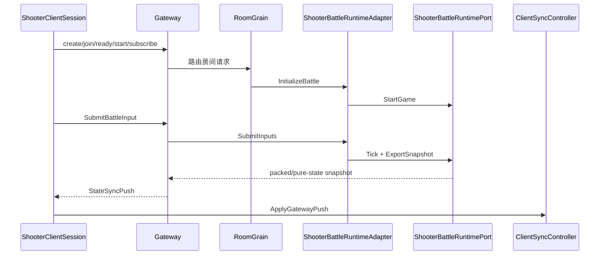

# Shooter Demo 专题总览

> Shooter 示例从单篇概览拆成多个专题。它重点展示 AbilityKit 在网络同步、服务端权威、Svelto 模拟、快照压缩、状态哈希、Gateway 房间流程、Orleans Grain 编排和烟测验收上的完整闭环。

## 1. 拆分理由

Shooter 示例包含多个独立设计点，并已进一步拆成客户端同步、网络模块、Svelto 性能模式、表现会话/视图管线、插值/混合预测与服务端验收深潜：

| 专题 | 关注点 | 文档 |
|------|--------|------|
| Runtime/Svelto | WorldBlueprint、RuntimePort、Svelto EntityManager、Simulation Tick | [01-Runtime、Svelto 与战斗模拟](01-RuntimeSveltoSimulation.md) |
| Snapshot/Hash | packed snapshot、pure-state snapshot、baseline/delta、state hash | [02-Snapshot、Hash 与同步模型](02-SnapshotHashSync.md) |
| Client Sync | ClientSession、InputCoordinator、SyncControllerFactory、预测/插值/混合同步 | [04-客户端同步策略](04-ClientSyncStrategies.md) |
| 网络模块 | Gateway Flow、FrameSyncCoordinator、Snapshot Controller、Lag Compensation、Reconnect | [08-网络模块深潜](08-NetworkModulesDeepDive.md) |
| Svelto 性能模式 | struct component、ExclusiveGroup、ScenarioRunner、Benchmark、预算诊断 | [09-Svelto 性能模式深潜](09-SveltoPerformanceModeDeepDive.md) |
| 表现会话与视图管线 | PresentationFacade、Session、Stream、Projection、Binder、Reconnect 驱动 | [10-PresentationSessionAndViewDeepDive.md](10-PresentationSessionAndViewDeepDive.md) |
| 插值与混合预测 | AuthoritativeInterpolation、HybridHeroPrediction、Diagnostics、DOTS Binder、TimeAnchor | [11-InterpolationAndPredictionDeepDive.md](11-InterpolationAndPredictionDeepDive.md) |
| Gateway/Orleans/Smoke | room flow、RoomGrain、BattleRuntimeAdapter、FrameSyncGrain、SmokeRunner | [05-服务端流程与 Smoke 深潜](05-ServerFlowAndSmokeDeepDive.md) |

## 2. 总体架构

```mermaid
flowchart TB
    subgraph Runtime[com.abilitykit.demo.shooter.runtime]
        Blueprint[ShooterBattleWorldBlueprint]
        Port[ShooterBattleRuntimePort]
        Svelto[ShooterEntityManager]
        Sim[ShooterBattleSimulation]
        Packed[ShooterPackedSnapshotExporter]
        Pure[ShooterPureStateSnapshotExporter]
        Hash[ShooterStateHasher]
        Lag[ShooterLagCompensationService]
        Bench[ShooterSveltoGameplayBenchmark]
    end

    subgraph View[com.abilitykit.demo.shooter.view.runtime]
        Session[ShooterClientSession]
        Input[ShooterClientInputCoordinator]
        Factory[ShooterClientSyncControllerFactory]
        PackedCtrl[ShooterPackedSnapshotSyncController]
        PureCtrl[ShooterPureStateSnapshotSyncController]
        RoomFlow[ShooterRoomGatewayFlow]
        Net[Network / Reconnect / FrameSync]
        Presentation[ShooterPresentationFacade]
        PresentationSession[ShooterPresentationSession]
        ViewStream[ShooterSnapshotStream]
        ViewProjection[ShooterSnapshotViewProjection]
        ViewBinder[ShooterSnapshotViewBinder]
        InterpCtrl[ShooterClientAuthoritativeInterpolationSyncController]
        HybridCtrl[ShooterClientHybridHeroPredictionSyncController]
        DotsBinder[ShooterDotsSnapshotViewBinder]
    end

    subgraph Orleans[Server/Orleans]
        Gateway[GatewayRequestRouter]
        Room[RoomGrain]
        RoomAdapter[ShooterRoomGameplayAdapter]
        BattleAdapter[ShooterBattleRuntimeAdapter]
        FrameSync[BattleFrameSyncGrain]
        Smoke[ShooterSmokeRunner]
    end

    Blueprint --> Port --> Sim
    Sim --> Svelto
    Port --> Packed
    Port --> Pure
    Port --> Hash
    Port --> Lag
    Port --> Bench
    Session --> Factory
    Factory --> PackedCtrl
    Factory --> PureCtrl
    Session --> RoomFlow
    RoomFlow --> Gateway --> Room
    Room --> RoomAdapter
    Room --> BattleAdapter --> Port
    Room --> FrameSync
    Smoke --> Gateway
    Smoke --> Session
    Session --> Net
    Session --> Presentation
    Presentation --> PresentationSession
    PresentationSession --> ViewStream
    ViewStream --> ViewProjection
    ViewProjection --> ViewBinder
    Factory --> InterpCtrl
    Factory --> HybridCtrl
    InterpCtrl --> Presentation
    HybridCtrl --> Presentation
    ViewProjection --> DotsBinder
```

## 3. 主闭环

## 4. 示例价值

Shooter 示例适合作为以下能力的参考实现：

- 服务端权威战斗；
- 客户端预测回滚；
- 权威插值同步；
- 大规模状态同步预算裁剪；
- late join 与 reconnect；
- snapshot stale ignore；
- 状态 hash 验证；
- Gateway + Orleans 的房间/战斗生命周期；
- Svelto struct component 批处理与大规模实体预算压测；
- 延迟补偿、网络质量模拟与快速重连；
- 表现层会话、快照流、插值播放与权威对比验收；
- Authoritative Interpolation、Hybrid Hero Prediction、DOTS View Binder 与时间锚点诊断。

## 5. 源码入口

| 主题 | 源码 |
|------|------|
| Runtime Port | `Unity/Packages/com.abilitykit.demo.shooter.runtime/Runtime/Application/Runtime/ShooterBattleRuntimePort.cs` |
| Simulation | `Unity/Packages/com.abilitykit.demo.shooter.runtime/Runtime/Domain/Battle/ShooterBattleSimulation.cs` |
| Packed Snapshot | `Unity/Packages/com.abilitykit.demo.shooter.runtime/Runtime/Application/Synchronization/ShooterPackedSnapshotExporter.cs` |
| Pure State Snapshot | `Unity/Packages/com.abilitykit.demo.shooter.runtime/Runtime/Application/Synchronization/ShooterPureStateSnapshotExporter.cs` |
| Lag Compensation | `Unity/Packages/com.abilitykit.demo.shooter.runtime/Runtime/Application/Synchronization/ShooterLagCompensationService.cs` |
| Svelto Scenario Runner | `Unity/Packages/com.abilitykit.demo.shooter.runtime/Runtime/Domain/Gameplay/ShooterSveltoGameplayScenarioRunner.cs` |
| Svelto Benchmark | `Unity/Packages/com.abilitykit.demo.shooter.runtime/Runtime/Domain/Gameplay/ShooterSveltoGameplayBenchmark.cs` |
| Client Session | `Unity/Packages/com.abilitykit.demo.shooter.view.runtime/Runtime/Client/ShooterClientSession.cs` |
| Presentation Facade | `Unity/Packages/com.abilitykit.demo.shooter.view.runtime/Runtime/Presentation/ShooterPresentationFacade.cs` |
| Presentation Session | `Unity/Packages/com.abilitykit.demo.shooter.view.runtime/Runtime/Presentation/Session/ShooterPresentationSession.cs` |
| Session Context | `Unity/Packages/com.abilitykit.demo.shooter.view.runtime/Runtime/Presentation/ShooterPresentationSessionContext.cs` |
| Snapshot Stream | `Unity/Packages/com.abilitykit.demo.shooter.view.runtime/Runtime/Presentation/Snapshot/ShooterSnapshotStream.cs` |
| View Projection | `Unity/Packages/com.abilitykit.demo.shooter.view.runtime/Runtime/Presentation/View/ShooterSnapshotViewProjection.cs` |
| View Binder | `Unity/Packages/com.abilitykit.demo.shooter.view.runtime/Runtime/Presentation/View/ShooterSnapshotViewBinder.cs` |
| Fast Reconnect Driver | `Unity/Packages/com.abilitykit.demo.shooter.view.runtime/Runtime/Client/Synchronization/ShooterFastReconnectDriver.cs` |
| Authoritative Comparison | `Unity/Packages/com.abilitykit.demo.shooter.view.runtime/Runtime/Client/Synchronization/ShooterAuthoritativeComparisonDriver.cs` |
| Authoritative Interpolation | `Unity/Packages/com.abilitykit.demo.shooter.view.runtime/Runtime/Client/Synchronization/ShooterClientAuthoritativeInterpolationSyncController.cs` |
| Hybrid Hero Prediction | `Unity/Packages/com.abilitykit.demo.shooter.view.runtime/Runtime/Client/Synchronization/ShooterClientHybridHeroPredictionSyncController.cs` |
| DOTS View Binder | `Unity/Packages/com.abilitykit.demo.shooter.view.runtime/Runtime/Presentation/View/ShooterDotsSnapshotViewBinder.cs` |
| Time Anchor Coordinator | `Unity/Packages/com.abilitykit.demo.shooter.view.runtime/Runtime/Client/Synchronization/ShooterTimeAnchorCoordinator.cs` |
| Room Flow | `Unity/Packages/com.abilitykit.demo.shooter.view.runtime/Runtime/Client/Gateway/ShooterRoomGatewayFlow.cs` |
| RoomGrain | `Server/Orleans/src/AbilityKit.Orleans.Grains/Rooms/RoomGrain.cs` |
| Battle Adapter | `Server/Orleans/src/AbilityKit.Orleans.Grains/Gameplays/Shooter/Battle/ShooterBattleRuntimeAdapter.cs` |
| Smoke Runner | `Server/Orleans/src/AbilityKit.Orleans.ShooterSmoke/Runner/ShooterSmokeRunner.cs` |
