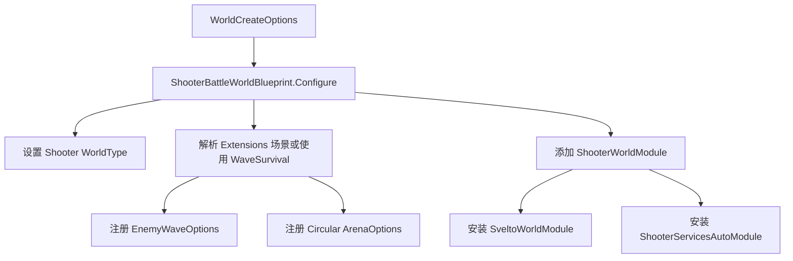
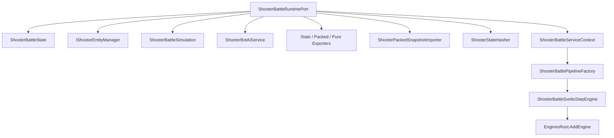
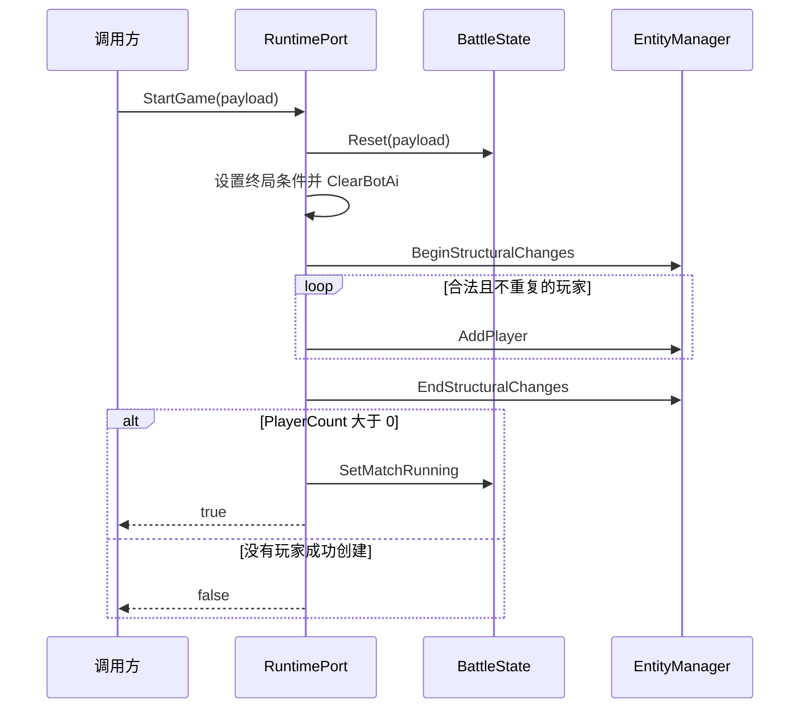
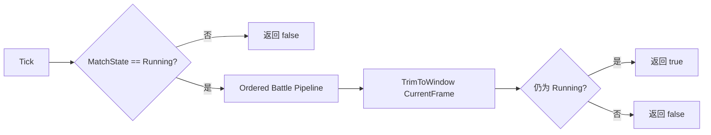
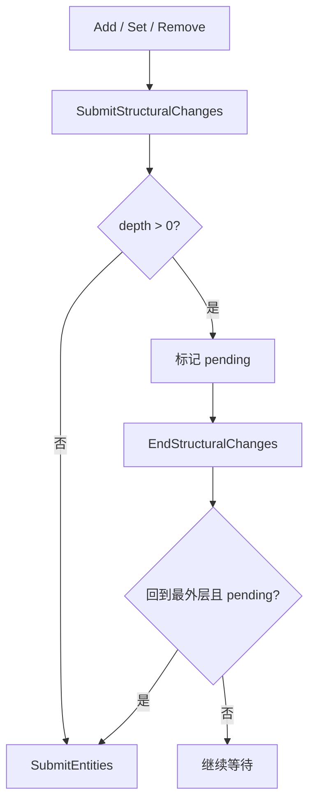
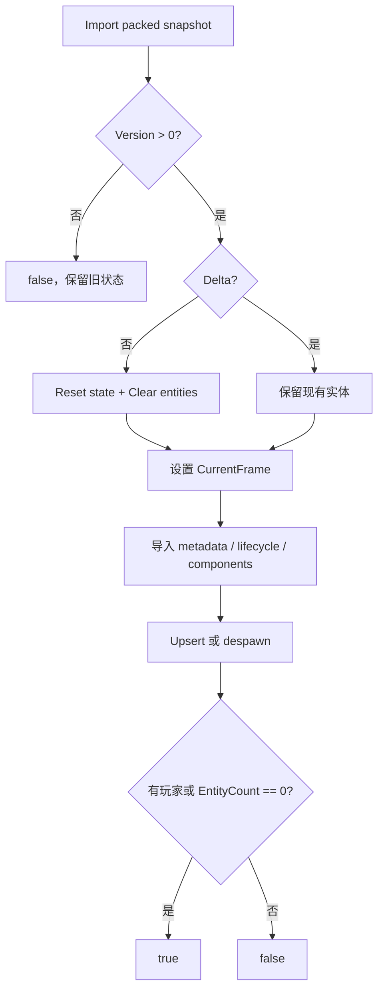

# Shooter Runtime、Svelto 装配与恢复边界

> 本文说明 Shooter 战斗世界如何装配、`ShooterBattleRuntimePort` 如何提供窄接口门面，以及 Svelto 实体结构变更、运行时生命周期、容量和 packed snapshot 恢复的真实边界。fixed tick 内部玩法顺序、命中、波次和 Bot AI 见 [Shooter 战斗玩法内核深潜](13-BattleGameplayKernelDeepDive.md)。

## 1. 能力定位

Shooter runtime 把客户端、Orleans 服务端、测试和 Smoke 共用的权威战斗能力收敛到同一个纯 C# world。它负责“世界如何建成、如何启动和恢复”，不负责网络传输策略或 Unity 表现绑定。

| 本文负责 | 本文不负责 |
|----------|------------|
| Blueprint 与 WorldModule 装配 | Gateway、Room、Battle Grain 编排 |
| RuntimePort 接口和依赖图 | packed/pure-state 网络预算与观察者基线 |
| StartGame、SubmitInput、Tick 生命周期 | projectile、波次、Bot AI 的玩法算法 |
| Svelto 结构变更提交 | Unity GameObject/DOTS 视图绑定 |
| 实体容量与 packed import 失败边界 | 客户端预测、插值与重连策略 |

核心设计不是让调用方操作 Svelto 集合，而是让调用方依赖启动、输入、时钟、快照和 hash 等窄接口。相同 runtime 因此可以被本地 world host、服务端 adapter 和 xUnit 测试直接复用。

## 2. World 创建与模块安装

`ShooterBattleWorldBlueprint.Configure` 是世界装配入口。它执行四类工作：

1. 固定 `WorldType = ShooterGameplay.WorldType`；
2. 未提供 `ServiceBuilder` 时创建 default-only 容器；
3. 从 `WorldCreateOptions.Extensions` 解析场景，缺省为 `WaveSurvival`；
4. 将场景转换成波次参数和圆形竞技场参数，再添加 `ShooterWorldModule`。



`ShooterWorldModule.Configure` 使用 `TryRegister` 提供默认参数，因此 Blueprint 预先注册的场景参数不会被覆盖。模块随后安装：

- `SveltoWorldModule`：提供 `ISveltoWorldContext`、`EnginesRoot` 和实体提交基础设施；
- `ShooterServicesAutoModule`：扫描并安装 Shooter 的 `[WorldService]` 服务。

这使场景配置保持在 world 创建边界，领域服务只消费已经解析的参数。

## 3. RuntimePort 是窄接口门面

`ShooterBattleRuntimePort` 是 singleton，并同时暴露以下接口：

| 接口 | 调用方能力 |
|------|------------|
| `IShooterBattleRuntimePort` | 聚合运行时入口 |
| `IShooterGameStartPort` | 启动或重置战斗 |
| `IShooterInputPort` | 向指定逻辑帧提交玩家命令 |
| `IShooterSimulationClock` | 推进一个 fixed tick |
| `IShooterSnapshotReadPort` | 读取面向业务的状态快照 |
| `IShooterStateHashProvider` | 计算当前权威状态 hash |
| `IShooterPackedSnapshotPort` | packed full/delta 导入导出 |
| `IShooterPureStateSnapshotPort` | 导出 pure-state 投影 |

Orleans adapter、客户端 session 和测试可以只解析自己需要的接口，不必依赖 `ShooterBattleState` 或 `ShooterEntityManager` 的内部结构。

RuntimePort 构造阶段会连接状态、玩法和同步服务，并把有序 step engine 加入 Svelto `EnginesRoot`：



## 4. StartGame 生命周期

`StartGame` 不是在旧状态上增量补玩家，而是一次完整重置：

1. `ShooterBattleState.Reset(spec)` 清除玩家、projectile、enemy、输入、事件、待清理敌人、bullet id、当前帧和终局元数据；
2. 设置胜利目标和时间限制；
3. 清空已挂载 Bot AI；
4. 在一个 structural-change 批次中创建 id 合法且不重复的起始玩家；
5. 仅当最终 `PlayerCount > 0` 时将比赛设为 `Running` 并返回 `true`。



`Reset` 会破坏旧战斗状态，因此调用方不能把失败的 `StartGame` 当作无副作用校验。输入中的空命令、未启动 runtime 或未知 player id 不会被 `SubmitInput` 接受。

## 5. Tick 的完整边界

`Tick(deltaTime)` 只有在 `MatchState == Running` 时执行。它调用的是完整 `ShooterBattleSveltoStepEngine`，之后再按当前帧裁剪输入窗口。



完整管线包含 FrameBegin、Bot AI、敌人生成、敌人移动、Simulation、死亡清理、敌人攻击和 MatchState。`ShooterBattleSimulation.Tick` 仅是其中 order 200 的 Simulation 系统，其内部再分玩家和 projectile 两个结构变更批次；它不等于整个 runtime Tick。

终局帧有一个容易误判的返回语义：该帧所有系统已经执行，MatchState 也已写入 Victory、Defeat 或 Ended，但因为运行时不再是 Running，本次 `Tick` 返回 `false`。调用方应在收到 `false` 后读取 match result，而不是认为该帧没有执行。

玩法系统的精确 order 和顺序影响见 [Shooter 战斗玩法内核深潜](13-BattleGameplayKernelDeepDive.md)。

## 6. Svelto 结构变更

`ShooterEntityManager` 管理 player、projectile、enemy 三类实体 id，并用深度计数合并结构提交：

- `BeginStructuralChanges()` 增加 `_structuralChangeDepth`；
- 批次内 `SubmitStructuralChanges()` 只设置 `_hasPendingStructuralChanges`；
- 最外层 `EndStructuralChanges()` 才调用 `_context.SubmitEntities()`；
- 无批次时的结构变更可以立即提交。



`StartGame`、玩家模拟、projectile 模拟和敌人 cleanup 都使用 `try/finally` 关闭批次。新增类似遍历并增删实体的逻辑时，也必须保持这一模式，否则异常会遗留错误 depth，后续结构变更可能永远不提交。

## 7. 实体容量是静默截断

`ShooterEntityLimitOptions` 的默认最大实体数是 10000，预算按 player、projectile、enemy 总数共同计算。达到上限时：

- `AddPlayer`、`AddProjectile`、`AddEnemy` 直接返回；
- 不抛异常；
- 不返回失败状态；
- 调用方发出 Add 不代表实体已经存在。

测试证明最大实体数设为 2、起始玩家有 3 名时，只有前两名落地，但 `StartGame` 仍返回 `true`，因为最终至少存在一个玩家。

这会形成三类工程约束：

1. 需要强一致创建结果的调用方必须在 Add 后用 `Has*`、`TryGet*` 或计数核验；
2. 开火事件和实体创建之间不能仅靠“调用过 Add”推断一致性；
3. 容量接近上限时应依赖诊断和压测提前告警，而不是等待异常。

## 8. Packed snapshot 恢复语义

`ShooterPackedSnapshotImporter.Import` 支持 full 和 delta，但两者不是同一种事务语义。

| 场景 | 行为 |
|------|------|
| `Version <= 0` | 立即返回 `false`，不重置当前状态 |
| full snapshot | 先 `Reset(default)` 并清空全部实体，再导入 metadata 和 component chunks |
| delta snapshot | 不重置世界，只更新出现的组件；未提及实体继续保留 |
| lifecycle despawn | 删除对应 projectile 或 enemy |
| projectile 恢复 | 推进 bullet id allocator，避免后续 id 冲突 |
| 最终返回 | 有玩家，或声明的 `EntityCount == 0` 时返回 `true` |



必须注意三个失败边界：

- full import 在完整验证所有 chunk 之前已经清空旧状态；后续返回 `false` 时不会自动回滚，所以它不是事务性操作；
- importer 不校验 payload 的 `StateHash`；`true` 只表示达到了当前结构成功条件，不表示来源可信或状态 hash 一致；
- delta 不删除未提及实体，删除必须通过 lifecycle 的 `Despawned` 标记显式表达。

权威恢复路径应在调用 importer 前校验来源、版本和协议边界，在导入后独立比较 hash 或业务快照；需要无损失败时，应在临时 runtime 中验证后再切换。

## 9. 可执行证据

| 证据 | 覆盖内容 |
|------|----------|
| `ShooterWorldModuleTests` | Blueprint/WorldModule 装配、WorldHost 驱动、Svelto 增量写入和玩法 smoke |
| `ShooterEntityLimitOptionsTests` | 默认 10000 容量、自定义容量和起始玩家静默截断 |
| `ShooterPackedSnapshotRuntimeTests` | full roundtrip、delta 保留实体、despawn、终局 metadata 和多 delta 稳定性 |
| `ShooterDeterministicReplayTests` | 相同输入重放、full checkpoint 导入后续跑与连续运行一致 |
| `ShooterBotAiRuntimeSmokeTests` | Bot 挂载、追踪和通过输入缓冲开火 |

聚焦验证命令：

```powershell
dotnet test src/AbilityKit.Demo.Shooter.Runtime.Tests/AbilityKit.Demo.Shooter.Runtime.Tests.csproj --filter "FullyQualifiedName~ShooterWorldModuleTests|FullyQualifiedName~ShooterEntityLimitOptionsTests|FullyQualifiedName~ShooterPackedSnapshotRuntimeTests|FullyQualifiedName~ShooterDeterministicReplayTests|FullyQualifiedName~ShooterBotAiRuntimeSmokeTests"
```

## 10. 源码阅读路径

1. `Unity/Packages/com.abilitykit.demo.shooter.runtime/Runtime/Worlds/ShooterBattleWorldBlueprint.cs`
2. `Unity/Packages/com.abilitykit.demo.shooter.runtime/Runtime/Worlds/ShooterWorldModule.cs`
3. `Unity/Packages/com.abilitykit.demo.shooter.runtime/Runtime/Application/Runtime/ShooterBattleRuntimePort.cs`
4. `Unity/Packages/com.abilitykit.demo.shooter.runtime/Runtime/Domain/Battle/ShooterBattleState.cs`
5. `Unity/Packages/com.abilitykit.demo.shooter.runtime/Runtime/Application/Services/EntityManager/ShooterEntityManager.cs`
6. `Unity/Packages/com.abilitykit.demo.shooter.runtime/Runtime/Domain/Battle/Factories/ShooterBattlePipelineFactory.cs`
7. `Unity/Packages/com.abilitykit.demo.shooter.runtime/Runtime/Domain/Battle/ShooterBattleSimulation.cs`
8. `Unity/Packages/com.abilitykit.demo.shooter.runtime/Runtime/Application/Synchronization/ShooterPackedSnapshotImporter.cs`
9. `src/AbilityKit.Demo.Shooter.Runtime.Tests/Worlds/ShooterWorldModuleTests.cs`
10. `src/AbilityKit.Demo.Shooter.Runtime.Tests/Application/Runtime/ShooterEntityLimitOptionsTests.cs`
11. `src/AbilityKit.Demo.Shooter.Runtime.Tests/Application/Runtime/ShooterPackedSnapshotRuntimeTests.cs`
12. `src/AbilityKit.Demo.Shooter.Runtime.Tests/Application/Runtime/ShooterDeterministicReplayTests.cs`
